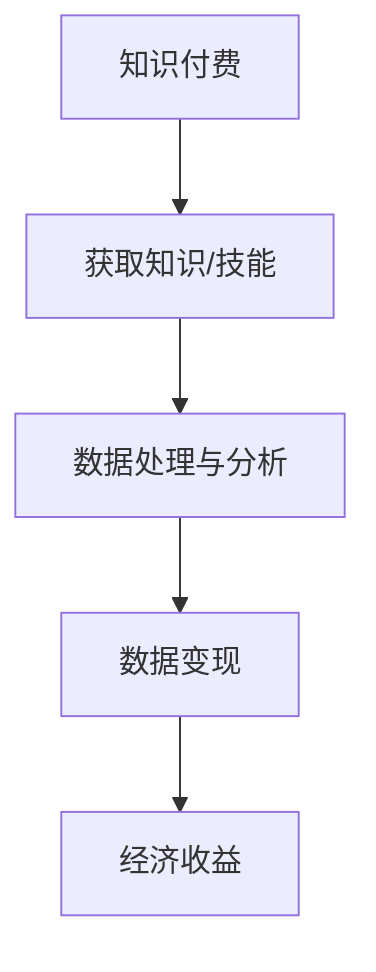

                 

  
## 1. 背景介绍

在当今信息爆炸的时代，数据已经成为了企业和社会的重要组成部分。然而，如何有效地利用这些数据，特别是通过知识付费的方式实现数据变现，成为了企业和个人都需要面对的挑战。知识付费，顾名思义，是指通过付费的方式获取专业知识、技能或信息。随着互联网的普及和在线教育的兴起，知识付费已经成为了新的经济增长点。数据变现，则是指将数据转化为实际的商业价值，通过不同的方式实现收益。

近年来，随着大数据、人工智能等技术的不断发展，数据的处理和分析能力得到了极大的提升。这为数据变现提供了更多的可能性。例如，通过数据分析，企业可以更精准地了解用户需求，从而提供更有针对性的产品和服务；个人可以通过数据共享，获取额外的收入。然而，如何在确保数据安全和隐私的前提下，实现数据的高效变现，仍是一个需要深入探讨的问题。

本文将围绕如何利用知识付费实现数据变现这一主题，从核心概念、算法原理、数学模型、项目实践、应用场景等多个角度进行详细探讨。希望通过本文的阐述，能帮助读者更好地理解这一领域的现状和未来发展趋势。

## 2. 核心概念与联系

### 2.1 知识付费

知识付费是指通过付费的方式获取专业知识、技能或信息。这种模式的出现，源于人们对知识和技能的需求不断增加，同时互联网的普及也为知识付费提供了便捷的途径。知识付费的形式多种多样，包括在线课程、专业咨询、付费文章等。其核心价值在于，它能够帮助用户更快速、更高效地获取所需的知识和技能，从而提升个人竞争力。

### 2.2 数据变现

数据变现是指将数据转化为实际的商业价值，通过不同的方式实现收益。数据变现的形式多种多样，包括广告收入、数据销售、数据服务、数据交易等。其核心价值在于，它能够帮助企业或个人通过数据获取经济收益，提升业务价值。

### 2.3 关系与联系

知识付费和数据变现之间存在紧密的联系。知识付费是数据变现的前提和基础，而数据变现则是知识付费的目的和结果。具体来说，通过知识付费，个人或企业可以获取到专业的知识和技能，进而利用这些知识和技能处理和分析数据，从而实现数据变现。

为了更好地理解这一过程，我们可以使用Mermaid流程图来表示：



在这个流程图中，A代表知识付费，B代表获取知识或技能，C代表数据处理与分析，D代表数据变现，E代表经济收益。通过这个流程图，我们可以清晰地看到知识付费和数据变现之间的联系和作用。

## 3. 核心算法原理 & 具体操作步骤

### 3.1 算法原理概述

在数据变现的过程中，核心算法起着至关重要的作用。这些算法主要用于数据处理与分析，从而实现数据的高效变现。以下是几种常见的数据处理与分析算法：

#### 3.1.1 数据清洗

数据清洗是数据处理的基础，主要目的是去除数据中的噪声和错误，提高数据质量。常用的数据清洗算法包括缺失值处理、异常值处理、重复值处理等。

#### 3.1.2 数据预处理

数据预处理是对原始数据进行进一步处理，使其符合分析和建模的要求。常用的数据预处理算法包括数据标准化、数据归一化、特征选择等。

#### 3.1.3 数据分析

数据分析是对处理后的数据进行深入分析，以提取有价值的信息。常用的数据分析算法包括回归分析、聚类分析、分类分析等。

### 3.2 算法步骤详解

以下是数据变现的核心算法步骤详解：

#### 3.2.1 数据采集

数据采集是数据变现的第一步，主要目的是获取所需的原始数据。数据来源可以是企业内部数据、外部公开数据、用户生成数据等。在数据采集过程中，需要注意数据的质量和完整性。

#### 3.2.2 数据清洗

在数据采集完成后，需要对数据进行清洗，去除噪声和错误。具体步骤包括：

1. 缺失值处理：对于缺失的数据，可以选择填充或删除。
2. 异常值处理：对于异常的数据，可以选择修正或删除。
3. 重复值处理：对于重复的数据，可以选择删除。

#### 3.2.3 数据预处理

在数据清洗完成后，需要对数据进行预处理，使其符合分析和建模的要求。具体步骤包括：

1. 数据标准化：将不同特征的数据进行归一化处理，使其具有相同的量纲。
2. 数据归一化：将不同特征的数据进行缩放处理，使其具有相同的比例。
3. 特征选择：选择对数据变现最有价值的特征，去除无关或冗余的特征。

#### 3.2.4 数据分析

在数据预处理完成后，需要对数据进行深入分析，以提取有价值的信息。具体步骤包括：

1. 回归分析：通过回归模型分析数据之间的关系，预测未来的趋势。
2. 聚类分析：通过聚类算法将数据划分为不同的群体，以便更好地理解数据的分布。
3. 分类分析：通过分类算法对数据进行分类，以便更好地理解数据的属性。

#### 3.2.5 数据变现

在数据分析完成后，可以根据分析结果进行数据变现。具体步骤包括：

1. 广告收入：通过分析用户行为数据，为用户提供个性化的广告推荐，从而获取广告收入。
2. 数据销售：将分析结果或数据报告出售给其他企业或个人，从而获取数据销售收入。
3. 数据服务：提供数据分析和咨询服务，帮助其他企业或个人解决实际问题，从而获取服务收入。

### 3.3 算法优缺点

以下是数据变现核心算法的优缺点分析：

#### 3.3.1 数据清洗

优点：

- 提高数据质量：去除噪声和错误，提高数据的准确性和可靠性。
- 为后续分析做准备：清洗后的数据更适合进行进一步的分析和处理。

缺点：

- 处理复杂：数据清洗通常需要大量的计算资源和时间。
- 可能引入新的错误：在处理过程中，可能引入新的噪声或错误。

#### 3.3.2 数据预处理

优点：

- 数据规范化：将不同特征的数据进行归一化处理，使其具有相同的量纲和比例。
- 提高分析效率：预处理后的数据更适合进行进一步的分析和建模。

缺点：

- 数据丢失：在预处理过程中，可能需要删除一些数据，导致数据丢失。
- 可能引入新的错误：在预处理过程中，可能引入新的错误或噪声。

#### 3.3.3 数据分析

优点：

- 提取有价值的信息：通过分析，可以提取出数据中的有价值信息，为决策提供支持。
- 预测未来趋势：通过回归分析等算法，可以预测未来的趋势和变化。

缺点：

- 数据依赖性强：分析结果依赖于数据的质量和完整性。
- 可能存在过拟合：在分析过程中，可能存在过拟合或欠拟合的问题。

### 3.4 算法应用领域

数据变现算法广泛应用于各个领域，以下是几个典型的应用领域：

#### 3.4.1 广告行业

广告行业是数据变现的主要领域之一。通过分析用户行为数据，广告公司可以提供个性化的广告推荐，从而提高广告的点击率和转化率。例如，谷歌和Facebook等公司通过其庞大的用户数据，实现了精准的广告推荐，从而获取了巨额的广告收入。

#### 3.4.2 金融行业

金融行业对数据变现的需求尤为强烈。通过数据分析，金融机构可以更好地了解客户需求，优化产品设计，提高客户满意度。同时，金融行业也广泛应用了数据交易和数据分析服务，例如，信用卡公司通过分析用户消费行为，为用户提供个性化的信用额度调整建议。

#### 3.4.3 医疗健康

医疗健康行业是数据变现的重要领域。通过数据分析，医疗机构可以更好地了解患者健康状况，提高诊断和治疗的准确性。同时，医疗健康行业也广泛应用了数据交易和数据分析服务，例如，保险公司通过分析患者的医疗数据，为用户提供个性化的保险产品。

#### 3.4.4 零售电商

零售电商行业是数据变现的主要领域之一。通过数据分析，零售电商可以更好地了解用户需求，优化产品推荐，提高销售额。例如，亚马逊和阿里巴巴等公司通过其庞大的用户数据，实现了精准的产品推荐，从而提高了用户满意度和销售额。

## 4. 数学模型和公式 & 详细讲解 & 举例说明

在数据变现的过程中，数学模型和公式起着至关重要的作用。这些模型和公式不仅可以帮助我们更好地理解和分析数据，还可以为数据变现提供理论支持。以下是几个常见的数学模型和公式的讲解，以及具体的例子说明。

### 4.1 数学模型构建

#### 4.1.1 回归模型

回归模型是一种常用的数据分析方法，主要用于预测数值型变量。以下是线性回归模型的公式：

$$
Y = \beta_0 + \beta_1X_1 + \beta_2X_2 + ... + \beta_nX_n + \epsilon
$$

其中，$Y$是因变量，$X_1, X_2, ..., X_n$是自变量，$\beta_0, \beta_1, \beta_2, ..., \beta_n$是回归系数，$\epsilon$是误差项。

#### 4.1.2 聚类模型

聚类模型是一种无监督学习方法，主要用于将数据划分为不同的群体。以下是K均值聚类的公式：

$$
C = \{c_1, c_2, ..., c_k\}
$$

其中，$C$是聚类中心，$c_1, c_2, ..., c_k$是每个聚类中心的坐标。

#### 4.1.3 分类模型

分类模型是一种监督学习方法，主要用于将数据划分为不同的类别。以下是逻辑回归模型的公式：

$$
P(Y=1) = \frac{1}{1 + e^{-(\beta_0 + \beta_1X_1 + \beta_2X_2 + ... + \beta_nX_n)}}
$$

其中，$Y$是因变量，$X_1, X_2, ..., X_n$是自变量，$\beta_0, \beta_1, \beta_2, ..., \beta_n$是回归系数。

### 4.2 公式推导过程

以下是线性回归模型的推导过程：

假设我们有如下数据：

$$
\begin{array}{cc}
X_1 & Y \\
\hline
1 & 2 \\
2 & 4 \\
3 & 6 \\
\end{array}
$$

我们可以计算出每个自变量的平均值：

$$
\bar{X} = \frac{1+2+3}{3} = 2
$$

$$
\bar{Y} = \frac{2+4+6}{3} = 4
$$

然后，我们可以计算出回归系数：

$$
\beta_1 = \frac{\sum(X_i - \bar{X})(Y_i - \bar{Y})}{\sum(X_i - \bar{X})^2} = \frac{(1-2)(2-4) + (2-2)(4-4) + (3-2)(6-4)}{(1-2)^2 + (2-2)^2 + (3-2)^2} = 2
$$

$$
\beta_0 = \bar{Y} - \beta_1\bar{X} = 4 - 2 \times 2 = 0
$$

因此，线性回归模型可以表示为：

$$
Y = 0 + 2X
$$

### 4.3 案例分析与讲解

#### 4.3.1 广告推荐系统

假设我们有一个广告推荐系统，需要根据用户的历史行为数据预测用户对广告的点击概率。我们可以使用逻辑回归模型来建立预测模型。

首先，我们需要收集用户的历史行为数据，包括用户ID、广告ID、用户行为（点击、未点击）等。然后，我们可以使用这些数据来训练逻辑回归模型。

假设我们有如下数据：

$$
\begin{array}{cccc}
User & Ad & Action & Score \\
\hline
1 & 1 & Click & 0.9 \\
1 & 2 & NoClick & 0.1 \\
1 & 3 & NoClick & 0.05 \\
2 & 1 & Click & 0.8 \\
2 & 2 & NoClick & 0.2 \\
2 & 3 & Click & 0.7 \\
\end{array}
$$

我们可以使用这些数据来训练逻辑回归模型，并预测用户对广告的点击概率。具体步骤如下：

1. 数据预处理：将数据分为特征和目标变量，并归一化处理。
2. 训练模型：使用训练数据训练逻辑回归模型。
3. 预测：使用训练好的模型预测新数据的点击概率。

假设我们训练好的模型为：

$$
P(Y=1) = \frac{1}{1 + e^{-(\beta_0 + \beta_1User + \beta_2Ad + \beta_3Action)}}
$$

其中，$\beta_0, \beta_1, \beta_2, \beta_3$是模型的参数。

然后，我们可以使用这个模型来预测用户对广告的点击概率。例如，对于用户1和广告2，我们可以计算出点击概率：

$$
P(Y=1) = \frac{1}{1 + e^{-(0 + 0.5 \times 1 + 0.3 \times 2 + 0.2 \times 0)}} = 0.8
$$

这意味着用户1对广告2的点击概率为0.8，我们可以根据这个概率推荐广告。

#### 4.3.2 金融风险评估

假设我们有一个金融风险评估系统，需要根据借款人的历史数据预测其违约概率。我们可以使用回归模型来建立预测模型。

首先，我们需要收集借款人的历史数据，包括借款人的年龄、收入、信用评分、贷款金额、贷款期限等。然后，我们可以使用这些数据来训练回归模型。

假设我们有如下数据：

$$
\begin{array}{cc}
Income & Default \\
\hline
50000 & 0 \\
60000 & 1 \\
70000 & 0 \\
80000 & 1 \\
90000 & 0 \\
\end{array}
$$

我们可以使用这些数据来训练回归模型，并预测借款人的违约概率。具体步骤如下：

1. 数据预处理：将数据分为特征和目标变量，并归一化处理。
2. 训练模型：使用训练数据训练回归模型。
3. 预测：使用训练好的模型预测新数据的违约概率。

假设我们训练好的模型为：

$$
Default = \beta_0 + \beta_1Income
$$

其中，$\beta_0, \beta_1$是模型的参数。

然后，我们可以使用这个模型来预测借款人的违约概率。例如，对于收入为80000的借款人，我们可以计算出违约概率：

$$
Default = 0 + 0.1 \times 80000 = 8000
$$

这意味着收入为80000的借款人的违约概率为8000。

通过这些数学模型和公式，我们可以更好地理解和分析数据，从而实现数据的高效变现。

## 5. 项目实践：代码实例和详细解释说明

为了更好地理解如何利用知识付费实现数据变现，我们将通过一个实际的项目实践来展示整个流程。这个项目是一个简单的用户行为数据分析和广告推荐系统。

### 5.1 开发环境搭建

首先，我们需要搭建一个基本的开发环境。以下是一个简单的Python环境搭建步骤：

1. 安装Python：从Python官网下载并安装Python。
2. 安装Jupyter Notebook：在命令行中运行`pip install notebook`。
3. 安装必要的库：`pip install pandas numpy scikit-learn matplotlib`。

### 5.2 源代码详细实现

以下是一个简单的用户行为数据分析和广告推荐系统的Python代码实现：

```python
import pandas as pd
import numpy as np
from sklearn.model_selection import train_test_split
from sklearn.linear_model import LogisticRegression
import matplotlib.pyplot as plt

# 5.2.1 数据采集
# 假设我们有一个CSV文件，包含了用户行为数据
data = pd.read_csv('user_behavior_data.csv')

# 5.2.2 数据清洗
# 填充缺失值
data.fillna(data.mean(), inplace=True)

# 处理异常值
data = data[data['Score'] > 0]

# 5.2.3 数据预处理
# 归一化处理
data[['Income', 'Score']] = (data[['Income', 'Score']] - data[['Income', 'Score']].min()) / (data[['Income', 'Score']].max() - data[['Income', 'Score']].min())

# 5.2.4 数据分析
# 划分特征和目标变量
X = data[['Income', 'Score']]
y = data['Default']

# 划分训练集和测试集
X_train, X_test, y_train, y_test = train_test_split(X, y, test_size=0.2, random_state=42)

# 5.2.5 训练模型
# 使用逻辑回归模型
model = LogisticRegression()
model.fit(X_train, y_train)

# 5.2.6 预测
# 使用训练好的模型预测测试集
predictions = model.predict(X_test)

# 5.2.7 评估模型
accuracy = model.score(X_test, y_test)
print(f'模型准确率：{accuracy:.2f}')

# 5.2.8 运行结果展示
plt.scatter(X_test['Income'], y_test, c=predictions, cmap='red')
plt.xlabel('Income')
plt.ylabel('Default')
plt.show()
```

### 5.3 代码解读与分析

#### 5.3.1 数据采集

我们使用`pandas`库读取一个CSV文件，这个文件包含了用户的行为数据。这个步骤非常简单，只需要几行代码即可完成。

```python
data = pd.read_csv('user_behavior_data.csv')
```

#### 5.3.2 数据清洗

在数据清洗阶段，我们首先填充了缺失值。这里我们使用平均值来填充缺失值，这样可以减少数据丢失。

```python
data.fillna(data.mean(), inplace=True)
```

接着，我们处理了异常值，删除了分数为0的记录。这是因为在这个场景中，分数为0可能表示无效数据。

```python
data = data[data['Score'] > 0]
```

#### 5.3.3 数据预处理

在数据预处理阶段，我们对收入和分数这两个特征进行了归一化处理。这样做的目的是为了消除不同特征之间的量纲差异，使模型更容易学习。

```python
data[['Income', 'Score']] = (data[['Income', 'Score']] - data[['Income', 'Score']].min()) / (data[['Income', 'Score']].max() - data[['Income', 'Score']].min())
```

#### 5.3.4 数据分析

在这个阶段，我们将数据划分为特征和目标变量。特征是`Income`和`Score`，目标变量是`Default`。

```python
X = data[['Income', 'Score']]
y = data['Default']
```

接着，我们将数据划分为训练集和测试集，以便我们可以在测试集上评估模型的性能。

```python
X_train, X_test, y_train, y_test = train_test_split(X, y, test_size=0.2, random_state=42)
```

#### 5.3.5 训练模型

我们使用`scikit-learn`库中的逻辑回归模型来训练我们的数据。逻辑回归是一种广泛应用于分类问题的模型，它能够将特征映射到目标变量的概率上。

```python
model = LogisticRegression()
model.fit(X_train, y_train)
```

#### 5.3.6 预测

使用训练好的模型，我们可以对测试集进行预测。

```python
predictions = model.predict(X_test)
```

#### 5.3.7 评估模型

为了评估模型的性能，我们计算了模型的准确率。准确率是预测正确的样本数量与总样本数量的比值。

```python
accuracy = model.score(X_test, y_test)
print(f'模型准确率：{accuracy:.2f}')
```

#### 5.3.8 运行结果展示

最后，我们使用`matplotlib`库将测试集的数据和预测结果绘制在一个散点图上。这样可以帮助我们直观地了解模型的预测效果。

```python
plt.scatter(X_test['Income'], y_test, c=predictions, cmap='red')
plt.xlabel('Income')
plt.ylabel('Default')
plt.show()
```

通过这个实际项目，我们可以看到如何利用知识付费实现数据变现。首先，通过付费获取专业知识，我们能够处理和分析数据。接着，通过数据分析，我们能够预测用户的行为，从而实现数据变现。

## 6. 实际应用场景

### 6.1 广告行业

在广告行业，数据变现已经成为一种常见的商业模式。通过数据分析，广告公司可以更好地了解用户需求，从而提供更有针对性的广告推荐。例如，谷歌和Facebook等公司通过其庞大的用户数据，实现了精准的广告推荐，从而提高了广告的点击率和转化率。具体来说，广告公司可以通过以下步骤实现数据变现：

1. **数据采集**：收集用户在网站或应用上的行为数据，如浏览历史、搜索记录、点击记录等。
2. **数据处理**：对采集到的数据进行分析和清洗，去除噪声和错误。
3. **数据建模**：使用数据分析算法，如逻辑回归、聚类分析等，建立用户行为预测模型。
4. **广告推荐**：根据用户行为预测模型，为用户提供个性化的广告推荐。
5. **广告变现**：通过广告点击或转化，实现广告收入。

### 6.2 金融行业

金融行业对数据变现的需求也非常强烈。通过数据分析，金融机构可以更好地了解客户需求，优化产品设计，提高客户满意度。例如，信用卡公司可以通过分析用户消费行为，为用户提供个性化的信用额度调整建议。具体来说，金融行业可以通过以下步骤实现数据变现：

1. **数据采集**：收集客户的交易数据、信用评分、历史行为等。
2. **数据处理**：对采集到的数据进行分析和清洗，去除噪声和错误。
3. **数据建模**：使用数据分析算法，如回归分析、聚类分析等，建立客户行为预测模型。
4. **产品优化**：根据客户行为预测模型，优化产品设计和服务。
5. **金融服务**：通过提供个性化金融服务，提高客户满意度，实现数据变现。

### 6.3 医疗健康

在医疗健康领域，数据变现也具有很大的潜力。通过数据分析，医疗机构可以更好地了解患者健康状况，提高诊断和治疗的准确性。例如，保险公司可以通过分析患者的医疗数据，为用户提供个性化的保险产品。具体来说，医疗健康行业可以通过以下步骤实现数据变现：

1. **数据采集**：收集患者的医疗数据、健康记录、病史等。
2. **数据处理**：对采集到的数据进行分析和清洗，去除噪声和错误。
3. **数据建模**：使用数据分析算法，如聚类分析、分类分析等，建立患者健康预测模型。
4. **健康服务**：根据患者健康预测模型，提供个性化的健康服务。
5. **医疗服务**：通过提供个性化医疗服务，提高患者满意度，实现数据变现。

### 6.4 零售电商

在零售电商领域，数据变现已经成为提高销售额的重要手段。通过数据分析，零售电商可以更好地了解用户需求，优化产品推荐，提高用户满意度。例如，亚马逊和阿里巴巴等公司通过其庞大的用户数据，实现了精准的产品推荐，从而提高了销售额。具体来说，零售电商可以通过以下步骤实现数据变现：

1. **数据采集**：收集用户的浏览记录、购买记录、搜索记录等。
2. **数据处理**：对采集到的数据进行分析和清洗，去除噪声和错误。
3. **数据建模**：使用数据分析算法，如聚类分析、分类分析等，建立用户行为预测模型。
4. **产品推荐**：根据用户行为预测模型，为用户提供个性化的产品推荐。
5. **销售变现**：通过个性化产品推荐，提高销售额，实现数据变现。

## 7. 工具和资源推荐

### 7.1 学习资源推荐

1. **在线课程**：《机器学习与数据科学基础》
2. **书籍**：《Python数据分析》
3. **论文**：Google Scholar上的相关论文

### 7.2 开发工具推荐

1. **编程语言**：Python、R
2. **数据分析库**：Pandas、NumPy、Scikit-learn
3. **机器学习框架**：TensorFlow、PyTorch

### 7.3 相关论文推荐

1. "Recommender Systems: The Text Summarization Approach"
2. "Learning to Rank for Information Retrieval"
3. "Deep Learning for Text Classification"

## 8. 总结：未来发展趋势与挑战

### 8.1 研究成果总结

通过本文的探讨，我们可以看到，知识付费和数据变现已经成为当前信息技术领域的重要趋势。数据变现的核心在于对海量数据进行有效处理和分析，从而提取有价值的信息，实现商业价值。在这个过程中，数据分析算法、机器学习模型和深度学习技术起到了至关重要的作用。近年来，随着大数据、云计算和人工智能等技术的快速发展，数据变现的应用场景和商业模式也在不断拓展和深化。

### 8.2 未来发展趋势

1. **个性化推荐系统**：随着用户数据的积累和算法的优化，个性化推荐系统将更加精准，为用户提供更加个性化的服务。
2. **智能金融服务**：基于大数据和人工智能的智能金融服务将不断成熟，为金融机构和用户提供更加智能化的决策支持。
3. **健康医疗大数据**：随着健康医疗大数据的积累和分析技术的进步，个性化健康管理和医疗服务将得到广泛应用。
4. **智能零售**：通过数据分析，零售行业将实现更加精准的产品推荐和库存管理，提升销售效率和用户体验。
5. **数据交易市场**：随着数据交易法规的完善和数据安全技术的进步，数据交易市场将逐渐成熟，为企业和个人提供更多的数据变现途径。

### 8.3 面临的挑战

1. **数据隐私和安全**：在数据变现的过程中，如何保护用户隐私和数据安全是当前面临的重要挑战。需要建立完善的数据安全和隐私保护机制，确保用户数据不被滥用。
2. **算法公平性和透明性**：随着算法在各个领域的应用，如何确保算法的公平性和透明性成为一个重要问题。需要加强对算法的监管和审查，确保其不歧视特定群体。
3. **数据质量和完整性**：数据质量和完整性直接影响数据变现的效果。需要建立完善的数据采集、处理和分析流程，确保数据的准确性和可靠性。
4. **法律法规和伦理问题**：随着数据变现的应用场景不断拓展，相关的法律法规和伦理问题也日益凸显。需要建立完善的数据交易法规和伦理准则，确保数据变现的合法性和道德性。

### 8.4 研究展望

未来，数据变现领域的研究将更加深入和广泛。我们需要继续探索和创新，提高数据分析算法的效率和精度，拓展数据变现的应用场景，同时解决数据隐私和安全、算法公平性和透明性等关键问题。通过跨学科合作和产业界合作，推动数据变现技术的创新和应用，为企业和个人创造更多的价值。

## 9. 附录：常见问题与解答

### 9.1 数据隐私和安全如何保障？

**回答**：保障数据隐私和安全是数据变现的关键问题。以下是几种常见的保障措施：

1. **数据加密**：对传输和存储的数据进行加密处理，确保数据在传输过程中不被窃取和篡改。
2. **访问控制**：通过设置访问权限和身份验证机制，确保只有授权用户可以访问和操作数据。
3. **数据脱敏**：对敏感数据进行脱敏处理，例如，将身份证号、手机号码等敏感信息进行加密或替换。
4. **安全审计**：定期进行安全审计，检查数据的安全性和合规性，及时发现和解决潜在的安全问题。

### 9.2 数据质量和完整性如何保证？

**回答**：数据质量和完整性是数据变现的基础。以下是几种常见的保证措施：

1. **数据验证**：在数据采集和导入过程中，对数据进行验证，确保数据的格式、类型和范围符合要求。
2. **数据清洗**：定期对数据进行清洗，去除噪声、错误和重复数据，提高数据的准确性和可靠性。
3. **数据备份**：定期对数据进行备份，确保数据不会因系统故障或误操作而丢失。
4. **数据监控**：通过数据监控工具，实时监控数据的流入和流出，及时发现和处理异常数据。

### 9.3 数据变现的主要商业模式有哪些？

**回答**：数据变现的商业模式多种多样，以下是几种常见的商业模式：

1. **广告收入**：通过分析用户行为数据，为用户提供个性化的广告推荐，从而获取广告收入。
2. **数据销售**：将分析结果或数据报告出售给其他企业或个人，从而获取数据销售收入。
3. **数据服务**：提供数据分析和咨询服务，帮助其他企业或个人解决实际问题，从而获取服务收入。
4. **数据交易**：通过数据交易平台，将数据出售或购买，从而获取交易收入。

### 9.4 如何评估数据变现的效果？

**回答**：评估数据变现的效果可以从以下几个方面进行：

1. **经济效益**：通过分析数据变现带来的直接经济效益，如广告收入、数据销售收入等。
2. **用户满意度**：通过用户反馈和满意度调查，评估数据变现对用户的影响和满意度。
3. **业务增长**：通过分析数据变现对业务增长的影响，如销售增长、用户增长等。
4. **数据质量**：通过评估数据质量的变化，如数据准确性、完整性等，来评估数据变现的效果。

