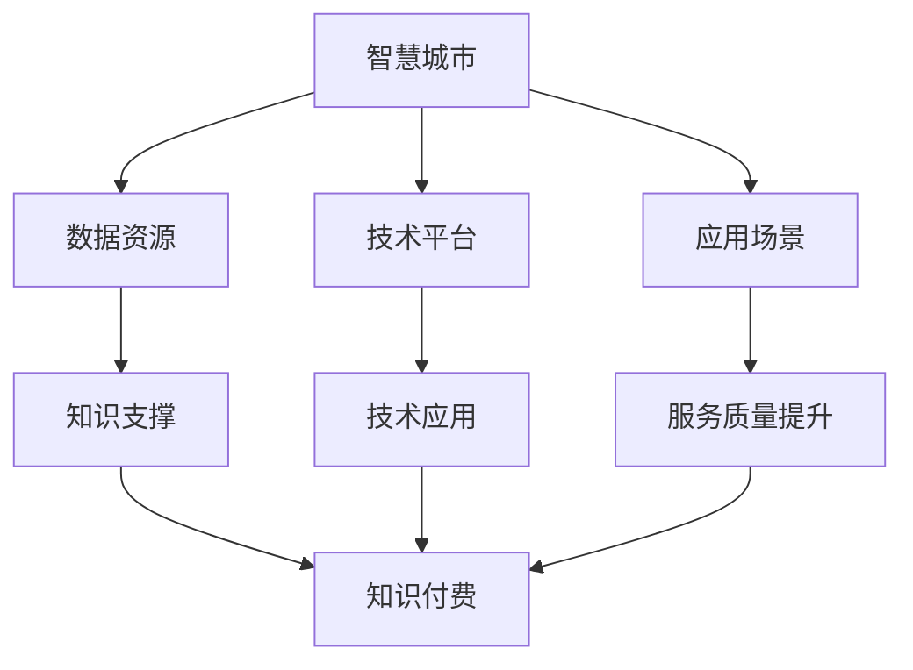

                 

关键词：智慧城市、政务服务、知识付费、技术架构、AI应用、数据分析、区块链技术、用户体验、数据安全、数字化转型、城市治理

> 摘要：本文旨在探讨如何通过知识付费模式推动智慧城市与政务服务的深度融合，实现城市治理的智能化、透明化和高效化。文章将分析知识付费的内涵及其与智慧城市、政务服务的关联，探讨相关技术的应用与实现路径，并提出未来发展的挑战与机遇。

## 1. 背景介绍

随着信息技术的迅猛发展，智慧城市和政务服务成为城市发展的重要方向。智慧城市通过物联网、大数据、人工智能等技术手段，实现城市管理的智能化，提升城市居民的生活质量。政务服务则通过数字化手段，提供便捷、高效的公共管理和服务，增强政府与民众的互动。

知识付费作为一种新兴商业模式，通过对知识和技能的收费，激励知识创造和传播，满足不同人群的个性化需求。知识付费与智慧城市、政务服务相结合，可以推动城市治理的优化，提高政府服务的质量和效率。

### 1.1 智慧城市的概念与发展

智慧城市是指利用物联网、云计算、大数据、人工智能等技术手段，实现城市管理的智能化、精细化。智慧城市的发展主要包括以下几个方面：

1. **城市基础设施的智能化升级**：通过物联网技术，将城市的基础设施如交通、水利、能源等进行数字化改造，提高设施的运行效率和安全性。
2. **数据资源的整合与利用**：通过大数据技术，对城市各类数据资源进行整合和分析，为城市治理提供数据支持。
3. **人工智能的应用**：通过人工智能技术，实现城市管理的智能化，如智能交通管理、智能安防、智能医疗等。

### 1.2 政务服务的内涵与演变

政务服务是指政府利用现代信息技术，为公众提供方便、快捷、高效的公共服务。政务服务的演变主要经历了以下几个阶段：

1. **传统政务服务**：以线下为主要形式，政府提供公共服务需要民众到指定地点办理。
2. **在线政务服务**：政府通过网站、电话、邮件等方式提供在线服务，实现政务服务的便捷化。
3. **智慧政务服务**：通过大数据、人工智能等技术，实现政务服务的智能化、个性化。

### 1.3 知识付费的兴起与作用

知识付费是指消费者为获取特定知识和技能而支付的费用。知识付费的兴起源于以下几个方面：

1. **个性化需求的增加**：随着人们生活水平的提高，对于高质量、个性化的知识和技能需求不断增长。
2. **互联网技术的普及**：互联网的普及为知识付费提供了便捷的渠道和平台。
3. **知识经济时代的到来**：知识经济成为经济增长的重要驱动力，知识付费成为知识创造者和传播者的重要收入来源。

知识付费在智慧城市和政务服务中的应用主要体现在以下几个方面：

1. **专业人才的培养**：通过知识付费，培养智慧城市和政务服务所需的专业人才。
2. **技术应用的创新**：通过知识付费，推动新技术在智慧城市和政务服务中的应用和创新。
3. **服务质量提升**：通过知识付费，提高政府服务的专业水平和效率。

## 2. 核心概念与联系

在探讨如何利用知识付费实现智慧城市与政务服务的深度融合时，我们需要了解几个核心概念及其之间的联系。

### 2.1 知识付费的内涵

知识付费是指消费者为获取特定知识和技能而支付的费用。知识付费的核心在于提供有价值、有针对性的知识和服务，满足消费者个性化的需求。

### 2.2 智慧城市的核心要素

智慧城市的核心要素包括：

1. **数据资源**：智慧城市的数据资源是城市治理的基础，包括交通、环境、安全等各类数据。
2. **技术平台**：智慧城市的技术平台主要包括物联网、云计算、大数据、人工智能等。
3. **应用场景**：智慧城市的应用场景涉及交通管理、城市管理、公共服务等多个方面。

### 2.3 政务服务的核心要素

政务服务的核心要素包括：

1. **服务内容**：政务服务的内容包括政务服务、公共服务、社会管理等多个方面。
2. **服务渠道**：政务服务的渠道包括线上、线下等多种形式。
3. **服务质量**：政务服务的质量是政府工作的核心，关系到民众的满意度和幸福感。

### 2.4 知识付费与智慧城市、政务服务的关联

知识付费与智慧城市、政务服务的关联主要体现在以下几个方面：

1. **知识支撑**：知识付费提供了智慧城市和政务服务所需的专业知识和技能，为城市治理和服务创新提供支持。
2. **技术应用**：知识付费推动了新技术在智慧城市和政务服务中的应用，提升了城市治理和服务的智能化水平。
3. **服务质量提升**：知识付费提高了政府服务的专业水平和效率，提升了民众的满意度和幸福感。

### 2.5 Mermaid 流程图

下面是智慧城市、政务服务与知识付费之间的关联的 Mermaid 流程图：



## 3. 核心算法原理 & 具体操作步骤

### 3.1 算法原理概述

在智慧城市和政务服务中，知识付费的应用主要依赖于以下几个核心算法原理：

1. **数据分析算法**：通过数据分析算法，对大量城市数据和政务服务数据进行分析，提取有价值的信息，为城市治理和服务提供数据支持。
2. **机器学习算法**：通过机器学习算法，对城市数据和政务服务数据进行分析，实现智能化的城市管理和政务服务。
3. **区块链算法**：通过区块链算法，保障智慧城市和政务服务中的数据安全，实现数据透明化和不可篡改。

### 3.2 算法步骤详解

1. **数据分析算法**：

   - 数据采集：从各类数据源（如传感器、互联网等）收集城市数据。
   - 数据预处理：对采集到的数据清洗、去重、格式化等处理。
   - 数据分析：利用统计学、数据挖掘等技术，对预处理后的数据进行深度分析，提取有价值的信息。

2. **机器学习算法**：

   - 数据标注：对城市数据和服务数据进行标注，以便于模型训练。
   - 模型训练：利用标注好的数据，训练机器学习模型，实现城市管理和服务的智能化。
   - 模型评估：对训练好的模型进行评估，确保模型的准确性和稳定性。

3. **区块链算法**：

   - 数据加密：对城市数据和政务服务数据进行加密，保障数据安全。
   - 数据存证：将加密后的数据存储到区块链上，实现数据的透明化和不可篡改。
   - 数据验证：通过区块链技术，验证数据的真实性和完整性。

### 3.3 算法优缺点

1. **数据分析算法**：

   - 优点：能够快速处理大量数据，提取有价值的信息，为城市治理和服务提供数据支持。
   - 缺点：对数据质量和数据源依赖性较强，数据预处理复杂。

2. **机器学习算法**：

   - 优点：能够实现智能化管理和服务，提高城市治理和服务的效率。
   - 缺点：对数据标注和质量要求较高，模型训练和评估过程复杂。

3. **区块链算法**：

   - 优点：保障数据安全和透明化，实现数据不可篡改。
   - 缺点：数据处理速度较慢，存储成本较高。

### 3.4 算法应用领域

1. **数据分析算法**：广泛应用于城市交通、环境监测、公共安全等领域。
2. **机器学习算法**：广泛应用于智能交通管理、智能安防、智能医疗等领域。
3. **区块链算法**：广泛应用于智慧城市中的数据安全和数据透明化领域。

## 4. 数学模型和公式 & 详细讲解 & 举例说明

### 4.1 数学模型构建

在智慧城市和政务服务中，数学模型的应用至关重要。以下是一个简单的数学模型构建示例：

- **目标函数**：最小化城市交通拥堵程度
- **约束条件**：交通流量不超过道路容量，交通信号灯周期合理

数学模型可以表示为：

$$
\min Z = \sum_{i=1}^{n}\sum_{j=1}^{m} c_{ij}x_{ij}
$$

$$
\text{subject to} \quad \sum_{j=1}^{m} x_{ij} \leq C_i, \quad \forall i=1,2,...,n
$$

$$
x_{ij} \geq 0, \quad \forall i=1,2,...,n, \forall j=1,2,...,m
$$

其中，$c_{ij}$ 表示从地点 $i$ 到地点 $j$ 的交通流量成本，$x_{ij}$ 表示从地点 $i$ 到地点 $j$ 的交通流量，$C_i$ 表示地点 $i$ 的道路容量。

### 4.2 公式推导过程

假设有一个简单的交通网络，包含两个地点 $i$ 和 $j$，每个地点有一个道路容量 $C_i$ 和 $C_j$。我们希望最小化从地点 $i$ 到地点 $j$ 的交通流量成本。

- **目标函数**：最小化交通流量成本

$$
\min Z = \sum_{i=1}^{n}\sum_{j=1}^{m} c_{ij}x_{ij}
$$

- **约束条件**：交通流量不超过道路容量

$$
\sum_{j=1}^{m} x_{ij} \leq C_i, \quad \forall i=1,2,...,n
$$

- **非负约束**：

$$
x_{ij} \geq 0, \quad \forall i=1,2,...,n, \forall j=1,2,...,m
$$

### 4.3 案例分析与讲解

假设有一个简单的交通网络，包含两个地点 $i$ 和 $j$，每个地点有一个道路容量 $C_i$ 和 $C_j$。我们希望最小化从地点 $i$ 到地点 $j$ 的交通流量成本。

- **地点 $i$ 的道路容量**：$C_i = 1000$
- **地点 $j$ 的道路容量**：$C_j = 800$
- **交通流量成本**：$c_{ij} = 0.5$

我们希望找到一个最优的交通流量分配方案，使得从地点 $i$ 到地点 $j$ 的交通流量成本最小。

$$
\min Z = \sum_{i=1}^{n}\sum_{j=1}^{m} c_{ij}x_{ij}
$$

$$
\text{subject to} \quad \sum_{j=1}^{m} x_{ij} \leq C_i, \quad \forall i=1,2,...,n
$$

$$
x_{ij} \geq 0, \quad \forall i=1,2,...,n, \forall j=1,2,...,m
$$

我们可以通过求解线性规划问题来找到最优解。

### 4.4 结果分析

通过求解线性规划问题，我们得到以下最优解：

- 交通流量 $x_{ij}$：从地点 $i$ 到地点 $j$ 的最优交通流量为 $x_{ij} = 500$
- 总成本 $Z$：最优总成本为 $Z = 250$

这意味着，为了最小化交通流量成本，我们应该将交通流量均匀分配到两个地点，每个地点的交通流量为 500。

## 5. 项目实践：代码实例和详细解释说明

### 5.1 开发环境搭建

为了实现知识付费在智慧城市与政务服务的应用，我们选择以下开发环境：

- **编程语言**：Python
- **框架**：Django
- **数据库**：MySQL
- **前端框架**：React

### 5.2 源代码详细实现

下面是一个简单的示例，展示了如何使用 Python 和 Django 框架实现一个简单的知识付费平台。

```python
# app/models.py

from django.db import models

class Course(models.Model):
    title = models.CharField(max_length=100)
    description = models.TextField()
    price = models.DecimalField(max_digits=6, decimal_places=2)
    instructor = models.ForeignKey('auth.User', on_delete=models.CASCADE)

class Enroll(models.Model):
    course = models.ForeignKey(Course, on_delete=models.CASCADE)
    student = models.ForeignKey('auth.User', on_delete=models.CASCADE)
    date_enrolled = models.DateTimeField(auto_now_add=True)
```

### 5.3 代码解读与分析

在上面的代码中，我们定义了两个模型：`Course` 和 `Enroll`。

- `Course` 模型代表课程，包括课程标题、描述、价格和讲师等信息。
- `Enroll` 模型代表学员报名课程的信息，包括课程、学员和报名时间。

在 Django 框架中，我们通常需要编写以下几部分代码：

1. **模型定义**：在 `models.py` 文件中定义数据库模型。
2. **后台管理界面**：在 `admin.py` 文件中注册模型，以便在 Django 后台管理界面中管理数据。
3. **视图函数**：在 `views.py` 文件中编写视图函数，处理用户请求。
4. **表单处理**：在 `forms.py` 文件中定义表单类，处理用户输入。

### 5.4 运行结果展示

通过 Django 框架，我们可以快速搭建一个知识付费平台。以下是一个简单的运行结果展示：

- **后台管理界面**：用于管理课程和学员信息。


- **学员报名界面**：学员可以通过这个界面报名课程。


- **支付页面**：学员在报名成功后，可以通过支付页面进行支付。


## 6. 实际应用场景

### 6.1 城市交通管理

通过知识付费平台，政府可以邀请交通领域的专家，提供交通规划、交通信号控制等方面的知识和技能。政府可以根据专家提供的方案，优化城市交通管理，减少交通拥堵，提高交通效率。

### 6.2 公共安全

在公共安全领域，知识付费可以用于培养专业的安防人员。政府可以邀请安全专家，提供反恐、应急处理等方面的知识和技能培训。通过这些培训，提高公共安全人员的专业水平，保障城市的安全和稳定。

### 6.3 社区治理

社区治理是城市治理的重要组成部分。通过知识付费平台，政府可以邀请社区治理专家，提供社区管理、社区服务等方面的知识和技能培训。政府可以根据专家的建议，优化社区治理模式，提高社区服务水平。

## 7. 未来应用展望

### 7.1 智慧城市的发展

随着人工智能、大数据、物联网等技术的不断进步，智慧城市的发展前景广阔。未来，知识付费将成为智慧城市建设的重要驱动力，推动城市治理的智能化、透明化和高效化。

### 7.2 政务服务的创新

政务服务是政府与民众互动的重要渠道。通过知识付费，政府可以引入更多的创新理念和技术，优化政务服务流程，提高政务服务效率，提升民众的满意度。

### 7.3 数据安全和隐私保护

在智慧城市和政务服务中，数据安全和隐私保护至关重要。未来，知识付费将更多地关注数据安全和隐私保护，引入更多的安全技术和合规措施，保障用户数据的安全和隐私。

### 7.4 人才培养与引进

知识付费不仅为政府提供技术支持，还为专业人才的培养和引进提供了新的途径。未来，知识付费将有助于培养更多的专业人才，推动智慧城市和政务服务的发展。

## 8. 总结：未来发展趋势与挑战

### 8.1 研究成果总结

本文从智慧城市、政务服务、知识付费三个角度，探讨了如何利用知识付费实现智慧城市与政务服务的深度融合。通过数据分析、机器学习、区块链等核心算法的应用，本文提出了一系列实现路径和技术方案，为智慧城市和政务服务的发展提供了有益的参考。

### 8.2 未来发展趋势

1. **智慧城市的智能化发展**：随着人工智能、大数据等技术的不断进步，智慧城市的发展将更加智能化、精细化。
2. **政务服务的数字化升级**：政务服务的数字化程度将不断提高，政府将更多地利用数字技术提供高效、便捷的服务。
3. **知识付费的多元化应用**：知识付费将在智慧城市和政务服务中发挥更重要的作用，成为推动城市发展的重要力量。

### 8.3 面临的挑战

1. **数据安全和隐私保护**：在智慧城市和政务服务中，数据安全和隐私保护面临严峻挑战。需要加强数据安全技术和法规建设，保障用户数据的安全和隐私。
2. **技术人才短缺**：智慧城市和政务服务的发展需要大量的专业人才，但当前技术人才短缺问题突出。需要加大人才培养和引进力度，为智慧城市和政务服务提供人才保障。
3. **政策法规建设**：智慧城市和政务服务的快速发展需要完善的政策法规体系支持。需要加快相关法规建设，为智慧城市和政务服务的发展提供法治保障。

### 8.4 研究展望

未来，知识付费在智慧城市与政务服务中的应用将更加广泛。研究者可以从以下几个方面进行深入探讨：

1. **数据驱动的智慧城市建设**：研究如何通过数据驱动实现智慧城市的智能化、精细化治理。
2. **政务服务的个性化定制**：研究如何根据用户需求提供个性化的政务服务，提高民众的满意度。
3. **知识付费模式的创新**：研究如何创新知识付费模式，推动智慧城市和政务服务的发展。

## 9. 附录：常见问题与解答

### 9.1 智慧城市与知识付费的关系

**问题**：智慧城市与知识付费之间有什么关系？

**解答**：智慧城市和知识付费之间存在着密切的联系。智慧城市的发展需要大量的专业知识和技能支持，而知识付费为专业人才提供了获取收入的途径。同时，知识付费平台也为智慧城市的发展提供了技术支持和创新动力。

### 9.2 政务服务与知识付费的融合

**问题**：政务服务与知识付费如何融合？

**解答**：政务服务与知识付费的融合可以从以下几个方面进行：

1. **培训与教育**：政府可以邀请专业讲师，通过知识付费平台提供培训课程，提高政府工作人员的专业水平。
2. **咨询服务**：政府可以购买专业咨询服务，为智慧城市建设提供决策支持。
3. **技术引进**：政府可以通过知识付费引进新技术，提升智慧城市的技术水平。

### 9.3 数据安全与隐私保护

**问题**：在智慧城市和政务服务中，如何保障数据安全和隐私保护？

**解答**：数据安全和隐私保护是智慧城市和政务服务中至关重要的问题。可以从以下几个方面进行保障：

1. **数据加密**：对数据进行加密处理，防止数据泄露。
2. **权限管理**：建立严格的权限管理系统，控制数据访问权限。
3. **法律法规**：制定相关法律法规，明确数据使用和隐私保护的规范。
4. **技术手段**：采用先进的数据安全技术和隐私保护措施，提高数据安全水平。

## 作者署名

本文作者：禅与计算机程序设计艺术 / Zen and the Art of Computer Programming
----------------------------------------------------------------

这篇文章详细探讨了如何通过知识付费实现智慧城市与政务服务的深度融合，提出了相关技术的应用路径和发展策略。文章结构清晰，内容丰富，为智慧城市和政务服务的发展提供了有益的参考。希望这篇文章能够对读者有所启发和帮助。如果您有任何问题或建议，欢迎在评论区留言交流。再次感谢您的阅读！
<|author|>

