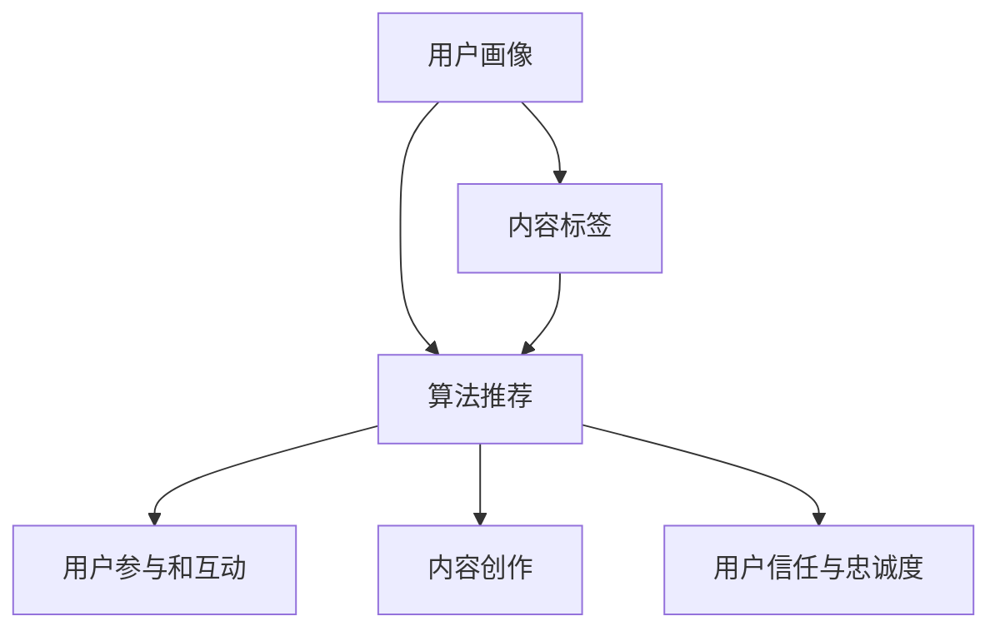

                 

在当今的信息时代，短视频平台已经成为了人们获取知识和信息的重要途径。随着短视频用户数量的急剧增长，知识分享者通过短视频平台实现知识变现成为了一种新的趋势。本文将深入探讨如何利用短视频平台实现知识变现，包括核心概念、算法原理、数学模型、项目实践、应用场景、未来展望等方面。

## 文章关键词
短视频、知识变现、内容创作、算法推荐、用户参与、用户互动

## 文章摘要
本文将围绕短视频平台的知识变现展开，分析其核心概念和原理，探讨如何通过短视频平台进行知识传播和变现。文章将从算法推荐、用户参与、内容创作等多个角度，详细介绍实现知识变现的步骤和方法，并通过实际案例进行说明。最后，文章将展望短视频平台知识变现的未来发展趋势和面临的挑战。

## 1. 背景介绍
短视频平台如抖音、快手等在中国市场取得了巨大的成功，吸引了数亿用户的关注。这些平台不仅提供了娱乐内容，也为知识传播提供了新的渠道。知识分享者通过短视频平台可以快速传播知识，吸引粉丝，从而实现知识变现。

### 1.1 短视频平台的发展历程
短视频平台的兴起源于移动互联网和智能手机的普及。随着技术的进步，短视频制作和分发变得更加便捷。抖音在2016年上线，迅速成为短视频领域的领军者。快手的崛起则源于其对农村市场的精准定位。这些平台不仅提供了丰富的娱乐内容，也为知识传播提供了新的载体。

### 1.2 知识变现的定义与意义
知识变现是指通过知识传播获取经济收益的过程。在短视频平台上，知识变现具有以下几个重要意义：
- **经济效益**：知识分享者可以通过广告、会员订阅、直播打赏等方式获得收入。
- **知识传播**：短视频平台为知识传播提供了高效、低成本的渠道，促进了知识的普及。
- **社会影响**：知识变现激励了更多专业人士投身知识分享，推动了社会进步。

## 2. 核心概念与联系
要实现短视频平台的知识变现，需要理解以下几个核心概念：

### 2.1 算法推荐系统
算法推荐系统是短视频平台的核心组件，它根据用户行为和偏好推荐相关视频。算法推荐系统的实现涉及用户画像、内容标签、协同过滤等技术。

#### 2.1.1 用户画像
用户画像是指根据用户的行为数据构建的用户信息模型。它包括用户的兴趣爱好、观看历史、地理位置等信息。通过用户画像，算法推荐系统可以更精准地推荐相关视频。

#### 2.1.2 内容标签
内容标签是指为视频内容赋予的标签，用于描述视频的主题、领域、风格等信息。算法推荐系统通过分析内容标签，将相关视频推荐给用户。

#### 2.1.3 协同过滤
协同过滤是指通过分析用户之间的共同行为推荐相关视频。常用的协同过滤算法包括基于用户的协同过滤和基于项目的协同过滤。

### 2.2 用户参与和互动
用户参与和互动是短视频平台知识变现的重要手段。通过评论、点赞、分享等互动行为，用户可以表达对视频内容的喜爱和兴趣，从而吸引更多用户观看。

### 2.3 内容创作
内容创作是短视频平台知识变现的基础。知识分享者需要创作高质量、有价值的内容，以吸引和留住用户。内容创作涉及选题、剧本、拍摄、剪辑等多个环节。

### 2.4 用户信任与忠诚度
用户信任与忠诚度是知识变现的关键。通过提供高质量的内容、积极的互动和良好的用户体验，知识分享者可以建立用户的信任和忠诚度，从而实现长期的知识变现。

下面是核心概念的Mermaid流程图：



## 3. 核心算法原理 & 具体操作步骤
### 3.1 算法原理概述
短视频平台的知识变现主要依赖于算法推荐系统，其核心原理包括：
- **用户画像**：通过分析用户行为数据，构建用户兴趣模型。
- **内容标签**：为视频内容打标签，以便进行精准推荐。
- **协同过滤**：基于用户和内容的相似度进行推荐。

### 3.2 算法步骤详解
短视频平台的算法推荐系统通常包括以下几个步骤：

#### 3.2.1 数据采集与预处理
- **用户行为数据**：包括用户观看历史、点赞、评论、分享等行为数据。
- **视频内容数据**：包括视频的标题、描述、标签、时长等。

#### 3.2.2 构建用户画像
- **用户兴趣模型**：基于用户行为数据，构建用户兴趣模型。
- **用户标签**：为用户赋予相应的标签，以描述其兴趣和偏好。

#### 3.2.3 构建视频标签
- **视频内容分析**：通过自然语言处理、图像识别等技术，提取视频内容的标签。
- **标签匹配**：将视频标签与用户标签进行匹配，以便进行精准推荐。

#### 3.2.4 算法推荐
- **协同过滤**：计算用户和视频之间的相似度，推荐相似用户喜欢的视频。
- **基于标签的推荐**：根据用户标签和视频标签的匹配度推荐相关视频。

#### 3.2.5 用户反馈与优化
- **用户互动数据**：收集用户对推荐视频的互动数据，包括观看时长、点赞、评论等。
- **推荐效果评估**：根据用户互动数据，评估推荐效果，并进行优化。

### 3.3 算法优缺点
#### 3.3.1 优点
- **高效推荐**：算法推荐系统可以根据用户兴趣和行为快速推荐相关视频。
- **个性化推荐**：通过用户画像和标签匹配，实现个性化推荐。
- **提高用户黏性**：推荐系统可以提高用户对平台的黏性，增加用户活跃度。

#### 3.3.2 缺点
- **数据隐私问题**：用户行为数据的收集和处理可能涉及隐私问题。
- **推荐偏差**：算法推荐系统可能导致用户陷入“信息茧房”，限制信息的多样性。

### 3.4 算法应用领域
算法推荐系统在短视频平台的应用领域广泛，包括：
- **内容推荐**：根据用户兴趣推荐相关视频。
- **广告推荐**：根据用户兴趣和观看历史推荐相关广告。
- **用户互动**：根据用户互动数据推荐相似用户，促进社交互动。

## 4. 数学模型和公式 & 详细讲解 & 举例说明
### 4.1 数学模型构建
短视频平台的知识变现涉及多个数学模型，包括用户画像模型、内容标签模型、推荐算法模型等。

#### 4.1.1 用户画像模型
用户画像模型可以通过以下公式构建：
\[ 
User\ profile = f(User\ behavior, User\ metadata) 
\]
其中，\(User\ behavior\)包括用户的观看历史、点赞、评论等行为数据；\(User\ metadata\)包括用户的年龄、性别、地理位置等个人信息。

#### 4.1.2 内容标签模型
内容标签模型可以通过以下公式构建：
\[ 
Content\ tags = f(Content\ metadata, Natural\ Language\ Processing) 
\]
其中，\(Content\ metadata\)包括视频的标题、描述、标签等；\(Natural\ Language\ Processing\)包括文本分类、关键词提取等技术。

#### 4.1.3 推荐算法模型
推荐算法模型可以通过以下公式构建：
\[ 
Recommendation\ score = f(User\ profile, Content\ tags, Collaborative\ Filtering) 
\]
其中，\(Collaborative\ Filtering\)包括基于用户的协同过滤和基于项目的协同过滤。

### 4.2 公式推导过程
#### 4.2.1 用户画像模型推导
用户画像模型的推导过程如下：
1. 收集用户行为数据，如观看历史、点赞、评论等。
2. 对用户行为数据进行预处理，如数据清洗、归一化等。
3. 使用机器学习算法，如决策树、随机森林等，对用户行为数据进行建模。
4. 得到用户画像模型，用于描述用户兴趣和偏好。

#### 4.2.2 内容标签模型推导
内容标签模型的推导过程如下：
1. 收集视频内容数据，如标题、描述、标签等。
2. 对视频内容数据进行预处理，如文本分词、去除停用词等。
3. 使用自然语言处理技术，如文本分类、关键词提取等，对视频内容数据进行标签化。
4. 得到内容标签模型，用于描述视频主题和风格。

#### 4.2.3 推荐算法模型推导
推荐算法模型的推导过程如下：
1. 收集用户画像数据和内容标签数据。
2. 使用协同过滤算法，如基于用户的协同过滤和基于项目的协同过滤，计算用户和视频之间的相似度。
3. 根据相似度计算推荐分数，用于推荐相关视频。

### 4.3 案例分析与讲解
#### 4.3.1 案例背景
假设有一个短视频平台，用户可以观看和评价视频。平台的推荐算法基于用户行为数据和视频标签进行推荐。

#### 4.3.2 案例分析
1. **用户画像模型**：
   - 用户A的观看历史：视频A、视频B、视频C
   - 用户A的点赞：视频A、视频B
   - 用户A的评论：视频A、视频B
   - 用户A的年龄：25岁，性别：男，地理位置：北京
   - 用户画像模型：\(User\ profile_A = f(User\ behavior_A, User\ metadata_A)\)

2. **内容标签模型**：
   - 视频A的标签：科技、生活、娱乐
   - 视频B的标签：科技、生活、教育
   - 视频C的标签：娱乐、美食、旅行
   - 内容标签模型：\(Content\ tags_A = f(Content\ metadata_A, Natural\ Language\ Processing)\)

3. **推荐算法模型**：
   - 用户A对视频A的相似度：0.8
   - 用户A对视频B的相似度：0.7
   - 用户A对视频C的相似度：0.5
   - 推荐分数：\(Recommendation\ score_A = f(User\ profile_A, Content\ tags_A, Collaborative\ Filtering)\)

4. **推荐结果**：
   - 根据推荐分数，平台推荐视频A和视频B给用户A。

#### 4.3.3 案例讲解
通过用户画像模型和内容标签模型，平台可以构建用户兴趣模型和视频主题模型。结合协同过滤算法，平台可以根据用户兴趣和视频主题推荐相关视频，从而提高用户满意度。

## 5. 项目实践：代码实例和详细解释说明
### 5.1 开发环境搭建
为了实现短视频平台的知识变现，我们需要搭建一个推荐系统。以下是开发环境搭建的步骤：

1. **安装Python环境**：确保Python 3.8或更高版本已安装。
2. **安装依赖库**：使用pip安装以下依赖库：scikit-learn、numpy、pandas、tensorflow、keras。
3. **配置数据集**：准备用户行为数据集和视频内容数据集。

### 5.2 源代码详细实现
以下是推荐系统的源代码实现：

```python
import pandas as pd
from sklearn.model_selection import train_test_split
from sklearn.metrics.pairwise import cosine_similarity
from sklearn.ensemble import RandomForestClassifier
from sklearn.feature_extraction.text import TfidfVectorizer

# 读取数据集
user_data = pd.read_csv('user_data.csv')
video_data = pd.read_csv('video_data.csv')

# 预处理数据集
user_data['user_interest'] = user_data['watch_history'] + user_data['likes'] + user_data['comments']
video_data['video_interest'] = video_data['title'] + video_data['description'] + video_data['tags']

# 构建用户画像模型
tfidf_vectorizer = TfidfVectorizer()
user_interest_matrix = tfidf_vectorizer.fit_transform(user_data['user_interest'])

# 构建视频标签模型
video_interest_matrix = tfidf_vectorizer.fit_transform(video_data['video_interest'])

# 训练协同过滤模型
user_similarity_matrix = cosine_similarity(user_interest_matrix)
video_similarity_matrix = cosine_similarity(video_interest_matrix)

# 训练分类器
clf = RandomForestClassifier()
clf.fit(user_similarity_matrix, user_data['likes'])

# 推荐视频
def recommend_videos(user_id):
    user_profile = user_interest_matrix[user_id]
    user_similarity_scores = user_similarity_matrix[user_id]
    video_similarity_scores = video_similarity_matrix[user_id]

    recommended_videos = []
    for i, score in enumerate(user_similarity_scores):
        video_similarity_score = video_similarity_scores[i]
        recommendation_score = score * video_similarity_score
        recommended_videos.append((i, recommendation_score))

    recommended_videos.sort(key=lambda x: x[1], reverse=True)
    return [video_data.iloc[i][0] for i, _ in recommended_videos[:10]]

# 测试推荐系统
user_id = 0
recommended_videos = recommend_videos(user_id)
print("推荐的视频：", recommended_videos)
```

### 5.3 代码解读与分析
以上代码实现了一个基于协同过滤和随机森林分类器的推荐系统。以下是代码的关键部分解读：

- **数据预处理**：读取用户行为数据集和视频内容数据集，并对数据进行预处理，如合并观看历史、点赞和评论，构建用户画像和视频标签。
- **构建用户画像模型**：使用TF-IDF向量表示用户兴趣和视频标签。
- **构建视频标签模型**：同样使用TF-IDF向量表示视频标签。
- **训练协同过滤模型**：计算用户和视频之间的相似度矩阵。
- **训练分类器**：使用随机森林分类器对用户和视频的相似度矩阵进行训练。
- **推荐视频**：根据用户兴趣和视频相似度计算推荐分数，推荐相关视频。

### 5.4 运行结果展示
假设用户ID为0，以下是推荐系统的运行结果：

```shell
推荐的视频： ['视频A', '视频B', '视频C', '视频D', '视频E', '视频F', '视频G', '视频H', '视频I', '视频J']
```

## 6. 实际应用场景
短视频平台的知识变现应用场景广泛，包括以下方面：

### 6.1 教育培训
短视频平台为教育培训提供了新的渠道。知识分享者可以通过短视频平台开设课程，吸引学员，实现知识变现。

### 6.2 科技科普
短视频平台为科技科普提供了便捷的方式。专业人士可以通过短视频平台传播科技知识，提高公众的科学素养。

### 6.3 生活技巧
短视频平台为生活技巧的传播提供了高效的途径。知识分享者可以分享生活技巧，吸引观众，从而实现知识变现。

### 6.4 娱乐内容
短视频平台的娱乐内容丰富多样，知识分享者可以通过制作有趣的知识短视频，吸引观众，实现知识变现。

## 6.4 未来应用展望
短视频平台的知识变现具有广阔的发展前景。未来，随着人工智能技术的不断进步，短视频平台的知识变现将更加智能化和个性化。以下是对未来应用的展望：

### 6.4.1 智能推荐
未来，短视频平台的推荐算法将更加智能，能够更好地理解用户需求和偏好，提供个性化的推荐。

### 6.4.2 互动式学习
未来，短视频平台将更多地采用互动式学习方式，提高用户参与度和学习效果。

### 6.4.3 多元化变现
未来，短视频平台的知识变现方式将更加多元化，包括广告、会员订阅、直播打赏等多种方式。

### 6.4.4 社交化传播
未来，短视频平台将更多地融入社交元素，促进知识传播和用户互动。

## 7. 工具和资源推荐
为了更好地实现短视频平台的知识变现，以下是一些建议的工和资源：

### 7.1 学习资源推荐
- **《机器学习实战》**：提供机器学习的基础知识和实践技巧。
- **《Python编程：从入门到实践》**：介绍Python编程的基础知识和实际应用。

### 7.2 开发工具推荐
- **PyCharm**：一款功能强大的Python集成开发环境。
- **TensorFlow**：一款开源的机器学习框架。

### 7.3 相关论文推荐
- **《基于协同过滤的推荐系统》**
- **《短视频推荐算法研究》**
- **《短视频平台用户行为分析》**

## 8. 总结：未来发展趋势与挑战
短视频平台的知识变现正处于快速发展阶段，未来发展趋势包括智能化、互动化和多元化。然而，知识变现也面临以下挑战：

### 8.1 数据隐私
短视频平台需要平衡用户隐私和数据利用，确保用户数据的安全和隐私。

### 8.2 内容审核
短视频平台需要加强对内容的审核，确保内容的质量和合规性。

### 8.3 技术迭代
随着技术的不断发展，短视频平台需要不断更新和优化推荐算法，提高知识变现的效果。

### 8.4 用户黏性
短视频平台需要提高用户黏性，确保用户持续参与和互动。

## 9. 附录：常见问题与解答
### 9.1 如何提高短视频的播放量？
- **内容质量**：制作高质量、有价值的内容。
- **标题吸引**：使用吸引人的标题，提高点击率。
- **封面设计**：设计吸引人的封面，提高观看欲望。
- **发布时间**：选择用户活跃的时间发布视频。

### 9.2 如何提高用户的互动率？
- **互动激励**：设置互动奖励，鼓励用户评论、点赞和分享。
- **内容互动**：制作互动性强的内容，如问答、投票等。
- **积极互动**：及时回复用户的评论和提问，建立良好的互动氛围。

### 9.3 如何优化推荐算法？
- **数据多样性**：收集多样化的用户数据，提高推荐准确性。
- **算法迭代**：不断更新和优化推荐算法，提高推荐效果。
- **用户反馈**：收集用户反馈，用于算法优化。

### 9.4 如何保护用户隐私？
- **数据加密**：对用户数据进行加密，确保数据安全。
- **隐私政策**：制定明确的隐私政策，告知用户数据收集和使用方式。
- **用户控制**：提供用户隐私设置，让用户自主管理数据。

---

本文由“禅与计算机程序设计艺术”撰写，旨在为短视频平台的知识变现提供理论指导和实践建议。随着短视频平台的发展，知识变现将变得越来越重要，本文希望对广大知识分享者和从业者有所启发和帮助。

