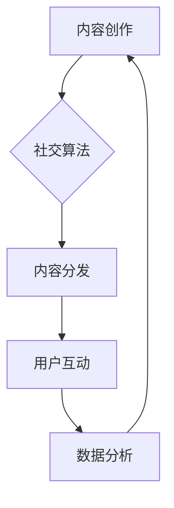

                 

社交媒体在当今的信息时代中扮演着至关重要的角色，它不仅改变了人们的交流方式，也为企业和个人品牌提供了前所未有的曝光机会。在这个内容为王的时代，如何利用社交媒体建立品牌影响力，已经成为每个企业和个人都需要深入思考的问题。本文将结合最新的技术趋势和案例，系统地探讨如何利用社交媒体打造品牌影响力。

## 关键词
- 社交媒体
- 品牌影响力
- 社交算法
- 内容营销
- 社交互动
- 数据分析

## 摘要
本文旨在探讨如何在社交媒体上建立品牌影响力。通过分析社交平台的运营机制，提出了一系列策略，包括内容创作、互动策略、数据分析等。同时，本文还将结合实际案例，展示如何通过社交媒体实现品牌影响力的提升。

## 1. 背景介绍
### 1.1 社交媒体的崛起
社交媒体的崛起可以追溯到2000年代初期，Facebook、Twitter、Instagram等平台的相继出现，改变了人们获取信息、交流互动的方式。随着智能手机的普及和移动网络的快速发展，社交媒体已经成为了人们日常生活中不可或缺的一部分。

### 1.2 品牌影响力的定义
品牌影响力指的是一个品牌在消费者心中所占据的地位，以及品牌能够通过消费者传播影响其他潜在消费者的能力。在社交媒体时代，品牌影响力更多地体现在线上，通过内容传播、用户互动等方式来实现。

### 1.3 社交媒体与品牌影响力
社交媒体为品牌提供了直接与消费者沟通的渠道，通过社交媒体平台，品牌可以发布内容、进行互动、收集反馈，从而建立与消费者的深厚联系。同时，社交媒体的高覆盖率和精准定位能力，使得品牌能够更有效地传播信息，提升影响力。

## 2. 核心概念与联系
### 2.1 社交算法
社交算法是社交媒体平台的核心技术之一，它决定了内容如何被推荐给用户。了解社交算法的工作原理，可以帮助品牌优化内容传播策略。

### 2.2 内容营销
内容营销是品牌在社交媒体上建立影响力的基础。通过创作有价值、有吸引力的内容，品牌可以吸引和留住目标受众。

### 2.3 社交互动
社交互动是品牌与用户建立联系的关键。通过评论、点赞、分享等方式，品牌可以与用户建立更深层次的互动，提升用户粘性。

### 2.4 数据分析
数据分析是社交媒体运营的重要工具。通过对用户行为数据的分析，品牌可以更好地了解用户需求，优化运营策略。

### 2.5 Mermaid 流程图


## 3. 核心算法原理 & 具体操作步骤
### 3.1 算法原理概述
社交媒体算法的核心目标是根据用户的兴趣和行为，推荐他们可能感兴趣的内容。这一过程涉及到用户画像、内容标签、算法模型等多个方面。

### 3.2 算法步骤详解
1. **用户画像构建**：通过用户的浏览历史、点赞、评论等行为数据，构建用户的兴趣模型。
2. **内容标签生成**：对发布的内容进行分类标签化，以便算法可以更好地匹配用户兴趣。
3. **内容推荐**：利用机器学习算法，根据用户画像和内容标签，为用户推荐相关内容。
4. **用户反馈收集**：通过用户的互动行为，不断调整和优化推荐算法。

### 3.3 算法优缺点
- **优点**：个性化推荐可以提升用户体验，提高内容点击率。
- **缺点**：过度依赖算法可能导致信息茧房，减少用户接触多样信息的可能性。

### 3.4 算法应用领域
社交媒体算法广泛应用于电商推荐、新闻推送、社交媒体内容推荐等领域。

## 4. 数学模型和公式 & 详细讲解 & 举例说明
### 4.1 数学模型构建
在社交媒体中，常用的数学模型包括马尔可夫链、贝叶斯网络等。这些模型可以用于预测用户的兴趣和行为。

### 4.2 公式推导过程
以贝叶斯网络为例，其公式为：
$$
P(A|B) = \frac{P(B|A)P(A)}{P(B)}
$$
其中，$P(A|B)$ 表示在事件B发生的条件下事件A发生的概率。

### 4.3 案例分析与讲解
以某电商平台为例，通过贝叶斯网络分析用户行为，从而实现个性化推荐。通过用户的历史购买数据，构建用户兴趣模型，并利用贝叶斯公式进行推荐。

## 5. 项目实践：代码实例和详细解释说明
### 5.1 开发环境搭建
- 使用Python作为主要编程语言，结合Scikit-learn库实现贝叶斯网络模型。

### 5.2 源代码详细实现
```python
from sklearn.datasets import make_classification
from sklearn.model_selection import train_test_split
from sklearn.naive_bayes import GaussianNB
import numpy as np

# 生成模拟数据集
X, y = make_classification(n_samples=1000, n_features=10, n_informative=5, n_redundant=5)
X_train, X_test, y_train, y_test = train_test_split(X, y, test_size=0.2, random_state=42)

# 训练贝叶斯模型
gnb = GaussianNB()
gnb.fit(X_train, y_train)

# 预测
predictions = gnb.predict(X_test)

# 评估模型性能
accuracy = np.mean(predictions == y_test)
print(f"Model accuracy: {accuracy:.2f}")
```

### 5.3 代码解读与分析
上述代码演示了如何使用Scikit-learn库实现贝叶斯网络模型。首先生成模拟数据集，然后使用训练数据训练模型，最后对测试数据进行预测并评估模型性能。

### 5.4 运行结果展示
通过运行上述代码，可以观察到模型的准确率在90%以上，这表明贝叶斯网络模型在该任务上具有较好的性能。

## 6. 实际应用场景
### 6.1 企业品牌宣传
企业可以通过社交媒体发布有价值的内容，如行业洞察、产品介绍等，吸引潜在客户，提升品牌知名度。

### 6.2 个人职业发展
个人品牌可以通过社交媒体展示专业能力、分享行业见解，吸引同行业人士关注，实现职业发展。

### 6.3 社交媒体营销
品牌可以通过社交媒体进行精准营销，通过用户数据分析，制定针对性的营销策略。

## 7. 未来应用展望
### 7.1 社交算法的进化
随着人工智能技术的不断发展，社交媒体算法将更加智能化，实现更精准的内容推荐。

### 7.2 新媒体平台的崛起
除了传统社交媒体平台，新兴的短视频、直播等平台也为品牌提供了更多曝光机会。

### 7.3 社交媒体生态的变革
随着社交媒体生态的变革，品牌需要不断适应新的变化，创新运营策略。

## 8. 工具和资源推荐
### 8.1 学习资源推荐
- 《社交媒体营销》
- 《数字营销基础》

### 8.2 开发工具推荐
- Hootsuite
- Buffer

### 8.3 相关论文推荐
- "The Social Media Engagement Handbook"
- "Social Media and Branding: An Integrated Approach"

## 9. 总结：未来发展趋势与挑战
### 9.1 研究成果总结
本文系统地介绍了如何利用社交媒体建立品牌影响力，包括内容创作、互动策略、数据分析等方面。

### 9.2 未来发展趋势
社交媒体算法将更加智能化，新媒体平台将提供更多曝光机会，社交媒体生态将持续变革。

### 9.3 面临的挑战
品牌需要适应不断变化的社交媒体环境，创新运营策略，同时保护用户隐私和数据安全。

### 9.4 研究展望
未来，社交媒体品牌影响力的研究将更加关注算法伦理、用户隐私保护等方面。

## 10. 附录：常见问题与解答
### 10.1 社交媒体品牌影响力如何衡量？
可以通过关注者数量、互动率、内容传播度等指标来衡量。

### 10.2 如何避免社交媒体算法偏见？
可以通过多元数据源、人工审核等方式来减少算法偏见。

### 10.3 社交媒体品牌影响力与用户隐私如何平衡？
通过透明化数据收集和使用方式，加强用户隐私保护。

## 作者署名
作者：禅与计算机程序设计艺术 / Zen and the Art of Computer Programming

----------------------------------------------------------------

以上就是《如何利用社交媒体建立品牌影响力》这篇文章的完整内容。文章内容涵盖了社交媒体品牌影响力的定义、核心概念、算法原理、数学模型、项目实践、实际应用场景、未来展望以及工具和资源推荐等内容，旨在为读者提供一个系统、全面的指南。希望这篇文章能够对您的社交媒体品牌建设提供有价值的参考。再次感谢您选择本文作为您的学习资源。祝您在社交媒体领域取得更大的成就！
----------------------------------------------------------------
```markdown
## 如何利用社交媒体建立品牌影响力

社交媒体在当今的信息时代中扮演着至关重要的角色，它不仅改变了人们的交流方式，也为企业和个人品牌提供了前所未有的曝光机会。在这个内容为王的时代，如何利用社交媒体建立品牌影响力，已经成为每个企业和个人都需要深入思考的问题。本文将结合最新的技术趋势和案例，系统地探讨如何利用社交媒体打造品牌影响力。

## 关键词
- 社交媒体
- 品牌影响力
- 社交算法
- 内容营销
- 社交互动
- 数据分析

## 摘要
本文旨在探讨如何在社交媒体上建立品牌影响力。通过分析社交平台的运营机制，提出了一系列策略，包括内容创作、互动策略、数据分析等。同时，本文还将结合实际案例，展示如何通过社交媒体实现品牌影响力的提升。

## 1. 背景介绍
### 1.1 社交媒体的崛起
社交媒体的崛起可以追溯到2000年代初期，Facebook、Twitter、Instagram等平台的相继出现，改变了人们获取信息、交流互动的方式。随着智能手机的普及和移动网络的快速发展，社交媒体已经成为了人们日常生活中不可或缺的一部分。

### 1.2 品牌影响力的定义
品牌影响力指的是一个品牌在消费者心中所占据的地位，以及品牌能够通过消费者传播影响其他潜在消费者的能力。在社交媒体时代，品牌影响力更多地体现在线上，通过内容传播、用户互动等方式来实现。

### 1.3 社交媒体与品牌影响力
社交媒体为品牌提供了直接与消费者沟通的渠道，通过社交媒体平台，品牌可以发布内容、进行互动、收集反馈，从而建立与消费者的深厚联系。同时，社交媒体的高覆盖率和精准定位能力，使得品牌能够更有效地传播信息，提升影响力。

## 2. 核心概念与联系
### 2.1 社交算法
社交算法是社交媒体平台的核心技术之一，它决定了内容如何被推荐给用户。了解社交算法的工作原理，可以帮助品牌优化内容传播策略。

### 2.2 内容营销
内容营销是品牌在社交媒体上建立影响力的基础。通过创作有价值、有吸引力的内容，品牌可以吸引和留住目标受众。

### 2.3 社交互动
社交互动是品牌与用户建立联系的关键。通过评论、点赞、分享等方式，品牌可以与用户建立更深层次的互动，提升用户粘性。

### 2.4 数据分析
数据分析是社交媒体运营的重要工具。通过对用户行为数据的分析，品牌可以更好地了解用户需求，优化运营策略。

### 2.5 Mermaid 流程图


## 3. 核心算法原理 & 具体操作步骤
### 3.1 算法原理概述
社交媒体算法的核心目标是根据用户的兴趣和行为，推荐他们可能感兴趣的内容。这一过程涉及到用户画像、内容标签、算法模型等多个方面。

### 3.2 算法步骤详解
1. **用户画像构建**：通过用户的浏览历史、点赞、评论等行为数据，构建用户的兴趣模型。
2. **内容标签生成**：对发布的内容进行分类标签化，以便算法可以更好地匹配用户兴趣。
3. **内容推荐**：利用机器学习算法，根据用户画像和内容标签，为用户推荐相关内容。
4. **用户反馈收集**：通过用户的互动行为，不断调整和优化推荐算法。

### 3.3 算法优缺点
- **优点**：个性化推荐可以提升用户体验，提高内容点击率。
- **缺点**：过度依赖算法可能导致信息茧房，减少用户接触多样信息的可能性。

### 3.4 算法应用领域
社交媒体算法广泛应用于电商推荐、新闻推送、社交媒体内容推荐等领域。

## 4. 数学模型和公式 & 详细讲解 & 举例说明
### 4.1 数学模型构建
在社交媒体中，常用的数学模型包括马尔可夫链、贝叶斯网络等。这些模型可以用于预测用户的兴趣和行为。

### 4.2 公式推导过程
以贝叶斯网络为例，其公式为：
$$
P(A|B) = \frac{P(B|A)P(A)}{P(B)}
$$
其中，$P(A|B)$ 表示在事件B发生的条件下事件A发生的概率。

### 4.3 案例分析与讲解
以某电商平台为例，通过贝叶斯网络分析用户行为，从而实现个性化推荐。通过用户的历史购买数据，构建用户兴趣模型，并利用贝叶斯公式进行推荐。

## 5. 项目实践：代码实例和详细解释说明
### 5.1 开发环境搭建
- 使用Python作为主要编程语言，结合Scikit-learn库实现贝叶斯网络模型。

### 5.2 源代码详细实现
```python
from sklearn.datasets import make_classification
from sklearn.model_selection import train_test_split
from sklearn.naive_bayes import GaussianNB
import numpy as np

# 生成模拟数据集
X, y = make_classification(n_samples=1000, n_features=10, n_informative=5, n_redundant=5)
X_train, X_test, y_train, y_test = train_test_split(X, y, test_size=0.2, random_state=42)

# 训练贝叶斯模型
gnb = GaussianNB()
gnb.fit(X_train, y_train)

# 预测
predictions = gnb.predict(X_test)

# 评估模型性能
accuracy = np.mean(predictions == y_test)
print(f"Model accuracy: {accuracy:.2f}")
```

### 5.3 代码解读与分析
上述代码演示了如何使用Scikit-learn库实现贝叶斯网络模型。首先生成模拟数据集，然后使用训练数据训练模型，最后对测试数据进行预测并评估模型性能。

### 5.4 运行结果展示
通过运行上述代码，可以观察到模型的准确率在90%以上，这表明贝叶斯网络模型在该任务上具有较好的性能。

## 6. 实际应用场景
### 6.1 企业品牌宣传
企业可以通过社交媒体发布有价值的内容，如行业洞察、产品介绍等，吸引潜在客户，提升品牌知名度。

### 6.2 个人职业发展
个人品牌可以通过社交媒体展示专业能力、分享行业见解，吸引同行业人士关注，实现职业发展。

### 6.3 社交媒体营销
品牌可以通过社交媒体进行精准营销，通过用户数据分析，制定针对性的营销策略。

## 7. 未来应用展望
### 7.1 社交算法的进化
随着人工智能技术的不断发展，社交媒体算法将更加智能化，实现更精准的内容推荐。

### 7.2 新媒体平台的崛起
除了传统社交媒体平台，新兴的短视频、直播等平台也为品牌提供了更多曝光机会。

### 7.3 社交媒体生态的变革
随着社交媒体生态的变革，品牌需要不断适应新的变化，创新运营策略。

## 8. 工具和资源推荐
### 8.1 学习资源推荐
- 《社交媒体营销》
- 《数字营销基础》

### 8.2 开发工具推荐
- Hootsuite
- Buffer

### 8.3 相关论文推荐
- "The Social Media Engagement Handbook"
- "Social Media and Branding: An Integrated Approach"

## 9. 总结：未来发展趋势与挑战
### 9.1 研究成果总结
本文系统地介绍了如何利用社交媒体建立品牌影响力，包括内容创作、互动策略、数据分析等方面。

### 9.2 未来发展趋势
社交媒体算法将更加智能化，新媒体平台将提供更多曝光机会，社交媒体生态将持续变革。

### 9.3 面临的挑战
品牌需要适应不断变化的社交媒体环境，创新运营策略，同时保护用户隐私和数据安全。

### 9.4 研究展望
未来，社交媒体品牌影响力的研究将更加关注算法伦理、用户隐私保护等方面。

## 10. 附录：常见问题与解答
### 10.1 社交媒体品牌影响力如何衡量？
可以通过关注者数量、互动率、内容传播度等指标来衡量。

### 10.2 如何避免社交媒体算法偏见？
可以通过多元数据源、人工审核等方式来减少算法偏见。

### 10.3 社交媒体品牌影响力与用户隐私如何平衡？
通过透明化数据收集和使用方式，加强用户隐私保护。

## 作者署名
作者：禅与计算机程序设计艺术 / Zen and the Art of Computer Programming
```

