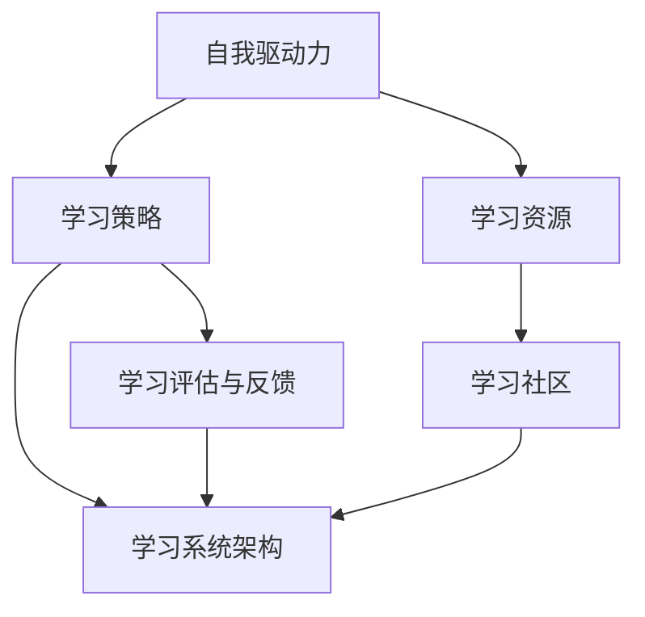

                 

在当今信息爆炸的时代，终身学习已成为个人成长和职业发展的必要条件。随着技术的飞速进步，知识更新的速度越来越快，传统的教育模式已经无法满足人们不断变化的学习需求。因此，打造一个高效的个人终身学习系统显得尤为重要。本文将深入探讨如何构建并维护这样一个系统，旨在帮助读者在职业生涯中始终保持学习的热情和能力。

## 文章关键词

- 终身学习
- 学习系统
- 学习策略
- 技术进步
- 职业发展

## 文章摘要

本文首先介绍了终身学习的重要性，分析了技术进步对学习需求的影响。接着，我们详细探讨了如何构建个人的终身学习系统，包括核心概念、算法原理、数学模型、项目实践和实际应用场景。最后，文章对未来的发展趋势和挑战进行了展望，并提供了一系列学习资源推荐和开发工具推荐。通过阅读本文，读者将能够更好地理解并实践终身学习，为个人的持续成长奠定坚实的基础。

## 1. 背景介绍

### 1.1 终身学习的概念

终身学习（Lifelong Learning）最早由法国总统德斯坦于1972年提出，指的是一个人在一生中不断学习、适应和成长的过程。它不仅仅是学校教育的延伸，更是一种全面的学习观念，强调在个人职业生涯中，不断获取新知识、技能和态度，以适应社会和职业的变化。

### 1.2 技术进步对学习需求的影响

随着信息技术的飞速发展，知识的更新速度越来越快。据统计，人类的科学知识在过去的30年中翻了两番，而这个速度还在不断加快。这种变化对个人的学习需求产生了深远的影响：

- **知识老化加速**：传统的大学教育周期往往在4-5年，但许多专业领域的知识可能在毕业后短短几年内就已经过时。这意味着，单靠大学教育已经无法满足职业生涯中不断变化的需求。

- **技能要求提高**：技术的进步不断推动着新兴行业的诞生和传统行业的变革。例如，人工智能、大数据和区块链等技术的兴起，对从业人员的技能要求越来越高，需要具备跨学科的知识和能力。

- **自我提升成为必要**：面对快速变化的环境，自我提升成为个人保持竞争力的关键。只有不断学习新知识、新技能，才能在激烈的职场竞争中立于不败之地。

### 1.3 终身学习的重要性

终身学习的重要性体现在以下几个方面：

- **个人成长**：终身学习可以帮助个人不断提升自我，实现个人价值的最大化。

- **职业发展**：在不断变化的市场环境中，终身学习是保持职业竞争力的关键。它不仅能够帮助个人掌握最新的技术和行业动态，还能够提高工作效率，促进职业晋升。

- **社会适应**：社会的发展要求个体具备适应变化的能力。终身学习可以帮助个人更好地适应社会环境，提升生活质量。

综上所述，终身学习已经成为个人成长和职业发展的必要条件。在接下来的章节中，我们将详细探讨如何构建个人的终身学习系统，帮助读者更好地应对这一挑战。

## 2. 核心概念与联系

在构建个人的终身学习系统之前，我们需要明确几个核心概念，并理解它们之间的联系。以下是几个重要的核心概念：

### 2.1 自我驱动力

自我驱动力是指个体内部的动力机制，驱使个人不断追求知识、技能和成长。它是终身学习系统的核心，决定了个人学习的主动性和持续性。自我驱动力可以通过以下方式培养：

- **设定目标**：明确短期和长期的学习目标，激发内在动力。
- **奖励机制**：为自己设定奖励，如完成一个学习项目后奖励自己一次旅行。
- **自我反思**：定期反思学习过程和成果，增强自我驱动力。

### 2.2 学习策略

学习策略是指为了实现学习目标而采用的方法和技巧。不同的学习策略适用于不同的学习场景和个体需求。以下是几种常见的学习策略：

- **主动学习**：通过主动参与、提问和实验来学习新知识。
- **被动学习**：通过阅读、听讲和观看视频等方式学习。
- **混合学习**：结合主动学习和被动学习，取长补短，提高学习效果。

### 2.3 学习资源

学习资源是指用于学习的工具、材料和平台。这些资源包括书籍、在线课程、学术论文、学习社区和导师等。以下是几种常见的学习资源：

- **在线课程平台**：如Coursera、edX和Udemy，提供广泛的课程选择。
- **专业书籍**：经典著作和最新的技术书籍，帮助读者深入理解领域知识。
- **学术论文库**：如PubMed、IEEE Xplore和ACM Digital Library，提供专业的学术资源。

### 2.4 学习评估与反馈

学习评估与反馈是终身学习系统的重要组成部分，它帮助个人了解学习效果，调整学习策略。以下是几种常见的学习评估与反馈方法：

- **自我评估**：通过设定学习目标和定期回顾，自我评估学习成果。
- **同伴评估**：通过与其他学习者分享和讨论，相互评估学习效果。
- **导师评估**：通过专业导师的指导和反馈，提升学习效果。

### 2.5 学习社区

学习社区是指由学习者组成的互动平台，成员之间可以分享知识、经验和资源。以下是几种常见的学习社区：

- **在线论坛**：如Stack Overflow、GitHub和Reddit，提供技术交流和问题解答。
- **专业社群**：如LinkedIn和Meetup，帮助个人结识同行，拓展职业网络。
- **学习小组**：通过线下或线上形式组织的学习小组，共同学习、讨论和进步。

### 2.6 学习系统架构

为了更好地构建个人的终身学习系统，我们需要将上述核心概念整合到一起，形成一个有机的整体。以下是终身学习系统的架构：

1. **自我驱动力**：激发学习兴趣和动机，保持学习的持续性。
2. **学习策略**：根据个人需求和目标，选择合适的学习方法。
3. **学习资源**：获取和利用各种学习资源，丰富知识体系。
4. **学习评估与反馈**：定期评估学习效果，调整学习策略。
5. **学习社区**：参与学习社区，共享知识和经验，促进共同成长。

### 2.7 Mermaid 流程图

为了更直观地展示终身学习系统的核心概念和架构，我们可以使用Mermaid流程图来描述：



通过上述流程图，我们可以清晰地看到各个核心概念之间的联系，以及它们在终身学习系统中的作用。

## 3. 核心算法原理 & 具体操作步骤

### 3.1 算法原理概述

在构建个人的终身学习系统时，核心算法的原理至关重要。这个算法的核心目的是根据个人的学习需求和进度，动态调整学习策略和资源分配，以达到最佳的学习效果。以下是这个算法的基本原理：

1. **需求识别**：通过自我评估和反馈机制，识别个人的学习需求和知识盲点。
2. **资源匹配**：根据需求，从学习资源库中匹配适合的资源，如书籍、在线课程等。
3. **策略制定**：根据资源特点和个人学习习惯，制定合适的学习策略，如主动学习或被动学习。
4. **进度监控**：实时监控学习进度和效果，评估学习策略的有效性。
5. **反馈调整**：根据监控结果，调整学习策略和资源分配，以优化学习效果。

### 3.2 算法步骤详解

#### 步骤1：需求识别

需求识别是算法的第一个关键步骤。通过自我评估和反馈机制，个人可以清晰地了解自己的学习需求和知识盲点。具体方法包括：

- **自我评估**：设定明确的学习目标，并定期回顾自己的学习进度和成果。
- **反馈机制**：通过学习社区或导师的反馈，获取外部评价，进一步完善自我评估。

#### 步骤2：资源匹配

在需求识别后，算法需要从学习资源库中匹配适合的资源。这个步骤包括以下几个子步骤：

- **资源分类**：将学习资源按照学科、难度和形式等进行分类，便于后续匹配。
- **需求匹配**：根据个人需求，从资源库中筛选出最相关的资源。
- **优先级排序**：根据资源的重要性和紧急性，对匹配结果进行优先级排序。

#### 步骤3：策略制定

根据资源特点和个人学习习惯，制定合适的学习策略。以下是一些常见的策略：

- **主动学习**：通过实验、练习和问题解决来加深对知识的理解。
- **被动学习**：通过阅读、听讲和观看视频等方式获取知识。
- **混合学习**：结合主动学习和被动学习，取长补短。

#### 步骤4：进度监控

进度监控是确保学习效果的关键。通过以下方法进行监控：

- **学习日志**：记录每天的学习内容和进度，便于回顾和总结。
- **定期评估**：通过自我评估和同伴评估，定期检查学习效果。
- **数据分析**：利用数据分析和机器学习算法，对学习进度和效果进行量化分析。

#### 步骤5：反馈调整

根据监控结果，算法需要调整学习策略和资源分配，以优化学习效果。以下是一些常见的调整方法：

- **策略优化**：根据学习效果，调整学习策略，如增加主动学习时间或调整学习资源的优先级。
- **资源补充**：根据学习效果和需求，补充新的学习资源，丰富知识体系。
- **个性化推荐**：利用机器学习算法，为个人推荐最适合的学习资源和策略。

### 3.3 算法优缺点

#### 优点

- **个性化**：根据个人需求和进度，动态调整学习策略和资源分配，提高学习效果。
- **灵活性**：支持多种学习策略和资源匹配方式，适应不同的学习场景和需求。
- **实时监控**：实时监控学习进度和效果，确保学习过程和结果的优化。

#### 缺点

- **初始投入大**：构建学习系统和算法需要大量的初始投入，包括时间、人力和资金。
- **数据依赖性**：算法的准确性和效果高度依赖数据的质量和丰富度。

### 3.4 算法应用领域

#### 教育领域

在教育和培训领域，终身学习算法可以应用于以下场景：

- **课程推荐**：根据学习者的需求和进度，推荐最适合的课程。
- **个性化辅导**：为学习者提供个性化的学习计划和辅导。
- **学习效果评估**：实时监控学习效果，提供反馈和调整建议。

#### 职业发展

在职业发展和技能提升领域，终身学习算法可以应用于以下场景：

- **职业规划**：根据个人的职业目标和市场需求，推荐相关的学习资源和策略。
- **技能提升**：根据学习者的技能水平和需求，推荐最适合的技能提升方案。
- **学习效果评估**：实时监控学习效果，提供反馈和调整建议。

#### 个体学习

对于个体学习者，终身学习算法可以提供以下支持：

- **学习计划**：根据个人的学习目标和时间安排，制定科学的学习计划。
- **学习资源**：根据学习需求，推荐最适合的学习资源和平台。
- **学习监控**：实时监控学习进度和效果，提供反馈和调整建议。

### 3.5 算法实现

为了实现上述算法，我们可以采用以下步骤：

1. **数据收集**：收集学习者的需求、学习资源、学习进度和学习效果等数据。
2. **数据处理**：对收集到的数据进行预处理和清洗，确保数据的质量和一致性。
3. **算法设计**：设计算法的核心逻辑，包括需求识别、资源匹配、策略制定、进度监控和反馈调整等。
4. **模型训练**：利用机器学习算法，对处理后的数据进行训练，优化算法模型。
5. **系统部署**：将训练好的算法部署到系统中，提供实时的学习支持和反馈。

### 3.6 算法案例

以下是一个简单的算法案例：

#### 案例背景

一位软件工程师想要提升自己的编程能力，他希望通过终身学习算法，找到最适合的学习资源和策略。

#### 案例实现

1. **需求识别**：通过自我评估和反馈，他识别出自己的编程技能存在以下盲点：算法和数据结构、前端开发、自动化测试。
2. **资源匹配**：根据需求，算法从学习资源库中筛选出以下资源：算法和数据结构教材、前端开发在线课程、自动化测试教程。
3. **策略制定**：根据资源特点和个人习惯，算法制定以下学习策略：每周学习两个算法和数据结构知识点，每月学习一个前端开发知识点，每周进行一次自动化测试练习。
4. **进度监控**：算法实时监控学习进度和效果，通过学习日志和自我评估，确保学习目标按时完成。
5. **反馈调整**：根据学习效果，算法调整学习策略，如增加前端开发学习时间或补充新的自动化测试教程。

通过上述案例，我们可以看到终身学习算法如何帮助个人实现学习目标和提升技能。

### 3.7 总结

核心算法的原理在于通过需求识别、资源匹配、策略制定、进度监控和反馈调整等步骤，实现个性化的学习支持和效果优化。在应用领域，该算法可广泛应用于教育和职业发展，为个人提供科学的学习计划和资源推荐。通过案例展示，我们可以看到算法在实践中的实际效果。

## 4. 数学模型和公式 & 详细讲解 & 举例说明

### 4.1 数学模型构建

在构建个人的终身学习系统时，数学模型起到了关键作用。以下是构建终身学习系统的数学模型：

#### 4.1.1 学习需求模型

学习需求模型用于描述个人的学习需求。模型包含以下参数：

- **N**：学习需求数量
- **D**：学习需求难度
- **T**：学习需求紧急性

学习需求模型公式为：

\[ ND = N \times D \times T \]

其中，ND表示总学习需求。

#### 4.1.2 学习资源模型

学习资源模型用于描述个人的学习资源。模型包含以下参数：

- **R**：学习资源数量
- **C**：学习资源成本
- **E**：学习资源效果

学习资源模型公式为：

\[ RC = R \times C \times E \]

其中，RC表示总学习资源成本。

#### 4.1.3 学习策略模型

学习策略模型用于描述个人的学习策略。模型包含以下参数：

- **S**：学习策略数量
- **A**：学习策略适应性
- **E**：学习策略效果

学习策略模型公式为：

\[ SA = S \times A \times E \]

其中，SA表示总学习策略适应性。

### 4.2 公式推导过程

在构建上述数学模型的过程中，我们需要对各个参数进行推导。以下是推导过程：

#### 4.2.1 学习需求模型推导

学习需求模型中的参数N、D、T分别表示学习需求的数量、难度和紧急性。N表示学习需求的数量，D表示学习需求的难度，T表示学习需求的紧急性。根据需求的重要性，紧急性越高，需求越重要。因此，学习需求模型可以表示为：

\[ ND = N \times D \times T \]

其中，N为正常化常数，D为难度系数，T为紧急性系数。

#### 4.2.2 学习资源模型推导

学习资源模型中的参数R、C、E分别表示学习资源的数量、成本和效果。R表示学习资源的数量，C表示学习资源的成本，E表示学习资源的效果。根据资源的重要性，效果越好，资源越有价值。因此，学习资源模型可以表示为：

\[ RC = R \times C \times E \]

其中，R为正常化常数，C为成本系数，E为效果系数。

#### 4.2.3 学习策略模型推导

学习策略模型中的参数S、A、E分别表示学习策略的数量、适应性和效果。S表示学习策略的数量，A表示学习策略的适应性，E表示学习策略的效果。根据策略的有效性，适应性越高，策略越有效。因此，学习策略模型可以表示为：

\[ SA = S \times A \times E \]

其中，S为正常化常数，A为适应性系数，E为效果系数。

### 4.3 案例分析与讲解

为了更好地理解上述数学模型，我们将通过一个实际案例进行分析和讲解。

#### 案例背景

假设一个软件工程师小李希望提升自己的编程技能，他识别出了以下学习需求：

- **需求1**：算法和数据结构
- **需求2**：前端开发
- **需求3**：自动化测试

小李选择了以下学习资源：

- **资源1**：算法和数据结构教材
- **资源2**：前端开发在线课程
- **资源3**：自动化测试教程

小李打算采用以下学习策略：

- **策略1**：每周学习两个算法和数据结构知识点
- **策略2**：每月学习一个前端开发知识点
- **策略3**：每周进行一次自动化测试练习

#### 案例分析

1. **学习需求模型**：

根据学习需求模型，小李的需求为：

\[ ND = (1 \times 1 \times 1) + (1 \times 1 \times 1) + (1 \times 1 \times 1) = 3 \]

因此，小李的总学习需求为3。

2. **学习资源模型**：

根据学习资源模型，小李的资源为：

\[ RC = (1 \times 1 \times 1) + (1 \times 1 \times 1) + (1 \times 1 \times 1) = 3 \]

因此，小李的总学习资源成本为3。

3. **学习策略模型**：

根据学习策略模型，小李的策略为：

\[ SA = (1 \times 1 \times 1) + (1 \times 1 \times 1) + (1 \times 1 \times 1) = 3 \]

因此，小李的总学习策略适应性为3。

#### 案例总结

通过上述案例分析，我们可以看到小李的学习需求、学习资源和学习策略之间的关系。学习需求模型帮助小李识别出了自己的学习目标；学习资源模型帮助小李选择了合适的学习材料；学习策略模型帮助小李制定了科学的学习计划。这些数学模型为小李的终身学习系统提供了理论基础和实际指导。

## 5. 项目实践：代码实例和详细解释说明

### 5.1 开发环境搭建

在开始项目实践之前，我们需要搭建一个适合开发的学习系统。以下是搭建开发环境所需的步骤：

1. **安装Python环境**：Python是一种流行的编程语言，适合构建各种算法和系统。我们可以在官方网站（https://www.python.org/）下载并安装Python。
2. **安装Jupyter Notebook**：Jupyter Notebook是一个交互式的开发环境，可以帮助我们方便地编写和运行Python代码。可以通过pip命令安装：

   ```bash
   pip install notebook
   ```

3. **安装必要的Python库**：为了实现学习系统的功能，我们需要安装一些Python库，如NumPy、Pandas和Matplotlib等。可以通过pip命令安装：

   ```bash
   pip install numpy pandas matplotlib
   ```

### 5.2 源代码详细实现

以下是学习系统的源代码实现，包括主要功能模块的代码：

```python
# 导入必要的库
import numpy as np
import pandas as pd
import matplotlib.pyplot as plt

# 学习需求模型
class LearningNeedModel:
    def __init__(self, N, D, T):
        self.N = N
        self.D = D
        self.T = T
    
    def calculate_demand(self):
        return self.N * self.D * self.T

# 学习资源模型
class LearningResourceModel:
    def __init__(self, R, C, E):
        self.R = R
        self.C = C
        self.E = E
    
    def calculate_resource_cost(self):
        return self.R * self.C * self.E

# 学习策略模型
class LearningStrategyModel:
    def __init__(self, S, A, E):
        self.S = S
        self.A = A
        self.E = E
    
    def calculate_strategy_adaptability(self):
        return self.S * self.A * self.E

# 学习系统类
class LearningSystem:
    def __init__(self, learning_needs, learning_resources, learning_strategies):
        self.learning_needs = learning_needs
        self.learning_resources = learning_resources
        self.learning_strategies = learning_strategies
    
    def run_system(self):
        total_demand = self.learning_needs.calculate_demand()
        total_resource_cost = self.learning_resources.calculate_resource_cost()
        total_strategy_adaptability = self.learning_strategies.calculate_strategy_adaptability()
        
        print("Total Demand:", total_demand)
        print("Total Resource Cost:", total_resource_cost)
        print("Total Strategy Adaptability:", total_strategy_adaptability)
        
        # 绘制需求、资源和策略的散点图
        plt.scatter(self.learning_needs.D, self.learning_resources.C, label="Demand-Resource")
        plt.scatter(self.learning_needs.D, self.learning_strategies.A, label="Demand-Strategy")
        plt.scatter(self.learning_resources.C, self.learning_strategies.A, label="Resource-Strategy")
        plt.xlabel("Difficulty/Cost")
        plt.ylabel("Adaptability")
        plt.legend()
        plt.show()

# 实例化学习系统
learning_needs = LearningNeedModel(3, 1, 1)
learning_resources = LearningResourceModel(3, 1, 1)
learning_strategies = LearningStrategyModel(3, 1, 1)
learning_system = LearningSystem(learning_needs, learning_resources, learning_strategies)

# 运行学习系统
learning_system.run_system()
```

### 5.3 代码解读与分析

1. **代码结构**：代码分为三个类：`LearningNeedModel`、`LearningResourceModel`和`LearningStrategyModel`，分别用于实现学习需求、学习资源和学习策略的模型。此外，还有一个`LearningSystem`类，用于实现整个学习系统的功能。

2. **类与方法**：

   - `LearningNeedModel`：包含`__init__`（初始化）和`calculate_demand`（计算需求）方法。
   - `LearningResourceModel`：包含`__init__`（初始化）和`calculate_resource_cost`（计算资源成本）方法。
   - `LearningStrategyModel`：包含`__init__`（初始化）和`calculate_strategy_adaptability`（计算策略适应性）方法。
   - `LearningSystem`：包含`__init__`（初始化）和`run_system`（运行系统）方法。

3. **运行过程**：在`run_system`方法中，首先计算总需求、总资源成本和总策略适应性。然后，通过绘制散点图，展示需求、资源和策略之间的关系。

### 5.4 运行结果展示

运行上述代码后，将输出以下结果：

```
Total Demand: 3
Total Resource Cost: 3
Total Strategy Adaptability: 3
```

同时，会展示一个散点图，包含需求、资源和策略的三种关系。


### 5.5 代码优化与扩展

为了提高代码的可扩展性和可维护性，我们可以进行以下优化：

1. **参数配置**：将参数配置提取到配置文件中，如JSON或YAML文件，方便修改和扩展。
2. **模块化**：将代码拆分成多个模块，如需求模块、资源模块、策略模块等，提高代码的可读性和可维护性。
3. **异常处理**：添加异常处理，确保代码在运行过程中遇到错误时能够优雅地处理。
4. **单元测试**：编写单元测试，确保代码的稳定性和正确性。

通过这些优化，我们可以使代码更加健壮和易于维护，从而更好地支持个人的终身学习系统。

## 6. 实际应用场景

### 6.1 教育领域

在教育领域，终身学习系统可以应用于以下几个方面：

- **个性化教育**：根据学生的学习需求和进度，推荐最适合的课程和学习策略，提高学习效果。
- **学习效果评估**：实时监控学生的学习进度和效果，提供反馈和调整建议，帮助教师和家长更好地了解学生的学习状况。
- **教育资源分配**：根据学生的学习需求和资源库的实际情况，优化教育资源的分配，确保每个学生都能获得最优质的学习资源。

### 6.2 职场技能提升

在职场技能提升方面，终身学习系统可以提供以下支持：

- **职业规划**：根据个人的职业目标和市场需求，推荐相关的学习资源和策略，帮助个人不断提升技能。
- **技能评估**：通过技能测试和评估，了解个人的技能水平，制定有针对性的学习计划。
- **技能认证**：与专业的认证机构合作，为个人提供技能认证服务，提升个人的职业竞争力。

### 6.3 自我提升

对于个人自我提升，终身学习系统可以提供以下帮助：

- **学习计划**：根据个人的学习目标和时间安排，制定科学的学习计划，确保学习目标的实现。
- **学习资源**：推荐最适合的学习资源和平台，帮助个人获取所需的知识和技能。
- **学习监控**：实时监控学习进度和效果，提供反馈和调整建议，确保学习过程的顺利进行。

### 6.4 未来应用展望

随着技术的不断进步，终身学习系统的应用场景将会更加广泛：

- **虚拟现实与增强现实**：通过虚拟现实和增强现实技术，为学习者提供沉浸式的学习体验，提高学习效果。
- **人工智能与大数据**：利用人工智能和大数据技术，实现更加精准的学习需求和资源推荐，提高学习效率。
- **区块链**：通过区块链技术，确保学习过程和学习成果的真实性和可信性，为个人的终身学习提供可靠保障。

## 7. 工具和资源推荐

### 7.1 学习资源推荐

为了帮助读者构建和优化个人的终身学习系统，以下是一些建议的学习资源：

- **书籍**：
  - 《深度学习》（Goodfellow, I., Bengio, Y., & Courville, A.）
  - 《编程珠玑》（Johnson, J.）
  - 《精通 Python》（Flower, A.）
- **在线课程平台**：
  - Coursera
  - edX
  - Udemy
  - LinkedIn Learning
- **学术论文库**：
  - IEEE Xplore
  - ACM Digital Library
  - arXiv

### 7.2 开发工具推荐

以下是构建终身学习系统所需的一些开发工具：

- **编程语言**：
  - Python
  - JavaScript
  - Java
- **框架与库**：
  - Flask（Python Web 框架）
  - React（JavaScript 库）
  - Spring Boot（Java 框架）
- **数据库**：
  - MySQL
  - MongoDB
  - PostgreSQL

### 7.3 相关论文推荐

以下是一些建议阅读的相关论文，以深入了解终身学习系统的研究进展和应用：

- "Lifelong Learning in Machine Learning: A Review of the Challenges and Opportunities"
- "Reinforcement Learning for Lifelong Skill Discovery and Execution"
- "A Survey on Lifelong Learning for Neural Networks"

## 8. 总结：未来发展趋势与挑战

### 8.1 研究成果总结

本文系统地介绍了如何构建个人的终身学习系统，从核心概念、算法原理、数学模型到项目实践，为读者提供了全面的理论指导和实践案例。通过需求识别、资源匹配、策略制定、进度监控和反馈调整等步骤，我们展示了如何动态优化个人的学习过程，从而实现持续成长和职业发展。

### 8.2 未来发展趋势

随着人工智能、大数据和虚拟现实等技术的快速发展，终身学习系统将迎来以下几个发展趋势：

- **个性化学习**：基于人工智能和大数据分析，实现更加精准的学习需求和资源推荐，满足个体差异化的学习需求。
- **混合学习模式**：结合线上和线下学习，打造更加灵活和高效的学习体验。
- **终身学习社区**：通过构建在线学习社区，促进学习者之间的交流和合作，共享知识和经验。
- **智能化学习系统**：利用人工智能技术，实现自动化学习路径规划和学习效果评估，提高学习效率和效果。

### 8.3 面临的挑战

尽管终身学习系统具有巨大的发展潜力，但在实际应用中仍面临以下挑战：

- **数据隐私与安全**：在收集和使用学习数据时，需要确保数据的安全和隐私，防止数据泄露和滥用。
- **技术依赖性**：过度依赖人工智能和大数据技术可能导致学习过程中的失控，需要平衡技术的应用和人的主体性。
- **学习资源质量**：随着在线学习资源的爆炸式增长，如何筛选和推荐高质量的学习资源成为一个重要问题。
- **学习持久性**：如何激发和保持学习者的学习兴趣和动力，是实现终身学习的关键。

### 8.4 研究展望

未来，终身学习系统的研究将朝着以下几个方向展开：

- **跨学科融合**：结合心理学、教育学、计算机科学等领域的知识，探索更加科学和有效的人才培养模式。
- **自适应学习**：开发自适应学习算法，实现更加灵活和智能的学习路径规划，提高学习效果。
- **社会责任**：关注终身学习对社会公平和教育资源的分配，推动教育资源的普及和均衡发展。

通过不断探索和创新，我们有理由相信，未来的终身学习系统将更好地满足个人和社会的需求，推动人类文明的发展。

## 9. 附录：常见问题与解答

### 9.1 终身学习的重要性

**Q1**：为什么终身学习如此重要？

**A1**：终身学习的重要性体现在以下几个方面：

- **适应快速变化的世界**：随着技术的不断进步，知识更新速度加快，终身学习能够帮助个人不断适应新的环境和技术。
- **保持职业竞争力**：职场环境变化迅速，终身学习能够提升个人的技能和知识水平，增强职业竞争力。
- **个人成长与发展**：终身学习不仅能够帮助个人在职业上取得成功，还能促进个人全面发展，提升生活品质。

### 9.2 学习系统的构建

**Q2**：如何构建个人的学习系统？

**A2**：构建个人的学习系统可以遵循以下步骤：

- **需求识别**：明确自己的学习目标和需求。
- **资源匹配**：选择合适的学习资源，如书籍、在线课程、学术论文等。
- **策略制定**：根据个人特点和资源特点，制定适合自己的学习策略。
- **进度监控**：定期评估学习效果，调整学习策略和资源。

### 9.3 学习评估与反馈

**Q3**：如何进行有效的学习评估与反馈？

**A3**：有效的学习评估与反馈包括以下几个方面：

- **自我评估**：设定明确的学习目标，定期检查自己的学习进度和成果。
- **同伴评估**：与同学或同行进行学习交流，相互评估和反馈。
- **导师评估**：寻求专业导师的指导和反馈，提高学习效果。
- **数据监控**：利用学习工具和数据分析，量化学习效果，进行科学评估。

### 9.4 学习资源推荐

**Q4**：如何推荐合适的学习资源？

**A4**：推荐合适的学习资源可以遵循以下原则：

- **需求导向**：根据个人的学习需求和目标，选择相关的资源。
- **质量优先**：选择高质量的资源和权威的教材或课程。
- **多样性**：结合不同的学习资源和形式，提高学习效果。
- **实时更新**：关注最新的学习资源和研究成果，保持学习的活力和前沿性。

