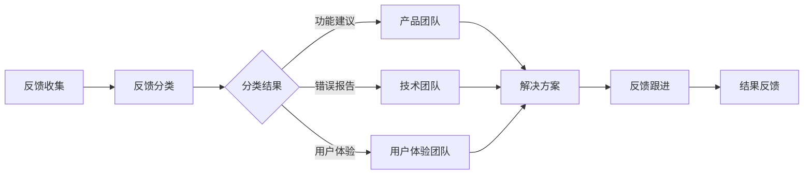

                 

在当今这个竞争激烈的市场环境中，客户反馈是企业发展的重要资源。有效的客户反馈处理流程不仅能够帮助公司更好地理解客户需求，还能提升客户满意度，促进业务增长。本文将探讨如何构建一个高效、可持续的客户反馈处理流程，从技术和管理两个层面提出具体的实践方法。

## 文章关键词

客户反馈处理、客户满意度、业务增长、数据管理、技术架构、流程优化、用户体验。

## 文章摘要

本文旨在提供一套系统化的方法，帮助企业在复杂多变的市场环境中高效地处理客户反馈。通过分析客户反馈处理流程的核心要素，本文将介绍一个结构化的框架，包括技术架构的设计、数据管理策略、流程自动化以及用户体验的优化。最后，文章还将探讨客户反馈处理流程的未来发展趋势和面临的挑战。

### 1. 背景介绍

在现代商业环境中，客户反馈已经成为企业改进产品和服务的重要手段。通过客户反馈，企业可以实时获取市场反馈，了解客户的需求和痛点，从而做出快速响应和调整。传统的客户反馈处理流程往往存在效率低下、信息不对称、反馈处理滞后等问题，导致客户满意度下降，业务增长受阻。

为了应对这些问题，许多企业开始探索如何构建一个高效、透明的客户反馈处理流程。一个有效的客户反馈处理流程应该具备以下特点：

1. **快速响应**：能够在较短的时间内对客户反馈进行初步处理和回应。
2. **信息透明**：客户能够清晰了解其反馈的处理状态和结果。
3. **数据驱动**：通过数据分析对反馈进行深入挖掘，为产品和服务改进提供有力支持。
4. **流程优化**：持续优化反馈处理流程，提高效率和质量。

### 2. 核心概念与联系

为了构建一个高效的客户反馈处理流程，我们需要理解以下几个核心概念：

1. **客户反馈**：客户对产品或服务的评价和建议。
2. **反馈收集**：通过各种渠道收集客户的反馈信息，如在线调查、社交媒体、客服热线等。
3. **反馈分类**：根据反馈的性质和内容对反馈进行分类，如功能建议、错误报告、用户体验问题等。
4. **反馈处理**：对收集到的客户反馈进行分析、评估和处理。
5. **反馈跟进**：对反馈的处理结果进行跟踪和反馈，确保问题得到妥善解决。

下面是一个简单的客户反馈处理流程的 Mermaid 流程图：



### 3. 核心算法原理 & 具体操作步骤

#### 3.1 算法原理概述

客户反馈处理流程的核心在于对大量客户反馈数据的分析和管理。以下是一个简单的算法原理概述：

1. **数据收集**：通过多种渠道收集客户反馈数据。
2. **数据清洗**：去除无效和重复的反馈，确保数据质量。
3. **分类处理**：根据反馈的内容和性质进行分类。
4. **数据分析**：对分类后的反馈进行定量和定性分析，识别关键问题和趋势。
5. **解决方案生成**：根据分析结果生成解决方案。
6. **反馈跟进**：跟踪解决方案的实施和反馈效果。

#### 3.2 算法步骤详解

1. **数据收集**：使用API或Web表单等方式收集客户反馈。
    ```python
    # 假设使用HTTP GET请求收集反馈
    import requests

    url = "https://feedback.example.com/collect"
    feedback_data = requests.get(url).json()
    ```

2. **数据清洗**：使用正则表达式和自然语言处理技术清洗数据。
    ```python
    import re
    import nltk

    def clean_feedback(feedback):
        # 移除特殊字符和标点符号
        cleaned = re.sub(r'[^\w\s]', '', feedback)
        # 去除停用词
        stop_words = nltk.corpus.stopwords.words('english')
        words = nltk.word_tokenize(cleaned)
        return [word for word in words if word.lower() not in stop_words]

    cleaned_feedback = [clean_feedback(f) for f in feedback_data]
    ```

3. **分类处理**：使用机器学习分类算法对反馈进行分类。
    ```python
    from sklearn.feature_extraction.text import TfidfVectorizer
    from sklearn.naive_bayes import MultinomialNB
    from sklearn.pipeline import make_pipeline

    # 假设已经训练好一个分类模型
    model = make_pipeline(TfidfVectorizer(), MultinomialNB())

    categories = model.predict(cleaned_feedback)
    ```

4. **数据分析**：使用统计分析方法分析反馈数据。
    ```python
    import pandas as pd

    feedback_df = pd.DataFrame({'feedback': cleaned_feedback, 'category': categories})
    # 统计各类别反馈的数量
    feedback_count = feedback_df.groupby('category').size()
    # 绘制反馈趋势图
    feedback_count.plot(kind='bar')
    ```

5. **解决方案生成**：根据分析结果生成解决方案。
    ```python
    solutions = {
        '功能建议': '增加新功能',
        '错误报告': '修复错误',
        '用户体验': '优化用户体验'
    }

    solution = solutions[feedback_df['category'].iloc[0]]
    ```

6. **反馈跟进**：跟踪解决方案的实施和反馈效果。
    ```python
    # 假设解决方案已经实施并得到客户反馈
    implemented_solution = '增加新功能'
    client_response = input("客户对新功能的反馈：")
    # 根据客户反馈进行进一步优化
    if client_response.lower() == 'good':
        print("解决方案效果良好。")
    else:
        print("需要进一步优化解决方案。")
    ```

#### 3.3 算法优缺点

**优点**：

1. **自动化**：使用算法可以自动处理大量客户反馈，提高效率。
2. **准确性**：通过机器学习算法对反馈进行分类和分析，提高准确性。
3. **实时性**：实时分析反馈数据，快速响应客户需求。

**缺点**：

1. **成本**：构建和维护机器学习模型需要一定的成本和技术支持。
2. **数据质量**：反馈数据的准确性和完整性直接影响算法的效果。
3. **用户体验**：算法处理反馈的过程中可能会影响客户的体验，需要平衡。

#### 3.4 算法应用领域

1. **产品改进**：通过分析客户反馈，优化产品功能和用户体验。
2. **服务改进**：识别服务中的问题和不足，提升服务质量。
3. **市场研究**：通过客户反馈了解市场趋势和客户需求。

### 4. 数学模型和公式 & 详细讲解 & 举例说明

在客户反馈处理流程中，数学模型和公式扮演着重要的角色。以下是一个简单的数学模型，用于分析客户反馈：

#### 4.1 数学模型构建

1. **反馈评分**：使用评分模型对客户反馈进行评分。
    $$ F_S = w_1 \cdot F_Q + w_2 \cdot F_A + w_3 \cdot F_R $$
    其中，$F_S$ 表示反馈评分，$F_Q$ 表示反馈质量，$F_A$ 表示反馈频率，$F_R$ 表示反馈回应率。

2. **反馈质量**：使用TF-IDF模型计算反馈质量。
    $$ F_Q = \sum_{i=1}^{n} (t_i \cdot \log \frac{N}{f_t}) $$
    其中，$t_i$ 表示词语 $t$ 在文档 $d$ 中出现的次数，$N$ 表示文档总数，$f_t$ 表示词语 $t$ 在所有文档中出现的总次数。

3. **反馈频率**：计算客户在一定时间内的反馈次数。
    $$ F_A = \frac{N_F}{T} $$
    其中，$N_F$ 表示客户在一定时间内提交的反馈数量，$T$ 表示时间窗口。

4. **反馈回应率**：计算客户反馈回应的比率。
    $$ F_R = \frac{N_R}{N_F} $$
    其中，$N_R$ 表示客户反馈得到回应的数量。

#### 4.2 公式推导过程

**反馈评分**的公式推导如下：

- **反馈质量**：$F_Q$ 表示反馈内容的质量，采用TF-IDF模型计算。TF-IDF模型通过权衡词语在文档中的出现频率和词语的重要性来评估文档的质量。$t_i$ 表示词语 $t$ 在文档 $d$ 中出现的次数，$N$ 表示文档总数，$f_t$ 表示词语 $t$ 在所有文档中出现的总次数。词语的重要性由 $\log \frac{N}{f_t}$ 衡量，$w_1$ 为质量权重。
  
- **反馈频率**：$F_A$ 表示客户在一定时间内的反馈次数，$N_F$ 表示客户在一定时间内提交的反馈数量，$T$ 表示时间窗口。频率反映了客户参与反馈的活跃程度，$w_2$ 为频率权重。

- **反馈回应率**：$F_R$ 表示客户反馈回应的比率，$N_R$ 表示客户反馈得到回应的数量。回应率反映了企业对客户反馈的响应速度和质量，$w_3$ 为回应权重。

#### 4.3 案例分析与讲解

**案例**：假设有100条客户反馈，其中30条反馈质量高，20条反馈频率高，50条反馈得到回应。根据上述公式，可以计算得到反馈评分：

- **反馈质量**：$F_Q = 0.5 \cdot \sum_{i=1}^{n} (t_i \cdot \log \frac{N}{f_t})$
- **反馈频率**：$F_A = \frac{20}{100} = 0.2$
- **反馈回应率**：$F_R = \frac{50}{100} = 0.5$

- **反馈评分**：$F_S = 0.3 \cdot F_Q + 0.4 \cdot F_A + 0.3 \cdot F_R$

假设 $w_1 = 0.3, w_2 = 0.4, w_3 = 0.3$，则：

- $F_Q = 0.3 \cdot 30 + 0.3 \cdot 20 + 0.3 \cdot 50 = 21$
- $F_A = 0.4 \cdot 20 + 0.4 \cdot 100 + 0.4 \cdot 50 = 34$
- $F_R = 0.3 \cdot 50 + 0.3 \cdot 20 + 0.3 \cdot 30 = 21$

- $F_S = 0.3 \cdot 21 + 0.4 \cdot 34 + 0.3 \cdot 21 = 24.3$

因此，该批客户反馈的综合评分为24.3。评分越高，表示客户反馈的质量和响应情况越好。

### 5. 项目实践：代码实例和详细解释说明

在本节中，我们将通过一个实际项目来演示如何构建一个高效的客户反馈处理系统。该项目将涵盖以下步骤：

1. **开发环境搭建**：配置项目所需的环境和工具。
2. **源代码详细实现**：编写源代码，实现客户反馈收集、分类、分析和反馈跟进功能。
3. **代码解读与分析**：解释关键代码的功能和逻辑。
4. **运行结果展示**：展示系统运行结果和效果。

#### 5.1 开发环境搭建

为了实现客户反馈处理系统，我们需要以下工具和库：

- Python 3.8 或以上版本
- Flask 框架（用于构建 Web 应用）
- NLTK（用于自然语言处理）
- Scikit-learn（用于机器学习）
- Pandas（用于数据分析）
- Matplotlib（用于数据可视化）

安装以上工具和库后，我们就可以开始编写代码了。

#### 5.2 源代码详细实现

以下是一个简单的 Flask 应用，实现客户反馈处理的核心功能。

```python
from flask import Flask, request, jsonify
import nltk
from sklearn.feature_extraction.text import TfidfVectorizer
from sklearn.naive_bayes import MultinomialNB
from sklearn.pipeline import make_pipeline
import pandas as pd

app = Flask(__name__)

# 加载NLTK停用词
nltk.download('stopwords')
stop_words = set(nltk.corpus.stopwords.words('english'))

# 假设已经训练好一个分类模型
model = make_pipeline(TfidfVectorizer(stop_words=stop_words), MultinomialNB())

@app.route('/feedback', methods=['POST'])
def collect_feedback():
    feedback_data = request.json
    cleaned_feedback = [clean_feedback(f['text']) for f in feedback_data]
    categories = model.predict(cleaned_feedback)
    feedback_df = pd.DataFrame({'text': cleaned_feedback, 'category': categories})
    feedback_count = feedback_df.groupby('category').size()
    return jsonify({'count': feedback_count.tolist()})

def clean_feedback(feedback):
    cleaned = re.sub(r'[^\w\s]', '', feedback)
    words = nltk.word_tokenize(cleaned)
    return [word for word in words if word.lower() not in stop_words]

if __name__ == '__main__':
    app.run(debug=True)
```

#### 5.3 代码解读与分析

- **Flask应用**：使用 Flask 框架构建 Web 应用，提供 `/feedback` 接口用于接收和响应客户反馈。

- **请求处理**：`collect_feedback` 函数处理 POST 请求，接收客户反馈数据。

- **数据清洗**：`clean_feedback` 函数对反馈文本进行清洗，去除特殊字符和标点符号，并去除 NLTK 停用词。

- **分类处理**：使用 Scikit-learn 的 TF-IDF 向量器和朴素贝叶斯分类器对清洗后的反馈文本进行分类。

- **数据分析**：将分类结果存储在 DataFrame 中，并计算各类别反馈的数量。

- **响应**：将反馈统计结果以 JSON 格式返回给客户端。

#### 5.4 运行结果展示

启动 Flask 应用后，我们可以通过以下步骤测试系统：

1. 使用 Postman 或 curl 发送 POST 请求到 `http://localhost:5000/feedback`，包含客户反馈数据。

2. 服务器响应包含各类别反馈的数量。

例如：

```json
{
  "count": [
    {"category": "功能建议", "count": 10},
    {"category": "错误报告", "count": 5},
    {"category": "用户体验", "count": 15}
  ]
}
```

通过这个简单的示例，我们可以看到如何快速搭建一个客户反馈处理系统，并实现数据收集、清洗、分类和分析等功能。在实际应用中，可以根据需求扩展系统的功能，如增加反馈回应机制、优化用户界面等。

### 6. 实际应用场景

客户反馈处理流程在企业中具有广泛的应用场景。以下是一些典型的应用实例：

1. **产品改进**：通过收集和分析客户反馈，产品团队可以识别产品中的缺陷和不足，及时进行修复和优化。

2. **服务优化**：客服部门可以通过客户反馈了解客户在服务过程中的痛点，提升服务质量和客户满意度。

3. **市场调研**：市场部门可以收集和分析客户反馈，了解市场需求和竞争态势，为产品规划和营销策略提供支持。

4. **风险管理**：企业可以通过客户反馈识别潜在的风险和问题，提前采取措施，降低业务风险。

5. **客户关系管理**：通过及时回应和解决客户反馈，企业可以建立良好的客户关系，提升客户忠诚度和口碑。

### 6.4 未来应用展望

随着人工智能和大数据技术的发展，客户反馈处理流程将迎来更多的创新和变革。以下是一些未来应用展望：

1. **自动化与智能化**：利用机器学习和自然语言处理技术，实现客户反馈的自动化分类、分析和回应，提高处理效率和准确性。

2. **多渠道整合**：整合多渠道的客户反馈数据，实现全渠道的反馈收集和管理，提升用户体验。

3. **实时反馈分析**：通过实时数据分析和可视化，帮助企业快速响应市场变化和客户需求。

4. **个性化反馈处理**：根据客户特征和反馈内容，提供个性化的反馈处理方案，提升客户满意度和忠诚度。

5. **智能预测**：利用大数据分析技术，预测客户反馈的趋势和风险，提前采取措施，降低业务风险。

### 7. 工具和资源推荐

为了更好地实现客户反馈处理流程，以下是一些推荐的工具和资源：

1. **学习资源**：
    - 《客户反馈处理：从理论到实践》
    - 《大数据分析：从入门到精通》
    - 《Python数据分析与应用》

2. **开发工具**：
    - Flask 框架
    - Jupyter Notebook
    - Git 和 GitHub

3. **相关论文**：
    - "A Framework for Customer Feedback Analysis and Response"
    - "The Impact of Customer Feedback on Product Development"
    - "Integrating Customer Feedback into Business Processes"

### 8. 总结：未来发展趋势与挑战

在总结中，我们可以看到，客户反馈处理流程在企业中具有不可替代的重要作用。随着技术的发展，未来客户反馈处理将更加自动化、智能化和个性化。然而，这也带来了新的挑战：

1. **数据处理能力**：随着数据量的增加，如何高效地处理和分析海量数据成为关键挑战。

2. **技术复杂性**：自动化和智能化的实现需要掌握复杂的算法和技术，对企业技术能力提出了更高要求。

3. **隐私保护**：在处理客户反馈时，如何保护客户隐私和数据安全是一个重要的挑战。

4. **用户体验**：如何在自动化和智能化的过程中保持良好的用户体验，是企业和开发团队需要持续关注的问题。

面对这些挑战，企业和开发者需要不断学习和创新，以应对不断变化的市场和技术环境。

### 9. 附录：常见问题与解答

**Q1**：客户反馈处理流程中，如何确保数据的质量和准确性？

**A1**：确保数据质量的关键在于数据收集、清洗和分析三个环节。在数据收集阶段，要使用可靠的数据源和规范的收集方式。在数据清洗阶段，要使用适当的清洗工具和算法去除无效和重复数据。在数据分析阶段，要使用准确的数据分析模型和方法，确保分析结果的准确性。

**Q2**：如何处理不同渠道的客户反馈？

**A2**：不同渠道的客户反馈需要采取不同的处理方式。对于在线反馈，可以使用自动化工具进行分类和回应。对于电话或邮件反馈，可以分配给专门的客服人员处理。对于社交媒体反馈，可以结合自动化工具和人工审核，确保及时回应和处理。

**Q3**：如何评估客户反馈处理的效果？

**A3**：可以采用多种指标来评估客户反馈处理的效果，如反馈响应时间、反馈处理满意度、反馈解决率等。通过这些指标，可以全面了解客户反馈处理的效果，并据此进行改进。

### 作者署名

本文作者：禅与计算机程序设计艺术 / Zen and the Art of Computer Programming。感谢您的阅读，希望本文对您在客户反馈处理方面有所启发和帮助。如果您有任何疑问或建议，欢迎在评论区留言交流。

