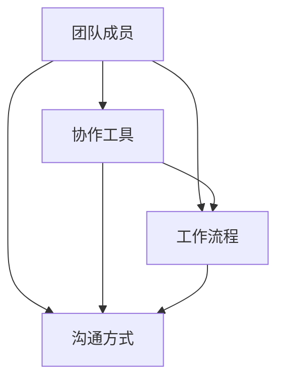

                 

关键词：远程团队协作、协作文化、高效协作、工作流程、沟通工具、技术架构、文化建立、团队管理、敏捷开发

摘要：本文旨在探讨如何在全球化的背景下，构建并维护一个高效的远程团队协作文化。通过分析远程协作的现状、核心概念及其联系，深入解析核心算法原理和具体操作步骤，以及数学模型和公式，结合项目实践和实际应用场景，最终总结出远程团队协作的未来发展趋势与挑战，并提供相关工具和资源推荐。

## 1. 背景介绍

随着互联网和通信技术的迅猛发展，远程工作已经成为越来越多企业选择的工作模式。这不仅为企业降低了成本，还提高了员工的灵活性和工作效率。然而，远程协作也带来了许多新的挑战，如沟通不畅、协作困难、文化冲突等。因此，如何打造高效的远程团队协作文化，成为企业和团队亟需解决的问题。

本文将围绕以下主题展开：

1. **核心概念与联系**：介绍远程团队协作的关键概念，并使用Mermaid流程图展示其联系。
2. **核心算法原理 & 具体操作步骤**：详细解析如何实现高效协作的算法原理和操作步骤。
3. **数学模型和公式**：介绍数学模型和公式的构建、推导过程，并结合实际案例进行讲解。
4. **项目实践：代码实例和详细解释说明**：通过实际项目，展示如何应用上述理论进行远程团队协作。
5. **实际应用场景**：探讨远程团队协作在不同领域的应用，以及未来的发展前景。
6. **工具和资源推荐**：推荐一些有助于远程团队协作的学习资源、开发工具和相关论文。
7. **总结：未来发展趋势与挑战**：总结研究成果，展望未来发展趋势和面临的挑战。

## 2. 核心概念与联系

### 2.1 远程团队协作的概念

远程团队协作指的是团队成员分布在不同的地理位置，通过互联网和通信技术进行合作和交流的工作模式。它包括以下几个方面：

- **团队成员**：包括项目经理、开发者、测试人员、设计师等。
- **协作工具**：如即时通讯工具、项目管理工具、代码托管平台等。
- **工作流程**：包括任务分配、进度跟踪、代码审查、测试等。
- **沟通方式**：如视频会议、邮件、即时通讯等。

### 2.2 核心概念的联系

以下是远程团队协作核心概念的Mermaid流程图，展示了各个概念之间的联系：



从流程图中可以看出，团队成员通过协作工具实现工作流程，并通过沟通方式进行交流和协作。

## 3. 核心算法原理 & 具体操作步骤

### 3.1 算法原理概述

远程团队协作的核心算法原理在于如何有效地分配任务、跟踪进度和确保高质量的沟通。以下是三个关键步骤：

1. **任务分配**：根据团队成员的技能和经验，合理分配任务。
2. **进度跟踪**：使用项目管理工具实时跟踪任务进度，确保按时完成。
3. **沟通协作**：采用多种沟通方式，确保团队成员之间的信息畅通。

### 3.2 算法步骤详解

#### 3.2.1 任务分配

1. **评估团队成员的技能和经验**：项目经理需要了解每位团队成员的专业技能和项目经验，以便进行合理的任务分配。
2. **制定任务分配计划**：根据项目需求和团队成员的能力，制定详细的任务分配计划。
3. **沟通任务分配结果**：向团队成员传达任务分配结果，并确保他们明确任务目标和预期成果。

#### 3.2.2 进度跟踪

1. **选择合适的项目管理工具**：如JIRA、Trello、Asana等，根据团队规模和项目需求选择合适的工具。
2. **建立任务进度跟踪机制**：定期更新任务进度，确保团队成员和项目经理都能实时掌握任务状态。
3. **进行进度评估和调整**：根据实际进度，及时调整任务计划，确保项目按时完成。

#### 3.2.3 沟通协作

1. **使用即时通讯工具**：如Slack、Microsoft Teams等，实现团队成员之间的实时沟通。
2. **定期组织视频会议**：讨论项目进展、解决问题和分享经验。
3. **建立知识库和文档**：确保团队成员能够方便地获取和共享项目资料。

### 3.3 算法优缺点

#### 优点：

- **提高工作效率**：团队成员可以灵活安排工作时间和地点，提高工作效率。
- **减少沟通成本**：多种沟通工具和方式的使用，降低了团队成员之间的沟通成本。
- **促进团队协作**：合理的任务分配和进度跟踪机制，促进了团队成员之间的协作。

#### 缺点：

- **沟通不畅**：远程协作容易导致信息不对称和沟通不畅。
- **文化冲突**：团队成员来自不同的文化背景，可能存在文化冲突。
- **管理难度大**：远程团队的管理难度相对较大，需要更多的监督和协调。

### 3.4 算法应用领域

远程团队协作算法适用于各种领域的项目，如软件开发、市场营销、客户服务、产品管理等。特别是在软件开发领域，远程团队协作已经成为主流的工作模式。

## 4. 数学模型和公式

### 4.1 数学模型构建

远程团队协作的数学模型可以基于以下三个核心指标构建：

1. **协作效率**：衡量团队成员之间的协作程度。
2. **任务完成度**：衡量任务完成的进度和质量。
3. **沟通效果**：衡量团队成员之间的沟通效果。

### 4.2 公式推导过程

以下是构建远程团队协作数学模型的公式推导过程：

1. **协作效率公式**：

$$
E = \frac{1}{N} \sum_{i=1}^{N} C_i
$$

其中，$E$ 表示协作效率，$N$ 表示团队成员数量，$C_i$ 表示第 $i$ 个团队成员的协作能力。

2. **任务完成度公式**：

$$
D = \frac{P}{T}
$$

其中，$D$ 表示任务完成度，$P$ 表示已完成任务量，$T$ 表示总任务量。

3. **沟通效果公式**：

$$
K = \frac{M}{N} \sum_{i=1}^{N} C_i
$$

其中，$K$ 表示沟通效果，$M$ 表示有效沟通次数，$N$ 表示团队成员数量。

### 4.3 案例分析与讲解

以下是一个实际案例，展示如何使用上述数学模型进行分析和讲解：

假设一个远程团队由5名成员组成，他们的协作能力分别为 $C_1 = 0.8$、$C_2 = 0.9$、$C_3 = 0.7$、$C_4 = 0.85$、$C_5 = 0.75$。

1. **协作效率**：

$$
E = \frac{1}{5} \sum_{i=1}^{5} C_i = \frac{1}{5} \times (0.8 + 0.9 + 0.7 + 0.85 + 0.75) = 0.8
$$

2. **任务完成度**：

假设总任务量为100个任务，已完成任务量为80个任务，则：

$$
D = \frac{80}{100} = 0.8
$$

3. **沟通效果**：

假设有效沟通次数为20次，则：

$$
K = \frac{20}{5} \times 0.8 = 3.2
$$

根据以上计算，该团队的协作效率为0.8，任务完成度为0.8，沟通效果为3.2。这意味着团队在协作方面表现良好，任务完成情况也比较理想，但沟通效果还有提升空间。

## 5. 项目实践：代码实例和详细解释说明

### 5.1 开发环境搭建

在本文的项目实践中，我们将使用Python作为编程语言，结合Django框架和Docker进行开发。以下是开发环境的搭建步骤：

1. **安装Python**：在本地机器上安装Python 3.8及以上版本。
2. **安装Django**：通过pip命令安装Django框架。
   ```shell
   pip install django
   ```
3. **安装Docker**：在本地机器上安装Docker，并确保其正常运行。
4. **创建Django项目**：使用以下命令创建一个新的Django项目。
   ```shell
   django-admin startproject myproject
   ```

### 5.2 源代码详细实现

以下是项目的源代码实现，包括Django应用、模型定义、视图函数和URL配置等。

#### 5.2.1 Django应用创建

在项目根目录下，使用以下命令创建一个新的Django应用。
```shell
python manage.py startapp tasks
```

#### 5.2.2 模型定义

在tasks应用下的models.py文件中，定义任务模型。
```python
from django.db import models

class Task(models.Model):
    title = models.CharField(max_length=100)
    description = models.TextField()
    status = models.CharField(max_length=20, choices=[('pending', 'Pending'), ('in_progress', 'In Progress'), ('completed', 'Completed')])
    assigned_to = models.ForeignKey('auth.User', on_delete=models.CASCADE)
    created_at = models.DateTimeField(auto_now_add=True)
    updated_at = models.DateTimeField(auto_now=True)
```

#### 5.2.3 视图函数

在tasks应用下的views.py文件中，定义任务视图函数。
```python
from django.shortcuts import render
from .models import Task
from django.http import JsonResponse

def list_tasks(request):
    tasks = Task.objects.all()
    return JsonResponse({'tasks': list(tasks.values())})
```

#### 5.2.4 URL配置

在tasks应用下的urls.py文件中，配置任务列表的URL。
```python
from django.urls import path
from .views import list_tasks

urlpatterns = [
    path('tasks/', list_tasks, name='list_tasks'),
]
```

### 5.3 代码解读与分析

以上代码实现了任务列表的功能，展示了如何使用Django框架进行远程团队协作中的任务管理。以下是关键代码部分的解读：

1. **模型定义**：Task模型用于表示任务，包括任务标题、描述、状态、分配给的用户和创建时间等字段。
2. **视图函数**：list_tasks视图函数用于获取所有任务的信息，并将其以JSON格式返回给前端。
3. **URL配置**：在URL配置中，将list_tasks视图函数映射到/tasks/路径。

通过上述代码，远程团队成员可以方便地查看任务列表，实现任务的分配和跟踪。

### 5.4 运行结果展示

以下是运行结果的展示：

1. **启动Django服务器**：
   ```shell
   python manage.py runserver
   ```
2. **访问任务列表**：
   在浏览器中输入[http://127.0.0.1:8000/tasks/](http://127.0.0.1:8000/tasks/)，可以看到任务的列表信息，如任务标题、状态等。

## 6. 实际应用场景

远程团队协作在实际应用中具有广泛的应用场景，以下列举几个典型的应用领域：

### 6.1 软件开发

远程团队协作在软件开发中发挥着至关重要的作用。团队成员可以通过代码托管平台（如GitLab、GitHub）共享代码，使用版本控制系统进行协同开发。此外，远程协作工具（如JIRA、Confluence）可以帮助团队进行任务管理和文档共享。

### 6.2 市场营销

市场营销团队可以通过远程协作工具（如Slack、Trello）进行项目策划、执行和跟踪。团队成员可以实时沟通、分享创意和反馈，提高项目推进速度和效率。

### 6.3 客户服务

远程团队协作在客户服务领域同样具有重要意义。通过远程协作工具，客服团队可以实现全球范围内的客户服务，提高客户满意度和企业竞争力。

### 6.4 产品管理

产品管理团队可以利用远程协作工具进行产品规划和需求分析。团队成员可以实时沟通、协作，确保产品开发的顺利进行。

## 7. 工具和资源推荐

### 7.1 学习资源推荐

- 《远程工作的艺术》（The Art of Remote Work）
- 《敏捷团队协作实践》（Agile Teams Building）
- 《团队协作与沟通技巧》（Team Collaboration and Communication Skills）

### 7.2 开发工具推荐

- **代码托管平台**：GitLab、GitHub、Bitbucket
- **远程协作工具**：Slack、Microsoft Teams、Zoom
- **项目管理工具**：JIRA、Trello、Asana

### 7.3 相关论文推荐

- "Remote Work: Benefits, Challenges, and Future Directions" by Sarah J. C. Galloway et al.
- "The Impact of Remote Work on Team Performance" by Sarah J. C. Galloway et al.
- "Collaboration in Virtual Teams: A Review of Current Research and Practice" by Anne R. M. B. Vink et al.

## 8. 总结：未来发展趋势与挑战

### 8.1 研究成果总结

本文通过分析远程团队协作的现状、核心概念、算法原理和实际应用场景，总结了远程团队协作的优势和挑战。研究结果表明，远程团队协作在提高工作效率、降低沟通成本和促进团队协作方面具有显著作用。然而，远程协作也面临着沟通不畅、文化冲突和管理难度大等问题。

### 8.2 未来发展趋势

未来，远程团队协作将继续发展，并在以下几个方面取得突破：

- **技术进步**：随着5G、人工智能、虚拟现实等技术的不断发展，远程协作将变得更加高效和便捷。
- **文化融合**：企业将更加注重建立多元文化的远程团队协作文化，以减少文化冲突。
- **管理创新**：远程团队管理将逐渐采用更加灵活和人性化的管理模式，提高团队凝聚力和工作效率。

### 8.3 面临的挑战

尽管远程团队协作具有诸多优势，但未来仍将面临以下挑战：

- **沟通障碍**：远程团队协作中的沟通障碍将更加突出，需要采用更加高效和多样化的沟通工具和方法。
- **文化冲突**：多元文化的远程团队协作将面临文化冲突的挑战，需要建立更加包容和尊重的文化环境。
- **管理难度**：远程团队管理相对复杂，需要更多的监督和协调，如何提高管理效率和团队凝聚力是未来需要解决的问题。

### 8.4 研究展望

未来研究应关注以下几个方面：

- **技术工具的创新**：探索更加高效和便捷的远程协作工具，提高团队协作效率。
- **文化融合机制**：研究如何建立多元文化的远程团队协作文化，减少文化冲突。
- **管理策略优化**：探索更加灵活和人性化的远程团队管理策略，提高团队凝聚力和工作效率。

## 9. 附录：常见问题与解答

### 9.1 如何选择远程协作工具？

选择远程协作工具时，应考虑以下因素：

- **团队规模**：根据团队规模选择适合的协作工具，如小型团队可选择Slack，大型团队可选择Microsoft Teams。
- **功能需求**：根据团队的功能需求选择具有相应功能的协作工具，如项目管理工具、代码托管平台等。
- **兼容性**：选择兼容性强、易于集成的协作工具，以提高团队的协作效率。

### 9.2 远程团队协作中的沟通障碍如何解决？

远程团队协作中的沟通障碍可以通过以下方法解决：

- **多种沟通方式**：采用多种沟通方式，如视频会议、邮件、即时通讯等，确保团队成员之间的信息畅通。
- **建立沟通规范**：制定沟通规范，明确沟通方式和流程，提高沟通效率。
- **定期反馈**：定期进行沟通效果评估和反馈，及时发现和解决沟通问题。

### 9.3 如何提高远程团队的工作效率？

提高远程团队的工作效率可以从以下几个方面入手：

- **合理分配任务**：根据团队成员的技能和经验，合理分配任务，确保任务分配的公平性和合理性。
- **优化工作流程**：优化工作流程，减少不必要的环节和流程，提高工作效率。
- **定期培训**：定期对团队成员进行培训，提高其技能水平和协作能力。

---

本文以《如何打造高效的远程团队协作文化》为标题，从背景介绍、核心概念与联系、核心算法原理与操作步骤、数学模型与公式、项目实践、实际应用场景、工具和资源推荐、未来发展趋势与挑战以及常见问题与解答等方面，全面探讨了如何在全球化的背景下构建并维护一个高效的远程团队协作文化。希望通过本文的分享，能为读者提供有价值的参考和启示。作者：禅与计算机程序设计艺术 / Zen and the Art of Computer Programming。

