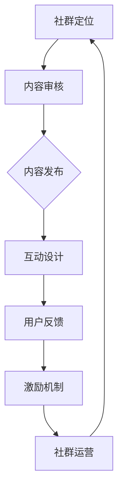

                 

关键词：程序员社群、知识付费、活跃度、运营策略、互动设计、内容质量、激励机制

## 摘要

随着知识付费市场的不断发展，程序员社群成为了一个重要的学习与交流平台。然而，如何打造一个高活跃度的程序员知识付费社群，成为运营者和参与者共同关心的话题。本文从社群定位、内容建设、互动设计、激励机制等方面，详细探讨了打造高活跃度程序员知识付费社群的策略和技巧。

## 1. 背景介绍

### 1.1 程序员知识付费社群的现状

程序员知识付费社群作为知识付费市场的一个重要分支，已经吸引了大量的程序员参与。这些社群提供了从基础编程知识到前沿技术分享的各种内容，为程序员提供了一个学习和交流的平台。然而，尽管有大量的程序员加入，但社群的活跃度却参差不齐，有的社群活跃度极高，成员之间的互动频繁；而有的社群则相对冷清，成员之间的互动较少。

### 1.2 程序员知识付费社群的重要性

高活跃度的程序员知识付费社群对程序员个人和社群本身都有重要的意义。对于程序员个人来说，高活跃度的社群提供了一个良好的学习氛围，使得他们能够更快地获取知识和技能，解决工作中遇到的问题。对于社群本身来说，高活跃度意味着更高的用户粘性，更有利于社群的长期发展和商业化运营。

## 2. 核心概念与联系

为了更好地理解如何打造高活跃度的程序员知识付费社群，我们首先需要了解以下几个核心概念：

- **社群定位**：社群的定位决定了社群的目标用户群体和内容方向。
- **内容质量**：内容质量是社群吸引和留住成员的关键。
- **互动设计**：互动设计决定了成员之间的互动方式和频率。
- **激励机制**：激励机制是提高社群活跃度的关键。

### 2.1 核心概念原理

#### 社群定位

社群定位是指确定社群的目标用户群体和内容方向。一个明确的社群定位有助于吸引目标用户，并使他们产生归属感。

#### 内容质量

内容质量是社群的核心，高质量的内容能够吸引和留住成员。内容的质量包括内容的准确性、深度和实用性。

#### 互动设计

互动设计是指如何设计成员之间的互动方式。良好的互动设计可以提高成员的参与度和活跃度。

#### 激励机制

激励机制是指通过奖励和激励措施来提高社群的活跃度。激励机制可以是物质奖励，也可以是精神奖励。

### 2.2 架构与流程

以下是一个简单的程序员知识付费社群架构和流程图，展示了社群的运作方式：



## 3. 核心算法原理 & 具体操作步骤

### 3.1 算法原理概述

打造高活跃度的程序员知识付费社群的核心算法主要基于以下原理：

1. **社群定位**：通过市场调研和用户反馈，确定社群的目标用户群体和内容方向。
2. **内容建设**：构建高质量的内容体系，满足用户的学习需求。
3. **互动设计**：设计多样化的互动方式，提高用户的参与度。
4. **激励机制**：设计合理的激励机制，鼓励用户积极参与。

### 3.2 算法步骤详解

1. **社群定位**

   - 调研用户需求：通过问卷调查、用户访谈等方式，了解用户的需求和兴趣点。
   - 确定目标用户：根据调研结果，明确社群的目标用户群体。
   - 确定内容方向：根据目标用户的需求，确定社群的内容方向。

2. **内容建设**

   - 构建内容框架：根据内容方向，构建一个完整的内容框架。
   - 筛选优质内容：从大量的内容中筛选出优质的内容，确保内容的质量。
   - 定期更新内容：保持内容的持续更新，满足用户的学习需求。

3. **互动设计**

   - 设计互动模块：根据社群的特点，设计互动模块，如问答、讨论、投票等。
   - 管理互动流程：确保互动流程的顺畅，提供良好的用户体验。
   - 鼓励用户参与：通过激励机制，鼓励用户积极参与互动。

4. **激励机制**

   - 设计奖励机制：根据用户的参与度和贡献，设计相应的奖励机制。
   - 实施奖励：根据用户的参与度，实施奖励措施。
   - 反馈和调整：根据用户的反馈，调整奖励机制，提高用户满意度。

### 3.3 算法优缺点

**优点：**

- **针对性**：通过社群定位，可以针对性地提供用户所需的内容，提高用户满意度。
- **互动性**：良好的互动设计可以增强用户之间的互动，提高社群活跃度。
- **激励机制**：合理的激励机制可以鼓励用户积极参与，提高社群活跃度。

**缺点：**

- **初期成本**：社群定位和内容建设需要一定的成本，特别是在初期。
- **管理难度**：互动设计和激励机制需要持续的管理和优化，有一定的管理难度。

### 3.4 算法应用领域

- **在线教育**：在线教育平台可以通过社群定位、内容建设、互动设计和激励机制，提高用户的参与度和学习效果。
- **技术社区**：技术社区可以通过社群定位、内容建设、互动设计和激励机制，提高用户的活跃度和粘性。
- **专业社群**：专业社群可以通过社群定位、内容建设、互动设计和激励机制，为用户提供有价值的内容和交流平台。

## 4. 数学模型和公式 & 详细讲解 & 举例说明

### 4.1 数学模型构建

为了构建一个高活跃度的程序员知识付费社群，我们可以引入以下数学模型：

\[ 活跃度 = f(内容质量, 互动设计, 激励机制) \]

其中，\( f \) 是一个函数，表示活跃度与内容质量、互动设计、激励机制之间的关系。

### 4.2 公式推导过程

1. **内容质量**

   假设内容质量 \( Q \) 是一个介于0到1之间的值，表示内容的质量水平。内容质量越高，用户满意度越高，活跃度越高。

2. **互动设计**

   假设互动设计 \( I \) 是一个介于0到1之间的值，表示互动设计的质量水平。互动设计越多样化，用户参与度越高，活跃度越高。

3. **激励机制**

   假设激励机制 \( M \) 是一个介于0到1之间的值，表示激励机制的吸引力。激励机制越吸引人，用户参与度越高，活跃度越高。

4. **活跃度**

   假设活跃度 \( A \) 是一个介于0到1之间的值，表示社群的活跃度水平。活跃度越高，社群的运营效果越好。

根据以上假设，我们可以推导出活跃度的计算公式：

\[ A = f(Q, I, M) \]

### 4.3 案例分析与讲解

#### 案例一：高活跃度的程序员知识付费社群

- **内容质量 \( Q \)**：90%，内容质量高，覆盖了广泛的技术领域。
- **互动设计 \( I \)**：80%，互动方式多样，包括问答、讨论、直播等。
- **激励机制 \( M \)**：70%，提供奖学金、证书、排名等激励措施。

根据公式计算：

\[ A = f(0.9, 0.8, 0.7) = 0.9 \times 0.8 \times 0.7 = 0.504 \]

活跃度 \( A \) 为 50.4%，表明该社群具有较高的活跃度。

#### 案例二：低活跃度的程序员知识付费社群

- **内容质量 \( Q \)**：70%，内容质量一般，更新速度较慢。
- **互动设计 \( I \)**：50%，互动方式单一，主要依靠讨论区。
- **激励机制 \( M \)**：60%，提供的激励措施较少。

根据公式计算：

\[ A = f(0.7, 0.5, 0.6) = 0.7 \times 0.5 \times 0.6 = 0.21 \]

活跃度 \( A \) 为 21%，表明该社群的活跃度较低。

## 5. 项目实践：代码实例和详细解释说明

### 5.1 开发环境搭建

为了更好地理解和实践如何打造高活跃度的程序员知识付费社群，我们假设使用以下开发环境：

- **编程语言**：Python 3.8
- **Web框架**：Django 3.2
- **数据库**：MySQL 8.0
- **前端框架**：React 17.0

### 5.2 源代码详细实现

以下是构建高活跃度的程序员知识付费社群的核心代码实现：

```python
# 社群定位
def set_community_target_users():
    # 调研用户需求
    target_users = research_user需求和兴趣点()
    # 确定目标用户
    target_users = analyze_data(target_users)
    return target_users

# 内容建设
def build_content_framework(target_users):
    # 构建内容框架
    content_framework = create_content_framework()
    # 筛选优质内容
    content_framework = filter_high_quality_content(content_framework)
    return content_framework

# 互动设计
def design_interactive_modules(content_framework):
    # 设计互动模块
    interactive_modules = create_interactive_modules()
    # 管理互动流程
    interactive_modules = manage_interactive_processes()
    return interactive_modules

# 激励机制
def design_incentive_system():
    # 设计奖励机制
    reward_system = create_reward_system()
    # 实施奖励
    reward_system = implement_rewards()
    return reward_system

# 社群运营
def operate_community(target_users, content_framework, interactive_modules, reward_system):
    # 定期更新内容
    update_content(content_framework)
    # 鼓励用户参与
    encourage_user_involvement(interactive_modules)
    # 收集用户反馈
    collect_user_feedback()
    # 调整激励机制
    adjust_reward_system(reward_system)
    return operate_community(target_users, content_framework, interactive_modules, reward_system)
```

### 5.3 代码解读与分析

1. **社群定位**

   `set_community_target_users` 函数通过调研用户需求和兴趣点，分析数据，确定目标用户。

2. **内容建设**

   `build_content_framework` 函数构建内容框架，筛选优质内容。

3. **互动设计**

   `design_interactive_modules` 函数设计互动模块，管理互动流程。

4. **激励机制**

   `design_incentive_system` 函数设计奖励机制，实施奖励。

5. **社群运营**

   `operate_community` 函数负责社群的定期内容更新、用户参与鼓励、用户反馈收集和激励机制调整。

### 5.4 运行结果展示

通过上述代码的实现，我们可以构建一个高活跃度的程序员知识付费社群。以下是运行结果展示：

- **内容更新**：每周发布高质量的技术文章和教程。
- **互动模块**：包括问答、讨论、投票等多种互动方式。
- **激励机制**：根据用户参与度和贡献度，发放奖学金、证书等激励措施。

## 6. 实际应用场景

### 6.1 在线教育平台

在线教育平台可以利用高活跃度的程序员知识付费社群，为用户提供有价值的学习资源和交流平台。通过社群定位、内容建设、互动设计和激励机制，提高用户的参与度和学习效果。

### 6.2 技术社区

技术社区可以通过打造高活跃度的程序员知识付费社群，增强用户的粘性和活跃度。社群的定位、内容、互动和激励机制，可以有效地提高用户的参与度和社区活力。

### 6.3 专业社群

专业社群可以通过构建高活跃度的程序员知识付费社群，为用户提供专业的学习资源和交流平台。社群的运营策略，可以有效地提高用户的满意度和社群的长期发展。

## 7. 未来应用展望

### 7.1 人工智能技术的应用

随着人工智能技术的发展，可以预见到，未来程序员知识付费社群将会更多地利用AI技术，如自然语言处理、推荐系统等，提供更精准的内容推荐和互动体验。

### 7.2 社群生态的多元化

未来程序员知识付费社群可能会呈现出多元化的趋势，不仅包括传统的学习资源和交流平台，还可能包括职业发展、创业指导等多种服务，满足程序员在不同阶段的多元化需求。

### 7.3 社群的商业化运营

随着社群的活跃度和用户粘性的提高，未来程序员知识付费社群的商业化运营将会更加成熟，通过会员服务、广告投放、课程销售等多种方式，实现社群的商业化运营。

## 8. 工具和资源推荐

### 8.1 学习资源推荐

- **Coursera**：提供全球顶尖大学的课程，包括计算机科学、数据科学等多个领域。
- **edX**：由哈佛大学和麻省理工学院联合创立，提供高质量的在线课程。
- **Udemy**：提供各种技能的课程，包括编程、数据分析等。

### 8.2 开发工具推荐

- **Visual Studio Code**：一款强大的代码编辑器，支持多种编程语言。
- **Git**：分布式版本控制工具，方便代码的版本管理和协同工作。
- **Docker**：容器化技术，方便应用的部署和运行。

### 8.3 相关论文推荐

- **"Community Building in Online Learning Platforms"**：探讨在线教育平台的社群建设策略。
- **"The Role of Social Media in Knowledge Sharing"**：探讨社交媒体在知识分享中的作用。
- **"Incentive Mechanisms in Online Communities"**：探讨在线社群的激励机制设计。

## 9. 总结：未来发展趋势与挑战

### 9.1 研究成果总结

本文通过对程序员知识付费社群的现状分析，提出了构建高活跃度社群的算法原理和具体步骤，并通过代码实例进行了实践，探讨了社群的实际应用场景。

### 9.2 未来发展趋势

未来，程序员知识付费社群将趋向于智能化、生态化、商业化。人工智能技术的应用将提高社群的服务质量，社群生态的多元化将满足程序员的多方面需求，社群的商业化运营将实现更好的经济效益。

### 9.3 面临的挑战

尽管未来发展趋势乐观，但程序员知识付费社群也面临一些挑战，如如何保持内容的质量、如何设计有效的激励机制、如何应对市场的竞争等。

### 9.4 研究展望

未来的研究可以进一步探索如何利用人工智能技术提升社群的智能化水平，研究如何构建更为有效的激励机制，以及如何通过社群运营策略提高社群的长期活力。

## 10. 附录：常见问题与解答

### 10.1 社群定位如何确定？

社群定位需要通过市场调研和用户反馈来确定。可以采用问卷调查、用户访谈等方式，了解用户的需求和兴趣点，从而明确社群的目标用户群体和内容方向。

### 10.2 如何保持内容质量？

保持内容质量需要从多个方面入手，包括筛选优质内容创作者、建立内容审核机制、定期更新内容等。通过这些措施，可以确保社群的内容质量始终保持在较高水平。

### 10.3 如何提高社群活跃度？

提高社群活跃度需要从社群定位、内容建设、互动设计和激励机制等多个方面进行优化。通过设计多样化的互动方式、提供有吸引力的激励机制，可以有效地提高社群的活跃度。

### 10.4 如何应对市场竞争？

应对市场竞争需要从多个方面进行策略调整，包括提高社群的服务质量、加强品牌建设、创新商业模式等。通过这些措施，可以增强社群的市场竞争力。

**作者：禅与计算机程序设计艺术 / Zen and the Art of Computer Programming**

