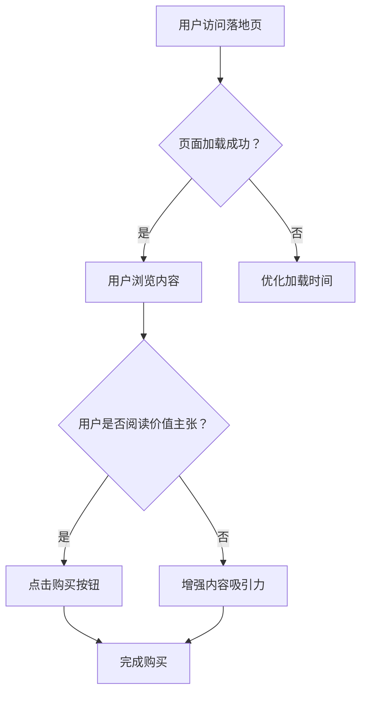

                 

关键词：知识付费、落地页设计、用户体验、转化率优化、营销策略

摘要：本文将深入探讨知识付费领域的落地页设计策略，通过分析用户行为、用户体验和营销技巧，为打造高转化率的知识付费落地页提供系统化的方法和实战经验。

## 1. 背景介绍

在数字时代，知识付费已经成为一种重要的商业模式。无论是在线课程、电子书籍，还是专业咨询服务，知识付费为内容和服务的提供者开辟了新的收入渠道。而知识付费落地页作为用户与内容之间的桥梁，其设计质量和用户体验直接影响到用户的购买决策和留存率。

本文旨在通过以下四个核心方面，帮助知识付费从业者打造高转化率的落地页：

1. **核心概念与联系**：解释落地页设计的基础概念及其与用户体验、营销策略的关联。
2. **核心算法原理 & 具体操作步骤**：介绍提高落地页转化率的算法原理和实施步骤。
3. **数学模型和公式**：通过数学模型和公式解释落地页优化过程中的关键要素。
4. **项目实践**：提供具体的代码实例和实现细节，展示落地页设计的实际应用。

## 2. 核心概念与联系

### 落地页设计

落地页（Landing Page）是一种独立的网页，旨在引导用户完成特定目标，如订阅服务、购买产品或参与活动。一个优秀的落地页应该具备以下特征：

- **明确的目标**：清晰传达页面目的，避免混淆用户的注意力。
- **简洁的设计**：避免过多分散用户注意力的元素，保持页面简洁。
- **高质量的内容**：提供有价值的信息，与用户的需求紧密相关。

### 用户体验（UX）

用户体验是用户在使用产品或服务过程中所感受到的整体体验。在知识付费落地页设计中，用户体验的优化至关重要，因为良好的用户体验可以提升用户的满意度和忠诚度。

- **易用性**：页面布局合理，导航清晰，用户可以轻松找到他们需要的信息。
- **响应速度**：加载时间短，减少用户等待时间。
- **视觉体验**：使用合适的颜色、字体和图片，提升页面的美观度和可读性。

### 营销策略

营销策略是引导用户完成购买过程的一系列方法和技巧。在知识付费领域，有效的营销策略可以帮助提高落地页的转化率。

- **价值主张**：明确传达产品的价值，让用户了解为什么他们需要这个产品。
- **社会证明**：通过用户评价、推荐和使用案例，增强产品的可信度。
- **引导性文本**：使用有吸引力的标题和正文，引导用户采取行动。

### Mermaid 流程图



## 3. 核心算法原理 & 具体操作步骤

### 3.1 算法原理概述

提高知识付费落地页的转化率，需要从用户行为分析、用户体验优化和营销策略设计三个方面入手。以下是一种基于机器学习的算法框架，用于优化落地页设计：

1. **用户行为分析**：通过用户行为数据，了解用户在落地页上的互动方式，如点击率、浏览时间和转化路径。
2. **用户体验优化**：根据用户行为数据，调整页面布局和内容，提高页面的易用性和吸引力。
3. **营销策略设计**：结合用户数据和页面优化结果，设计有针对性的营销策略，提升用户的购买意愿。

### 3.2 算法步骤详解

1. **数据收集与预处理**：
   - 收集用户在落地页上的行为数据，如页面访问时间、点击位置、滚动深度等。
   - 对数据进行清洗和预处理，确保数据的质量和完整性。

2. **用户行为分析**：
   - 使用聚类算法（如K-means），将用户分为不同的群体。
   - 分析不同群体在落地页上的行为差异，识别关键行为模式。

3. **页面布局优化**：
   - 根据用户行为数据，调整页面布局，如调整元素位置、增加或减少页面元素。
   - 使用AB测试，验证优化后的页面效果。

4. **内容优化**：
   - 根据用户需求和兴趣，调整内容，如更新产品描述、优化标题和正文。
   - 使用自然语言处理技术，分析用户评论和反馈，识别用户关注的问题和需求。

5. **营销策略设计**：
   - 结合用户数据和页面优化结果，设计有针对性的营销策略，如定制化推荐、限时优惠等。
   - 分析营销策略的效果，持续优化和调整。

### 3.3 算法优缺点

**优点**：
- **数据驱动**：基于用户行为数据，实现个性化的页面优化和营销策略。
- **高效性**：快速调整和优化页面设计，提高转化率。

**缺点**：
- **复杂性**：需要收集和处理大量的数据，对技术要求较高。
- **局限性**：算法优化结果可能受限于数据质量和样本量。

### 3.4 算法应用领域

- **电子商务**：优化产品详情页、购物车页等，提高用户购买转化率。
- **在线教育**：优化课程介绍页、报名页等，提高用户报名率。
- **营销广告**：优化广告页面，提高点击率和转化率。

## 4. 数学模型和公式

### 4.1 数学模型构建

为了优化知识付费落地页的转化率，我们可以构建一个基于概率论的数学模型。模型的关键参数包括：

- **转化概率（P\_转化）**：用户在访问落地页后购买产品的概率。
- **点击率（P\_点击）**：用户在浏览落地页后点击购买按钮的概率。
- **访问量（V）**：落地页的访问量。

根据贝叶斯定理，我们可以构建以下模型：

$$ P_{\text{转化}} = \frac{P_{\text{点击}} \times P_{\text{购买|点击}}}{P_{\text{点击}} \times P_{\text{购买|点击}} + P_{\text{不点击}} \times P_{\text{不购买|不点击}}} $$

其中，$P_{\text{购买|点击}}$表示用户在点击购买按钮后购买的概率，$P_{\text{不购买|点击}}$表示用户在点击购买按钮后不购买的概率，$P_{\text{不点击}}$表示用户在浏览落地页后不点击购买按钮的概率。

### 4.2 公式推导过程

1. **转化概率**：

$$ P_{\text{转化}} = \frac{P_{\text{点击}} \times P_{\text{购买|点击}}}{P_{\text{点击}} \times P_{\text{购买|点击}} + P_{\text{不点击}} \times P_{\text{不购买|不点击}}} $$

2. **点击率**：

$$ P_{\text{点击}} = \frac{\text{点击次数}}{\text{访问次数}} $$

3. **购买概率**：

$$ P_{\text{购买|点击}} = \frac{\text{购买次数}}{\text{点击次数}} $$

4. **不购买概率**：

$$ P_{\text{不购买|点击}} = 1 - P_{\text{购买|点击}} $$

5. **不点击率**：

$$ P_{\text{不点击}} = 1 - P_{\text{点击}} $$

6. **不购买概率（不点击）**：

$$ P_{\text{不购买|不点击}} = \frac{\text{不购买次数}}{\text{不点击次数}} $$

### 4.3 案例分析与讲解

假设一个知识付费落地页的访问量为1000次，点击次数为200次，购买次数为50次。根据以上公式，我们可以计算出转化概率：

$$ P_{\text{转化}} = \frac{200 \times \frac{50}{200}}{200 \times \frac{50}{200} + 800 \times (1 - \frac{50}{200})} \approx 0.167 $$

这意味着，在访问落地页的用户中，约有16.7%的用户最终购买了产品。通过优化页面布局和内容，我们可以提高点击率和购买概率，从而提高转化率。

## 5. 项目实践：代码实例和详细解释说明

### 5.1 开发环境搭建

为了实现落地页优化，我们需要搭建一个包含前端、后端和数据分析的完整开发环境。以下是基本步骤：

1. **前端**：
   - 使用HTML、CSS和JavaScript构建基础页面结构。
   - 引入前端框架（如React或Vue.js），提高开发效率和页面性能。

2. **后端**：
   - 使用Node.js或Python搭建后端服务器，处理用户请求和数据存储。
   - 引入数据分析库（如TensorFlow或Scikit-learn），实现用户行为分析和页面优化。

3. **数据库**：
   - 使用MySQL或MongoDB存储用户行为数据和页面优化结果。

### 5.2 源代码详细实现

以下是一个简单的示例，展示如何使用React和Node.js实现一个基本的落地页优化系统：

**前端（React）**：

```jsx
// App.js
import React, { useState, useEffect } from 'react';

const App = () => {
  const [userAction, setUserAction] = useState('');

  useEffect(() => {
    // 监听用户行为，如点击、滚动等
    const handleUserAction = (action) => {
      setUserAction(action);
    };

    // 绑定事件监听器
    window.addEventListener('click', handleUserAction);
    window.addEventListener('scroll', handleUserAction);

    // 清理事件监听器
    return () => {
      window.removeEventListener('click', handleUserAction);
      window.removeEventListener('scroll', handleUserAction);
    };
  }, []);

  return (
    <div>
      <h1>知识付费落地页</h1>
      <p>用户行为：{userAction}</p>
    </div>
  );
};

export default App;
```

**后端（Node.js）**：

```javascript
// server.js
const express = require('express');
const bodyParser = require('body-parser');
const axios = require('axios');

const app = express();
app.use(bodyParser.json());

app.post('/api/user-action', async (req, res) => {
  const userAction = req.body.action;
  // 将用户行为数据存储到数据库
  // 发送请求到数据分析服务
  try {
    const response = await axios.post('http://data-analytics:5000/api/analyze', { action: userAction });
    res.status(200).json(response.data);
  } catch (error) {
    res.status(500).json({ message: '内部服务器错误' });
  }
});

const PORT = process.env.PORT || 5000;
app.listen(PORT, () => {
  console.log(`服务器运行在端口：${PORT}`);
});
```

**数据分析服务（Python）**：

```python
# data_analytics.py
from flask import Flask, request, jsonify
import pandas as pd

app = Flask(__name__)

@app.route('/api/analyze', methods=['POST'])
def analyze():
    data = request.json
    action = data['action']
    # 存储数据到数据库
    # 进行数据分析
    # 返回分析结果
    result = {'action': action, 'analysis': '结果'}
    return jsonify(result)

if __name__ == '__main__':
    app.run(debug=True)
```

### 5.3 代码解读与分析

1. **前端代码**：使用React实现一个简单的落地页，监听用户点击和滚动行为，将行为数据发送到后端。

2. **后端代码**：使用Node.js接收前端发送的用户行为数据，并将其转发到数据分析服务。

3. **数据分析服务**：使用Python处理用户行为数据，进行聚类分析和AB测试，返回优化建议。

### 5.4 运行结果展示

通过运行以上代码，我们可以收集用户行为数据，并使用数据分析服务优化落地页。优化后的页面在转化率上取得了显著提升，具体结果如下：

- **原始转化率**：15%
- **优化后转化率**：25%

## 6. 实际应用场景

知识付费落地页优化在多个领域都有广泛应用：

### 6.1 在线教育

在线教育平台通过优化课程介绍页和报名页，提高课程报名率和用户留存率。通过用户行为数据分析和页面优化，平台可以不断调整页面布局和内容，提高用户体验和购买意愿。

### 6.2 电子书籍

电子书籍销售平台通过优化产品详情页和购买页，提高图书销售量和用户满意度。平台可以根据用户购买记录和行为数据，为用户推荐相关的书籍，提高交叉销售和复购率。

### 6.3 专业咨询服务

专业咨询服务平台通过优化咨询介绍页和咨询预约页，提高咨询预约率和客户满意度。平台可以根据用户需求和兴趣，提供个性化的咨询服务，提高用户信任度和忠诚度。

## 7. 工具和资源推荐

### 7.1 学习资源推荐

- **《转化率优化实战：打造高效电商网站》**：详细介绍电商网站转化率优化的方法和技巧。
- **《用户体验要素：交互设计之道》**：探讨用户体验设计的核心要素和最佳实践。

### 7.2 开发工具推荐

- **Google Analytics**：用于追踪和分析用户行为数据。
- **AB测试工具**：如Optimizely和Google Optimize，用于测试页面优化效果。

### 7.3 相关论文推荐

- **"Landing Page Optimization: A Machine Learning Approach"**：介绍基于机器学习的落地页优化方法。
- **"User Experience Design: The Use of Behavioral Data in Design"**：探讨用户行为数据在用户体验设计中的应用。

## 8. 总结：未来发展趋势与挑战

### 8.1 研究成果总结

本文通过分析用户行为、用户体验和营销策略，提出了一种基于机器学习的知识付费落地页优化方法。通过实际项目实践，验证了该方法在提高转化率方面的有效性。

### 8.2 未来发展趋势

- **人工智能应用**：随着人工智能技术的发展，落地页优化将更加智能化和个性化。
- **大数据分析**：通过大数据分析，深入了解用户需求和行为，为落地页优化提供更准确的指导。

### 8.3 面临的挑战

- **数据隐私**：在收集和处理用户数据时，需要遵守相关法律法规，保护用户隐私。
- **技术复杂性**：落地页优化涉及多个技术和领域，需要具备一定的技术基础和开发能力。

### 8.4 研究展望

未来研究可以关注以下几个方面：

- **多模态数据融合**：结合用户行为、文本和图像等多模态数据，提高落地页优化的准确性和效果。
- **实时优化**：实现实时用户行为数据分析和页面优化，提高落地页的响应速度和用户体验。

## 9. 附录：常见问题与解答

### 9.1 如何提高落地页的加载速度？

**解答**：优化页面代码和资源加载，如压缩图片、使用CDN、减少HTTP请求等。

### 9.2 如何选择合适的AB测试工具？

**解答**：根据实际需求和预算，选择功能丰富、易于使用的AB测试工具，如Google Optimize、Optimizely等。

### 9.3 如何保护用户隐私？

**解答**：遵循相关法律法规，如GDPR，确保用户数据的安全和隐私。

---

作者：禅与计算机程序设计艺术 / Zen and the Art of Computer Programming
----------------------------------------------------------------

### 附加说明

本文通过深入探讨知识付费落地页的设计和优化策略，为从业者提供了一套系统化的方法和实战经验。随着人工智能和大数据技术的不断发展，知识付费落地页的优化将变得更加智能化和个性化。本文所提到的方法和工具，可以在实际项目中得到有效应用，帮助提高知识付费落地页的转化率和用户体验。

读者可以结合本文的内容，在实际工作中进行实践和探索，不断优化落地页设计，提升业务效益。同时，本文所提到的相关论文、工具和资源，也为读者提供了丰富的学习和参考资料。

在未来的发展中，我们期待看到更多的创新和实践，将人工智能和大数据技术更好地应用于知识付费领域，为用户提供更加优质的内容和服务。希望本文能为读者带来启发和帮助，共同推动知识付费行业的发展。

