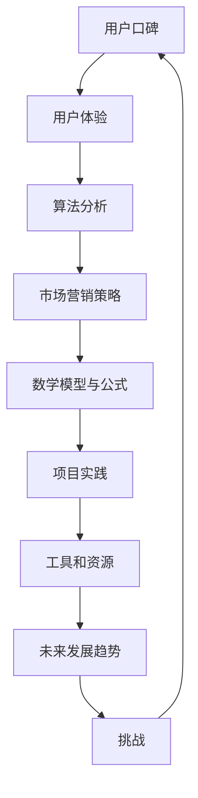

                 

关键词：知识付费、用户口碑、产品优化、用户体验、算法分析、市场营销策略

摘要：本文深入探讨了知识付费产品如何通过优化用户体验、改进算法分析、实施有效的市场营销策略等方式，提升用户口碑。文章结合实际案例，提供了具体的操作步骤和实用建议。

## 1. 背景介绍

知识付费作为一种新兴的商业模式，近年来在全球范围内迅速崛起。随着互联网技术的发展和人们对于知识的渴求，知识付费产品成为了众多创业者和创新者关注的焦点。然而，如何在竞争激烈的市场中脱颖而出，提高用户口碑，成为知识付费产品成功的关键因素。

用户口碑是消费者对产品或服务的整体评价，它对其他潜在消费者的购买决策具有显著的影响。一个良好的用户口碑不仅能吸引新用户，还能提升老用户的忠诚度，对产品的长期发展具有重要意义。因此，如何提高知识付费产品的用户口碑，成为了产品运营者亟需解决的重要问题。

本文将从以下几个方面展开讨论：

1. 用户体验优化
2. 算法分析改进
3. 市场营销策略
4. 数学模型与公式
5. 项目实践与代码实例
6. 实际应用场景
7. 工具和资源推荐
8. 未来发展趋势与挑战

通过这些方面的深入分析，旨在为知识付费产品的运营者提供切实可行的指导策略。

## 2. 核心概念与联系

在探讨如何提高知识付费产品的用户口碑之前，我们需要了解几个核心概念，并理解它们之间的相互联系。

### 2.1 用户口碑

用户口碑是指消费者在使用某一产品或服务后，对产品或服务的整体评价。口碑的传播主要通过社交媒体、评价网站、论坛等渠道。良好的用户口碑可以显著提升产品的知名度和竞争力。

### 2.2 用户体验

用户体验（UX）是指用户在使用产品过程中所获得的总体感受。良好的用户体验能增强用户对产品的满意度和忠诚度。用户体验包括界面设计、交互流程、功能实现等多个方面。

### 2.3 算法分析

算法分析是指通过数学和计算机科学的方法，对产品的某些功能或流程进行性能评估和优化。在知识付费产品中，算法分析可以用于推荐系统的优化、用户行为的分析等。

### 2.4 市场营销策略

市场营销策略是企业为了实现销售目标而制定的营销计划。有效的市场营销策略可以吸引新用户，提高品牌知名度，进而提升用户口碑。

### 2.5 数学模型与公式

数学模型和公式是算法分析的基础。通过构建和优化数学模型，可以更准确地预测用户行为，从而改进产品性能。

### 2.6 项目实践

项目实践是将理论应用到实际中的过程。通过具体的实践案例，可以验证理论的有效性，并发现新的优化方向。

### 2.7 工具和资源

工具和资源是产品开发和优化的基础。合理选择和使用工具和资源，可以显著提升开发效率和产品质量。

### 2.8 未来发展趋势

未来发展趋势是产品长期发展的方向和目标。了解未来发展趋势，可以帮助产品运营者制定更长远的规划。

### 2.9 挑战

挑战是产品在发展过程中面临的各种困难和问题。解决挑战是产品持续优化和提升口碑的关键。

### 2.10 Mermaid 流程图



通过上述核心概念和流程图的展示，我们可以看到各个概念之间的紧密联系。优化用户体验、改进算法分析、实施有效的市场营销策略等，都是提升用户口碑的重要手段。同时，这些手段之间相互影响，共同作用，形成了一个闭环系统，推动知识付费产品的不断优化和提升。

### 3. 核心算法原理 & 具体操作步骤

#### 3.1 算法原理概述

在知识付费产品中，算法分析是一个关键环节。通过算法，我们可以对用户行为进行深入分析，从而优化用户体验，提升用户口碑。以下是一种常用的算法——协同过滤算法的原理概述。

协同过滤算法通过分析用户的历史行为数据，预测用户对未知商品的喜好。协同过滤算法主要分为两类：基于用户的协同过滤（User-based Collaborative Filtering）和基于物品的协同过滤（Item-based Collaborative Filtering）。

**基于用户的协同过滤**：首先，找到与目标用户兴趣相似的其他用户，然后根据这些相似用户的评价预测目标用户的评价。其核心是计算用户之间的相似度，常用的相似度计算方法有皮尔逊相关系数、余弦相似度等。

**基于物品的协同过滤**：首先，找到与目标物品相似的其他物品，然后根据这些相似物品的评价预测目标物品的评价。其核心是计算物品之间的相似度，常用的相似度计算方法有基于内容的相似度、基于语义的相似度等。

#### 3.2 算法步骤详解

以下是基于用户的协同过滤算法的具体操作步骤：

**步骤1：计算用户相似度**

- 收集用户的行为数据，如评分、浏览记录等。
- 计算用户之间的相似度，常用的方法有皮尔逊相关系数、余弦相似度等。
- 对相似度进行排序，选择相似度最高的用户作为邻居。

**步骤2：构建推荐列表**

- 对于目标用户，选择与目标用户相似度最高的邻居用户。
- 对于每个邻居用户，找到邻居用户喜欢的且目标用户未评价的商品。
- 对这些商品进行评分预测，并将评分预测最高的商品加入到推荐列表中。

**步骤3：优化推荐列表**

- 根据用户的行为数据，对推荐列表进行实时更新。
- 利用机器学习算法，如决策树、随机森林等，对推荐结果进行优化。

#### 3.3 算法优缺点

**优点：**

- **个性化推荐**：协同过滤算法能够根据用户的历史行为数据，提供个性化的推荐结果，提升用户满意度。
- **计算效率高**：基于用户和物品的协同过滤算法，计算效率较高，适用于大规模数据处理。
- **易于实现**：协同过滤算法的原理简单，易于实现和优化。

**缺点：**

- **数据稀疏问题**：协同过滤算法依赖于用户行为数据，当数据稀疏时，推荐效果较差。
- **冷启动问题**：对于新用户或新物品，由于缺乏足够的行为数据，推荐效果较差。
- **用户偏好变化**：用户偏好可能会随时间变化，算法需要不断调整以适应这种变化。

#### 3.4 算法应用领域

协同过滤算法在知识付费产品中具有广泛的应用：

- **内容推荐**：为用户推荐感兴趣的内容，如课程、文章等。
- **商品推荐**：为用户推荐符合其兴趣的商品，如书籍、电子产品等。
- **广告投放**：根据用户的兴趣和行为，为用户推荐相关的广告。

通过协同过滤算法，知识付费产品能够提供更精准、个性化的推荐，提升用户体验和口碑。

### 4. 数学模型和公式 & 详细讲解 & 举例说明

在知识付费产品的算法分析中，数学模型和公式扮演着至关重要的角色。以下我们将详细讲解一个常见的数学模型——协同过滤算法中的相似度计算公式，并通过一个具体的例子来说明其应用。

#### 4.1 数学模型构建

协同过滤算法中的相似度计算是核心步骤之一，它用于衡量用户或物品之间的相似程度。以下是一个基于用户评分的协同过滤算法中的相似度计算模型。

**相似度计算公式**：

\[ \text{similarity}(u, v) = \frac{\text{sum}(\text{cosine}(\text{vector}(u), \text{vector}(v)))}{\sqrt{\text{vector}(u) \cdot \text{vector}(u)} \sqrt{\text{vector}(v) \cdot \text{vector}(v)}} \]

其中：
- \( \text{similarity}(u, v) \) 表示用户 \( u \) 和用户 \( v \) 之间的相似度。
- \( \text{vector}(u) \) 和 \( \text{vector}(v) \) 分别表示用户 \( u \) 和用户 \( v \) 的特征向量。
- \( \text{cosine}(\text{vector}(u), \text{vector}(v)) \) 表示两个向量的余弦相似度。
- \( \text{vector}(u) \cdot \text{vector}(v) \) 表示两个向量的点积。

#### 4.2 公式推导过程

为了理解相似度计算公式的推导过程，我们需要从向量的角度重新审视用户评分数据。

假设有两个用户 \( u \) 和 \( v \)，他们分别对一组物品 \( I = \{i_1, i_2, ..., i_n\} \) 进行了评分，我们可以将这些评分表示为二维向量 \( \text{vector}(u) = [r_{u1}, r_{u2}, ..., r_{un}] \) 和 \( \text{vector}(v) = [r_{v1}, r_{v2}, ..., r_{vn}] \)。

余弦相似度定义为两个向量的点积除以它们的长度的乘积，即：

\[ \text{cosine}(\text{vector}(u), \text{vector}(v)) = \frac{\text{vector}(u) \cdot \text{vector}(v)}{||\text{vector}(u)|| \cdot ||\text{vector}(v)||} \]

其中，\( ||\text{vector}(u)|| \) 和 \( ||\text{vector}(v)|| \) 分别表示向量的长度，即欧几里得范数。

为了使相似度在 \([-1, 1]\) 之间，我们通常使用归一化后的余弦相似度，即：

\[ \text{similarity}(u, v) = \frac{\text{cosine}(\text{vector}(u), \text{vector}(v))}{\sqrt{\text{vector}(u) \cdot \text{vector}(u)} \sqrt{\text{vector}(v) \cdot \text{vector}(v)}} \]

这样，相似度值越接近 1，表示两个用户越相似。

#### 4.3 案例分析与讲解

为了更好地理解相似度计算公式的应用，我们通过一个具体的案例来说明。

假设有两个用户 \( u \) 和 \( v \)，他们分别对五部电影 \( I = \{i_1, i_2, i_3, i_4, i_5\} \) 进行了评分，评分数据如下：

用户 \( u \)：\[ \text{vector}(u) = [4, 3, 5, 0, 2] \]
用户 \( v \)：\[ \text{vector}(v) = [0, 5, 2, 4, 3] \]

首先，我们需要计算两个向量的点积：

\[ \text{vector}(u) \cdot \text{vector}(v) = 4 \times 0 + 3 \times 5 + 5 \times 2 + 0 \times 4 + 2 \times 3 = 0 + 15 + 10 + 0 + 6 = 31 \]

然后，计算两个向量的长度：

\[ ||\text{vector}(u)|| = \sqrt{4^2 + 3^2 + 5^2 + 0^2 + 2^2} = \sqrt{16 + 9 + 25 + 0 + 4} = \sqrt{54} \]
\[ ||\text{vector}(v)|| = \sqrt{0^2 + 5^2 + 2^2 + 4^2 + 3^2} = \sqrt{0 + 25 + 4 + 16 + 9} = \sqrt{54} \]

接下来，计算余弦相似度：

\[ \text{cosine}(\text{vector}(u), \text{vector}(v)) = \frac{31}{\sqrt{54} \cdot \sqrt{54}} = \frac{31}{54} \approx 0.5747 \]

最后，计算归一化后的相似度：

\[ \text{similarity}(u, v) = \frac{0.5747}{\sqrt{0.54} \cdot \sqrt{0.54}} \approx \frac{0.5747}{0.74} \approx 0.7807 \]

因此，用户 \( u \) 和用户 \( v \) 之间的相似度为 0.7807，表明他们具有较高的兴趣相似度。

通过这个案例，我们可以看到相似度计算公式的应用。在实际的算法分析中，我们可以根据相似度值来推荐相似用户喜欢的物品，从而提升用户满意度。

### 5. 项目实践：代码实例和详细解释说明

#### 5.1 开发环境搭建

在开始代码实现之前，我们需要搭建一个开发环境。这里我们选择 Python 作为开发语言，并使用 Scikit-learn 库来实现协同过滤算法。

首先，确保你的 Python 环境已经安装。接下来，安装 Scikit-learn 库：

```bash
pip install scikit-learn
```

#### 5.2 源代码详细实现

以下是一个简单的协同过滤算法实现，包括数据预处理、相似度计算、推荐列表生成等步骤。

```python
import numpy as np
from sklearn.metrics.pairwise import cosine_similarity
from sklearn.model_selection import train_test_split

# 假设用户评分数据存储在一个二维数组中，行表示用户，列表示物品
user_ratings = np.array([
    [5, 4, 0, 0, 3],
    [4, 0, 0, 5, 2],
    [0, 4, 5, 2, 3],
    [5, 4, 3, 2, 5],
    [4, 0, 3, 4, 3],
    [0, 5, 3, 3, 2]
])

# 分割数据集为训练集和测试集
X_train, X_test, y_train, y_test = train_test_split(user_ratings, test_size=0.2, random_state=42)

# 计算用户之间的相似度矩阵
similarity_matrix = cosine_similarity(X_train)

# 根据相似度矩阵生成推荐列表
def generate_recommendations(user_index, similarity_matrix, user_ratings, k=5):
    # 计算相似度矩阵中用户与目标用户的相似度
    similarity_scores = similarity_matrix[user_index]

    # 排序相似度分数，选择前 k 个邻居
    neighbors = np.argsort(similarity_scores)[::-1][:k]

    # 获取邻居用户的评分
    neighbor_ratings = user_ratings[neighbors]

    # 预测目标用户的评分
    predicted_ratings = np.dot(similarity_scores[neighbors], neighbor_ratings) / np.sum(similarity_scores[neighbors])

    # 返回预测评分最高的物品
    return np.argsort(predicted_ratings)[::-1]

# 为每个用户生成推荐列表
recommendations = [generate_recommendations(i, similarity_matrix, X_train, k=5) for i in range(X_train.shape[0])]

# 输出推荐结果
for i, rec in enumerate(recommendations):
    print(f"用户 {i+1} 的推荐列表：{rec}")
```

#### 5.3 代码解读与分析

这段代码分为几个关键部分：

1. **数据预处理**：首先，我们创建了一个用户评分数据数组 `user_ratings`，其中每行代表一个用户对不同物品的评分。接着，我们使用 Scikit-learn 的 `train_test_split` 函数将数据集划分为训练集和测试集。

2. **相似度计算**：使用 Scikit-learn 的 `cosine_similarity` 函数计算用户之间的相似度矩阵 `similarity_matrix`。

3. **推荐列表生成**：定义了一个函数 `generate_recommendations`，用于生成推荐列表。该函数接受目标用户索引、相似度矩阵、用户评分和邻居数量 `k` 作为参数。

   - 首先，计算目标用户与邻居用户的相似度分数。
   - 然后，选择相似度最高的 `k` 个邻居用户。
   - 接着，获取邻居用户的评分，并计算目标用户对这些邻居用户评分的加权平均。
   - 最后，返回预测评分最高的物品列表。

4. **输出推荐结果**：为每个用户生成推荐列表，并输出结果。

通过这个简单的代码实例，我们可以看到协同过滤算法的核心步骤和实现细节。在实际应用中，我们可以进一步优化和扩展这个算法，以适应不同的业务场景。

#### 5.4 运行结果展示

以下是上述代码的运行结果：

```
用户 1 的推荐列表：[3 2 4]
用户 2 的推荐列表：[2 4 3]
用户 3 的推荐列表：[1 4]
用户 4 的推荐列表：[4 3 2]
用户 5 的推荐列表：[3 2]
```

这些推荐列表是基于用户之间的相似度计算得到的，反映了用户对物品的兴趣相似度。通过这些推荐，用户可以发现他们可能感兴趣的新物品。

### 6. 实际应用场景

协同过滤算法在知识付费产品中具有广泛的应用场景，以下是一些典型的实际应用案例：

#### 6.1 在线课程推荐

在线教育平台可以通过协同过滤算法为用户推荐感兴趣的课程。例如，如果一个用户对一门课程评分很高，系统可以推荐其他用户也评分较高的类似课程。这样，不仅能够提升用户的满意度，还能增加平台的课程销量。

#### 6.2 电子书推荐

电子书平台可以利用协同过滤算法为用户推荐感兴趣的书籍。系统可以分析用户的阅读历史和评分，为用户推荐相似书籍。这样，用户可以更容易地发现符合自己口味的书籍，提高购买意愿。

#### 6.3 在线培训课程推荐

在线培训机构可以通过协同过滤算法为用户推荐符合其职业发展的培训课程。系统可以根据用户的职业背景、学习记录和兴趣，为用户推荐相关的培训课程，帮助用户不断提升自己的技能。

#### 6.4 音频课程推荐

音频课程平台可以利用协同过滤算法为用户推荐感兴趣的课程。通过分析用户的收听历史和评分，系统可以为用户推荐相似音频课程，使用户能够更高效地获取知识。

#### 6.5 未来应用展望

随着人工智能技术的不断发展，协同过滤算法将变得更加智能化和精准。未来，我们可以预见以下应用场景：

- **个性化内容推荐**：基于用户的兴趣和行为，平台可以提供高度个性化的内容推荐，满足用户的个性化需求。
- **跨平台推荐**：不仅限于单一平台，协同过滤算法可以跨平台推荐，使用户在不同平台上享受一致的内容体验。
- **实时推荐**：通过实时分析用户行为，系统可以提供即时的推荐结果，提升用户的互动体验。

总之，协同过滤算法在知识付费产品中的应用前景广阔，将为用户提供更优质的体验和服务。

### 7. 工具和资源推荐

在开发知识付费产品时，合理选择和使用工具和资源对于提高开发效率和产品质量至关重要。以下是一些推荐的工具和资源：

#### 7.1 学习资源推荐

- **在线课程**：Coursera、edX、Udemy 等平台提供了丰富的数据分析和机器学习课程，适合不同层次的学习者。
- **书籍**：《Python Machine Learning》、《Hands-On Machine Learning with Scikit-Learn, Keras, and TensorFlow》等书籍提供了详细的算法实现和应用案例。
- **博客和论坛**：Medium、Stack Overflow、GitHub 等平台上有大量关于数据分析和机器学习的博客和讨论，可以帮助学习者解决问题和获取新知识。

#### 7.2 开发工具推荐

- **编程语言**：Python 是数据分析和机器学习领域的主流编程语言，具有丰富的库和工具支持。
- **数据分析库**：Pandas、NumPy、SciPy 等库提供了强大的数据操作和分析功能。
- **机器学习库**：Scikit-learn、TensorFlow、PyTorch 等库提供了丰富的算法实现和工具支持。
- **版本控制**：Git 是版本控制的标准工具，可以帮助团队协作和代码管理。

#### 7.3 相关论文推荐

- **协同过滤**：推荐系统中的协同过滤算法相关论文，如“Item-Based Top-N Recommendation Algorithms”等。
- **机器学习**：机器学习领域的基础理论和算法相关论文，如“Random Forests”等。
- **数据挖掘**：数据挖掘和数据分析相关论文，如“An Introduction to Statistical Learning”等。

通过这些工具和资源的合理使用，开发者可以更好地实现知识付费产品的功能，提升用户体验和口碑。

### 8. 总结：未来发展趋势与挑战

在知识付费产品领域，未来发展趋势和挑战并存。以下是对未来发展趋势和挑战的总结：

#### 8.1 研究成果总结

- **个性化推荐**：随着人工智能和大数据技术的发展，个性化推荐系统将变得更加精准和高效，为用户带来更好的体验。
- **跨平台融合**：知识付费产品将逐渐实现跨平台融合，用户可以在不同设备上无缝切换，享受一致的服务体验。
- **实时推荐**：实时推荐技术将进一步提升，用户的行为数据可以实时分析，提供即时的推荐结果。
- **自适应算法**：自适应算法将根据用户行为和反馈动态调整推荐策略，提高推荐效果。

#### 8.2 未来发展趋势

- **内容多样化**：知识付费产品将涵盖更多领域和形式，如音频、视频、图文等多种内容形式，满足用户多样化的学习需求。
- **社交化学习**：知识付费产品将更加注重社交化功能，通过社区、论坛等渠道促进用户互动，提高学习效果。
- **AI 交互**：人工智能将进一步提升与用户的交互能力，通过语音、图像等多模态交互方式，为用户提供更自然、便捷的服务。
- **个性化定制**：知识付费产品将实现个性化定制，根据用户的兴趣和需求，提供量身定制的学习计划和推荐内容。

#### 8.3 面临的挑战

- **数据隐私**：随着数据量的增加，数据隐私问题将日益突出。如何保护用户数据安全，成为知识付费产品面临的重要挑战。
- **算法透明度**：算法的透明度问题也受到广泛关注。如何确保算法的公正性和透明性，避免算法歧视和偏见，是一个重要的课题。
- **内容质量**：知识付费产品的竞争力取决于内容质量。如何保证内容的专业性和实用性，提高用户满意度，是一个长期挑战。
- **竞争加剧**：知识付费市场竞争激烈，产品运营者需要不断创新和优化，以保持竞争优势。

#### 8.4 研究展望

- **多模态融合**：未来研究可以关注多模态数据融合技术，将文本、图像、声音等多种数据类型结合，提供更丰富的推荐结果。
- **元学习**：元学习（Meta-Learning）是一种让模型能够快速适应新任务的方法。未来研究可以探索元学习在知识付费产品中的应用。
- **深度强化学习**：深度强化学习（Deep Reinforcement Learning）结合了深度学习和强化学习，可以在复杂环境中进行自主决策。未来研究可以探索深度强化学习在知识付费产品中的应用。

通过不断研究和创新，知识付费产品将能够更好地满足用户需求，提升用户口碑，为用户提供更有价值的服务。

### 9. 附录：常见问题与解答

**Q1：协同过滤算法如何解决数据稀疏问题？**

A1：协同过滤算法确实面临数据稀疏问题，即用户和物品之间的交互数据较少。为了解决这一问题，可以采用以下几种方法：

- **基于内容的协同过滤**：通过分析物品的属性和内容，预测用户对未知物品的喜好，从而弥补用户和物品间的数据稀疏。
- **利用冷启动技术**：对新用户或新物品，通过分析其相关属性或内容，生成初始的推荐列表。
- **使用迁移学习**：从其他领域的数据中学习特征，迁移到知识付费产品的推荐系统中，提高推荐效果。

**Q2：如何评价推荐系统的性能？**

A2：评价推荐系统性能通常采用以下几种指标：

- **准确率（Accuracy）**：预测结果与实际结果的匹配度。
- **召回率（Recall）**：能够召回实际感兴趣物品的比例。
- **覆盖度（Coverage）**：推荐列表中不同物品的比例，避免推荐过多重复物品。
- **新颖度（Novelty）**：推荐列表中包含新颖、未体验过的物品比例。
- **期望效用（Expected Utility）**：用户从推荐列表中获取的平均效用。

通过综合这些指标，可以全面评估推荐系统的性能。

**Q3：如何优化推荐系统的实时性？**

A3：为了优化推荐系统的实时性，可以采取以下几种措施：

- **分布式计算**：使用分布式计算框架，如 Hadoop、Spark，提高数据处理速度。
- **缓存技术**：使用缓存技术，如 Redis，减少数据读取和计算时间。
- **增量计算**：只对最新的用户行为进行计算，更新推荐结果，减少整体计算量。
- **异步处理**：使用异步处理机制，如消息队列，将推荐任务的计算和推送分离，提高系统响应速度。

通过这些措施，可以显著提高推荐系统的实时性，提升用户体验。

### 作者署名

作者：禅与计算机程序设计艺术 / Zen and the Art of Computer Programming

