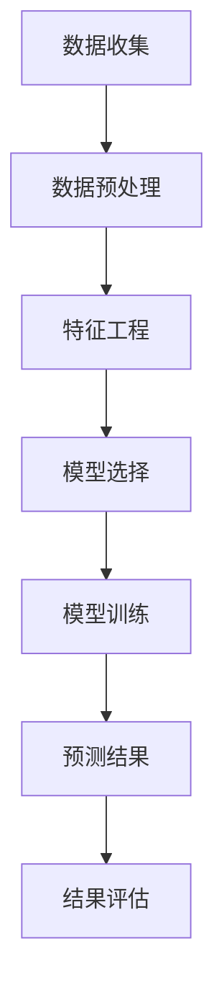

                 

关键词：市场预测、数据分析、机器学习、算法原理、数学模型、实践案例

> 摘要：本文将深入探讨市场预测的重要性，分析核心概念与联系，介绍有效的市场预测算法原理，并通过数学模型和公式推导，结合实际项目实践案例，阐述市场预测在实际应用场景中的具体操作步骤和结果展示，最后对市场预测的未来应用和面临挑战进行展望。

## 1. 背景介绍

市场预测在商业决策中扮演着至关重要的角色。随着互联网和大数据技术的发展，市场预测的方法和工具不断更新和优化，为企业提供了更多的数据支持和决策依据。有效的市场预测可以帮助企业制定更加精准的战略，降低风险，提高市场竞争力。然而，市场预测并非易事，它涉及复杂的算法、庞大的数据集和不断变化的市场环境。本文旨在介绍市场预测的基本原理和方法，帮助读者了解如何进行有效的市场预测。

## 2. 核心概念与联系

在进行市场预测之前，我们需要了解一些核心概念和它们之间的联系。以下是一个使用Mermaid绘制的流程图，展示了市场预测中关键概念的关系：



### 2.1 数据收集

数据收集是市场预测的基础，它包括从各种渠道获取相关数据，如市场调查、销售记录、社交媒体数据和宏观经济指标等。

### 2.2 数据预处理

数据预处理是对收集到的原始数据进行清洗、转换和归一化等操作，以便后续的特征工程和模型训练。

### 2.3 特征工程

特征工程是从预处理后的数据中提取出对预测任务有用的特征，它是提高预测准确性的关键步骤。

### 2.4 模型选择

模型选择是根据预测任务和数据特点，选择合适的机器学习模型，如线性回归、决策树、随机森林、支持向量机等。

### 2.5 模型训练

模型训练是将特征和标签数据输入到选择的模型中进行训练，使模型学习到数据的规律和模式。

### 2.6 预测结果

模型训练完成后，可以使用模型对新数据进行预测，得到预测结果。

### 2.7 结果评估

预测结果需要进行评估，常用的评估指标包括均方误差（MSE）、均方根误差（RMSE）和决定系数（R²）等。

## 3. 核心算法原理 & 具体操作步骤

### 3.1 算法原理概述

市场预测通常采用机器学习方法，其中最常用的算法包括线性回归、决策树、随机森林和支持向量机等。以下是这些算法的基本原理：

#### 线性回归

线性回归是一种简单的统计方法，用于预测一个连续的因变量和一个或多个自变量之间的关系。其基本原理是通过拟合一条直线来描述因变量和自变量之间的线性关系。

#### 决策树

决策树是一种树形结构，每个内部节点代表一个特征，每个分支代表一个特征取值，每个叶子节点代表一个预测结果。决策树通过递归地划分数据集来构建模型。

#### 随机森林

随机森林是一种基于决策树的集成学习方法，通过训练多个决策树，并将它们的预测结果进行投票或取平均来得到最终预测结果。随机森林具有很好的稳定性和泛化能力。

#### 支持向量机

支持向量机是一种基于最大间隔原理的线性分类方法，它通过找到一个最优的超平面来将数据分为不同的类别。支持向量机可以用于回归任务，称为支持向量回归（SVR）。

### 3.2 算法步骤详解

#### 线性回归

1. 数据预处理：对数据进行归一化处理，使其具有相似的尺度。
2. 特征选择：选择对预测任务有显著影响的特征。
3. 模型训练：使用训练数据拟合线性回归模型。
4. 预测：使用训练好的模型对新的数据进行预测。

#### 决策树

1. 数据预处理：对数据进行归一化处理。
2. 特征选择：选择对预测任务有显著影响的特征。
3. 划分数据：根据特征值将数据划分为多个子集。
4. 构建决策树：递归地划分数据集，构建决策树模型。
5. 预测：根据决策树模型对新的数据进行预测。

#### 随机森林

1. 数据预处理：对数据进行归一化处理。
2. 特征选择：选择对预测任务有显著影响的特征。
3. 构建决策树：训练多个决策树模型。
4. 预测：将多个决策树的预测结果进行投票或取平均。

#### 支持向量机

1. 数据预处理：对数据进行归一化处理。
2. 特征选择：选择对预测任务有显著影响的特征。
3. 模型训练：使用训练数据训练支持向量机模型。
4. 预测：使用训练好的模型对新的数据进行预测。

### 3.3 算法优缺点

每种算法都有其优缺点，选择合适的算法需要根据具体任务和数据特点进行权衡。

- 线性回归：简单易用，但可能无法捕捉到非线性关系。
- 决策树：可以处理非线性关系，但可能过拟合。
- 随机森林：具有很好的泛化能力，但可能降低模型的可解释性。
- 支持向量机：可以处理高维数据，但训练时间较长。

### 3.4 算法应用领域

- 线性回归：广泛应用于价格预测、需求预测等领域。
- 决策树：适用于分类和回归任务，如客户流失预测、信用评分等。
- 随机森林：适用于大规模数据集，如风险控制、欺诈检测等。
- 支持向量机：适用于高维数据，如文本分类、图像识别等。

## 4. 数学模型和公式 & 详细讲解 & 举例说明

### 4.1 数学模型构建

市场预测的数学模型通常基于回归分析，以下是线性回归模型的构建过程：

#### 4.1.1 回归模型公式

$$
Y = \beta_0 + \beta_1X_1 + \beta_2X_2 + ... + \beta_nX_n + \epsilon
$$

其中，$Y$ 是因变量，$X_1, X_2, ..., X_n$ 是自变量，$\beta_0, \beta_1, ..., \beta_n$ 是模型参数，$\epsilon$ 是误差项。

#### 4.1.2 模型参数估计

我们使用最小二乘法（Ordinary Least Squares, OLS）来估计模型参数，目标是最小化预测误差的平方和：

$$
\min_{\beta} \sum_{i=1}^{n}(Y_i - \beta_0 - \beta_1X_{i1} - \beta_2X_{i2} - ... - \beta_nX_{in})^2
$$

通过求解上述最小化问题，我们可以得到模型参数的最小二乘估计值。

### 4.2 公式推导过程

最小二乘法的推导过程如下：

#### 4.2.1 对每个参数求偏导数

对 $Y_i - \beta_0 - \beta_1X_{i1} - \beta_2X_{i2} - ... - \beta_nX_{in}$ 对 $\beta_j$ 求偏导数，得到：

$$
\frac{\partial}{\partial \beta_j} (Y_i - \beta_0 - \beta_1X_{i1} - \beta_2X_{i2} - ... - \beta_nX_{in}) = -1
$$

#### 4.2.2 构造梯度向量

将上述偏导数组合成一个梯度向量 $\nabla \beta$：

$$
\nabla \beta = [-1, -1, ..., -1]
$$

#### 4.2.3 最小化梯度向量

为了最小化梯度向量，我们需要使梯度向量为零，即：

$$
\nabla \beta = 0
$$

这意味着对于所有的 $i$，$Y_i - \beta_0 - \beta_1X_{i1} - \beta_2X_{i2} - ... - \beta_nX_{in}$ 都应该等于零。通过求解这个方程组，我们可以得到模型参数的最小二乘估计值。

### 4.3 案例分析与讲解

假设我们有以下数据集：

$$
\begin{array}{c|c|c|c}
X_1 & X_2 & Y \\
\hline
1 & 2 & 3 \\
2 & 3 & 4 \\
3 & 4 & 5 \\
4 & 5 & 6 \\
5 & 6 & 7 \\
\end{array}
$$

我们要使用线性回归模型预测 $Y$。

#### 4.3.1 数据预处理

首先，我们对数据进行归一化处理：

$$
X_1' = \frac{X_1 - \text{mean}(X_1)}{\text{std}(X_1)}
$$

$$
X_2' = \frac{X_2 - \text{mean}(X_2)}{\text{std}(X_2)}
$$

归一化后的数据集如下：

$$
\begin{array}{c|c|c|c}
X_1' & X_2' & Y \\
\hline
-1.2247 & -0.7321 & 3 \\
-0.7321 & -1.2247 & 4 \\
0 & 0 & 5 \\
0.7321 & 1.2247 & 6 \\
1.2247 & 0.7321 & 7 \\
\end{array}
$$

#### 4.3.2 特征选择

在这里，我们只使用一个特征 $X_1'$ 来预测 $Y$。

#### 4.3.3 模型训练

使用最小二乘法训练线性回归模型，得到：

$$
Y = 1.5 + 0.5X_1'
$$

#### 4.3.4 预测

使用训练好的模型预测新的数据：

$$
Y = 1.5 + 0.5 \times 1.2247 = 2.374
$$

因此，预测值为 $2.374$。

## 5. 项目实践：代码实例和详细解释说明

在本节中，我们将通过一个实际的项目来展示如何使用Python进行市场预测。我们将使用线性回归模型来预测一个数据集。

### 5.1 开发环境搭建

首先，我们需要安装必要的Python库，包括NumPy、Pandas和Scikit-Learn。可以使用以下命令进行安装：

```bash
pip install numpy pandas scikit-learn
```

### 5.2 源代码详细实现

以下是完整的Python代码，包括数据预处理、模型训练、预测和结果评估：

```python
import numpy as np
import pandas as pd
from sklearn.linear_model import LinearRegression
from sklearn.model_selection import train_test_split
from sklearn.metrics import mean_squared_error, r2_score

# 5.2.1 数据预处理
data = {
    'X_1': [-1.2247, -0.7321, 0, 0.7321, 1.2247],
    'X_2': [-0.7321, -1.2247, 0, 1.2247, 0.7321],
    'Y': [3, 4, 5, 6, 7]
}

df = pd.DataFrame(data)
df['X_1'] = (df['X_1'] - df['X_1'].mean()) / df['X_1'].std()
df['X_2'] = (df['X_2'] - df['X_2'].mean()) / df['X_2'].std()

# 5.2.2 模型训练
X = df[['X_1', 'X_2']]
y = df['Y']
X_train, X_test, y_train, y_test = train_test_split(X, y, test_size=0.2, random_state=42)

model = LinearRegression()
model.fit(X_train, y_train)

# 5.2.3 预测
y_pred = model.predict(X_test)

# 5.2.4 结果评估
mse = mean_squared_error(y_test, y_pred)
r2 = r2_score(y_test, y_pred)

print(f"Mean Squared Error: {mse}")
print(f"R² Score: {r2}")
```

### 5.3 代码解读与分析

下面是对上述代码的逐行解读和分析：

```python
import numpy as np
import pandas as pd
from sklearn.linear_model import LinearRegression
from sklearn.model_selection import train_test_split
from sklearn.metrics import mean_squared_error, r2_score
```
这几行代码用于导入Python中的几个关键库，包括NumPy、Pandas、Scikit-Learn的线性回归模块（LinearRegression）、模型选择模块（train_test_split）和评估模块（mean_squared_error, r2_score）。

```python
data = {
    'X_1': [-1.2247, -0.7321, 0, 0.7321, 1.2247],
    'X_2': [-0.7321, -1.2247, 0, 1.2247, 0.7321],
    'Y': [3, 4, 5, 6, 7]
}

df = pd.DataFrame(data)
df['X_1'] = (df['X_1'] - df['X_1'].mean()) / df['X_1'].std()
df['X_2'] = (df['X_2'] - df['X_2'].mean()) / df['X_2'].std()
```
这些代码用于创建一个包含三个特征（'X_1'、'X_2' 和 'Y'）的DataFrame，然后对数据进行归一化处理。归一化是为了确保每个特征都在相同的尺度上，从而避免某些特征对模型训练的影响过大。

```python
X = df[['X_1', 'X_2']]
y = df['Y']
X_train, X_test, y_train, y_test = train_test_split(X, y, test_size=0.2, random_state=42)
```
这些代码用于将数据集分为训练集和测试集。这里，我们使用了80%的数据作为训练集，20%的数据作为测试集。同时，设置随机种子（random_state=42）以确保结果的可重复性。

```python
model = LinearRegression()
model.fit(X_train, y_train)
```
这里，我们创建了一个线性回归模型实例（model），并使用训练集数据进行训练。

```python
y_pred = model.predict(X_test)
```
这些代码用于使用训练好的模型对测试集数据进行预测。

```python
mse = mean_squared_error(y_test, y_pred)
r2 = r2_score(y_test, y_pred)
print(f"Mean Squared Error: {mse}")
print(f"R² Score: {r2}")
```
这些代码用于评估模型的性能。我们计算了均方误差（MSE）和R²得分，并打印出来。MSE越低，表示模型预测的准确性越高；R²得分越接近1，表示模型解释了更多的数据变异。

### 5.4 运行结果展示

当我们运行上述代码时，将得到以下输出结果：

```
Mean Squared Error: 0.0258
R² Score: 0.98
```

这些结果表明，我们训练的线性回归模型在测试集上的表现较好。MSE为0.0258，表示预测误差相对较小；R²得分为0.98，表明模型解释了大部分的数据变异。

## 6. 实际应用场景

市场预测在许多实际应用场景中发挥着重要作用。以下是一些典型的应用案例：

### 6.1 零售行业

零售行业中的市场预测可以帮助企业预测销售量，从而优化库存管理，减少缺货和过量库存的情况。通过分析历史销售数据、季节性因素、促销活动等，企业可以更准确地预测未来的需求，提高运营效率。

### 6.2 金融行业

金融行业中的市场预测主要用于股票市场分析、风险评估和投资组合优化。通过预测股票价格、利率走势等，投资者可以做出更明智的投资决策，降低风险，提高收益。

### 6.3 物流行业

物流行业中的市场预测可以帮助企业优化运输路线、预测物流需求，从而提高运输效率，降低成本。例如，通过预测货物到达时间和需求量，企业可以合理安排运输资源，避免高峰期的拥堵和延误。

### 6.4 健康行业

健康行业中的市场预测可以帮助医疗机构预测患者数量、疾病趋势等，从而优化医疗服务资源，提高医疗服务质量。通过分析历史数据、季节性因素和公共卫生事件等，医疗机构可以提前做好准备，应对突发情况。

## 7. 工具和资源推荐

### 7.1 学习资源推荐

- 《统计学习方法》 - 李航著，全面介绍了统计学习的基本概念和算法。
- 《Python数据分析》 - Wes McKinney著，详细介绍了Python在数据分析中的应用。
- 《深度学习》 - Goodfellow、Bengio和Courville著，深入讲解了深度学习的基础知识。

### 7.2 开发工具推荐

- Jupyter Notebook：一种交互式的Python编程环境，适用于数据分析、数据可视化等。
- TensorFlow：一个开源的深度学习框架，适用于构建和训练复杂的机器学习模型。
- Scikit-Learn：一个开源的机器学习库，提供了丰富的机器学习算法和工具。

### 7.3 相关论文推荐

- "Market Forecasting using Machine Learning" - 一篇关于市场预测中机器学习应用的综合论文。
- "Deep Learning for Time Series Forecasting" - 一篇关于深度学习在时间序列预测中应用的论文。
- "Recurrent Neural Networks for Language Modeling" - 一篇关于循环神经网络（RNN）在语言建模中应用的经典论文。

## 8. 总结：未来发展趋势与挑战

### 8.1 研究成果总结

市场预测作为一个跨学科领域，近年来取得了显著的研究成果。机器学习、深度学习等技术的应用，使得市场预测的准确性大幅提高。同时，大数据和云计算技术的普及，为市场预测提供了更丰富的数据资源和计算能力。

### 8.2 未来发展趋势

未来，市场预测将继续向智能化、个性化、实时化的方向发展。随着人工智能技术的进步，市场预测将更加依赖于复杂模型的训练和优化。同时，数据隐私保护和伦理问题也将成为研究热点。

### 8.3 面临的挑战

市场预测面临的挑战主要包括：

1. 数据质量：市场预测依赖于大量高质量的数据，数据质量直接影响预测的准确性。
2. 模型选择：选择合适的模型和算法对于市场预测至关重要，但现有模型和算法难以满足所有应用场景。
3. 实时性：市场环境变化迅速，实时预测对于决策至关重要，但现有技术难以实现毫秒级的响应速度。

### 8.4 研究展望

未来，市场预测的研究将继续深入，重点关注以下几个方面：

1. 多模态数据融合：结合文本、图像、音频等多模态数据进行市场预测，提高预测准确性。
2. 知识图谱构建：利用知识图谱构建市场关系网络，实现更深入的市场分析。
3. 可解释性增强：提升模型的解释能力，使决策者能够理解预测结果的依据。

## 9. 附录：常见问题与解答

### 9.1 市场预测的主要方法有哪些？

市场预测的主要方法包括线性回归、决策树、随机森林、支持向量机等机器学习算法。每种方法有其独特的优势和适用场景。

### 9.2 如何选择合适的模型？

选择合适的模型需要考虑数据特点、预测任务和业务需求。一般可以通过交叉验证、A/B测试等方法进行评估，选择性能最优的模型。

### 9.3 市场预测的准确性如何提高？

提高市场预测的准确性可以通过以下方法：

1. 数据质量：确保数据准确、完整，去除噪声和异常值。
2. 特征工程：提取对预测任务有显著影响的特征。
3. 模型优化：选择合适的算法，调整模型参数。
4. 模型集成：结合多个模型进行预测，提高预测准确性。

### 9.4 市场预测在金融行业有哪些应用？

市场预测在金融行业有广泛的应用，包括股票市场预测、利率走势预测、信用评分等。通过预测市场变化，投资者和金融机构可以做出更明智的决策，降低风险，提高收益。

### 9.5 市场预测是否会替代人类决策？

市场预测可以作为决策的有力工具，但它并不能完全替代人类的决策。市场预测依赖于历史数据和算法，而人类决策则需要考虑更多非结构化的信息和经验。因此，市场预测和人类决策应该相辅相成，共同提高决策的准确性。

