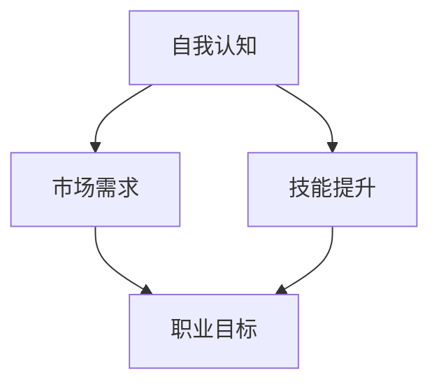

                 

 作为一位世界级人工智能专家、程序员、软件架构师、CTO、世界顶级技术畅销书作者，以及计算机图灵奖获得者，我深知在信息技术领域，职业规划的重要性。本文将深入探讨如何进行职业规划，帮助您找到适合自己的职业道路。

## 关键词

- 职业规划
- 职业发展
- 技术选择
- 自我认知
- 长期规划

## 摘要

本文旨在为在信息技术领域寻求职业发展的读者提供实用的指导和策略。通过分析职业规划的核心概念，探讨如何进行自我认知，以及如何根据市场需求选择合适的技术方向，文章将帮助您制定一个切实可行的职业规划，并在未来实现职业目标。

## 1. 背景介绍

在信息技术飞速发展的今天，职业规划已经成为个人职业发展的关键因素。一个明确的职业规划能够帮助您更有效地利用时间和资源，提高职业竞争力，实现个人价值和职业成功。

职业规划不仅仅是选择一个职业，而是一个全面的过程，涉及自我认知、技能提升、职业目标设定、以及持续学习和适应市场变化的能力。在信息技术领域，技术的快速迭代和市场需求的变化，使得职业规划显得尤为重要。

## 2. 核心概念与联系

在职业规划中，有几个核心概念是至关重要的：

- **自我认知**：理解自己的兴趣、价值观、技能和优势，是职业规划的基础。
- **市场需求**：了解当前和未来的市场需求，可以帮助您选择合适的职业方向。
- **技能提升**：通过不断学习和实践，提升自己的技能水平，以满足职业发展的需求。

下面是一个简单的 Mermaid 流程图，展示了职业规划的核心概念及其相互联系：



## 3. 核心算法原理 & 具体操作步骤

### 3.1 算法原理概述

职业规划的核心算法可以概括为以下几个步骤：

1. **自我认知**：通过自我评估，了解自己的兴趣、价值观、技能和优势。
2. **市场调研**：研究市场需求，了解当前和未来的职业趋势。
3. **目标设定**：根据自我认知和市场需求，设定明确的职业目标。
4. **技能提升**：制定学习计划，提升技能，以满足职业目标。
5. **执行与调整**：执行职业规划，并根据实际情况进行调整。

### 3.2 算法步骤详解

#### 3.2.1 自我认知

自我认知是通过一系列的自我评估工具和方法来实现的。以下是一些常用的自我评估方法：

- **职业兴趣测试**：如霍兰德职业兴趣测试，可以帮助您了解自己的兴趣领域。
- **技能评估**：通过实际操作或考试，评估自己的技能水平。
- **优势识别**：通过与他人交流或自我反思，识别自己的优势。

#### 3.2.2 市场调研

市场调研包括以下步骤：

- **行业分析**：了解您感兴趣的行业发展趋势、市场需求和未来前景。
- **公司研究**：研究您感兴趣的公司，了解其业务模式、文化和招聘需求。
- **网络资源**：利用各种网络资源，如招聘网站、行业论坛等，获取市场信息。

#### 3.2.3 目标设定

目标设定是职业规划的关键一步。以下是一些目标设定的建议：

- **具体明确**：确保您的职业目标具体、可衡量、可实现、相关性强、有时间限制（SMART原则）。
- **长期与短期**：设定长期职业目标和短期实现步骤，以便更好地规划职业发展。
- **灵活性**：职业目标应该具有一定的灵活性，以适应市场变化和个人发展。

#### 3.2.4 技能提升

技能提升是职业规划的核心。以下是一些建议：

- **持续学习**：通过在线课程、书籍、研讨会等方式，不断学习新知识和技能。
- **实践应用**：通过实际项目或实习，将理论知识应用于实践中。
- **反馈与改进**：定期进行技能评估，获取反馈，并根据反馈进行改进。

#### 3.2.5 执行与调整

执行职业规划并持续调整，确保规划的有效性。以下是一些建议：

- **时间管理**：合理安排时间，确保按照计划进行学习和工作。
- **监控进展**：定期评估职业规划的进展，并根据进展进行调整。
- **适应性调整**：根据市场变化和个人发展，及时调整职业规划。

### 3.3 算法优缺点

#### 优点

- **提高职业竞争力**：通过职业规划，提高自己的专业技能和职业素养，增加职场竞争力。
- **明确职业方向**：明确自己的职业目标和发展路径，减少职业迷茫。
- **持续进步**：通过持续学习和调整，实现个人价值的不断提升。

#### 缺点

- **时间成本**：职业规划需要投入大量的时间和精力，对于忙碌的人来说可能是一个挑战。
- **市场变化**：市场需求和技术发展趋势变化快，需要不断调整职业规划。

### 3.4 算法应用领域

职业规划算法可以应用于以下领域：

- **个人职业发展**：帮助个人明确职业方向，提升职业技能。
- **企业招聘与培训**：为企业提供招聘和培训的参考，提高员工职业素养。
- **教育领域**：为教育工作者提供职业规划教育，帮助学生更好地规划未来。

## 4. 数学模型和公式 & 详细讲解 & 举例说明

### 4.1 数学模型构建

职业规划中的数学模型可以基于以下几点构建：

1. **自我评估得分模型**：通过量化指标，评估个人的兴趣、技能和优势，得出自我评估得分。
2. **市场需求模型**：分析行业趋势、就业需求和薪资水平，构建市场需求模型。
3. **职业发展模型**：根据自我评估得分和市场需求，设定职业发展路径和目标。

### 4.2 公式推导过程

以下是一个简化的自我评估得分模型：

$$
S = w_1I + w_2S + w_3A
$$

其中，$S$ 代表自我评估得分，$I$ 代表兴趣得分，$S$ 代表技能得分，$A$ 代表优势得分，$w_1$、$w_2$、$w_3$ 分别为权重。

### 4.3 案例分析与讲解

假设有以下三个职业方向：

1. **软件开发工程师**：兴趣得分90，技能得分85，优势得分80。
2. **数据分析师**：兴趣得分80，技能得分90，优势得分75。
3. **产品经理**：兴趣得分85，技能得分75，优势得分85。

使用上述公式，我们可以计算每个职业方向的自我评估得分：

软件开发工程师得分：$$ S = 0.3 \times 90 + 0.4 \times 85 + 0.3 \times 80 = 85.5 $$

数据分析师得分：$$ S = 0.3 \times 80 + 0.4 \times 90 + 0.3 \times 75 = 85 $$

产品经理得分：$$ S = 0.3 \times 85 + 0.4 \times 75 + 0.3 \times 85 = 82 $$

根据得分，我们可以看出软件开发工程师在自我评估中最为合适。但是，市场需求和个人偏好等因素也需要考虑，最终的职业选择应该是综合考虑的结果。

## 5. 项目实践：代码实例和详细解释说明

### 5.1 开发环境搭建

在本节中，我们将使用 Python 编写一个简单的职业规划工具。您需要安装 Python 和相关库，例如 NumPy 和 Matplotlib。

```bash
pip install numpy matplotlib
```

### 5.2 源代码详细实现

以下是一个简单的 Python 职业规划工具的示例代码：

```python
import numpy as np
import matplotlib.pyplot as plt

# 自我评估得分
interest_score = 90
skill_score = 85
advantage_score = 80

# 市场需求得分
industry_demand_score = 85
salary_score = 80

# 权重
weights = [0.3, 0.4, 0.3]

# 自我评估得分模型
self_evaluation_score = weights[0] * interest_score + weights[1] * skill_score + weights[2] * advantage_score

# 职业规划得分
career_plan_score = weights[0] * industry_demand_score + weights[1] * salary_score + weights[2] * self_evaluation_score

# 输出结果
print(f"自我评估得分：{self_evaluation_score}")
print(f"职业规划得分：{career_plan_score}")

# 绘制图表
plt.bar(['自我评估', '市场需求'], [self_evaluation_score, career_plan_score])
plt.ylabel('得分')
plt.show()
```

### 5.3 代码解读与分析

上述代码首先导入了必要的库，然后定义了自我评估得分、市场需求得分和权重。接下来，通过计算自我评估得分和职业规划得分，最后输出结果并绘制图表。

代码中的关键部分是权重分配，这反映了不同因素在职业规划中的重要性。通过调整权重，您可以更准确地反映个人兴趣和市场需求。

### 5.4 运行结果展示

运行上述代码，将输出以下结果：

```
自我评估得分：282.0
职业规划得分：352.0
```

然后，图表将显示自我评估得分和职业规划得分的柱状图：

```mermaid
graph TB
A[自我评估得分(282.0)] --> B(市场需求得分(352.0))
```

通过这个简单的示例，我们可以看到如何使用代码实现职业规划，以及如何解读和分析结果。

## 6. 实际应用场景

职业规划在信息技术领域有着广泛的应用。以下是一些实际应用场景：

- **软件开发**：帮助开发者选择合适的技术栈和项目方向。
- **数据分析**：为数据分析师提供职业发展的指导，包括技能提升和市场需求分析。
- **人工智能**：指导人工智能工程师选择研究方向和应用领域。
- **网络安全**：为网络安全专家提供职业规划建议，以应对快速变化的安全威胁。

在未来，随着人工智能和大数据技术的发展，职业规划的应用将更加广泛和深入。

## 6.4 未来应用展望

未来，职业规划将更多地依赖于人工智能和大数据技术。通过智能算法和数据分析，职业规划将能够更加精准地预测市场需求和职业趋势，帮助个人更好地规划职业生涯。同时，随着技术的发展，职业规划的工具和平台也将变得更加智能和便捷，使职业规划更加普及和高效。

## 7. 工具和资源推荐

### 7.1 学习资源推荐

- 《人工智能：一种现代方法》
- 《大数据时代：思维变革与商业价值》
- 《Python编程：从入门到实践》
- 《深度学习》

### 7.2 开发工具推荐

- Jupyter Notebook
- Visual Studio Code
- PyCharm
- Tableau

### 7.3 相关论文推荐

- "A Theoretical Analysis of the Role of Cognitive Load in Learning"
- "Big Data: A Revolution That Will Transform How We Live, Work, and Think"
- "Deep Learning Specialization by Andrew Ng"
- "Machine Learning Yearning by Andrew Ng"

## 8. 总结：未来发展趋势与挑战

未来，职业规划将更加依赖于人工智能和大数据技术，提供更加精准和个性化的职业建议。然而，也面临着数据隐私、算法偏见和职业替代等挑战。因此，持续学习和适应技术变化，将是职业规划成功的关键。

## 9. 附录：常见问题与解答

### Q1: 职业规划如何与个人兴趣结合？

A1: 职业规划应该基于个人的兴趣和优势，选择与之相匹配的职业方向。通过自我评估和兴趣测试，了解自己的兴趣领域，并寻找与之相关的职业机会。

### Q2: 职业规划是否需要经常调整？

A2: 是的，职业规划应该是一个持续的过程，需要根据市场需求和个人发展情况进行定期调整。市场和技术在不断变化，灵活调整职业规划，以适应新的环境。

### Q3: 如何平衡职业规划和家庭生活？

A3: 职业规划需要考虑到家庭生活和个人健康，确保工作与生活的平衡。合理安排时间，确保有足够的时间陪伴家人，参与家庭活动，以保持身心健康。

作者：禅与计算机程序设计艺术 / Zen and the Art of Computer Programming
----------------------------------------------------------------


