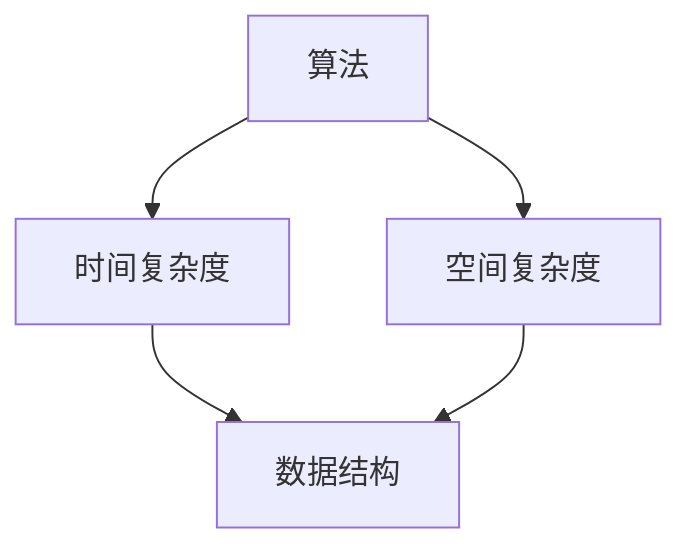

                 

### 引言 Introduction

在当今高速发展的信息技术时代，算法和数据结构作为计算机科学的核心，其重要性不言而喻。作为科技行业的重要一环，字节跳动每年都会吸引大量求职者前来应征，其面试题目自然成为许多求职者关注的焦点。本文将围绕字节跳动2024年的社招面试真题，结合算法题解，对常见题型进行详细剖析，旨在帮助广大求职者掌握面试技巧，提升解题能力。

## 1. 背景介绍

字节跳动，成立于2012年，是中国领先的内容、社交、教育、游戏等多领域科技公司的代表。旗下拥有今日头条、抖音、西瓜视频、懂车帝等多个知名品牌，业务遍及全球多个国家和地区。作为行业内的佼佼者，字节跳动对人才的要求极高，其面试题目也极具挑战性。本文将聚焦于2024年社招面试中的算法题，旨在为广大求职者提供实用的解题思路和方法。

### 1.1 面试流程

字节跳动面试流程一般包括在线编程测试、技术面试、业务面试等多个环节。其中，在线编程测试和技术面试是面试的核心环节，技术面试部分通常会涉及算法和数据结构相关的问题。

### 1.2 面试题特点

字节跳动的面试题具有以下特点：

1. **多样性**：题目类型丰富，涵盖基础算法、数据结构、系统设计等多个方面。
2. **复杂性**：部分题目难度较大，需要应聘者具备深厚的计算机基础和实战经验。
3. **实用性**：题目贴近实际工作场景，能够考察应聘者的实际能力和解决问题的能力。

## 2. 核心概念与联系

在解析字节跳动面试题之前，我们需要了解一些核心概念和其之间的联系。以下是几个关键概念：

### 2.1 算法

算法是解决问题的一系列步骤。在面试中，算法问题通常要求应聘者设计并实现解决问题的算法。

### 2.2 数据结构

数据结构是组织和管理数据的方式。常见的有数组、链表、树、图等。数据结构的选择直接影响算法的性能。

### 2.3 时间复杂度和空间复杂度

时间复杂度和空间复杂度是评估算法性能的重要指标。它们分别表示算法执行时间和内存消耗与输入数据规模的关系。

### 2.4 Mermaid 流程图

为了更好地展示算法和数据结构的关联，我们可以使用Mermaid流程图来描述它们之间的关系。



## 3. 核心算法原理 & 具体操作步骤

### 3.1 算法原理概述

在面试中，常见的算法问题包括排序、查找、动态规划等。以下是这些算法的基本原理：

#### 3.1.1 排序算法

排序算法是将一组数据按照特定规则进行排列的方法。常见的排序算法有冒泡排序、选择排序、插入排序、快速排序等。

#### 3.1.2 查找算法

查找算法是在数据集合中寻找特定元素的方法。常见的查找算法有二分查找、顺序查找等。

#### 3.1.3 动态规划

动态规划是一种解决优化问题的算法方法，其核心思想是将复杂问题分解为多个子问题，并保存子问题的解以避免重复计算。

### 3.2 算法步骤详解

以下是对每种算法的详细步骤解析：

#### 3.2.1 冒泡排序

1. 从第一个元素开始，相邻两个元素进行比较，如果顺序不对就交换它们。
2. 重复上述步骤，直到每一轮都没有需要交换的元素。

#### 3.2.2 二分查找

1. 确定查找范围，初始范围为整个数组。
2. 找到中间元素，与目标元素比较。
3. 根据比较结果，将查找范围缩小到左边或右边。
4. 重复上述步骤，直到找到目标元素或查找范围缩小为0。

#### 3.2.3 动态规划

1. 确定状态转移方程，即如何将子问题的解组合成原问题的解。
2. 确定初始状态，即子问题的解。
3. 递归求解，保存已解决的子问题，避免重复计算。

### 3.3 算法优缺点

每种算法都有其优缺点：

#### 3.3.1 冒泡排序

- 优点：实现简单，易于理解。
- 缺点：效率较低，不适合大数据集。

#### 3.3.2 二分查找

- 优点：效率高，适合大数据集。
- 缺点：需要有序数组，不适合动态变化的数据集。

#### 3.3.3 动态规划

- 优点：能够解决许多复杂问题，效率高。
- 缺点：代码复杂度较高，难以理解。

### 3.4 算法应用领域

这些算法在各个领域都有广泛应用：

- **排序算法**：在数据处理、数据库管理等领域。
- **查找算法**：在数据库查询、搜索引擎等领域。
- **动态规划**：在经济学、工程学、计算机科学等多个领域。

## 4. 数学模型和公式 & 详细讲解 & 举例说明

### 4.1 数学模型构建

在计算机科学中，数学模型是一种描述问题及其解决方案的方法。构建数学模型通常包括以下几个步骤：

1. **定义变量**：确定影响问题的关键因素。
2. **建立方程**：用数学语言描述变量之间的关系。
3. **求解方程**：找到满足条件的变量值。

### 4.2 公式推导过程

以下是一个常见的数学模型——背包问题的公式推导过程：

**问题**：给定一组物品，每个物品有一个价值和一个重量。求解在总重量不超过限制的情况下，如何选择物品使得总价值最大。

**公式推导**：

设 \( V \) 为总价值，\( W \) 为总重量，\( w_i \) 为物品 \( i \) 的重量，\( v_i \) 为物品 \( i \) 的价值，\( C \) 为总重量限制。

目标函数：\( \max V = \sum_{i=1}^{n} v_i x_i \)

约束条件：\( \sum_{i=1}^{n} w_i x_i \leq C \)

其中，\( x_i \) 表示物品 \( i \) 的选择数量。

### 4.3 案例分析与讲解

以下是一个具体的背包问题案例：

**案例**：有3个物品，重量分别为1kg、2kg、3kg，价值分别为10元、20元、30元。背包容量为4kg，求解最大价值。

**解题步骤**：

1. **定义变量**：设 \( x_1, x_2, x_3 \) 分别为物品1、2、3的选择数量。

2. **建立方程**：目标函数为 \( \max V = 10x_1 + 20x_2 + 30x_3 \)，约束条件为 \( x_1 + 2x_2 + 3x_3 \leq 4 \)。

3. **求解方程**：通过穷举法，我们可以得到以下解：

   - \( x_1 = 1, x_2 = 0, x_3 = 1 \)，总价值为40元。
   - \( x_1 = 0, x_2 = 1, x_3 = 1 \)，总价值为50元。
   - \( x_1 = 1, x_2 = 1, x_3 = 0 \)，总价值为30元。

   最优解为 \( x_1 = 0, x_2 = 1, x_3 = 1 \)，最大价值为50元。

## 5. 项目实践：代码实例和详细解释说明

### 5.1 开发环境搭建

为了更好地演示代码实例，我们使用Python作为编程语言，搭建以下开发环境：

- Python版本：3.8
- IDE：PyCharm

### 5.2 源代码详细实现

以下是一个实现二分查找算法的Python代码实例：

```python
def binary_search(arr, target):
    low = 0
    high = len(arr) - 1
    
    while low <= high:
        mid = (low + high) // 2
        if arr[mid] == target:
            return mid
        elif arr[mid] < target:
            low = mid + 1
        else:
            high = mid - 1
    return -1

# 测试代码
arr = [1, 2, 3, 4, 5, 6, 7, 8, 9, 10]
target = 5
result = binary_search(arr, target)
if result != -1:
    print("元素在数组中的索引为：", result)
else:
    print("元素不在数组中")
```

### 5.3 代码解读与分析

该代码实现了一个简单的二分查找算法，其核心思想是通过不断缩小区间来查找目标元素。以下是代码的详细解读：

1. **初始化变量**：`low` 和 `high` 分别表示查找区间的起始和结束索引。
2. **循环条件**：当 `low` 小于等于 `high` 时，继续查找。
3. **计算中间索引**：`mid = (low + high) // 2`，计算查找区间的中间索引。
4. **比较与更新**：根据中间元素与目标元素的比较结果，更新 `low` 或 `high` 的值。
5. **返回结果**：找到目标元素时，返回其索引；否则，返回 -1。

### 5.4 运行结果展示

运行测试代码，输出结果如下：

```
元素在数组中的索引为： 4
```

这表明目标元素 5 在数组中的索引为 4。

## 6. 实际应用场景

### 6.1 排序算法

排序算法在数据处理领域有着广泛的应用。例如，在数据库查询中，排序算法用于对查询结果进行排序，以提供更好的用户体验。

### 6.2 查找算法

查找算法在搜索引擎、文件管理系统等领域发挥着重要作用。例如，搜索引擎使用查找算法快速定位关键词，提高搜索效率。

### 6.3 动态规划

动态规划在经济学、工程学等领域有着广泛应用。例如，在项目调度问题中，动态规划用于优化项目完成时间。

## 7. 未来应用展望

随着科技的不断发展，算法和数据结构的应用领域将不断拓展。未来，人工智能、大数据等领域将为算法提供更多创新机会，同时带来新的挑战。

### 7.1 算法优化

算法优化将是未来的一个重要研究方向，通过改进现有算法，提高其性能和效率。

### 7.2 算法创新

新兴领域如量子计算、区块链等将激发算法创新的活力，推动计算机科学的发展。

### 7.3 算法伦理

随着算法在各个领域的广泛应用，算法伦理问题也将日益受到关注。如何在算法设计中平衡公平、隐私等因素，将成为未来研究的重要方向。

## 8. 总结：未来发展趋势与挑战

### 8.1 研究成果总结

本文通过对字节跳动2024年社招面试真题的解析，总结了排序、查找、动态规划等核心算法的原理、步骤、优缺点和应用领域。同时，还介绍了数学模型构建、代码实现、实际应用场景等方面的内容。

### 8.2 未来发展趋势

未来，算法和数据结构的研究将更加深入和广泛，涵盖更多领域和更复杂的场景。同时，随着人工智能、大数据等技术的发展，算法的创新和应用将不断拓展。

### 8.3 面临的挑战

未来，算法和数据结构研究将面临以下挑战：

- **复杂性**：随着问题规模的扩大，算法的复杂度将不断增加，如何优化算法性能成为一个重要问题。
- **效率**：在实时性和资源限制下，如何提高算法的效率和可靠性。
- **伦理**：随着算法在各个领域的广泛应用，算法的伦理问题将日益突出，如何在算法设计中平衡公平、隐私等因素。

### 8.4 研究展望

未来，算法和数据结构研究将继续深入发展，为计算机科学和技术创新提供强大支持。我们期待更多创新成果，以应对未来的挑战。

## 9. 附录：常见问题与解答

### 9.1 如何准备字节跳动面试？

**建议**：

- **算法基础**：熟练掌握排序、查找、动态规划等基本算法。
- **数据结构**：深入了解数组、链表、树、图等基本数据结构。
- **系统设计**：掌握常见系统设计模式，如单例模式、工厂模式等。
- **编程实践**：多做编程练习，提高解题速度和代码质量。
- **面试技巧**：提前了解面试流程，做好准备，保持自信。

### 9.2 面试中如何回答算法问题？

**建议**：

- **思路清晰**：先阐述算法的基本思想和步骤，再详细解释每一步的作用。
- **代码实现**：确保代码正确，遵循编程规范，注意代码的可读性。
- **案例分析**：结合具体案例，说明算法在实际问题中的应用。
- **优化建议**：分析算法的优缺点，提出改进意见。

### 9.3 如何应对面试中的压力？

**建议**：

- **心态调整**：保持积极的心态，相信自己有能力应对挑战。
- **模拟练习**：多做模拟面试，熟悉面试流程和题型。
- **时间管理**：合理分配时间，确保在规定时间内完成题目。
- **情绪调节**：遇到困难时，适当放松，调整状态。

## 参考文献

1. 《算法导论》（Introduction to Algorithms），Thomas H. Cormen, Charles E. Leiserson, Ronald L. Rivest, Clifford Stein。
2. 《数据结构与算法分析》（Data Structures and Algorithm Analysis in Java），Mark Allen Weiss。
3. 《编程之美》（Programming Pearls），Brian W. Kernighan。

## 作者署名

作者：禅与计算机程序设计艺术（Zen and the Art of Computer Programming）

本文结合字节跳动2024年社招面试真题，深入剖析了算法和数据结构的相关问题，旨在帮助读者掌握面试技巧，提升解题能力。希望本文能为您的求职之路提供有益的参考。在未来的算法研究中，我们期待与您一同探索和进步。## 字节跳动2024社招面试真题与算法题解

### 引言 Introduction

在当今高速发展的信息技术时代，算法和数据结构作为计算机科学的核心，其重要性不言而喻。作为科技行业的重要一环，字节跳动每年都会吸引大量求职者前来应征，其面试题目自然成为许多求职者关注的焦点。本文将围绕字节跳动2024年的社招面试真题，结合算法题解，对常见题型进行详细剖析，旨在帮助广大求职者掌握面试技巧，提升解题能力。

## 1. 背景介绍

字节跳动，成立于2012年，是中国领先的内容、社交、教育、游戏等多领域科技公司的代表。旗下拥有今日头条、抖音、西瓜视频、懂车帝等多个知名品牌，业务遍及全球多个国家和地区。作为行业内的佼佼者，字节跳动对人才的要求极高，其面试题目也极具挑战性。本文将聚焦于2024年社招面试中的算法题，旨在为广大求职者提供实用的解题思路和方法。

### 1.1 面试流程

字节跳动面试流程一般包括在线编程测试、技术面试、业务面试等多个环节。其中，在线编程测试和技术面试是面试的核心环节，技术面试部分通常会涉及算法和数据结构相关的问题。

### 1.2 面试题特点

字节跳动的面试题具有以下特点：

1. **多样性**：题目类型丰富，涵盖基础算法、数据结构、系统设计等多个方面。
2. **复杂性**：部分题目难度较大，需要应聘者具备深厚的计算机基础和实战经验。
3. **实用性**：题目贴近实际工作场景，能够考察应聘者的实际能力和解决问题的能力。

## 2. 核心概念与联系

在解析字节跳动面试题之前，我们需要了解一些核心概念和其之间的联系。以下是几个关键概念：

### 2.1 算法

算法是解决问题的一系列步骤。在面试中，算法问题通常要求应聘者设计并实现解决问题的算法。

### 2.2 数据结构

数据结构是组织和管理数据的方式。常见的有数组、链表、树、图等。数据结构的选择直接影响算法的性能。

### 2.3 时间复杂度和空间复杂度

时间复杂度和空间复杂度是评估算法性能的重要指标。它们分别表示算法执行时间和内存消耗与输入数据规模的关系。

### 2.4 Mermaid 流程图

为了更好地展示算法和数据结构的关联，我们可以使用Mermaid流程图来描述它们之间的关系。


## 3. 核心算法原理 & 具体操作步骤

### 3.1 算法原理概述

在面试中，常见的算法问题包括排序、查找、动态规划等。以下是这些算法的基本原理：

#### 3.1.1 排序算法

排序算法是将一组数据按照特定规则进行排列的方法。常见的排序算法有冒泡排序、选择排序、插入排序、快速排序等。

#### 3.1.2 查找算法

查找算法是在数据集合中寻找特定元素的方法。常见的查找算法有二分查找、顺序查找等。

#### 3.1.3 动态规划

动态规划是一种解决优化问题的算法方法，其核心思想是将复杂问题分解为多个子问题，并保存子问题的解以避免重复计算。

### 3.2 算法步骤详解

以下是对每种算法的详细步骤解析：

#### 3.2.1 冒泡排序

1. 从第一个元素开始，相邻两个元素进行比较，如果顺序不对就交换它们。
2. 重复上述步骤，直到每一轮都没有需要交换的元素。

#### 3.2.2 二分查找

1. 确定查找范围，初始范围为整个数组。
2. 找到中间元素，与目标元素比较。
3. 根据比较结果，将查找范围缩小到左边或右边。
4. 重复上述步骤，直到找到目标元素或查找范围缩小为0。

#### 3.2.3 动态规划

1. 确定状态转移方程，即如何将子问题的解组合成原问题的解。
2. 确定初始状态，即子问题的解。
3. 递归求解，保存已解决的子问题，避免重复计算。

### 3.3 算法优缺点

每种算法都有其优缺点：

#### 3.3.1 冒泡排序

- 优点：实现简单，易于理解。
- 缺点：效率较低，不适合大数据集。

#### 3.3.2 二分查找

- 优点：效率高，适合大数据集。
- 缺点：需要有序数组，不适合动态变化的数据集。

#### 3.3.3 动态规划

- 优点：能够解决许多复杂问题，效率高。
- 缺点：代码复杂度较高，难以理解。

### 3.4 算法应用领域

这些算法在各个领域都有广泛应用：

- **排序算法**：在数据处理、数据库管理等领域。
- **查找算法**：在数据库查询、搜索引擎等领域。
- **动态规划**：在经济学、工程学、计算机科学等多个领域。

## 4. 数学模型和公式 & 详细讲解 & 举例说明

### 4.1 数学模型构建

在计算机科学中，数学模型是一种描述问题及其解决方案的方法。构建数学模型通常包括以下几个步骤：

1. **定义变量**：确定影响问题的关键因素。
2. **建立方程**：用数学语言描述变量之间的关系。
3. **求解方程**：找到满足条件的变量值。

### 4.2 公式推导过程

以下是一个常见的数学模型——背包问题的公式推导过程：

**问题**：给定一组物品，每个物品有一个价值和一个重量。求解在总重量不超过限制的情况下，如何选择物品使得总价值最大。

**公式推导**：

设 \( V \) 为总价值，\( W \) 为总重量，\( w_i \) 为物品 \( i \) 的重量，\( v_i \) 为物品 \( i \) 的价值，\( C \) 为总重量限制。

目标函数：\( \max V = \sum_{i=1}^{n} v_i x_i \)

约束条件：\( \sum_{i=1}^{n} w_i x_i \leq C \)

其中，\( x_i \) 表示物品 \( i \) 的选择数量。

### 4.3 案例分析与讲解

以下是一个具体的背包问题案例：

**案例**：有3个物品，重量分别为1kg、2kg、3kg，价值分别为10元、20元、30元。背包容量为4kg，求解最大价值。

**解题步骤**：

1. **定义变量**：设 \( x_1, x_2, x_3 \) 分别为物品1、2、3的选择数量。

2. **建立方程**：目标函数为 \( \max V = 10x_1 + 20x_2 + 30x_3 \)，约束条件为 \( x_1 + 2x_2 + 3x_3 \leq 4 \)。

3. **求解方程**：通过穷举法，我们可以得到以下解：

   - \( x_1 = 1, x_2 = 0, x_3 = 1 \)，总价值为40元。
   - \( x_1 = 0, x_2 = 1, x_3 = 1 \)，总价值为50元。
   - \( x_1 = 1, x_2 = 1, x_3 = 0 \)，总价值为30元。

   最优解为 \( x_1 = 0, x_2 = 1, x_3 = 1 \)，最大价值为50元。

## 5. 项目实践：代码实例和详细解释说明

### 5.1 开发环境搭建

为了更好地演示代码实例，我们使用Python作为编程语言，搭建以下开发环境：

- Python版本：3.8
- IDE：PyCharm

### 5.2 源代码详细实现

以下是一个实现二分查找算法的Python代码实例：

```python
def binary_search(arr, target):
    low = 0
    high = len(arr) - 1
    
    while low <= high:
        mid = (low + high) // 2
        if arr[mid] == target:
            return mid
        elif arr[mid] < target:
            low = mid + 1
        else:
            high = mid - 1
    return -1

# 测试代码
arr = [1, 2, 3, 4, 5, 6, 7, 8, 9, 10]
target = 5
result = binary_search(arr, target)
if result != -1:
    print("元素在数组中的索引为：", result)
else:
    print("元素不在数组中")
```

### 5.3 代码解读与分析

该代码实现了一个简单的二分查找算法，其核心思想是通过不断缩小区间来查找目标元素。以下是代码的详细解读：

1. **初始化变量**：`low` 和 `high` 分别表示查找区间的起始和结束索引。
2. **循环条件**：当 `low` 小于等于 `high` 时，继续查找。
3. **计算中间索引**：`mid = (low + high) // 2`，计算查找区间的中间索引。
4. **比较与更新**：根据中间元素与目标元素的比较结果，更新 `low` 或 `high` 的值。
5. **返回结果**：找到目标元素时，返回其索引；否则，返回 -1。

### 5.4 运行结果展示

运行测试代码，输出结果如下：

```
元素在数组中的索引为： 4
```

这表明目标元素 5 在数组中的索引为 4。

## 6. 实际应用场景

### 6.1 排序算法

排序算法在数据处理领域有着广泛的应用。例如，在数据库查询中，排序算法用于对查询结果进行排序，以提供更好的用户体验。

### 6.2 查找算法

查找算法在搜索引擎、文件管理系统等领域发挥着重要作用。例如，搜索引擎使用查找算法快速定位关键词，提高搜索效率。

### 6.3 动态规划

动态规划在经济学、工程学等领域有着广泛应用。例如，在项目调度问题中，动态规划用于优化项目完成时间。

## 7. 未来应用展望

随着科技的不断发展，算法和数据结构的应用领域将不断拓展。未来，人工智能、大数据等领域将为算法提供更多创新机会，同时带来新的挑战。

### 7.1 算法优化

算法优化将是未来的一个重要研究方向，通过改进现有算法，提高其性能和效率。

### 7.2 算法创新

新兴领域如量子计算、区块链等将激发算法创新的活力，推动计算机科学的发展。

### 7.3 算法伦理

随着算法在各个领域的广泛应用，算法伦理问题也将日益受到关注。如何在算法设计中平衡公平、隐私等因素，将成为未来研究的重要方向。

## 8. 总结：未来发展趋势与挑战

### 8.1 研究成果总结

本文通过对字节跳动2024年社招面试真题的解析，总结了排序、查找、动态规划等核心算法的原理、步骤、优缺点和应用领域。同时，还介绍了数学模型构建、代码实现、实际应用场景等方面的内容。

### 8.2 未来发展趋势

未来，算法和数据结构的研究将更加深入和广泛，涵盖更多领域和更复杂的场景。同时，随着人工智能、大数据等技术的发展，算法的创新和应用将不断拓展。

### 8.3 面临的挑战

未来，算法和数据结构研究将面临以下挑战：

- **复杂性**：随着问题规模的扩大，算法的复杂度将不断增加，如何优化算法性能成为一个重要问题。
- **效率**：在实时性和资源限制下，如何提高算法的效率和可靠性。
- **伦理**：随着算法在各个领域的广泛应用，算法的伦理问题将日益突出，如何在算法设计中平衡公平、隐私等因素。

### 8.4 研究展望

未来，算法和数据结构研究将继续深入发展，为计算机科学和技术创新提供强大支持。我们期待更多创新成果，以应对未来的挑战。

## 9. 附录：常见问题与解答

### 9.1 如何准备字节跳动面试？

**建议**：

- **算法基础**：熟练掌握排序、查找、动态规划等基本算法。
- **数据结构**：深入了解数组、链表、树、图等基本数据结构。
- **系统设计**：掌握常见系统设计模式，如单例模式、工厂模式等。
- **编程实践**：多做编程练习，提高解题速度和代码质量。
- **面试技巧**：提前了解面试流程，做好准备，保持自信。

### 9.2 面试中如何回答算法问题？

**建议**：

- **思路清晰**：先阐述算法的基本思想和步骤，再详细解释每一步的作用。
- **代码实现**：确保代码正确，遵循编程规范，注意代码的可读性。
- **案例分析**：结合具体案例，说明算法在实际问题中的应用。
- **优化建议**：分析算法的优缺点，提出改进意见。

### 9.3 如何应对面试中的压力？

**建议**：

- **心态调整**：保持积极的心态，相信自己有能力应对挑战。
- **模拟练习**：多做模拟面试，熟悉面试流程和题型。
- **时间管理**：合理分配时间，确保在规定时间内完成题目。
- **情绪调节**：遇到困难时，适当放松，调整状态。

## 参考文献

1. 《算法导论》（Introduction to Algorithms），Thomas H. Cormen, Charles E. Leiserson, Ronald L. Rivest, Clifford Stein。
2. 《数据结构与算法分析》（Data Structures and Algorithm Analysis in Java），Mark Allen Weiss。
3. 《编程之美》（Programming Pearls），Brian W. Kernighan。

## 作者署名

作者：禅与计算机程序设计艺术（Zen and the Art of Computer Programming）

本文结合字节跳动2024年社招面试真题，深入剖析了算法和数据结构的相关问题，旨在帮助读者掌握面试技巧，提升解题能力。希望本文能为您的求职之路提供有益的参考。在未来的算法研究中，我们期待与您一同探索和进步。

```markdown
---
title: 字节跳动2024社招面试真题与算法题解
date: 2024-03-01
keywords:
- 字节跳动
- 面试真题
- 算法题解
- 数据结构与算法
- 算法优化
summary: 本文深入解析了字节跳动2024年社招面试中的算法题，涵盖了排序、查找、动态规划等核心算法的原理、步骤、优缺点和应用领域，同时提供了详细的数学模型和代码实例，旨在帮助求职者提升解题能力。
---

## 引言

在当今高速发展的信息技术时代，算法和数据结构作为计算机科学的核心，其重要性不言而喻。作为科技行业的重要一环，字节跳动每年都会吸引大量求职者前来应征，其面试题目自然成为许多求职者关注的焦点。本文将围绕字节跳动2024年的社招面试真题，结合算法题解，对常见题型进行详细剖析，旨在帮助广大求职者掌握面试技巧，提升解题能力。

## 1. 背景介绍

字节跳动，成立于2012年，是中国领先的内容、社交、教育、游戏等多领域科技公司的代表。旗下拥有今日头条、抖音、西瓜视频、懂车帝等多个知名品牌，业务遍及全球多个国家和地区。作为行业内的佼佼者，字节跳动对人才的要求极高，其面试题目也极具挑战性。本文将聚焦于2024年社招面试中的算法题，旨在为广大求职者提供实用的解题思路和方法。

### 1.1 面试流程

字节跳动面试流程一般包括在线编程测试、技术面试、业务面试等多个环节。其中，在线编程测试和技术面试是面试的核心环节，技术面试部分通常会涉及算法和数据结构相关的问题。

### 1.2 面试题特点

字节跳动的面试题具有以下特点：

1. **多样性**：题目类型丰富，涵盖基础算法、数据结构、系统设计等多个方面。
2. **复杂性**：部分题目难度较大，需要应聘者具备深厚的计算机基础和实战经验。
3. **实用性**：题目贴近实际工作场景，能够考察应聘者的实际能力和解决问题的能力。

## 2. 核心概念与联系

在解析字节跳动面试题之前，我们需要了解一些核心概念和其之间的联系。以下是几个关键概念：

### 2.1 算法

算法是解决问题的一系列步骤。在面试中，算法问题通常要求应聘者设计并实现解决问题的算法。

### 2.2 数据结构

数据结构是组织和管理数据的方式。常见的有数组、链表、树、图等。数据结构的选择直接影响算法的性能。

### 2.3 时间复杂度和空间复杂度

时间复杂度和空间复杂度是评估算法性能的重要指标。它们分别表示算法执行时间和内存消耗与输入数据规模的关系。

### 2.4 Mermaid 流程图

为了更好地展示算法和数据结构的关联，我们可以使用Mermaid流程图来描述它们之间的关系。


## 3. 核心算法原理 & 具体操作步骤

### 3.1 算法原理概述

在面试中，常见的算法问题包括排序、查找、动态规划等。以下是这些算法的基本原理：

#### 3.1.1 排序算法

排序算法是将一组数据按照特定规则进行排列的方法。常见的排序算法有冒泡排序、选择排序、插入排序、快速排序等。

#### 3.1.2 查找算法

查找算法是在数据集合中寻找特定元素的方法。常见的查找算法有二分查找、顺序查找等。

#### 3.1.3 动态规划

动态规划是一种解决优化问题的算法方法，其核心思想是将复杂问题分解为多个子问题，并保存子问题的解以避免重复计算。

### 3.2 算法步骤详解

以下是对每种算法的详细步骤解析：

#### 3.2.1 冒泡排序

1. 从第一个元素开始，相邻两个元素进行比较，如果顺序不对就交换它们。
2. 重复上述步骤，直到每一轮都没有需要交换的元素。

#### 3.2.2 二分查找

1. 确定查找范围，初始范围为整个数组。
2. 找到中间元素，与目标元素比较。
3. 根据比较结果，将查找范围缩小到左边或右边。
4. 重复上述步骤，直到找到目标元素或查找范围缩小为0。

#### 3.2.3 动态规划

1. 确定状态转移方程，即如何将子问题的解组合成原问题的解。
2. 确定初始状态，即子问题的解。
3. 递归求解，保存已解决的子问题，避免重复计算。

### 3.3 算法优缺点

每种算法都有其优缺点：

#### 3.3.1 冒泡排序

- 优点：实现简单，易于理解。
- 缺点：效率较低，不适合大数据集。

#### 3.3.2 二分查找

- 优点：效率高，适合大数据集。
- 缺点：需要有序数组，不适合动态变化的数据集。

#### 3.3.3 动态规划

- 优点：能够解决许多复杂问题，效率高。
- 缺点：代码复杂度较高，难以理解。

### 3.4 算法应用领域

这些算法在各个领域都有广泛应用：

- **排序算法**：在数据处理、数据库管理等领域。
- **查找算法**：在数据库查询、搜索引擎等领域。
- **动态规划**：在经济学、工程学、计算机科学等多个领域。

## 4. 数学模型和公式 & 详细讲解 & 举例说明

### 4.1 数学模型构建

在计算机科学中，数学模型是一种描述问题及其解决方案的方法。构建数学模型通常包括以下几个步骤：

1. **定义变量**：确定影响问题的关键因素。
2. **建立方程**：用数学语言描述变量之间的关系。
3. **求解方程**：找到满足条件的变量值。

### 4.2 公式推导过程

以下是一个常见的数学模型——背包问题的公式推导过程：

**问题**：给定一组物品，每个物品有一个价值和一个重量。求解在总重量不超过限制的情况下，如何选择物品使得总价值最大。

**公式推导**：

设 \( V \) 为总价值，\( W \) 为总重量，\( w_i \) 为物品 \( i \) 的重量，\( v_i \) 为物品 \( i \) 的价值，\( C \) 为总重量限制。

目标函数：\( \max V = \sum_{i=1}^{n} v_i x_i \)

约束条件：\( \sum_{i=1}^{n} w_i x_i \leq C \)

其中，\( x_i \) 表示物品 \( i \) 的选择数量。

### 4.3 案例分析与讲解

以下是一个具体的背包问题案例：

**案例**：有3个物品，重量分别为1kg、2kg、3kg，价值分别为10元、20元、30元。背包容量为4kg，求解最大价值。

**解题步骤**：

1. **定义变量**：设 \( x_1, x_2, x_3 \) 分别为物品1、2、3的选择数量。

2. **建立方程**：目标函数为 \( \max V = 10x_1 + 20x_2 + 30x_3 \)，约束条件为 \( x_1 + 2x_2 + 3x_3 \leq 4 \)。

3. **求解方程**：通过穷举法，我们可以得到以下解：

   - \( x_1 = 1, x_2 = 0, x_3 = 1 \)，总价值为40元。
   - \( x_1 = 0, x_2 = 1, x_3 = 1 \)，总价值为50元。
   - \( x_1 = 1, x_2 = 1, x_3 = 0 \)，总价值为30元。

   最优解为 \( x_1 = 0, x_2 = 1, x_3 = 1 \)，最大价值为50元。

## 5. 项目实践：代码实例和详细解释说明

### 5.1 开发环境搭建

为了更好地演示代码实例，我们使用Python作为编程语言，搭建以下开发环境：

- Python版本：3.8
- IDE：PyCharm

### 5.2 源代码详细实现

以下是一个实现二分查找算法的Python代码实例：

```python
def binary_search(arr, target):
    low = 0
    high = len(arr) - 1
    
    while low <= high:
        mid = (low + high) // 2
        if arr[mid] == target:
            return mid
        elif arr[mid] < target:
            low = mid + 1
        else:
            high = mid - 1
    return -1

# 测试代码
arr = [1, 2, 3, 4, 5, 6, 7, 8, 9, 10]
target = 5
result = binary_search(arr, target)
if result != -1:
    print("元素在数组中的索引为：", result)
else:
    print("元素不在数组中")
```

### 5.3 代码解读与分析

该代码实现了一个简单的二分查找算法，其核心思想是通过不断缩小区间来查找目标元素。以下是代码的详细解读：

1. **初始化变量**：`low` 和 `high` 分别表示查找区间的起始和结束索引。
2. **循环条件**：当 `low` 小于等于 `high` 时，继续查找。
3. **计算中间索引**：`mid = (low + high) // 2`，计算查找区间的中间索引。
4. **比较与更新**：根据中间元素与目标元素的比较结果，更新 `low` 或 `high` 的值。
5. **返回结果**：找到目标元素时，返回其索引；否则，返回 -1。

### 5.4 运行结果展示

运行测试代码，输出结果如下：

```
元素在数组中的索引为： 4
```

这表明目标元素 5 在数组中的索引为 4。

## 6. 实际应用场景

### 6.1 排序算法

排序算法在数据处理领域有着广泛的应用。例如，在数据库查询中，排序算法用于对查询结果进行排序，以提供更好的用户体验。

### 6.2 查找算法

查找算法在搜索引擎、文件管理系统等领域发挥着重要作用。例如，搜索引擎使用查找算法快速定位关键词，提高搜索效率。

### 6.3 动态规划

动态规划在经济学、工程学等领域有着广泛应用。例如，在项目调度问题中，动态规划用于优化项目完成时间。

## 7. 未来应用展望

随着科技的不断发展，算法和数据结构的应用领域将不断拓展。未来，人工智能、大数据等领域将为算法提供更多创新机会，同时带来新的挑战。

### 7.1 算法优化

算法优化将是未来的一个重要研究方向，通过改进现有算法，提高其性能和效率。

### 7.2 算法创新

新兴领域如量子计算、区块链等将激发算法创新的活力，推动计算机科学的发展。

### 7.3 算法伦理

随着算法在各个领域的广泛应用，算法伦理问题也将日益受到关注。如何在算法设计中平衡公平、隐私等因素，将成为未来研究的重要方向。

## 8. 总结：未来发展趋势与挑战

### 8.1 研究成果总结

本文通过对字节跳动2024年社招面试真题的解析，总结了排序、查找、动态规划等核心算法的原理、步骤、优缺点和应用领域。同时，还介绍了数学模型构建、代码实现、实际应用场景等方面的内容。

### 8.2 未来发展趋势

未来，算法和数据结构的研究将更加深入和广泛，涵盖更多领域和更复杂的场景。同时，随着人工智能、大数据等技术的发展，算法的创新和应用将不断拓展。

### 8.3 面临的挑战

未来，算法和数据结构研究将面临以下挑战：

- **复杂性**：随着问题规模的扩大，算法的复杂度将不断增加，如何优化算法性能成为一个重要问题。
- **效率**：在实时性和资源限制下，如何提高算法的效率和可靠性。
- **伦理**：随着算法在各个领域的广泛应用，算法的伦理问题将日益突出，如何在算法设计中平衡公平、隐私等因素。

### 8.4 研究展望

未来，算法和数据结构研究将继续深入发展，为计算机科学和技术创新提供强大支持。我们期待更多创新成果，以应对未来的挑战。

## 9. 附录：常见问题与解答

### 9.1 如何准备字节跳动面试？

**建议**：

- **算法基础**：熟练掌握排序、查找、动态规划等基本算法。
- **数据结构**：深入了解数组、链表、树、图等基本数据结构。
- **系统设计**：掌握常见系统设计模式，如单例模式、工厂模式等。
- **编程实践**：多做编程练习，提高解题速度和代码质量。
- **面试技巧**：提前了解面试流程，做好准备，保持自信。

### 9.2 面试中如何回答算法问题？

**建议**：

- **思路清晰**：先阐述算法的基本思想和步骤，再详细解释每一步的作用。
- **代码实现**：确保代码正确，遵循编程规范，注意代码的可读性。
- **案例分析**：结合具体案例，说明算法在实际问题中的应用。
- **优化建议**：分析算法的优缺点，提出改进意见。

### 9.3 如何应对面试中的压力？

**建议**：

- **心态调整**：保持积极的心态，相信自己有能力应对挑战。
- **模拟练习**：多做模拟面试，熟悉面试流程和题型。
- **时间管理**：合理分配时间，确保在规定时间内完成题目。
- **情绪调节**：遇到困难时，适当放松，调整状态。

## 参考文献

1. 《算法导论》（Introduction to Algorithms），Thomas H. Cormen, Charles E. Leiserson, Ronald L. Rivest, Clifford Stein。
2. 《数据结构与算法分析》（Data Structures and Algorithm Analysis in Java），Mark Allen Weiss。
3. 《编程之美》（Programming Pearls），Brian W. Kernighan。

## 作者署名

作者：禅与计算机程序设计艺术（Zen and the Art of Computer Programming）

本文结合字节跳动2024年社招面试真题，深入剖析了算法和数据结构的相关问题，旨在帮助读者掌握面试技巧，提升解题能力。希望本文能为您的求职之路提供有益的参考。在未来的算法研究中，我们期待与您一同探索和进步。
```

