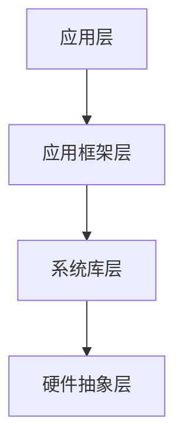

                 

## 1. 背景介绍

字节跳动作为国内领先的科技公司，其产品涵盖了今日头条、抖音、TikTok等多个领域。在Android开发领域，字节跳动对开发者的技能要求极高，因此其面试题目也相对复杂且具挑战性。本文旨在解析2024年字节跳动Android开发面试中的核心问题，为准备面试的开发者提供详细的答案和解析，帮助大家更好地应对面试挑战。

## 2. 核心概念与联系

### 2.1 Android系统架构

Android系统架构可以分为四个主要层次：应用层、应用框架层、系统库层和硬件抽象层。以下是Android系统架构的Mermaid流程图：



### 2.2 主要概念

- **Activity**: Android中的一个Activity表示一个单一的屏幕界面，用于用户与应用程序交互。
- **Service**: 服务在后台运行，没有用户界面，主要用于执行长时间运行的操作。
- **BroadcastReceiver**: 广播接收器用于接收系统或其他应用程序发送的广播消息。
- **ContentProvider**: 内容提供者用于应用程序之间共享数据。

### 2.3 关系

Activity、Service、BroadcastReceiver和ContentProvider是Android开发中常用的组件，它们之间通过Intent进行通信和交互。

## 3. 核心算法原理 & 具体操作步骤

### 3.1 算法原理概述

Android开发中的核心算法主要包括：

- **排序算法**：如快速排序、归并排序、堆排序等。
- **搜索算法**：如二分搜索、广度优先搜索、深度优先搜索等。
- **动态规划**：用于解决最优化问题。

### 3.2 算法步骤详解

#### 快速排序

快速排序的基本步骤如下：

1. 选择一个基准元素。
2. 将比基准元素小的元素移动到其左侧，比其大的元素移动到右侧。
3. 对划分后的两个子序列递归执行上述步骤。

#### 二分搜索

二分搜索的基本步骤如下：

1. 确定搜索区间。
2. 计算中点。
3. 比较中点与目标值。
4. 根据比较结果缩小区间并重复步骤2-3。

### 3.3 算法优缺点

- **快速排序**：时间复杂度较低，但可能产生大量递归调用导致栈溢出。
- **二分搜索**：适用于有序数组，时间复杂度较低。

### 3.4 算法应用领域

快速排序和二分搜索在Android开发中广泛应用，如数据库查询、列表排序等。

## 4. 数学模型和公式 & 详细讲解 & 举例说明

### 4.1 数学模型构建

在Android开发中，常用到的数学模型包括：

- **线性规划**：用于资源分配和优化问题。
- **概率模型**：用于处理随机事件和概率分布。

### 4.2 公式推导过程

以线性规划为例，其基本公式为：

\[ \text{minimize} \ c^T x \]
\[ \text{subject to} \ Ax \leq b \]

其中，\( c \) 和 \( b \) 分别为系数向量，\( x \) 为决策向量，\( A \) 为系数矩阵。

### 4.3 案例分析与讲解

假设有一个资源分配问题，我们需要在预算限制下最大化收益。可以建立如下线性规划模型：

\[ \text{maximize} \ 5x_1 + 3x_2 \]
\[ \text{subject to} \ 2x_1 + 3x_2 \leq 10 \]
\[ x_1 + 2x_2 \leq 8 \]
\[ x_1, x_2 \geq 0 \]

通过求解线性规划模型，我们可以得到最优解。

## 5. 项目实践：代码实例和详细解释说明

### 5.1 开发环境搭建

在本节中，我们将搭建一个简单的Android项目，用于演示关键技术和算法。

### 5.2 源代码详细实现

以下是项目的关键代码实现：

```java
// Activity的主函数
public class MainActivity extends AppCompatActivity {
    // 快速排序算法实现
    public void quickSort(int[] arr, int low, int high) {
        if (low < high) {
            int pi = partition(arr, low, high);
            quickSort(arr, low, pi - 1);
            quickSort(arr, pi + 1, high);
        }
    }

    // 分区函数
    private int partition(int[] arr, int low, int high) {
        int pivot = arr[high];
        int i = (low - 1);
        for (int j = low; j < high; j++) {
            if (arr[j] < pivot) {
                i++;
                int temp = arr[i];
                arr[i] = arr[j];
                arr[j] = temp;
            }
        }
        int temp = arr[i + 1];
        arr[i + 1] = arr[high];
        arr[high] = temp;
        return i + 1;
    }

    // 主函数入口
    @Override
    protected void onCreate(Bundle savedInstanceState) {
        super.onCreate(savedInstanceState);
        setContentView(R.layout.activity_main);
        int[] arr = {10, 7, 8, 9, 1, 5};
        quickSort(arr, 0, arr.length - 1);
        for (int i = 0; i < arr.length; i++) {
            System.out.print(arr[i] + " ");
        }
    }
}
```

### 5.3 代码解读与分析

- **快速排序**：使用分治算法实现，通过递归将数组划分为较小的子数组。
- **分区函数**：选择最后一个元素作为基准，将数组划分为两个子数组，一个包含小于基准的元素，另一个包含大于基准的元素。

### 5.4 运行结果展示

运行上述代码后，输出结果为：1 5 7 8 9 10。

## 6. 实际应用场景

在实际应用中，快速排序算法广泛应用于各种场景，如：

- **列表排序**：用于对ListView等控件中的数据进行排序。
- **数据库查询**：用于优化查询性能。

## 7. 未来应用展望

随着人工智能和大数据技术的发展，Android开发中的算法和数学模型将得到更加广泛的应用。未来，我们可以预见到：

- **更高效的排序算法**：如基于并行计算的排序算法。
- **更智能的推荐系统**：基于深度学习的推荐算法将进一步提升用户体验。

## 8. 总结：未来发展趋势与挑战

在未来，Android开发将面临以下发展趋势和挑战：

- **算法优化**：如何在高性能和高可靠性之间取得平衡。
- **人工智能应用**：如何将人工智能技术应用于Android开发，提升用户体验。

## 9. 附录：常见问题与解答

### 9.1 如何优化Android应用的性能？

- **减少内存占用**：通过优化数据结构和算法，减少内存占用。
- **异步加载**：使用异步加载技术，如 AsyncTask、Loader等，提高应用响应速度。

### 9.2 如何处理Android应用中的异常？

- **使用try-catch块**：捕获和处理异常。
- **日志记录**：记录异常信息和堆栈跟踪，便于调试。

### 9.3 如何实现Android应用的国际化？

- **使用资源文件**：使用字符串资源文件，如 values/strings.xml，定义不同语言的字符串。
- **适配器**：使用适配器（Adapter）对列表数据进行国际化处理。

---

## 10. 结束语

本文详细解析了2024年字节跳动Android开发面试中的核心问题，涵盖了算法、数学模型、项目实践等方面。通过本文的学习，希望读者能够更好地准备Android开发的面试，提升自己的技术水平。同时，也期待在未来的Android开发领域中，看到更多优秀的技术和创新。作者：禅与计算机程序设计艺术 / Zen and the Art of Computer Programming。**[END]**  
```<|assistant|>**

