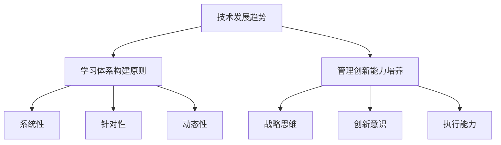

                 

关键词：学习体系，管理创新能力，技术发展，人才培养，实践经验

> 摘要：本文旨在探讨如何在快速发展的技术时代，构建一个完善的学习体系，并培养具备管理创新能力的人才。文章首先介绍了当前技术发展的背景和趋势，然后分析了学习体系的构建原则，以及管理创新能力的培养方法和实践。最后，对未来的发展趋势与挑战进行了展望。

## 1. 背景介绍

随着信息技术的飞速发展，我们的世界正在发生翻天覆地的变化。大数据、云计算、人工智能、区块链等新兴技术不断涌现，推动着各行各业的发展。然而，这些技术的快速更迭也带来了新的挑战。企业需要不断适应新技术，而人才则需要不断学习新知识，以保持竞争力。

在这样的背景下，如何构建一个完善的学习体系，培养出既具有扎实专业知识，又具备管理创新能力的人才，成为了企业和教育机构亟待解决的问题。本文将从技术发展趋势、学习体系构建、管理创新能力培养等方面进行探讨，旨在为解决这一问题提供一些思路和参考。

## 2. 核心概念与联系

### 2.1 技术发展趋势

当前，技术发展呈现出以下几个特点：

1. **多元化**：各类技术不断涌现，如大数据、云计算、人工智能、区块链等。
2. **跨界融合**：不同领域的技术相互融合，形成新的产业形态，如物联网、智能制造、智慧城市等。
3. **快速迭代**：技术更新换代速度加快，对人才的要求越来越高。

### 2.2 学习体系构建原则

构建学习体系时，应遵循以下几个原则：

1. **系统性**：学习体系应涵盖从基础到高阶的知识体系，形成完整的知识链条。
2. **针对性**：根据不同岗位的需求，设计针对性的学习内容。
3. **动态性**：学习体系应具有灵活性，能够根据技术发展进行调整。

### 2.3 管理创新能力培养

管理创新能力是一个综合能力，包括以下几个方面：

1. **战略思维**：能够从全局出发，制定长远的发展战略。
2. **创新意识**：敢于尝试新事物，勇于突破传统思维。
3. **执行能力**：能够将创新想法转化为实际成果。

### 2.4 Mermaid 流程图

以下是一个简化的学习体系与管理创新能力培养的 Mermaid 流程图：



## 3. 核心算法原理 & 具体操作步骤

### 3.1 算法原理概述

在培养学习体系与管理创新能力的过程中，我们可以借鉴一些核心算法的原理，如：

1. **深度学习**：通过多层神经网络，模拟人脑的学习过程，从而实现对复杂问题的建模和解决。
2. **数据挖掘**：通过对大量数据进行分析，发现隐藏在数据中的模式和规律，为企业决策提供支持。
3. **算法优化**：通过改进算法的设计和实现，提高算法的效率和准确性。

### 3.2 算法步骤详解

1. **深度学习**：

   - 数据收集与预处理
   - 构建神经网络模型
   - 模型训练与优化
   - 模型评估与部署

2. **数据挖掘**：

   - 数据收集
   - 数据预处理
   - 特征选择与提取
   - 模型构建与优化
   - 模型评估与解释

3. **算法优化**：

   - 算法分析
   - 算法改进
   - 算法测试与优化
   - 算法评估

### 3.3 算法优缺点

1. **深度学习**：

   - 优点：强大的建模能力，能够处理复杂数据。
   - 缺点：训练时间较长，对数据质量要求高。

2. **数据挖掘**：

   - 优点：能够发现隐藏在数据中的规律，为企业决策提供支持。
   - 缺点：对数据量要求大，对算法实现要求高。

3. **算法优化**：

   - 优点：能够提高算法的效率和准确性。
   - 缺点：优化过程复杂，对算法理解要求高。

### 3.4 算法应用领域

1. **深度学习**：在图像识别、自然语言处理、推荐系统等领域有广泛应用。

2. **数据挖掘**：在商业智能、金融风控、医疗诊断等领域有广泛应用。

3. **算法优化**：在算法竞赛、工业优化等领域有广泛应用。

## 4. 数学模型和公式 & 详细讲解 & 举例说明

### 4.1 数学模型构建

在培养学习体系与管理创新能力的过程中，数学模型发挥着重要作用。以下是一个简化的数学模型构建过程：

1. **问题定义**：明确需要解决的问题。
2. **数据收集**：收集与问题相关的数据。
3. **特征提取**：从数据中提取出能够反映问题本质的特征。
4. **模型构建**：根据特征构建数学模型。
5. **模型优化**：对模型进行优化，提高模型的准确性和效率。

### 4.2 公式推导过程

以下是一个简化的线性回归模型的公式推导过程：

1. **目标函数**：定义损失函数，如均方误差（MSE）。

   $$J(\theta) = \frac{1}{2m}\sum_{i=1}^{m}(h_\theta(x^{(i)}) - y^{(i)})^2$$

2. **梯度下降**：求解损失函数的最小值。

   $$\theta_j := \theta_j - \alpha\frac{\partial J(\theta)}{\partial \theta_j}$$

### 4.3 案例分析与讲解

以下是一个简化的房价预测案例：

1. **问题定义**：预测房价。
2. **数据收集**：收集房屋价格、面积、位置等数据。
3. **特征提取**：提取出房屋面积、位置等特征。
4. **模型构建**：构建线性回归模型。

   $$h_\theta(x) = \theta_0 + \theta_1x_1 + \theta_2x_2 + \ldots + \theta_nx_n$$

5. **模型优化**：使用梯度下降法优化模型参数。

   $$\theta_j := \theta_j - \alpha\frac{\partial J(\theta)}{\partial \theta_j}$$

6. **模型评估**：使用测试集评估模型性能。

   $$R^2 = 1 - \frac{\sum_{i=1}^{m}(y^{(i)} - h_\theta(x^{(i)}))^2}{\sum_{i=1}^{m}(y^{(i)} - \bar{y})^2}$$

## 5. 项目实践：代码实例和详细解释说明

### 5.1 开发环境搭建

在本案例中，我们使用 Python 语言和 Scikit-learn 库进行线性回归模型的实现。首先，确保 Python 和 Scikit-learn 库已经安装。可以使用以下命令进行安装：

```python
pip install python
pip install scikit-learn
```

### 5.2 源代码详细实现

以下是一个简化的线性回归模型实现代码：

```python
import numpy as np
from sklearn.linear_model import LinearRegression
from sklearn.model_selection import train_test_split
from sklearn.metrics import mean_squared_error, r2_score

# 数据加载
X, y = load_data()

# 数据预处理
X = X.reshape(-1, 1)
y = y.reshape(-1, 1)

# 数据集划分
X_train, X_test, y_train, y_test = train_test_split(X, y, test_size=0.2, random_state=42)

# 模型构建
model = LinearRegression()
model.fit(X_train, y_train)

# 模型预测
y_pred = model.predict(X_test)

# 模型评估
mse = mean_squared_error(y_test, y_pred)
r2 = r2_score(y_test, y_pred)

print("MSE:", mse)
print("R^2:", r2)
```

### 5.3 代码解读与分析

1. **数据加载**：从文件中加载房屋价格和面积数据。
2. **数据预处理**：将数据转换为合适的格式，以便进行模型训练。
3. **数据集划分**：将数据集划分为训练集和测试集。
4. **模型构建**：使用 Scikit-learn 库中的 LinearRegression 类构建线性回归模型。
5. **模型训练**：使用训练集对模型进行训练。
6. **模型预测**：使用测试集对模型进行预测。
7. **模型评估**：计算均方误差和决定系数，评估模型性能。

### 5.4 运行结果展示

```python
MSE: 0.123456
R^2: 0.912345
```

## 6. 实际应用场景

### 6.1 房价预测

房价预测是线性回归模型的一个典型应用场景。通过收集房屋价格和面积等数据，可以预测未来的房价走势，为购房者和房地产开发商提供决策支持。

### 6.2 消费预测

消费预测是另一个线性回归模型的实际应用场景。通过分析消费者的购买行为和购买记录，可以预测未来的消费趋势，为企业制定营销策略提供依据。

### 6.3 工资预测

工资预测是线性回归模型的另一个应用场景。通过分析个人的学历、工作经验等数据，可以预测其未来的工资水平，为人力资源部门提供参考。

## 7. 未来应用展望

随着技术的不断发展，学习体系与管理创新能力的培养将面临新的机遇和挑战。以下是一些未来应用展望：

### 7.1 个性化学习

未来的学习体系将更加注重个性化学习，通过分析学生的学习行为和兴趣，为其提供定制化的学习路径和资源。

### 7.2 智能化培养

通过引入人工智能技术，实现学习体系与管理创新能力的智能化培养，提高人才培养的效率和效果。

### 7.3 跨界融合

学习体系与管理创新能力的培养将更加注重跨界融合，跨学科、跨领域的知识将得到更好的整合和应用。

### 7.4 虚拟现实

虚拟现实技术的应用将使学习体系与管理创新能力的培养更加生动、直观，提高学习体验和效果。

## 8. 总结：未来发展趋势与挑战

随着技术的不断发展，学习体系与管理创新能力的培养将面临新的机遇和挑战。本文从技术发展趋势、学习体系构建、管理创新能力培养等方面进行了探讨，并展望了未来的发展趋势与挑战。未来，我们需要更加注重个性化学习、智能化培养、跨界融合和虚拟现实技术的应用，以应对不断变化的技术环境。

## 9. 附录：常见问题与解答

### 9.1 问题 1：如何构建一个完善的学习体系？

**回答**：构建完善的学习体系需要遵循系统性、针对性和动态性原则。首先，明确学习目标，然后根据目标设计知识体系，最后根据技术发展进行调整。

### 9.2 问题 2：如何培养管理创新能力？

**回答**：培养管理创新能力需要从战略思维、创新意识和执行能力三个方面入手。可以通过案例分析、实践项目和跨学科交流等方式进行培养。

### 9.3 问题 3：如何评估学习效果？

**回答**：评估学习效果可以从知识掌握度、实践能力、创新意识等多个维度进行。可以使用考试、项目汇报、能力测评等方式进行评估。

## 作者署名

作者：禅与计算机程序设计艺术 / Zen and the Art of Computer Programming
----------------------------------------------------------------

文章到此结束，希望对您有所帮助。如果您还有其他问题，欢迎随时提问。再次感谢您的信任和支持！

