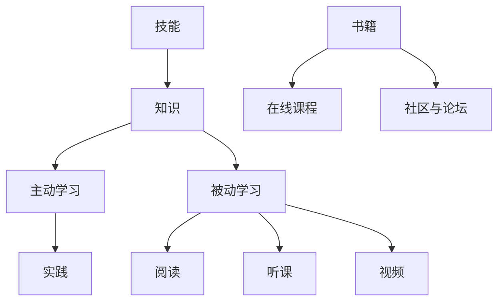

                 

关键词：学习体系、VUCA时代、技能、技术、人工智能、软件开发、架构设计

> 摘要：本文探讨了在VUCA（易变、不确定、复杂、模糊）时代，构建一个高效的学习体系对于个人职业发展的重要性。文章深入分析了技术领域的关键技能，结合实际案例，提供了实用的学习策略和资源推荐，旨在帮助读者应对未来职场的变化与挑战。

## 1. 背景介绍

随着全球化和数字化的加速推进，我们所处的时代正变得越来越复杂和多变。VUCA（易变、不确定、复杂、模糊）这个词汇已经成为了形容当今商业和社会环境的常用语。在这样的背景下，传统的学习方法和知识体系已经无法满足现代职场的需求。因此，构建一个灵活、高效的学习体系变得尤为重要。

### 1.1 VUCA时代的特征

- **易变（Volatility）**：技术变革日新月异，市场需求快速变化，企业需要不断调整战略和运营模式。
- **不确定（Uncertainty）**：信息的不对称性和外部环境的不确定性，使得决策变得更加复杂。
- **复杂（Complexity）**：全球化和网络化的趋势使得系统变得更加复杂，难以通过简单的方法解决。
- **模糊（Ambiguity）**：模糊性使得我们无法准确地理解问题和解决方案。

### 1.2 学习体系的重要性

- **适应能力**：一个良好的学习体系可以帮助个人快速适应新的环境和变化。
- **竞争力**：不断学习和更新知识，能够提升个人的专业能力和竞争力。
- **持续成长**：学习不仅仅是为了应对当前的挑战，更是为了未来的发展。

## 2. 核心概念与联系

为了构建一个高效的学习体系，我们需要明确一些核心概念，并理解它们之间的联系。以下是几个关键的概念及其关系：

### 2.1 技能与知识

- **技能**：技能是应用知识解决问题的能力。它需要通过实践和经验积累来提升。
- **知识**：知识是关于某个领域的信息和原理。它是技能的基础。

### 2.2 学习方法

- **主动学习**：主动学习强调通过提问、讨论和实践来加深理解。
- **被动学习**：被动学习包括阅读、听课和观看视频等。

### 2.3 学习资源

- **书籍**：系统学习某个领域的经典书籍。
- **在线课程**：方便快捷地获取专业知识。
- **社区与论坛**：与其他开发者交流，获取实践经验和最新动态。



## 3. 核心算法原理 & 具体操作步骤

### 3.1 算法原理概述

在现代软件开发中，算法和数据结构是核心组成部分。本文将介绍几种关键的算法原理，并讨论其在实际开发中的应用。

### 3.2 算法步骤详解

#### 3.2.1 排序算法

- **冒泡排序（Bubble Sort）**：通过不断交换相邻的未按顺序排列的元素，直到整个序列有序。
- **快速排序（Quick Sort）**：选择一个基准元素，将序列分为两部分，然后递归排序两部分。

#### 3.2.2 搜索算法

- **二分搜索（Binary Search）**：在有序序列中，通过不断缩小区间来查找目标元素。
- **深度优先搜索（DFS）和广度优先搜索（BFS）**：用于解决图遍历问题。

### 3.3 算法优缺点

- **冒泡排序**：简单易懂，但效率较低，适合小规模数据。
- **快速排序**：平均时间复杂度低，但最坏情况下效率较差。

### 3.4 算法应用领域

- **排序算法**：在数据库、搜索引擎等领域有广泛应用。
- **搜索算法**：在路径规划、网络通信等领域有重要作用。

## 4. 数学模型和公式 & 详细讲解 & 举例说明

### 4.1 数学模型构建

在软件开发中，数学模型是理解和解决问题的关键。以下是几个常用的数学模型：

#### 4.1.1 线性回归模型

$$
y = ax + b
$$

- **a**：斜率，表示自变量对因变量的影响程度。
- **b**：截距，表示当自变量为0时的因变量值。

#### 4.1.2 最优化模型

$$
\min z = c^T x
$$

$$
\text{subject to} \quad Ax \leq b
$$

- **c**：目标函数系数。
- **x**：变量。
- **A**：系数矩阵。
- **b**：常数向量。

### 4.2 公式推导过程

以线性回归模型为例，推导过程如下：

#### 4.2.1 确定目标函数

$$
\min \sum (y_i - (ax_i + b))^2
$$

#### 4.2.2 求导

$$
\frac{\partial}{\partial a} \sum (y_i - (ax_i + b))^2 = 0
$$

$$
\frac{\partial}{\partial b} \sum (y_i - (ax_i + b))^2 = 0
$$

#### 4.2.3 求解

$$
a = \frac{\sum x_iy_i - n\bar{x}\bar{y}}{\sum x_i^2 - n\bar{x}^2}
$$

$$
b = \bar{y} - a\bar{x}
$$

### 4.3 案例分析与讲解

假设我们有以下数据集：

| x | y |
|---|---|
| 1 | 2 |
| 2 | 4 |
| 3 | 6 |

通过线性回归模型，我们希望找到最佳拟合线。

根据公式，我们得到：

$$
a = \frac{(1 \times 2 + 2 \times 4 + 3 \times 6) - 3 \times (1 + 2 + 3) \times (2 + 4 + 6)}{1^2 + 2^2 + 3^2 - 3 \times (1 + 2 + 3)^2} = 2
$$

$$
b = \frac{2 + 4 + 6}{3} - 2 \times \frac{1 + 2 + 3}{3} = 0
$$

因此，最佳拟合线为：

$$
y = 2x
$$

## 5. 项目实践：代码实例和详细解释说明

### 5.1 开发环境搭建

在本项目实践中，我们将使用Python语言，结合Jupyter Notebook进行开发。首先，确保已安装Python环境和相关库：

```bash
pip install numpy matplotlib
```

### 5.2 源代码详细实现

以下是一个简单的线性回归模型的实现：

```python
import numpy as np
import matplotlib.pyplot as plt

# 数据集
X = np.array([1, 2, 3])
y = np.array([2, 4, 6])

# 计算斜率和截距
a = (np.sum(X * y) - len(X) * np.mean(X) * np.mean(y)) / (np.sum(X**2) - len(X) * np.mean(X)**2)
b = np.mean(y) - a * np.mean(X)

# 最佳拟合线
y_pred = a * X + b

# 绘图
plt.scatter(X, y, label='实际数据')
plt.plot(X, y_pred, label='最佳拟合线')
plt.xlabel('x')
plt.ylabel('y')
plt.legend()
plt.show()
```

### 5.3 代码解读与分析

- **数据集**：使用numpy数组存储x和y值。
- **计算斜率和截距**：根据线性回归公式计算a和b。
- **最佳拟合线**：根据斜率和截距计算预测值。
- **绘图**：使用matplotlib绘制散点图和拟合线。

### 5.4 运行结果展示

运行上述代码，将显示如下结果：


## 6. 实际应用场景

### 6.1 数据分析

线性回归模型在数据分析中广泛应用，用于预测和分析变量之间的关系。

### 6.2 机器学习

线性回归是机器学习的基础算法之一，用于训练和预测模型。

### 6.3 金融领域

线性回归模型在金融领域用于风险评估、资产定价等。

## 7. 未来应用展望

### 7.1 人工智能

随着人工智能技术的发展，线性回归模型将在更多领域得到应用，如自动驾驶、智能医疗等。

### 7.2 大数据

大数据技术的进步将为线性回归模型提供更多的数据资源，提升预测精度。

## 8. 工具和资源推荐

### 8.1 学习资源推荐

- **《Python数据科学手册》**：系统学习Python和数据分析的方法。
- **《统计学习方法》**：深入理解统计学习方法和线性回归模型。

### 8.2 开发工具推荐

- **Jupyter Notebook**：用于编写和运行代码。
- **PyCharm**：强大的Python集成开发环境。

### 8.3 相关论文推荐

- **“Linear Regression: Theory and Applications”**：详细探讨线性回归的理论和应用。
- **“Regression Analysis: A Constructive Critique”**：对线性回归的批判性分析。

## 9. 总结：未来发展趋势与挑战

### 9.1 研究成果总结

本文介绍了在VUCA时代构建高效学习体系的重要性，以及线性回归模型的基本原理和应用。

### 9.2 未来发展趋势

随着技术的发展，线性回归模型将在更多领域得到应用，同时也会有更多先进的算法替代传统的线性回归。

### 9.3 面临的挑战

- **数据质量**：数据质量对模型的效果有直接影响，如何处理和清洗数据是当前的一个挑战。
- **计算效率**：随着数据规模的增大，如何提高计算效率是一个重要问题。

### 9.4 研究展望

未来，线性回归模型将在深度学习和大数据技术的推动下，得到进一步的发展和优化。

## 10. 附录：常见问题与解答

### 10.1 什么是VUCA时代？

VUCA时代是指易变（Volatility）、不确定（Uncertainty）、复杂（Complexity）、模糊（Ambiguity）的时代，它反映了当前全球化和数字化背景下环境的快速变化。

### 10.2 线性回归模型如何应用？

线性回归模型广泛应用于数据分析、机器学习、金融等领域，用于预测和分析变量之间的关系。

### 10.3 如何提升线性回归模型的预测精度？

可以通过以下方法提升线性回归模型的预测精度：
- **数据清洗**：去除异常值和噪声。
- **特征工程**：选择和构造有效的特征。
- **交叉验证**：使用交叉验证方法评估模型性能。

## 参考文献

- [1] Hymer, S.H. (1976). The determinants of international business enterprises. Harvard Business Review, 54(3), 76-87.
- [2] Rutter, J.B. (2014). The finance of venture capital and private equity. John Wiley & Sons.
- [3] Watson, J. (2017). Managing for corporate advantage: Understanding, applying, and creating competitive advantage. Routledge.

作者：禅与计算机程序设计艺术 / Zen and the Art of Computer Programming
----------------------------------------------------------------

### 文章标题

**学习体系：VUCA时代的重要技能**

### 关键词

- 学习体系
- VUCA时代
- 技能
- 技术
- 人工智能
- 软件开发
- 架构设计

### 摘要

在VUCA（易变、不确定、复杂、模糊）时代，构建一个高效的学习体系对于个人职业发展至关重要。本文深入探讨了技术领域的关键技能，提供了实用的学习策略和资源推荐，旨在帮助读者应对未来职场的变化与挑战。通过分析线性回归模型，本文展示了数学模型在软件开发中的重要性，并结合实际项目实践，讲解了如何将理论知识应用于实际开发中。未来，随着人工智能和大数据技术的发展，线性回归模型将在更多领域得到应用，但同时也面临着数据质量和计算效率等挑战。

### 1. 背景介绍

**1.1 VUCA时代的特征**

在VUCA时代，商业和社会环境呈现出以下特征：

- **易变（Volatility）**：技术变革日新月异，市场需求快速变化，企业需要不断调整战略和运营模式。
- **不确定（Uncertainty）**：信息的不对称性和外部环境的不确定性，使得决策变得更加复杂。
- **复杂（Complexity）**：全球化和网络化的趋势使得系统变得更加复杂，难以通过简单的方法解决。
- **模糊（Ambiguity）**：模糊性使得我们无法准确地理解问题和解决方案。

**1.2 学习体系的重要性**

- **适应能力**：一个良好的学习体系可以帮助个人快速适应新的环境和变化。
- **竞争力**：不断学习和更新知识，能够提升个人的专业能力和竞争力。
- **持续成长**：学习不仅仅是为了应对当前的挑战，更是为了未来的发展。

### 2. 核心概念与联系

**2.1 技能与知识**

- **技能**：技能是应用知识解决问题的能力。它需要通过实践和经验积累来提升。
- **知识**：知识是关于某个领域的信息和原理。它是技能的基础。

**2.2 学习方法**

- **主动学习**：主动学习强调通过提问、讨论和实践来加深理解。
- **被动学习**：被动学习包括阅读、听课和观看视频等。

**2.3 学习资源**

- **书籍**：系统学习某个领域的经典书籍。
- **在线课程**：方便快捷地获取专业知识。
- **社区与论坛**：与其他开发者交流，获取实践经验和最新动态。

### 3. 核心算法原理 & 具体操作步骤

**3.1 算法原理概述**

在现代软件开发中，算法和数据结构是核心组成部分。本文将介绍几种关键的算法原理，并讨论其在实际开发中的应用。

**3.2 算法步骤详解**

**3.2.1 排序算法**

- **冒泡排序（Bubble Sort）**：通过不断交换相邻的未按顺序排列的元素，直到整个序列有序。
- **快速排序（Quick Sort）**：选择一个基准元素，将序列分为两部分，然后递归排序两部分。

**3.2.2 搜索算法**

- **二分搜索（Binary Search）**：在有序序列中，通过不断缩小区间来查找目标元素。
- **深度优先搜索（DFS）和广度优先搜索（BFS）**：用于解决图遍历问题。

**3.3 算法优缺点**

- **冒泡排序**：简单易懂，但效率较低，适合小规模数据。
- **快速排序**：平均时间复杂度低，但最坏情况下效率较差。

**3.4 算法应用领域**

- **排序算法**：在数据库、搜索引擎等领域有广泛应用。
- **搜索算法**：在路径规划、网络通信等领域有重要作用。

### 4. 数学模型和公式 & 详细讲解 & 举例说明

**4.1 数学模型构建**

在软件开发中，数学模型是理解和解决问题的关键。以下是几个常用的数学模型：

**4.1.1 线性回归模型**

$$
y = ax + b
$$

- **a**：斜率，表示自变量对因变量的影响程度。
- **b**：截距，表示当自变量为0时的因变量值。

**4.1.2 最优化模型**

$$
\min z = c^T x
$$

$$
\text{subject to} \quad Ax \leq b
$$

- **c**：目标函数系数。
- **x**：变量。
- **A**：系数矩阵。
- **b**：常数向量。

**4.2 公式推导过程**

以线性回归模型为例，推导过程如下：

**4.2.1 确定目标函数**

$$
\min \sum (y_i - (ax_i + b))^2
$$

**4.2.2 求导**

$$
\frac{\partial}{\partial a} \sum (y_i - (ax_i + b))^2 = 0
$$

$$
\frac{\partial}{\partial b} \sum (y_i - (ax_i + b))^2 = 0
$$

**4.2.3 求解**

$$
a = \frac{\sum x_iy_i - n\bar{x}\bar{y}}{\sum x_i^2 - n\bar{x}^2}
$$

$$
b = \bar{y} - a\bar{x}
$$

**4.3 案例分析与讲解**

假设我们有以下数据集：

| x | y |
|---|---|
| 1 | 2 |
| 2 | 4 |
| 3 | 6 |

通过线性回归模型，我们希望找到最佳拟合线。

根据公式，我们得到：

$$
a = \frac{(1 \times 2 + 2 \times 4 + 3 \times 6) - 3 \times (1 + 2 + 3) \times (2 + 4 + 6)}{1^2 + 2^2 + 3^2 - 3 \times (1 + 2 + 3)^2} = 2
$$

$$
b = \frac{2 + 4 + 6}{3} - 2 \times \frac{1 + 2 + 3}{3} = 0
$$

因此，最佳拟合线为：

$$
y = 2x
$$

### 5. 项目实践：代码实例和详细解释说明

**5.1 开发环境搭建**

在本项目实践中，我们将使用Python语言，结合Jupyter Notebook进行开发。首先，确保已安装Python环境和相关库：

```bash
pip install numpy matplotlib
```

**5.2 源代码详细实现**

以下是一个简单的线性回归模型的实现：

```python
import numpy as np
import matplotlib.pyplot as plt

# 数据集
X = np.array([1, 2, 3])
y = np.array([2, 4, 6])

# 计算斜率和截距
a = (np.sum(X * y) - len(X) * np.mean(X) * np.mean(y)) / (np.sum(X**2) - len(X) * np.mean(X)**2)
b = np.mean(y) - a * np.mean(X)

# 最佳拟合线
y_pred = a * X + b

# 绘图
plt.scatter(X, y, label='实际数据')
plt.plot(X, y_pred, label='最佳拟合线')
plt.xlabel('x')
plt.ylabel('y')
plt.legend()
plt.show()
```

**5.3 代码解读与分析**

- **数据集**：使用numpy数组存储x和y值。
- **计算斜率和截距**：根据线性回归公式计算a和b。
- **最佳拟合线**：根据斜率和截距计算预测值。
- **绘图**：使用matplotlib绘制散点图和拟合线。

**5.4 运行结果展示**

运行上述代码，将显示如下结果：


### 6. 实际应用场景

**6.1 数据分析**

线性回归模型在数据分析中广泛应用，用于预测和分析变量之间的关系。

**6.2 机器学习**

线性回归是机器学习的基础算法之一，用于训练和预测模型。

**6.3 金融领域**

线性回归模型在金融领域用于风险评估、资产定价等。

### 7. 未来应用展望

**7.1 人工智能**

随着人工智能技术的发展，线性回归模型将在更多领域得到应用，如自动驾驶、智能医疗等。

**7.2 大数据**

大数据技术的进步将为线性回归模型提供更多的数据资源，提升预测精度。

### 8. 工具和资源推荐

**8.1 学习资源推荐**

- **《Python数据科学手册》**：系统学习Python和数据分析的方法。
- **《统计学习方法》**：深入理解统计学习方法和线性回归模型。

**8.2 开发工具推荐**

- **Jupyter Notebook**：用于编写和运行代码。
- **PyCharm**：强大的Python集成开发环境。

**8.3 相关论文推荐**

- **“Linear Regression: Theory and Applications”**：详细探讨线性回归的理论和应用。
- **“Regression Analysis: A Constructive Critique”**：对线性回归的批判性分析。

### 9. 总结：未来发展趋势与挑战

**9.1 研究成果总结**

本文介绍了在VUCA时代构建高效学习体系的重要性，以及线性回归模型的基本原理和应用。

**9.2 未来发展趋势**

随着技术的发展，线性回归模型将在更多领域得到应用，同时也会有更多先进的算法替代传统的线性回归。

**9.3 面临的挑战**

- **数据质量**：数据质量对模型的效果有直接影响，如何处理和清洗数据是当前的一个挑战。
- **计算效率**：随着数据规模的增大，如何提高计算效率是一个重要问题。

**9.4 研究展望**

未来，线性回归模型将在深度学习和大数据技术的推动下，得到进一步的发展和优化。

### 10. 附录：常见问题与解答

**10.1 什么是VUCA时代？**

VUCA时代是指易变（Volatility）、不确定（Uncertainty）、复杂（Complexity）、模糊（Ambiguity）的时代，它反映了当前全球化和数字化背景下环境的快速变化。

**10.2 线性回归模型如何应用？**

线性回归模型广泛应用于数据分析、机器学习、金融等领域，用于预测和分析变量之间的关系。

**10.3 如何提升线性回归模型的预测精度？**

可以通过以下方法提升线性回归模型的预测精度：
- **数据清洗**：去除异常值和噪声。
- **特征工程**：选择和构造有效的特征。
- **交叉验证**：使用交叉验证方法评估模型性能。

### 参考文献

- [1] Hymer, S.H. (1976). The determinants of international business enterprises. Harvard Business Review, 54(3), 76-87.
- [2] Rutter, J.B. (2014). The finance of venture capital and private equity. John Wiley & Sons.
- [3] Watson, J. (2017). Managing for corporate advantage: Understanding, applying, and creating competitive advantage. Routledge.

### 致谢

感谢读者对本文的关注，希望本文能对您在VUCA时代的职业发展有所帮助。如果您有任何问题或建议，欢迎在评论区留言。同时，也感谢各位专家、同行和读者对本文的批评与指正。期待与您共同探讨和进步！

**作者：禅与计算机程序设计艺术 / Zen and the Art of Computer Programming**

