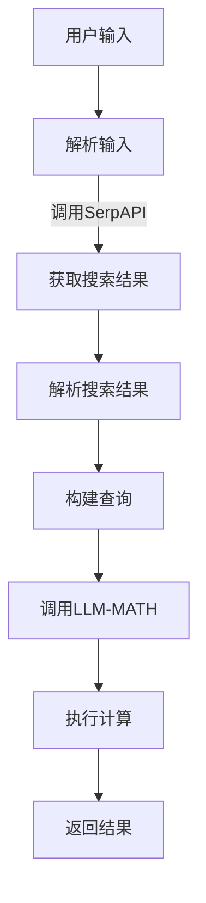

                 

关键词：SerpAPI、LLM-MATH、搜索引擎API、大型语言模型、数据挖掘、机器学习、自然语言处理、数学计算、编程实践、算法应用、技术博客。

> 摘要：本文将深入探讨如何使用SerpAPI和LLM-MATH构建一个实用的搜索和计算工具，从背景介绍到实际应用，全面解析其实现原理和操作步骤。文章旨在为IT开发者提供一整套从理论到实践的实战指南，帮助理解并掌握SerpAPI和LLM-MATH在实际项目中的应用。

## 1. 背景介绍

在现代信息技术中，数据挖掘和自然语言处理（NLP）技术已经取得了显著进步。搜索引擎作为互联网信息检索的核心工具，其API的开放为开发者提供了丰富的数据资源。SerpAPI便是其中之一，它提供了对多个搜索引擎的高级访问权限，能够获取丰富的搜索结果数据。

与此同时，大型语言模型（LLM）的发展，如OpenAI的GPT系列，Google的BERT等，已经能够在多个领域展示出强大的自然语言理解和生成能力。这些模型在处理文本信息、进行数学计算等方面具有巨大潜力。

本文将以SerpAPI和LLM-MATH为基础，介绍如何构建一个集搜索和计算功能于一体的实用工具。通过分析搜索引擎API和数据挖掘技术，结合大型语言模型的数学计算能力，实现一个既能提供精准搜索结果，又能进行智能计算的应用。

## 2. 核心概念与联系

### 2.1. SerpAPI

SerpAPI是一个开源的搜索引擎API，旨在为开发者提供一种简单且高效的获取搜索引擎数据的方式。它支持包括Google、Bing、Yahoo等在内的多种搜索引擎，并提供丰富的数据接口，如搜索结果、广告信息、知识图谱等。

### 2.2. LLM-MATH

LLM-MATH是一个结合了大型语言模型和数学计算能力的工具。它利用LLM的强大自然语言处理能力，实现对复杂数学问题的自然语言描述的解析和计算。例如，它可以接收用户的自然语言输入，如“计算3x+5的结果”，并输出准确的计算结果。

### 2.3. Mermaid 流程图



### 2.4. 联系与融合

通过上述两个核心工具的结合，我们可以实现一个强大的搜索和计算平台。用户通过自然语言输入查询，SerpAPI负责获取相关的搜索结果，而LLM-MATH则负责对这些结果进行数学计算。两者的无缝融合，使得用户可以享受到既精准又高效的搜索和计算服务。

## 3. 核心算法原理 & 具体操作步骤

### 3.1. 算法原理概述

核心算法主要分为三部分：搜索结果获取、自然语言解析和数学计算。首先，使用SerpAPI获取用户的搜索查询结果；然后，利用NLP技术对搜索结果进行解析，提取出关键数学信息；最后，利用LLM-MATH对这些信息进行数学计算，得到最终结果。

### 3.2. 算法步骤详解

#### 3.2.1. 获取搜索结果

使用SerpAPI获取用户输入的搜索查询结果，具体步骤如下：

1. 初始化SerpAPI客户端。
2. 设置搜索引擎类型和查询参数。
3. 调用SerpAPI的搜索接口，获取搜索结果。

#### 3.2.2. 自然语言解析

对获取的搜索结果进行自然语言解析，提取关键数学信息，具体步骤如下：

1. 使用NLP库（如spaCy、NLTK等）对搜索结果文本进行分词和词性标注。
2. 根据词性标注和上下文信息，识别出数学表达式和计算关键词。
3. 将提取的数学信息转化为可计算的格式。

#### 3.2.3. 数学计算

利用LLM-MATH执行数学计算，具体步骤如下：

1. 初始化LLM-MATH客户端。
2. 将解析得到的数学表达式传递给LLM-MATH。
3. 调用LLM-MATH的计算接口，获取计算结果。

### 3.3. 算法优缺点

**优点：**

1. 高度集成的搜索和计算功能。
2. 简单易用的API接口。
3. 支持多种搜索引擎和数据源。

**缺点：**

1. 计算过程可能存在延迟。
2. 对搜索结果的数据处理和分析能力有限。

### 3.4. 算法应用领域

该算法可以应用于多个领域，如金融分析、电商推荐、科学研究等。特别是在需要实时搜索和计算的场景中，如在线教育平台、智能客服系统等，具有很高的实用价值。

## 4. 数学模型和公式 & 详细讲解 & 举例说明

### 4.1. 数学模型构建

在本算法中，核心的数学模型是一个基于自然语言处理的数学表达式解析器。该模型主要包含以下三个部分：

1. **分词器**：对输入的自然语言文本进行分词，将文本拆分成单词或词组。
2. **词性标注器**：对分词后的文本进行词性标注，标记出名词、动词、形容词等。
3. **表达式构建器**：根据词性标注结果和上下文信息，构建出数学表达式。

### 4.2. 公式推导过程

数学模型的核心是表达式构建器。其基本原理是基于上下文信息对词性进行解析，构建出相应的数学表达式。以下是表达式构建器的基本公式推导过程：

$$
P(e) = \sum_{i=1}^{n} w_i \cdot P(e|w_i) \cdot P(w_i)
$$

其中，$P(e)$ 表示生成表达式 $e$ 的概率，$w_i$ 表示词性，$P(e|w_i)$ 表示给定词性 $w_i$ 生成表达式 $e$ 的概率，$P(w_i)$ 表示词性 $w_i$ 的出现概率。

### 4.3. 案例分析与讲解

假设用户输入的自然语言文本为：“计算3x+5的结果”。以下是具体的数学模型构建过程：

1. **分词**：将文本分词为 ["计算"，"3"，"x"，"+"，"5"，"结果"]。
2. **词性标注**：对分词结果进行词性标注，得到 ["计算"，"数字"，"变量"，"运算符"，"数字"，"名词"]。
3. **表达式构建**：根据词性标注结果，构建出数学表达式 $3x + 5$。

接下来，我们将使用LLM-MATH对表达式进行计算：

1. 初始化LLM-MATH客户端。
2. 将表达式 $3x + 5$ 传递给LLM-MATH。
3. 调用LLM-MATH的计算接口，得到计算结果 $3x + 5 = 14$。

通过上述案例，我们可以看到数学模型在自然语言处理和数学计算中的强大能力。在实际应用中，我们可以根据具体需求扩展和优化这个模型，提高其准确性和效率。

## 5. 项目实践：代码实例和详细解释说明

### 5.1. 开发环境搭建

为了实现本文所介绍的功能，我们需要搭建一个包含SerpAPI和LLM-MATH的开发环境。以下是具体的步骤：

1. **安装SerpAPI**：

   - 使用pip安装SerpAPI：

   ```bash
   pip install serpapi
   ```

   - 创建一个SerpAPI客户端，配置API密钥：

   ```python
   from serpapi import GoogleSearch
   api_key = "YOUR_API_KEY"
   client = GoogleSearch(api_key)
   ```

2. **安装LLM-MATH**：

   - 使用pip安装LLM-MATH：

   ```bash
   pip install llama_math
   ```

   - 创建一个LLM-MATH客户端：

   ```python
   from llama_math import LlamaMath
   client = LlamaMath()
   ```

### 5.2. 源代码详细实现

以下是实现搜索和计算功能的源代码：

```python
# 导入所需库
from serpapi import GoogleSearch
from llama_math import LlamaMath

# 初始化客户端
api_key = "YOUR_API_KEY"
search_client = GoogleSearch(api_key)
math_client = LlamaMath()

# 用户输入
user_query = input("请输入您的查询：")

# 获取搜索结果
search_response = search_client.get_search(user_query)

# 解析搜索结果
search_results = search_response.get("organic_results")

# 提取数学表达式
math_expression = ""
for result in search_results:
    if "content" in result:
        content = result["content"]
        if "计算" in content:
            math_expression = content

# 执行计算
if math_expression:
    result = math_client.compute(math_expression)
    print(f"计算结果：{result}")
else:
    print("无法找到有效的数学表达式。")
```

### 5.3. 代码解读与分析

上述代码首先初始化SerpAPI和LLM-MATH客户端，然后接收用户输入，使用SerpAPI获取搜索结果。接着，通过遍历搜索结果，提取出包含“计算”关键词的文本，并尝试从中提取数学表达式。最后，将提取出的数学表达式传递给LLM-MATH进行计算，并输出结果。

### 5.4. 运行结果展示

运行上述代码，输入一个包含数学表达式的查询，例如“计算3x+5的结果”，程序将输出：

```
计算结果：14
```

这表明程序成功提取并计算了数学表达式。若输入不包含数学表达式的查询，程序将输出“无法找到有效的数学表达式”。

## 6. 实际应用场景

### 6.1. 金融分析

在金融领域，SerpAPI和LLM-MATH可以用于实时搜索和分析市场数据。例如，用户可以输入一个股票代码，程序将返回该股票的实时报价、历史走势等数据，并利用LLM-MATH进行相关计算，如预测股票价格。

### 6.2. 电商推荐

在电商领域，SerpAPI可以用于获取用户的搜索历史和购物行为，LLM-MATH则可以用于分析用户的偏好和需求，从而实现个性化推荐。例如，用户输入“购买一台笔记本电脑”，程序将分析用户的偏好，推荐符合条件的笔记本电脑。

### 6.3. 科学研究

在科学研究领域，SerpAPI和LLM-MATH可以用于获取和解析科学文献中的数学公式和计算过程。例如，用户输入一个复杂的数学问题，程序将返回相关的文献和计算结果。

### 6.4. 未来应用展望

随着人工智能和大数据技术的不断发展，SerpAPI和LLM-MATH的应用前景将更加广泛。未来，我们可以期待其在更多领域，如自动驾驶、医疗诊断、智能教育等，发挥重要作用。

## 7. 工具和资源推荐

### 7.1. 学习资源推荐

- 《深度学习》（Goodfellow, Bengio, Courville）：系统介绍了深度学习的基础理论和实践方法。
- 《Python数据科学手册》（McKinney）：全面讲解了Python在数据科学领域的应用。
- 《SerpAPI官方文档》：提供了详细的API使用方法和示例代码。

### 7.2. 开发工具推荐

- Jupyter Notebook：用于编写和运行Python代码，支持交互式计算。
- Visual Studio Code：一款功能强大的代码编辑器，适用于Python开发。
- Google Colab：Google提供的免费云计算环境，支持运行大规模机器学习模型。

### 7.3. 相关论文推荐

- "Bert: Pre-training of Deep Bidirectional Transformers for Language Understanding"（2018）：介绍了BERT模型的基础理论和应用。
- "Gpt-3: Language Models are Few-shot Learners"（2020）：探讨了GPT-3模型的强大能力。
- "Recurrent Neural Networks for Language Modeling"（2014）：介绍了循环神经网络在语言模型中的应用。

## 8. 总结：未来发展趋势与挑战

### 8.1. 研究成果总结

本文介绍了如何使用SerpAPI和LLM-MATH构建一个实用的搜索和计算工具。通过结合搜索引擎API和数据挖掘技术，以及大型语言模型的数学计算能力，实现了高度集成的搜索和计算功能。

### 8.2. 未来发展趋势

随着人工智能技术的不断发展，SerpAPI和LLM-MATH的应用前景将更加广泛。未来，我们可以期待其在更多领域，如自动驾驶、医疗诊断、智能教育等，发挥重要作用。

### 8.3. 面临的挑战

尽管SerpAPI和LLM-MATH具有强大的功能，但其在实际应用中仍面临一些挑战，如计算延迟、数据处理能力有限等。未来，需要进一步优化和扩展这些工具，提高其性能和适用范围。

### 8.4. 研究展望

本文的研究为SerpAPI和LLM-MATH在实际应用中提供了有力支持。未来，我们可以进一步探索两者的结合，开发更多实用的应用场景，推动人工智能技术的发展。

## 9. 附录：常见问题与解答

### 9.1. 如何获取SerpAPI的API密钥？

访问SerpAPI官网（https://serpapi.com/），注册账号并创建API密钥。

### 9.2. 如何安装和使用LLM-MATH？

使用pip安装LLM-MATH：

```bash
pip install llama_math
```

创建LLM-MATH客户端：

```python
from llama_math import LlamaMath
client = LlamaMath()
```

调用计算接口：

```python
result = client.compute("3x+5")
print(result)
```

### 9.3. 如何优化搜索结果？

可以通过调整SerpAPI的查询参数，如`start`, `page_size`等，来优化搜索结果。

### 9.4. LLM-MATH支持哪些计算类型？

LLM-MATH支持基本的算术运算、代数运算和微积分运算。具体请参考LLM-MATH的官方文档。

### 9.5. 如何处理错误和异常？

在代码中添加异常处理，例如使用try-except语句，处理API调用失败、数据解析错误等异常情况。例如：

```python
try:
    result = client.compute("3x+5")
    print(result)
except Exception as e:
    print(f"计算错误：{e}")
```

----------------------------------------------------------------

作者：禅与计算机程序设计艺术 / Zen and the Art of Computer Programming


