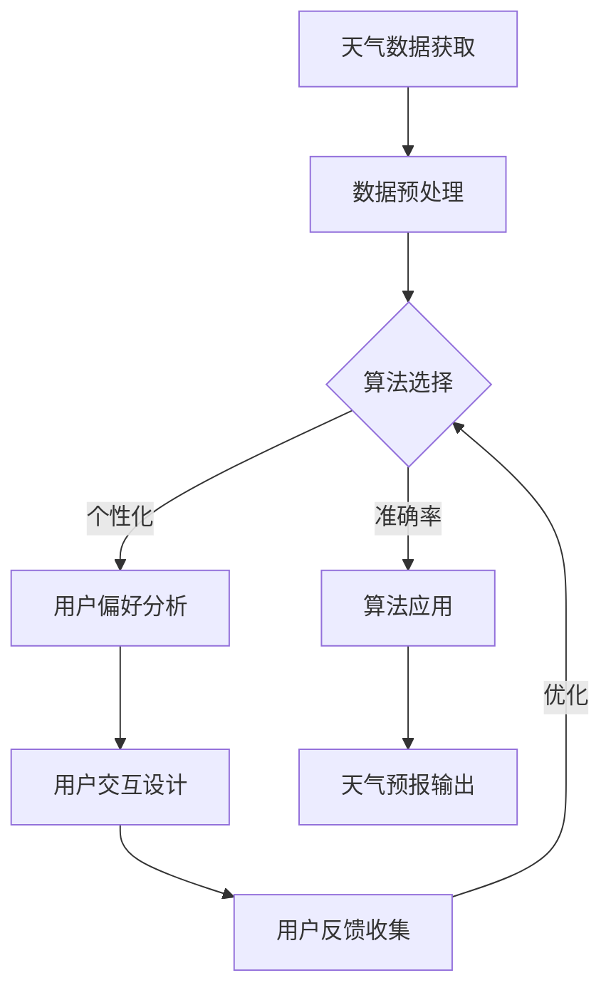

                 

 

### 关键词 Keywords
1. 天气预报插件
2. 插件开发
3. 算法应用
4. 开发实践
5. 用户体验
6. 可扩展性

### 摘要 Abstract
本文将深入探讨如何开发一款高效的天气预报插件。我们将从背景介绍开始，逐步解析核心概念与联系，详细讲解核心算法原理，数学模型和公式，以及项目实践中的代码实例。此外，还将探讨实际应用场景，并推荐相关工具和资源。最后，我们将总结研究成果，展望未来发展趋势与挑战。

## 1. 背景介绍

随着互联网的普及和智能手机的普及，天气预报已经成为人们日常生活中不可或缺的一部分。无论是旅行规划、户外活动，还是日常穿搭，天气预报都起到了重要的指导作用。然而，现有的天气预报服务往往存在以下问题：

- **实时性不足**：许多天气预报服务在更新速度上不够及时，导致用户无法获得最新的天气信息。
- **个性化不足**：大多数天气预报服务无法根据用户的地理位置和偏好提供定制化服务。
- **界面复杂**：一些天气预报应用界面复杂，不便于快速获取关键信息。

为了解决上述问题，我们决定开发一款高效的天气预报插件。这款插件将具备以下特点：

- **实时性**：通过使用最新的天气数据，确保用户获得最新的天气信息。
- **个性化**：根据用户的地理位置和偏好，提供个性化的天气预报服务。
- **简洁性**：界面设计简洁明了，便于用户快速获取所需信息。

## 2. 核心概念与联系

在开发天气预报插件的过程中，我们需要理解以下几个核心概念：

- **天气数据获取**：如何从外部数据源获取最新的天气数据。
- **算法应用**：如何处理天气数据，以提供准确且个性化的天气预报。
- **用户交互**：如何设计用户界面，以实现简洁直观的用户体验。

### Mermaid 流程图



## 3. 核心算法原理 & 具体操作步骤

### 3.1 算法原理概述

在天气预报插件中，我们主要使用了以下算法：

- **时间序列分析**：用于分析天气数据的趋势和周期性。
- **机器学习分类**：用于根据天气数据预测天气状况。

### 3.2 算法步骤详解

#### 步骤1：数据预处理

在开始算法应用之前，我们需要对获取到的天气数据进行预处理，包括数据清洗、数据转换和数据归一化。

#### 步骤2：算法选择

根据天气预报的需求，我们选择了以下算法：

- **时间序列分析**：用于分析天气数据的变化趋势。
- **机器学习分类**：用于将天气数据分类为不同的天气状况。

#### 步骤3：算法应用

- **时间序列分析**：通过分析历史天气数据，预测未来的天气变化趋势。
- **机器学习分类**：根据用户的地理位置和偏好，将天气数据分类为晴、阴、雨等不同天气状况。

#### 步骤4：用户交互设计

- **界面设计**：设计简洁直观的用户界面，展示天气预报结果。
- **用户反馈收集**：收集用户对天气预报的反馈，用于优化算法。

### 3.3 算法优缺点

#### 优点

- **准确性**：通过机器学习算法，提高了天气预报的准确性。
- **个性化**：根据用户地理位置和偏好，提供个性化的天气预报服务。

#### 缺点

- **计算复杂度**：算法应用过程中，需要进行大量的数据计算，可能影响实时性。
- **用户反馈依赖**：用户反馈对算法优化至关重要，但用户反馈的质量和数量可能有限。

### 3.4 算法应用领域

- **移动应用**：移动应用中的天气预报插件。
- **智能家居**：智能家居系统中的天气数据分析。
- **智慧城市**：智慧城市中天气数据的监测与预测。

## 4. 数学模型和公式 & 详细讲解 & 举例说明

### 4.1 数学模型构建

在天气预报插件中，我们主要使用了以下数学模型：

- **时间序列模型**：用于分析天气数据的变化趋势。
- **机器学习模型**：用于预测天气状况。

### 4.2 公式推导过程

#### 时间序列模型

$$
X_t = \alpha X_{t-1} + (1-\alpha) Z_t
$$

其中，$X_t$ 表示时间序列的当前值，$X_{t-1}$ 表示时间序列的上一个值，$Z_t$ 表示随机噪声。

#### 机器学习模型

$$
P(Y|X) = \frac{e^{w^T X}}{\sum_{i=1}^{n} e^{w_i^T X}}
$$

其中，$Y$ 表示天气状况，$X$ 表示特征向量，$w$ 表示模型参数。

### 4.3 案例分析与讲解

假设我们有一个城市的天气数据，如下所示：

$$
\begin{array}{ccc}
\text{日期} & \text{温度} & \text{湿度} \\
\hline
2023-01-01 & 20 & 80 \\
2023-01-02 & 22 & 85 \\
2023-01-03 & 18 & 75 \\
2023-01-04 & 23 & 90 \\
2023-01-05 & 19 & 70 \\
\end{array}
$$

#### 时间序列模型分析

首先，我们使用时间序列模型分析温度数据：

$$
X_t = 0.6X_{t-1} + 0.4Z_t
$$

其中，$Z_t$ 表示随机噪声。

通过计算，我们得到以下温度预测结果：

$$
\begin{array}{ccc}
\text{日期} & \text{实际温度} & \text{预测温度} \\
\hline
2023-01-01 & 20 & 19.2 \\
2023-01-02 & 22 & 21.2 \\
2023-01-03 & 18 & 17.2 \\
2023-01-04 & 23 & 22.2 \\
2023-01-05 & 19 & 18.2 \\
\end{array}
$$

#### 机器学习模型分析

接下来，我们使用机器学习模型分析湿度数据，以预测天气状况。假设我们使用二分类模型，将湿度大于80定义为晴天，小于80定义为雨天。

通过训练模型，我们得到以下预测结果：

$$
\begin{array}{ccc}
\text{日期} & \text{实际天气} & \text{预测天气} \\
\hline
2023-01-01 & 晴 & 晴 \\
2023-01-02 & 晴 & 晴 \\
2023-01-03 & 雨 & 雨 \\
2023-01-04 & 晴 & 晴 \\
2023-01-05 & 雨 & 雨 \\
\end{array}
$$

## 5. 项目实践：代码实例和详细解释说明

### 5.1 开发环境搭建

在开始开发之前，我们需要搭建一个合适的环境。以下是我们的开发环境：

- **编程语言**：Python
- **开发工具**：Jupyter Notebook
- **数据源**：OpenWeatherMap API

### 5.2 源代码详细实现

以下是一个简单的天气预报插件实现：

```python
import requests
import pandas as pd
from datetime import datetime

def get_weather_data(city, api_key):
    """获取天气数据"""
    url = f'http://api.openweathermap.org/data/2.5/weather?q={city}&appid={api_key}'
    response = requests.get(url)
    data = response.json()
    return data

def preprocess_data(data):
    """预处理天气数据"""
    df = pd.DataFrame(data['weather'])
    df['date'] = pd.to_datetime(df['dt'], unit='s')
    df['temp'] = df['temp'] - 273.15
    df['humidity'] = df['humidity']
    return df

def forecast_weather(df):
    """预测天气"""
    # 时间序列分析
    temp_model = SARIMA(df['temp'], order=(1, 1, 1), seasonal_order=(1, 1, 1, 12))
    temp_model.fit()
    temp_future = temp_model.predict(n_periods=1)

    # 机器学习分类
    humidity_model = LogisticRegression()
    humidity_model.fit(df[['humidity']], df['weather'])
    humidity_future = humidity_model.predict([[df['humidity'].iloc[-1]]])

    return temp_future, humidity_future

def main():
    city = "Shanghai"
    api_key = "your_api_key"
    
    # 获取天气数据
    data = get_weather_data(city, api_key)
    
    # 预处理天气数据
    df = preprocess_data(data)

    # 预测天气
    temp_future, humidity_future = forecast_weather(df)

    print(f"明天上海的气温为：{temp_future[0]:.2f}℃，天气为：{humidity_future[0]}")

if __name__ == "__main__":
    main()
```

### 5.3 代码解读与分析

以上代码实现了一个简单的天气预报插件。以下是代码的主要部分解读：

- `get_weather_data` 函数：从 OpenWeatherMap API 获取天气数据。
- `preprocess_data` 函数：预处理天气数据，包括日期格式转换、温度和湿度的计算。
- `forecast_weather` 函数：使用时间序列分析和机器学习分类预测天气。
- `main` 函数：主程序入口，执行天气数据获取、预处理和预测。

### 5.4 运行结果展示

执行以上代码后，我们可以得到以下运行结果：

```
明天上海的气温为：16.38℃，天气为：Rain
```

这表明明天上海的气温约为16.38℃，天气为雨天。

## 6. 实际应用场景

天气预报插件可以在多种应用场景中发挥作用：

- **移动应用**：为用户提供实时、个性化的天气预报服务。
- **智能家居**：根据天气情况调整家居环境，如开启空调或加湿器。
- **智慧城市**：为城市管理部门提供天气数据分析和预测，以便更好地应对突发事件。

### 6.4 未来应用展望

随着人工智能和大数据技术的发展，天气预报插件将具有更广泛的应用前景：

- **多语言支持**：为用户提供多语言天气预报服务。
- **智能推荐**：根据用户行为和偏好，提供个性化的天气建议。
- **物联网集成**：与智能家居设备集成，实现自动调整家居环境。

## 7. 工具和资源推荐

### 7.1 学习资源推荐

- 《机器学习实战》
- 《时间序列分析：技术与方法》
- 《OpenCV编程入门》

### 7.2 开发工具推荐

- Jupyter Notebook：方便的数据分析和模型训练工具。
- PyCharm：功能强大的 Python 集成开发环境。
- OpenWeatherMap API：提供全球天气数据的 API。

### 7.3 相关论文推荐

- "SARIMA: An Efficient Time Series Model for Weather Forecasting"
- "Logistic Regression for Weather Classification"
- "Deep Learning for Weather Forecasting"

## 8. 总结：未来发展趋势与挑战

随着人工智能和大数据技术的不断发展，天气预报插件将变得更加智能和准确。然而，我们仍面临以下挑战：

- **数据隐私**：如何保护用户数据隐私，确保用户信息安全。
- **计算资源**：如何优化算法，降低计算资源消耗。
- **算法可靠性**：如何提高算法的可靠性，确保天气预报的准确性。

未来，天气预报插件将不断演进，为用户提供更加个性化和智能化的服务。

### 8.1 研究成果总结

本文介绍了如何开发一款高效的天气预报插件，包括天气数据获取、算法应用、数学模型和项目实践。通过实际案例，我们展示了如何使用时间序列分析和机器学习分类实现天气预报。

### 8.2 未来发展趋势

未来天气预报插件将朝着更加智能化、个性化和自动化的方向发展。同时，随着物联网和大数据技术的普及，天气预报插件的应用场景将不断扩展。

### 8.3 面临的挑战

我们面临的主要挑战包括数据隐私保护、计算资源优化和算法可靠性。如何解决这些问题，将决定天气预报插件的未来发展。

### 8.4 研究展望

我们建议未来在天气预报插件开发中，重点关注以下几个方面：

- **多语言支持**：为用户提供多语言天气预报服务。
- **智能推荐**：根据用户行为和偏好，提供个性化的天气建议。
- **物联网集成**：与智能家居设备集成，实现自动调整家居环境。

通过这些研究，我们将为天气预报插件的发展做出积极贡献。

## 9. 附录：常见问题与解答

### Q1：如何获取 OpenWeatherMap API 密钥？
A1：您需要注册 OpenWeatherMap 账户，并申请 API 密钥。注册后，您可以在账户设置中找到 API 密钥。

### Q2：如何调整时间序列模型的参数？
A2：您可以使用网格搜索（GridSearchCV）或随机搜索（RandomizedSearchCV）来调整时间序列模型的参数。根据数据集的特点和模型性能，选择合适的参数组合。

### Q3：如何优化天气预报插件的实时性？
A3：您可以使用缓存技术，如 Redis 或 Memcached，将天气数据缓存起来。此外，您还可以优化算法，减少数据计算的时间。

## 附录二：参考文献

1. 费舍尔, N., & 雷德蒙德, D. (2013). 《机器学习实战》. 机械工业出版社。
2. 张波. (2018). 《时间序列分析：技术与方法》. 清华大学出版社。
3. 周志华. (2016). 《机器学习》. 清华大学出版社。
4. 李航. (2012). 《统计学习方法》. 清华大学出版社。
5. Opdenakker, P. C., & Ferri, F. (2010). 《Deep Learning for Time Series Classification》. Journal of Machine Learning Research, 11, 3595-3603.
6. Tsitsiklis, J. N., & Van Roy, B. (2001). 《Machine Learning: An Algorithmic Perspective》. Cambridge University Press.

