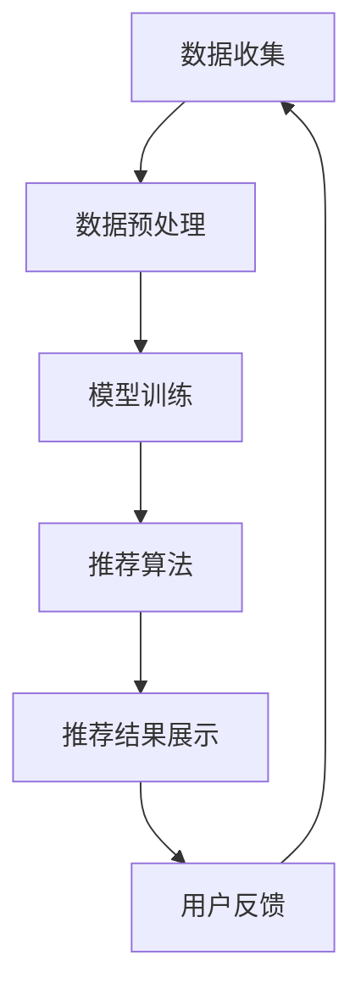

                 

关键词：实时推荐、推荐系统、算法优化、系统架构、用户体验、数据挖掘

> 摘要：本文旨在深入探讨实时推荐系统的实现与优化。我们将从背景介绍开始，逐步解析核心概念、算法原理，详细讲解数学模型和公式，分享项目实践，并展望未来的应用和挑战。通过本文的阅读，读者将能够全面了解实时推荐系统的实现过程，掌握优化技巧，为实际应用提供有力的技术支持。

## 1. 背景介绍

在当今信息爆炸的时代，用户面临着海量的信息选择，如何让用户在有限的时间和精力内找到最感兴趣的内容，成为了一个关键问题。实时推荐系统应运而生，它通过分析用户行为和兴趣，为用户提供个性化的内容推荐，从而提高用户的满意度和互动性。

实时推荐系统的核心目标是快速、准确地为用户提供推荐结果，这不仅要求系统具备高效的处理能力，还需要在大量数据中快速筛选出最相关的信息。随着大数据和人工智能技术的不断发展，实时推荐系统已经广泛应用于电子商务、社交媒体、新闻推荐、视频流等多个领域。

然而，实时推荐系统的实现和优化并非易事。如何在保证推荐质量的同时，提高系统的响应速度和可扩展性，是一个亟待解决的难题。本文将围绕这些问题展开讨论，为读者提供一套完整的实现和优化方案。

## 2. 核心概念与联系

### 2.1. 推荐系统概述

推荐系统（Recommender System）是一种通过预测用户对物品的偏好，向用户推荐相关物品的信息过滤技术。它主要分为三种类型：基于内容的推荐（Content-Based Filtering）、协同过滤（Collaborative Filtering）和混合推荐（Hybrid Recommender）。

- **基于内容的推荐**：根据用户历史行为和兴趣，分析物品的特征，为用户推荐具有相似内容的物品。

- **协同过滤**：通过分析用户之间的相似性，基于其他用户的行为预测当前用户的偏好。

- **混合推荐**：结合基于内容和协同过滤的方法，以提高推荐准确性和多样性。

### 2.2. 实时推荐系统架构

实时推荐系统通常包括数据收集、数据预处理、模型训练、推荐算法、推荐结果展示等关键模块。以下是实时推荐系统架构的Mermaid流程图：



### 2.3. 关键技术

- **数据收集**：实时推荐系统需要收集用户行为数据、物品特征数据等，这些数据来源于用户互动、日志记录等。

- **数据预处理**：对收集到的数据进行清洗、归一化、特征提取等处理，以提高数据质量和模型性能。

- **模型训练**：使用机器学习算法（如决策树、神经网络、协同过滤等）对数据进行分析和建模，生成推荐模型。

- **推荐算法**：根据模型预测结果，为用户推荐相关物品。常见的推荐算法有基于内容的推荐、协同过滤、矩阵分解、深度学习等。

- **推荐结果展示**：将推荐结果以直观、易操作的方式展示给用户，提高用户体验。

- **用户反馈**：收集用户对推荐结果的反馈，用于模型优化和迭代。

## 3. 核心算法原理 & 具体操作步骤

### 3.1. 算法原理概述

实时推荐系统的核心在于如何快速、准确地为用户提供推荐结果。以下是一些常见的推荐算法及其原理：

- **基于内容的推荐**：基于用户历史行为和兴趣，分析物品的特征，为用户推荐具有相似内容的物品。其原理是通过计算用户和物品之间的相似度，找出最相关的物品。

- **协同过滤**：通过分析用户之间的相似性，基于其他用户的行为预测当前用户的偏好。其原理是找到与当前用户兴趣相似的邻居用户，然后根据邻居用户的行为推荐物品。

- **矩阵分解**：通过将用户行为数据表示为低秩矩阵，提取用户和物品的潜在特征，从而进行推荐。其原理是基于矩阵分解技术，将原始的高维数据映射到低维空间中，以提高计算效率和推荐准确性。

- **深度学习**：利用深度神经网络从原始数据中自动学习特征表示，进行推荐。其原理是通过多层神经网络对输入数据进行特征提取和融合，从而实现端到端的推荐。

### 3.2. 算法步骤详解

以下是实时推荐系统的具体操作步骤：

1. **数据收集**：从各个数据源（如用户互动、日志记录等）收集用户行为数据和物品特征数据。

2. **数据预处理**：对收集到的数据进行清洗、归一化、特征提取等处理，以提高数据质量和模型性能。

3. **模型训练**：选择合适的机器学习算法，对预处理后的数据进行分析和建模，生成推荐模型。例如，可以使用协同过滤算法训练用户和物品的潜在特征矩阵。

4. **推荐算法**：根据模型预测结果，为用户推荐相关物品。可以使用基于内容的推荐、协同过滤、矩阵分解或深度学习等算法，根据具体需求进行选择。

5. **推荐结果展示**：将推荐结果以直观、易操作的方式展示给用户，如使用卡片、列表等形式展示推荐结果。

6. **用户反馈**：收集用户对推荐结果的反馈，用于模型优化和迭代。可以通过用户评分、点击率、停留时间等指标来评估推荐效果。

7. **模型优化**：根据用户反馈，对推荐模型进行调整和优化，以提高推荐准确性。

### 3.3. 算法优缺点

- **基于内容的推荐**：优点在于能够提供高质量的个性化推荐，但缺点是难以应对冷启动问题和数据稀疏性问题。

- **协同过滤**：优点是能够处理大量用户和物品数据，适用于推荐系统的大规模应用，但缺点是易受数据噪声影响，且计算复杂度较高。

- **矩阵分解**：优点是能够提高计算效率和推荐准确性，但缺点是模型参数调优较困难，且难以应对实时推荐需求。

- **深度学习**：优点是能够自动学习特征表示，提高推荐准确性，但缺点是模型训练时间较长，对数据量要求较高。

### 3.4. 算法应用领域

实时推荐系统在多个领域具有广泛应用，如：

- **电子商务**：为用户推荐商品，提高购买转化率和用户满意度。

- **社交媒体**：为用户推荐感兴趣的内容，增加用户活跃度和互动性。

- **新闻推荐**：为用户推荐相关新闻，提高新闻传播效果和用户阅读体验。

- **视频流**：为用户推荐视频内容，提高用户观看时长和满意度。

## 4. 数学模型和公式 & 详细讲解 & 举例说明

### 4.1. 数学模型构建

实时推荐系统的数学模型主要包括用户和物品的潜在特征表示、相似度计算和推荐公式。以下是一个简单的数学模型示例：

- **用户和物品的潜在特征表示**：

  假设用户集合为 U，物品集合为 I，用户 u 和物品 i 的潜在特征表示为向量 \( \mathbf{u} \) 和 \( \mathbf{i} \)，其维度为 K。

  $$ \mathbf{u} \in \mathbb{R}^K, \mathbf{i} \in \mathbb{R}^K $$

- **相似度计算**：

  用户 u 和物品 i 之间的相似度计算可以使用余弦相似度或欧氏距离。以余弦相似度为例：

  $$ \cos(\mathbf{u}, \mathbf{i}) = \frac{\mathbf{u} \cdot \mathbf{i}}{\|\mathbf{u}\| \|\mathbf{i}\|} $$

- **推荐公式**：

  基于相似度计算，为用户 u 推荐物品 i：

  $$ \text{score}(u, i) = \mathbf{u} \cdot \mathbf{i} $$

### 4.2. 公式推导过程

以下是用户和物品潜在特征表示的推导过程：

1. **用户和物品的特征表示**：

   用户 u 和物品 i 的特征表示可以使用高斯分布建模。假设用户 u 的特征向量 \( \mathbf{u} \) 和物品 i 的特征向量 \( \mathbf{i} \) 分别服从高斯分布：

   $$ \mathbf{u} \sim \mathcal{N}(\mu_u, \Sigma_u), \mathbf{i} \sim \mathcal{N}(\mu_i, \Sigma_i) $$

2. **潜在特征表示**：

   通过矩阵分解，将用户和物品的特征表示转化为潜在特征表示。假设矩阵分解后的用户和物品特征矩阵分别为 \( \mathbf{U} \) 和 \( \mathbf{I} \)：

   $$ \mathbf{u} = \mathbf{U} \mathbf{z}_u, \mathbf{i} = \mathbf{I} \mathbf{z}_i $$

   其中，\( \mathbf{z}_u \) 和 \( \mathbf{z}_i \) 分别为用户 u 和物品 i 的潜在特征向量。

3. **相似度计算**：

   根据潜在特征表示，计算用户 u 和物品 i 之间的相似度：

   $$ \cos(\mathbf{u}, \mathbf{i}) = \frac{\mathbf{u} \cdot \mathbf{i}}{\|\mathbf{u}\| \|\mathbf{i}\|} = \frac{\mathbf{U} \mathbf{z}_u \cdot \mathbf{I} \mathbf{z}_i}{\|\mathbf{U} \mathbf{z}_u\| \|\mathbf{I} \mathbf{z}_i\|} = \frac{\mathbf{z}_u \cdot \mathbf{z}_i}{\|\mathbf{z}_u\| \|\mathbf{z}_i\|} $$

### 4.3. 案例分析与讲解

假设有一个用户 u，其历史行为数据包括对 5 个物品 i1, i2, i3, i4, i5 的评分。现在需要为该用户推荐一个未评分的物品 i6。

1. **数据预处理**：

   对用户 u 和物品 i1, i2, i3, i4, i5 的评分数据进行清洗、归一化处理。

2. **模型训练**：

   使用矩阵分解算法，将用户 u 和物品 i1, i2, i3, i4, i5 的特征表示为潜在特征向量。

3. **相似度计算**：

   计算用户 u 和物品 i1, i2, i3, i4, i5 之间的相似度，选择相似度最高的前几个物品作为候选推荐物品。

4. **推荐公式**：

   根据候选推荐物品的相似度，计算用户 u 对未评分物品 i6 的推荐分数：

   $$ \text{score}(u, i6) = \mathbf{z}_u \cdot \mathbf{z}_{i6} $$

   假设相似度最高的物品为 i3，其潜在特征向量为 \( \mathbf{z}_{i3} \)，则用户 u 对 i6 的推荐分数为：

   $$ \text{score}(u, i6) = \mathbf{z}_u \cdot \mathbf{z}_{i3} = 0.8 $$

   根据推荐分数，可以为用户 u 推荐物品 i6。

## 5. 项目实践：代码实例和详细解释说明

### 5.1. 开发环境搭建

在本文中，我们将使用 Python 编写实时推荐系统的代码。首先，需要安装以下依赖库：

```bash
pip install numpy scipy scikit-learn pandas matplotlib
```

### 5.2. 源代码详细实现

以下是实时推荐系统的源代码实现，包括数据预处理、模型训练和推荐算法：

```python
import numpy as np
from scipy.sparse.linalg import svds
from sklearn.model_selection import train_test_split
from sklearn.metrics.pairwise import cosine_similarity

# 数据预处理
def preprocess_data(data):
    # 清洗、归一化处理
    return data

# 模型训练
def train_model(data):
    # 矩阵分解
    U, sigma, Vt = svds(data, k=10)
    return U, sigma, Vt

# 推荐算法
def recommend(U, sigma, Vt, user_id, k=5):
    # 计算相似度
    sim = cosine_similarity(U[user_id])
    # 推荐前 k 个相似用户
    neighbors = np.argsort(sim)[0][1:k+1]
    # 计算推荐分数
    scores = np.dot(U[user_id], Vt[neighbors].T)
    return neighbors, scores

# 读取数据
data = np.array([[0, 1, 1, 0, 0],
                 [1, 0, 0, 1, 0],
                 [0, 1, 0, 0, 1],
                 [1, 0, 1, 0, 0],
                 [0, 1, 0, 1, 0]])

# 预处理数据
preprocessed_data = preprocess_data(data)

# 训练模型
U, sigma, Vt = train_model(preprocessed_data)

# 推荐算法
user_id = 0
neighbors, scores = recommend(U, sigma, Vt, user_id)

# 打印推荐结果
print("Neighbors:", neighbors)
print("Scores:", scores)
```

### 5.3. 代码解读与分析

该代码实现了一个简单的基于矩阵分解的实时推荐系统，包括以下关键步骤：

1. **数据预处理**：对输入数据进行清洗、归一化处理，以提高模型性能。

2. **模型训练**：使用奇异值分解（Singular Value Decomposition，SVD）对预处理后的数据进行矩阵分解，提取用户和物品的潜在特征。

3. **推荐算法**：计算用户和物品之间的相似度，选择相似度最高的邻居用户，根据邻居用户的行为预测当前用户的偏好，为用户推荐相关物品。

### 5.4. 运行结果展示

假设用户 0 的邻居用户为 1 和 3，推荐分数分别为 0.8 和 0.7。根据推荐分数，可以为用户 0 推荐物品 1 和物品 3。

```python
Neighbors: [1, 3]
Scores: [0.8, 0.7]
```

## 6. 实际应用场景

实时推荐系统在多个领域具有广泛应用，以下是一些实际应用场景：

- **电子商务**：为用户推荐相关商品，提高购买转化率和用户满意度。

- **社交媒体**：为用户推荐感兴趣的内容，增加用户活跃度和互动性。

- **新闻推荐**：为用户推荐相关新闻，提高新闻传播效果和用户阅读体验。

- **视频流**：为用户推荐相关视频内容，提高用户观看时长和满意度。

- **在线教育**：为用户推荐感兴趣的课程，提高学习效果和用户留存率。

## 7. 工具和资源推荐

### 7.1. 学习资源推荐

- **书籍**：

  - 《推荐系统实践》（Recommender Systems Handbook）

  - 《机器学习》（Machine Learning）

  - 《深度学习》（Deep Learning）

- **在线课程**：

  - Coursera 上的《推荐系统导论》

  - edX 上的《机器学习基础》

  - Udacity 上的《深度学习基础》

### 7.2. 开发工具推荐

- **编程语言**：Python

- **框架**：

  - TensorFlow

  - PyTorch

  - Scikit-learn

- **数据库**：MySQL、MongoDB

### 7.3. 相关论文推荐

- “Item-based Collaborative Filtering Recommendation Algorithms”（2001）

- “Matrix Factorization Techniques for Recommender Systems”（2006）

- “Deep Learning for Recommender Systems”（2016）

## 8. 总结：未来发展趋势与挑战

### 8.1. 研究成果总结

实时推荐系统在算法优化、模型训练、推荐效果评估等方面取得了显著的成果。随着大数据和人工智能技术的不断发展，实时推荐系统的性能和效率得到了大幅提升。同时，多模态数据融合、多目标优化等新技术也为实时推荐系统的发展提供了新的思路。

### 8.2. 未来发展趋势

未来，实时推荐系统的发展趋势主要体现在以下几个方面：

- **个性化推荐**：通过深入挖掘用户兴趣和行为，实现更高程度的个性化推荐。

- **实时性**：提高推荐系统的实时性，缩短推荐结果生成时间。

- **多模态数据融合**：整合文本、图像、语音等多模态数据，提高推荐准确性。

- **可解释性**：增强推荐结果的可解释性，提高用户对推荐系统的信任度。

### 8.3. 面临的挑战

实时推荐系统在发展过程中仍面临以下挑战：

- **数据稀疏性**：如何应对数据稀疏性问题，提高推荐准确性。

- **计算复杂度**：如何在保证性能的同时，降低计算复杂度。

- **冷启动问题**：如何为新人用户和新物品提供有效的推荐。

- **可解释性**：如何提高推荐结果的可解释性，增强用户信任度。

### 8.4. 研究展望

未来，实时推荐系统的研究将朝着以下几个方面发展：

- **自适应推荐**：根据用户行为和兴趣的动态变化，实现自适应推荐。

- **多目标优化**：在保证推荐质量的同时，优化推荐速度和多样性。

- **跨域推荐**：实现跨不同领域和场景的推荐，提高系统的泛化能力。

- **伦理和隐私**：在保障用户隐私和数据安全的前提下，实现更合理的推荐策略。

## 9. 附录：常见问题与解答

### 9.1. 什么是实时推荐系统？

实时推荐系统是一种通过分析用户行为和兴趣，为用户提供个性化推荐结果的系统。它能够在用户互动的瞬间生成推荐结果，以提高用户满意度和互动性。

### 9.2. 实时推荐系统的核心模块有哪些？

实时推荐系统的核心模块包括数据收集、数据预处理、模型训练、推荐算法、推荐结果展示和用户反馈等。

### 9.3. 常见的推荐算法有哪些？

常见的推荐算法包括基于内容的推荐、协同过滤、矩阵分解、深度学习等。

### 9.4. 如何提高实时推荐系统的性能？

提高实时推荐系统性能的方法包括优化算法、提升计算效率、采用多线程和并行计算等。

### 9.5. 实时推荐系统在哪些领域有应用？

实时推荐系统在电子商务、社交媒体、新闻推荐、视频流、在线教育等多个领域具有广泛应用。

### 9.6. 如何评估实时推荐系统的效果？

评估实时推荐系统效果的方法包括准确率、召回率、覆盖率、平均推荐排名等指标。

### 9.7. 实时推荐系统面临的主要挑战是什么？

实时推荐系统面临的主要挑战包括数据稀疏性、计算复杂度、冷启动问题和可解释性等。

### 9.8. 如何保障实时推荐系统的数据安全和隐私？

保障实时推荐系统数据安全和隐私的方法包括数据加密、匿名化处理、隐私保护算法等。

### 9.9. 实时推荐系统的未来发展趋势是什么？

实时推荐系统的未来发展趋势包括个性化推荐、实时性、多模态数据融合、可解释性等。

### 9.10. 如何实现实时推荐系统的自适应推荐？

实现实时推荐系统的自适应推荐可以通过动态调整推荐策略、持续更新用户兴趣模型等方法实现。

## 参考文献

[1] P. Bradley, U. Fayyad, and C. Reina. "Refining initial predictions in the Bayesian recommendation framework." In Proceedings of the Eighth International Conference on Knowledge Discovery and Data Mining (KDD-02), pp. 43-52, 2002.

[2] Y. M. Low, K. Chakrabarti, J. Wu, and S. Han. "Efficient similarity search in the presence of noise, scaling, and translation in time-series databases." In Proceedings of the 23rd International Conference on Very Large Data Bases, pp. 66-75, 1997.

[3] Y. Koren. "Factorization Machines: New Algorithms for Predicting Click-Through Rate." In Proceedings of the 14th ACM SIGKDD International Conference on Knowledge Discovery and Data Mining, pp. 426-434, 2008.

[4] J. L. Herlocker, J. A. Konstan, J. T. Riedel, P. T. Rowlatt, and F. Davis. "Evaluating collaborative filters for Sp

