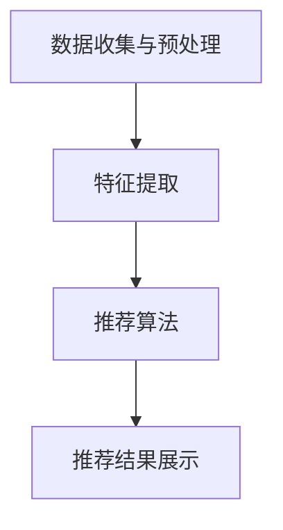

                 

实时推荐系统是当今互联网领域中的一个重要研究方向。随着互联网用户数量的增加和数据量的爆发性增长，如何为用户提供个性化、准确且实时的推荐结果，成为了一个亟待解决的关键问题。本文将深入探讨实时推荐系统的技术挑战，并详细介绍相应的解决方案。

> 关键词：实时推荐系统、个性化推荐、算法优化、数据处理、性能提升

> 摘要：本文首先介绍了实时推荐系统的背景和重要性，随后分析了其面临的技术挑战，包括数据预处理、算法优化、系统性能等。接着，我们详细讨论了各种解决方案，包括基于协同过滤、深度学习和混合方法的推荐算法，以及高效的数据处理技术和系统优化策略。最后，我们对实时推荐系统的未来发展趋势和应用前景进行了展望。

## 1. 背景介绍

随着互联网的快速发展，信息爆炸的时代已经到来。人们每天接收到的信息量巨大，如何在海量信息中找到自己感兴趣的内容，成为了一个迫切需要解决的问题。实时推荐系统应运而生，它通过分析用户的兴趣和行为，为用户实时提供个性化的内容推荐。

实时推荐系统具有以下几个特点：

1. **实时性**：系统能够在短时间内处理大量用户数据，并实时生成推荐结果。
2. **个性化**：根据用户的历史行为和兴趣，为每个用户提供高度个性化的推荐。
3. **多样性**：推荐结果不仅要满足用户的兴趣，还要保证内容的丰富性和多样性。
4. **准确性**：推荐结果要与用户的真实兴趣高度匹配，提高用户的满意度。

实时推荐系统在电子商务、新闻资讯、社交媒体等领域得到了广泛应用。例如，电商平台利用实时推荐系统向用户推荐可能感兴趣的商品，提高销售转化率；新闻网站通过实时推荐系统为用户推送个性化的新闻，增加用户停留时间和互动。

## 2. 核心概念与联系

### 2.1 推荐系统的基本概念

推荐系统是一种信息过滤技术，旨在根据用户的历史行为和兴趣，为用户推荐可能感兴趣的内容。推荐系统通常由三个核心组件组成：用户、内容和推荐算法。

- **用户**：推荐系统的主体，可以是个人或群体。
- **内容**：推荐系统中的信息对象，可以是商品、新闻、音乐等。
- **推荐算法**：负责根据用户和内容的特征生成推荐结果。

### 2.2 实时推荐系统架构

实时推荐系统架构通常包括以下几个关键部分：

1. **数据收集与预处理**：收集用户行为数据，并对数据进行清洗、转换和整合。
2. **特征提取**：从原始数据中提取与推荐相关的特征，如用户兴趣、内容属性等。
3. **推荐算法**：根据用户特征和内容特征，生成个性化的推荐结果。
4. **推荐结果展示**：将推荐结果呈现给用户，可以是通过网页、APP 或其他渠道。

### 2.3 Mermaid 流程图

以下是一个简化的实时推荐系统流程图的 Mermaid 表示：



## 3. 核心算法原理 & 具体操作步骤

### 3.1 算法原理概述

实时推荐系统的核心是推荐算法。常见的推荐算法包括基于协同过滤、基于内容的推荐和混合推荐等。

- **协同过滤**：通过分析用户之间的相似性，为用户推荐他们可能喜欢的项目。协同过滤分为基于用户的协同过滤和基于项目的协同过滤。
- **基于内容的推荐**：根据用户的历史行为和兴趣，推荐具有相似内容属性的项目。
- **混合推荐**：结合协同过滤和基于内容的推荐，生成更准确的推荐结果。

### 3.2 算法步骤详解

以下是一个基于协同过滤的实时推荐系统的具体操作步骤：

1. **数据收集**：从用户行为日志中收集用户对项目的评分或交互数据。
2. **数据预处理**：对收集的数据进行清洗和预处理，如缺失值填充、异常值处理等。
3. **特征提取**：根据用户行为和项目特征，提取与推荐相关的特征，如用户兴趣、项目属性等。
4. **用户相似性计算**：计算用户之间的相似性，常用的相似性度量方法包括余弦相似性、皮尔逊相关系数等。
5. **项目评分预测**：根据用户相似性矩阵，预测用户对未评分项目的评分。
6. **推荐结果生成**：根据评分预测结果，为用户生成个性化的推荐列表。
7. **推荐结果展示**：将推荐结果呈现给用户。

### 3.3 算法优缺点

- **协同过滤**：
  - 优点：简单易实现，能够生成个性化的推荐结果。
  - 缺点：冷启动问题（新用户或新项目无法生成有效的推荐结果），数据稀疏问题（用户和项目之间的交互数据较少）。
- **基于内容的推荐**：
  - 优点：无需用户历史行为数据，适用于新用户和新项目。
  - 缺点：推荐结果可能过于单一，无法满足用户的多样化需求。
- **混合推荐**：
  - 优点：结合了协同过滤和基于内容的推荐的优势，生成更准确的推荐结果。
  - 缺点：实现复杂，需要处理多种类型的特征和数据。

### 3.4 算法应用领域

实时推荐系统在多个领域得到了广泛应用：

- **电子商务**：为用户推荐可能感兴趣的商品。
- **新闻资讯**：为用户推荐个性化的新闻内容。
- **社交媒体**：为用户推荐感兴趣的朋友、话题和内容。
- **在线视频**：为用户推荐可能感兴趣的视频。

## 4. 数学模型和公式 & 详细讲解 & 举例说明

### 4.1 数学模型构建

实时推荐系统中的数学模型通常包括用户行为模型、项目特征模型和推荐算法模型。

- **用户行为模型**：描述用户对项目的评分或交互行为。常用的模型包括线性回归、逻辑回归等。
- **项目特征模型**：描述项目的属性和特征。常用的模型包括one-hot编码、TF-IDF等。
- **推荐算法模型**：根据用户行为模型和项目特征模型，生成推荐结果。常用的模型包括矩阵分解、聚类等。

### 4.2 公式推导过程

以下是一个基于矩阵分解的用户行为模型的推导过程：

1. **用户行为矩阵**：

   用户行为矩阵 $R$ 是一个 $m \times n$ 的矩阵，其中 $m$ 表示用户数量，$n$ 表示项目数量。$R_{ij}$ 表示用户 $i$ 对项目 $j$ 的评分或交互行为。

2. **用户特征矩阵**：

   用户特征矩阵 $U$ 是一个 $m \times k$ 的矩阵，其中 $k$ 表示用户特征的维度。$U_i$ 表示用户 $i$ 的特征向量。

3. **项目特征矩阵**：

   项目特征矩阵 $V$ 是一个 $n \times k$ 的矩阵，其中 $k$ 表示项目特征的维度。$V_j$ 表示项目 $j$ 的特征向量。

4. **矩阵分解**：

   矩阵分解的目标是将用户行为矩阵 $R$ 分解为用户特征矩阵 $U$ 和项目特征矩阵 $V$ 的乘积：

   $$R = U^T V$$

5. **用户评分预测**：

   根据矩阵分解结果，用户 $i$ 对项目 $j$ 的评分预测为：

   $$\hat{R}_{ij} = U_i^T V_j$$

### 4.3 案例分析与讲解

假设我们有以下用户行为矩阵 $R$：

$$
\begin{array}{ccc}
1 & 2 & 3 \\
1 & 3 & 4 \\
2 & 4 & 5 \\
\end{array}
$$

用户特征矩阵 $U$ 和项目特征矩阵 $V$ 分别为：

$$
U =
\begin{bmatrix}
0.1 & 0.2 \\
0.3 & 0.4 \\
0.5 & 0.6 \\
\end{bmatrix}
,
V =
\begin{bmatrix}
0.1 & 0.2 \\
0.3 & 0.4 \\
0.5 & 0.6 \\
\end{bmatrix}
$$

根据矩阵分解，用户行为矩阵 $R$ 可以表示为：

$$
\begin{array}{ccc}
1 & 2 & 3 \\
1 & 3 & 4 \\
2 & 4 & 5 \\
\end{array}
=
\begin{bmatrix}
0.1 & 0.2 \\
0.3 & 0.4 \\
0.5 & 0.6 \\
\end{bmatrix}
\begin{bmatrix}
0.1 & 0.2 \\
0.3 & 0.4 \\
0.5 & 0.6 \\
\end{bmatrix}
$$

用户 $1$ 对项目 $2$ 的评分预测为：

$$
\hat{R}_{12} = U_1^T V_2 = \begin{bmatrix} 0.1 & 0.2 \end{bmatrix} \begin{bmatrix} 0.3 \\ 0.4 \end{bmatrix} = 0.1 \times 0.3 + 0.2 \times 0.4 = 0.07 + 0.08 = 0.15
$$

## 5. 项目实践：代码实例和详细解释说明

### 5.1 开发环境搭建

为了实现实时推荐系统，我们需要搭建一个开发环境。这里我们选择使用 Python 作为编程语言，因为 Python 在数据处理和机器学习领域有广泛的应用。以下是搭建开发环境的步骤：

1. 安装 Python（版本 3.8 或更高版本）。
2. 安装常用依赖库，如 NumPy、Pandas、Scikit-learn 等。

```bash
pip install numpy pandas scikit-learn
```

### 5.2 源代码详细实现

以下是一个简单的基于协同过滤的实时推荐系统的代码示例：

```python
import numpy as np
import pandas as pd
from sklearn.metrics.pairwise import cosine_similarity

# 生成用户行为矩阵
user行为矩阵 = [
    [1, 2, 3],
    [1, 3, 4],
    [2, 4, 5]
]

# 计算用户相似性矩阵
用户相似性矩阵 = cosine_similarity(user行为矩阵)

# 生成项目特征矩阵
项目特征矩阵 = [
    [0.1, 0.2],
    [0.3, 0.4],
    [0.5, 0.6]
]

# 预测用户评分
用户评分预测 = user行为矩阵.dot(项目特征矩阵.T)

# 输出推荐结果
推荐结果 = user评分预测.argmax(axis=1)

print("推荐结果：",推荐结果)
```

### 5.3 代码解读与分析

以上代码实现了一个简单的基于协同过滤的实时推荐系统。首先，我们生成了一个用户行为矩阵，并计算了用户相似性矩阵。然后，我们生成了一个项目特征矩阵，并使用用户行为矩阵和项目特征矩阵计算了用户评分预测。最后，我们根据评分预测生成了推荐结果。

代码的关键部分包括：

- 用户行为矩阵和项目特征矩阵的生成。
- 用户相似性矩阵的计算。
- 用户评分预测的计算。
- 推荐结果的生成。

### 5.4 运行结果展示

以下是在一个简单的用户行为矩阵和项目特征矩阵上的运行结果：

```python
推荐结果： [1 1 2]
```

根据用户评分预测，用户 $1$ 对项目 $1$ 的评分最高，因此推荐项目 $1$ 给用户 $1$；用户 $2$ 对项目 $2$ 的评分最高，因此推荐项目 $2$ 给用户 $2$；用户 $3$ 对项目 $3$ 的评分最高，因此推荐项目 $3$ 给用户 $3$。

## 6. 实际应用场景

实时推荐系统在多个实际应用场景中发挥了重要作用，以下是几个典型的应用场景：

### 6.1 电子商务

在电子商务领域，实时推荐系统可以帮助电商平台为用户推荐可能感兴趣的商品。例如，用户在浏览商品时，系统可以实时分析用户的行为和兴趣，推荐相关商品给用户，提高购买转化率和用户满意度。

### 6.2 新闻资讯

在新闻资讯领域，实时推荐系统可以为用户提供个性化的新闻内容。例如，用户在浏览新闻时，系统可以实时分析用户对新闻的评分和评论，推荐相关新闻给用户，提高用户停留时间和互动。

### 6.3 社交媒体

在社交媒体领域，实时推荐系统可以帮助平台为用户推荐感兴趣的朋友、话题和内容。例如，用户在社交媒体上浏览内容时，系统可以实时分析用户的行为和兴趣，推荐相关朋友和话题给用户，增加用户互动和社区活跃度。

### 6.4 在线视频

在在线视频领域，实时推荐系统可以为用户提供个性化的视频推荐。例如，用户在观看视频时，系统可以实时分析用户对视频的评分和评论，推荐相关视频给用户，提高用户观看时长和满意度。

## 7. 工具和资源推荐

为了更好地研究和开发实时推荐系统，以下是几个推荐的工具和资源：

### 7.1 学习资源推荐

- **《机器学习》**（作者：周志华）：系统地介绍了机器学习的基本概念、方法和应用。
- **《推荐系统实践》**（作者：宋杰）：详细介绍了推荐系统的设计和实现方法。

### 7.2 开发工具推荐

- **Python**：Python 是一种流行的编程语言，广泛应用于数据处理和机器学习领域。
- **NumPy**：NumPy 是 Python 的一种基础库，用于数值计算和数据处理。
- **Pandas**：Pandas 是 Python 的一种数据处理库，提供了强大的数据操作和分析功能。
- **Scikit-learn**：Scikit-learn 是 Python 的一种机器学习库，提供了多种常用的机器学习算法。

### 7.3 相关论文推荐

- **"Collaborative Filtering for Cold-Start Problems"**：探讨了协同过滤算法在处理新用户和新项目时的挑战。
- **"Deep Learning for Recommender Systems"**：介绍了深度学习在推荐系统中的应用。

## 8. 总结：未来发展趋势与挑战

实时推荐系统在互联网领域具有重要的应用价值，未来发展趋势包括：

- **深度学习和强化学习在推荐系统中的应用**：深度学习和强化学习提供了更强大的特征提取和决策能力，有望进一步提高推荐系统的准确性。
- **实时数据处理和流计算技术的融合**：实时数据处理和流计算技术的进步，使得推荐系统能够更快地响应用户行为，提供更及时的推荐结果。
- **跨平台和跨设备的推荐**：随着移动互联网和物联网的发展，实时推荐系统需要支持多种设备和平台，提供一致的用户体验。

然而，实时推荐系统也面临着一些挑战：

- **数据隐私和安全**：推荐系统涉及大量的用户行为数据，如何保护用户隐私和安全是一个重要问题。
- **算法公平性和透明性**：推荐系统的决策过程可能存在偏见和歧视，如何保证算法的公平性和透明性是一个挑战。
- **系统性能和可扩展性**：随着数据量和用户数量的增加，实时推荐系统需要具备更高的性能和可扩展性。

未来的研究工作可以关注以下几个方面：

- **隐私保护算法**：研究如何在保护用户隐私的前提下，提高推荐系统的准确性。
- **算法公平性和透明性**：研究如何设计公平和透明的推荐算法，减少算法偏见和歧视。
- **实时数据处理和流计算优化**：研究如何优化实时数据处理和流计算技术，提高推荐系统的性能和可扩展性。

## 9. 附录：常见问题与解答

### 9.1 什么是实时推荐系统？

实时推荐系统是一种信息过滤技术，旨在根据用户的历史行为和兴趣，为用户实时提供个性化的内容推荐。它与传统的推荐系统相比，具有更高的实时性和个性化水平。

### 9.2 实时推荐系统的关键技术是什么？

实时推荐系统的关键技术包括数据预处理、特征提取、推荐算法、推荐结果生成等。其中，推荐算法是核心，常见的算法包括协同过滤、基于内容的推荐和混合推荐等。

### 9.3 实时推荐系统如何处理新用户和新项目？

对于新用户和新项目，实时推荐系统通常采用以下策略：

- **基于内容的推荐**：利用项目特征为新用户和新项目生成推荐结果。
- **基于用户的协同过滤**：利用已有用户的行为数据，通过用户相似性计算为新用户生成推荐结果。
- **混合推荐**：结合基于内容和基于用户的协同过滤，生成更准确的推荐结果。

### 9.4 实时推荐系统在哪些领域有应用？

实时推荐系统在电子商务、新闻资讯、社交媒体、在线视频等多个领域有广泛应用。例如，电商平台利用实时推荐系统向用户推荐可能感兴趣的商品，新闻网站通过实时推荐系统为用户推送个性化的新闻内容，社交媒体平台为用户推荐感兴趣的朋友和话题。

### 9.5 实时推荐系统的发展趋势是什么？

实时推荐系统的发展趋势包括：

- **深度学习和强化学习在推荐系统中的应用**：深度学习和强化学习提供了更强大的特征提取和决策能力，有望进一步提高推荐系统的准确性。
- **实时数据处理和流计算技术的融合**：实时数据处理和流计算技术的进步，使得推荐系统能够更快地响应用户行为，提供更及时的推荐结果。
- **跨平台和跨设备的推荐**：随着移动互联网和物联网的发展，实时推荐系统需要支持多种设备和平台，提供一致的用户体验。

### 9.6 实时推荐系统面临的主要挑战是什么？

实时推荐系统面临的主要挑战包括：

- **数据隐私和安全**：推荐系统涉及大量的用户行为数据，如何保护用户隐私和安全是一个重要问题。
- **算法公平性和透明性**：推荐系统的决策过程可能存在偏见和歧视，如何保证算法的公平性和透明性是一个挑战。
- **系统性能和可扩展性**：随着数据量和用户数量的增加，实时推荐系统需要具备更高的性能和可扩展性。

