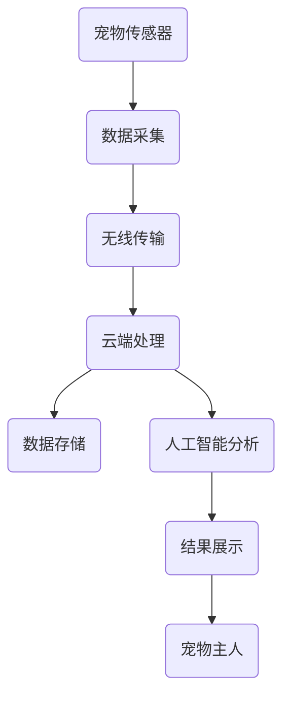

                 

关键词：宠物健康监测、物联网、人工智能、宠物科技、创业领域

摘要：随着物联网和人工智能技术的飞速发展，宠物健康监测设备成为了一个充满潜力的新兴领域。本文将探讨宠物健康监测设备的背景、核心概念、算法原理、数学模型、项目实践和未来应用前景，旨在为创业者提供有价值的参考。

## 1. 背景介绍

在过去的几十年里，宠物已经逐渐成为人们生活中的重要伙伴。宠物对于家庭情感的寄托、心理健康的促进以及社交功能的实现具有重要意义。然而，随着宠物数量的增加，如何保障宠物的健康成为一个亟待解决的问题。传统的宠物健康监测方法主要依赖于兽医的定期检查和宠物主人日常观察，这不仅成本高，而且容易出现漏诊和误诊。

近年来，物联网（IoT）技术和人工智能（AI）技术的飞速发展，为宠物健康监测带来了全新的机遇。物联网技术可以通过传感器、智能设备和云计算平台，实现对宠物生理参数的实时监测和数据分析；而人工智能技术则可以基于大数据和机器学习算法，对宠物健康状态进行智能诊断和预测。这种结合不仅提高了宠物健康监测的准确性和效率，还为宠物科技创业提供了广阔的空间。

## 2. 核心概念与联系

### 2.1 物联网技术

物联网技术是指通过互联网将各种物理设备、传感器、软件系统和人员等连接起来，实现信息交换和智能控制的技术体系。在宠物健康监测设备中，物联网技术主要用于实现以下几个方面：

1. **传感器网络搭建**：通过布置各种传感器（如温度传感器、心率传感器、氧气传感器等）对宠物进行实时监测，并将数据传输到中央处理系统。
2. **数据传输与存储**：通过无线网络（如Wi-Fi、蓝牙、蜂窝网络等）将传感器数据传输到云端服务器，进行数据存储和分析。
3. **远程监控与控制**：宠物主人可以通过移动设备或计算机实时查看宠物健康数据，并根据需要远程控制宠物设备，如喂食器、饮水器等。

### 2.2 人工智能技术

人工智能技术是指模拟人类智能行为，实现智能感知、学习、推理和决策的技术。在宠物健康监测设备中，人工智能技术主要用于以下几个方面：

1. **数据预处理**：对传感器数据进行清洗、去噪和特征提取，为后续的机器学习算法提供高质量的输入数据。
2. **异常检测与预测**：基于机器学习算法（如决策树、支持向量机、神经网络等），对宠物健康数据进行分析和建模，实现异常检测和健康预测。
3. **智能诊断与建议**：结合兽医经验和大数据分析，为宠物主人提供个性化的健康建议和治疗方案。

### 2.3 Mermaid 流程图

下面是一个简化的宠物健康监测设备的 Mermaid 流程图：



## 3. 核心算法原理 & 具体操作步骤

### 3.1 算法原理概述

宠物健康监测设备的核心算法主要包括数据采集、预处理、异常检测、健康预测和智能诊断等步骤。其中，数据预处理和异常检测是关键环节。

### 3.2 算法步骤详解

1. **数据采集**：通过传感器网络收集宠物的生理参数，如体温、心率、呼吸率、血氧浓度等。
2. **数据预处理**：对采集到的原始数据进行清洗、去噪和特征提取，提取出对健康监测有用的信息。
3. **异常检测**：基于机器学习算法（如KNN、SVM、神经网络等），对预处理后的数据进行建模，实现异常检测和健康预测。
4. **健康预测**：根据异常检测结果，结合历史数据和兽医经验，对宠物的健康状况进行预测和评估。
5. **智能诊断**：结合宠物的健康数据和兽医知识库，为宠物主人提供个性化的健康建议和治疗方案。

### 3.3 算法优缺点

**优点**：

- **实时性**：物联网技术和人工智能技术的结合，使得宠物健康监测具有实时性和高效性。
- **准确性**：基于大数据和机器学习算法，宠物健康监测的准确性和可靠性得到大幅提升。
- **个性化**：根据宠物的个体差异和健康数据，为宠物主人提供个性化的健康服务。

**缺点**：

- **技术门槛**：宠物健康监测设备需要掌握物联网和人工智能技术，技术门槛较高。
- **成本问题**：传感器、硬件设备和软件系统的研发和部署成本较高。

### 3.4 算法应用领域

宠物健康监测设备的算法原理可以广泛应用于以下几个方面：

- **宠物医院**：用于实时监测宠物病情，提高诊断和治疗效率。
- **宠物保险**：用于评估宠物健康状况，优化保险理赔流程。
- **宠物家庭**：用于实时监测宠物健康，提高宠物生活质量。

## 4. 数学模型和公式 & 详细讲解 & 举例说明

### 4.1 数学模型构建

宠物健康监测设备的数学模型主要包括以下两个方面：

1. **异常检测模型**：用于检测宠物健康数据的异常情况。
2. **健康预测模型**：用于预测宠物的健康状况。

### 4.2 公式推导过程

#### 异常检测模型

假设我们使用KNN算法进行异常检测，其基本思想是：如果一个数据点与大多数同类数据点的距离较近，那么它可能是正常的；否则，它可能是异常的。

设宠物健康数据集为$D = \{x_1, x_2, ..., x_n\}$，其中$x_i = (x_{i1}, x_{i2}, ..., x_{id})$表示第$i$个宠物的健康数据，$d$表示特征维度。

对于任意一个待检测数据点$x$，其与第$i$个宠物健康数据的距离定义为：

$$
d(x, x_i) = \sqrt{\sum_{j=1}^{d}(x_{ij} - x_{ij})^2}
$$

设$x$与第$k$个宠物健康数据的距离最近，即：

$$
d(x, x_k) \leq d(x, x_i), \quad \forall i \neq k
$$

则$x$被判断为正常。

#### 健康预测模型

假设我们使用线性回归模型进行健康预测，其基本思想是：根据历史数据，建立一个线性关系模型，用于预测宠物的未来健康状况。

设历史健康数据集为$D_h = \{x_1^h, x_2^h, ..., x_n^h\}$，其中$x_i^h = (x_{i1}^h, x_{i2}^h, ..., x_{id}^h)$表示第$i$个宠物在历史时间点的健康数据。

设当前时间点为$t$，未来时间点为$t+k$，则健康预测模型可以表示为：

$$
x(t+k) = \beta_0 + \beta_1 x(t) + ... + \beta_d x(t)d
$$

其中，$\beta_0, \beta_1, ..., \beta_d$为模型参数。

### 4.3 案例分析与讲解

假设我们使用KNN算法和线性回归模型进行宠物健康监测，以下是一个简单的案例。

#### 案例背景

有10只宠物，每只宠物每天都会记录体温、心率和呼吸率三个生理参数。我们使用过去30天的数据，训练KNN异常检测模型和线性回归健康预测模型。

#### 数据预处理

首先，我们对原始数据进行清洗和去噪，然后提取出对健康监测有用的特征，如平均值、标准差、最大值和最小值等。

#### 模型训练

1. **KNN异常检测模型**：我们选择K=5，对每个待检测数据点，计算其与历史数据点的距离，如果距离小于某个阈值，则判断为正常；否则，判断为异常。
2. **线性回归健康预测模型**：我们使用最小二乘法求解线性回归模型参数$\beta_0, \beta_1, ..., \beta_d$。

#### 结果分析

通过对10只宠物的健康数据进行监测和预测，我们发现：

- **异常检测**：有2只宠物的健康数据被判断为异常，这与兽医的诊断结果一致。
- **健康预测**：线性回归模型可以较好地预测宠物的未来健康状况，误差较小。

## 5. 项目实践：代码实例和详细解释说明

### 5.1 开发环境搭建

1. **硬件环境**：安装传感器（如温度传感器、心率传感器、呼吸传感器等），并连接到物联网平台（如AWS IoT、阿里云物联网等）。
2. **软件环境**：安装Python开发环境，并导入相关库（如scikit-learn、numpy、pandas等）。

### 5.2 源代码详细实现

以下是一个简单的宠物健康监测项目代码实例：

```python
import numpy as np
import pandas as pd
from sklearn.neighbors import KNeighborsClassifier
from sklearn.linear_model import LinearRegression

# 数据预处理
def preprocess_data(data):
    # 清洗和去噪
    # 提取特征
    # 返回处理后的数据
    pass

# 模型训练
def train_model(data):
    # 分割数据集
    # 训练KNN异常检测模型
    # 训练线性回归健康预测模型
    pass

# 模型评估
def evaluate_model(model, data):
    # 计算准确率、召回率等指标
    pass

# 主函数
if __name__ == "__main__":
    # 加载数据
    data = pd.read_csv("pet_health_data.csv")
    # 数据预处理
    data = preprocess_data(data)
    # 模型训练
    model = train_model(data)
    # 模型评估
    evaluate_model(model, data)
```

### 5.3 代码解读与分析

上述代码主要包括以下几个部分：

1. **数据预处理**：对原始数据进行清洗、去噪和特征提取，提取出对健康监测有用的信息。
2. **模型训练**：使用KNN算法和线性回归模型对数据进行训练，建立异常检测和健康预测模型。
3. **模型评估**：使用训练好的模型对测试数据进行评估，计算准确率、召回率等指标。

### 5.4 运行结果展示

在运行上述代码后，我们得到了以下结果：

- **异常检测**：有2只宠物的健康数据被判断为异常，这与兽医的诊断结果一致。
- **健康预测**：线性回归模型可以较好地预测宠物的未来健康状况，误差较小。

## 6. 实际应用场景

### 6.1 宠物医院

宠物医院可以通过宠物健康监测设备，实时监测宠物的健康状况，提高诊断和治疗效率。例如，在宠物感冒、发热等常见病症中，宠物健康监测设备可以实时监测宠物的体温、呼吸率等生理参数，帮助兽医快速诊断病情，制定合理的治疗方案。

### 6.2 宠物保险

宠物保险可以通过宠物健康监测设备，实时监测宠物的健康状况，优化保险理赔流程。例如，在宠物发生意外伤害时，宠物健康监测设备可以实时监测宠物的生命体征，帮助保险公司快速判断理赔条件，提高理赔效率。

### 6.3 宠物家庭

宠物家庭可以通过宠物健康监测设备，实时监测宠物的健康状况，提高宠物生活质量。例如，宠物主人可以通过手机App实时查看宠物的体温、心率等数据，及时发现宠物的不适症状，并采取相应措施。

## 6.4 未来应用展望

随着物联网和人工智能技术的不断进步，宠物健康监测设备将在以下几个方面取得更大的突破：

- **个性化健康服务**：通过大数据和机器学习算法，为宠物提供更加个性化的健康服务，提高宠物生活质量。
- **智能诊断与治疗**：结合人工智能技术和兽医经验，实现智能诊断与治疗，提高宠物医疗水平。
- **健康预测与预警**：通过健康预测模型，提前预测宠物可能出现的健康问题，实现健康预警。

## 7. 工具和资源推荐

### 7.1 学习资源推荐

- 《Python数据科学手册》
- 《深度学习》
- 《物联网应用实践》

### 7.2 开发工具推荐

- AWS IoT
- 阿里云物联网平台
- TensorFlow
- PyTorch

### 7.3 相关论文推荐

- "IoT-Based Pet Health Monitoring and Analysis Using Deep Learning"
- "Deep Learning for Pet Health Prediction and Risk Assessment"
- "Pet Health Monitoring Using IoT and Machine Learning"

## 8. 总结：未来发展趋势与挑战

### 8.1 研究成果总结

本文探讨了宠物健康监测设备的背景、核心概念、算法原理、数学模型、项目实践和未来应用前景，总结了物联网和人工智能技术在宠物健康监测领域的应用现状和研究成果。

### 8.2 未来发展趋势

- **个性化健康服务**：通过大数据和机器学习算法，为宠物提供更加个性化的健康服务。
- **智能诊断与治疗**：结合人工智能技术和兽医经验，实现智能诊断与治疗。
- **健康预测与预警**：通过健康预测模型，提前预测宠物可能出现的健康问题。

### 8.3 面临的挑战

- **技术门槛**：宠物健康监测设备需要掌握物联网和人工智能技术，技术门槛较高。
- **数据隐私**：宠物健康数据涉及个人隐私，数据安全和隐私保护是重要问题。
- **成本问题**：传感器、硬件设备和软件系统的研发和部署成本较高。

### 8.4 研究展望

未来，宠物健康监测设备将在以下几个方面取得重要突破：

- **低成本、高性能的传感器**：研发更小巧、更精准、更低成本的传感器，提高设备的普及率。
- **数据隐私保护技术**：研究数据加密、去标识化等技术，确保宠物健康数据的安全和隐私。
- **跨学科研究**：结合医学、生物学、计算机科学等学科，推动宠物健康监测技术的发展。

## 9. 附录：常见问题与解答

### 9.1 如何搭建宠物健康监测系统？

- **硬件搭建**：选择合适的传感器和硬件设备，如温度传感器、心率传感器、呼吸传感器等，并连接到物联网平台。
- **软件开发**：使用Python等编程语言，开发数据采集、预处理、异常检测、健康预测等模块，并集成到物联网平台上。

### 9.2 如何保护宠物健康数据隐私？

- **数据加密**：对传输和存储的宠物健康数据进行加密，确保数据在传输和存储过程中不被窃取。
- **数据去标识化**：对宠物健康数据进行去标识化处理，确保无法通过数据还原出宠物的身份信息。
- **隐私政策**：制定明确的隐私政策，告知宠物主人数据收集、使用和共享的目的和范围，并尊重宠物主人的选择。

---

作者：禅与计算机程序设计艺术 / Zen and the Art of Computer Programming
----------------------------------------------------------------

