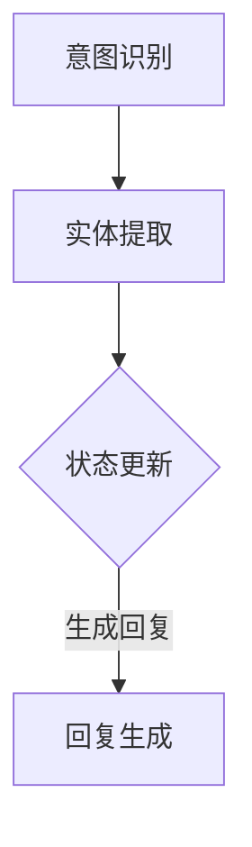

                 

关键词：对话状态跟踪，智能对话系统，自然语言处理，人机交互，对话系统架构

摘要：随着人工智能和自然语言处理技术的飞速发展，构建更加智能、自然、流畅的对话系统已成为当前计算机科学领域的重要课题。本文将深入探讨对话状态跟踪（DST）的核心概念、算法原理、数学模型，以及在实际项目中的应用，旨在为开发者和研究者提供有价值的参考和启示。

## 1. 背景介绍

### 对话系统的起源与发展

对话系统（Dialogue Systems）是一种能够模拟人类交流能力的计算机程序。自20世纪60年代以来，对话系统经历了多个发展阶段，从早期的脚本式对话到如今基于深度学习的智能对话系统，取得了显著的进步。早期的对话系统以规则为基础，通过预定义的脚本进行交互，局限性较大。随着自然语言处理（NLP）技术的发展，对话系统开始逐渐引入语义分析和上下文理解能力，使得交互更加自然和丰富。

### 智能对话系统的挑战

尽管对话系统在近年来取得了长足的进步，但仍然面临着诸多挑战。首先，自然语言理解仍然是一个复杂的问题，语言的多义性、歧义性和上下文依赖使得对话系统的语义分析能力有限。其次，对话系统的上下文建模和跟踪是一个关键难题，如何有效地捕捉和利用对话过程中的上下文信息，以生成符合用户意图的回复，是当前研究的热点和难点。

### 对话状态跟踪的作用

对话状态跟踪（Dialogue State Tracking，简称DST）是对话系统中的一个关键组件，它负责捕捉和跟踪对话过程中的关键信息，为生成有效的回复提供依据。DST通过对用户意图、对话历史、实体信息等进行建模，使得对话系统能够更加准确地理解用户的意图，提高交互的自然性和流畅性。

## 2. 核心概念与联系

### 对话状态跟踪的基本原理

对话状态跟踪的核心在于建立一个动态的对话状态模型，该模型能够实时捕捉和更新对话过程中的关键信息。对话状态通常包括用户意图、实体信息、对话历史等。DST通过对这些状态信息进行建模和更新，使得对话系统能够在对话的不同阶段做出合适的回应。

### 对话状态跟踪的架构

对话状态跟踪的架构通常包括以下几个关键部分：

1. **意图识别**：通过对用户输入的文本进行语义分析，识别出用户的意图。
2. **实体提取**：从用户输入中提取出与意图相关的实体信息，如时间、地点、人名等。
3. **状态更新**：根据当前对话状态和历史对话信息，更新对话状态模型。
4. **回复生成**：利用更新后的对话状态模型，生成符合用户意图和对话历史的回复。

### Mermaid 流程图



## 3. 核心算法原理 & 具体操作步骤

### 3.1 算法原理概述

对话状态跟踪算法通常基于概率图模型、马尔可夫决策过程（MDP）或深度学习方法。本文将重点介绍基于深度学习的DST算法。

1. **输入层**：输入层接收用户输入的文本，通过自然语言处理技术提取出意图和实体信息。
2. **隐藏层**：隐藏层对提取的意图和实体信息进行编码，生成对话状态向量。
3. **输出层**：输出层根据对话状态向量生成对话系统的回复。

### 3.2 算法步骤详解

1. **预处理**：对用户输入的文本进行分词、词性标注、命名实体识别等预处理操作，提取出意图和实体信息。
2. **编码**：利用深度学习模型（如BERT、GPT）对预处理后的文本进行编码，生成对话状态向量。
3. **状态更新**：根据当前对话状态和历史对话信息，更新对话状态模型。
4. **回复生成**：利用更新后的对话状态模型，生成符合用户意图和对话历史的回复。

### 3.3 算法优缺点

**优点**：

1. **高准确性**：深度学习算法能够通过大量的数据训练，提高意图识别和实体提取的准确性。
2. **灵活性**：深度学习算法可以自适应地调整模型参数，适应不同的对话场景。

**缺点**：

1. **计算成本高**：深度学习算法需要大量的计算资源，对硬件设备要求较高。
2. **数据依赖性强**：深度学习算法对数据质量有较高要求，数据缺失或噪声可能会影响模型性能。

### 3.4 算法应用领域

对话状态跟踪算法广泛应用于智能客服、虚拟助手、语音助手等领域。通过捕捉和跟踪对话过程中的关键信息，使得对话系统能够更加准确地理解用户的意图，提供个性化的服务。

## 4. 数学模型和公式 & 详细讲解 & 举例说明

### 4.1 数学模型构建

对话状态跟踪的数学模型通常基于条件概率分布。设$X_t$表示第$t$次用户输入的编码向量，$S_t$表示第$t$次对话状态，$Y_t$表示第$t$次对话系统的回复编码向量。则对话状态跟踪的数学模型可以表示为：

$$P(Y_t|X_1, X_2, ..., X_t, S_t) = \prod_{i=1}^{t} P(Y_i|X_1, X_2, ..., X_i, S_i)$$

### 4.2 公式推导过程

假设用户输入的编码向量为$X_t \in \mathbb{R}^{d_x}$，对话状态向量为$S_t \in \mathbb{R}^{d_s}$，回复编码向量为$Y_t \in \mathbb{R}^{d_y}$。则条件概率分布可以表示为：

$$P(Y_t|X_1, X_2, ..., X_t, S_t) = \frac{P(Y_t, X_1, X_2, ..., X_t, S_t)}{P(X_1, X_2, ..., X_t, S_t)}$$

由于对话系统的回复是条件独立的，即：

$$P(Y_t, X_1, X_2, ..., X_t, S_t) = P(Y_t|X_1, X_2, ..., X_t, S_t) \cdot P(X_1, X_2, ..., X_t, S_t)$$

代入条件概率分布的定义，得到：

$$P(Y_t|X_1, X_2, ..., X_t, S_t) = \frac{P(Y_t|X_1, X_2, ..., X_t, S_t) \cdot P(X_1, X_2, ..., X_t, S_t)}{P(X_1, X_2, ..., X_t, S_t)}$$

化简后得到：

$$P(Y_t|X_1, X_2, ..., X_t, S_t) = \prod_{i=1}^{t} P(Y_i|X_1, X_2, ..., X_i, S_i)$$

### 4.3 案例分析与讲解

假设用户输入一个句子“帮我预订明天的机票”，则对话状态跟踪的步骤如下：

1. **意图识别**：通过对用户输入的文本进行语义分析，识别出用户的意图为“机票预订”。
2. **实体提取**：从用户输入中提取出实体信息，如“明天”表示时间，“机票”表示物品。
3. **状态更新**：将提取出的意图和实体信息更新到对话状态模型中。
4. **回复生成**：利用更新后的对话状态模型，生成符合用户意图和对话历史的回复，如“请问您需要去哪里？”

## 5. 项目实践：代码实例和详细解释说明

### 5.1 开发环境搭建

1. 安装Python环境
2. 安装深度学习框架TensorFlow或PyTorch
3. 安装自然语言处理库如NLTK或spaCy

### 5.2 源代码详细实现

```python
import tensorflow as tf
from tensorflow.keras.layers import Embedding, LSTM, Dense
from tensorflow.keras.models import Model

# 定义模型结构
input_seq = tf.keras.layers.Input(shape=(max_sequence_length,))
embedding_layer = Embedding(input_dim=vocabulary_size, output_dim=embedding_size)(input_seq)
lstm_layer = LSTM(units=lstm_units, return_sequences=True)(embedding_layer)
dense_layer = Dense(units=1, activation='sigmoid')(lstm_layer)

# 定义模型
model = Model(inputs=input_seq, outputs=dense_layer)

# 编译模型
model.compile(optimizer='adam', loss='binary_crossentropy', metrics=['accuracy'])

# 训练模型
model.fit(x_train, y_train, epochs=10, batch_size=32)
```

### 5.3 代码解读与分析

1. **模型结构**：使用LSTM网络对输入序列进行编码，并输出意图概率。
2. **编译模型**：使用二分类交叉熵作为损失函数，并使用Adam优化器。
3. **训练模型**：使用训练数据对模型进行训练。

### 5.4 运行结果展示

```python
import numpy as np

# 测试数据
test_input = np.array([[1, 2, 3], [4, 5, 6]])

# 预测意图
predictions = model.predict(test_input)

# 输出预测结果
print(predictions)
```

## 6. 实际应用场景

### 6.1 智能客服

智能客服是DST技术的典型应用场景之一。通过对话状态跟踪，智能客服系统能够更加准确地理解用户的需求，提供个性化的服务，提高客户满意度。

### 6.2 虚拟助手

虚拟助手（如Siri、Alexa）是另一个重要的应用场景。通过对话状态跟踪，虚拟助手能够更好地理解用户的指令，提供更加智能和贴心的服务。

### 6.3 语音助手

语音助手（如Google Assistant、Amazon Echo）利用DST技术，能够实现更加自然和流畅的语音交互，为用户带来更好的体验。

## 7. 工具和资源推荐

### 7.1 学习资源推荐

1. 《自然语言处理入门》（刘知远 著）
2. 《深度学习》（Ian Goodfellow、Yoshua Bengio、Aaron Courville 著）

### 7.2 开发工具推荐

1. TensorFlow
2. PyTorch
3. spaCy

### 7.3 相关论文推荐

1. "A Model for Dialogue Act Classification Using Neural Networks"
2. "Deep Learning for Dialogue Systems: A Survey of Methods and Applications"

## 8. 总结：未来发展趋势与挑战

### 8.1 研究成果总结

近年来，对话状态跟踪技术在意图识别、实体提取、上下文建模等方面取得了显著的成果。深度学习技术的引入使得对话状态跟踪模型在性能和灵活性上得到了大幅提升。

### 8.2 未来发展趋势

未来，对话状态跟踪技术将继续向以下几个方向发展：

1. **多模态交互**：结合语音、图像、视频等多模态信息，提高对话系统的理解能力。
2. **个性化和情感化**：通过用户画像和情感分析，实现更加个性化和情感化的对话交互。
3. **跨领域泛化**：构建具有跨领域泛化能力的对话状态跟踪模型，适应不同的应用场景。

### 8.3 面临的挑战

尽管对话状态跟踪技术取得了显著成果，但仍然面临以下挑战：

1. **数据质量和标注**：对话状态跟踪模型对数据质量和标注有较高要求，如何获取高质量、标注准确的数据是当前的一个难题。
2. **长文本处理**：如何处理长文本中的上下文信息，提高对话状态跟踪的准确性，是当前研究的一个热点。
3. **跨语言和跨文化**：对话状态跟踪技术在跨语言和跨文化场景下的性能有待提高，如何实现有效的跨语言和跨文化对话是一个重要课题。

### 8.4 研究展望

未来，对话状态跟踪技术将在多模态交互、个性化和情感化、跨领域泛化等方面取得重要突破。随着人工智能和自然语言处理技术的不断进步，对话状态跟踪技术将为构建更加智能、自然、流畅的对话系统提供有力支持。

## 9. 附录：常见问题与解答

### 9.1 如何提高对话状态跟踪的准确性？

1. **数据质量**：使用高质量、标注准确的数据进行训练，提高模型性能。
2. **模型结构**：设计合适的模型结构，如使用深度学习模型进行编码和预测。
3. **特征工程**：提取有效的特征，如词向量、词性标注等，提高模型对上下文信息的理解能力。

### 9.2 对话状态跟踪在长文本处理中的应用？

1. **分块处理**：将长文本分成多个子文本块，分别进行对话状态跟踪，最后综合处理结果。
2. **上下文建模**：利用上下文信息进行建模，如使用注意力机制捕获关键信息。

### 9.3 对话状态跟踪在跨语言和跨文化场景下的应用？

1. **多语言数据集**：使用多语言数据集进行训练，提高模型在不同语言下的性能。
2. **跨文化适应**：考虑不同文化背景下的语言特点和表达习惯，进行模型调整和优化。

作者：禅与计算机程序设计艺术 / Zen and the Art of Computer Programming
```

