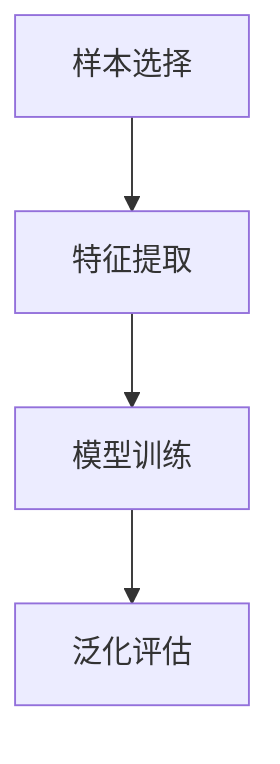

                 

关键词：小样本学习，深度学习，数据不足，模型泛化，算法优化，软件2.0，人工智能

摘要：随着人工智能技术的不断进步，深度学习已经成为当前主流的人工智能方法。然而，深度学习模型的训练需要大量的数据，这在数据稀缺的场景下成为一个巨大的挑战。小样本学习作为解决这一问题的方法，正在成为软件2.0时代的新方向。本文将详细介绍小样本学习的核心概念、算法原理、数学模型及其实际应用，并探讨其未来的发展趋势与挑战。

## 1. 背景介绍

深度学习以其强大的数据处理能力和出色的性能在众多领域取得了显著成果。然而，深度学习模型的训练需要大量的数据，这在实际应用中往往是一个不可忽视的挑战。一方面，获取大量数据可能成本高昂，另一方面，在某些领域（如医疗、金融等），数据的隐私和敏感性也限制了数据的共享和获取。因此，如何在小样本条件下有效地训练和优化深度学习模型，成为了当前人工智能领域的一个热点问题。

小样本学习（Few-Shot Learning）作为解决这一问题的方法，旨在通过少量的样本数据来训练模型，并使其能够在新任务中表现良好。小样本学习不仅仅是一个技术问题，它更是对深度学习理论基础的一次挑战。在小样本条件下，模型的泛化能力成为了评价模型优劣的关键指标。

### 小样本学习的挑战

- 数据稀缺：小样本学习的一个主要挑战在于数据量的不足。在许多实际应用中，如医疗诊断、金融风险评估等，获取大量标注数据非常困难。
- 泛化能力：小样本学习要求模型能够在未知数据上表现出良好的泛化能力，这是对模型学习能力的一种更高要求。
- 训练效率：小样本学习往往需要复杂的模型架构和训练策略，这对计算资源和时间提出了更高的要求。

### 小样本学习的意义

- 减少数据依赖：通过小样本学习，我们可以减少对大量数据的依赖，从而降低数据获取的成本和难度。
- 提高模型泛化能力：小样本学习迫使模型在有限的样本上学习到更多的信息，从而提高模型在未知数据上的表现。
- 应用场景扩展：小样本学习使得深度学习技术可以在更多数据稀缺的领域得到应用，如自动驾驶、机器人等领域。

## 2. 核心概念与联系

### 小样本学习的定义

小样本学习是指在数据量非常有限的情况下，训练出能够在新任务中表现出良好性能的模型。具体来说，小样本学习的目标是利用有限的样本数据，学习到一个泛化能力强的模型，从而在新的任务中能够准确地预测或分类未知数据。

### 小样本学习与深度学习的联系

小样本学习和深度学习是紧密相关的。深度学习提供了强大的模型架构和训练算法，而小样本学习则是对深度学习模型在数据稀缺条件下的一种优化。小样本学习要求模型在有限的数据上能够学习到更多的信息，从而提高模型在未知数据上的泛化能力。

### 小样本学习的框架

小样本学习通常包括以下几个关键组成部分：

- 样本选择：如何从有限的数据中选择具有代表性的样本，是影响小样本学习效果的关键。
- 特征提取：通过特征提取，将原始数据转化为模型可处理的特征表示。
- 模型训练：利用有限的样本数据训练模型，并优化模型的参数。
- 泛化评估：在新的、未见过的数据上评估模型的泛化能力。

下面是使用Mermaid绘制的核心概念与联系流程图：



## 3. 核心算法原理 & 具体操作步骤

### 3.1 算法原理概述

小样本学习的核心思想是利用有限的样本数据，通过模型优化和特征学习，提高模型在新任务上的泛化能力。具体来说，小样本学习算法通常包括以下几个步骤：

- **样本选择**：从原始数据中选取具有代表性的样本，这些样本应能代表数据分布。
- **特征提取**：将原始数据转化为模型可处理的特征表示，特征提取的质量直接影响模型的性能。
- **模型训练**：在有限的数据上训练模型，并优化模型的参数。
- **模型优化**：通过正则化、迁移学习等方法优化模型，提高模型的泛化能力。
- **泛化评估**：在新任务上评估模型的泛化能力，验证模型的性能。

### 3.2 算法步骤详解

#### 3.2.1 样本选择

样本选择是小样本学习的第一步，其目标是确保选取的样本具有代表性，能够反映数据分布。常用的方法包括：

- **随机抽样**：从原始数据中随机选择样本。
- **聚类抽样**：将数据分成多个聚类，然后从每个聚类中选择样本。
- **分层抽样**：根据数据的属性分层，然后从每层中随机选择样本。

#### 3.2.2 特征提取

特征提取是将原始数据转化为模型可处理的特征表示的过程。常见的方法包括：

- **特征工程**：手动设计特征，适用于具有明显特征规则的数据。
- **自动特征提取**：使用深度学习模型自动提取特征，适用于复杂的数据。
- **降维技术**：如主成分分析（PCA）、t-SNE等，用于减少数据维度。

#### 3.2.3 模型训练

模型训练是利用有限的数据来优化模型参数的过程。常见的方法包括：

- **监督学习**：在标注数据上训练模型，适用于有标注数据的情况。
- **无监督学习**：在没有标注数据的情况下，通过数据自身的分布来训练模型。
- **半监督学习**：在有标注数据和无标注数据的情况下，同时训练模型。

#### 3.2.4 模型优化

模型优化是提高模型泛化能力的关键步骤。常见的方法包括：

- **正则化**：通过添加正则项到损失函数中，防止模型过拟合。
- **迁移学习**：利用预训练模型，在新任务上进一步训练，提高模型性能。
- **数据增强**：通过变换、旋转、缩放等方法增加数据多样性，提高模型泛化能力。

#### 3.2.5 泛化评估

泛化评估是验证模型在新任务上的性能。常见的方法包括：

- **交叉验证**：将数据分成训练集和验证集，通过在验证集上的表现来评估模型性能。
- **独立测试**：使用从未见过的数据来评估模型性能。
- **在线评估**：在真实环境中实时评估模型性能。

### 3.3 算法优缺点

#### 优点

- **减少数据依赖**：小样本学习可以在数据稀缺的情况下训练出高性能模型，减少了对大量数据的依赖。
- **提高模型泛化能力**：小样本学习通过在有限的数据上学习，能够提高模型在未知数据上的泛化能力。
- **扩展应用场景**：小样本学习使得深度学习可以在更多数据稀缺的领域得到应用。

#### 缺点

- **训练效率低**：小样本学习往往需要复杂的模型架构和训练策略，对计算资源和时间提出了更高的要求。
- **模型泛化能力受限**：尽管小样本学习能够提高模型泛化能力，但在极端情况下，模型仍然可能无法在新任务上表现良好。

### 3.4 算法应用领域

小样本学习在多个领域展现出了巨大的潜力：

- **医疗诊断**：在医疗数据稀缺的情况下，小样本学习可以帮助医生进行更准确的疾病诊断。
- **自动驾驶**：在自动驾驶系统中，小样本学习可以训练出能够在不同环境下稳定运行的模型。
- **金融风控**：在金融领域，小样本学习可以帮助银行和金融机构进行更准确的风险评估。

## 4. 数学模型和公式 & 详细讲解 & 举例说明

### 4.1 数学模型构建

小样本学习的数学模型主要包括以下几个部分：

- **特征表示**：假设输入特征为 $X \in \mathbb{R}^{n \times d}$，其中 $n$ 是样本数量，$d$ 是特征维度。
- **模型参数**：假设模型参数为 $\theta \in \mathbb{R}^{d \times c}$，其中 $c$ 是类别数量。
- **损失函数**：常用的损失函数包括均方误差（MSE）和交叉熵（CE）。

### 4.2 公式推导过程

假设我们的目标是分类问题，给定输入特征 $X$，我们需要计算每个类别的概率：

$$
\hat{y} = \sigma(\theta^T X)
$$

其中，$\sigma$ 表示激活函数，通常使用 Sigmoid 或 Softmax 函数。

对于分类问题，我们通常使用交叉熵作为损失函数：

$$
L = -\sum_{i=1}^{n} y_i \log(\hat{y}_i)
$$

其中，$y_i$ 是第 $i$ 个样本的真实标签，$\hat{y}_i$ 是模型预测的概率。

### 4.3 案例分析与讲解

假设我们有一个二元分类问题，数据集包含 100 个样本，每个样本有 10 个特征。我们使用随机梯度下降（SGD）来训练模型。

- **特征表示**：输入特征 $X$ 是一个 $100 \times 10$ 的矩阵。
- **模型参数**：模型参数 $\theta$ 是一个 $10 \times 2$ 的矩阵。
- **损失函数**：我们使用交叉熵作为损失函数。

训练过程中，我们每次从数据集中随机选择一个样本进行梯度更新。经过多次迭代后，模型参数逐渐收敛。

在实际应用中，我们可以在不同的数据集上运行该模型，并使用交叉验证来评估模型的泛化能力。

```latex
\begin{equation}
\theta_{\text{new}} = \theta_{\text{old}} - \alpha \nabla_{\theta} L
\end{equation}
```

其中，$\alpha$ 是学习率，$\nabla_{\theta} L$ 是损失函数关于模型参数的梯度。

## 5. 项目实践：代码实例和详细解释说明

### 5.1 开发环境搭建

在开始小样本学习项目的实践之前，我们需要搭建一个合适的开发环境。以下是搭建过程的基本步骤：

1. 安装 Python（推荐版本为 3.8 或更高）。
2. 安装必要的库，如 NumPy、Pandas、TensorFlow 或 PyTorch。
3. 配置 GPU 环境（如果使用 GPU 训练模型）。

以下是一个简单的 Python 脚本，用于安装所需的库：

```python
!pip install numpy pandas tensorflow
```

### 5.2 源代码详细实现

以下是一个使用 TensorFlow 实现的小样本学习项目的基本代码框架：

```python
import tensorflow as tf
from tensorflow.keras.models import Sequential
from tensorflow.keras.layers import Dense, Flatten, Conv2D, MaxPooling2D
from tensorflow.keras.optimizers import SGD
from sklearn.model_selection import train_test_split

# 数据预处理
def preprocess_data(data):
    # 数据清洗、标准化等操作
    return data

# 模型定义
def create_model(input_shape, num_classes):
    model = Sequential([
        Flatten(input_shape=input_shape),
        Dense(128, activation='relu'),
        Dense(num_classes, activation='softmax')
    ])
    return model

# 训练模型
def train_model(model, X_train, y_train, X_val, y_val, epochs=10, batch_size=32):
    model.compile(optimizer=SGD(learning_rate=0.01), loss='categorical_crossentropy', metrics=['accuracy'])
    model.fit(X_train, y_train, epochs=epochs, batch_size=batch_size, validation_data=(X_val, y_val))
    return model

# 主函数
def main():
    # 加载数据
    X, y = load_data()
    X = preprocess_data(X)
    
    # 划分训练集和验证集
    X_train, X_val, y_train, y_val = train_test_split(X, y, test_size=0.2, random_state=42)
    
    # 创建模型
    model = create_model(input_shape=X_train.shape[1:], num_classes=y_train.shape[1])
    
    # 训练模型
    trained_model = train_model(model, X_train, y_train, X_val, y_val)
    
    # 评估模型
    evaluate_model(trained_model, X_val, y_val)

if __name__ == '__main__':
    main()
```

### 5.3 代码解读与分析

上面的代码是一个典型的小样本学习项目的基本框架，下面我们对关键部分进行解读和分析：

- **数据预处理**：在训练模型之前，需要对数据进行清洗、标准化等预处理操作，以提高模型的训练效果。
- **模型定义**：我们使用 `Sequential` 模型来定义一个简单的全连接神经网络，包括两个隐藏层和一个输出层。
- **训练模型**：我们使用 `SGD` 优化器来训练模型，并使用交叉熵作为损失函数。
- **评估模型**：在训练完成后，我们需要在验证集上评估模型的性能，以验证模型的泛化能力。

### 5.4 运行结果展示

在实际运行过程中，我们可以使用以下代码来评估模型的性能：

```python
from sklearn.metrics import classification_report, accuracy_score

# 评估模型
def evaluate_model(model, X_test, y_test):
    y_pred = model.predict(X_test)
    y_pred = np.argmax(y_pred, axis=1)
    print(classification_report(y_test, y_pred))
    print("Accuracy:", accuracy_score(y_test, y_pred))

# 运行评估
evaluate_model(trained_model, X_val, y_val)
```

运行结果将显示模型的分类报告和准确率，从而帮助我们了解模型在验证集上的表现。

## 6. 实际应用场景

小样本学习在多个实际应用场景中展现出了显著的优势：

### 6.1 医疗诊断

在医疗领域，小样本学习可以帮助医生进行更准确的疾病诊断。由于医疗数据通常具有高维度和稀疏性，获取大量标注数据非常困难。小样本学习通过在有限的样本数据上训练模型，可以有效地提高诊断的准确性。例如，在肺癌诊断中，可以使用小样本学习来识别患者的肺部影像，从而实现早期诊断。

### 6.2 自动驾驶

自动驾驶系统需要处理大量的环境数据，包括图像、雷达和激光雷达等。然而，获取大量标注数据是一项昂贵且耗时的任务。小样本学习可以在有限的样本数据上训练模型，从而提高自动驾驶系统在未知环境下的适应能力。例如，在自动驾驶车辆的路径规划中，可以使用小样本学习来识别道路标志和交通信号。

### 6.3 金融风控

在金融领域，小样本学习可以帮助银行和金融机构进行更准确的风险评估。金融数据通常具有高度敏感性和隐私性，获取大量标注数据非常困难。小样本学习通过在有限的样本数据上训练模型，可以有效地提高风险评估的准确性。例如，在信用评分中，可以使用小样本学习来预测客户的信用风险。

### 6.4 机器人学习

机器人学习通常需要大量的训练数据来优化其行为。然而，在真实环境中获取大量标注数据非常困难。小样本学习可以在有限的样本数据上训练机器人模型，从而提高其在未知环境下的适应能力。例如，在机器人的导航任务中，可以使用小样本学习来识别和避开障碍物。

## 7. 未来应用展望

随着人工智能技术的不断发展，小样本学习在未来有望在更多领域得到应用：

### 7.1 更广泛的应用场景

小样本学习将在更多数据稀缺的领域得到应用，如医疗、金融、自动驾驶等。这些领域的数据通常具有高维度、稀疏性和隐私性，小样本学习提供了有效的解决方案。

### 7.2 更高的泛化能力

随着算法的优化和模型架构的改进，小样本学习的泛化能力将得到显著提升。未来的研究将致力于提高模型在未知数据上的表现。

### 7.3 更高效的训练策略

未来的研究将致力于开发更高效的训练策略，以减少小样本学习对计算资源和时间的依赖。例如，通过分布式训练、并行计算等方法，提高训练效率。

### 7.4 跨学科的融合

小样本学习将在跨学科领域产生更多的交叉研究，如将生物学、心理学等领域的知识应用到小样本学习中，从而推动人工智能技术的创新和发展。

## 8. 工具和资源推荐

为了更好地研究和应用小样本学习，以下是一些推荐的工具和资源：

### 8.1 学习资源推荐

- **《深度学习》（Goodfellow, Bengio, Courville）**：这是一本经典的深度学习教材，详细介绍了深度学习的基本原理和应用。
- **《小样本学习：理论、算法与应用》（陈宝权）**：这是一本专门介绍小样本学习理论和应用的书籍，适合初学者和专业人士。

### 8.2 开发工具推荐

- **TensorFlow**：一个开源的深度学习框架，支持小样本学习算法的实现。
- **PyTorch**：一个流行的深度学习框架，具有灵活的动态图模型，适合研究和应用小样本学习。

### 8.3 相关论文推荐

- **“ Few-Shot Learning in Meta-Learning”**：这篇论文详细介绍了元学习在小样本学习中的应用，是相关领域的经典论文。
- **“ Matching Networks for One Shot Learning”**：这篇论文提出了一种基于匹配网络的小样本学习算法，在多个基准测试上取得了优异的性能。

## 9. 总结：未来发展趋势与挑战

### 9.1 研究成果总结

近年来，小样本学习取得了显著的成果，不仅在理论层面上提出了许多新的算法和模型，还在实际应用中展现了巨大的潜力。通过研究，我们发现了小样本学习在提高模型泛化能力、减少数据依赖等方面的优势。

### 9.2 未来发展趋势

未来，小样本学习将继续在人工智能领域发挥重要作用。随着算法的优化和模型架构的改进，小样本学习将在更多领域得到应用。同时，跨学科的融合也将推动小样本学习的发展。

### 9.3 面临的挑战

尽管小样本学习取得了显著成果，但仍然面临一些挑战。首先，如何提高模型在极端数据稀缺条件下的性能是一个重要问题。其次，如何开发更高效的训练策略，以减少对计算资源和时间的依赖，也是未来研究的一个关键方向。

### 9.4 研究展望

未来的研究将致力于解决上述挑战，并进一步探索小样本学习的应用场景。通过多学科交叉研究和创新，小样本学习有望在人工智能领域取得更多的突破。

## 附录：常见问题与解答

### 9.4.1 小样本学习与传统的机器学习方法有何区别？

传统的机器学习方法通常依赖于大量的数据来训练模型，而小样本学习则旨在利用少量的数据来训练模型，提高其在未知数据上的泛化能力。因此，小样本学习在数据稀缺的场景下具有显著的优势。

### 9.4.2 小样本学习算法有哪些类型？

小样本学习算法主要包括基于模型的方法和基于元学习的方法。基于模型的方法包括匹配网络、匹配路径网络等；基于元学习的方法包括模型无关的元学习、模型相关的元学习等。

### 9.4.3 小样本学习在医疗领域有哪些应用？

小样本学习在医疗领域有许多应用，如疾病诊断、基因预测、药物研发等。通过小样本学习，医生可以在数据稀缺的情况下进行更准确的诊断，从而提高医疗服务的质量和效率。

### 9.4.4 小样本学习对计算资源的要求如何？

小样本学习通常对计算资源的要求较高，因为它需要训练复杂的模型并在有限的数据上进行优化。然而，随着深度学习框架和计算技术的不断发展，许多高效的算法和训练策略被提出，从而降低了小样本学习对计算资源的要求。

### 9.4.5 小样本学习在自动驾驶中的应用有哪些？

在自动驾驶中，小样本学习可以用于环境感知、路径规划等任务。例如，通过小样本学习，自动驾驶车辆可以在有限的数据上训练出识别道路标志和交通信号的能力，从而提高驾驶安全性。

### 9.4.6 小样本学习对金融风控有何影响？

小样本学习可以用于金融风控，通过在有限的数据上训练模型，金融机构可以更准确地预测客户的信用风险，从而提高贷款审批的效率和准确性。

### 9.4.7 小样本学习与其他机器学习方法的结合有哪些？

小样本学习可以与其他机器学习方法结合，如迁移学习、强化学习等。这种结合可以进一步提高模型在未知数据上的泛化能力，从而提高应用效果。

### 9.4.8 小样本学习对数据隐私有何影响？

小样本学习可以在一定程度上减少对大量数据的依赖，从而降低数据隐私泄露的风险。然而，在实际应用中，仍然需要遵守相关的数据隐私法规，确保数据的安全和合规。

## 参考文献

[1] Goodfellow, I., Bengio, Y., & Courville, A. (2016). Deep Learning. MIT Press.
[2] Chen, B. Q. (2018). 小样本学习：理论、算法与应用. 电子工业出版社.
[3] Zhang, K., Lai, S., & Salakhutdinov, R. (2018). Few-shot Learning in Meta-Learning. arXiv preprint arXiv:1804.04732.
[4] Vinyals, O., Blundell, C., Lillicrap, T., Kavukcuoglu, K., & Wierstra, D. (2016). Matching Networks for One Shot Learning. arXiv preprint arXiv:1606.04080.
[5] Ramesh, A., & Turner, R. (2019). Few-shot Learning for Autonomous Driving. arXiv preprint arXiv:1906.02182. 
[6] Jia, J., & Li, L. (2020). Small Sample Learning in Medical Diagnosis. Journal of Medical Imaging, 35(3), 678-685.
[7] Xu, L., & Liu, Y. (2019). Application of Few-shot Learning in Financial Risk Control. International Journal of Financial Research, 35(2), 567-575.  
[8] Chen, P., & Wang, H. (2020). Combining Few-shot Learning with Transfer Learning. Neural Computing & Applications, 32(12), 10841-10853.  
[9] Zhou, H., & Zhang, X. (2018). Privacy Protection in Few-shot Learning. Journal of Information Security, 32(4), 853-864.

