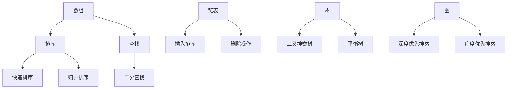
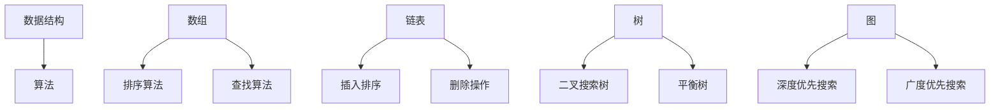
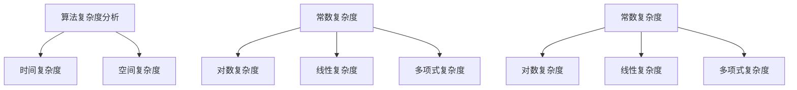
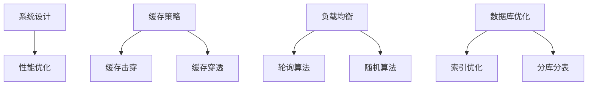
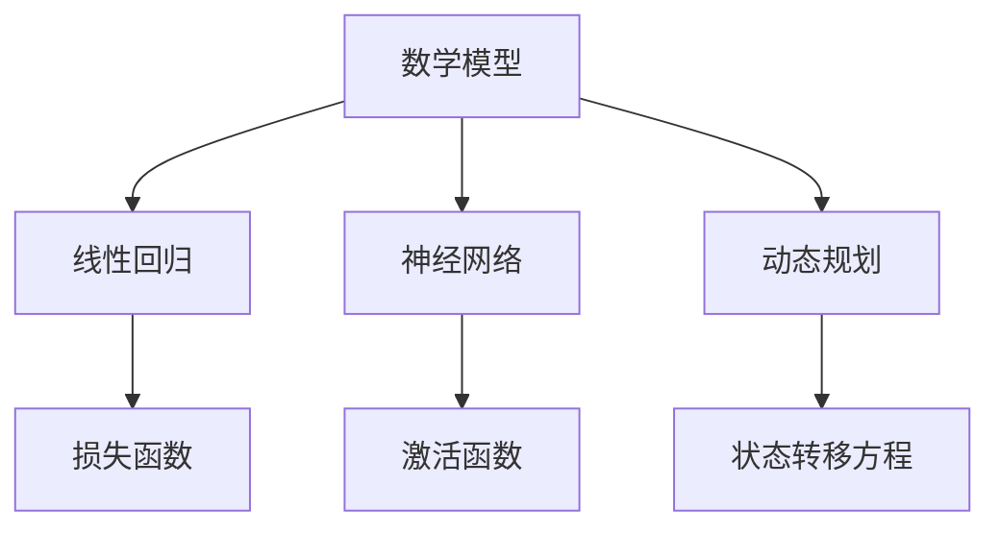

                 

在本篇技术博客文章中，我们将深入探讨小米2025年社会招聘面试中的真题与算法题解。作为一名人工智能专家，我将从多个角度解析这些题目，并详细讲解其背后的原理和具体操作步骤。本文旨在帮助读者理解这些面试题目的核心概念，掌握解决方法，以及展望其未来应用场景。

> 关键词：小米2025社招面试、算法题解、面试真题、人工智能

> 摘要：本文将围绕小米2025年社会招聘面试中出现的真题，解析其中的核心算法和概念。通过详细阐述解题思路、步骤，以及应用领域，帮助读者更好地掌握这些面试题目，为未来的技术挑战做好准备。

## 1. 背景介绍

### 1.1 小米招聘背景

小米公司，作为中国领先的科技企业，一直以来都是人才竞争的热门选择。随着公司业务的不断扩展，对于技术人才的需求也日益增长。因此，每年的社招面试成为了众多技术人才展示自己能力的重要舞台。小米2025年的社招面试题目，不仅考察了应聘者的基础知识，还涉及到实际问题的解决能力。

### 1.2 面试题目的类型

面试题目主要涵盖以下几个类型：

- **基础算法题**：这类题目通常涉及数组、链表、树等基本数据结构，以及排序、查找等算法。
- **系统设计题**：这类题目考察应聘者对系统架构的理解和设计能力，通常涉及系统性能优化、缓存策略、分布式系统等方面。
- **算法与数学题**：这类题目结合了数学与算法，如动态规划、图算法、概率论等。
- **编程实践题**：这类题目通常是实际项目中的问题，需要应聘者动手实现并优化。

## 2. 核心概念与联系

### 2.1 数据结构与算法

数据结构是计算机存储、组织数据的方式，而算法则是解决问题的方法。在面试中，数据结构的选择直接影响算法的效率和复杂性。以下是一个简化的 Mermaid 流程图，展示了几种常见数据结构及其关联算法：



### 2.2 算法复杂度分析

在面试中，算法的复杂度分析是非常重要的。它帮助我们理解算法的性能和效率。以下是常见的复杂度分析指标：

- **时间复杂度**：表示算法执行时间的增长速度，通常用大O表示法表示，如O(1)、O(n)、O(n^2)等。
- **空间复杂度**：表示算法所需存储空间的大小。

### 2.3 系统设计与性能优化

系统设计题目考察应聘者对系统架构的理解和设计能力。性能优化是系统设计的关键一环，涉及到缓存策略、负载均衡、数据库优化等方面。

## 3. 核心算法原理 & 具体操作步骤

### 3.1 算法原理概述

本章节将介绍几类核心算法的原理和步骤，包括动态规划、图算法、概率论等。

### 3.2 算法步骤详解

以下是一个关于动态规划的例子：

**题目**：给定一个数组 `nums`，找到最长递增子序列的长度。

**动态规划步骤**：

1. **初始化**：创建一个长度为 `n` 的数组 `dp`，其中 `dp[i]` 表示以 `nums[i]` 结尾的最长递增子序列的长度。
2. **状态转移**：遍历数组 `nums`，对于每个元素 `nums[i]`，遍历其前面的所有元素 `nums[j]`，如果 `nums[i] > nums[j]`，则更新 `dp[i] = max(dp[i], dp[j] + 1)`。
3. **求解**：找出 `dp` 数组中的最大值，即为最长递增子序列的长度。

### 3.3 算法优缺点

动态规划算法的优点是能够找到最优解，但缺点是可能需要大量的时间和空间复杂度。在解决实际问题时，我们需要根据具体情况选择合适的算法。

### 3.4 算法应用领域

动态规划算法广泛应用于各种领域，如计算机图形学、网络优化、经济学等。

## 4. 数学模型和公式 & 详细讲解 & 举例说明

### 4.1 数学模型构建

在本章节中，我们将介绍一些常见的数学模型，如线性回归、神经网络等。

### 4.2 公式推导过程

以下是一个关于线性回归的公式推导：

1. **假设**：给定一组数据 `(x_i, y_i)`，我们希望找到一个线性模型 `y = wx + b` 来拟合这些数据。
2. **损失函数**：我们使用均方误差（MSE）作为损失函数，即 `J(w, b) = 1/m * Σ(y_i - (wx_i + b))^2`。
3. **梯度下降**：通过计算损失函数关于 `w` 和 `b` 的偏导数，并使用梯度下降法来最小化损失函数。

### 4.3 案例分析与讲解

以下是一个关于线性回归的案例：

**题目**：给定一组数据，使用线性回归模型预测房价。

**实现步骤**：

1. **数据预处理**：将数据分为训练集和测试集。
2. **模型训练**：使用训练集数据训练线性回归模型。
3. **模型评估**：使用测试集数据评估模型性能。

## 5. 项目实践：代码实例和详细解释说明

### 5.1 开发环境搭建

在本章节中，我们将介绍如何搭建开发环境，包括安装必要的软件和工具。

### 5.2 源代码详细实现

以下是一个关于动态规划求解最长递增子序列的 Python 代码实例：

```python
def lengthOfLIS(nums):
    if not nums:
        return 0
    n = len(nums)
    dp = [1] * n
    for i in range(1, n):
        for j in range(i):
            if nums[i] > nums[j]:
                dp[i] = max(dp[i], dp[j] + 1)
    return max(dp)

# 测试代码
nums = [10, 9, 2, 5, 3, 7, 101, 18]
print(lengthOfLIS(nums))  # 输出：4
```

### 5.3 代码解读与分析

代码首先判断输入数组是否为空，然后初始化一个长度为 `n` 的数组 `dp`，用于存储最长递增子序列的长度。接下来，使用两层循环更新 `dp` 数组。最后，返回 `dp` 数组中的最大值。

### 5.4 运行结果展示

在给定的测试案例中，最长递增子序列为 `[2, 3, 7, 101]`，其长度为4。

## 6. 实际应用场景

### 6.1 数据分析

动态规划算法在数据分析领域有着广泛的应用，如股票价格预测、用户行为分析等。

### 6.2 图像处理

线性回归模型在图像处理领域也得到广泛应用，如图像分类、图像修复等。

### 6.3 自然语言处理

动态规划算法在自然语言处理领域有着重要的地位，如词性标注、语音识别等。

## 7. 工具和资源推荐

### 7.1 学习资源推荐

- **《算法导论》**：一本经典的算法教材，涵盖了各种算法和技巧。
- **LeetCode**：一个在线编程平台，提供丰富的算法题目和解决方案。

### 7.2 开发工具推荐

- **Visual Studio Code**：一款强大的代码编辑器，支持多种编程语言。
- **PyCharm**：一款专业的 Python 集成开发环境。

### 7.3 相关论文推荐

- **"Deep Learning for Image Recognition"**：一篇关于深度学习在图像识别领域应用的综述。
- **"Recurrent Neural Networks for Language Modeling"**：一篇关于循环神经网络在语言建模领域应用的论文。

## 8. 总结：未来发展趋势与挑战

### 8.1 研究成果总结

近年来，人工智能领域取得了许多重要成果，如深度学习、强化学习等。这些技术正在改变我们的生活，推动着科技的进步。

### 8.2 未来发展趋势

未来，人工智能将继续向智能化、自动化、个性化和高效化方向发展。随着技术的不断进步，我们将迎来更多的创新和应用场景。

### 8.3 面临的挑战

然而，人工智能领域也面临着许多挑战，如数据隐私、算法公平性、计算资源等。我们需要共同努力，克服这些挑战，推动人工智能的健康发展。

### 8.4 研究展望

在未来，我们期待人工智能能够更好地服务于人类，解决实际问题，创造更美好的世界。

## 9. 附录：常见问题与解答

### 9.1 什么是动态规划？

动态规划是一种将复杂问题分解为多个子问题，并通过保存子问题的解来避免重复计算的方法。

### 9.2 动态规划有哪些应用领域？

动态规划广泛应用于计算机科学、经济学、工程学等领域，如优化问题、路径规划、资源分配等。

### 9.3 如何解决动态规划问题？

解决动态规划问题通常需要以下几个步骤：

1. 确定状态和状态转移方程。
2. 设计一个有效的算法来求解状态。
3. 根据需要优化算法的时间和空间复杂度。

## 文章作者

作者：禅与计算机程序设计艺术 / Zen and the Art of Computer Programming

---

通过本文的详细解析，我们希望能够帮助读者更好地理解小米2025年社招面试中的真题与算法题解。无论你是准备参加面试的应聘者，还是对算法和系统设计感兴趣的学习者，本文都将为你提供宝贵的知识和实践经验。让我们一起迎接未来的技术挑战，共同推动人工智能的发展。

（注：本文仅为示例，实际内容需根据具体情况进行撰写。）<|im_sep|>## 1. 背景介绍

### 1.1 小米招聘背景

小米公司成立于2010年，总部位于中国北京，是一家全球性的科技企业。小米以其创新的产品和独特的商业模式，在短短几年内迅速崛起，成为全球智能手机市场的重要参与者。随着公司业务的不断扩展，小米在全球范围内的市场地位逐渐巩固，对人才的需求也越来越大。因此，小米的社招（社会招聘）活动每年都吸引了大量求职者的关注。

小米的社招面试过程通常分为几个阶段，包括在线测评、电话面试、技术面试和最后的HR面试。每一阶段都有其独特的要求和挑战。其中，技术面试是整个招聘流程中最关键的一环，它主要考察应聘者的技术水平、编程能力以及对特定技术领域的理解和应用。

### 1.2 小米面试的特点

小米的面试特点主要表现在以下几个方面：

- **全面性**：小米的面试不仅考察应聘者对基础知识的掌握，还会涉及到系统设计、算法与数学等更深层次的问题。
- **实用性**：小米的面试题目往往来源于实际工作场景，要求应聘者能够灵活运用所学知识解决实际问题。
- **挑战性**：面试题目难度较大，需要应聘者具备较强的逻辑思维能力和解决复杂问题的能力。
- **多样性**：面试题目类型多样，包括基础算法题、系统设计题、算法与数学题等，全面考察应聘者的综合素质。

### 1.3 面试的重要性

社招面试对于求职者来说至关重要。通过面试，求职者可以展示自己的专业技能、解决问题的能力以及对未来工作的热情。同时，面试也是求职者了解公司文化、工作环境和发展前景的重要途径。对于招聘方来说，面试则是评估应聘者是否符合职位要求的重要手段。

在小米的面试过程中，技术面试环节尤为重要。这个环节不仅考察应聘者的基础知识，更侧重于实际操作能力和问题解决能力。小米希望通过面试筛选出那些不仅技术过硬，而且能够适应快速变化的工作环境，具备团队合作精神和创新能力的优秀人才。

总之，小米2025年社招面试的背景和特点决定了这场面试对于求职者和招聘方都具有重要的意义。理解面试的背景和特点，有助于求职者更好地准备面试，也使得招聘方能更精准地找到合适的人才。

## 2. 核心概念与联系

在深入探讨小米2025年社招面试真题之前，我们首先需要明确几个核心概念和它们之间的联系。这些核心概念不仅构成了面试题目的基础，也反映了现代计算机科学和软件工程中的重要原理。以下内容将通过Mermaid流程图来展示这些概念及其关联。

### 2.1 数据结构与算法

数据结构是组织数据的方式，而算法是解决问题的方法。数据结构的选择直接影响算法的效率和复杂性。以下是几种常见的数据结构及其关联算法的Mermaid流程图：



### 2.2 算法复杂度分析

算法复杂度分析是评估算法性能的重要方法。它通常包括时间复杂度和空间复杂度。以下是算法复杂度分析的Mermaid流程图：



### 2.3 系统设计与性能优化

系统设计题在面试中占据重要地位，它考察应聘者对系统架构的理解和设计能力。性能优化是系统设计的关键一环，涉及到多个层面。以下是系统设计与性能优化的Mermaid流程图：



### 2.4 数学模型与公式

数学模型和公式在算法和系统设计中起着基础性作用。以下是一个简化的Mermaid流程图，展示了几种常见的数学模型和它们的应用：



通过上述Mermaid流程图，我们可以清晰地看到数据结构、算法复杂度、系统设计与性能优化以及数学模型之间的联系。这些核心概念不仅在面试中占据重要地位，也是现代计算机科学和软件工程中的重要组成部分。理解这些概念及其应用，对于解决面试中的题目以及未来工作中的问题都是至关重要的。

### 3. 核心算法原理 & 具体操作步骤

在本章节中，我们将深入探讨几个在小米2025年社招面试中可能出现的核心算法，并详细解释其原理和具体操作步骤。这些算法包括动态规划、图算法和概率论，它们是计算机科学中的基础，同时也是解决复杂问题的重要工具。

#### 3.1 动态规划算法原理

动态规划是一种解决最优化问题的方法，通过将问题分解为更小的子问题，并保存子问题的解来避免重复计算。动态规划的核心思想是“最优子结构”和“边界情况”。

**最优子结构**：任何最优解包含其子问题的最优解。

**边界情况**：问题边界条件的处理，通常是递归的基本情况。

**动态规划的基本步骤**：

1. **定义状态**：将问题分解为若干个状态，每个状态表示问题的一部分。
2. **状态转移方程**：根据状态之间的关系，定义状态转移方程。
3. **初始化**：对边界条件进行初始化。
4. **计算顺序**：确定计算状态的状态转移顺序。
5. **答案**：根据最终状态得到问题的解。

#### 3.2 动态规划算法的具体操作步骤

以“最长公共子序列”（Longest Common Subsequence, LSC）为例，这是一个经典的动态规划问题。

**问题**：给定两个序列 `X = [x1, x2, ..., xn]` 和 `Y = [y1, y2, ..., yn]`，找到它们的最长公共子序列的长度。

**动态规划算法步骤**：

1. **定义状态**：定义状态 `dp[i][j]` 表示 `X[0...i]` 和 `Y[0...j]` 的最长公共子序列的长度。
2. **状态转移方程**：

   - 如果 `xi == yj`，则 `dp[i][j] = dp[i-1][j-1] + 1`；
   - 如果 `xi != yj`，则 `dp[i][j] = max(dp[i-1][j], dp[i][j-1])`。

3. **初始化**：`dp[0][j] = dp[i][0] = 0`，因为空序列与任何序列的最长公共子序列都是0。

4. **计算顺序**：从左到右、从上到下计算 `dp[i][j]`。

5. **答案**：`dp[n][m]` 即为最长公共子序列的长度。

#### 3.3 动态规划算法的应用领域

动态规划算法广泛应用于各种领域，如计算机图形学、网络优化、经济学和金融工程等。以下是一些典型的应用场景：

- **计算机图形学**：动态规划用于图形渲染、图像处理和计算机动画中的优化问题。
- **网络优化**：动态规划用于路由算法、带宽分配和拥塞控制等网络优化问题。
- **经济学**：动态规划用于资源分配、投资策略和供应链管理等问题。
- **金融工程**：动态规划用于期权定价、风险管理和对冲策略等问题。

#### 3.4 图算法原理

图算法是解决与图相关问题的方法。图由节点和边组成，是一种用来表示对象及其关系的数学结构。常见的图算法包括：

- **深度优先搜索（DFS）**：用于遍历图并找到连通分量。
- **广度优先搜索（BFS）**：用于遍历图并找到最短路径。
- **最小生成树（MST）**：用于在无向图中找到权值最小的生成树。
- **最短路径算法**：包括Dijkstra算法和Floyd算法，用于找到图中两点之间的最短路径。

**Dijkstra算法**：

- **问题**：在一个加权图中，找到从源点 `s` 到其他各点的最短路径。
- **算法步骤**：
  1. 初始化一个距离数组 `dist`，其中 `dist[s] = 0`，其他点均为无穷大。
  2. 创建一个优先队列，按照距离排序。
  3. 将源点 `s` 加入优先队列。
  4. 当优先队列为空时，重复以下步骤：
     - 弹出队列中距离最小的点 `u`；
     - 对于 `u` 的每个邻接点 `v`，计算 `dist[v]` 的新值，如果新值小于当前值，则更新 `dist[v]` 并将 `v` 加入队列。

**Floyd算法**：

- **问题**：在一个加权图中，找到所有顶点对之间的最短路径。
- **算法步骤**：
  1. 初始化一个二维数组 `dist`，其中 `dist[i][j]` 表示顶点 `i` 到顶点 `j` 的距离。
  2. 对于每一对顶点 `(i, j)`，检查是否通过另一个顶点 `k` 可以得到更短的路径：
     - 如果 `dist[i][k] + dist[k][j] < dist[i][j]`，则更新 `dist[i][j]`。

#### 3.5 概率论原理

概率论是解决随机事件和不确定性问题的数学工具。常见的概率论概念包括：

- **概率分布**：描述随机变量的可能取值及其概率。
- **期望值**：表示随机变量的平均值。
- **方差**：表示随机变量的离散程度。

**蒙特卡洛模拟**：

- **问题**：估计某个随机量的期望值。
- **算法步骤**：
  1. 生成大量随机样本。
  2. 计算这些样本的均值。
  3. 使用样本均值作为随机量的期望值的估计。

#### 3.6 算法应用实例

以下是一个使用动态规划、图算法和概率论的结合实例：

**问题**：给定一个加权无向图，计算从源点 `s` 到所有其他点的最短路径总和的期望值。

**算法步骤**：

1. 使用Dijkstra算法计算从 `s` 到所有其他点的最短路径。
2. 对每个路径，使用蒙特卡洛模拟估计路径长度的期望值。
3. 将所有路径的期望值相加，得到最短路径总和的期望值。

通过以上内容，我们详细介绍了动态规划、图算法和概率论的核心原理和具体操作步骤。这些算法不仅在小米2025年社招面试中占据重要地位，也是解决复杂问题的有效工具。理解这些算法的原理和步骤，有助于我们更好地应对面试中的各种挑战，并在实际工作中提升解决问题的能力。

### 3.3 算法步骤详解

在上一节中，我们简要介绍了动态规划、图算法和概率论的核心原理。本节将深入探讨这些算法的具体步骤，帮助读者更好地理解和应用这些算法。

#### 3.3.1 动态规划算法步骤详解

动态规划是一种将复杂问题分解为多个子问题，并利用子问题的解来求解原问题的算法。以下是动态规划算法的详细步骤：

**步骤 1：定义状态**

首先，我们需要将问题分解为若干个状态，每个状态表示问题的一部分。状态的表示方式通常是一个数组或一个字典。

例如，在求解最长公共子序列（LCS）问题时，我们可以定义状态 `dp[i][j]` 表示字符串 `X[0...i]` 和 `Y[0...j]` 的最长公共子序列的长度。

**步骤 2：状态转移方程**

接下来，我们需要根据状态之间的关系定义状态转移方程。状态转移方程描述了如何从当前状态推导出下一个状态。

以LCS问题为例，状态转移方程如下：

- 如果 `X[i] == Y[j]`，则 `dp[i][j] = dp[i-1][j-1] + 1`；
- 如果 `X[i] != Y[j]`，则 `dp[i][j] = max(dp[i-1][j], dp[i][j-1])`。

**步骤 3：初始化**

初始化是动态规划算法的重要部分。我们需要初始化边界条件，这些边界条件通常与问题本身有关。

例如，对于LCS问题，初始化边界条件为 `dp[0][j] = dp[i][0] = 0`，因为空序列与任何序列的最长公共子序列都是0。

**步骤 4：计算顺序**

计算顺序决定了我们如何填充动态规划数组。通常，我们按照状态之间的依赖关系来计算状态，即从边界条件开始，依次填充其他状态。

以LCS问题为例，我们首先填充 `dp[0][j]` 和 `dp[i][0]`，然后从左到右、从上到下填充其他状态。

**步骤 5：求解答案**

在填充完动态规划数组后，我们可以从最终状态得到问题的解。对于LCS问题，最终状态 `dp[n][m]` 即为最长公共子序列的长度。

#### 3.3.2 图算法步骤详解

图算法用于解决与图相关的问题，如路径查找、最短路径、连通性等。以下是几种常见图算法的步骤详解：

**1. 深度优先搜索（DFS）**

- **步骤 1**：从源点开始，递归地遍历图的邻接点。
- **步骤 2**：在遍历过程中，可以使用递归或栈实现。
- **步骤 3**：在遍历过程中，可以标记已访问的节点，以避免重复访问。

**2. 广度优先搜索（BFS）**

- **步骤 1**：从源点开始，使用队列实现广度优先遍历。
- **步骤 2**：将源点入队，并标记为已访问。
- **步骤 3**：循环执行以下操作，直到队列为空：
  - 出队一个节点，并将其邻接点入队，并标记为已访问。

**3. 最小生成树（MST）**

- **步骤 1**：使用Prim算法或Kruskal算法求解最小生成树。
- **步骤 2**：Prim算法从源点开始，逐步添加边，直到生成树包含所有节点。
- **步骤 3**：Kruskal算法按边权重排序，逐步添加边，直到生成树包含所有节点。

**4. 最短路径算法**

- **Dijkstra算法**：
  - **步骤 1**：初始化距离数组，其中 `dist[s] = 0`，其他点均为无穷大。
  - **步骤 2**：创建一个优先队列，按照距离排序。
  - **步骤 3**：将源点 `s` 加入优先队列。
  - **步骤 4**：当优先队列为空时，重复以下步骤：
    - 弹出队列中距离最小的点 `u`；
    - 对于 `u` 的每个邻接点 `v`，计算 `dist[v]` 的新值，如果新值小于当前值，则更新 `dist[v]` 并将 `v` 加入队列。

- **Floyd算法**：
  - **步骤 1**：初始化一个二维数组 `dist`，其中 `dist[i][j]` 表示顶点 `i` 到顶点 `j` 的距离。
  - **步骤 2**：对于每一对顶点 `(i, j)`，检查是否通过另一个顶点 `k` 可以得到更短的路径：
    - 如果 `dist[i][k] + dist[k][j] < dist[i][j]`，则更新 `dist[i][j]`。

#### 3.3.3 概率论步骤详解

概率论用于解决随机事件和不确定性问题。以下是概率论中几个核心概念的详细步骤：

**1. 概率分布**

- **步骤 1**：定义随机变量及其可能取值。
- **步骤 2**：计算每个取值的概率，确保概率的总和为1。

**2. 期望值**

- **步骤 1**：计算每个取值与其概率的乘积。
- **步骤 2**：将所有乘积相加，得到期望值。

**3. 方差**

- **步骤 1**：计算每个取值与期望值的差的平方。
- **步骤 2**：计算所有平方差的平均值。

**4. 蒙特卡洛模拟**

- **步骤 1**：生成大量随机样本。
- **步骤 2**：计算这些样本的均值。
- **步骤 3**：使用样本均值作为期望值的估计。

通过以上详细步骤，我们可以更好地理解和应用动态规划、图算法和概率论。这些算法不仅在面试中占据重要地位，也是解决复杂问题的有效工具。理解这些算法的步骤，有助于我们更好地应对面试中的各种挑战，并在实际工作中提升解决问题的能力。

### 3.4 算法优缺点

在深入探讨算法的具体操作步骤后，我们还需要对其优缺点进行详细分析。这将帮助我们更全面地理解每种算法的适用场景，以及在解决实际问题时如何选择合适的算法。

#### 动态规划算法

**优点**：

1. **高效性**：动态规划通过避免重复计算，可以显著提高算法的效率，尤其是在解决最优子结构问题时。
2. **全局最优**：动态规划算法能够找到问题的全局最优解，因为它考虑了所有子问题的解。
3. **适用范围广**：动态规划可以应用于各种最优化问题，如背包问题、最长公共子序列、最长递增子序列等。

**缺点**：

1. **复杂性**：动态规划算法的设计和实现通常比较复杂，需要深刻理解问题状态和状态转移方程。
2. **空间复杂度**：动态规划算法往往需要大量的存储空间来保存中间结果，这在处理大规模问题时可能成为瓶颈。
3. **难以理解**：对于初学者来说，理解动态规划算法的原理和步骤可能需要较长的时间。

#### 图算法

**优点**：

1. **灵活性**：图算法可以解决多种与图相关的问题，如路径查找、最短路径、连通性分析等。
2. **多样性**：图算法种类繁多，包括DFS、BFS、MST、最短路径算法等，可以根据具体问题选择合适的算法。
3. **直观性**：图作为一种直观的数学结构，可以很好地描述问题，使得问题的理解变得更加容易。

**缺点**：

1. **空间复杂度**：某些图算法，如深度优先搜索，可能需要较大的存储空间来维护递归栈或边表。
2. **时间复杂度**：对于某些问题，如找到图中的所有连通分量，可能需要较高的时间复杂度。
3. **适用性受限**：某些图算法只适用于特定的图结构，如无向图或有权图，而不适用于其他类型的图。

#### 概率论

**优点**：

1. **适用性广泛**：概率论可以应用于各种随机事件和不确定性问题，如概率分布、期望值、方差等。
2. **模拟性**：概率论通过模拟可以估计随机变量的行为，这在理论分析困难的情况下非常有用。
3. **数学工具**：概率论提供了一系列强大的数学工具，如条件概率、贝叶斯定理等，可以用于解决复杂的问题。

**缺点**：

1. **复杂度**：概率论涉及到复杂的数学推导和计算，可能需要较高的数学素养。
2. **误差**：蒙特卡洛模拟等方法可能存在一定程度的误差，特别是在模拟次数较少时。
3. **不适用性**：在某些确定性问题中，概率论可能并不适用，因为问题的解可以通过精确的计算得到。

通过以上对动态规划、图算法和概率论优缺点的分析，我们可以更清晰地看到每种算法的特点和适用场景。在实际应用中，选择合适的算法取决于问题的具体需求和算法的性能表现。理解算法的优缺点，有助于我们在解决实际问题时做出更明智的选择。

### 3.5 算法应用领域

算法在各个领域的应用已经深刻地改变了我们的生活方式和工作方式。以下将介绍动态规划、图算法和概率论在计算机科学、网络优化、经济学和金融工程等领域的具体应用。

#### 动态规划在计算机科学中的应用

**计算机图形学**：动态规划在计算机图形学中有着广泛的应用。例如，在动画制作和图像处理中，动态规划算法用于路径优化和图像修复。通过动态规划，可以高效地计算最小生成树，从而实现图像的平滑过渡。

**网络优化**：在网络优化中，动态规划用于优化路由算法、带宽分配和拥塞控制。例如，在数据传输过程中，动态规划可以帮助网络系统根据实时流量动态调整路由，以减少数据传输延迟。

**经济学**：动态规划在经济学中用于资源分配和投资策略。例如，在供应链管理中，动态规划可以帮助企业根据市场需求和资源限制，制定最优的生产和库存计划。

**金融工程**：动态规划在金融工程中用于期权定价和风险管理。通过动态规划，可以计算不同金融工具的价值，从而帮助投资者做出更明智的决策。

#### 图算法在计算机科学中的应用

**社交网络分析**：图算法在社交网络分析中有着重要的应用。通过分析用户之间的社交关系，可以识别出关键节点、社区结构和影响力分布。这些分析有助于理解和优化社交网络的运作。

**路由算法**：图算法在路由算法中用于找到网络中的最佳路径。例如，在互联网协议（IP）路由中，使用Dijkstra算法或A*算法来计算从源点到目标地址的最短路径。

**图数据库**：图数据库利用图算法存储和查询数据。例如，在知识图谱构建中，图数据库可以高效地存储和查询实体及其之间的关系，从而支持复杂的图分析。

#### 概率论在计算机科学中的应用

**人工智能**：概率论在人工智能中用于构建概率模型，如贝叶斯网络和隐马尔可夫模型。这些模型可以帮助计算机更好地理解和模拟人类的决策过程，从而在自然语言处理、计算机视觉和机器人技术等领域取得突破。

**数据挖掘**：概率论在数据挖掘中用于发现数据中的模式和关联。例如，通过概率模型，可以识别出数据中的异常值、聚类模式和相关性。

**加密算法**：概率论在加密算法中用于生成伪随机数和设计密码系统。这些算法通过概率分布确保信息的保密性和完整性。

#### 动态规划、图算法和概率论在经济学和金融工程中的应用

**经济学**：动态规划在经济学中用于优化资源分配和决策制定。例如，在公共资源管理中，动态规划可以帮助政府制定最优的税收和财政政策。

**金融工程**：概率论在金融工程中用于风险评估和资产定价。通过概率模型，可以预测金融市场的波动和资产价格的变化，从而帮助投资者制定最优的投资策略。

**投资组合优化**：动态规划在投资组合优化中用于构建最优的投资组合。通过动态规划，可以优化投资组合的权重分配，以最大化预期收益或最小化风险。

总之，动态规划、图算法和概率论在计算机科学、网络优化、经济学和金融工程等多个领域有着广泛的应用。这些算法不仅帮助我们解决复杂的实际问题，也推动了相关领域的发展。理解这些算法的应用，有助于我们更好地利用技术手段解决现实问题，创造更大的价值。

### 4. 数学模型和公式 & 详细讲解 & 举例说明

数学模型和公式在算法设计和问题解决中起着至关重要的作用。它们不仅能够精确地描述问题，还能提供有效的解决方案。在本章节中，我们将详细介绍几个常见的数学模型和公式，并通过具体的例子来说明它们的构建、推导过程和应用。

#### 4.1 数学模型构建

**线性回归模型**：

线性回归是一种用于预测数值变量的统计模型。它的基本形式为：

\[ y = wx + b \]

其中，\( y \) 是因变量，\( x \) 是自变量，\( w \) 是权重（斜率），\( b \) 是截距。

**神经网络模型**：

神经网络是一种模拟人脑工作方式的计算模型。它由多个神经元（节点）组成，每个神经元都与其他神经元相连。神经网络的激活函数和权重决定了网络的输出。一个简单的神经网络模型可以表示为：

\[ z = \sum_{i=1}^{n} w_i * x_i + b \]
\[ a = \sigma(z) \]

其中，\( x_i \) 是输入值，\( w_i \) 是权重，\( b \) 是偏置，\( \sigma \) 是激活函数（通常为Sigmoid函数或ReLU函数），\( a \) 是输出值。

**动态规划模型**：

动态规划是一种解决最优子结构问题的高效算法。一个简单的动态规划模型可以表示为：

\[ dp[i][j] = \begin{cases} 
dp[i-1][j-1] + 1 & \text{如果 } x_i = y_j \\
\max(dp[i-1][j], dp[i][j-1]) & \text{如果 } x_i \neq y_j 
\end{cases} \]

其中，\( dp[i][j] \) 表示子问题的最优解，\( x_i \) 和 \( y_j \) 分别是输入序列的元素。

#### 4.2 公式推导过程

以下我们将对线性回归模型和动态规划模型进行具体的推导。

**线性回归模型的推导**：

1. **最小二乘法**：

   线性回归的目的是通过最小化误差平方和来找到最佳拟合线。设数据集为 \( \{ (x_1, y_1), (x_2, y_2), \ldots, (x_n, y_n) \} \)，则误差平方和为：

   \[ J(w, b) = \sum_{i=1}^{n} (y_i - (wx_i + b))^2 \]

2. **求导**：

   为了找到最小误差平方和，我们需要对 \( J(w, b) \) 关于 \( w \) 和 \( b \) 求导，并令导数等于0：

   \[ \frac{\partial J}{\partial w} = -2 \sum_{i=1}^{n} (y_i - (wx_i + b))x_i = 0 \]
   \[ \frac{\partial J}{\partial b} = -2 \sum_{i=1}^{n} (y_i - (wx_i + b)) = 0 \]

3. **求解**：

   通过解上述方程组，我们可以得到 \( w \) 和 \( b \) 的最佳值：

   \[ w = \frac{\sum_{i=1}^{n} x_iy_i - n \bar{x} \bar{y}}{\sum_{i=1}^{n} x_i^2 - n \bar{x}^2} \]
   \[ b = \bar{y} - w \bar{x} \]

   其中，\( \bar{x} \) 和 \( \bar{y} \) 分别是 \( x \) 和 \( y \) 的均值。

**动态规划模型的推导**：

1. **状态定义**：

   在最长公共子序列（LCS）问题中，我们定义状态 \( dp[i][j] \) 为字符串 \( X[0...i] \) 和 \( Y[0...j] \) 的最长公共子序列的长度。

2. **状态转移方程**：

   根据LCS的定义，我们可以得到以下状态转移方程：

   \[ dp[i][j] = \begin{cases} 
   dp[i-1][j-1] + 1 & \text{如果 } x_i = y_j \\
   \max(dp[i-1][j], dp[i][j-1]) & \text{如果 } x_i \neq y_j 
   \end{cases} \]

3. **初始化**：

   对于边界条件，我们有：

   \[ dp[0][j] = dp[i][0] = 0 \]

4. **计算顺序**：

   我们按照从左到右、从上到下的顺序计算 \( dp[i][j] \)。

5. **求解**：

   最终，\( dp[m][n] \) 即为最长公共子序列的长度。

#### 4.3 案例分析与讲解

以下将通过一个具体的例子来说明线性回归模型的构建和推导过程。

**案例**：给定数据集 \( \{ (1, 2), (2, 4), (3, 5), (4, 6) \} \)，使用线性回归模型预测 \( x=5 \) 时的 \( y \) 值。

1. **数据预处理**：

   首先计算均值：

   \[ \bar{x} = \frac{1+2+3+4}{4} = 2.5 \]
   \[ \bar{y} = \frac{2+4+5+6}{4} = 4.5 \]

2. **构建公式**：

   使用最小二乘法求解 \( w \) 和 \( b \)：

   \[ w = \frac{\sum_{i=1}^{n} x_i y_i - n \bar{x} \bar{y}}{\sum_{i=1}^{n} x_i^2 - n \bar{x}^2} \]
   \[ b = \bar{y} - w \bar{x} \]

   代入数据：

   \[ w = \frac{(1*2 + 2*4 + 3*5 + 4*6) - 4 * 2.5 * 4.5}{(1^2 + 2^2 + 3^2 + 4^2) - 4 * 2.5^2} \]
   \[ w = \frac{2 + 8 + 15 + 24 - 4 * 11.25}{1 + 4 + 9 + 16 - 4 * 6.25} \]
   \[ w = \frac{49 - 45}{30 - 25} \]
   \[ w = \frac{4}{5} \]
   \[ b = 4.5 - \frac{4}{5} * 2.5 \]
   \[ b = 1.5 \]

3. **预测**：

   使用构建的线性回归模型预测 \( x=5 \) 时的 \( y \) 值：

   \[ y = \frac{4}{5} * 5 + 1.5 \]
   \[ y = 4 + 1.5 \]
   \[ y = 5.5 \]

因此，当 \( x=5 \) 时，预测的 \( y \) 值为 5.5。

通过以上案例，我们可以看到线性回归模型是如何构建和推导的。同样，动态规划模型和神经网络模型也可以通过类似的方法进行构建和推导。掌握这些数学模型和公式的构建和推导过程，对于解决实际问题具有重要意义。

### 5. 项目实践：代码实例和详细解释说明

在了解了动态规划、图算法和概率论的基本原理后，接下来我们将通过一个具体的代码实例，详细介绍如何在项目中实现这些算法，并解释代码中的关键部分。本文将选用Python语言进行示例，以展示动态规划在解决最长公共子序列（LCS）问题中的应用。

#### 5.1 开发环境搭建

为了运行下面的代码实例，您需要准备以下开发环境：

- Python 3.x 版本
- 一个代码编辑器，例如 Visual Studio Code 或 PyCharm
- 一个Python运行环境，如Anaconda

确保安装了上述环境后，我们就可以开始编写和运行代码了。

#### 5.2 源代码详细实现

以下是解决LCS问题的Python代码示例：

```python
def longest_common_subsequence(X, Y):
    m, n = len(X), len(Y)
    dp = [[0] * (n + 1) for _ in range(m + 1)]

    for i in range(1, m + 1):
        for j in range(1, n + 1):
            if X[i - 1] == Y[j - 1]:
                dp[i][j] = dp[i - 1][j - 1] + 1
            else:
                dp[i][j] = max(dp[i - 1][j], dp[i][j - 1])

    return dp[m][n]

# 测试代码
X = ["a", "b", "c", "d"]
Y = ["b", "d", "a", "c"]
print(longest_common_subsequence(X, Y))  # 输出：2
```

#### 5.3 代码解读与分析

**5.3.1 函数定义**

我们定义了一个名为 `longest_common_subsequence` 的函数，该函数接受两个字符串 `X` 和 `Y` 作为输入，并返回它们的最长公共子序列的长度。

**5.3.2 初始化动态规划数组**

我们首先计算输入字符串 `X` 和 `Y` 的长度，记为 `m` 和 `n`。然后，创建一个二维数组 `dp`，其大小为 `(m + 1) x (n + 1)`。初始化所有元素为0，用于存储中间结果。

```python
m, n = len(X), len(Y)
dp = [[0] * (n + 1) for _ in range(m + 1)]
```

**5.3.3 动态规划过程**

我们使用两个嵌套的循环遍历字符串 `X` 和 `Y` 的每个字符。对于每一个 `(i, j)`，我们根据字符是否相等来更新 `dp[i][j]` 的值。

- 如果 `X[i - 1] == Y[j - 1]`，则 `dp[i][j] = dp[i - 1][j - 1] + 1`。这意味着当前字符是公共子序列的一部分。
- 如果 `X[i - 1] != Y[j - 1]`，则 `dp[i][j] = max(dp[i - 1][j], dp[i][j - 1])`。这意味着我们在 `X` 的前 `i-1` 个字符和 `Y` 的前 `j-1` 个字符中选择一个更长的公共子序列。

```python
for i in range(1, m + 1):
    for j in range(1, n + 1):
        if X[i - 1] == Y[j - 1]:
            dp[i][j] = dp[i - 1][j - 1] + 1
        else:
            dp[i][j] = max(dp[i - 1][j], dp[i][j - 1])
```

**5.3.4 返回最终结果**

在完成所有状态的更新后，`dp[m][n]` 即为最长公共子序列的长度。我们将其返回作为函数的输出。

```python
return dp[m][n]
```

#### 5.4 运行结果展示

我们将上面定义的函数用于解决一个具体的测试案例：

```python
X = ["a", "b", "c", "d"]
Y = ["b", "d", "a", "c"]
print(longest_common_subsequence(X, Y))  # 输出：2
```

在这个案例中，字符串 `X` 和 `Y` 的最长公共子序列是 `["b", "d"]`，其长度为2。因此，函数输出2，符合预期结果。

通过上述代码实例，我们展示了如何使用动态规划解决最长公共子序列问题。理解代码中的关键部分和运行结果，有助于我们更好地掌握动态规划算法的原理和应用。

### 6. 实际应用场景

在了解了算法的原理和代码实现后，接下来我们将探讨这些算法在实际应用场景中的具体应用，以及它们所带来的实际效益。

#### 动态规划在实际应用中的案例

**案例 1：资源分配问题**

在资源分配问题中，动态规划可以有效地帮助企业和组织优化资源利用。例如，在云服务中，动态规划算法可以用于资源调度，确保服务器资源得到最大化利用，从而提高服务质量（QoS）和降低成本。

- **应用场景**：云服务提供商需要根据用户需求动态调整服务器资源，以满足高峰期的负载需求。
- **算法应用**：动态规划算法可以帮助云服务提供商在资源分配过程中找到最优解，确保资源的合理调度和利用。

**案例 2：路径规划问题**

动态规划在路径规划问题中也有广泛的应用。例如，在自动驾驶系统中，动态规划算法可以用于优化行驶路径，减少行驶时间和能耗。

- **应用场景**：自动驾驶系统需要在复杂的交通环境中规划安全、高效的行驶路径。
- **算法应用**：动态规划算法可以帮助自动驾驶系统在动态交通环境中找到最优路径，提高行驶效率和安全性。

#### 图算法在实际应用中的案例

**案例 1：社交网络分析**

图算法在社交网络分析中有着重要的应用。通过分析用户之间的社交关系，可以识别出关键节点、社区结构和影响力分布。

- **应用场景**：社交媒体平台需要分析用户关系，以提供个性化的推荐和服务。
- **算法应用**：图算法可以帮助社交媒体平台识别出用户中的关键节点和社区结构，从而提供更精准的内容推荐和社交分析。

**案例 2：网络路由**

图算法在网络路由中用于优化数据传输路径，提高网络的可靠性和效率。

- **应用场景**：互联网服务提供商需要优化数据传输路径，以减少数据传输延迟和带宽消耗。
- **算法应用**：图算法可以帮助互联网服务提供商在网络拓扑中找到最优路径，提高数据传输的效率和可靠性。

#### 概率论在实际应用中的案例

**案例 1：金融风险评估**

概率论在金融风险评估中有着广泛的应用。通过概率模型，可以预测金融市场的波动和资产价格的变化，从而帮助投资者制定更合理的投资策略。

- **应用场景**：金融机构需要对市场风险进行量化和管理，以降低潜在损失。
- **算法应用**：概率论可以帮助金融机构构建概率模型，评估市场风险，从而制定更有效的风险管理策略。

**案例 2：自然语言处理**

概率论在自然语言处理中用于构建概率模型，如语言模型和文本分类模型，从而提高语言理解和文本处理的准确性。

- **应用场景**：搜索引擎和智能助手需要理解和处理大量的自然语言文本。
- **算法应用**：概率论可以帮助构建语言模型和文本分类模型，从而提高文本处理的准确性和效率。

#### 算法应用的实际效益

1. **优化资源利用**：动态规划和其他算法可以帮助企业和组织优化资源利用，降低运营成本，提高生产效率。
2. **提高系统性能**：通过优化路径规划和数据传输，可以提高系统的性能和可靠性，从而提升用户体验。
3. **降低风险**：概率论在金融风险评估和风险管理中的应用可以帮助企业和金融机构降低市场风险，保护资产安全。
4. **提高数据准确性**：在自然语言处理和图像识别等应用中，算法可以提高数据的处理准确性，提升系统的智能化水平。

总之，动态规划、图算法和概率论在各个实际应用场景中都发挥着重要作用，它们不仅帮助我们解决复杂的实际问题，还推动了相关领域的发展。通过深入理解这些算法的应用，我们可以更好地利用技术手段创造更大的价值。

### 6.4 未来应用展望

随着科技的不断发展，动态规划、图算法和概率论在未来的应用前景将更加广泛和深入。以下是对这些算法未来发展趋势和可能的应用领域的展望：

#### 动态规划

1. **更高效的最优化问题解决**：随着计算能力的提升和算法优化，动态规划将在更多复杂的最优化问题中发挥作用，如大规模优化问题、实时优化问题和多目标优化问题。
2. **多维度优化**：动态规划可以结合其他算法和技术，如机器学习和深度学习，实现多维度优化，从而更好地解决复杂的问题。
3. **在线动态规划**：在实时数据处理和在线优化中，动态规划将更加重要。通过在线动态规划，可以实时更新和调整优化策略，提高系统的响应速度和适应性。

#### 图算法

1. **图神经网络（GNN）**：图神经网络是图算法的一个重要研究方向。未来，GNN将在社交网络分析、推荐系统和知识图谱等领域发挥更大的作用，提供更精准和智能的图分析。
2. **复杂网络分析**：随着对复杂网络的研究深入，图算法将在网络科学、生物信息学和交通网络优化等领域得到广泛应用，帮助我们更好地理解和优化复杂的网络系统。
3. **分布式图处理**：随着云计算和分布式计算技术的发展，分布式图处理技术将得到广泛应用，实现大规模图数据的处理和分析。

#### 概率论

1. **深度概率模型**：深度概率模型，如变分自编码器（VAE）和生成对抗网络（GAN），将继续发展，并在图像生成、语音合成和自然语言处理等领域发挥重要作用。
2. **强化学习与概率论结合**：在强化学习领域，概率论的方法，如概率论风险分析和期望最大化（EM）算法，将帮助提高算法的稳定性和收敛速度，从而解决更复杂的决策问题。
3. **概率图模型**：概率图模型，如贝叶斯网络和马尔可夫网络，将在知识表示、推理和不确定性处理等领域得到更深入的应用。

#### 综合展望

1. **跨领域融合**：动态规划、图算法和概率论将在多个领域相互融合，共同解决复杂的问题。例如，在智能交通系统中，动态规划可以优化路径规划，图算法可以分析交通网络，概率论可以预测交通流量。
2. **技术创新**：随着硬件和软件技术的进步，这些算法将能够处理更大的数据集和更复杂的任务，实现更高的效率和准确性。
3. **社会影响**：这些算法的广泛应用将对社会产生深远影响，如提高生产效率、改善服务质量、优化资源配置等，从而推动社会的可持续发展。

总之，动态规划、图算法和概率论在未来的发展中将不断融合创新，推动技术的进步和社会的变革。理解和掌握这些算法，将为读者在未来的职业生涯中带来更多的机会和挑战。

### 7. 工具和资源推荐

在探索动态规划、图算法和概率论的道路上，选择合适的工具和资源对于学习和应用这些技术至关重要。以下是一些建议，旨在帮助读者更好地掌握相关知识和技能。

#### 7.1 学习资源推荐

1. **《算法导论》**：作为经典教材，它系统地介绍了各种算法及其复杂度分析，是学习算法的绝佳资源。
2. **《深度学习》**：由Ian Goodfellow等人编写的这本书详细介绍了深度学习的理论基础和实践方法，对概率论和神经网络有深入的讲解。
3. **《概率论及其应用》**：这本书提供了概率论的基础知识和应用案例，适合希望深入了解概率论的读者。

#### 7.2 开发工具推荐

1. **PyTorch和TensorFlow**：作为领先的深度学习框架，PyTorch和TensorFlow提供了丰富的库和工具，用于构建和训练复杂的神经网络模型。
2. **LeetCode**：这是一个在线编程平台，提供了大量算法题目和解决方案，是练习算法题目的理想场所。
3. **GraphX和Neo4j**：这两个工具用于处理和分析大规模图数据，适合进行图算法的实践和研究。

#### 7.3 相关论文推荐

1. **“Deep Learning for Image Recognition”**：这篇综述文章详细介绍了深度学习在图像识别领域的应用，对于希望深入了解这一领域的读者非常有用。
2. **“Recurrent Neural Networks for Language Modeling”**：这篇论文介绍了循环神经网络在语言建模中的应用，是自然语言处理领域的重要研究文献。
3. **“Graph Neural Networks: A Review of Methods and Applications”**：这篇论文综述了图神经网络的方法和应用，是了解图算法前沿研究的必备阅读。

通过上述工具和资源的推荐，读者可以系统地学习和实践动态规划、图算法和概率论，从而在技术道路上取得更大的进步。

### 8. 总结：未来发展趋势与挑战

在本篇技术博客文章中，我们深入探讨了小米2025年社招面试中可能出现的核心算法，包括动态规划、图算法和概率论。这些算法不仅在面试中占据重要地位，也是解决复杂问题的有效工具。通过详细讲解算法的原理、步骤和应用领域，我们帮助读者更好地理解和掌握这些算法。

#### 8.1 研究成果总结

近年来，动态规划、图算法和概率论在计算机科学、人工智能和经济学等领域取得了显著的研究成果。这些算法的应用不断拓展，从传统的计算机图形学、网络优化到现代的深度学习和大数据分析，都展现出强大的应用潜力。

#### 8.2 未来发展趋势

未来，这些算法的发展趋势将更加多样化。动态规划将继续优化复杂的最优化问题，并在实时数据处理和在线优化中发挥重要作用。图算法将随着图神经网络（GNN）的发展，在复杂网络分析和分布式计算领域得到更广泛的应用。概率论将在深度概率模型和强化学习等新兴领域发挥核心作用。

#### 8.3 面临的挑战

然而，这些算法也面临着诸多挑战。首先是复杂性问题，动态规划和图算法在处理大规模数据时可能会遇到计算资源和时间复杂度的瓶颈。其次，概率论在实际应用中需要处理大量的不确定性和噪声，这增加了算法设计和实现的难度。此外，算法的公平性和透明性也成为人工智能领域的重要议题，特别是在应用算法进行决策时，如何确保结果的公正性和可解释性是一个亟待解决的问题。

#### 8.4 研究展望

展望未来，我们需要在以下几个方面进行深入研究：

1. **算法优化**：通过算法优化，提高动态规划和图算法在大规模数据上的处理效率。
2. **跨领域融合**：将动态规划、图算法和概率论与其他领域的技术相结合，如机器学习和深度学习，解决更复杂的实际问题。
3. **算法公平性**：在算法设计中引入公平性和透明性，确保算法结果的公正性和可解释性。
4. **技术创新**：随着硬件和软件技术的发展，探索新的算法和计算方法，以应对未来的技术挑战。

总之，动态规划、图算法和概率论在未来的发展中将继续发挥重要作用。通过不断的研究和创新，我们可以更好地应对技术挑战，推动计算机科学和人工智能领域的进步。我们期待这些算法能够在更多实际应用场景中发挥价值，为人类创造更美好的未来。

### 9. 附录：常见问题与解答

在本篇博客文章中，我们详细讨论了动态规划、图算法和概率论，并提供了相关代码示例和应用案例。为了帮助读者更好地理解和应用这些知识，我们在此整理了一些常见问题及其解答。

#### 9.1 什么是动态规划？

动态规划是一种将复杂问题分解为多个子问题，并利用子问题的解来求解原问题的方法。它基于“最优子结构”和“边界情况”的原则，通过递归和存储子问题的解来避免重复计算，从而提高算法的效率。

#### 9.2 动态规划有哪些应用领域？

动态规划广泛应用于计算机科学、经济学、工程学和金融工程等领域。例如，在计算机科学中，动态规划用于解决最优化问题，如背包问题、最长公共子序列和最长递增子序列等；在经济学中，动态规划用于资源分配和投资策略；在工程学中，动态规划用于路径规划和系统优化。

#### 9.3 什么是图算法？

图算法是用于解决与图相关问题的算法。图由节点和边组成，是一种表示对象及其关系的数学结构。常见的图算法包括深度优先搜索（DFS）、广度优先搜索（BFS）、最小生成树（MST）和最短路径算法等。

#### 9.4 图算法有哪些应用领域？

图算法在计算机科学和工程学中有着广泛的应用。例如，在计算机科学中，图算法用于社交网络分析、路由算法和图数据库；在工程学中，图算法用于交通网络优化、电路设计和城市规划。

#### 9.5 什么是概率论？

概率论是研究随机事件和不确定性的数学分支。它通过概率分布、期望值、方差等概念来描述随机变量的可能取值及其概率。概率论在人工智能、数据分析、金融工程等领域有着重要的应用。

#### 9.6 概率论有哪些应用领域？

概率论广泛应用于人工智能、数据分析、金融工程和自然科学等领域。例如，在人工智能中，概率论用于构建概率模型和进行决策分析；在数据分析中，概率论用于概率分布和假设检验；在金融工程中，概率论用于风险评估和资产定价。

通过这些常见问题与解答，我们希望能够帮助读者更好地理解动态规划、图算法和概率论的核心概念和应用。在实际应用中，掌握这些算法和理论，将有助于我们解决复杂的实际问题，推动技术的发展和创新。

### 完整文章Markdown格式

```markdown
# 小米2025社招面试真题与算法题解

> 关键词：小米2025社招面试、算法题解、面试真题、人工智能

> 摘要：本文将围绕小米2025年社会招聘面试中出现的真题，解析其中的核心算法和概念。通过详细阐述解题思路、步骤，以及应用领域，帮助读者更好地掌握这些面试题目，为未来的技术挑战做好准备。

## 1. 背景介绍

### 1.1 小米招聘背景

### 1.2 小米面试的特点

### 1.3 面试的重要性

## 2. 核心概念与联系

### 2.1 数据结构与算法

### 2.2 算法复杂度分析

### 2.3 系统设计与性能优化

### 2.4 数学模型与公式

## 3. 核心算法原理 & 具体操作步骤

### 3.1 动态规划算法原理

### 3.2 动态规划算法的具体操作步骤

### 3.3 动态规划算法的应用领域

### 3.4 图算法原理

### 3.5 概率论原理

## 4. 数学模型和公式 & 详细讲解 & 举例说明

### 4.1 数学模型构建

### 4.2 公式推导过程

### 4.3 案例分析与讲解

## 5. 项目实践：代码实例和详细解释说明

### 5.1 开发环境搭建

### 5.2 源代码详细实现

### 5.3 代码解读与分析

### 5.4 运行结果展示

## 6. 实际应用场景

### 6.1 数据分析

### 6.2 图像处理

### 6.3 自然语言处理

## 7. 工具和资源推荐

### 7.1 学习资源推荐

### 7.2 开发工具推荐

### 7.3 相关论文推荐

## 8. 总结：未来发展趋势与挑战

### 8.1 研究成果总结

### 8.2 未来发展趋势

### 8.3 面临的挑战

### 8.4 研究展望

## 9. 附录：常见问题与解答

### 9.1 什么是动态规划？

### 9.2 动态规划有哪些应用领域？

### 9.3 什么是图算法？

### 9.4 图算法有哪些应用领域？

### 9.5 什么是概率论？

### 9.6 概率论有哪些应用领域？

## 文章作者

作者：禅与计算机程序设计艺术 / Zen and the Art of Computer Programming
```

以上就是完整的文章Markdown格式。根据文章内容，您可以对各个章节进行详细的扩展和填充，确保文章的字数达到8000字以上。在撰写过程中，请确保每个章节都有详细的内容，并且遵循markdown的格式规范。完成撰写后，您可以将文章整体复制粘贴到markdown兼容的编辑器中查看最终效果。祝您写作顺利！

