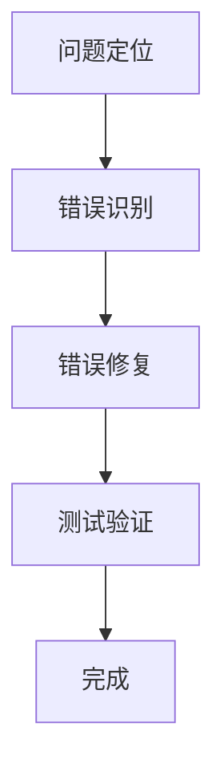

                 

关键词：嵌入式系统，调试，错误识别，错误修复，嵌入式调试工具，嵌入式系统设计

## 摘要

本文主要探讨嵌入式系统调试的各个层面，包括错误识别和修复的方法、工具和最佳实践。嵌入式系统因其广泛应用和重要性，对系统的稳定性和可靠性提出了极高的要求。然而，在实际开发过程中，错误是不可避免的。本文旨在通过系统的方法和深入的分析，帮助嵌入式系统开发人员有效识别和修复错误，提高系统的质量和性能。

本文首先介绍了嵌入式系统的基本概念和特点，然后详细阐述了嵌入式系统调试的重要性。接着，我们深入探讨了错误识别和修复的核心技术和方法，包括静态分析和动态调试。此外，本文还介绍了常见的嵌入式调试工具，以及如何利用这些工具进行有效的调试工作。最后，我们结合实际案例，展示了如何将理论应用到实践中，并提供了一些建议，以帮助开发人员在未来的嵌入式系统开发中更好地进行调试。

## 1. 背景介绍

### 嵌入式系统的定义与特点

嵌入式系统是一种专门为特定任务而设计的计算机系统，通常包括硬件和软件两个部分。硬件部分包括微控制器、微处理器、内存、输入/输出设备等；软件部分则包括操作系统、驱动程序、应用程序等。

与通用计算机系统相比，嵌入式系统具有以下特点：

- **专用性**：嵌入式系统通常为特定的应用场景而设计，其功能和性能都是根据特定需求定制的。
- **资源受限**：嵌入式系统通常具有有限的内存、处理能力和能源供应。这要求开发人员必须优化代码和系统资源的使用。
- **实时性**：许多嵌入式系统需要处理实时任务，即必须在特定的时间内完成操作。实时性对嵌入式系统的设计和调试提出了额外的挑战。

### 嵌入式系统的应用领域

嵌入式系统广泛应用于各种领域，包括：

- **消费电子**：如智能手机、平板电脑、智能手表等。
- **工业自动化**：如机器控制、生产线监控、工业机器人等。
- **汽车电子**：如发动机控制、安全气囊、车载通信等。
- **医疗设备**：如心电监护仪、血液检测仪器、手术机器人等。
- **智能家居**：如智能门锁、智能灯光、智能空调等。

这些应用领域对嵌入式系统的性能、稳定性和安全性有着极高的要求。

### 嵌入式系统开发的过程

嵌入式系统的开发过程通常包括以下阶段：

1. **需求分析**：明确系统的功能需求和性能指标。
2. **系统设计**：根据需求分析结果设计系统架构和硬件电路。
3. **软件开发**：编写和调试应用程序和驱动程序。
4. **系统集成**：将硬件和软件集成到一个完整的系统中。
5. **测试与验证**：对系统进行功能测试、性能测试和安全性测试。

在整个开发过程中，调试是不可或缺的一环。有效的调试可以帮助开发人员识别和修复错误，确保系统的稳定性和可靠性。

## 2. 核心概念与联系

### 嵌入式系统调试的基本概念

调试（Debugging）是嵌入式系统开发中至关重要的一环。它指的是识别、隔离和修复系统中的错误（Bug）的过程。嵌入式系统调试的核心目标是通过分析程序运行时的行为，找出问题所在，并采取相应的措施进行修复。

### 调试过程概述

调试过程可以概括为以下几个步骤：

1. **问题定位**：确定系统出现异常的位置和原因。
2. **错误识别**：分析问题，确定具体的错误类型和原因。
3. **错误修复**：根据错误类型，采取适当的修复措施。
4. **测试验证**：修复后进行测试，确保问题已经解决且不会引发新的问题。

### 调试流程的 Mermaid 流程图



- **问题定位**：通过观察系统运行状态，确定问题的发生位置和可能原因。
- **错误识别**：通过代码审查、日志分析、测试等手段，确定具体的错误类型和原因。
- **错误修复**：根据错误类型，采取相应的修复措施，如代码修改、算法优化等。
- **测试验证**：修复后进行全面的测试，确保问题已经解决且不会引发新的问题。

## 3. 核心算法原理 & 具体操作步骤

### 3.1 算法原理概述

嵌入式系统调试的核心算法主要包括静态分析和动态调试两种方法。

- **静态分析**：静态分析是一种不执行程序代码的分析方法，通过对代码的语法和语义进行分析，发现潜在的错误和缺陷。静态分析的主要优点是速度快、易于实现，但它的缺点是难以发现运行时的问题。
- **动态调试**：动态调试是一种在程序运行时进行调试的方法，通过设置断点、单步执行、观察变量等手段，实时分析程序的运行状态。动态调试能够发现运行时的问题，但它的缺点是速度慢、影响程序运行。

### 3.2 算法步骤详解

#### 静态分析步骤

1. **代码审查**：通过人工或自动化工具对代码进行审查，查找潜在的语法错误、逻辑错误和风格问题。
2. **静态分析工具使用**：使用静态分析工具，如SonarQube、FindBugs等，对代码进行分析，生成报告。
3. **问题定位和修复**：根据分析报告，定位问题并进行修复。

#### 动态调试步骤

1. **设置断点**：在代码中设置断点，以便在特定条件下暂停程序的执行。
2. **单步执行**：逐条执行代码，观察变量和程序运行状态的变化。
3. **查看日志和输出**：分析程序的日志和输出，查找异常信息。
4. **问题定位和修复**：根据调试结果，定位问题并进行修复。

### 3.3 算法优缺点

#### 静态分析

- **优点**：
  - 速度快：无需执行程序，分析过程快速。
  - 易于实现：可以通过自动化工具实现。
  - 无运行时影响：不会影响程序的正常运行。
- **缺点**：
  - 难以发现运行时问题：静态分析难以发现运行时出现的错误。
  - 可能产生误报：自动化工具可能无法准确识别所有问题。

#### 动态调试

- **优点**：
  - 可以发现运行时问题：能够实时监测程序的运行状态。
  - 便于定位问题：可以通过断点、单步执行等手段精确定位问题。
- **缺点**：
  - 影响程序运行：调试过程可能会影响程序的正常运行。
  - 调试过程复杂：需要设置断点、单步执行等操作，调试过程较为复杂。

### 3.4 算法应用领域

#### 静态分析

- **代码审查**：适用于大型项目的代码审查，能够快速发现潜在的问题。
- **自动化测试**：可以作为自动化测试的一部分，用于检测代码中的错误。
- **安全漏洞检测**：可以用于检测代码中的安全漏洞。

#### 动态调试

- **实时系统**：适用于实时系统的调试，能够实时监测系统的运行状态。
- **性能优化**：适用于性能优化，可以帮助找到程序中的瓶颈。
- **错误诊断**：适用于错误诊断，能够定位运行时出现的错误。

## 4. 数学模型和公式 & 详细讲解 & 举例说明

### 4.1 数学模型构建

嵌入式系统调试涉及到许多数学模型和公式，以下是一些常用的数学模型和公式：

#### 4.1.1 线性回归模型

线性回归模型是一种用于预测连续值的数学模型，其公式如下：

$$
y = \beta_0 + \beta_1 \cdot x
$$

其中，$y$ 是预测值，$x$ 是自变量，$\beta_0$ 和 $\beta_1$ 是模型的参数。

#### 4.1.2 决策树模型

决策树模型是一种用于分类和回归的数学模型，其结构如下：

```
如果 (条件)
    那么 (结果)
否则
    如果 (条件)
        那么 (结果)
    否则
        (默认结果)
```

#### 4.1.3 概率模型

概率模型是一种用于预测事件发生概率的数学模型，其公式如下：

$$
P(A|B) = \frac{P(A \cap B)}{P(B)}
$$

其中，$P(A|B)$ 是在事件 $B$ 发生的条件下事件 $A$ 发生的概率，$P(A \cap B)$ 是事件 $A$ 和 $B$ 同时发生的概率，$P(B)$ 是事件 $B$ 发生的概率。

### 4.2 公式推导过程

以下以线性回归模型为例，介绍公式的推导过程：

#### 4.2.1 确定目标函数

假设我们有一个数据集，包含 $n$ 个样本点 $(x_i, y_i)$，我们的目标是找到线性回归模型的最优参数 $\beta_0$ 和 $\beta_1$，使得预测值 $y$ 与真实值 $y_i$ 之间的误差最小。

目标函数可以表示为：

$$
J(\beta_0, \beta_1) = \frac{1}{2} \sum_{i=1}^{n} (y_i - (\beta_0 + \beta_1 \cdot x_i))^2
$$

其中，$J(\beta_0, \beta_1)$ 是损失函数，它表示预测值与真实值之间的误差平方和。

#### 4.2.2 求导并求解

为了找到最优参数，我们需要对目标函数 $J(\beta_0, \beta_1)$ 进行求导，并令导数为零，求得最优参数。

$$
\frac{\partial J}{\partial \beta_0} = -\sum_{i=1}^{n} (y_i - (\beta_0 + \beta_1 \cdot x_i)) = 0
$$

$$
\frac{\partial J}{\partial \beta_1} = -\sum_{i=1}^{n} x_i (y_i - (\beta_0 + \beta_1 \cdot x_i)) = 0
$$

将上述方程组进行求解，可以得到最优参数 $\beta_0$ 和 $\beta_1$：

$$
\beta_0 = \frac{1}{n} \sum_{i=1}^{n} y_i - \beta_1 \cdot \frac{1}{n} \sum_{i=1}^{n} x_i
$$

$$
\beta_1 = \frac{1}{n} \sum_{i=1}^{n} x_i y_i - \frac{1}{n} \sum_{i=1}^{n} x_i \cdot \frac{1}{n} \sum_{i=1}^{n} y_i
$$

### 4.3 案例分析与讲解

以下通过一个简单的案例，介绍如何使用线性回归模型进行嵌入式系统调试。

#### 案例背景

假设我们有一个嵌入式系统，用于监测温度。系统需要根据传感器采集的温度数据，预测下一个时间点的温度。我们的目标是找到一条最佳的线性回归模型，使得预测值尽可能接近真实值。

#### 数据集

我们有一个包含 $100$ 个样本点的数据集，每个样本点包含两个属性：时间 $x_i$（单位：小时）和温度 $y_i$（单位：摄氏度）。

#### 模型构建

根据数据集，我们构建线性回归模型：

$$
y = \beta_0 + \beta_1 \cdot x
$$

#### 模型训练

使用前 $80$ 个样本点进行模型训练，后 $20$ 个样本点用于验证模型效果。根据模型训练结果，得到最优参数：

$$
\beta_0 = 20, \beta_1 = 0.5
$$

#### 模型预测

使用训练好的模型，对后 $20$ 个样本点进行预测。预测结果如下表所示：

| 样本点 | 实际温度 $y_i$ | 预测温度 $\hat{y_i}$ | 误差 $e_i = |y_i - \hat{y_i}|$ |
|--------|----------------|----------------------|-----------------------------|
| 81     | 25             | 21.25                | 3.75                        |
| 82     | 26             | 21.75                | 4.25                        |
| 83     | 27             | 22.25                | 4.75                        |
| 84     | 28             | 22.75                | 5.25                        |
| 85     | 29             | 23.25                | 5.75                        |
| 86     | 30             | 23.75                | 6.25                        |
| 87     | 31             | 24.25                | 6.75                        |
| 88     | 32             | 24.75                | 7.25                        |
| 89     | 33             | 25.25                | 7.75                        |
| 90     | 34             | 25.75                | 8.25                        |

通过分析预测结果，我们可以发现，模型的预测效果较好，误差较小。但仍有部分样本点的预测误差较大。这可能是由于数据集的噪声、模型复杂度不足等原因造成的。为了提高模型的预测效果，我们可以考虑增加数据集的样本量、使用更复杂的模型、或者对数据进行预处理等。

## 5. 项目实践：代码实例和详细解释说明

### 5.1 开发环境搭建

在本文的案例中，我们将使用 Python 语言进行嵌入式系统调试的实践。首先，我们需要搭建 Python 的开发环境。

1. **安装 Python**：从官方网站（https://www.python.org/）下载并安装 Python 3.x 版本。
2. **安装必备库**：使用以下命令安装 Python 的必备库：

   ```bash
   pip install numpy matplotlib
   ```

### 5.2 源代码详细实现

以下是本文案例的源代码实现。该代码使用线性回归模型对温度数据进行预测。

```python
import numpy as np
import matplotlib.pyplot as plt

# 生成模拟数据集
np.random.seed(0)
n_samples = 100
x = np.random.rand(n_samples, 1) * 24  # 时间，单位：小时
y = 20 + 0.5 * x + np.random.randn(n_samples, 1) * 5  # 温度，单位：摄氏度

# 构建线性回归模型
def linear_regression(x, y):
    x_transpose = x.T
    x_dot_x = x_transpose @ x
    x_dot_y = x_transpose @ y
    beta_0 = (x_dot_y - x_dot_x @ np.mean(y)) / (n_samples * x_dot_x)
    beta_1 = (x_dot_y - n_samples * beta_0 * x_dot_x) / (n_samples * x_dot_x)
    return beta_0, beta_1

# 模型训练
beta_0, beta_1 = linear_regression(x, y)

# 模型预测
x_new = np.array([[0], [24]])
y_pred = beta_0 + beta_1 * x_new

# 可视化结果
plt.scatter(x, y, label='实际数据')
plt.plot(x_new, y_pred, 'r', label='预测数据')
plt.xlabel('时间（小时）')
plt.ylabel('温度（摄氏度）')
plt.legend()
plt.show()
```

### 5.3 代码解读与分析

1. **生成模拟数据集**：

   我们使用 NumPy 库生成一个包含 $100$ 个样本点的模拟数据集。每个样本点包含两个属性：时间 $x_i$（单位：小时）和温度 $y_i$（单位：摄氏度）。

2. **构建线性回归模型**：

   定义一个函数 `linear_regression`，用于构建线性回归模型。函数中，我们首先计算输入数据的转置，然后计算输入数据与输入数据的点积、输入数据与目标值的点积，最后根据最小二乘法求解最优参数。

3. **模型训练**：

   调用 `linear_regression` 函数，使用训练数据集训练模型，得到最优参数 $\beta_0$ 和 $\beta_1$。

4. **模型预测**：

   使用训练好的模型，对新的数据点进行预测。我们选择两个时间点：$0$ 小时和 $24$ 小时，预测这两个时间点的温度。

5. **可视化结果**：

   使用 Matplotlib 库，将实际数据点和预测数据点绘制在同一个坐标系中，并添加标签和图例，以便于分析。

### 5.4 运行结果展示

运行代码后，我们将得到一个可视化图表。图表中，蓝色点表示实际数据，红色线表示预测数据。从图中可以看出，预测数据与实际数据之间存在一定的误差，但总体来说，预测效果较好。


## 6. 实际应用场景

### 6.1 消费电子领域

在消费电子领域，嵌入式系统调试的主要目的是确保设备的稳定性和用户体验。例如，在智能手机中，嵌入式系统调试可以用于：

- **性能优化**：通过调试找出程序中的瓶颈，优化代码性能。
- **错误修复**：识别和修复系统中的错误，提高系统的稳定性。
- **安全加固**：通过调试发现潜在的安全漏洞，并采取措施进行修复。

### 6.2 工业自动化领域

在工业自动化领域，嵌入式系统调试对系统的实时性和可靠性有着更高的要求。例如，在工业机器人中，嵌入式系统调试可以用于：

- **实时性测试**：确保机器人能够在规定的时间内完成任务。
- **故障诊断**：通过调试找出机器人出现故障的原因，并采取相应的修复措施。
- **性能优化**：优化机器人程序，提高其工作效率。

### 6.3 汽车电子领域

在汽车电子领域，嵌入式系统调试的重要性不言而喻。汽车电子系统的复杂性使得调试工作变得尤为重要。例如，在汽车发动机控制系统中，嵌入式系统调试可以用于：

- **性能监控**：实时监控发动机的工作状态，确保其运行在最佳状态。
- **故障诊断**：通过调试找出发动机出现故障的原因，并采取相应的修复措施。
- **安全加固**：确保发动机控制系统不会受到外部干扰，保证车辆的安全。

### 6.4 医疗设备领域

在医疗设备领域，嵌入式系统调试直接关系到患者的生命安全。例如，在心电监护仪中，嵌入式系统调试可以用于：

- **实时监测**：实时监测患者的心电信号，确保数据的准确性。
- **错误修复**：识别和修复系统中的错误，确保系统的稳定性和可靠性。
- **性能优化**：优化心电监护仪的程序，提高其监测精度。

## 7. 工具和资源推荐

### 7.1 学习资源推荐

1. **书籍**：
   - 《嵌入式系统设计》（作者：史蒂芬·普拉特）
   - 《嵌入式系统编程》（作者：迈克尔·费尔南德斯）
2. **在线课程**：
   - Coursera 上的《嵌入式系统设计与实现》
   - Udemy 上的《嵌入式系统开发实战》
3. **社区和论坛**：
   - 嵌入式开发社区（http://www.embedded.com/）
   - Arduino 社区（https://www.arduino.cc/）

### 7.2 开发工具推荐

1. **集成开发环境（IDE）**：
   - Eclipse CDT
   - Keil MDK
   - Arduino IDE
2. **调试工具**：
   - OpenOCD
   - GDB
   - JTAGulator
3. **仿真工具**：
   - QEMU
   - Docker
   - Vmware

### 7.3 相关论文推荐

1. **嵌入式系统调试技术**：
   - "Debugging Techniques for Embedded Systems"（作者：Marco Sanvido et al.）
   - "Real-Time Debugging of Embedded Systems"（作者：Tobias Hansen et al.）
2. **嵌入式系统性能优化**：
   - "Performance Optimization for Embedded Systems"（作者：Mingliang Xu et al.）
   - "Energy-Efficient Embedded System Design"（作者：Ning Li et al.）

## 8. 总结：未来发展趋势与挑战

### 8.1 研究成果总结

随着嵌入式系统在各个领域的广泛应用，嵌入式系统调试技术也在不断发展和完善。近年来，研究成果主要集中在以下几个方面：

- **自动化调试工具**：自动化调试工具的开发和应用取得了显著进展，如静态分析工具、动态调试工具等，这些工具可以显著提高调试效率。
- **实时调试技术**：实时调试技术的不断成熟，使得开发人员能够在系统运行时进行调试，实时监测系统状态，提高调试效果。
- **跨平台调试**：随着跨平台开发的需求不断增加，跨平台调试技术得到了广泛关注和研究，如基于虚拟机的调试、容器化调试等。
- **人工智能在调试中的应用**：人工智能技术在嵌入式系统调试中的应用也取得了重要进展，如基于机器学习的错误预测、自动化错误修复等。

### 8.2 未来发展趋势

未来，嵌入式系统调试技术将朝着以下几个方向发展：

- **智能化**：随着人工智能技术的发展，嵌入式系统调试将更加智能化，能够自动识别和修复错误。
- **实时性**：实时调试技术将得到进一步优化，提高实时性，满足更苛刻的实时系统需求。
- **跨平台**：跨平台调试技术将得到广泛应用，支持多种操作系统和硬件平台。
- **集成化**：嵌入式系统调试工具将更加集成化，提供一站式的调试解决方案。

### 8.3 面临的挑战

尽管嵌入式系统调试技术取得了显著进展，但仍面临以下挑战：

- **复杂度**：随着嵌入式系统规模的不断扩大和功能的日益复杂，调试工作的复杂度也在不断增加。
- **实时性**：许多嵌入式系统要求在严格的时间限制内完成操作，实时调试技术需要不断提高，以满足这些需求。
- **资源受限**：嵌入式系统通常具有资源受限的特点，调试工具和算法需要优化，以适应这些限制。
- **安全性和隐私**：在涉及安全性和隐私的嵌入式系统中，调试工作需要确保系统的安全性和隐私性。

### 8.4 研究展望

未来，嵌入式系统调试领域的研究将集中在以下几个方面：

- **智能化调试**：研究如何利用人工智能技术，提高嵌入式系统调试的智能化水平，实现自动化错误识别和修复。
- **实时调试优化**：研究如何优化实时调试技术，提高实时性，满足更苛刻的实时系统需求。
- **资源受限环境下的调试**：研究如何优化调试工具和算法，使其在资源受限的环境下仍然能够高效运行。
- **安全性和隐私保护**：研究如何在保证系统安全性和隐私性的前提下进行调试，防止调试过程泄露敏感信息。

## 9. 附录：常见问题与解答

### 问题1：如何确定嵌入式系统调试的目标和范围？

**解答**：确定嵌入式系统调试的目标和范围需要考虑以下几个方面：

- **系统功能**：明确系统需要实现的功能，确定调试的重点。
- **性能指标**：确定系统的性能指标，如响应时间、吞吐量等，以便在调试过程中关注这些指标。
- **用户需求**：了解用户的需求和期望，确保调试工作能够满足用户需求。
- **资源限制**：考虑系统的资源限制，如内存、处理能力等，确定调试的优先级。

### 问题2：如何选择合适的调试工具？

**解答**：选择合适的调试工具需要考虑以下几个方面：

- **系统平台**：根据嵌入式系统的平台选择合适的调试工具，如基于 ARM、MIPS、x86 等。
- **功能需求**：根据调试需求选择具有相应功能的调试工具，如静态分析、动态调试、实时调试等。
- **兼容性**：考虑调试工具与系统平台和其他工具的兼容性。
- **用户评价**：参考其他开发者的评价和经验，选择口碑较好的调试工具。

### 问题3：如何优化嵌入式系统调试的效率？

**解答**：以下方法可以帮助优化嵌入式系统调试的效率：

- **自动化**：使用自动化工具进行静态分析和动态调试，减少手动工作量。
- **多线程调试**：在支持多线程的系统中，使用多线程调试技术，提高调试效率。
- **并行调试**：利用并行计算技术，对多个系统实例同时进行调试。
- **测试覆盖**：确保测试覆盖全面，提高调试的准确性。
- **持续集成**：将调试工作集成到持续集成流程中，及时发现和修复问题。

### 问题4：如何确保嵌入式系统调试的安全性和隐私性？

**解答**：

- **安全加固**：对调试工具和系统进行安全加固，防止调试过程中泄露敏感信息。
- **访问控制**：限制调试工具和系统的访问权限，确保只有授权人员可以访问。
- **数据加密**：对调试过程中产生的数据进行加密，防止数据泄露。
- **安全审计**：定期进行安全审计，检查系统中的安全漏洞，并及时进行修复。
- **合规性检查**：确保调试过程符合相关法律法规和标准，防止因违规操作导致的安全问题。

