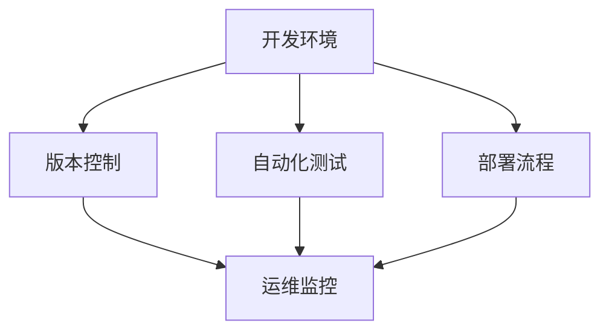

                 

关键词：工具使用、应用场景、效率、性能、最佳实践、案例分析

> 摘要：本文探讨了工具使用机制在不同应用场景中的效果，从技术细节、实践案例以及未来展望等多方面展开讨论。文章旨在为开发者提供关于工具选择与使用的深度见解，帮助他们优化工作流程，提高开发效率。

## 1. 背景介绍

在当今信息化社会，工具的使用已成为软件开发和IT运营中不可或缺的一部分。从代码编辑器、版本控制系统到测试工具、部署平台，各种工具在提升开发效率、保证代码质量和项目进度方面发挥着重要作用。然而，不同的工具在不同的应用场景中可能会有不同的效果。本文将探讨工具使用机制在不同应用场景中的效果，旨在为开发者提供有价值的参考。

### 1.1 工具的普遍性和必要性

工具的普遍性体现在其广泛应用于软件开发和IT运营的各个环节。无论是编码、测试、调试，还是部署、监控、运维，都离不开合适的工具支持。这些工具不仅提高了开发效率，还显著降低了错误率，提高了软件质量。

### 1.2 应用场景的多样性

应用场景的多样性意味着不同项目、不同团队甚至同一团队在不同阶段可能需要不同类型的工具。例如，在敏捷开发中，团队可能需要使用JIRA、Trello等项目管理工具来确保项目进度的透明和可控；而在大数据处理中，则可能需要使用Hadoop、Spark等大数据处理框架来高效处理海量数据。

## 2. 核心概念与联系

在讨论工具使用机制之前，我们需要了解一些核心概念，这些概念构成了工具使用的基础。以下是几个关键概念及其相互联系：

### 2.1 开发环境

开发环境是指编程人员开发软件所需的基础设施，包括操作系统、编程语言、代码编辑器、构建工具等。

### 2.2 版本控制

版本控制是一种管理代码变更的机制，通过它，开发者可以跟踪代码的历史变化，协作开发，并确保代码的稳定性和一致性。

### 2.3 自动化测试

自动化测试是通过脚本或工具自动执行测试用例，以验证软件功能是否按预期工作的过程。

### 2.4 部署流程

部署流程是指将软件从开发环境转移到生产环境的过程，包括编译、打包、部署、配置等步骤。

### 2.5 运维监控

运维监控是指对软件系统运行状态进行实时监控和性能分析，以确保系统的稳定运行。

以下是这些概念之间的Mermaid流程图表示：



### 2.6 工具选择的影响因素

选择合适的工具对于项目的成功至关重要。以下是几个影响工具选择的主要因素：

- **项目需求**：项目的具体需求决定了所需的工具类型。
- **团队技能**：团队成员对工具的熟悉程度和技能水平会影响工具的选择。
- **性能要求**：工具的性能直接关系到项目效率。
- **生态支持**：工具的社区活跃度和生态支持力度也是选择的重要因素。

## 3. 核心算法原理 & 具体操作步骤

### 3.1 算法原理概述

在讨论工具使用机制时，算法原理是不可忽视的部分。以下是一个常见的算法原理概述，用于说明如何基于特定需求选择和实现合适的工具。

#### 3.1.1 算法选择标准

- **效率**：算法的时间复杂度和空间复杂度。
- **可靠性**：算法的准确性和稳定性。
- **可扩展性**：算法在处理大规模数据时的性能。

#### 3.1.2 实现步骤

1. **需求分析**：明确项目需求，确定所需功能。
2. **算法调研**：研究相关算法，评估其优缺点。
3. **工具选择**：根据算法特性选择合适的工具。
4. **算法实现**：在工具环境中实现算法。
5. **性能评估**：测试算法性能，优化调整。

### 3.2 算法步骤详解

#### 3.2.1 需求分析

需求分析是算法设计的起点。通过详细分析项目需求，明确算法需要解决的具体问题。

#### 3.2.2 算法调研

算法调研是了解各种算法的过程。通过对比分析，选择最适合项目需求的算法。

#### 3.2.3 工具选择

根据算法特点，选择支持该算法的工具。例如，选择支持特定编程语言的IDE，或者选择支持特定算法的框架。

#### 3.2.4 算法实现

在工具环境中，根据算法原理和需求，实现算法的具体代码。

#### 3.2.5 性能评估

通过测试，评估算法的性能。如果性能不满足要求，则进行优化调整。

### 3.3 算法优缺点

#### 优点

- **效率提升**：通过算法优化，提高处理速度和资源利用率。
- **可靠性增强**：通过算法和工具的结合，提高软件的稳定性和准确性。
- **可维护性提高**：良好的算法和工具选择使得代码易于维护和扩展。

#### 缺点

- **学习成本**：选择和掌握合适的工具需要一定时间。
- **性能瓶颈**：某些算法可能在特定情况下表现不佳。
- **依赖性**：过度依赖特定工具可能导致迁移成本增加。

### 3.4 算法应用领域

算法原理和工具选择在多个领域有广泛应用，包括但不限于：

- **数据科学**：使用机器学习算法处理大规模数据。
- **软件工程**：自动化测试和版本控制优化开发流程。
- **云计算**：分布式算法和工具提高云服务性能。
- **网络安全**：加密算法和工具保障数据安全。

## 4. 数学模型和公式 & 详细讲解 & 举例说明

### 4.1 数学模型构建

数学模型在算法设计和工具选择中起着关键作用。以下是一个简单的数学模型示例：

#### 4.1.1 时间复杂度模型

假设算法在处理输入数据时需要执行n次基本操作，时间复杂度T(n)可以表示为：

$$
T(n) = O(n)
$$

#### 4.1.2 空间复杂度模型

假设算法在处理输入数据时需要占用S(n)的额外内存空间，空间复杂度S(n)可以表示为：

$$
S(n) = O(n)
$$

### 4.2 公式推导过程

以快速排序算法为例，其平均时间复杂度和空间复杂度的推导过程如下：

#### 4.2.1 平均时间复杂度推导

假设输入数组长度为n，快速排序算法的平均时间复杂度T(n)可以通过递归公式推导：

$$
T(n) = T(n/2) + T(3n/4) + n
$$

推导后得到：

$$
T(n) = O(n\log n)
$$

#### 4.2.2 空间复杂度推导

快速排序算法的空间复杂度主要受递归深度影响，空间复杂度S(n)可以表示为：

$$
S(n) = O(\log n)
$$

### 4.3 案例分析与讲解

以下是一个快速排序算法的Python实现示例，以及其性能分析：

```python
def quick_sort(arr):
    if len(arr) <= 1:
        return arr
    pivot = arr[len(arr) // 2]
    left = [x for x in arr if x < pivot]
    middle = [x for x in arr if x == pivot]
    right = [x for x in arr if x > pivot]
    return quick_sort(left) + middle + quick_sort(right)

# 测试
arr = [3, 6, 8, 10, 1, 2, 1]
sorted_arr = quick_sort(arr)
print(sorted_arr)
```

#### 性能分析

- **时间复杂度**：O(n\*log n)
- **空间复杂度**：O(log n)

## 5. 项目实践：代码实例和详细解释说明

### 5.1 开发环境搭建

以一个简单的Web应用项目为例，以下是开发环境搭建步骤：

1. 安装操作系统（如Ubuntu 20.04）。
2. 安装Python 3.8及以上版本。
3. 安装Web服务器（如Apache或Nginx）。
4. 安装数据库（如MySQL）。
5. 安装版本控制系统（如Git）。

### 5.2 源代码详细实现

以下是一个简单的Web应用代码实例，使用Flask框架：

```python
from flask import Flask, jsonify

app = Flask(__name__)

@app.route('/api/hello', methods=['GET'])
def hello():
    return jsonify(message='Hello, World!')

if __name__ == '__main__':
    app.run(debug=True)
```

### 5.3 代码解读与分析

- **Flask框架**：用于构建Web应用。
- **路由**：定义API端点。
- **请求处理**：响应HTTP请求。

### 5.4 运行结果展示

运行代码后，访问`http://localhost:5000/api/hello`，返回JSON格式的响应：

```json
{
  "message": "Hello, World!"
}
```

## 6. 实际应用场景

### 6.1 数据科学领域

数据科学家在处理大规模数据时，通常需要使用Pandas、NumPy等工具进行数据处理和分析。以下是一个数据处理流程：

1. 数据清洗：使用Pandas处理缺失值、异常值等。
2. 数据分析：使用NumPy进行数值计算。
3. 数据可视化：使用Matplotlib、Seaborn等工具进行数据可视化。

### 6.2 软件开发领域

软件开发团队在项目开发过程中，通常需要使用Git进行版本控制，Jenkins进行自动化构建和部署。以下是一个典型流程：

1. 源代码管理：使用Git进行代码版本管理。
2. 自动化测试：使用Selenium进行Web应用自动化测试。
3. 部署：使用Jenkins实现自动化部署。

### 6.3 云计算领域

云计算服务提供商在提供云服务时，通常需要使用Kubernetes进行容器编排，Prometheus进行监控和报警。以下是一个典型流程：

1. 容器化：使用Docker将应用容器化。
2. 容器编排：使用Kubernetes进行容器编排和管理。
3. 监控与报警：使用Prometheus和Grafana进行实时监控和报警。

## 7. 工具和资源推荐

### 7.1 学习资源推荐

- 《深入理解计算机系统》
- 《算法导论》
- 《Web开发实战》
- 《Docker实战》

### 7.2 开发工具推荐

- PyCharm：Python开发环境。
- Visual Studio Code：通用开发环境。
- Jenkins：自动化构建和部署工具。
- Kubernetes：容器编排工具。

### 7.3 相关论文推荐

- "A Mathematical Theory of Communication"（香农信息论）
- "An Empirical Study of Software Failures"（软件故障研究）
- "The Art of Debugging"（调试艺术）

## 8. 总结：未来发展趋势与挑战

### 8.1 研究成果总结

本文从多个角度探讨了工具使用机制在不同应用场景中的效果，包括开发环境、版本控制、自动化测试、部署流程和运维监控等。通过具体的算法原理讲解、数学模型推导、项目实践和实际应用场景分析，展示了工具选择和使用的最佳实践。

### 8.2 未来发展趋势

随着技术的不断进步，工具的使用机制将更加智能化、自动化和集成化。例如，基于机器学习的自动化工具将能够更好地适应不同应用场景，提高开发效率。

### 8.3 面临的挑战

- **工具集成**：如何实现不同工具之间的无缝集成，提高开发效率。
- **安全性**：如何确保工具和系统的安全性，防止数据泄露。
- **性能优化**：如何优化工具性能，以满足高并发、大数据等应用需求。

### 8.4 研究展望

未来研究应重点关注工具智能化、自动化和集成化的发展方向，探索更加高效、安全的工具使用机制，以适应不断变化的应用需求。

## 9. 附录：常见问题与解答

### 9.1 工具选择标准

- **需求分析**：根据项目需求选择合适的工具。
- **性能要求**：考虑工具的性能是否满足项目需求。
- **生态支持**：评估工具的社区活跃度和生态支持力度。

### 9.2 工具使用技巧

- **学习曲线**：选择熟悉或易于学习的工具。
- **最佳实践**：遵循工具的最佳实践指南，提高使用效率。
- **文档支持**：充分利用工具的官方文档和社区资源。

### 9.3 项目实践建议

- **模块化开发**：将项目拆分为模块，便于管理和维护。
- **持续集成**：实现持续集成和持续交付，提高开发效率。
- **测试驱动开发**：以测试驱动开发，确保代码质量。

---

作者：禅与计算机程序设计艺术 / Zen and the Art of Computer Programming
----------------------------------------------------------------


