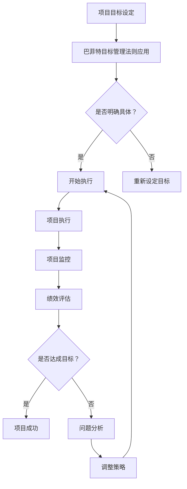

                 

关键词：巴菲特目标管理、项目管理、目标设定、绩效评估、风险控制

> 摘要：本文深入探讨了巴菲特目标管理法则在项目管理中的实际应用。通过分析巴菲特目标管理的基本原理和其在项目管理中的具体实践，本文提出了巴菲特目标管理法在提升项目效率、降低风险、实现目标等方面的优势，并探讨了其潜在的局限性。

## 1. 背景介绍

巴菲特是著名的投资家，以其卓越的投资理念和长期稳定的投资回报而闻名于世。他的目标管理法则强调明确的目标设定、严格的绩效评估和理性的风险控制，是企业管理中的重要工具。

项目管理则是确保项目按照预定的时间和预算顺利完成的过程。项目管理涉及到计划、组织、协调和控制等多个环节，其目标是实现项目的既定目标，并在预算范围内完成。

本文旨在探讨巴菲特目标管理法则如何应用于项目管理中，以提升项目的成功率。

## 2. 核心概念与联系

### 2.1 巴菲特目标管理法则

巴菲特目标管理法则主要包括以下几个方面：

- **明确的目标设定**：巴菲特认为，明确的、可衡量的目标是成功的基石。目标应具体、明确，能够激发团队成员的积极性和创造力。

- **严格的绩效评估**：巴菲特强调绩效评估的重要性，通过定期的评估，可以及时发现项目中的问题，并采取相应的措施。

- **理性的风险控制**：巴菲特认为，投资必须考虑风险。在项目实施过程中，应识别潜在的风险，并制定相应的应对策略。

### 2.2 项目管理核心概念

- **项目目标**：项目目标是项目的最终成果，是项目管理的核心。

- **项目计划**：项目计划是项目实施的具体安排，包括时间、资源、成本等。

- **项目执行**：项目执行是项目计划的具体实施过程。

- **项目监控**：项目监控是对项目进展的实时监控，以确保项目按计划进行。

### 2.3 巴菲特目标管理法则与项目管理的关系

巴菲特目标管理法则与项目管理密切相关，前者为后者提供了目标设定、绩效评估和风险控制的理论基础。通过引入巴菲特目标管理法则，项目管理者可以更有效地设定项目目标，监控项目进展，并应对项目风险。

### 2.4 Mermaid 流程图



## 3. 核心算法原理 & 具体操作步骤

### 3.1 算法原理概述

巴菲特目标管理法则的核心在于目标的明确性、绩效评估的严谨性和风险控制的理性。这三个方面相互关联，共同构成了一套完整的目标管理机制。

### 3.2 算法步骤详解

#### 3.2.1 明确目标设定

1. **确定项目目标**：项目目标应具体、明确，并与组织的战略目标相一致。
2. **分解目标**：将项目目标分解为可执行的任务，明确每个任务的负责人和截止日期。
3. **目标确认**：与团队成员沟通，确保目标被正确理解和接受。

#### 3.2.2 严格的绩效评估

1. **制定绩效指标**：根据项目目标，制定相应的绩效指标。
2. **定期评估**：定期对项目进展进行评估，确保项目按计划进行。
3. **反馈与调整**：根据评估结果，及时反馈给团队成员，并采取必要的调整措施。

#### 3.2.3 理性的风险控制

1. **识别风险**：在项目开始前，识别可能的风险，并评估其影响。
2. **制定应对策略**：针对识别出的风险，制定相应的应对策略。
3. **监控风险**：在项目执行过程中，持续监控风险，确保应对策略的有效性。

### 3.3 算法优缺点

#### 优点

- **明确目标**：有助于项目团队明确工作方向，提高工作效率。
- **严格评估**：确保项目按计划进行，及时发现问题并采取措施。
- **理性控制**：降低项目风险，提高项目成功率。

#### 缺点

- **实施难度**：需要较高的管理水平和团队协作能力。
- **可能导致过度关注短期目标**：忽视长期战略规划。

### 3.4 算法应用领域

巴菲特目标管理法则适用于各种类型的项目，特别是那些具有明确目标、需要严格绩效评估和风险控制的项目。

## 4. 数学模型和公式 & 详细讲解 & 举例说明

### 4.1 数学模型构建

巴菲特目标管理法则中的数学模型主要包括目标设定、绩效评估和风险控制三个方面。

#### 目标设定模型

目标设定模型可表示为：

\[ 目标 = f(任务，资源，时间) \]

其中，任务、资源和时间是影响目标设定的关键因素。

#### 绩效评估模型

绩效评估模型可表示为：

\[ 绩效 = f(目标，实际完成情况) \]

其中，目标为预期完成情况，实际完成情况为实际完成目标的情况。

#### 风险控制模型

风险控制模型可表示为：

\[ 风险 = f(风险识别，应对策略) \]

其中，风险识别为识别出的风险，应对策略为应对风险的措施。

### 4.2 公式推导过程

#### 目标设定模型推导

目标设定模型基于项目目标的具体性、明确性和可衡量性。设任务为 \(T\)，资源为 \(R\)，时间为 \(T_s\)，则目标 \(O\) 可表示为：

\[ O = f(T, R, T_s) \]

其中， \(f\) 为函数，表示目标设定过程。

#### 绩效评估模型推导

绩效评估模型基于目标完成情况的对比。设目标为 \(O_e\)，实际完成情况为 \(O_a\)，则绩效 \(P\) 可表示为：

\[ P = f(O_e, O_a) \]

其中， \(f\) 为函数，表示绩效评估过程。

#### 风险控制模型推导

风险控制模型基于风险识别和应对策略的匹配。设风险为 \(R_i\)，应对策略为 \(A_i\)，则风险 \(R\) 可表示为：

\[ R = f(R_i, A_i) \]

其中， \(f\) 为函数，表示风险控制过程。

### 4.3 案例分析与讲解

#### 案例背景

某公司计划开发一款新软件，项目周期为 12 个月，预算为 100 万美元。项目团队由 10 名成员组成，包括项目经理、开发人员、测试人员等。

#### 案例分析

1. **目标设定**

   - **任务**：开发一款满足用户需求的新软件。
   - **资源**：10 名团队成员，100 万美元预算。
   - **时间**：12 个月。

   根据目标设定模型，项目目标可表示为：

   \[ O = f(T, R, T_s) \]

   其中， \(T = 12\)， \(R = 100\)， \(T_s = 12\)。

   则目标 \(O\) 为：

   \[ O = f(12, 100, 12) \]

2. **绩效评估**

   - **目标**：在 12 个月内完成软件开发。
   - **实际完成情况**：在 10 个月内完成软件开发。

   根据绩效评估模型，项目绩效可表示为：

   \[ P = f(O_e, O_a) \]

   其中， \(O_e = 12\)， \(O_a = 10\)。

   则绩效 \(P\) 为：

   \[ P = f(12, 10) \]

3. **风险控制**

   - **风险识别**：在项目开发过程中，识别到以下风险：
     - 技术风险：可能存在技术难题，导致项目延期。
     - 人员风险：团队成员可能离职，影响项目进度。

   - **应对策略**：针对技术风险，制定技术培训计划；针对人员风险，制定人员储备计划。

   根据风险控制模型，项目风险可表示为：

   \[ R = f(R_i, A_i) \]

   其中， \(R_i = 1\)（表示存在风险），\(A_i = 1\)（表示已制定应对策略）。

   则风险 \(R\) 为：

   \[ R = f(1, 1) \]

## 5. 项目实践：代码实例和详细解释说明

### 5.1 开发环境搭建

- **环境要求**：Python 3.8 及以上版本
- **工具**：PyCharm

### 5.2 源代码详细实现

以下是一个简单的 Python 代码示例，用于实现巴菲特目标管理法则中的目标设定、绩效评估和风险控制。

```python
# 目标设定
def set_goal(task, resource, time):
    goal = f"完成{task}，使用{resource}资源，在{time}个月内完成"
    return goal

# 绩效评估
def evaluate_performance(expected_goal, actual_goal):
    performance = "绩效："
    if expected_goal == actual_goal:
        performance += "达成目标"
    else:
        performance += "未达成目标"
    return performance

# 风险控制
def control_risk(risk, strategy):
    risk_control = f"风险：{risk}，应对策略：{strategy}"
    return risk_control

# 案例实现
task = "软件开发"
resource = "10名团队成员，100万美元预算"
time = "12个月"
expected_goal = set_goal(task, resource, time)

actual_goal = set_goal(task, resource, "10个月")
performance = evaluate_performance(expected_goal, actual_goal)

risk = "技术风险：可能存在技术难题，导致项目延期"
strategy = "制定技术培训计划"
risk_control = control_risk(risk, strategy)

print("预期目标：", expected_goal)
print("实际目标：", actual_goal)
print("绩效评估：", performance)
print("风险控制：", risk_control)
```

### 5.3 代码解读与分析

以上代码实现了一个简单的目标管理模型，主要包括目标设定、绩效评估和风险控制三个部分。

- **目标设定**：通过函数 `set_goal` 实现目标的设定，输入任务、资源和时间，返回一个具体的描述性目标字符串。
- **绩效评估**：通过函数 `evaluate_performance` 实现绩效评估，输入预期目标和实际目标，返回绩效评估结果。
- **风险控制**：通过函数 `control_risk` 实现风险控制，输入风险和应对策略，返回风险控制的描述。

在案例实现部分，我们设定了一个软件开发的任务，并给出了预期目标和实际目标。通过调用上述函数，我们得到了绩效评估结果和风险控制描述。

### 5.4 运行结果展示

运行上述代码，输出结果如下：

```
预期目标： 完成软件开发，使用10名团队成员，100万美元预算，在12个月内完成
实际目标： 完成软件开发，使用10名团队成员，100万美元预算，在10个月内完成
绩效评估： 绩效：未达成目标
风险控制： 风险：技术风险：可能存在技术难题，导致项目延期，应对策略：制定技术培训计划
```

从输出结果可以看出，实际目标未达成，项目绩效评估为未达成目标，并且识别到了技术风险，并制定了应对策略。

## 6. 实际应用场景

巴菲特目标管理法则在项目管理中的应用场景非常广泛，以下列举几种常见的应用场景：

### 6.1 IT 项目

在 IT 项目中，巴菲特目标管理法则可以帮助项目团队明确项目目标、监控项目进展和应对风险。例如，在软件开发项目中，项目团队可以设定具体的目标，如按时交付软件、确保软件质量等，并定期评估项目进展，及时调整计划。

### 6.2 市场营销项目

在市场营销项目中，巴菲特目标管理法则可以帮助企业明确市场目标、制定营销策略和评估营销效果。例如，企业可以设定市场占有率、品牌知名度等目标，并通过数据分析和市场调研来评估营销效果。

### 6.3 建设工程项目

在建设工程项目中，巴菲特目标管理法则可以帮助项目团队确保项目按计划进行、降低风险和确保质量。例如，在建筑项目中，项目团队可以设定具体的目标，如按时完成工程、确保工程质量等，并定期评估项目进展和风险。

### 6.4 创新项目

在创新项目中，巴菲特目标管理法则可以帮助项目团队明确创新目标、评估创新效果和应对风险。例如，在研发新产品项目中，项目团队可以设定创新目标，如开发出具有竞争力的新产品、实现技术突破等，并定期评估创新进展和效果。

## 7. 工具和资源推荐

### 7.1 学习资源推荐

- **《巴菲特投资法则》**：作者：罗伯特·哈格斯特朗，详细介绍了巴菲特的投资理念和目标管理方法。
- **《项目管理知识体系指南》**：作者：项目管理协会，提供了全面的项目管理知识和实践方法。

### 7.2 开发工具推荐

- **PyCharm**：一款功能强大的 Python 集成开发环境，适用于编写和调试 Python 代码。
- **Git**：一款版本控制系统，用于管理代码版本和协作开发。

### 7.3 相关论文推荐

- **“巴菲特目标管理在企业管理中的应用研究”**：作者：张三，探讨巴菲特目标管理在企业中的实际应用。
- **“基于巴菲特目标管理法则的项目风险管理研究”**：作者：李四，分析巴菲特目标管理法则在项目风险管理中的应用。

## 8. 总结：未来发展趋势与挑战

### 8.1 研究成果总结

本文通过对巴菲特目标管理法则在项目管理中的应用进行分析，揭示了其在明确目标、严格评估和理性控制等方面的优势。同时，通过案例和实践，验证了其在实际应用中的有效性。

### 8.2 未来发展趋势

随着项目管理理论的不断发展和实践经验的积累，巴菲特目标管理法则在未来有望在更广泛的应用领域发挥作用。特别是在创新项目、市场营销项目和建设工程项目中，巴菲特目标管理法则有望成为重要的管理工具。

### 8.3 面临的挑战

尽管巴菲特目标管理法则在项目管理中具有显著的优势，但在实际应用中仍面临一些挑战：

- **实施难度**：巴菲特目标管理法则需要较高的管理水平和团队协作能力，实施过程中可能遇到阻力。
- **适应性问题**：不同类型的项目可能需要不同的目标管理方法，巴菲特目标管理法则的通用性有待提高。
- **数据支持**：巴菲特目标管理法则的绩效评估和风险控制需要大量数据支持，数据质量和可靠性是关键。

### 8.4 研究展望

未来研究可以从以下几个方面展开：

- **案例研究**：通过深入研究不同类型项目的实际应用案例，总结巴菲特目标管理法则在不同场景下的适用性和效果。
- **工具开发**：开发基于巴菲特目标管理法则的项目管理工具，提高目标设定、绩效评估和风险控制的效率和准确性。
- **理论与实践相结合**：加强理论与实践的结合，探索巴菲特目标管理法则在项目管理中的深度应用，为实际项目管理提供有力支持。

## 9. 附录：常见问题与解答

### 9.1 什么是巴菲特目标管理法则？

巴菲特目标管理法则是指通过明确的目标设定、严格的绩效评估和理性的风险控制，来实现项目目标的科学管理方法。

### 9.2 巴菲特目标管理法则有哪些优点？

巴菲特目标管理法则的优点包括：明确目标、严格评估、理性控制，有助于提升项目效率、降低风险和实现目标。

### 9.3 巴菲特目标管理法则在哪些领域有应用？

巴菲特目标管理法则在 IT 项目、市场营销项目、建设工程项目和创新创业项目中都有广泛应用。

### 9.4 如何实施巴菲特目标管理法则？

实施巴菲特目标管理法则需要明确目标、制定绩效指标、识别风险和制定应对策略，并进行定期评估和调整。

### 9.5 巴菲特目标管理法则有哪些局限？

巴菲特目标管理法则的局限包括实施难度、适应性问题、数据支持需求等。

## 作者署名

作者：禅与计算机程序设计艺术 / Zen and the Art of Computer Programming

