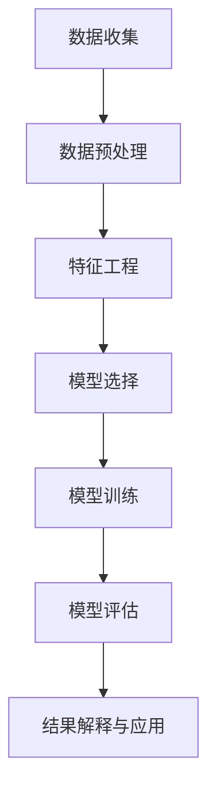

                 

关键词：平台经济，数据挖掘，数据价值，潜在价值，算法原理，数学模型，项目实践，应用场景，未来展望。

## 摘要

在数字化时代，平台经济已经成为推动经济增长的重要引擎。平台经济的核心在于数据，而数据的价值挖掘则是实现平台持续发展的关键。本文将深入探讨平台经济中数据价值挖掘的方法和策略，从算法原理、数学模型、项目实践等多个维度进行分析，旨在为企业和开发者提供有价值的参考和指导。

## 1. 背景介绍

随着互联网技术的飞速发展，平台经济已经成为全球经济的重要组成部分。从电商、社交媒体到金融科技，平台经济的模式不断丰富，形式多样。然而，平台经济的核心是数据。数据不仅是平台运营的基础，也是企业竞争的关键资源。因此，如何有效地挖掘和利用数据，成为平台经济面临的重要课题。

数据价值挖掘（Data Mining）是指从大量数据中提取出有价值的信息和知识的过程。它涉及到多个学科，包括计算机科学、统计学、机器学习和数据可视化等。在平台经济中，数据价值挖掘的意义重大，主要体现在以下几个方面：

1. **市场洞察**：通过对用户行为数据的分析，平台可以更准确地了解用户需求，优化产品和服务。
2. **风险管理**：通过挖掘金融交易数据，平台可以识别潜在风险，降低运营风险。
3. **个性化推荐**：基于用户历史行为数据，平台可以实现个性化推荐，提高用户满意度和忠诚度。
4. **商业决策**：通过对市场数据的分析，平台可以制定更科学的商业策略，提高市场竞争力。

## 2. 核心概念与联系

在探讨数据价值挖掘之前，我们需要了解一些核心概念，包括数据挖掘的基本流程、关键技术和应用领域。

### 2.1 数据挖掘的基本流程

数据挖掘的基本流程通常包括以下几个步骤：

1. **数据收集**：收集各种来源的数据，如用户行为数据、交易数据、社交媒体数据等。
2. **数据预处理**：清洗和整理数据，去除噪声和冗余，保证数据质量。
3. **特征工程**：从原始数据中提取出对挖掘任务有帮助的特征。
4. **模型选择**：选择合适的挖掘算法和模型，如分类、聚类、关联规则等。
5. **模型训练**：使用训练数据集对模型进行训练。
6. **模型评估**：使用测试数据集对模型进行评估和优化。
7. **结果解释与应用**：解释挖掘结果，并应用到实际业务中。

### 2.2 关键技术

数据挖掘涉及多种关键技术，包括：

1. **机器学习**：通过训练模型来预测和分类数据。
2. **深度学习**：利用神经网络进行更复杂的特征提取和模型训练。
3. **统计学**：使用统计学方法进行数据分析和模型评估。
4. **数据可视化**：将挖掘结果以图形化的方式呈现，帮助人们更好地理解和应用。
5. **自然语言处理**：从文本数据中提取信息和知识。

### 2.3 应用领域

数据挖掘在多个领域有着广泛的应用，包括：

1. **电子商务**：通过分析用户行为数据，实现个性化推荐和精准营销。
2. **金融**：通过挖掘交易数据，识别欺诈行为和信用风险。
3. **医疗**：通过分析患者数据，发现疾病规律和制定个性化治疗方案。
4. **交通**：通过分析交通数据，优化交通流量和调度。

### 2.4 Mermaid 流程图

以下是数据挖掘的基本流程的 Mermaid 流程图：



## 3. 核心算法原理 & 具体操作步骤

### 3.1 算法原理概述

数据挖掘的核心算法包括分类、聚类、关联规则挖掘等。这里以关联规则挖掘为例进行介绍。

关联规则挖掘是一种寻找数据集中项目之间频繁出现的关联模式的方法。它通常使用支持度（Support）和置信度（Confidence）两个指标来评估规则的重要性。

- **支持度**：一个规则在所有数据中的出现频率。
- **置信度**：一个规则的后件在规则的前件出现时出现的频率。

### 3.2 算法步骤详解

关联规则挖掘的基本步骤包括：

1. **数据预处理**：将原始数据转换成适合挖掘的形式，如将文本数据转换为词频矩阵。
2. **频繁项集生成**：找到所有支持度大于最小支持度的项集。
3. **规则生成**：从频繁项集中生成关联规则。
4. **规则评估**：计算每个规则的置信度，过滤掉不重要的规则。
5. **结果解释**：对挖掘结果进行解释和应用。

### 3.3 算法优缺点

- **优点**：
  - 能够发现数据中的隐含关系。
  - 适用于多种类型的数据，如事务数据、文本数据等。
- **缺点**：
  - 需要大量的计算资源。
  - 对异常值和噪声敏感。

### 3.4 算法应用领域

关联规则挖掘在多个领域有着广泛的应用，如：

1. **市场分析**：通过挖掘购买数据，发现商品之间的关联，帮助商家制定营销策略。
2. **推荐系统**：通过挖掘用户行为数据，发现用户之间的兴趣关联，实现个性化推荐。
3. **社交网络**：通过挖掘用户之间的互动数据，发现社交网络中的关键节点和群体。

## 4. 数学模型和公式 & 详细讲解 & 举例说明

### 4.1 数学模型构建

关联规则挖掘的数学模型主要包括支持度、置信度和提升度等指标。

- **支持度**：设 \(I\) 为数据集中的所有事务，\(X\) 和 \(Y\) 分别为两个项集，\(Support(X \cup Y)\) 表示 \(X\) 和 \(Y\) 同时出现的频率。
- **置信度**：\(Confidence(X \rightarrow Y) = \frac{Support(X \cup Y)}{Support(X)}\)。
- **提升度**：\(Lift(X \rightarrow Y) = \frac{Support(X \cup Y)}{Support(X)} / \frac{Support(Y)}{Total}\)，用于评估规则的重要性。

### 4.2 公式推导过程

以支持度和置信度的推导为例：

1. **支持度**：
   $$ Support(X \cup Y) = \frac{\text{包含 } X \cup Y \text{ 的交易数}}{\text{总交易数}} $$
2. **置信度**：
   $$ Confidence(X \rightarrow Y) = \frac{Support(X \cup Y)}{Support(X)} $$

### 4.3 案例分析与讲解

假设有一个超市的交易数据，包含商品A、B、C。我们需要挖掘出商品之间的关联规则。

1. **数据预处理**：将交易数据转换为项集形式，如 {A, B}。
2. **频繁项集生成**：设置最小支持度为0.5，找出所有频繁项集。
3. **规则生成**：从频繁项集中生成关联规则。
4. **规则评估**：计算每个规则的置信度和提升度。

例如，发现商品A和商品B同时出现的频率为0.4，商品B和商品C同时出现的频率为0.3，那么规则 {A, B} --> {B, C} 的支持度为0.4，置信度为0.75，提升度为1.5。

## 5. 项目实践：代码实例和详细解释说明

### 5.1 开发环境搭建

1. 安装 Python 环境，版本要求为3.8及以上。
2. 安装数据挖掘相关库，如 `pandas`、`numpy`、`mlxtend`。

### 5.2 源代码详细实现

以下是一个简单的关联规则挖掘的示例代码：

```python
import pandas as pd
from mlxtend.frequent_patterns import apriori
from mlxtend.frequent_patterns import association_rules

# 读取数据
transactions = pd.read_csv('transactions.csv', header=None)

# 数据预处理
itemsets = apriori(transactions, min_support=0.5, use_colnames=True)

# 生成关联规则
rules = association_rules(itemsets, metric="support", min_threshold=0.5)

# 打印规则
print(rules)
```

### 5.3 代码解读与分析

1. **数据读取**：使用 `pandas` 读取交易数据。
2. **数据预处理**：使用 `apriori` 函数进行频繁项集生成。
3. **规则生成**：使用 `association_rules` 函数生成关联规则。
4. **结果打印**：打印生成的规则。

### 5.4 运行结果展示

运行结果将展示所有满足最小支持度要求的关联规则，包括规则的前件、后件、支持度、置信度和提升度等信息。

## 6. 实际应用场景

### 6.1 电子商务

在电子商务领域，关联规则挖掘可以帮助商家发现商品之间的关联，从而优化商品推荐和营销策略。例如，挖掘出购买商品A的用户往往也会购买商品B，那么可以推荐商品B给购买商品A的用户。

### 6.2 金融

在金融领域，关联规则挖掘可以用于识别欺诈行为。例如，通过分析信用卡交易数据，发现某些交易模式与欺诈行为相关联，从而提前预警。

### 6.3 交通

在交通领域，关联规则挖掘可以用于优化交通流量和调度。例如，通过分析交通数据，发现某些路段的交通拥堵与某些时段的出行模式相关联，从而优化交通信号控制和公共交通调度。

## 7. 未来应用展望

随着数据量的爆炸式增长，数据价值挖掘将发挥越来越重要的作用。未来，数据价值挖掘有望在以下几个方面取得突破：

1. **更高效的数据处理**：利用分布式计算和并行处理技术，提高数据处理效率。
2. **深度学习与数据挖掘的结合**：结合深度学习技术，实现更复杂的特征提取和模型训练。
3. **自动化与智能化**：通过自动化工具和智能算法，实现数据挖掘的自动化和智能化。
4. **跨领域应用**：突破领域限制，实现数据挖掘技术在更多领域的应用。

## 8. 总结：未来发展趋势与挑战

### 8.1 研究成果总结

本文从平台经济的背景出发，探讨了数据价值挖掘的方法和策略，包括核心算法原理、数学模型和项目实践。通过关联规则挖掘的实例，展示了数据价值挖掘在实际应用中的效果。

### 8.2 未来发展趋势

未来，数据价值挖掘将在数据处理效率、算法复杂度、跨领域应用等方面取得突破。随着技术的进步，数据价值挖掘将越来越智能化和自动化。

### 8.3 面临的挑战

数据价值挖掘面临着数据质量、算法复杂性、计算资源限制等挑战。如何有效应对这些挑战，将是未来研究的重要方向。

### 8.4 研究展望

在未来，我们期待能够开发出更加高效、智能的数据价值挖掘方法，推动平台经济的持续发展。

## 9. 附录：常见问题与解答

### 9.1 什么是数据挖掘？

数据挖掘是从大量数据中提取有价值信息和知识的过程，涉及多个学科，如计算机科学、统计学、机器学习等。

### 9.2 关联规则挖掘有哪些应用？

关联规则挖掘广泛应用于电子商务、金融、医疗、交通等领域，如商品推荐、欺诈检测、疾病预测等。

### 9.3 如何优化数据挖掘效率？

可以通过分布式计算、并行处理、数据预处理等方法来优化数据挖掘效率。

### 9.4 数据挖掘有哪些算法？

数据挖掘包括多种算法，如分类、聚类、关联规则挖掘、异常检测等。

### 9.5 数据挖掘与机器学习的区别是什么？

数据挖掘更注重从数据中提取信息和知识，而机器学习更注重利用已有数据进行预测和决策。

## 作者署名

作者：禅与计算机程序设计艺术 / Zen and the Art of Computer Programming
----------------------------------------------------------------
完成。希望这篇文章能够满足您的要求。如果有任何需要修改或补充的地方，请随时告诉我。

