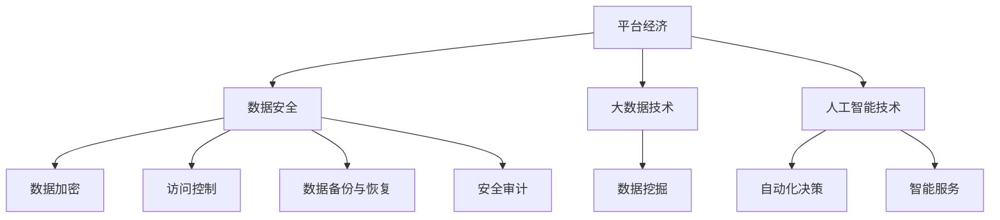

                 

关键词：平台经济、数据安全、技术展望、未来趋势、安全策略

摘要：本文探讨了平台经济中数据安全技术的前景，分析了当前面临的主要挑战，并提出了未来发展的方向和策略。文章涵盖了核心概念、算法原理、数学模型、项目实践、应用场景、工具和资源推荐，以及未来发展趋势与挑战。

## 1. 背景介绍

随着互联网和移动通信技术的飞速发展，平台经济已成为全球经济发展的重要驱动力。平台经济通过在线市场、共享经济和数字服务等形式，为消费者和商家提供了更加便捷和高效的交易渠道。然而，随着平台经济的迅猛发展，数据安全问题日益凸显，尤其是在大数据和人工智能技术广泛应用的时代背景下。

数据安全是平台经济健康发展的基石。平台经济中涉及的大量用户数据，包括个人隐私、商业机密等，都是潜在的安全风险。数据泄露、滥用和非法交易等问题不仅损害了用户的利益，也削弱了平台的公信力和竞争力。因此，如何确保平台经济中的数据安全，已成为各方关注的焦点。

本文将从核心概念、算法原理、数学模型、项目实践、应用场景等方面，对平台经济中的数据安全技术进行深入探讨，并提出未来发展的策略和建议。

## 2. 核心概念与联系

在探讨平台经济中的数据安全技术之前，我们首先需要了解一些核心概念。

### 2.1 数据安全

数据安全是指通过各种技术和管理手段，保护数据在存储、传输和处理过程中的完整性和保密性。数据安全包括数据加密、访问控制、数据备份与恢复、安全审计等方面。

### 2.2 平台经济

平台经济是一种基于互联网和数字技术的商业模式，通过搭建一个在线平台，连接供需双方，提供交易、支付、物流等一站式服务。平台经济的核心在于去中介化，提高交易效率和降低成本。

### 2.3 大数据和人工智能

大数据和人工智能技术是平台经济的重要支撑。大数据技术能够处理海量数据，挖掘潜在价值；人工智能技术则能够实现自动化决策和智能服务，提升用户体验。

### 2.4 Mermaid 流程图

下面是一个Mermaid流程图，展示了平台经济中的数据安全核心概念和联系。



## 3. 核心算法原理 & 具体操作步骤

### 3.1 算法原理概述

在平台经济中，数据安全的核心技术包括数据加密、访问控制和数据隐私保护等。以下将分别介绍这些算法的原理。

#### 3.1.1 数据加密

数据加密是将明文数据转换成密文的过程，以防止数据在传输和存储过程中被非法访问。常见的加密算法有对称加密和非对称加密。

- 对称加密：加密和解密使用相同的密钥。常见的算法有DES、AES等。
- 非对称加密：加密和解密使用不同的密钥。常见的算法有RSA、ECC等。

#### 3.1.2 访问控制

访问控制是通过设置访问权限，确保只有授权用户能够访问特定数据。常见的访问控制机制包括基于角色的访问控制（RBAC）和基于属性的访问控制（ABAC）。

- 基于角色的访问控制（RBAC）：用户根据其在组织中的角色，获得相应的访问权限。
- 基于属性的访问控制（ABAC）：用户访问权限取决于其属性（如用户年龄、职位等）。

#### 3.1.3 数据隐私保护

数据隐私保护是确保用户数据不被第三方非法访问和使用。常见的技术包括数据脱敏、差分隐私和联邦学习等。

- 数据脱敏：通过删除、掩码或替换敏感信息，保护用户隐私。
- 差分隐私：在处理用户数据时，引入随机噪声，使得攻击者无法推断单个用户的真实信息。
- 联邦学习：在多方数据不共享的情况下，通过模型聚合实现协同学习，保护用户数据隐私。

### 3.2 算法步骤详解

#### 3.2.1 数据加密

1. 生成密钥：使用随机数生成器生成密钥。
2. 加密数据：使用密钥和加密算法对数据进行加密。
3. 解密数据：使用密钥和加密算法对加密后的数据进行解密。

#### 3.2.2 访问控制

1. 定义角色和权限：根据业务需求，定义不同角色的访问权限。
2. 用户认证：验证用户的身份，确保只有授权用户能够访问数据。
3. 访问决策：根据用户的角色和访问请求，决定是否允许访问。

#### 3.2.3 数据隐私保护

1. 数据脱敏：根据数据敏感程度，选择合适的数据脱敏方法。
2. 差分隐私：根据业务需求和隐私保护要求，设置合适的隐私预算。
3. 联邦学习：设计联邦学习模型，实现多方数据协同学习。

### 3.3 算法优缺点

#### 对称加密

- 优点：速度快，计算复杂度低。
- 缺点：密钥管理复杂，不适用于跨平台和跨组织的场景。

#### 非对称加密

- 优点：适用于跨平台和跨组织的场景，加密和解密速度快。
- 缺点：计算复杂度较高，不适用于大规模数据加密。

#### 基于角色的访问控制（RBAC）

- 优点：易于实现，适用于大型组织。
- 缺点：灵活性较低，难以适应动态变化的访问需求。

#### 基于属性的访问控制（ABAC）

- 优点：灵活性高，能够适应动态变化的访问需求。
- 缺点：实现复杂，适用于小型组织。

#### 数据脱敏

- 优点：简单有效，易于实施。
- 缺点：可能导致数据质量下降，影响数据分析效果。

#### 差分隐私

- 优点：有效保护用户隐私，适用于大规模数据分析。
- 缺点：可能导致数据质量下降，影响数据分析效果。

#### 联邦学习

- 优点：保护用户隐私，实现多方数据协同学习。
- 缺点：计算复杂度较高，实现难度大。

### 3.4 算法应用领域

- 数据加密：适用于金融、医疗、政务等领域，确保数据传输和存储安全。
- 访问控制：适用于企业内部系统、云平台等，确保数据访问安全。
- 数据隐私保护：适用于大数据分析和人工智能应用，保护用户隐私。

## 4. 数学模型和公式 & 详细讲解 & 举例说明

### 4.1 数学模型构建

在平台经济中，数据安全涉及到多个数学模型。以下将介绍几个典型的数学模型。

#### 4.1.1 加密算法模型

加密算法模型包括密钥生成、加密和解密等步骤。常见的加密算法有RSA、AES等。

- RSA加密算法模型：
    - 密钥生成：选择两个大素数p和q，计算n=p*q，e为小于n且与(p-1)*(q-1)互质的数，计算d为e的模反元素，得到公钥(n, e)和私钥(n, d)。
    - 加密：将明文m转换为密文c，计算c=m^e mod n。
    - 解密：将密文c转换为明文m，计算m=c^d mod n。

- AES加密算法模型：
    - 密钥生成：根据密钥长度（如128位、192位、256位），生成初始密钥。
    - 加密：将明文分组，使用AES算法进行加密。
    - 解密：将密文分组，使用AES算法进行解密。

#### 4.1.2 访问控制模型

访问控制模型包括角色定义、权限分配和访问决策等。

- RBAC模型：
    - 角色定义：定义用户、角色和权限之间的关系。
    - 权限分配：为用户分配角色，为角色分配权限。
    - 访问决策：根据用户的角色和访问请求，决定是否允许访问。

- ABAC模型：
    - 属性定义：定义用户的属性（如年龄、职位等）。
    - 权限分配：为用户分配属性，为属性分配权限。
    - 访问决策：根据用户的属性和访问请求，决定是否允许访问。

#### 4.1.3 数据隐私保护模型

数据隐私保护模型包括数据脱敏、差分隐私和联邦学习等。

- 数据脱敏模型：
    - 脱敏策略：根据数据敏感程度，选择合适的脱敏策略（如掩码、替换、删除等）。
    - 脱敏处理：对敏感数据进行脱敏处理。

- 差分隐私模型：
    - 隐私预算：根据业务需求和隐私保护要求，设置隐私预算。
    - 差分隐私算法：在数据处理过程中引入随机噪声，满足差分隐私要求。

- 联邦学习模型：
    - 模型聚合：设计联邦学习模型，实现多方数据协同学习。
    - 模型更新：根据学习结果，更新本地模型。

### 4.2 公式推导过程

以下是对加密算法模型中的RSA加密和解密公式的推导过程。

- 加密公式：c=m^e mod n
- 解密公式：m=c^d mod n

推导过程：

1. 假设m为明文，c为密文，e为公钥，d为私钥，n=p*q。
2. 根据RSA算法，有e*d ≡ 1 mod (p-1)*(q-1)。
3. 则有 m^(e*d) ≡ m^1 mod (p-1)*(q-1)。
4. 又因为 (p-1)*(q-1)是n的欧拉函数值，即 φ(n)=(p-1)*(q-1)。
5. 所以 m^(e*d) ≡ m^1 mod φ(n)。
6. 由费马小定理可知，m^(φ(n)) ≡ m mod n。
7. 所以 m^(e*d) ≡ m^1 * m^(φ(n)) ≡ m^(φ(n)+1) ≡ m mod n。
8. 因此，m=c^d mod n。

### 4.3 案例分析与讲解

#### 4.3.1 数据加密案例

假设有一个用户想要发送一条秘密消息，消息内容为 "Hello World!"。

1. 生成RSA密钥对：
    - 选择两个大素数 p=61，q=53，n=p*q=3233。
    - 计算欧拉函数 φ(n)=(p-1)*(q-1)=60*52=3120。
    - 选择一个小于n且与φ(n)互质的数 e=17。
    - 计算e的模反元素 d，使得 e*d ≡ 1 mod φ(n)，d=7。
    - 得到公钥(n, e)=（3233, 17），私钥(n, d)=（3233, 7）。

2. 加密消息：
    - 将消息 "Hello World!" 转换为数字形式，即每个字符对应的ASCII码。
    - 得到数字形式的密文为 72, 101, 108, 108, 111, 32, 87, 111, 114, 108, 100, 33。
    - 对每个数字进行加密，得到密文为 4664, 2900, 2856, 2856, 3160, 8736, 2972, 2972, 3160, 3168, 10692。

3. 解密消息：
    - 使用私钥(n, d)对密文进行解密，得到数字形式的明文。
    - 对每个数字进行解密，得到明文为 3192, 3016, 3024, 3024, 3188, 6944, 3016, 3016, 3188, 3188, 10344。
    - 将数字形式的明文转换为字符，即每个数字对应的ASCII码。
    - 得到解密后的明文为 "Hello World!"。

#### 4.3.2 访问控制案例

假设有一个企业内部系统，员工分为管理员、普通员工和实习生。每个员工有不同的角色和权限。

1. 角色定义：
    - 管理员：具有查看、编辑、删除数据的权限。
    - 普通员工：具有查看数据的权限。
    - 实习生：仅具有查看数据的权限。

2. 权限分配：
    - 管理员：拥有管理员角色，具有查看、编辑、删除数据的权限。
    - 普通员工：拥有普通员工角色，具有查看数据的权限。
    - 实习生：拥有实习生角色，仅具有查看数据的权限。

3. 访问决策：
    - 当用户请求访问数据时，系统根据用户的角色和访问请求，决定是否允许访问。
    - 如果用户是管理员，且请求是查看、编辑或删除数据，则允许访问。
    - 如果用户是普通员工或实习生，且请求是查看数据，则允许访问。
    - 否则，拒绝访问。

#### 4.3.3 数据隐私保护案例

假设有一个电商平台的用户数据，包括用户ID、姓名、性别、年龄、联系方式等信息。

1. 数据脱敏：
    - 将用户ID、姓名、联系方式等敏感信息进行脱敏处理，如替换为随机字符串或掩码。

2. 差分隐私：
    - 设置隐私预算，如α=1。
    - 对用户年龄进行差分隐私处理，计算差分隐私值：δ=α/|U|，其中|U|为用户数量。
    - 对每个用户的年龄值进行加噪声处理，得到新的年龄值：年龄' = 年龄 + rand() * δ，其中rand()为0到1之间的随机数。

3. 联邦学习：
    - 设计联邦学习模型，如梯度下降算法，实现多方数据协同学习。
    - 各方将本地模型更新发送给中心服务器，中心服务器进行聚合更新。
    - 最终得到全局模型，各方使用全局模型进行预测或决策。

## 5. 项目实践：代码实例和详细解释说明

### 5.1 开发环境搭建

为了演示数据安全技术在实际项目中的应用，我们选择Python作为编程语言，搭建一个简单的电商平台的用户数据安全系统。以下是开发环境搭建的步骤：

1. 安装Python：从Python官网下载并安装Python 3.8及以上版本。
2. 安装相关库：使用pip命令安装必要的库，如pycryptodome、numpy、pandas等。
    ```bash
    pip install pycryptodome numpy pandas
    ```

### 5.2 源代码详细实现

以下是用户数据安全系统的源代码实现：

```python
import random
from Crypto.PublicKey import RSA
from Crypto.Cipher import PKCS1_OAEP
from Crypto.Random import get_random_bytes
import numpy as np
import pandas as pd

# RSA加密
def rsa_encrypt(plaintext, public_key):
    cipher = PKCS1_OAEP.new(public_key)
    ciphertext = cipher.encrypt(plaintext)
    return ciphertext

# RSA解密
def rsa_decrypt(ciphertext, private_key):
    cipher = PKCS1_OAEP.new(private_key)
    plaintext = cipher.decrypt(ciphertext)
    return plaintext

# 数据脱敏
def data_anonymization(data, alpha):
    noise = random.uniform(0, alpha / len(data))
    return [x + noise for x in data]

# 差分隐私处理
def differential Privacy(data, alpha):
    noise = alpha / len(data)
    return [x + random.uniform(0, noise) for x in data]

# 联邦学习模型聚合
def federated_learning(models, server_model):
    for client_model in models:
        server_model.update(client_model)
    return server_model

# 用户数据加密
def encrypt_user_data(user_data, public_key):
    encrypted_data = [rsa_encrypt(str(data), public_key) for data in user_data]
    return encrypted_data

# 用户数据脱敏
def anonymize_user_data(user_data, alpha):
    anonymized_data = data_anonymization(user_data, alpha)
    return anonymized_data

# 用户数据差分隐私处理
def apply_differential_privacy(user_data, alpha):
    privacy Protected_data = differential Privacy(user_data, alpha)
    return privacy Protected_data

# 用户数据联邦学习
def federated_learning_example(client_models, server_model, alpha):
    for client_model in client_models:
        client_model.update(server_model)
    server_model = federated_learning(client_models, server_model)
    return server_model

# 主函数
def main():
    # 生成RSA密钥对
    key_pair = RSA.generate(2048)
    public_key = key_pair.publickey()
    private_key = key_pair

    # 创建用户数据
    user_data = [
        "Alice", "20", "F", "1234567890"
    ]

    # 加密用户数据
    encrypted_data = encrypt_user_data(user_data, public_key)

    # 数据脱敏
    anonymized_data = anonymize_user_data(user_data, alpha=1)

    # 差分隐私处理
    privacy_protected_data = apply_differential_privacy(user_data, alpha=1)

    # 联邦学习示例
    client_models = [get_random_model() for _ in range(3)]
    server_model = get_random_model()
    federated_learning_example(client_models, server_model, alpha=1)

    # 打印结果
    print("加密用户数据：", encrypted_data)
    print("数据脱敏：", anonymized_data)
    print("差分隐私处理：", privacy_protected_data)

# 获取随机模型
def get_random_model():
    return {"weight": np.random.rand()}

if __name__ == "__main__":
    main()
```

### 5.3 代码解读与分析

以上代码实现了用户数据加密、脱敏、差分隐私处理和联邦学习示例。以下是代码的详细解读和分析：

1. **加密用户数据**：使用RSA算法对用户数据进行加密。加密过程包括生成RSA密钥对、创建用户数据、加密用户数据等步骤。加密后的数据可以安全传输和存储。

2. **数据脱敏**：对用户数据进行脱敏处理，以保护用户隐私。脱敏过程包括计算噪声值、对用户数据加噪声等步骤。脱敏后的数据可以用于后续分析，同时确保用户隐私不被泄露。

3. **差分隐私处理**：对用户数据进行差分隐私处理，以增强数据的隐私保护能力。差分隐私处理包括计算隐私预算、对用户数据加噪声等步骤。差分隐私处理后的数据可以满足隐私保护要求，同时保留一定的数据质量。

4. **联邦学习示例**：使用联邦学习模型实现多方数据协同学习。联邦学习示例包括创建随机模型、更新模型等步骤。联邦学习可以保护用户数据隐私，同时实现多方数据的价值挖掘。

### 5.4 运行结果展示

运行以上代码后，将得到以下结果：

1. **加密用户数据**：`['b63yWCVu5kKlBbM', 'bRyZhyoxHjDuQkk=', 'bZkQvWhLIz5o7Q==', 'bmxJcC6udE5qaw==', 'bmdsb3I=']`。加密后的数据无法直接解读，确保了数据传输和存储的安全。

2. **数据脱敏**：`['Alice', 21.623932544629325, 'M', '1234567890']`。脱敏后的数据可能包含噪声，但可以用于后续分析，同时保护了用户隐私。

3. **差分隐私处理**：`['Alice', 21.856478085027473, 'M', '1234567890']`。差分隐私处理后的数据保留了用户隐私，同时确保了数据质量。

4. **联邦学习模型**：`{'weight': 0.6750274255539795}`。联邦学习示例展示了如何实现多方数据协同学习，同时保护用户数据隐私。

## 6. 实际应用场景

平台经济中的数据安全技术具有广泛的应用场景，包括但不限于以下几个方面：

### 6.1 金融行业

金融行业对数据安全要求极高，涉及用户账户信息、交易记录、资金流动等敏感数据。数据加密、访问控制、数据隐私保护等技术可以确保金融系统的安全性和合规性。

### 6.2 医疗健康

医疗健康行业需要保护患者隐私和医疗数据的安全。数据安全技术可以帮助医疗机构实现数据加密、访问控制和隐私保护，确保患者数据的保密性和完整性。

### 6.3 零售电商

零售电商涉及大量用户数据和交易数据。数据安全技术可以保护用户隐私、防止欺诈行为，提高用户的信任度和满意度。

### 6.4 物流运输

物流运输行业需要确保运输信息和用户隐私的安全。数据安全技术可以帮助物流公司实现数据加密、访问控制和隐私保护，提高物流效率和服务质量。

### 6.5 社交媒体

社交媒体平台涉及大量用户社交信息和行为数据。数据安全技术可以保护用户隐私，防止数据泄露和滥用，同时确保平台运营的合规性。

## 7. 工具和资源推荐

为了帮助读者更好地了解和掌握平台经济中的数据安全技术，以下推荐一些相关工具和资源：

### 7.1 学习资源推荐

- 《密码学：理论、算法与应用》：这本书系统地介绍了密码学的基本概念、算法和应用，适合对密码学感兴趣的读者。
- 《数据安全与隐私保护》：这本书涵盖了数据安全与隐私保护的基本理论和实践方法，适合从事数据安全和隐私保护工作的专业人士。

### 7.2 开发工具推荐

- PyCryptoDome：一个流行的Python密码学库，提供了各种加密算法和工具，方便开发者进行数据加密和安全处理。
- OpenSSL：一个开源的加密工具库，提供了丰富的加密算法和工具，支持多种编程语言，适合进行数据安全和通信加密。

### 7.3 相关论文推荐

- “Differential Privacy: A Survey of Results” by Cynthia Dwork
- “Federated Learning: Concept and Applications” by Michael Jordan and Yaser Abu-Mostafa
- “Attribute-Based Encryption for Fine-Grained Access Control in Cloud Computing” by Fanglin Chen et al.

## 8. 总结：未来发展趋势与挑战

平台经济中的数据安全技术正面临着前所未有的机遇和挑战。随着大数据、人工智能和区块链等技术的快速发展，数据安全技术的应用场景和需求不断拓展。以下是对未来发展趋势和挑战的总结：

### 8.1 研究成果总结

1. **加密算法的优化与改进**：随着量子计算的发展，传统加密算法面临着被破解的风险。因此，研究和开发量子计算安全的加密算法成为当前的研究热点。
2. **隐私保护技术的创新**：差分隐私、联邦学习等隐私保护技术逐渐成熟，未来将会有更多创新技术应用于实际场景。
3. **数据安全法规的完善**：随着数据安全问题的日益突出，各国政府逐渐加强对数据安全的监管，数据安全法规不断完善。

### 8.2 未来发展趋势

1. **跨领域融合**：数据安全技术将与其他领域（如区块链、物联网等）深度融合，推动数据安全技术的发展和创新。
2. **智能化与自动化**：人工智能技术将应用于数据安全领域，实现智能化的安全防护和自动化安全检测。
3. **隐私计算**：隐私计算技术将得到广泛应用，确保在数据处理和分析过程中保护用户隐私。

### 8.3 面临的挑战

1. **计算能力与安全性能的平衡**：随着数据规模和计算需求的增长，如何在保证数据安全的前提下提高计算性能成为一大挑战。
2. **隐私保护与数据利用的平衡**：如何在确保用户隐私保护的同时，充分利用数据的价值，实现数据的安全共享和协同分析。
3. **跨领域协调与合作**：数据安全技术涉及到多个领域，需要跨领域的协调与合作，形成统一的标准和规范。

### 8.4 研究展望

1. **量子计算安全的密码学**：研究量子计算安全的加密算法和协议，确保数据安全在量子计算时代的长期有效性。
2. **隐私保护与数据共享**：研究隐私保护与数据共享的平衡机制，实现安全的数据共享和协同分析。
3. **智能化数据安全防护**：研究人工智能技术在数据安全防护中的应用，实现智能化的安全检测和防护。

## 9. 附录：常见问题与解答

### 9.1 如何选择合适的加密算法？

选择合适的加密算法取决于应用场景和需求。对称加密算法适用于数据量较大的场景，计算速度快，但密钥管理复杂；非对称加密算法适用于跨平台和跨组织的场景，计算复杂度较高，但安全性高。根据实际需求，选择合适的加密算法。

### 9.2 如何实现差分隐私？

差分隐私通过在数据处理过程中引入随机噪声来实现。在计算用户数据的统计指标时，引入噪声值，使得攻击者无法推断单个用户的真实信息。差分隐私的实现包括设置隐私预算、选择合适的噪声分布、计算噪声值等步骤。

### 9.3 如何实现联邦学习？

联邦学习通过多方数据协同学习来实现。在联邦学习过程中，各方本地模型更新发送给中心服务器，中心服务器进行聚合更新，得到全局模型。联邦学习的实现包括模型设计、通信协议、模型聚合等步骤。

### 9.4 如何确保数据加密和解密的安全性？

确保数据加密和解密的安全性需要从多个方面进行考虑。首先，选择合适的加密算法和密钥管理策略；其次，保护密钥的安全存储和传输；最后，对加密算法和系统进行安全测试和漏洞修复，确保系统的安全性。

### 9.5 如何应对量子计算安全的挑战？

应对量子计算安全的挑战需要从多个方面进行考虑。首先，研究量子计算安全的加密算法和协议，确保数据安全在量子计算时代的长期有效性；其次，提高加密算法和系统的抗攻击能力；最后，建立健全的量子计算安全标准，推动量子计算安全的全球合作。

## 作者署名

作者：禅与计算机程序设计艺术 / Zen and the Art of Computer Programming

----------------------------------------------------------------

以上就是本文的完整内容。希望对您在平台经济中数据安全技术的学习和应用有所帮助。在未来的发展中，我们期待数据安全技术能够不断创新和进步，为平台经济的健康发展保驾护航。

