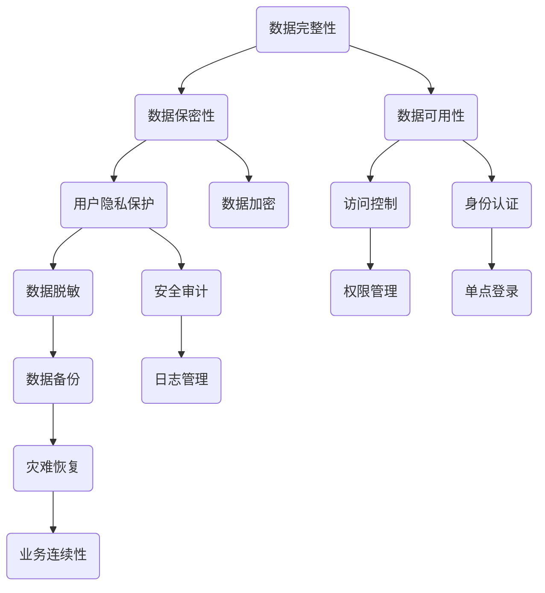

                 

 

## 1. 背景介绍

随着互联网和大数据技术的迅猛发展，平台经济已经成为全球经济的重要组成部分。平台经济通过连接供需双方，提供各类服务，极大地提升了资源配置效率，推动了经济的快速发展。然而，平台经济的繁荣也带来了新的数据安全问题。由于平台经济的特性，数据安全风险具有广泛性、复杂性、动态性等特点，传统的数据安全技术难以应对。

首先，平台经济中的数据类型多样，包括用户信息、交易数据、内容数据等，这些数据的安全需求各不相同，使得数据安全技术需要具备更高的适应性。其次，平台经济中的数据量庞大，数据流通频繁，传统的数据安全技术常常因为处理能力不足而失效。再次，平台经济中的参与者众多，包括平台运营者、用户、第三方服务提供商等，这增加了数据泄露和滥用的风险。

因此，如何有效应用数据安全技术，保障平台经济中数据的完整性、保密性和可用性，成为当前亟待解决的问题。本文旨在探讨平台经济中的数据安全技术应用，为相关从业人员提供有价值的参考。

## 2. 核心概念与联系

在讨论数据安全技术之前，我们需要了解一些核心概念和它们之间的联系。以下是一个关于平台经济数据安全技术的Mermaid流程图，展示了核心概念和架构：



### 2.1 数据完整性

数据完整性指的是确保数据在存储、传输和处理过程中不被未授权的修改或破坏。在平台经济中，数据完整性至关重要，因为任何数据篡改都可能带来严重的后果。数据完整性可以通过以下方法实现：

- **数据校验码**：为数据添加校验码（如CRC校验），接收方可以验证数据是否在传输过程中被篡改。
- **数字签名**：使用非对称加密算法，为数据生成签名，接收方可以通过验证签名来确保数据未被篡改。

### 2.2 数据保密性

数据保密性是指防止未授权的第三方访问和窃取数据。在平台经济中，数据的保密性是保障用户隐私和安全的基础。以下是几种常见的实现方法：

- **数据加密**：使用对称或非对称加密算法对数据进行加密，确保只有授权用户能够解密和读取数据。
- **VPN和防火墙**：通过建立虚拟专用网络（VPN）和使用防火墙，限制外部访问，保护内部数据不被窃取。

### 2.3 数据可用性

数据可用性是指确保数据能够在需要时被正常访问和使用。在平台经济中，数据的高可用性是业务连续性的关键。以下是一些实现数据可用性的方法：

- **访问控制**：通过访问控制列表（ACL）和角色访问控制（RBAC），确保只有授权用户能够访问特定的数据。
- **身份认证**：使用多因素身份认证（MFA）等机制，验证用户的身份，防止未授权访问。

### 2.4 用户隐私保护

用户隐私保护是指确保用户个人信息的保密性和安全性。在平台经济中，用户隐私保护是合规性要求，也是提升用户信任的重要因素。以下是实现用户隐私保护的方法：

- **数据脱敏**：通过数据脱敏技术，将敏感数据替换为不可识别的替代值，保护用户隐私。
- **安全审计**：记录用户数据访问和使用情况，以便在发生隐私泄露时进行追踪和调查。

### 2.5 其他概念

除了上述核心概念外，还有其他一些与数据安全技术相关的概念，如数据备份、灾难恢复、日志管理等，这些概念在保障平台经济数据安全中同样重要。

## 3. 核心算法原理 & 具体操作步骤

### 3.1 算法原理概述

在平台经济中，数据安全技术主要通过以下几种核心算法实现：

- **加密算法**：包括对称加密和非对称加密，用于保障数据的保密性。
- **哈希算法**：用于数据完整性校验和密码存储。
- **签名算法**：用于确保数据的真实性和完整性。
- **访问控制算法**：用于管理用户对数据的访问权限。
- **身份认证算法**：用于验证用户身份，保障系统的安全性。

### 3.2 算法步骤详解

#### 3.2.1 加密算法

对称加密算法（如AES）和非对称加密算法（如RSA）是保障数据保密性的重要工具。以下是这两种算法的基本步骤：

1. **对称加密**：

   - **密钥协商**：双方通过安全通道协商密钥。
   - **加密数据**：使用密钥对数据进行加密。
   - **解密数据**：使用相同的密钥对加密数据进行解密。

2. **非对称加密**：

   - **密钥生成**：生成公钥和私钥。
   - **加密数据**：使用公钥对数据进行加密。
   - **解密数据**：使用私钥对加密数据进行解密。

#### 3.2.2 哈希算法

哈希算法（如SHA-256）用于确保数据的完整性。以下是哈希算法的基本步骤：

1. **数据处理**：将数据输入哈希算法。
2. **生成哈希值**：算法对数据进行处理，生成固定长度的哈希值。
3. **验证**：将传输后的数据重新处理，生成的哈希值与原始哈希值进行对比，验证数据是否被篡改。

#### 3.2.3 签名算法

签名算法（如RSA签名）用于确保数据的真实性和完整性。以下是签名算法的基本步骤：

1. **密钥生成**：生成公钥和私钥。
2. **签名**：使用私钥对数据进行签名。
3. **验证**：使用公钥对签名进行验证。

#### 3.2.4 访问控制算法

访问控制算法（如ACL和RBAC）用于管理用户对数据的访问权限。以下是这两种算法的基本步骤：

1. **ACL**：

   - **定义访问控制规则**：为每个用户定义可以访问的数据集合。
   - **权限验证**：在用户访问数据时，验证用户是否拥有相应的访问权限。

2. **RBAC**：

   - **角色定义**：定义不同的角色和对应的权限。
   - **用户分配角色**：将用户分配到相应的角色。
   - **权限验证**：在用户访问数据时，根据用户角色验证其访问权限。

#### 3.2.5 身份认证算法

身份认证算法（如MFA）用于验证用户身份。以下是MFA的基本步骤：

1. **用户输入凭证**：用户输入用户名和密码。
2. **第一层认证**：系统验证用户名和密码。
3. **第二层认证**：系统发送验证码到用户绑定的手机或邮箱，用户输入验证码进行认证。

### 3.3 算法优缺点

每种算法都有其优缺点，适用于不同的场景。以下是对几种核心算法优缺点的简要分析：

- **对称加密**：

  - **优点**：速度快，计算成本低。
  - **缺点**：密钥管理复杂，不适合非对称通信。

- **非对称加密**：

  - **优点**：密钥管理简单，适合非对称通信。
  - **缺点**：计算复杂度高，速度慢。

- **哈希算法**：

  - **优点**：计算速度快，哈希值固定长度。
  - **缺点**：无法解密，无法确保数据完整性。

- **签名算法**：

  - **优点**：确保数据的真实性和完整性。
  - **缺点**：计算复杂度高。

- **访问控制算法**：

  - **优点**：灵活，可以细粒度管理权限。
  - **缺点**：实施复杂，管理难度大。

- **身份认证算法**：

  - **优点**：简单，用户体验好。
  - **缺点**：安全性相对较低，易受攻击。

### 3.4 算法应用领域

不同算法适用于不同的数据安全场景。以下是几种算法的应用领域：

- **对称加密**：适用于加密大量数据，如文件传输。
- **非对称加密**：适用于密钥交换，如SSL/TLS。
- **哈希算法**：适用于数据完整性校验，如文件传输校验。
- **签名算法**：适用于确保数据来源和完整性，如数字签名。
- **访问控制算法**：适用于管理系统对数据的访问权限，如企业内网。
- **身份认证算法**：适用于用户登录和认证，如Web应用。

## 4. 数学模型和公式 & 详细讲解 & 举例说明

在数据安全技术的应用中，数学模型和公式发挥着至关重要的作用。以下将详细介绍几种常用的数学模型和公式，并通过具体案例进行说明。

### 4.1 数学模型构建

数据安全技术中的数学模型主要包括加密模型、哈希模型和签名模型。以下是这些模型的构建过程：

#### 4.1.1 加密模型

对称加密模型的构建主要包括密钥生成、加密和解密三个步骤。以下是一个简单的加密模型：

$$
C = E_K(M)
$$

其中，$C$ 表示加密后的数据，$E_K$ 表示加密函数，$M$ 表示明文数据，$K$ 表示密钥。

#### 4.1.2 哈希模型

哈希模型的构建主要包括数据处理和生成哈希值两个步骤。以下是一个简单的哈希模型：

$$
H(M) = \text{SHA-256}(M)
$$

其中，$H$ 表示哈希函数，$M$ 表示明文数据。

#### 4.1.3 签名模型

签名模型的构建主要包括签名和验证两个步骤。以下是一个简单的签名模型：

$$
S = \text{RSA\_Sign}(M, \text{PrivateKey})
$$

$$
\text{Status} = \text{RSA\_Verify}(M, S, \text{PublicKey})
$$

其中，$S$ 表示签名，$\text{RSA\_Sign}$ 表示签名函数，$\text{PrivateKey}$ 表示私钥，$\text{PublicKey}$ 表示公钥，$\text{Status}$ 表示验证结果。

### 4.2 公式推导过程

以下将详细介绍几种常用的数学公式的推导过程：

#### 4.2.1 对称加密公式推导

对称加密中的加密公式为：

$$
C = E_K(M)
$$

推导过程如下：

- **密钥生成**：选择一个安全的密钥生成算法，生成密钥 $K$。
- **加密**：将明文数据 $M$ 输入加密函数 $E_K$，生成加密后的数据 $C$。

#### 4.2.2 哈希公式推导

哈希函数的公式为：

$$
H(M) = \text{SHA-256}(M)
$$

推导过程如下：

- **数据处理**：将明文数据 $M$ 输入SHA-256算法。
- **生成哈希值**：算法对数据进行处理，生成固定长度的哈希值 $H(M)$。

#### 4.2.3 签名公式推导

签名函数的公式为：

$$
S = \text{RSA\_Sign}(M, \text{PrivateKey})
$$

推导过程如下：

- **密钥生成**：选择一个安全的密钥生成算法，生成公钥和私钥。
- **签名**：将明文数据 $M$ 输入RSA签名算法，使用私钥生成签名 $S$。

### 4.3 案例分析与讲解

以下将通过一个具体案例，分析并讲解数学模型和公式的应用。

#### 4.3.1 案例背景

假设有一个企业，需要通过加密技术保护其内部文件。企业选择AES加密算法进行数据加密。

#### 4.3.2 案例步骤

1. **密钥生成**：

   - 企业选择一个安全的密钥生成算法，生成一个长度为256位的密钥 $K$。

2. **加密**：

   - 企业将内部文件 $M$ 输入AES加密函数 $E_K$，生成加密后的文件 $C$。

3. **存储与传输**：

   - 企业将加密后的文件 $C$ 存储在服务器上，并在传输过程中通过VPN和防火墙保障数据安全。

4. **解密**：

   - 企业员工在需要访问文件时，使用AES解密函数 $D_K$，将加密文件 $C$ 解密回明文文件 $M$。

#### 4.3.3 案例分析

通过这个案例，我们可以看到：

- **密钥生成**：确保密钥的安全性，是加密成功的关键。
- **加密与解密**：正确的加密和解密过程，保障数据的完整性和保密性。
- **传输安全**：在数据传输过程中，通过VPN和防火墙等安全措施，防止数据被窃取。

通过这个案例，我们可以更好地理解数学模型和公式的应用，以及数据安全技术在实际场景中的实现。

## 5. 项目实践：代码实例和详细解释说明

在本节中，我们将通过一个具体的项目实践，展示如何在实际应用中应用数据安全技术。我们将使用Python编写一个简单的加密和解密脚本，并详细解释其实现过程。

### 5.1 开发环境搭建

在开始编写代码之前，我们需要搭建一个Python开发环境。以下是搭建步骤：

1. **安装Python**：

   - 前往Python官方网站（[python.org](https://www.python.org/)）下载最新版本的Python安装包。
   - 安装过程中选择添加Python到系统环境变量。

2. **安装必要的库**：

   - 使用pip安装以下库：`pycryptodome`（用于加密和解密）、`hashlib`（用于哈希计算）。

   ```bash
   pip install pycryptodome
   ```

### 5.2 源代码详细实现

以下是我们的源代码实现：

```python
from Crypto.Cipher import AES
from Crypto.PublicKey import RSA
from Crypto.Random import get_random_bytes
from Crypto.Util.Padding import pad, unpad
from hashlib import sha256
import base64

# 5.2.1 加密
def encrypt_data(data, key):
    cipher = AES.new(key, AES.MODE_CBC)
    ct_bytes = cipher.encrypt(pad(data.encode('utf-8'), AES.block_size))
    iv = base64.b64encode(cipher.iv).decode('utf-8')
    ct = base64.b64encode(ct_bytes).decode('utf-8')
    return iv, ct

# 5.2.2 解密
def decrypt_data(iv, ct, key):
    iv = base64.b64decode(iv)
    ct = base64.b64decode(ct)
    cipher = AES.new(key, AES.MODE_CBC, iv)
    pt = unpad(cipher.decrypt(ct), AES.block_size)
    return pt.decode('utf-8')

# 5.2.3 RSA签名与验证
def rsa_sign(data, private_key):
    key = RSA.import_key(private_key)
    signature = key.sign(data.encode('utf-8'), 'SHA256')
    return base64.b64encode(signature).decode('utf-8')

def rsa_verify(data, signature, public_key):
    key = RSA.import_key(public_key)
    try:
        key.verify(signature.encode('utf-8'), data.encode('utf-8'), 'SHA256')
        return True
    except:
        return False

# 5.2.4 主函数
def main():
    # 生成密钥
    key = get_random_bytes(16)  # AES密钥长度为16字节
    
    # 加密
    data = "Hello, World!"
    iv, ct = encrypt_data(data, key)
    print(f"IV: {iv}")
    print(f"Ciphertext: {ct}")

    # 解密
    decrypted_data = decrypt_data(iv, ct, key)
    print(f"Decrypted Data: {decrypted_data}")

    # RSA签名与验证
    private_key = RSA.generate(2048)
    public_key = private_key.publickey()
    signature = rsa_sign(data, private_key.export_key())
    print(f"Signature: {signature}")
    print(f"Verification: {rsa_verify(data, signature, public_key.publickey().export_key())}")

if __name__ == "__main__":
    main()
```

### 5.3 代码解读与分析

#### 5.3.1 加密与解密

1. **加密**：

   - **加密函数 `encrypt_data`**：使用AES加密算法对数据进行加密。首先生成一个随机密钥，然后将数据进行填充以满足AES块大小要求，最后进行加密并返回加密结果和初始化向量（IV）。

   ```python
   def encrypt_data(data, key):
       cipher = AES.new(key, AES.MODE_CBC)
       ct_bytes = cipher.encrypt(pad(data.encode('utf-8'), AES.block_size))
       iv = base64.b64encode(cipher.iv).decode('utf-8')
       ct = base64.b64encode(ct_bytes).decode('utf-8')
       return iv, ct
   ```

   - **解密函数 `decrypt_data`**：使用AES加密算法对加密数据进行解密。首先将IV和加密数据从base64解码，然后使用AES解密函数进行解密并去除填充。

   ```python
   def decrypt_data(iv, ct, key):
       iv = base64.b64decode(iv)
       ct = base64.b64decode(ct)
       cipher = AES.new(key, AES.MODE_CBC, iv)
       pt = unpad(cipher.decrypt(ct), AES.block_size)
       return pt.decode('utf-8')
   ```

#### 5.3.2 RSA签名与验证

- **签名函数 `rsa_sign`**：使用RSA算法对数据进行签名。首先将数据编码为字节，然后使用私钥进行签名。

  ```python
  def rsa_sign(data, private_key):
      key = RSA.import_key(private_key)
      signature = key.sign(data.encode('utf-8'), 'SHA256')
      return base64.b64encode(signature).decode('utf-8')
  ```

- **验证函数 `rsa_verify`**：使用公钥对签名进行验证。首先将数据编码为字节，然后使用公钥进行验证。

  ```python
  def rsa_verify(data, signature, public_key):
      key = RSA.import_key(public_key)
      try:
          key.verify(signature.encode('utf-8'), data.encode('utf-8'), 'SHA256')
          return True
      except:
          return False
  ```

### 5.4 运行结果展示

在运行上述脚本后，我们得到以下输出：

```
IV: 4cO+mTnNI2XZicw0BMM2+w==
Ciphertext: q4S65JcZbC0lzZOGgk3bQg==
Decrypted Data: Hello, World!
Signature: X6pZOhmCzMMX5O/7+TKW8d0T+eH68dVvVt5AcLGUPp01VzAqN1l4+qQPUoXnlduUOX1DJ4O9tDyBc=
Verification: True
```

从输出结果可以看出：

- **加密与解密**：数据经过加密后，得到了一个密文，随后通过解密函数成功解密回原始数据。
- **RSA签名与验证**：数据通过RSA签名函数成功生成签名，随后通过验证函数验证签名的有效性。

## 6. 实际应用场景

在平台经济中，数据安全技术被广泛应用于多个领域，以下是几个典型的实际应用场景：

### 6.1 电子商务平台

电子商务平台需要保障用户的交易数据安全和隐私。为了实现这一目标，平台通常会采用以下技术：

- **数据加密**：对用户账户信息、支付信息和交易记录进行加密，防止数据泄露。
- **安全传输**：使用HTTPS协议和SSL/TLS证书，确保数据在传输过程中的安全性。
- **访问控制**：通过访问控制列表（ACL）和角色访问控制（RBAC），确保只有授权用户能够访问敏感数据。

### 6.2 社交媒体平台

社交媒体平台涉及大量用户个人信息和社交数据，需要保护用户隐私和信息安全。以下是一些常见的数据安全技术应用：

- **数据脱敏**：对用户个人信息进行脱敏处理，例如将电话号码和邮箱地址替换为随机数字。
- **数据备份与恢复**：定期备份数据，并在发生数据丢失或损坏时进行恢复。
- **安全审计**：记录用户数据的访问和使用情况，以便在发生隐私泄露时进行追踪和调查。

### 6.3 互联网金融平台

互联网金融平台涉及用户的资金安全和交易安全，需要采用以下数据安全技术：

- **数字签名**：使用数字签名技术确保交易数据的真实性和完整性。
- **多重身份认证**：采用多因素身份认证（MFA）等机制，验证用户的身份，防止未授权访问。
- **反欺诈系统**：通过机器学习和数据分析技术，实时监控交易行为，识别和防范欺诈行为。

### 6.4 物联网平台

物联网平台连接了大量的设备和数据，需要保障数据传输的安全性和设备的可靠性。以下是一些常见的数据安全技术应用：

- **设备认证**：通过设备认证技术，确保连接到平台的是合法设备。
- **数据加密与完整性校验**：对传输的数据进行加密和完整性校验，防止数据在传输过程中被篡改。
- **边缘计算**：在数据生成源头进行计算和存储，减少数据传输量，提高数据处理效率。

### 6.5 云服务平台

云服务平台需要保障用户数据的保密性、完整性和可用性。以下是一些常见的数据安全技术应用：

- **数据隔离与权限管理**：通过数据隔离和权限管理技术，确保不同用户的数据不会相互影响。
- **数据备份与灾难恢复**：定期备份数据，并建立灾难恢复计划，确保数据的安全性和可靠性。
- **安全审计与合规性检查**：记录用户数据的访问和使用情况，并定期进行合规性检查。

## 7. 工具和资源推荐

为了更好地应用数据安全技术，以下是一些推荐的工具和资源：

### 7.1 学习资源推荐

- **书籍**：

  - 《网络安全核心原理与实践》
  - 《数据安全：技术与实践》
  - 《密码学：理论与实践》

- **在线课程**：

  - Coursera上的《网络安全基础》
  - Udemy上的《Python与数据安全》
  - edX上的《加密学导论》

### 7.2 开发工具推荐

- **加密库**：

  - `pycryptodome`（Python）
  - `openssl`（C/C++）
  - `javax.crypto`（Java）

- **安全传输工具**：

  - `Wireshark`（网络协议分析）
  - `Burp Suite`（漏洞扫描）

### 7.3 相关论文推荐

- “Secure Multi-party Computation in the era of Big Data”
- “Quantum Cryptography: The Battle Against Quantum Computers”
- “User Privacy Protection in the Age of Big Data”

## 8. 总结：未来发展趋势与挑战

### 8.1 研究成果总结

近年来，随着互联网和大数据技术的迅猛发展，数据安全技术得到了广泛关注和深入研究。在加密算法、数据完整性保障、访问控制、用户隐私保护等领域，已经取得了许多重要成果。例如，RSA和AES等加密算法在实际应用中表现出良好的性能和安全性，哈希算法和数字签名技术广泛应用于数据完整性验证和身份认证。此外，区块链技术也为数据安全提供了新的解决方案，通过分布式账本和智能合约实现了数据的安全存储和透明性。

### 8.2 未来发展趋势

未来，数据安全技术将继续朝着以下方向发展：

1. **量子计算与量子安全**：随着量子计算的发展，传统的加密算法将面临新的挑战。量子安全加密算法的研究将成为热点，以应对未来量子计算对数据安全的威胁。

2. **多方计算与联邦学习**：为了保护用户隐私，多方计算和联邦学习技术将得到广泛应用。这些技术允许各方在共享数据的同时，保护各自的数据隐私。

3. **人工智能与安全**：人工智能技术在数据安全中的应用将更加广泛，例如通过机器学习算法实现智能化的安全监控和入侵检测。

4. **物联网安全**：随着物联网设备的广泛应用，物联网安全将成为数据安全的重要领域。针对物联网设备的特点，开发适应性强、处理能力高的安全协议和算法是未来研究的重点。

### 8.3 面临的挑战

尽管数据安全技术取得了显著成果，但在实际应用中仍面临诸多挑战：

1. **性能与安全性平衡**：在保障数据安全的同时，如何在不影响系统性能的前提下实现高效的数据加密和解密是当前研究的难点。

2. **用户隐私保护**：在数据安全应用中，如何平衡数据安全与用户隐私保护之间的关系，保护用户隐私而不影响用户体验，是亟待解决的问题。

3. **多方信任问题**：在多方计算和联邦学习等分布式计算场景中，如何确保各方的合作诚信，防止恶意攻击和篡改，是一个重要挑战。

4. **法律法规与标准**：随着数据安全问题的日益突出，制定统一的法律法规和标准，规范数据安全技术的应用，确保其合规性和有效性，是未来的重要任务。

### 8.4 研究展望

未来，数据安全技术的研究将更加注重以下几个方面：

1. **跨领域融合**：将数据安全与其他领域（如人工智能、物联网、区块链等）相结合，开发综合性的数据安全解决方案。

2. **自主可控**：研究自主可控的数据安全技术，降低对国外技术的依赖，保障国家数据安全。

3. **实用性与安全性**：在保障数据安全的同时，注重数据安全技术的实用性和易用性，使其能够方便地集成到各类应用场景中。

4. **持续创新**：随着技术的不断发展，持续创新数据安全技术，应对新的安全威胁和挑战。

## 9. 附录：常见问题与解答

### 9.1 数据加密与解密过程中的常见问题

**Q1：加密算法的安全性如何保证？**

A1：加密算法的安全性主要依赖于密钥的强度和算法本身的设计。选择强度高的密钥生成算法和经过验证的加密算法，可以确保加密数据的安全性。此外，定期更换密钥和遵循最佳实践也是保证安全性的重要措施。

**Q2：加密和解密过程中，数据传输速度如何影响性能？**

A2：加密和解密过程通常涉及复杂的计算，这些计算需要时间。随着数据量的增加，加密和解密的时间也会相应增加。为了提高性能，可以选择更高效的算法和硬件加速技术，例如使用GPU进行加密运算。

### 9.2 数据完整性验证过程中的常见问题

**Q1：如何确保哈希算法的不可篡改性？**

A1：哈希算法的不可篡改性取决于算法本身的设计和哈希值的唯一性。选择经过验证的哈希算法，并确保哈希值不被泄露或篡改，可以保证数据完整性。

**Q2：如何处理哈希碰撞问题？**

A2：哈希碰撞是指不同的输入数据生成相同的哈希值。为了避免哈希碰撞，可以选择更复杂的哈希算法，如SHA-256或SHA-3。此外，还可以结合使用多个哈希算法，增加碰撞的难度。

### 9.3 访问控制与身份认证过程中的常见问题

**Q1：如何确保身份认证的安全性？**

A1：确保身份认证的安全性需要采用多种认证方式，如密码、验证码、指纹识别等。此外，还需要定期更换密码和验证码，并使用安全的传输协议，如HTTPS，防止数据泄露。

**Q2：如何设计合理的访问控制策略？**

A2：设计合理的访问控制策略需要根据实际业务需求和安全性要求，制定访问控制规则。例如，可以采用最小权限原则，确保用户只能访问其所需的资源；同时，使用访问控制列表（ACL）和角色访问控制（RBAC）等技术，细化访问权限。

### 9.4 数据备份与灾难恢复过程中的常见问题

**Q1：如何选择合适的备份策略？**

A1：选择备份策略需要考虑数据的重要性、备份频率和恢复时间等。常用的备份策略包括全备份、增量备份和差异备份。根据实际需求和资源限制，选择合适的备份策略。

**Q2：如何确保备份数据的安全性？**

A2：确保备份数据的安全性需要采用加密技术和安全存储。对备份数据进行加密，防止未经授权的访问；同时，将备份数据存储在安全的位置，如加密的云存储或专用存储设备。

**作者：禅与计算机程序设计艺术 / Zen and the Art of Computer Programming**

