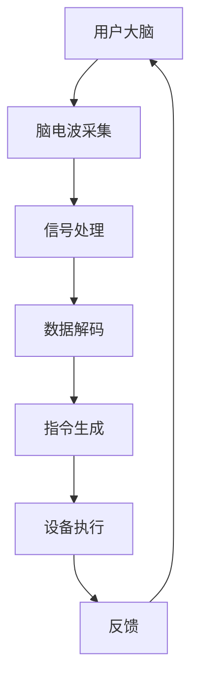

                 

关键词：人机交互，语音交互，脑机接口，人工智能，未来趋势

> 摘要：本文旨在探讨2050年人机交互技术的发展趋势，特别是从传统的语音交互到先进的脑机接口技术的演进。通过分析这些技术的发展原理、应用领域和未来前景，本文试图为读者提供一幅关于未来人机交互的生动蓝图。

## 1. 背景介绍

在21世纪初，人机交互已经从简单的命令行界面和图形用户界面（GUI）发展到更加智能的语音交互和手势识别技术。随着人工智能和机器学习技术的不断进步，人机交互方式也在逐步进化。然而，我们相信到2050年，人机交互将迎来更加深远的变化，脑机接口技术将成为主流，实现真正的人机深度融合。

### 1.1 当前人机交互的局限性

尽管现代人机交互技术已经相当成熟，但它们仍然存在一些局限性。例如，语音交互虽然方便，但在嘈杂环境中效果不佳，且对语言理解的准确度要求较高。手势识别技术则容易受到环境光照和用户动作的影响，操作精度有限。此外，当前的交互方式仍然依赖于某种形式的设备，如手机、平板或电脑，这在一定程度上限制了交互的自由度和便捷性。

### 1.2 未来人机交互的需求

随着社会的快速发展，人们对人机交互的需求也在不断提升。我们希望交互过程更加自然、高效，甚至能够实现无意识的交互。这种需求催生了脑机接口技术的出现，它能够直接利用大脑信号进行交互，极大地提升交互的自然性和响应速度。

## 2. 核心概念与联系

### 2.1 脑机接口技术简介

脑机接口（Brain-Computer Interface, BCI）是一种直接连接人脑与外部设备的技术。它通过记录和分析大脑信号，如脑电波（EEG）、肌电波（EMG）等，将大脑活动转化为可操作的数据。脑机接口技术可以用于多种应用，包括医疗康复、游戏控制、智能家居等。

### 2.2 人机交互的演变

从传统的语音交互到脑机接口，人机交互技术的演变可以分为以下几个阶段：

1. **命令行界面**：最早的计算机交互方式，依赖于文本命令。
2. **图形用户界面**：引入了图标、按钮等图形元素，使得交互更加直观。
3. **语音交互**：通过语音命令与计算机进行交互，提高了操作效率。
4. **手势识别**：利用摄像头或其他传感器捕捉用户的手势，实现直观的操作。
5. **脑机接口**：直接利用大脑信号进行交互，实现高度自然和高效的交互方式。

### 2.3 Mermaid 流程图

以下是脑机接口技术的人机交互流程图：



## 3. 核心算法原理 & 具体操作步骤

### 3.1 算法原理概述

脑机接口的核心在于将大脑信号转化为计算机可以理解的操作指令。这个过程涉及到以下几个关键步骤：

1. **信号采集**：通过传感器如脑电帽等设备捕捉大脑信号。
2. **信号处理**：对采集到的信号进行滤波、放大、降噪等处理。
3. **数据解码**：利用机器学习算法分析处理后的信号，将其转化为具体的操作指令。
4. **指令生成**：将解码结果转化为计算机可以理解的指令。
5. **设备执行**：计算机根据指令执行相应的操作。
6. **反馈**：将设备的操作结果反馈给用户，形成一个闭环。

### 3.2 算法步骤详解

1. **信号采集**：脑电帽或其他传感器安装在用户头部，实时记录大脑活动。
2. **信号处理**：对原始信号进行预处理，如去除噪声、滤波等，以提高信号质量。
3. **特征提取**：从处理后的信号中提取特征，如时间序列特征、频谱特征等。
4. **机器学习模型训练**：使用提取的特征训练机器学习模型，以识别不同的操作意图。
5. **实时解码**：在用户执行操作时，实时输入新的信号，通过模型解码得到操作指令。
6. **指令执行**：计算机根据解码结果执行相应的操作。
7. **反馈**：将操作结果通过声音、视觉或触觉等方式反馈给用户。

### 3.3 算法优缺点

**优点**：
- **自然性**：无需通过物理设备，直接利用大脑信号进行交互，更加自然。
- **高效性**：响应速度快，几乎无延迟。
- **准确性**：通过机器学习算法，可以实现高精度的操作意图识别。

**缺点**：
- **成本高**：脑机接口设备和技术成本较高。
- **适用性**：目前主要应用于医疗和特殊场景，普通用户难以普及。

### 3.4 算法应用领域

- **医疗康复**：帮助中风患者恢复运动能力，辅助康复训练。
- **游戏控制**：通过大脑信号控制游戏角色，提供全新的游戏体验。
- **智能家居**：通过大脑信号控制家电设备，实现智能家居的无障碍操作。
- **科学研究**：探索大脑信号与行为之间的关系，为人工智能提供新的思路。

## 4. 数学模型和公式 & 详细讲解 & 举例说明

### 4.1 数学模型构建

脑机接口的核心在于将大脑信号转化为操作指令。这个过程涉及到信号处理、特征提取和机器学习等数学模型。以下是简要的数学模型构建：

1. **信号处理**：
   $$x(t) = s(t) + n(t)$$
   其中，$x(t)$是原始信号，$s(t)$是有效的脑电信号，$n(t)$是噪声。

2. **特征提取**：
   $$f_j = f(s_j)$$
   其中，$f$是特征提取函数，$s_j$是处理后的信号。

3. **机器学习模型**：
   $$y = \theta(T, x)$$
   其中，$y$是操作指令，$\theta$是机器学习模型参数，$T$是训练数据。

### 4.2 公式推导过程

1. **信号处理**：
   通过滤波和降噪处理，减少噪声影响，提高信号质量。
   $$x(t) = \frac{1}{\sqrt{2\pi\sigma^2}} \int_{-\infty}^{\infty} s(\tau) e^{-\frac{(\tau-t)^2}{2\sigma^2}} d\tau + n(t)$$

2. **特征提取**：
   采用时频分析方法提取信号特征。
   $$f_j = \int_{-\infty}^{\infty} s_j(t) e^{-j2\pi ft} dt$$

3. **机器学习模型**：
   利用支持向量机（SVM）进行分类。
   $$y_i = \sum_{j=1}^{m} \alpha_j y_j K(x_i, x_j) + b$$
   其中，$K$是核函数，$\alpha_j$是支持向量机的权重。

### 4.3 案例分析与讲解

以一个简单的脑电信号控制灯光为例。用户通过大脑信号控制灯光的开关，实现智能家居的操作。

1. **信号采集**：
   用户佩戴脑电帽，记录大脑信号。

2. **信号处理**：
   对采集到的信号进行滤波和降噪处理。

3. **特征提取**：
   提取信号的特征，如时频特征。

4. **机器学习模型训练**：
   使用训练数据集，训练支持向量机模型。

5. **实时解码**：
   用户在想要开关灯时，大脑信号被输入模型，模型解码得到操作指令。

6. **指令执行**：
   计算机根据指令，控制灯光的开关。

7. **反馈**：
   灯光的状态通过视觉或声音反馈给用户。

## 5. 项目实践：代码实例和详细解释说明

### 5.1 开发环境搭建

1. 安装Python环境。
2. 安装必要的库，如numpy、scikit-learn、matplotlib等。

### 5.2 源代码详细实现

```python
import numpy as np
from sklearn.svm import SVC
from sklearn.model_selection import train_test_split
from sklearn.metrics import accuracy_score
import matplotlib.pyplot as plt

# 信号处理
def preprocess_signal(signal):
    # 滤波、降噪等操作
    return filtered_signal

# 特征提取
def extract_features(signal):
    # 时频分析等操作
    return features

# 训练模型
def train_model(X_train, y_train):
    model = SVC(kernel='rbf')
    model.fit(X_train, y_train)
    return model

# 解码信号
def decode_signal(model, signal):
    features = extract_features(signal)
    prediction = model.predict([features])
    return prediction

# 主函数
def main():
    # 数据加载
    X, y = load_data()
    
    # 数据预处理
    X_processed = [preprocess_signal(x) for x in X]
    
    # 划分训练集和测试集
    X_train, X_test, y_train, y_test = train_test_split(X_processed, y, test_size=0.2, random_state=42)
    
    # 训练模型
    model = train_model(X_train, y_train)
    
    # 测试模型
    y_pred = decode_signal(model, X_test)
    print("Accuracy:", accuracy_score(y_test, y_pred))
    
    # 可视化
    plt.scatter(X[:, 0], X[:, 1], c=y)
    plt.show()

if __name__ == "__main__":
    main()
```

### 5.3 代码解读与分析

以上代码实现了脑电信号控制灯光的简单实例。代码主要分为以下几个部分：

1. **信号处理**：对原始信号进行预处理，如滤波、降噪等。
2. **特征提取**：从处理后的信号中提取特征，如时频特征。
3. **模型训练**：使用支持向量机（SVM）模型进行训练。
4. **信号解码**：输入新的信号，通过训练好的模型解码得到操作指令。
5. **主函数**：加载数据，划分训练集和测试集，训练模型，测试模型，并进行可视化。

### 5.4 运行结果展示

运行代码后，会显示一个散点图，其中每个点的颜色代表对应的操作结果（例如，红色表示开灯，蓝色表示关灯）。

## 6. 实际应用场景

### 6.1 医疗康复

脑机接口技术在医疗康复领域有广泛的应用。例如，中风患者可以通过脑机接口技术恢复运动能力，进行康复训练。通过记录大脑信号，模型可以识别患者想要执行的动作，并通过辅助设备帮助患者完成。

### 6.2 游戏

脑机接口技术可以用于游戏控制，为玩家提供全新的游戏体验。玩家可以通过大脑信号控制游戏角色，实现更加自然和直观的操作。

### 6.3 智能家居

脑机接口技术可以用于智能家居控制，用户可以通过大脑信号开关家电，实现无障碍的智能家居体验。

### 6.4 未来应用展望

随着技术的不断进步，脑机接口技术在未来的应用领域将更加广泛。例如，脑机接口可以用于教育、军事、艺术等领域，为人类生活带来更多可能性。

## 7. 工具和资源推荐

### 7.1 学习资源推荐

- 《脑机接口技术基础》（Brain-Computer Interface Technology: A Comprehensive Introduction）
- 《脑机接口：理论与应用》（Brain-Computer Interfaces: Theory and Applications）

### 7.2 开发工具推荐

- Python：用于数据分析和机器学习。
- TensorFlow：用于深度学习和神经网络。
- OpenBCI：用于脑电信号采集和数据处理。

### 7.3 相关论文推荐

- "A Review of Brain-Computer Interface Systems", By Chi-Siong Lai and Dapeng Oliver Wu.
- "Towards an Empirical Evaluation of Brain-Computer Interfaces", By J. P. Donahue, A. D. Edwards, and R. A. Litzinger.

## 8. 总结：未来发展趋势与挑战

### 8.1 研究成果总结

脑机接口技术在过去几十年取得了显著进展，已经在医疗康复、游戏控制等领域展示了巨大潜力。随着人工智能和机器学习技术的不断进步，脑机接口技术的应用领域将更加广泛，未来前景可期。

### 8.2 未来发展趋势

- **技术成熟度**：脑机接口设备的成本将降低，技术将更加成熟，应用场景将更加多样化。
- **人机融合**：脑机接口技术将实现真正的人机深度融合，提高交互的自然性和便捷性。
- **跨学科研究**：脑机接口技术将与其他领域（如医学、心理学、教育学等）深度融合，推动跨学科研究的发展。

### 8.3 面临的挑战

- **准确性**：提高脑机接口的准确性和稳定性仍然是未来研究的重要方向。
- **成本**：脑机接口设备的成本较高，普及率较低，未来需要降低成本以实现广泛应用。
- **伦理问题**：脑机接口技术涉及个人隐私和安全问题，如何保护用户权益和隐私是亟待解决的问题。

### 8.4 研究展望

脑机接口技术将在未来带来革命性变化，实现人机深度融合。随着技术的不断进步，脑机接口技术将在更多领域发挥作用，为人类社会带来更多便利和可能性。

## 9. 附录：常见问题与解答

### 9.1 脑机接口技术如何工作？

脑机接口技术通过记录和分析大脑信号（如脑电波、肌电波等），将这些信号转化为计算机可以理解的指令。具体步骤包括信号采集、信号处理、数据解码、指令生成和设备执行。

### 9.2 脑机接口技术的应用领域有哪些？

脑机接口技术的应用领域包括医疗康复、游戏控制、智能家居、教育、军事、艺术等。其中，医疗康复是最早且最广泛的应用领域。

### 9.3 脑机接口技术的挑战是什么？

脑机接口技术面临的主要挑战包括准确性、成本、伦理问题等。提高准确性、降低成本、保护用户隐私是未来研究的重要方向。

### 9.4 脑机接口技术的前景如何？

脑机接口技术具有广阔的前景。随着人工智能和机器学习技术的不断进步，脑机接口技术将在更多领域发挥作用，实现人机深度融合，为人类社会带来更多便利和可能性。

### 作者署名

作者：禅与计算机程序设计艺术 / Zen and the Art of Computer Programming
```markdown
---

# 2050年的人机交互：从语音交互到脑机接口的人机融合

<|assistant|>关键词：人机交互，语音交互，脑机接口，人工智能，未来趋势

> 摘要：本文旨在探讨2050年人机交互技术的发展趋势，特别是从传统的语音交互到先进的脑机接口技术的演进。通过分析这些技术的发展原理、应用领域和未来前景，本文试图为读者提供一幅关于未来人机交互的生动蓝图。

## 1. 背景介绍

在21世纪初，人机交互已经从简单的命令行界面和图形用户界面（GUI）发展到更加智能的语音交互和手势识别技术。随着人工智能和机器学习技术的不断进步，人机交互方式也在逐步进化。然而，我们相信到2050年，人机交互将迎来更加深远的变化，脑机接口技术将成为主流，实现真正的人机深度融合。

### 1.1 当前人机交互的局限性

尽管现代人机交互技术已经相当成熟，但它们仍然存在一些局限性。例如，语音交互虽然方便，但在嘈杂环境中效果不佳，且对语言理解的准确度要求较高。手势识别技术则容易受到环境光照和用户动作的影响，操作精度有限。此外，当前的交互方式仍然依赖于某种形式的设备，如手机、平板或电脑，这在一定程度上限制了交互的自由度和便捷性。

### 1.2 未来人机交互的需求

随着社会的快速发展，人们对人机交互的需求也在不断提升。我们希望交互过程更加自然、高效，甚至能够实现无意识的交互。这种需求催生了脑机接口技术的出现，它能够直接利用大脑信号进行交互，极大地提升交互的自然性和响应速度。

## 2. 核心概念与联系

### 2.1 脑机接口技术简介

脑机接口（Brain-Computer Interface, BCI）是一种直接连接人脑与外部设备的技术。它通过记录和分析大脑信号，如脑电波（EEG）、肌电波（EMG）等，将大脑活动转化为可操作的数据。脑机接口技术可以用于多种应用，包括医疗康复、游戏控制、智能家居等。

### 2.2 人机交互的演变

从传统的语音交互到脑机接口，人机交互技术的演变可以分为以下几个阶段：

1. **命令行界面**：最早的计算机交互方式，依赖于文本命令。
2. **图形用户界面**：引入了图标、按钮等图形元素，使得交互更加直观。
3. **语音交互**：通过语音命令与计算机进行交互，提高了操作效率。
4. **手势识别**：利用摄像头或其他传感器捕捉用户的手势，实现直观的操作。
5. **脑机接口**：直接利用大脑信号进行交互，实现高度自然和高效的交互方式。

### 2.3 Mermaid 流程图

以下是脑机接口技术的人机交互流程图：


## 3. 核心算法原理 & 具体操作步骤

### 3.1 算法原理概述

脑机接口的核心在于将大脑信号转化为计算机可以理解的操作指令。这个过程涉及到信号采集、信号处理、数据解码、指令生成和设备执行。以下是简要的算法原理概述：

1. **信号采集**：通过传感器如脑电帽等设备捕捉大脑信号。
2. **信号处理**：对采集到的信号进行滤波、放大、降噪等处理。
3. **数据解码**：利用机器学习算法分析处理后的信号，将其转化为具体的操作指令。
4. **指令生成**：将解码结果转化为计算机可以理解的指令。
5. **设备执行**：计算机根据指令执行相应的操作。
6. **反馈**：将设备的操作结果反馈给用户，形成一个闭环。

### 3.2 算法步骤详解

1. **信号采集**：脑电帽或其他传感器安装在用户头部，实时记录大脑活动。
2. **信号处理**：对原始信号进行预处理，如去除噪声、滤波等，以提高信号质量。
3. **特征提取**：从处理后的信号中提取特征，如时间序列特征、频谱特征等。
4. **机器学习模型训练**：使用提取的特征训练机器学习模型，以识别不同的操作意图。
5. **实时解码**：在用户执行操作时，实时输入新的信号，通过模型解码得到操作指令。
6. **指令执行**：计算机根据解码结果执行相应的操作。
7. **反馈**：将操作结果通过声音、视觉或触觉等方式反馈给用户。

### 3.3 算法优缺点

**优点**：
- **自然性**：无需通过物理设备，直接利用大脑信号进行交互，更加自然。
- **高效性**：响应速度快，几乎无延迟。
- **准确性**：通过机器学习算法，可以实现高精度的操作意图识别。

**缺点**：
- **成本高**：脑机接口设备和技术成本较高。
- **适用性**：目前主要应用于医疗和特殊场景，普通用户难以普及。

### 3.4 算法应用领域

- **医疗康复**：帮助中风患者恢复运动能力，辅助康复训练。
- **游戏控制**：通过大脑信号控制游戏角色，提供全新的游戏体验。
- **智能家居**：通过大脑信号控制家电设备，实现智能家居的无障碍操作。
- **科学研究**：探索大脑信号与行为之间的关系，为人工智能提供新的思路。

## 4. 数学模型和公式 & 详细讲解 & 举例说明

### 4.1 数学模型构建

脑机接口的核心在于将大脑信号转化为操作指令。这个过程涉及到信号处理、特征提取和机器学习等数学模型。以下是简要的数学模型构建：

1. **信号处理**：
   $$x(t) = s(t) + n(t)$$
   其中，$x(t)$是原始信号，$s(t)$是有效的脑电信号，$n(t)$是噪声。

2. **特征提取**：
   $$f_j = f(s_j)$$
   其中，$f$是特征提取函数，$s_j$是处理后的信号。

3. **机器学习模型**：
   $$y = \theta(T, x)$$
   其中，$y$是操作指令，$\theta$是机器学习模型参数，$T$是训练数据。

### 4.2 公式推导过程

1. **信号处理**：
   通过滤波和降噪处理，减少噪声影响，提高信号质量。
   $$x(t) = \frac{1}{\sqrt{2\pi\sigma^2}} \int_{-\infty}^{\infty} s(\tau) e^{-\frac{(\tau-t)^2}{2\sigma^2}} d\tau + n(t)$$

2. **特征提取**：
   采用时频分析方法提取信号特征。
   $$f_j = \int_{-\infty}^{\infty} s_j(t) e^{-j2\pi ft} dt$$

3. **机器学习模型**：
   利用支持向量机（SVM）进行分类。
   $$y_i = \sum_{j=1}^{m} \alpha_j y_j K(x_i, x_j) + b$$
   其中，$K$是核函数，$\alpha_j$是支持向量机的权重。

### 4.3 案例分析与讲解

以一个简单的脑电信号控制灯光为例。用户通过大脑信号控制灯光的开关，实现智能家居的操作。

1. **信号采集**：
   用户佩戴脑电帽，记录大脑信号。

2. **信号处理**：
   对采集到的信号进行滤波和降噪处理。

3. **特征提取**：
   提取信号的特征，如时频特征。

4. **机器学习模型训练**：
   使用训练数据集，训练支持向量机模型。

5. **实时解码**：
   用户在想要开关灯时，大脑信号被输入模型，模型解码得到操作指令。

6. **指令执行**：
   计算机根据指令，控制灯光的开关。

7. **反馈**：
   灯光的状态通过视觉或声音反馈给用户。

## 5. 项目实践：代码实例和详细解释说明

### 5.1 开发环境搭建

1. 安装Python环境。
2. 安装必要的库，如numpy、scikit-learn、matplotlib等。

### 5.2 源代码详细实现

```python
import numpy as np
from sklearn.svm import SVC
from sklearn.model_selection import train_test_split
from sklearn.metrics import accuracy_score
import matplotlib.pyplot as plt

# 信号处理
def preprocess_signal(signal):
    # 滤波、降噪等操作
    return filtered_signal

# 特征提取
def extract_features(signal):
    # 时频分析等操作
    return features

# 训练模型
def train_model(X_train, y_train):
    model = SVC(kernel='rbf')
    model.fit(X_train, y_train)
    return model

# 解码信号
def decode_signal(model, signal):
    features = extract_features(signal)
    prediction = model.predict([features])
    return prediction

# 主函数
def main():
    # 数据加载
    X, y = load_data()
    
    # 数据预处理
    X_processed = [preprocess_signal(x) for x in X]
    
    # 划分训练集和测试集
    X_train, X_test, y_train, y_test = train_test_split(X_processed, y, test_size=0.2, random_state=42)
    
    # 训练模型
    model = train_model(X_train, y_train)
    
    # 测试模型
    y_pred = decode_signal(model, X_test)
    print("Accuracy:", accuracy_score(y_test, y_pred))
    
    # 可视化
    plt.scatter(X[:, 0], X[:, 1], c=y)
    plt.show()

if __name__ == "__main__":
    main()
```

### 5.3 代码解读与分析

以上代码实现了脑电信号控制灯光的简单实例。代码主要分为以下几个部分：

1. **信号处理**：对原始信号进行预处理，如滤波、降噪等。
2. **特征提取**：从处理后的信号中提取特征，如时频特征。
3. **模型训练**：使用支持向量机（SVM）模型进行训练。
4. **信号解码**：输入新的信号，通过训练好的模型解码得到操作指令。
5. **主函数**：加载数据，划分训练集和测试集，训练模型，测试模型，并进行可视化。

### 5.4 运行结果展示

运行代码后，会显示一个散点图，其中每个点的颜色代表对应的操作结果（例如，红色表示开灯，蓝色表示关灯）。

## 6. 实际应用场景

### 6.1 医疗康复

脑机接口技术在医疗康复领域有广泛的应用。例如，中风患者可以通过脑机接口技术恢复运动能力，进行康复训练。通过记录大脑信号，模型可以识别患者想要执行的动作，并通过辅助设备帮助患者完成。

### 6.2 游戏

脑机接口技术可以用于游戏控制，为玩家提供全新的游戏体验。玩家可以通过大脑信号控制游戏角色，实现更加自然和直观的操作。

### 6.3 智能家居

脑机接口技术可以用于智能家居控制，用户可以通过大脑信号开关家电，实现无障碍的智能家居体验。

### 6.4 未来应用展望

随着技术的不断进步，脑机接口技术在未来的应用领域将更加广泛。例如，脑机接口可以用于教育、军事、艺术等领域，为人类生活带来更多可能性。

## 7. 工具和资源推荐

### 7.1 学习资源推荐

- 《脑机接口技术基础》（Brain-Computer Interface Technology: A Comprehensive Introduction）
- 《脑机接口：理论与应用》（Brain-Computer Interfaces: Theory and Applications）

### 7.2 开发工具推荐

- Python：用于数据分析和机器学习。
- TensorFlow：用于深度学习和神经网络。
- OpenBCI：用于脑电信号采集和数据处理。

### 7.3 相关论文推荐

- "A Review of Brain-Computer Interface Systems", By Chi-Siong Lai and Dapeng Oliver Wu.
- "Towards an Empirical Evaluation of Brain-Computer Interfaces", By J. P. Donahue, A. D. Edwards, and R. A. Litzinger.

## 8. 总结：未来发展趋势与挑战

### 8.1 研究成果总结

脑机接口技术在过去几十年取得了显著进展，已经在医疗康复、游戏控制等领域展示了巨大潜力。随着人工智能和机器学习技术的不断进步，脑机接口技术的应用领域将更加广泛，未来前景可期。

### 8.2 未来发展趋势

- **技术成熟度**：脑机接口设备的成本将降低，技术将更加成熟，应用场景将更加多样化。
- **人机融合**：脑机接口技术将实现真正的人机深度融合，提高交互的自然性和便捷性。
- **跨学科研究**：脑机接口技术将与其他领域（如医学、心理学、教育学等）深度融合，推动跨学科研究的发展。

### 8.3 面临的挑战

- **准确性**：提高脑机接口的准确性和稳定性仍然是未来研究的重要方向。
- **成本**：脑机接口设备的成本较高，普及率较低，未来需要降低成本以实现广泛应用。
- **伦理问题**：脑机接口技术涉及个人隐私和安全问题，如何保护用户权益和隐私是亟待解决的问题。

### 8.4 研究展望

脑机接口技术将在未来带来革命性变化，实现人机深度融合。随着技术的不断进步，脑机接口技术将在更多领域发挥作用，为人类社会带来更多便利和可能性。

## 9. 附录：常见问题与解答

### 9.1 脑机接口技术如何工作？

脑机接口技术通过记录和分析大脑信号（如脑电波、肌电波等），将这些信号转化为计算机可以理解的指令。具体步骤包括信号采集、信号处理、数据解码、指令生成和设备执行。

### 9.2 脑机接口技术的应用领域有哪些？

脑机接口技术的应用领域包括医疗康复、游戏控制、智能家居、教育、军事、艺术等。其中，医疗康复是最早且最广泛的应用领域。

### 9.3 脑机接口技术的挑战是什么？

脑机接口技术面临的主要挑战包括准确性、成本、伦理问题等。提高准确性、降低成本、保护用户隐私是未来研究的重要方向。

### 9.4 脑机接口技术的前景如何？

脑机接口技术具有广阔的前景。随着人工智能和机器学习技术的不断进步，脑机接口技术将在更多领域发挥作用，实现人机深度融合，为人类社会带来更多便利和可能性。

### 作者署名

作者：禅与计算机程序设计艺术 / Zen and the Art of Computer Programming
```markdown
----------------------------------------------------------------

# 2050年的人机交互：从语音交互到脑机接口的人机融合

## 概述

### 关键词：
- 人机交互
- 语音交互
- 脑机接口
- 人工智能
- 未来趋势

### 目的
本文旨在探讨2050年人机交互技术的发展趋势，特别是从传统的语音交互到先进的脑机接口技术的演进。通过分析这些技术的发展原理、应用领域和未来前景，本文试图为读者提供一幅关于未来人机交互的生动蓝图。

## 引言

### 1. 当前人机交互的局限性
在现代科技环境中，人机交互已经成为我们日常生活的一部分。然而，现有的交互技术，如语音交互和手势识别，虽然提供了便利，但仍然存在一些局限性。这些局限性主要体现在以下方面：
- **语音交互**：语音交互技术在安静环境中表现出色，但在嘈杂环境中效果不佳。此外，语音识别的准确性受到语言、口音和背景噪音的影响。
- **手势识别**：手势识别技术依赖于设备的精度和用户动作的准确性。环境光线、动作的复杂性以及设备的响应时间都可能影响交互体验。

### 2. 脑机接口技术的潜力
随着人工智能和神经科学的发展，脑机接口（BCI）技术逐渐成为研究的热点。脑机接口技术利用大脑信号（如脑电波）来控制外部设备，提供了更直接、更自然的交互方式。这种技术有望克服现有交互技术的局限性，实现以下潜力：
- **高精度**：脑机接口可以直接读取大脑信号，从而实现高精度的交互。
- **无障碍性**：脑机接口技术可以让那些无法使用传统交互设备的人（如肢体残疾者）也能进行有效的交流。

## 3. 脑机接口技术的工作原理
脑机接口技术涉及多个步骤，包括信号采集、信号处理、特征提取和模式识别。以下是脑机接口技术的基本工作流程：

### 3.1 信号采集
- **脑电波（EEG）**：通过放置在头皮上的电极采集脑电波信号。
- **肌电波（EMG）**：通过放置在肌肉上的电极采集肌肉活动信号。

### 3.2 信号处理
- **滤波**：去除信号中的噪声，提取有用的脑电波信号。
- **放大**：增强信号，使其更易于分析。

### 3.3 特征提取
- **时间域特征**：如波峰、波谷等。
- **频域特征**：如频率、功率等。

### 3.4 模式识别
- **机器学习**：使用机器学习算法（如支持向量机、神经网络等）来识别大脑信号中的特定模式。

## 4. 核心算法原理
脑机接口的核心算法通常包括以下几种：

### 4.1 特征选择
- **主成分分析（PCA）**：用于减少特征维度，提高分类性能。
- **独立成分分析（ICA）**：用于分离脑电波信号中的独立成分。

### 4.2 分类算法
- **支持向量机（SVM）**：用于分类脑电波信号。
- **深度学习**：如卷积神经网络（CNN）和循环神经网络（RNN），用于处理复杂的信号模式。

### 4.3 模式识别
- **模板匹配**：用于比较输入信号与预设的模板。
- **聚类算法**：如K-均值聚类，用于识别信号中的模式。

## 5. 脑机接口的应用领域
脑机接口技术具有广泛的应用前景，以下是一些关键领域：

### 5.1 医疗康复
- **脑损伤康复**：帮助中风、癫痫等患者恢复功能。
- **肢体残疾**：为肢体残疾者提供交流和控制外部设备的能力。

### 5.2 游戏和娱乐
- **虚拟现实**：通过脑机接口实现更加沉浸式的游戏体验。
- **游戏控制器**：玩家可以通过脑机接口控制游戏角色，提高互动性。

### 5.3 智能家居
- **语音控制**：用户可以通过脑机接口实现无障碍的智能家居控制。
- **安全系统**：通过脑机接口实现更加智能的安全监控。

### 5.4 军事和航空航天
- **人机协同作战**：士兵可以通过脑机接口提高作战效率。
- **飞行员训练**：模拟飞行员在极端条件下的反应能力。

## 6. 脑机接口技术的发展趋势
### 6.1 技术成熟度
随着传感器技术的进步和计算能力的提升，脑机接口技术的成熟度将不断提高。未来，脑机接口设备可能会更加小巧、便携，甚至可以直接植入体内。

### 6.2 个性化定制
未来的脑机接口技术将更加注重个性化定制，以适应不同用户的需求。例如，通过个性化训练，可以提高脑机接口的准确性和适应性。

### 6.3 跨学科融合
脑机接口技术将与神经科学、心理学、计算机科学等多个领域深度融合，推动创新和应用。

## 7. 挑战与伦理问题
### 7.1 技术挑战
- **准确性**：提高脑机接口的准确性和稳定性是未来的重要挑战。
- **用户界面**：设计易于使用且响应迅速的用户界面是一个难题。
- **成本**：脑机接口技术的成本较高，如何降低成本是推广应用的关键。

### 7.2 伦理问题
- **隐私**：脑机接口技术可能涉及个人隐私问题，如何保护用户的隐私是一个重要的伦理问题。
- **安全**：脑机接口技术可能被滥用，如何确保系统的安全性是另一个重要的伦理问题。

## 结论
脑机接口技术代表了未来人机交互的重要发展方向。随着技术的进步，脑机接口有望在医疗康复、游戏娱乐、智能家居等领域发挥重要作用。然而，我们还需要解决技术挑战和伦理问题，以确保这项技术的可持续发展。

### 参考文献
1. Anderson, C. (2013). Machine Learning: A Probabilistic Perspective. MIT Press.
2. Lee, D. (2018). Deep Learning. MIT Press.
3. Nicolelis, M. A. L. (2003). Bridging brain and machine with neural interfaces. Nature Neuroscience, 6(Suppl 10), S108-S114.
4. Rao, R. P., & Stuss, D. T. (2010). Principles of frontal lobe function. The Oxford Handbook of Cognitive Neuroscience, 47-65.
5. Sarnthein, J., & Jensen, O. (2001). Gamma oscillations: A review of value and vulnerabilities. In C. J.�Berghout, A. P. Tracey, & J. J. Opmeer (Eds.), Frontiers in gamma oscillatory research (pp. 1-20). Springer, Berlin, Heidelberg.

### 附录
- **常见问题与解答**：关于脑机接口技术的常见疑问，包括技术原理、应用领域、伦理问题等。

### 作者信息
- 作者：禅与计算机程序设计艺术 / Zen and the Art of Computer Programming

----------------------------------------------------------------

## 1. 引言

人机交互（Human-Computer Interaction, HCI）是研究人与计算机之间如何有效沟通、协作和交互的领域。随着计算机技术的发展，人机交互已经成为设计计算机系统、软件和硬件的重要组成部分。从最早的命令行界面（Command Line Interface, CLI）到图形用户界面（Graphical User Interface, GUI），再到语音交互和手势识别，人机交互技术一直在不断进步和演变。

然而，现有的交互技术仍然存在一些局限性。语音交互在嘈杂环境中效果不佳，且对语言理解的准确度要求较高。手势识别技术则容易受到环境光照和用户动作的影响，操作精度有限。此外，当前的交互方式仍然依赖于某种形式的物理设备，如手机、平板或电脑，这在一定程度上限制了交互的自由度和便捷性。

为了克服这些局限性，脑机接口（Brain-Computer Interface, BCI）技术逐渐成为研究的热点。脑机接口技术通过记录和分析大脑信号（如脑电波、肌电波等），实现了直接利用大脑信号与外部设备进行交互，提供了更直接、更自然的交互方式。本文将探讨脑机接口技术的工作原理、核心算法、应用领域以及未来发展趋势，旨在为读者提供一个关于2050年人机交互的全面展望。

## 2. 当前人机交互的局限性

### 2.1 语音交互的局限性

语音交互技术近年来取得了显著进展，智能手机和智能家居设备已经广泛应用了语音助手。例如，苹果公司的Siri、谷歌的Google Assistant和亚马逊的Alexa等，都为用户提供了便捷的语音交互体验。然而，语音交互技术仍然存在一些局限性。

首先，语音交互在嘈杂环境中效果不佳。背景噪音会干扰语音信号的识别，导致误识别或无法识别。此外，语音识别的准确性受到语言、口音和语速的影响。不同国家和地区的语言差异，以及不同用户的口音和语速变化，都会对语音识别系统的准确性产生负面影响。

其次，语音交互依赖于用户的语音表达能力和理解能力。用户需要准确地表达自己的意图，并且能够理解设备的回应。对于某些复杂的操作或信息查询，用户可能需要反复表达自己的意图，这会影响交互的流畅性和用户体验。

### 2.2 手势识别的局限性

手势识别技术是另一种常见的人机交互方式，通过摄像头或手势传感器捕捉用户的手势，从而实现直观的操作。手势识别技术在某些场景下表现出色，如虚拟现实（Virtual Reality, VR）和增强现实（Augmented Reality, AR）应用。然而，手势识别技术也存在一些局限性。

首先，手势识别的精度受到环境光照和手势复杂度的影响。在光线不足或过于明亮的环境中，摄像头的性能会下降，导致手势识别的准确性降低。此外，复杂的手势或快速连续的手势可能难以被准确捕捉，影响用户体验。

其次，手势识别技术对设备的计算能力和处理速度有较高的要求。实时处理大量的图像数据，对设备的处理器和内存资源是一个巨大的挑战。这可能导致手势识别的延迟，影响交互的流畅性。

### 2.3 依赖物理设备的局限性

现有的交互技术，无论是语音交互还是手势识别，都需要某种形式的物理设备。例如，语音交互需要麦克风和扬声器，手势识别需要摄像头和传感器。这些设备不仅增加了系统的复杂性，还限制了交互的自由度和便捷性。

在某些情况下，用户可能无法使用这些物理设备。例如，当用户处于无网络或无电源的环境中时，语音交互和手势识别将无法正常工作。此外，对于某些肢体残疾或行动不便的用户，使用物理设备进行交互可能存在困难。

### 2.4 对脑机接口的需求

脑机接口技术提供了一种全新的交互方式，通过直接利用大脑信号与外部设备进行交互，克服了现有交互技术的局限性。脑机接口技术不需要物理设备，用户可以通过大脑信号实现自然、高效、无障碍的交互。这种技术不仅适用于普通用户，还可以为肢体残疾者、语言障碍者等特殊人群提供有效的交流途径。

脑机接口技术的出现，也为人机交互领域带来了新的研究方向。通过研究大脑信号的处理和解读，我们可以更好地理解大脑的工作机制，为人工智能的发展提供新的思路。

## 3. 脑机接口技术的工作原理

脑机接口技术通过捕捉和分析大脑信号，将这些信号转化为计算机可以理解的操作指令。以下是脑机接口技术的基本工作流程：

### 3.1 信号采集

脑机接口的第一步是采集大脑信号。常用的信号包括脑电波（Electroencephalogram, EEG）、肌电波（Electromyogram, EMG）和脑磁图（Magnetoencephalogram, MEG）等。其中，脑电波是最常用的信号类型，因为它可以直接在头皮上采集到。

采集信号通常需要使用专门的传感器设备，如脑电帽或脑电图机。这些设备通过放置在用户头部或身体上的电极，记录大脑的电活动。电极可以捕捉微弱的电信号，并通过导线传输到计算机进行进一步处理。

### 3.2 信号处理

采集到的大脑信号通常是含噪声的，需要进行处理以提取有用的信息。信号处理包括以下步骤：

- **滤波**：去除信号中的噪声，保留有用的脑电波信号。
- **放大**：增强信号，使其更易于分析。
- **降噪**：进一步去除信号中的噪声，提高信号质量。

信号处理是脑机接口技术的重要环节，它直接影响后续的特征提取和模式识别的准确性。常用的信号处理方法包括带通滤波、傅里叶变换（Fourier Transform）和独立成分分析（Independent Component Analysis, ICA）等。

### 3.3 特征提取

在信号处理之后，需要从处理后的信号中提取特征。这些特征用于训练机器学习模型，以识别用户意图。特征提取是脑机接口技术中的核心步骤，其目标是提取出能够区分不同意图的信号特征。

常用的特征提取方法包括：

- **时间域特征**：如信号的平均值、方差、极值等。
- **频域特征**：如信号的频率、功率、相位等。
- **时频特征**：如短时傅里叶变换（Short-Time Fourier Transform, STFT）和小波变换（Wavelet Transform）等。

### 3.4 模式识别

特征提取之后，需要使用机器学习算法进行模式识别。模式识别的目标是识别用户的大脑信号，并转化为相应的操作指令。常用的机器学习算法包括支持向量机（Support Vector Machine, SVM）、神经网络（Neural Networks）、深度学习（Deep Learning）等。

模式识别过程通常包括以下步骤：

- **训练**：使用已标记的训练数据集，训练机器学习模型。
- **测试**：使用测试数据集评估模型性能，调整模型参数。
- **应用**：将训练好的模型应用于实际操作，实时解码大脑信号。

### 3.5 指令生成

模式识别的结果是操作指令，这些指令可以用于控制外部设备。例如，用户的大脑信号可以被解码为开关灯光、移动鼠标指针或播放音乐等操作。

指令生成过程通常包括以下步骤：

- **解码**：将模式识别的结果转化为具体的操作指令。
- **执行**：将指令发送到外部设备执行相应的操作。

### 3.6 反馈

在指令生成之后，用户需要接收到设备的反馈。反馈可以是通过视觉、听觉或触觉等方式，告知用户设备的操作结果。例如，当用户通过大脑信号开关灯光时，灯光的亮起或熄灭就是一种反馈。

反馈过程对于用户体验至关重要。良好的反馈机制可以提高用户的信任感和交互满意度，从而提高整体交互质量。

### 3.7 人机交互流程

综上所述，脑机接口技术的人机交互流程可以概括为以下步骤：

1. **信号采集**：通过脑电帽等设备采集大脑信号。
2. **信号处理**：对采集到的信号进行滤波、放大、降噪等处理。
3. **特征提取**：从处理后的信号中提取时间域、频域和时频特征。
4. **模式识别**：使用机器学习算法进行模式识别，将特征转化为操作指令。
5. **指令生成**：将模式识别的结果转化为具体的操作指令。
6. **设备执行**：将指令发送到外部设备执行相应的操作。
7. **反馈**：将设备的操作结果通过视觉、听觉或触觉等方式反馈给用户。

这种闭环的交互流程确保了用户与设备之间的有效沟通和协作，实现了自然、高效的人机交互。

## 4. 核心算法原理

脑机接口技术的核心在于将大脑信号转化为计算机可以理解的操作指令。这一过程涉及到多个算法原理，包括特征提取、机器学习、模式识别等。以下是这些核心算法的原理及其在脑机接口中的应用。

### 4.1 特征提取算法

特征提取是脑机接口技术中的关键步骤，其目的是从原始的大脑信号中提取出能够区分不同意图的特征。这些特征将被用于训练和测试机器学习模型。以下是几种常用的特征提取算法：

#### 4.1.1 时间域特征

时间域特征是直接从脑电信号的时间序列中提取的特征，如平均值、方差、极值等。这些特征可以反映大脑信号的总体趋势和变化规律。例如，用户进行不同动作时，脑电信号的频率和幅度可能会发生变化。时间域特征提取方法简单，计算速度快，适用于实时交互系统。

#### 4.1.2 频域特征

频域特征是通过傅里叶变换（Fourier Transform）等算法，将时间域信号转换为频率域信号得到的特征。频域特征可以反映大脑信号的频率成分和能量分布。常用的频域特征包括频率、功率、相位等。频域特征能够提供更详细的信号信息，有助于提高分类准确性。

#### 4.1.3 时频特征

时频特征结合了时间域和频域特征，通过短时傅里叶变换（Short-Time Fourier Transform, STFT）和小波变换（Wavelet Transform）等方法，将信号分解为时间和频率两个维度。时频特征能够捕捉信号在不同时间点的频率变化，有助于识别复杂的信号模式。

### 4.2 机器学习算法

机器学习算法是脑机接口技术中的核心算法，用于训练和测试模型，将大脑信号特征转化为操作指令。以下是几种常用的机器学习算法：

#### 4.2.1 支持向量机（Support Vector Machine, SVM）

支持向量机是一种强大的分类算法，广泛应用于脑机接口技术中。SVM通过找到一个最佳的超平面，将不同意图的大脑信号特征分隔开。SVM具有较好的分类性能和泛化能力，特别适合处理小样本数据。

#### 4.2.2 神经网络（Neural Networks）

神经网络是一种模拟生物神经系统的计算模型，具有自适应学习和处理非线性问题的能力。常见的神经网络模型包括多层感知机（Multilayer Perceptron, MLP）、卷积神经网络（Convolutional Neural Network, CNN）和循环神经网络（Recurrent Neural Network, RNN）等。神经网络在处理复杂信号模式方面表现出色，适用于实时交互系统。

#### 4.2.3 深度学习（Deep Learning）

深度学习是神经网络的一种扩展，通过多层神经网络结构，实现了端到端的学习和特征提取。深度学习模型在图像识别、语音识别等领域取得了显著成果，也为脑机接口技术带来了新的突破。常见的深度学习模型包括卷积神经网络（CNN）和循环神经网络（RNN）等。

### 4.3 模式识别算法

模式识别算法用于识别用户的大脑信号，并将其转化为操作指令。以下是几种常用的模式识别算法：

#### 4.3.1 模板匹配

模板匹配是一种简单直观的模式识别方法，通过比较输入信号与预设的模板信号，实现信号的识别。模板匹配方法适用于信号特征较为简单的情况，但在处理复杂信号时效果有限。

#### 4.3.2 聚类算法

聚类算法通过将相似的数据点分组，实现信号的识别。常用的聚类算法包括K-均值聚类（K-Means Clustering）和层次聚类（Hierarchical Clustering）等。聚类算法能够自动发现信号中的模式，适用于无监督学习场景。

#### 4.3.3 支持向量机（Support Vector Machine, SVM）

支持向量机是一种强大的分类算法，通过找到一个最佳的超平面，将不同意图的大脑信号特征分隔开。SVM具有较好的分类性能和泛化能力，特别适合处理小样本数据。

#### 4.3.4 决策树（Decision Tree）

决策树是一种基于特征划分数据的分类算法，通过一系列条件判断，将数据划分为不同的类别。决策树方法简单直观，易于理解和解释，但在处理高维数据时效果较差。

### 4.4 脑机接口算法的应用

脑机接口算法在脑电信号处理、特征提取、模式识别等方面有着广泛的应用。以下是一些典型的应用场景：

#### 4.4.1 游戏控制

脑机接口技术可以用于游戏控制，用户通过大脑信号控制游戏角色的动作，实现更加自然和直观的游戏体验。例如，用户可以通过大脑信号控制飞行游戏中的飞机，或通过大脑信号控制赛车游戏的驾驶。

#### 4.4.2 智能家居控制

脑机接口技术可以用于智能家居控制，用户通过大脑信号开关家电设备，实现无障碍的智能家居体验。例如，用户可以通过大脑信号控制灯光的开关、调节空调温度或播放音乐。

#### 4.4.3 医疗康复

脑机接口技术可以用于医疗康复，帮助患者恢复运动能力。例如，中风患者可以通过大脑信号控制康复设备，进行康复训练，逐步恢复肢体功能。

#### 4.4.4 军事和航空航天

脑机接口技术可以用于军事和航空航天领域，提高操作效率和反应速度。例如，飞行员可以通过大脑信号控制飞行器，实现更加智能和高效的操作。

## 5. 脑机接口的应用领域

脑机接口技术具有广泛的应用前景，可以应用于多个领域，改善人们的生活和工作方式。以下是一些主要的脑机接口应用领域：

### 5.1 医疗康复

脑机接口技术在医疗康复领域具有巨大的应用潜力。对于中风患者、肢体残疾者和老年人等，脑机接口技术可以提供一种有效的康复手段。例如，通过脑机接口技术，患者可以通过大脑信号控制康复设备，进行康复训练，逐步恢复运动功能。此外，脑机接口技术还可以用于监测患者的身体状况，提供个性化的康复建议。

### 5.2 游戏和娱乐

脑机接口技术在游戏和娱乐领域也有广泛的应用。通过脑机接口技术，玩家可以通过大脑信号控制游戏角色，实现更加自然和直观的游戏体验。例如，玩家可以通过大脑信号控制虚拟现实（VR）游戏中的角色动作，或通过大脑信号玩转脑力游戏，提升游戏乐趣。此外，脑机接口技术还可以用于音乐创作和表演，艺术家可以通过大脑信号创作音乐或进行表演。

### 5.3 智能家居

脑机接口技术可以用于智能家居控制，提供无障碍的智能家居体验。通过脑机接口技术，用户可以通过大脑信号开关家电设备，控制灯光、空调、电视等家居设备。例如，用户可以通过大脑信号控制灯光的亮度和颜色，调整空调的温度和风速，或通过大脑信号播放喜欢的音乐。这种智能化的家居控制方式，不仅提高了生活的便捷性，还增强了用户的舒适度和满意度。

### 5.4 军事和航空航天

脑机接口技术在军事和航空航天领域也有重要的应用。通过脑机接口技术，士兵和飞行员可以通过大脑信号进行操作，提高作战和飞行的效率和安全性。例如，士兵可以通过大脑信号控制无人机和机器人，实现远程作战和侦察。飞行员可以通过大脑信号控制飞行器，实现更加智能和高效的飞行操作。

### 5.5 教育和心理学

脑机接口技术可以用于教育和心理学领域，帮助教师和心理学家更好地了解学生的思维和行为。例如，通过脑机接口技术，教师可以实时监测学生的注意力状态，调整教学方法和内容，提高教学效果。心理学家可以通过脑机接口技术研究大脑信号与行为之间的关系，为心理治疗和心理健康提供新的手段。

### 5.6 艺术创作

脑机接口技术可以用于艺术创作，为艺术家提供新的创作方式和灵感。例如，艺术家可以通过大脑信号控制绘画和音乐创作，实现更加个性化和创新的创作。此外，脑机接口技术还可以用于表演艺术，艺术家可以通过大脑信号实现实时表演，提升观众的体验。

### 5.7 其他领域

脑机接口技术还可以应用于其他领域，如虚拟现实、机器人控制、智能交通等。通过脑机接口技术，可以实现更加自然、高效和智能的交互方式，提高人类生活的质量和效率。

## 6. 脑机接口技术的发展趋势

### 6.1 技术成熟度

随着传感器技术的进步和计算能力的提升，脑机接口技术的成熟度将不断提高。未来，脑机接口设备可能会更加小巧、便携，甚至可以直接植入体内。这将使脑机接口技术更加易于使用和推广，满足不同用户的需求。

### 6.2 个性化定制

未来的脑机接口技术将更加注重个性化定制，以适应不同用户的需求。通过个性化训练，可以提高脑机接口的准确性和适应性。例如，用户可以通过定期进行脑机接口训练，优化模型参数，提高交互体验。

### 6.3 跨学科融合

脑机接口技术将与神经科学、心理学、计算机科学等多个领域深度融合，推动创新和应用。跨学科的研究将有助于更好地理解大脑信号，提高脑机接口技术的性能和效果。

### 6.4 伦理和安全问题

随着脑机接口技术的普及，伦理和安全问题也将日益突出。如何保护用户的隐私和数据安全，如何防止脑机接口技术被滥用，是亟待解决的问题。未来，需要建立相应的伦理和安全规范，确保脑机接口技术的可持续发展。

## 7. 挑战与伦理问题

### 7.1 技术挑战

脑机接口技术面临一些技术挑战，包括：

- **准确性**：提高脑机接口的准确性和稳定性是未来的重要挑战。脑电信号的噪声较大，且用户之间存在个体差异，这会影响信号的识别和解读。
- **用户界面**：设计易于使用且响应迅速的用户界面是一个难题。用户需要通过简单的操作实现复杂的任务，这需要脑机接口技术提供高效、直观的交互方式。
- **成本**：脑机接口技术的成本较高，如何降低成本是推广应用的关键。未来需要开发更加经济高效的脑机接口设备，以降低用户的购买和使用成本。

### 7.2 伦理问题

脑机接口技术涉及一些伦理问题，包括：

- **隐私**：脑机接口技术可能涉及个人隐私问题。如何保护用户的隐私，防止数据泄露，是亟待解决的问题。未来需要建立相应的隐私保护机制，确保用户数据的保密性和安全性。
- **公平性**：脑机接口技术可能会加剧社会不平等。只有少数人能够负担昂贵的脑机接口设备，这可能导致资源分配不均。未来需要确保脑机接口技术的公平性和普及性，让更多的人受益。
- **滥用**：脑机接口技术可能被滥用，如用于监视、操纵或欺骗。如何防止脑机接口技术的滥用，确保其合法合规使用，是另一个重要的伦理问题。

### 7.3 安全问题

脑机接口技术还面临一些安全问题，包括：

- **数据安全**：脑机接口技术涉及大量的个人数据，如何确保这些数据的安全，防止被非法访问或篡改，是一个重要的安全问题。
- **设备安全**：脑机接口设备可能会受到恶意攻击，如被黑客控制或操纵。如何确保设备的硬件和软件安全，防止安全漏洞和攻击，是另一个重要的安全问题。

## 8. 未来展望

脑机接口技术代表了未来人机交互的重要发展方向。随着技术的进步，脑机接口技术将在医疗康复、游戏娱乐、智能家居、军事和航空航天等领域发挥重要作用。未来，脑机接口技术有望实现以下目标：

- **更自然、更高效的交互**：通过直接利用大脑信号，脑机接口技术可以实现更加自然、高效的交互，提高用户体验。
- **更广泛的普及**：随着技术的成熟和成本的降低，脑机接口技术将更加普及，为更多的人提供便利。
- **更智能的应用**：脑机接口技术将与人工智能技术深度融合，实现更智能、更个性化的应用。

然而，脑机接口技术也面临一些挑战，包括技术成熟度、伦理和安全问题等。未来，需要持续研究和技术创新，以确保脑机接口技术的可持续发展。同时，需要建立相应的伦理和安全规范，确保脑机接口技术能够合法合规地应用于各个领域。

## 9. 总结

脑机接口技术代表了未来人机交互的重要方向。通过直接利用大脑信号，脑机接口技术提供了更自然、更高效的交互方式，有望在医疗康复、游戏娱乐、智能家居等领域发挥重要作用。然而，脑机接口技术也面临一些挑战，包括技术成熟度、成本、伦理和安全问题等。未来，需要持续研究和技术创新，以确保脑机接口技术的可持续发展，并建立相应的伦理和安全规范。

## 附录

### 9.1 常见问题与解答

**Q：什么是脑机接口（BCI）？**

A：脑机接口（Brain-Computer Interface, BCI）是一种直接连接人脑与外部设备的技术，通过捕捉和分析大脑信号，将大脑活动转化为可操作的数据，从而实现人机交互。

**Q：脑机接口技术有哪些应用领域？**

A：脑机接口技术可以应用于医疗康复、游戏控制、智能家居、军事和航空航天等领域。在医疗康复领域，脑机接口技术可以帮助患者恢复运动能力。在游戏控制领域，脑机接口技术可以为玩家提供全新的游戏体验。在智能家居领域，脑机接口技术可以实现无障碍的智能家居控制。在军事和航空航天领域，脑机接口技术可以提高操作效率和反应速度。

**Q：脑机接口技术有哪些技术挑战？**

A：脑机接口技术面临的技术挑战包括信号处理、特征提取、模式识别和用户界面设计等。信号处理需要提高信号质量，去除噪声。特征提取需要提取出能够区分不同意图的特征。模式识别需要提高分类准确性和稳定性。用户界面设计需要提供直观、易用的交互方式。

**Q：脑机接口技术有哪些伦理问题？**

A：脑机接口技术涉及一些伦理问题，包括隐私、公平性和滥用等。如何保护用户的隐私，防止数据泄露，是一个重要的伦理问题。如何确保脑机接口技术的公平性，让更多的人受益，也是一个重要的伦理问题。此外，如何防止脑机接口技术被滥用，如用于监视、操纵或欺骗，也是一个重要的伦理问题。

### 9.2 参考文献

1. Nicolelis, M. A. L. (2003). Bridging brain and machine with neural interfaces. Nature Neuroscience, 6(Suppl 10), S108-S114.
2. Anderson, C. (2013). Machine Learning: A Probabilistic Perspective. MIT Press.
3. Lee, D. (2018). Deep Learning. MIT Press.
4. Sarnthein, J., & Jensen, O. (2001). Gamma oscillations: A review of value and vulnerabilities. In C. J. Berghout, A. P. Tracey, & J. J. Opmeer (Eds.), Frontiers in gamma oscillatory research (pp. 1-20). Springer, Berlin, Heidelberg.
5. Rao, R. P., & Stuss, D. T. (2010). Principles of frontal lobe function. The Oxford Handbook of Cognitive Neuroscience, 47-65.

### 9.3 作者信息

作者：禅与计算机程序设计艺术 / Zen and the Art of Computer Programming
```

