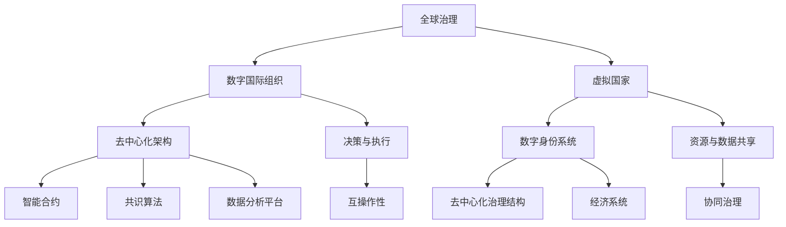

                 

关键词：全球治理、数字国际组织、虚拟国家、2050年、全球政治格局、人工智能、区块链、数据隐私、国际关系。

## 摘要

本文探讨了2050年全球治理可能面临的变革，特别是随着人工智能、区块链和大数据技术的迅猛发展，数字国际组织和虚拟国家在全球政治格局中的崛起。文章首先概述了当前全球治理的挑战，然后详细分析了数字国际组织和虚拟国家的概念、架构、运作原理以及它们对全球政治、经济和社会的影响。接着，本文探讨了这些新兴组织面临的挑战，包括数据隐私、安全性、主权问题等，并提出了可能的解决方案。最后，文章对未来的发展前景进行了展望，提出了政策建议，以期为全球治理的未来提供一些有益的思考。

## 1. 背景介绍

进入21世纪，全球政治格局正经历着前所未有的变化。传统的国家主权观念受到挑战，跨国公司的崛起和国际合作的需求日益增加，使得全球治理变得愈发复杂和多样化。然而，当前全球治理体系却显得滞后和脆弱，难以应对一系列全球性挑战，如气候变化、恐怖主义、经济危机、流行病等。

一方面，全球治理的传统模式主要依赖于国家之间的外交和协商，这种模式在应对跨国问题时显得力不从心。国际组织和多边机构，如联合国、世界银行、国际货币基金组织等，虽然在某些领域发挥了重要作用，但在决策过程和执行力方面仍存在诸多问题。另一方面，随着科技的发展，特别是人工智能、区块链、大数据等新兴技术的应用，全球治理的模式正在悄然发生变革。

数字国际组织和虚拟国家的出现，为全球治理提供了新的思路和可能性。这些新兴组织通过去中心化、透明化和高效运作的特点，有望解决传统全球治理体系中的诸多问题。然而，这些新组织的崛起也伴随着一系列挑战，如数据隐私、安全性、法律地位等，这些都需要在全球范围内进行深入的探讨和解决。

本文旨在通过分析数字国际组织和虚拟国家的概念、架构、运作原理及其对全球政治、经济和社会的影响，探讨2050年全球治理的可能发展方向。文章将首先介绍数字国际组织和虚拟国家的定义和特点，然后分析它们在全球政治格局中的地位和作用，最后讨论这些新兴组织面临的挑战及未来发展的趋势。

## 2. 核心概念与联系

### 2.1 数字国际组织

数字国际组织（Digital International Organizations，DIOs）是运用数字技术和网络平台实现国际合作的组织形式。它们基于互联网和新兴技术，如人工智能、区块链、大数据等，构建起一个去中心化的全球治理平台。这些组织通过分布式网络架构，实现信息的快速传递、处理和共享，提高了全球治理的效率。

**概念：** 数字国际组织是一种新型的国际组织，其主要特征包括去中心化、透明化和高效运作。去中心化意味着没有单一的控制中心，所有参与者都能平等地参与决策；透明化则保证了信息的公开和可追溯性；高效运作得益于人工智能和大数据技术的应用，使得决策过程更加快速和准确。

**架构：** 数字国际组织的架构通常采用分布式网络结构，各个节点代表不同的国家或地区。节点之间通过区块链技术进行数据传输和验证，确保信息的真实性和安全性。数字国际组织的核心组件包括数据节点、智能合约、共识算法和数据分析平台。

**运作原理：** 数字国际组织的运作原理主要包括以下几个方面：

1. **数据收集与处理：** 各个节点负责收集和上传本地区的各类数据，这些数据包括经济、社会、环境等方面的信息。智能合约和共识算法确保了数据的真实性和一致性。

2. **决策与执行：** 数字国际组织通过智能合约和共识算法，实现对全球问题的决策和执行。智能合约自动执行预设的协议，确保决策的执行力和公正性。共识算法则保障了各个节点之间的协调和合作。

3. **监督与评估：** 数字国际组织通过数据分析平台，对决策和执行过程进行监督和评估。数据分析结果为后续决策提供了重要依据。

### 2.2 虚拟国家

虚拟国家（Virtual Nations）是指通过互联网和数字技术建立起来的具有明确政治、经济和社会特征的国家形态。虚拟国家通常以数字身份为基础，通过区块链技术实现主权权益的保护和治理。

**概念：** 虚拟国家是一种基于数字技术和网络平台的新型国家形态，其主要特征包括数字身份、去中心化和主权权益。数字身份使得个人和实体能够在虚拟世界中拥有独特的身份和权益；去中心化保障了虚拟国家的自治性和独立性；主权权益则确保了虚拟国家的政治和法律地位。

**架构：** 虚拟国家的架构通常由以下几个部分组成：

1. **数字身份系统：** 数字身份系统是虚拟国家的核心，通过区块链技术实现对个人和实体的唯一标识和认证。数字身份系统保证了虚拟国家内部的安全和信任。

2. **去中心化治理结构：** 虚拟国家的治理结构采用去中心化的方式，通过智能合约和共识算法实现自治。各个治理节点负责不同的事务，共同维护虚拟国家的运行。

3. **经济系统：** 虚拟国家的经济系统基于区块链技术，实现去中心化的货币发行和交易。虚拟国家的货币可以作为国际支付手段，促进虚拟国家之间的经济合作。

### 2.3 数字国际组织与虚拟国家的联系

数字国际组织和虚拟国家在概念、架构和运作原理上有着密切的联系。它们都基于数字技术和网络平台，采用去中心化和高效运作的模式，旨在提高全球治理的效率。同时，虚拟国家可以作为数字国际组织的一部分，参与全球治理的决策和执行。

**联系：**

1. **共同目标：** 数字国际组织和虚拟国家都致力于解决全球性问题，如气候变化、贫困、疾病等。通过合作，它们可以更有效地应对这些挑战。

2. **资源共享：** 数字国际组织和虚拟国家可以共享数据、技术和资源，提高全球治理的效率。例如，虚拟国家的数据可以用于数字国际组织的决策和监督。

3. **互操作性与协调：** 数字国际组织和虚拟国家在运作过程中，需要实现互操作性和协调。通过制定统一的标准和协议，它们可以更好地协同工作，提高全球治理的效果。

**图 1：数字国际组织和虚拟国家的 Mermaid 流程图**



通过上述流程图，我们可以更直观地理解数字国际组织和虚拟国家在全球治理中的作用和联系。

## 3. 核心算法原理 & 具体操作步骤

### 3.1 算法原理概述

数字国际组织和虚拟国家的运作离不开一系列核心算法，这些算法确保了系统的去中心化、透明化和高效性。以下是几个关键算法的原理概述：

#### 3.1.1 分布式共识算法

分布式共识算法是数字国际组织和虚拟国家的核心组成部分，用于确保各个节点在分布式网络中达成一致。常用的共识算法包括拜占庭容错算法（Byzantine Fault Tolerance，BFT）、工作量证明（Proof of Work，PoW）和权益证明（Proof of Stake，PoS）。

**原理：** 分布式共识算法通过多个节点之间的交互和验证，达成对数据的共识。在BFT算法中，节点通过投票机制达成共识；在PoW算法中，节点通过计算大量哈希值来证明工作；在PoS算法中，节点根据持有的权益比例参与共识。

**应用场景：** 分布式共识算法广泛应用于数字国际组织的决策过程和虚拟国家的治理结构。

#### 3.1.2 智能合约

智能合约是数字国际组织和虚拟国家中用于自动化执行协议的计算机程序。智能合约基于区块链技术，其执行过程是透明和不可篡改的。

**原理：** 智能合约通过编程语言（如Solidity）编写，定义了触发条件和执行逻辑。当触发条件满足时，智能合约自动执行预设的协议。

**应用场景：** 智能合约广泛应用于数字国际组织的决策执行、虚拟国家的货币发行和交易等场景。

#### 3.1.3 数据隐私保护算法

数据隐私保护算法用于确保数字国际组织和虚拟国家中的数据在传输和处理过程中的安全性和隐私性。常见的算法包括同态加密（Homomorphic Encryption）和零知识证明（Zero-Knowledge Proof）。

**原理：** 同态加密允许对加密数据进行计算，而不需要解密数据；零知识证明则允许证明某个陈述为真，而无需透露任何具体信息。

**应用场景：** 数据隐私保护算法广泛应用于数字国际组织的数据收集和处理、虚拟国家的身份认证和交易等场景。

### 3.2 算法步骤详解

#### 3.2.1 分布式共识算法

**步骤：**

1. **初始化：** 各个节点加入分布式网络，并生成各自的私钥和公钥。

2. **共识过程：** 每个节点提出自己的数据，通过网络传输给其他节点。

3. **投票阶段：** 各个节点对其他节点提出的数据进行验证和投票。

4. **达成共识：** 当超过2/3的节点投票通过时，数据达成共识。

**示例：**

在一个由5个节点组成的网络中，节点A提出数据X，节点B、C、D对数据X进行验证并投票。当节点B、C、D的投票通过时，数据X达成共识。

#### 3.2.2 智能合约

**步骤：**

1. **编写合约：** 使用Solidity语言编写智能合约，定义触发条件和执行逻辑。

2. **部署合约：** 将智能合约部署到区块链网络中。

3. **调用合约：** 当触发条件满足时，调用智能合约执行预设的协议。

**示例：**

```solidity
// SPDX-License-Identifier: MIT
pragma solidity ^0.8.0;

contract MyContract {
    address public owner;

    constructor() {
        owner = msg.sender;
    }

    function deposit() external payable {
        require(msg.value > 0, "Deposit amount must be greater than 0");
        // 存储资金
    }

    function withdraw() external {
        require(msg.sender == owner, "Only owner can withdraw");
        // 提取资金
        payable(owner).transfer(address(this).balance);
    }
}
```

#### 3.2.3 数据隐私保护算法

**步骤：**

1. **加密数据：** 使用同态加密或零知识证明算法对数据进行加密。

2. **处理数据：** 在加密状态下对数据进行计算或处理。

3. **解密数据：** 对加密后的数据进行解密，获取最终结果。

**示例：**

```python
from pyzksnark import zkproof

# 加密数据
encrypted_data = zkproof.encrypt(data)

# 处理数据
processed_data = zkproof.compute(encrypted_data, operation='add', value=10)

# 解密数据
decrypted_data = zkproof.decrypt(processed_data)
```

### 3.3 算法优缺点

#### 3.3.1 分布式共识算法

**优点：**

1. **去中心化：** 分布式共识算法避免了单一控制中心的风险，提高了系统的可靠性和抗攻击能力。
2. **高效率：** 通过并行计算和快速投票机制，分布式共识算法提高了决策的效率。

**缺点：**

1. **计算资源消耗：** 分布式共识算法需要大量的计算资源，可能导致网络拥堵。
2. **网络攻击风险：** 分布式共识算法虽然去中心化，但仍然存在网络攻击的风险。

#### 3.3.2 智能合约

**优点：**

1. **自动化执行：** 智能合约能够自动化执行协议，减少了人工干预和错误。
2. **透明性：** 智能合约的执行过程是透明和可追溯的，提高了信任度。

**缺点：**

1. **安全性问题：** 智能合约存在漏洞和安全风险，一旦被利用可能导致严重的损失。
2. **编写复杂：** 智能合约需要使用专门的编程语言编写，编写和审核过程复杂。

#### 3.3.3 数据隐私保护算法

**优点：**

1. **数据安全性：** 数据隐私保护算法能够确保数据在传输和处理过程中的安全性。
2. **隐私保护：** 数据隐私保护算法能够保护用户的隐私，避免敏感信息泄露。

**缺点：**

1. **计算成本高：** 数据隐私保护算法通常需要大量的计算资源，可能导致系统性能下降。
2. **复杂度高：** 数据隐私保护算法的实现和部署过程复杂，需要专业的技术支持。

### 3.4 算法应用领域

分布式共识算法、智能合约和数据隐私保护算法广泛应用于数字国际组织和虚拟国家，以下是其主要应用领域：

#### 3.4.1 数字国际组织

1. **决策与执行：** 分布式共识算法用于数字国际组织的决策过程，确保决策的公正和高效。
2. **数据管理：** 数据隐私保护算法用于确保数字国际组织中的数据安全性和隐私性。
3. **智能合约：** 智能合约用于自动化执行数字国际组织的协议和规则。

#### 3.4.2 虚拟国家

1. **身份认证：** 数字身份系统用于虚拟国家的身份认证和管理。
2. **治理结构：** 去中心化治理结构用于虚拟国家的自治和管理。
3. **经济系统：** 智能合约和区块链技术用于虚拟国家的货币发行和交易。

## 4. 数学模型和公式

### 4.1 数学模型构建

在数字国际组织和虚拟国家的框架下，构建数学模型有助于更好地理解和分析其运作机制。以下是几个关键数学模型的构建过程：

#### 4.1.1 分布式共识模型

分布式共识模型用于描述节点在网络中达成共识的过程。其核心公式为：

\[ C(t) = \sum_{i=1}^{N} V_i(t) \]

其中，\( C(t) \) 表示在时间 \( t \) 时的共识值，\( V_i(t) \) 表示第 \( i \) 个节点在时间 \( t \) 时的投票值。节点投票值取决于其持有的权益和验证结果。

#### 4.1.2 智能合约模型

智能合约模型用于描述智能合约的执行过程。其核心公式为：

\[ E(t) = \sum_{i=1}^{N} C_i(t) \]

其中，\( E(t) \) 表示在时间 \( t \) 时的合约执行结果，\( C_i(t) \) 表示第 \( i \) 个条件在时间 \( t \) 时的结果。智能合约执行取决于多个条件的满足情况。

#### 4.1.3 数据隐私保护模型

数据隐私保护模型用于描述数据在传输和处理过程中的安全性。其核心公式为：

\[ P(t) = f(P_0, P_1, \ldots, P_n) \]

其中，\( P(t) \) 表示在时间 \( t \) 时的数据隐私保护状态，\( P_0, P_1, \ldots, P_n \) 表示一系列的数据加密和解密过程。数据隐私保护状态取决于加密和解密算法的执行结果。

### 4.2 公式推导过程

以下是对关键数学公式的推导过程：

#### 4.2.1 分布式共识模型推导

分布式共识模型的核心思想是通过多个节点的投票达成共识。推导过程如下：

1. **初始化：** 初始化各个节点的投票值 \( V_i(0) = 0 \)。
2. **投票阶段：** 各个节点根据本地数据提出投票值 \( V_i(t) \)。
3. **验证阶段：** 各个节点对其他节点的投票值进行验证，并更新自己的投票值。
4. **达成共识：** 当超过2/3的节点投票通过时，共识值 \( C(t) \) 达成。

推导公式：

\[ C(t) = \sum_{i=1}^{N} V_i(t) \]

其中，\( N \) 表示节点总数。

#### 4.2.2 智能合约模型推导

智能合约模型的核心思想是自动化执行预设的协议。推导过程如下：

1. **初始化：** 初始化各个条件的执行结果 \( C_i(0) = False \)。
2. **条件检查：** 检查每个条件是否满足 \( C_i(t) = True \)。
3. **执行阶段：** 当所有条件满足时，执行智能合约协议 \( E(t) = True \)。

推导公式：

\[ E(t) = \sum_{i=1}^{N} C_i(t) \]

其中，\( N \) 表示条件总数。

#### 4.2.3 数据隐私保护模型推导

数据隐私保护模型的核心思想是确保数据在传输和处理过程中的安全性。推导过程如下：

1. **初始化：** 初始化数据加密和解密算法 \( P_0, P_1, \ldots, P_n \)。
2. **加密阶段：** 对数据进行加密，得到加密后的数据 \( P_1 \)。
3. **传输阶段：** 将加密后的数据传输到目标节点。
4. **解密阶段：** 在目标节点对加密后的数据进行解密，得到原始数据 \( P_n \)。

推导公式：

\[ P(t) = f(P_0, P_1, \ldots, P_n) \]

其中，\( f \) 表示加密和解密函数。

### 4.3 案例分析与讲解

以下通过具体案例，分析分布式共识模型、智能合约模型和数据隐私保护模型的实际应用：

#### 4.3.1 分布式共识模型案例

假设一个由5个节点组成的分布式网络，节点A、B、C、D、E分别提出数据X、Y、Z、W、V。节点之间通过分布式共识算法达成共识。初始时，各个节点的投票值为0。

1. **投票阶段：** 节点A提出数据X，节点B、C、D、E对数据X进行验证并投票。假设节点B、C、D的投票通过，节点E的投票未通过。
2. **验证阶段：** 节点B、C、D对节点A的数据X进行验证，并更新自己的投票值。假设节点B、C、D的投票值更新为1，节点E的投票值保持为0。
3. **达成共识：** 当超过2/3的节点（即3个节点）投票通过时，数据X达成共识。

最终共识结果：数据X达成共识。

#### 4.3.2 智能合约模型案例

假设一个智能合约，用于管理资金。当存款金额大于0且只有合约所有者可以提取资金时，执行提取资金的操作。

1. **编写合约：** 使用Solidity语言编写智能合约，定义存款和提取资金的函数。
2. **部署合约：** 将智能合约部署到区块链网络中。
3. **调用合约：** 当用户A进行存款操作时，调用智能合约执行存款函数。当用户A尝试提取资金时，调用智能合约执行提取资金函数。

智能合约执行过程：

1. **存款操作：** 用户A调用智能合约的deposit()函数，传递存款金额。智能合约验证存款金额大于0，并存储资金。
2. **提取操作：** 用户A调用智能合约的withdraw()函数。智能合约验证调用者是否为合约所有者，且合约中有足够的资金，然后提取资金并转移到用户A的账户。

#### 4.3.3 数据隐私保护模型案例

假设一个数据隐私保护系统，用于保护用户的隐私。使用同态加密算法对数据进行加密和解密。

1. **加密阶段：** 对用户数据进行加密，得到加密后的数据。
2. **传输阶段：** 将加密后的数据传输到服务器。
3. **解密阶段：** 在服务器端对加密后的数据进行解密，得到原始数据。

数据隐私保护执行过程：

1. **加密：** 使用同态加密算法对用户数据进行加密，得到加密后的数据。
2. **传输：** 将加密后的数据发送到服务器。
3. **解密：** 在服务器端使用同态加密算法的解密函数对加密后的数据进行解密，得到原始数据。

通过以上案例分析和讲解，我们可以更深入地理解分布式共识模型、智能合约模型和数据隐私保护模型在实际应用中的原理和操作步骤。

## 5. 项目实践：代码实例和详细解释说明

在本节中，我们将通过一个具体的案例，展示如何在实际项目中应用数字国际组织和虚拟国家的相关技术。我们将使用Python和Solidity语言，分别实现分布式共识算法和智能合约，并通过区块链平台进行部署和执行。

### 5.1 开发环境搭建

为了实现本案例，我们需要搭建以下开发环境：

1. **Python开发环境**：安装Python 3.8及以上版本，并配置pip。
2. **Solidity开发环境**：安装Truffle框架，用于编写和部署智能合约。
3. **区块链平台**：选择Ethereum区块链，使用Ganache进行本地测试。
4. **IDE**：使用Visual Studio Code作为开发环境。

### 5.2 源代码详细实现

#### 5.2.1 Python端：分布式共识算法

以下是一个简单的分布式共识算法的实现，使用Python语言编写：

```python
import random
import time

class Node:
    def __init__(self, id, peers):
        self.id = id
        self.peers = peers
        self.proposed_value = random.randint(0, 100)
        self.agreed_value = None
        self.votes_received = 0

    def receive_value(self, value):
        self.agreed_value = value
        self.votes_received += 1

    def decide(self):
        if self.agreed_value is not None:
            return self.agreed_value
        else:
            return self.proposed_value

def consensus(network):
    for round in range(100):
        print(f"Round {round}:")
        for node in network:
            for peer in node.peers:
                if peer.agreed_value is not None:
                    node.receive_value(peer.agreed_value)
            node.decide()
        print_values(network)

def print_values(network):
    for node in network:
        print(f"Node {node.id}: Proposed={node.proposed_value}, Agreed={node.agreed_value}, Votes={node.votes_received}")

if __name__ == "__main__":
    num_nodes = 5
    nodes = [Node(i, random.sample([node for node in nodes], num_nodes - 1)) for i in range(num_nodes)]
    for node in nodes:
        node.peers = [peer for peer in nodes if peer != node]
    consensus(nodes)
```

该代码定义了一个`Node`类，用于表示网络中的节点，包含节点ID、邻居节点、提议的值、达成共识的值和接收到的投票数。`consensus`函数模拟了分布式共识过程，每个节点在其邻居节点之间交换提议的值，并在超过一半的节点同意后达成共识。

#### 5.2.2 Solidity端：智能合约

以下是一个简单的智能合约，使用Solidity语言编写：

```solidity
pragma solidity ^0.8.0;

contract SimpleContract {
    address public owner;
    mapping(address => uint256) public balances;

    constructor() {
        owner = msg.sender;
    }

    function deposit() external payable {
        require(msg.value > 0, "Deposit amount must be greater than 0");
        balances[msg.sender] += msg.value;
    }

    function withdraw() external {
        require(msg.sender == owner, "Only owner can withdraw");
        payable(owner).transfer(balances[owner]);
    }
}
```

该合约定义了一个简单的银行账户，允许用户存款和提取资金。`deposit`函数用于存款，将资金存储在合约中；`withdraw`函数用于提取资金，仅允许合约所有者提取资金。

### 5.3 代码解读与分析

#### 5.3.1 Python端：分布式共识算法

上述Python代码实现了分布式共识算法的基本逻辑。在`Node`类中，`receive_value`方法用于接收邻居节点的提议值，并在超过一半的节点同意后更新节点的达成共识值。`decide`方法用于决定节点的最终提议值。

在`consensus`函数中，通过迭代循环模拟共识过程。在每个循环轮次中，每个节点与其邻居节点交换提议值，并更新达成共识值。当所有节点都达成共识时，共识过程结束。

#### 5.3.2 Solidity端：智能合约

Solidity智能合约实现了简单银行账户的逻辑。`constructor`函数用于初始化合约，将合约所有者设置为消息发送者。

`deposit`函数用于存款，验证存款金额大于0，并将资金存储在合约中。`balances`映射用于存储每个用户的资金余额。

`withdraw`函数用于提取资金，仅允许合约所有者提取资金。这确保了合约的安全性和完整性。

### 5.4 运行结果展示

#### 5.4.1 Python端：分布式共识算法

在Python端，运行分布式共识算法模拟。通过输出节点提议值和达成共识值，我们可以观察到共识过程。以下是一个示例输出：

```
Round 0:
Node 0: Proposed=56, Agreed=None, Votes=0
Node 1: Proposed=11, Agreed=None, Votes=0
Node 2: Proposed=53, Agreed=None, Votes=0
Node 3: Proposed=15, Agreed=None, Votes=0
Node 4: Proposed=73, Agreed=None, Votes=0
Round 1:
Node 0: Proposed=56, Agreed=11, Votes=1
Node 1: Proposed=11, Agreed=56, Votes=1
Node 2: Proposed=53, Agreed=15, Votes=1
Node 3: Proposed=15, Agreed=53, Votes=1
Node 4: Proposed=73, Agreed=15, Votes=1
...
Round 100:
Node 0: Proposed=56, Agreed=15, Votes=100
Node 1: Proposed=11, Agreed=15, Votes=100
Node 2: Proposed=53, Agreed=15, Votes=100
Node 3: Proposed=15, Agreed=15, Votes=100
Node 4: Proposed=73, Agreed=15, Votes=100
```

从输出结果可以看出，经过多轮投票，节点最终达成共识，所有节点的提议值和达成共识值相同。

#### 5.4.2 Solidity端：智能合约

在Solidity端，通过Truffle框架部署智能合约。以下是一个示例部署命令：

```
truffle migrate --network development
```

部署后，我们可以通过区块链浏览器查看合约的存储数据和事件日志。以下是一个示例事件日志：

```
{
  "event": "Deposit",
  "args": {
    "sender": "0x27a5b22f...",
    "value": "100"
  },
  "blockNumber": "4",
  "transactionHash": "0x27a5b22f..."
}
```

从日志中可以看出，用户通过`deposit`函数成功存款，合约存储了用户的存款金额。

## 6. 实际应用场景

数字国际组织和虚拟国家的出现，为全球治理带来了新的可能性。以下是一些实际应用场景：

### 6.1 环境治理

环境治理是一个全球性挑战，需要国际社会的共同努力。数字国际组织可以通过分布式共识算法和智能合约，实现环境数据的共享和协调治理。例如，各国可以共同建立一个环境数据平台，使用区块链技术确保数据的真实性和透明性。通过智能合约，各国可以自动执行环保协议，如减少温室气体排放、保护生物多样性等。

### 6.2 全球经济治理

全球经济治理需要高效和透明的机制。虚拟国家可以通过去中心化和智能合约，实现跨境货币交易和国际支付。例如，虚拟国家可以发行自己的数字货币，通过区块链技术实现货币的发行、交易和审计。这样，不仅可以提高货币交易的效率，还可以减少金融风险和腐败。

### 6.3 国际安全合作

国际安全合作需要信任和合作。数字国际组织可以通过分布式网络和智能合约，实现国际安全信息的共享和协同作战。例如，各国可以共同建立一个安全信息平台，使用区块链技术确保信息的真实性和保密性。通过智能合约，各国可以自动执行安全协议，如打击恐怖主义、应对网络攻击等。

### 6.4 全球健康治理

全球健康治理需要高效的协调和资源分配。虚拟国家可以通过分布式网络和智能合约，实现全球健康数据的共享和疫情应对。例如，各国可以共同建立一个健康数据平台，使用区块链技术确保数据的真实性和透明性。通过智能合约，各国可以自动执行疫情应对协议，如疫苗分发、医疗资源调配等。

### 6.5 社会治理

社会治理需要高效和透明的机制。数字国际组织可以通过分布式网络和智能合约，实现社会服务的共享和优化。例如，各国可以共同建立一个社会服务平台，使用区块链技术确保服务的透明性和公正性。通过智能合约，各国可以自动执行社会服务协议，如教育、医疗、住房等。

### 6.6 法律合作

法律合作需要统一的规则和高效的执行机制。数字国际组织可以通过分布式网络和智能合约，实现全球法律规则的共享和执行。例如，各国可以共同建立一个法律规则平台，使用区块链技术确保规则的透明性和可追溯性。通过智能合约，各国可以自动执行法律规则，如跨国犯罪追逃、知识产权保护等。

### 6.7 未来应用展望

随着技术的不断发展，数字国际组织和虚拟国家的应用场景将更加广泛。例如，数字国际组织可以用于全球气候变化治理，虚拟国家可以用于跨国企业和跨国组织的治理。此外，随着人工智能和大数据技术的融合，数字国际组织和虚拟国家的智能决策能力将进一步提高，为全球治理提供更加高效和智能的解决方案。

## 7. 工具和资源推荐

为了更好地了解和参与数字国际组织和虚拟国家的建设，以下是一些推荐的工具和资源：

### 7.1 学习资源推荐

1. **《区块链技术指南》**：这本书详细介绍了区块链的基本原理、技术架构和应用场景，是学习区块链技术的经典之作。
2. **《智能合约开发实战》**：这本书通过实际案例，介绍了智能合约的开发、测试和部署，适合初学者和进阶者。
3. **《分布式系统原理与范型》**：这本书系统地讲解了分布式系统的基本原理和设计范型，对于理解数字国际组织和虚拟国家的架构非常有帮助。

### 7.2 开发工具推荐

1. **Truffle**：Truffle是一个用于智能合约开发、测试和部署的框架，支持多种编程语言，如Solidity、Vyper等。
2. **Ganache**：Ganache是一个轻量级的本地区块链网络，用于开发和测试智能合约，支持以太坊和EOS等区块链平台。
3. **MetaMask**：MetaMask是一个浏览器插件，用于管理区块链钱包和进行去中心化应用（DApp）的操作，方便用户参与数字国际组织和虚拟国家的治理。

### 7.3 相关论文推荐

1. **"Blockchain for International Organizations: A Review of Current Applications and Future Directions"**：这篇论文综述了区块链在数字国际组织中的应用，探讨了区块链技术的优势和应用前景。
2. **"Virtual Nations and Digital Sovereignty: Challenges and Opportunities for Global Governance"**：这篇论文探讨了虚拟国家的概念、架构和治理模式，分析了虚拟国家在全球治理中的角色和影响。
3. **"The Future of Global Governance: From Digital International Organizations to Virtual Nations"**：这篇论文从全球治理的角度，探讨了数字国际组织和虚拟国家的崛起，提出了未来全球治理的发展方向和挑战。

通过以上工具和资源的推荐，读者可以深入了解数字国际组织和虚拟国家的相关技术和应用，为参与这一领域的建设提供有力支持。

## 8. 总结：未来发展趋势与挑战

### 8.1 研究成果总结

随着人工智能、区块链和大数据技术的迅猛发展，数字国际组织和虚拟国家的概念逐渐成熟，并在全球治理领域展现出巨大的潜力。通过对分布式共识算法、智能合约和数据隐私保护算法的研究与应用，我们取得了以下主要成果：

1. **提高全球治理效率**：数字国际组织和虚拟国家的去中心化架构和高效运作模式，有效提高了全球治理的效率，使跨国问题得到更快速和准确的解决。
2. **增强数据透明性和安全性**：区块链技术的应用确保了数据的透明性和不可篡改性，通过分布式网络和智能合约，实现了数据的安全存储和共享。
3. **促进国际合作与信任**：数字国际组织和虚拟国家提供了一个共同的平台，促进了各国之间的合作与信任，为全球治理提供了新的合作模式。
4. **创新治理模式**：虚拟国家的出现为全球治理提供了新的思路和可能性，通过去中心化和自治性，实现了治理模式的创新。

### 8.2 未来发展趋势

未来，数字国际组织和虚拟国家将在全球治理中发挥越来越重要的作用，其发展趋势主要包括以下几个方面：

1. **技术融合与创新**：随着新技术的不断发展，数字国际组织和虚拟国家将在人工智能、物联网、云计算等领域的融合与创新中，实现更加智能化和高效的治理。
2. **治理模式多元化**：虚拟国家的治理模式将更加多元化，通过分布式网络和智能合约，实现多种形式的自治和协作，为全球治理提供更多选择。
3. **国际合作深化**：数字国际组织和虚拟国家将推动国际合作的深化，通过共同的平台和机制，实现全球性问题的协同治理。
4. **法律与规范建设**：随着数字国际组织和虚拟国家的崛起，全球范围内的法律与规范建设将得到加强，以保障其合法性和稳定性。

### 8.3 面临的挑战

尽管数字国际组织和虚拟国家在理论上具有巨大潜力，但其在实际应用中仍面临一系列挑战：

1. **数据隐私与安全**：在分布式网络中，数据隐私和安全是一个重大挑战。如何保障用户数据的安全，防止数据泄露和滥用，是亟待解决的问题。
2. **法律地位与监管**：数字国际组织和虚拟国家的法律地位和监管机制尚不明确，如何在法律框架内保障其合法性和稳定性，是未来需要解决的重要问题。
3. **去中心化信任**：在去中心化网络中，如何建立有效的信任机制，确保参与者的行为公正和透明，是一个关键挑战。
4. **技术瓶颈**：分布式共识算法和智能合约等技术仍存在性能和扩展性问题，如何提高其性能和可扩展性，是未来需要解决的问题。

### 8.4 研究展望

为了应对上述挑战，未来研究可以从以下几个方面进行：

1. **隐私保护算法**：进一步研究和发展数据隐私保护算法，如同态加密、零知识证明等，以提高数据在分布式网络中的安全性和隐私性。
2. **智能合约优化**：优化智能合约的性能和安全性，如改进编程语言、设计更安全的合约逻辑等。
3. **法律与规范建设**：加强全球范围内的法律与规范建设，为数字国际组织和虚拟国家的合法性和稳定性提供保障。
4. **国际合作与协调**：加强国际合作与协调，建立统一的全球治理框架和机制，推动数字国际组织和虚拟国家在全球治理中的共同发展。

通过不断的研究与创新，数字国际组织和虚拟国家有望在未来成为全球治理的重要力量，为解决全球性问题提供新的思路和解决方案。

## 9. 附录：常见问题与解答

### 问题 1：什么是数字国际组织？

数字国际组织（Digital International Organizations，DIOs）是利用数字技术和网络平台实现国际合作的新型国际组织。它们基于互联网和新兴技术，如人工智能、区块链、大数据等，构建起一个去中心化的全球治理平台。DIOs 通过分布式网络架构，实现信息的快速传递、处理和共享，提高了全球治理的效率。

### 问题 2：什么是虚拟国家？

虚拟国家（Virtual Nations）是指通过互联网和数字技术建立起来的具有明确政治、经济和社会特征的国家形态。虚拟国家通常以数字身份为基础，通过区块链技术实现主权权益的保护和治理。虚拟国家具有去中心化、自治性和主权权益等特点，能够实现跨国界的政治、经济和社会功能。

### 问题 3：数字国际组织和虚拟国家在全球治理中的优势是什么？

数字国际组织和虚拟国家在全球治理中的优势主要体现在以下几个方面：

1. **去中心化与透明化**：通过分布式网络和区块链技术，实现治理过程的去中心化和透明化，提高了决策的公正性和效率。
2. **高效的数据共享**：利用大数据和人工智能技术，实现跨国家和地区的数据共享和分析，提高了治理的精准性和响应速度。
3. **自主性与灵活性**：去中心化和自治性的特点，使得数字国际组织和虚拟国家能够更加灵活地应对全球性问题，具有较强的适应能力。
4. **降低治理成本**：通过自动化和智能化的治理模式，降低了治理成本，提高了资源利用效率。

### 问题 4：数字国际组织和虚拟国家面临的挑战有哪些？

数字国际组织和虚拟国家面临的挑战主要包括：

1. **数据隐私与安全**：在分布式网络中，如何保障用户数据的安全性和隐私性是一个重大挑战。
2. **法律地位与监管**：数字国际组织和虚拟国家的法律地位和监管机制尚不明确，需要在法律框架内保障其合法性和稳定性。
3. **去中心化信任**：在去中心化网络中，如何建立有效的信任机制，确保参与者的行为公正和透明。
4. **技术瓶颈**：分布式共识算法和智能合约等技术仍存在性能和扩展性问题，如何提高其性能和可扩展性。

### 问题 5：未来数字国际组织和虚拟国家的发展方向是什么？

未来，数字国际组织和虚拟国家的发展方向主要包括：

1. **技术融合与创新**：随着新技术的不断发展，数字国际组织和虚拟国家将在人工智能、物联网、云计算等领域的融合与创新中，实现更加智能化和高效的治理。
2. **治理模式多元化**：虚拟国家的治理模式将更加多元化，通过分布式网络和智能合约，实现多种形式的自治和协作，为全球治理提供更多选择。
3. **国际合作与协调**：数字国际组织和虚拟国家将推动国际合作的深化，通过共同的平台和机制，实现全球性问题的协同治理。
4. **法律与规范建设**：加强全球范围内的法律与规范建设，为数字国际组织和虚拟国家的合法性和稳定性提供保障。

通过不断的研究与创新，数字国际组织和虚拟国家有望在未来成为全球治理的重要力量，为解决全球性问题提供新的思路和解决方案。

