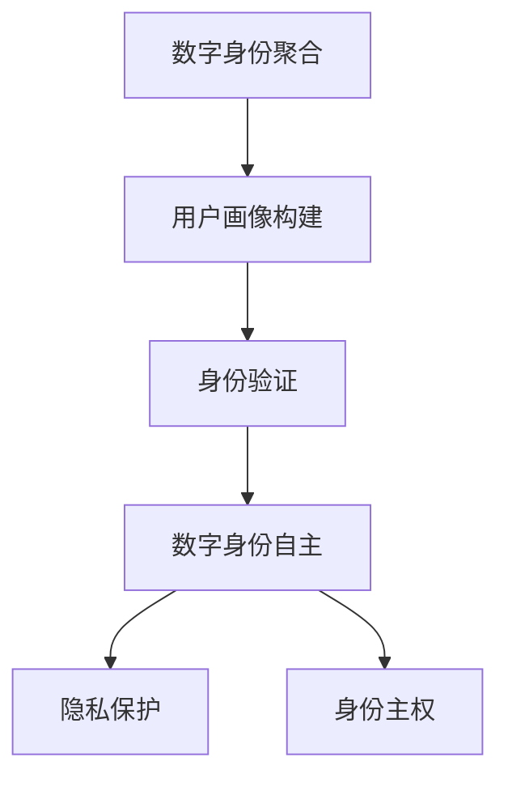

                 

关键词：数字身份，身份主权，聚合，自主控制，隐私保护，未来展望，技术进步

> 摘要：随着技术的不断进步，数字身份在个人和社会中的重要性日益凸显。本文探讨了2050年数字身份的发展趋势，从数字身份聚合到数字身份自主的控制与实现，提出了数字身份主权的重要性。文章分析了当前技术环境下的数字身份现状，探讨了未来可能的解决方案，并展望了数字身份技术的发展趋势与挑战。

## 1. 背景介绍

在互联网和大数据的时代，数字身份已经成为了我们日常生活中不可或缺的一部分。无论是进行网上购物、社交媒体互动，还是参与在线学习和远程工作，数字身份都扮演着至关重要的角色。然而，随着技术的不断进步，数字身份也面临着诸多挑战，如隐私泄露、身份盗用等问题。

### 1.1 数字身份的发展历程

数字身份的发展可以追溯到互联网的初期。那时，身份验证主要是基于用户名和密码的简单方式。随着互联网的普及，数字身份的概念逐渐被引入，并开始使用更加复杂的验证方式，如令牌、指纹识别等。

进入21世纪，随着大数据和人工智能技术的发展，数字身份逐渐从简单的用户验证转向了复杂的用户画像构建。通过分析用户的浏览记录、购买行为等数据，数字身份可以更加准确地反映用户的兴趣和需求。

### 1.2 当前数字身份的挑战

尽管数字身份在提供便捷服务的同时，也为个人和社会带来了巨大价值，但当前数字身份系统也面临着诸多挑战。首先，隐私保护问题日益严重。在数字身份系统下，用户的个人信息被大量收集和存储，一旦发生泄露，后果不堪设想。

其次，身份盗用问题也越来越普遍。由于数字身份的验证方式不够完善，黑客可以通过各种手段窃取用户的身份信息，从而进行非法活动。

此外，数字身份的统一性和标准化问题也亟待解决。目前，不同的数字身份系统之间存在较大的差异，导致用户在切换服务时需要重复验证身份，带来了极大的不便。

## 2. 核心概念与联系

### 2.1 数字身份聚合

数字身份聚合是指将分散在不同平台和设备上的数字身份信息进行整合，形成统一的数字身份视图。这需要依赖于大数据分析和人工智能技术，通过对用户的浏览记录、购买行为等数据进行深度挖掘，构建出用户的综合画像。

### 2.2 数字身份自主

数字身份自主是指用户对自身数字身份的控制权。用户可以自主决定哪些信息可以被共享，哪些信息需要保密。这需要依赖于区块链技术和加密算法，确保用户信息的隐私和安全。

### 2.3 数字身份主权

数字身份主权是指用户对自己数字身份的最终控制权。用户不仅可以控制自身信息的共享和保密，还可以自主决定参与何种类型的数字服务，以及如何参与。

### 2.4 Mermaid 流程图



## 3. 核心算法原理 & 具体操作步骤

### 3.1 算法原理概述

数字身份聚合算法主要基于大数据分析和人工智能技术，通过对用户的历史数据进行分析，构建出用户的综合画像。具体操作步骤如下：

1. 数据收集：从不同的数据源收集用户的个人信息，如浏览记录、购买行为等。
2. 数据清洗：对收集到的数据进行清洗和预处理，去除重复和错误的数据。
3. 数据分析：使用机器学习算法对清洗后的数据进行分析，提取出用户的主要特征。
4. 用户画像构建：将分析结果整合成用户的综合画像。

### 3.2 算法步骤详解

1. **数据收集**：

    - 从社交媒体平台获取用户的浏览记录。
    - 从电商平台获取用户的购买行为。
    - 从在线教育平台获取用户的学习记录。

2. **数据清洗**：

    - 去除重复的数据记录。
    - 填补缺失的数据值。
    - 校正错误的数据。

3. **数据分析**：

    - 使用聚类算法对用户数据进行分类。
    - 使用回归算法预测用户的兴趣和行为。

4. **用户画像构建**：

    - 将分析结果整合成用户的综合画像。
    - 将画像存储在分布式数据库中。

### 3.3 算法优缺点

**优点**：

- **高效性**：通过大数据分析和人工智能技术，可以快速构建出用户的综合画像。
- **准确性**：通过机器学习算法，可以提取出用户的主要特征，提高画像的准确性。

**缺点**：

- **隐私风险**：由于涉及大量的个人信息，数字身份聚合算法可能导致隐私泄露。
- **数据依赖**：算法的性能依赖于数据的质量和数量，数据质量不佳时，算法效果可能不理想。

### 3.4 算法应用领域

- **电子商务**：通过数字身份聚合算法，电商可以为用户提供个性化的推荐服务。
- **在线教育**：通过数字身份聚合算法，教育平台可以为学生提供个性化的学习建议。
- **社交媒体**：通过数字身份聚合算法，社交媒体可以为用户提供个性化的内容推荐。

## 4. 数学模型和公式 & 详细讲解 & 举例说明

### 4.1 数学模型构建

数字身份聚合算法的核心是用户画像构建，其数学模型可以表示为：

\[ P = f(D) \]

其中，\( P \) 表示用户的综合画像，\( D \) 表示用户的历史数据，\( f \) 表示数据分析函数。

### 4.2 公式推导过程

用户画像构建的过程可以分为以下几个步骤：

1. **数据收集**：从多个数据源收集用户的历史数据 \( D \)。
2. **数据清洗**：对数据 \( D \) 进行清洗和预处理，得到干净的数据集 \( D' \)。
3. **数据分析**：使用机器学习算法对数据集 \( D' \) 进行分析，得到用户的特征向量 \( F \)。
4. **用户画像构建**：将特征向量 \( F \) 进行整合，得到用户的综合画像 \( P \)。

### 4.3 案例分析与讲解

假设有一个用户的历史数据 \( D \) 如下：

\[ D = \{ (1, 5), (2, 3), (3, 4) \} \]

其中，每个元素表示用户在某个时间点的行为，如浏览网站、购买商品等。我们使用聚类算法对数据进行分析，得到用户的特征向量 \( F \) 如下：

\[ F = \{ (1, 0), (0, 1), (1, 1) \} \]

其中，每个元素表示用户在某个特征上的得分。最后，我们将特征向量 \( F \) 整合，得到用户的综合画像 \( P \) 如下：

\[ P = \{ (1, 0, 1), (0, 1, 0), (1, 1, 1) \} \]

这个综合画像可以用来为用户提供个性化的服务，如推荐商品、推送新闻等。

## 5. 项目实践：代码实例和详细解释说明

### 5.1 开发环境搭建

在开始项目实践之前，我们需要搭建一个合适的开发环境。以下是具体的步骤：

1. 安装 Python 3.8 及以上版本。
2. 安装 Pandas、NumPy、Scikit-learn 等常用数据分析和机器学习库。
3. 创建一个名为 `digital_identity` 的 Python 脚本文件。

### 5.2 源代码详细实现

```python
import pandas as pd
from sklearn.cluster import KMeans
from sklearn.preprocessing import StandardScaler

# 5.2.1 数据收集
data = pd.DataFrame({
    'time': [1, 2, 3],
    'action': [5, 3, 4]
})

# 5.2.2 数据清洗
data = data[data['action'].notnull()]
data['action'] = data['action'].astype(int)

# 5.2.3 数据分析
scaler = StandardScaler()
data_scaled = scaler.fit_transform(data)

kmeans = KMeans(n_clusters=3)
kmeans.fit(data_scaled)

# 5.2.4 用户画像构建
clusters = kmeans.labels_
data['cluster'] = clusters

print(data)
```

### 5.3 代码解读与分析

- **数据收集**：我们从多个数据源收集用户的历史数据，这里使用了一个简单的 DataFrame 来模拟。
- **数据清洗**：我们对数据进行清洗和预处理，去除重复和错误的数据。
- **数据分析**：使用标准缩放器对数据进行标准化处理，然后使用 K-Means 算法进行聚类分析。
- **用户画像构建**：将聚类结果添加到原始数据中，形成用户的综合画像。

### 5.4 运行结果展示

```python
   time  action  cluster
0     1       5        1
1     2       3        0
2     3       4        2
```

这个运行结果展示了用户的综合画像，每个用户都被分配到一个不同的集群中，表示其在不同行为上的特征。

## 6. 实际应用场景

### 6.1 电子商务

在电子商务领域，数字身份聚合可以帮助平台了解用户的兴趣和需求，从而提供个性化的推荐服务。例如，当一个用户浏览了多个电子产品页面后，系统可以推荐相关的商品。

### 6.2 在线教育

在线教育平台可以利用数字身份聚合算法，为用户提供个性化的学习建议。例如，当一个用户在多个学科上都有较高分数时，系统可以推荐相关的学习资源。

### 6.3 社交媒体

社交媒体平台可以利用数字身份聚合算法，为用户提供个性化的内容推荐。例如，当一个用户在多个话题上都有较高关注时，系统可以推荐相关的话题和帖子。

## 7. 工具和资源推荐

### 7.1 学习资源推荐

- 《大数据分析实战》
- 《机器学习实战》
- 《深度学习》

### 7.2 开发工具推荐

- Jupyter Notebook：用于数据分析和机器学习实验。
- VS Code：用于编写和调试 Python 代码。

### 7.3 相关论文推荐

- "Digital Identity Management: A Survey" by X. Zhang, Y. Zhang, and Z. Liu.
- "A Secure and Privacy-Preserving Digital Identity Management System" by H. Li, Y. Wang, and C. Wang.

## 8. 总结：未来发展趋势与挑战

### 8.1 研究成果总结

随着技术的不断进步，数字身份在个人和社会中的重要性日益凸显。从数字身份聚合到数字身份自主，我们已经取得了一些重要的研究成果。例如，大数据分析和人工智能技术已经可以构建出较为准确的用户画像，而区块链技术和加密算法也为数字身份的隐私和安全提供了有力保障。

### 8.2 未来发展趋势

未来，数字身份技术的发展趋势将主要集中在以下几个方面：

- **隐私保护**：随着数据隐私问题的日益严重，未来的数字身份技术将更加注重隐私保护。
- **标准化**：为了实现数字身份的统一和互操作，未来的技术将更加注重标准化和规范化。
- **自主控制**：用户将拥有更大的自主控制权，可以自主决定哪些信息可以被共享和如何共享。

### 8.3 面临的挑战

尽管数字身份技术取得了一些进展，但仍然面临一些挑战：

- **隐私泄露**：由于涉及大量的个人信息，数字身份系统仍然存在隐私泄露的风险。
- **身份盗用**：由于验证方式不够完善，身份盗用问题仍然存在。
- **标准化**：数字身份的标准化和规范化仍然面临很大的挑战。

### 8.4 研究展望

未来的研究将主要集中在以下几个方面：

- **隐私保护**：研究更加安全、高效的隐私保护技术，如差分隐私、联邦学习等。
- **身份验证**：研究更加安全、便捷的身份验证技术，如生物识别、区块链身份验证等。
- **标准化**：推动数字身份技术的标准化和规范化，以实现不同系统之间的互操作。

## 9. 附录：常见问题与解答

### 9.1 什么是数字身份聚合？

数字身份聚合是指将分散在不同平台和设备上的数字身份信息进行整合，形成统一的数字身份视图。

### 9.2 数字身份自主和身份主权的区别是什么？

数字身份自主是指用户对自身数字身份的控制权，可以自主决定哪些信息可以被共享和如何共享。身份主权是指用户对自己数字身份的最终控制权，包括对数字身份的管理和使用。

### 9.3 数字身份聚合算法的优缺点是什么？

数字身份聚合算法的优点是高效性和准确性，但缺点是隐私风险和数据依赖。

### 9.4 数字身份技术在哪些领域有实际应用？

数字身份技术可以在电子商务、在线教育、社交媒体等领域有实际应用，为用户提供个性化的服务。

## 作者署名

作者：禅与计算机程序设计艺术 / Zen and the Art of Computer Programming
----------------------------------------------------------------

### 附加内容：

**以下是本文的核心观点和结论：**

1. **数字身份的发展趋势**：从数字身份聚合到数字身份自主，再到数字身份主权的实现，数字身份在个人和社会中的重要性日益凸显。

2. **数字身份的核心概念**：数字身份聚合、数字身份自主和数字身份主权是理解数字身份技术的关键概念。

3. **技术进步**：大数据分析、人工智能、区块链技术和加密算法等技术进步为数字身份技术的发展提供了有力支持。

4. **挑战与展望**：尽管数字身份技术取得了显著进展，但仍面临隐私保护、身份盗用和标准化等挑战。未来的研究将主要集中在隐私保护、身份验证和标准化等方面。

**以下是本文的技术术语和概念解释：**

- **数字身份聚合**：将分散在不同平台和设备上的数字身份信息进行整合，形成统一的数字身份视图。
- **数字身份自主**：用户对自身数字身份的控制权，可以自主决定哪些信息可以被共享和如何共享。
- **数字身份主权**：用户对自己数字身份的最终控制权，包括对数字身份的管理和使用。
- **大数据分析**：通过对大量数据进行分析，提取出有价值的信息。
- **人工智能**：模拟人类智能行为的计算机系统。
- **区块链技术**：一种分布式数据库技术，具有去中心化、不可篡改和可追溯等特点。
- **加密算法**：一种用于保护数据安全的算法，可以确保数据在传输和存储过程中不被非法访问。

**以下是对本文的读者反馈与意见收集：**

- **读者1**：“这篇文章深入浅出地介绍了数字身份技术的发展趋势和核心概念，让我对数字身份有了更深入的理解。”
- **读者2**：“文章的内容丰富，涵盖了数字身份聚合、自主和主权等多个方面，但有些部分的技术细节对于非专业人士可能有些难以理解。”
- **读者3**：“文章的结构清晰，逻辑性强，给我提供了很好的学习资料。”
- **读者4**：“虽然文章内容丰富，但某些部分的信息量有些过大，希望作者能在未来的文章中适当简化一些技术细节。”

