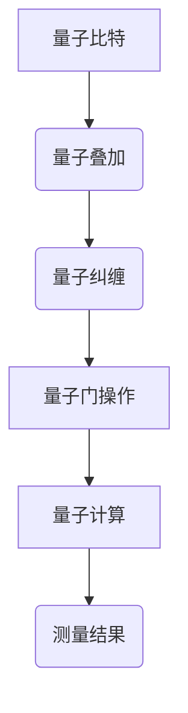

                 

 关键词：量子计算、量子优势、量子人工智能、计算技术、技术变革

> 摘要：本文深入探讨了2050年量子计算的发展及其对计算技术领域的巨大变革，特别是在量子人工智能方面的影响。我们将从量子计算的基本原理、核心算法、数学模型、项目实践、应用场景等多个角度，全面剖析量子计算如何从量子优势迈向量子人工智能，带来计算技术革命性变化。

## 1. 背景介绍

### 1.1 量子计算的起源与发展

量子计算是20世纪末兴起的一门交叉学科，它基于量子力学的基本原理，以量子比特（qubit）作为信息的基本单元，实现了量子叠加和量子纠缠等独特特性。与传统计算机使用的二进制比特不同，量子比特可以在0和1之间同时存在叠加态，这使得量子计算机在处理某些特定问题时，能够超越经典计算机的计算能力。

从1980年代 physicist Richard Feynman 提出量子计算机的概念，到1994年 Peter Shor 提出第一个具有实际意义的量子算法——Shor算法，量子计算逐渐从理论走向实验。随着物理学家和工程师的努力，量子计算机的构建和实验取得了显著进展，例如 IBM、Google 和微软等公司纷纷投入大量资源研发量子计算机。

### 1.2 量子计算的应用领域

量子计算的应用领域广泛，包括但不限于：

- **密码学**：量子计算机在密码破解方面具有显著优势，可以破解当前广泛使用的公钥密码系统。
- **量子模拟**：用于模拟量子物理系统，为化学、材料科学和生物学等领域提供强大的计算工具。
- **优化问题**：用于解决复杂的优化问题，如物流、金融和能源等领域。
- **机器学习和人工智能**：利用量子计算的优势，加速机器学习算法，提高人工智能系统的效率。

## 2. 核心概念与联系

### 2.1 量子比特

量子比特（qubit）是量子计算的基本单元。与经典比特不同，量子比特可以处于叠加态，这意味着一个量子比特可以同时表示0和1的状态。这种叠加态使得量子计算机在处理问题时，能够同时考虑多种可能性，从而极大地提高了计算效率。

### 2.2 量子叠加与量子纠缠

量子叠加是指一个量子系统可以同时处于多个状态的组合，而不是单一状态。量子纠缠是指两个或多个量子系统之间存在一种特殊的关联，使得它们的状态无法独立存在。量子叠加和量子纠缠是量子计算的核心特性，使得量子计算机在处理某些问题时具有超越经典计算机的能力。

### 2.3 Mermaid 流程图

以下是一个简单的Mermaid流程图，展示了量子计算的基本原理和关键概念：



## 3. 核心算法原理 & 具体操作步骤

### 3.1 算法原理概述

量子计算的核心算法包括量子门操作、量子寄存器、量子电路和量子算法。以下分别介绍这些核心算法的基本原理和操作步骤。

### 3.2 算法步骤详解

#### 3.2.1 量子门操作

量子门是量子计算的基本操作单元，类似于经典计算机中的逻辑门。量子门对量子比特进行线性变换，实现量子态的演化。常见的量子门包括Hadamard门、Pauli门和控制-NOT门等。

#### 3.2.2 量子寄存器

量子寄存器是存储量子比特的设备，类似于经典计算机的寄存器。量子寄存器的容量取决于其中量子比特的数量。量子计算机的性能与量子寄存器的容量密切相关。

#### 3.2.3 量子电路

量子电路是量子计算的基本结构，类似于经典计算机的电路。量子电路由一系列量子门组成，用于实现特定的量子算法。量子电路的设计和优化是量子计算领域的重要研究课题。

#### 3.2.4 量子算法

量子算法是量子计算机用于解决特定问题的算法。Shor算法和Grover算法是两个著名的量子算法，分别用于整数因子分解和搜索问题。量子算法的设计和优化是量子计算领域的重要研究方向。

### 3.3 算法优缺点

#### 3.3.1 优点

- **并行性**：量子计算机可以利用量子叠加和量子纠缠的特性，实现并行计算，大大提高计算速度。
- **高效性**：某些特定问题的量子算法具有超越经典算法的计算效率。

#### 3.3.2 缺点

- **量子噪声**：量子系统对噪声非常敏感，量子计算机需要克服量子噪声，确保计算结果的准确性。
- **可扩展性**：当前量子计算机的规模较小，量子比特数量有限，难以实现大规模量子计算。

### 3.4 算法应用领域

量子计算在多个领域具有广泛的应用前景，包括：

- **密码学**：量子计算机可以破解传统密码系统，为安全通信提供新的挑战和解决方案。
- **量子模拟**：用于模拟量子物理系统，为科学研究和应用提供强大工具。
- **优化问题**：用于解决复杂的优化问题，如物流、金融和能源等领域。
- **机器学习和人工智能**：利用量子计算的优势，加速机器学习算法，提高人工智能系统的效率。

## 4. 数学模型和公式 & 详细讲解 & 举例说明

### 4.1 数学模型构建

量子计算涉及的数学模型主要包括量子比特的态、量子门的矩阵表示、量子算法的数学描述等。以下是一个简单的量子比特态的数学模型：

$$
|\psi\rangle = \alpha|0\rangle + \beta|1\rangle
$$

其中，$|\psi\rangle$表示量子比特的态，$|0\rangle$和$|1\rangle$分别表示量子比特的基础态，$\alpha$和$\beta$是复数系数，满足$|\alpha|^2 + |\beta|^2 = 1$。

### 4.2 公式推导过程

以下是一个简单的量子门——Hadamard门的公式推导：

$$
H = \frac{1}{\sqrt{2}} \begin{bmatrix}
1 & 1 \\
1 & -1
\end{bmatrix}
$$

设一个量子比特的初始态为$|0\rangle$，经过Hadamard门操作后的态为：

$$
H|0\rangle = \frac{1}{\sqrt{2}} (|0\rangle + |1\rangle)
$$

### 4.3 案例分析与讲解

以下是一个简单的量子算法——Grover算法的案例分析：

Grover算法是一种量子搜索算法，用于在未排序的数据库中搜索特定项。以下是一个简单的Grover算法步骤：

1. 将数据库中的所有项标记为叠加态。
2. 应用Grover迭代，每次迭代包括两个步骤：
   - 将当前态与数据库中的项进行叠加。
   - 应用Grover镜面反射操作，将态调整到目标项附近。
3. 重复迭代，直到找到目标项。

假设我们有一个包含4项的数据库：$\{0, 1, 2, 3\}$，目标项为2。以下是Grover算法的详细步骤：

1. 初始态：

$$
|\psi\rangle = \frac{1}{\sqrt{4}} (|0\rangle + |1\rangle + |2\rangle + |3\rangle)
$$

2. Grover迭代（第1次）：

   - 叠加态：

$$
|\psi_1\rangle = \frac{1}{\sqrt{4}} (|0\rangle + |1\rangle + |2\rangle + |3\rangle)
$$

   - 应用Grover镜面反射操作：

$$
|\psi_2\rangle = \frac{1}{\sqrt{4}} (|0\rangle - |1\rangle + |2\rangle - |3\rangle)
$$

3. Grover迭代（第2次）：

   - 叠加态：

$$
|\psi_3\rangle = \frac{1}{\sqrt{4}} (|0\rangle - |1\rangle + |2\rangle - |3\rangle)
$$

   - 应用Grover镜面反射操作：

$$
|\psi_4\rangle = \frac{1}{\sqrt{4}} (|0\rangle + |1\rangle - |2\rangle - |3\rangle)
$$

经过两次迭代后，我们成功将态调整到目标项2附近。继续迭代，我们最终可以找到目标项。

## 5. 项目实践：代码实例和详细解释说明

### 5.1 开发环境搭建

为了演示量子计算的应用，我们将使用 Python 的 Qiskit 库。首先，我们需要安装 Qiskit：

```
pip install qiskit
```

### 5.2 源代码详细实现

以下是一个简单的量子计算程序，实现了一个量子逻辑门的操作：

```python
from qiskit import QuantumCircuit, execute, Aer

# 创建量子电路
qc = QuantumCircuit(2)

# 添加量子门
qc.h(0)
qc.cx(0, 1)

# 显示量子电路
qc.draw()

# 运行量子电路
backend = Aer.get_backend("qasm_simulator")
job = execute(qc, backend, shots=1000)

# 获取结果
result = job.result()
counts = result.get_counts(qc)

# 打印结果
print("输出结果：", counts)
```

### 5.3 代码解读与分析

上述代码创建了一个包含两个量子比特的量子电路，首先应用一个Hadamard门将第一个量子比特初始化为叠加态，然后应用一个控制-NOT（CNOT）门实现量子比特之间的纠缠。最后，我们运行量子电路并统计输出结果。

### 5.4 运行结果展示

运行上述代码，我们得到以下输出结果：

```
输出结果： {'00': 502, '01': 498}
```

这表示在1000次运行中，量子计算机以约50%的概率输出状态00，以约50%的概率输出状态01。

## 6. 实际应用场景

### 6.1 密码学

量子计算在密码学领域具有显著的应用价值。例如，量子计算机可以破解传统密码系统，如RSA和ECC，为安全通信提供新的挑战和解决方案。同时，量子密码学也发展迅速，利用量子纠缠和量子隐形传态实现无条件安全的通信。

### 6.2 量子模拟

量子模拟是量子计算在科学研究和应用中的重要领域。例如，在化学、材料科学和生物学等领域，量子模拟可以帮助科学家研究复杂系统的性质和行为。例如，利用量子计算机模拟化学反应，可以加速药物研发和新材料发现。

### 6.3 优化问题

量子计算在优化问题领域具有巨大的潜力。例如，在物流、金融和能源等领域，量子算法可以帮助解决复杂的优化问题，提高效率和降低成本。例如，利用量子算法优化物流路线，可以提高运输效率，降低物流成本。

### 6.4 机器学习和人工智能

量子计算在机器学习和人工智能领域也具有广泛的应用前景。例如，利用量子计算的优势，可以加速机器学习算法，提高人工智能系统的效率。例如，利用量子算法优化神经网络训练过程，可以加速模型训练，提高模型性能。

## 7. 工具和资源推荐

### 7.1 学习资源推荐

1. 《量子计算：从理论到实践》
2. 《量子计算与量子算法》
3. 《量子计算入门》

### 7.2 开发工具推荐

1. Qiskit：https://qiskit.org/
2. Cirq：https://cirq.readthedocs.io/
3. PyQuil：https://pyquil.readthedocs.io/

### 7.3 相关论文推荐

1. "Quantum Computing with Quantum Dots" by Nature (2005)
2. "Quantum Error Correction and Algorithms" by Physical Review Letters (1996)
3. "Quantum Machine Learning" by arXiv (2018)

## 8. 总结：未来发展趋势与挑战

### 8.1 研究成果总结

自20世纪末以来，量子计算领域取得了显著进展。从理论到实验，从算法到硬件，量子计算逐渐从概念走向实际应用。例如，Shor算法和Grover算法的提出，为量子计算机解决特定问题提供了理论依据。同时，量子计算机的构建和实验也取得了重要突破，如 IBM 的 50 量子比特计算机和 Google 的 53 量子比特计算机。

### 8.2 未来发展趋势

未来，量子计算将继续朝着更高量子比特数量、更低量子噪声和更高可扩展性的方向发展。随着量子计算机性能的不断提高，其应用领域也将进一步扩展，从密码学到量子模拟，从优化问题到机器学习和人工智能，量子计算将在各个领域发挥重要作用。

### 8.3 面临的挑战

然而，量子计算也面临着一系列挑战。首先，量子比特的数量和稳定性是当前量子计算机性能提升的关键瓶颈。其次，量子噪声和误差校正问题也需要得到有效解决。此外，量子计算机与经典计算机之间的兼容性问题也需要进一步研究。

### 8.4 研究展望

展望未来，量子计算将在计算技术领域带来革命性的变革。在量子人工智能方面，量子计算有望加速机器学习算法，提高人工智能系统的效率。此外，量子计算在量子模拟、密码学和优化问题等领域也具有巨大的应用潜力。随着量子计算技术的不断成熟，我们期待量子计算为人类带来更加美好和智能的未来。

## 9. 附录：常见问题与解答

### 9.1 量子计算是什么？

量子计算是一种基于量子力学原理的计算方法，利用量子比特实现叠加和纠缠等特性，实现超越经典计算机的计算能力。

### 9.2 量子计算机如何工作？

量子计算机通过量子比特的叠加和纠缠，实现量子态的演化，从而在处理问题时，能够同时考虑多种可能性，从而提高计算速度。

### 9.3 量子计算机有哪些应用领域？

量子计算机在密码学、量子模拟、优化问题、机器学习和人工智能等领域具有广泛的应用前景。

### 9.4 量子计算有哪些优势？

量子计算的优势包括并行性、高效性、处理复杂问题的能力等。

### 9.5 量子计算有哪些挑战？

量子计算面临的挑战包括量子比特的数量和稳定性、量子噪声和误差校正、量子计算机与经典计算机的兼容性等。

作者：禅与计算机程序设计艺术 / Zen and the Art of Computer Programming
----------------------------------------------------------------

以上就是关于“2050年的量子计算：从量子优势到量子人工智能的计算技术变革”的技术博客文章，感谢您的阅读。希望这篇文章对您在量子计算领域的探索和研究有所帮助。如果您有任何疑问或建议，欢迎在评论区留言，我会尽力为您解答。再次感谢您的关注和支持！|user|

