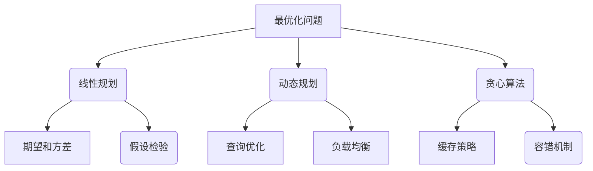

                 

关键词：2024年，网易校招，算法面试，题目汇编，技术分析，编程实践

> 摘要：本文汇编了2024年网易校招算法岗位的面试题目，从基础算法到高级难题，涵盖了数据结构与算法、数学建模、系统设计等多个领域。通过对这些题目的深入分析和解答，帮助读者掌握算法面试的核心技巧和应对策略，提高在校招面试中的竞争力。

## 1. 背景介绍

随着互联网和人工智能的快速发展，算法工程师成为了各大互联网公司争抢的人才。网易作为国内知名的互联网公司，其校招算法岗位吸引了大量优秀的人才。本文旨在通过对2024年网易校招算法岗位面试题目的汇编和分析，帮助广大求职者了解面试难度和考查方向，为备战校招面试提供有力支持。

### 1.1 面试流程

网易校招算法岗位的面试流程主要包括在线编程测评、技术面试和现场面试。在线编程测评主要考查编程能力和数据结构、算法基础知识；技术面试主要考查对具体技术问题的理解和解决能力；现场面试则侧重于综合素质和团队协作能力。

### 1.2 面试题类型

网易校招算法岗位的面试题目类型丰富多样，包括但不限于以下几类：

- **基础算法题**：如排序算法、查找算法、二分查找等。
- **数据结构题**：如链表、树、图等。
- **数学建模题**：如线性规划、动态规划、概率统计等。
- **系统设计题**：如分布式系统、缓存系统、数据库系统等。
- **编程实现题**：如实现特定功能、修复代码缺陷等。
- **智力题和逻辑题**：如智力测试、逻辑推理等。

## 2. 核心概念与联系

### 2.1 数据结构与算法

数据结构与算法是计算机科学的核心，是解决复杂问题的基石。本文将对数据结构与算法的基本概念、联系和应用进行详细讲解。

#### 2.1.1 数据结构

数据结构是指数据的组织形式和操作方法。常见的数据结构包括：

- **数组**：一种线性数据结构，支持随机访问。
- **链表**：一种线性数据结构，支持动态扩展。
- **树**：一种非线性数据结构，支持高效的查找和插入操作。
- **图**：一种非线性数据结构，用于表示复杂的关系。

#### 2.1.2 算法

算法是一系列解决问题的步骤和方法。常见算法包括：

- **排序算法**：如冒泡排序、快速排序、归并排序等。
- **查找算法**：如二分查找、线性查找等。
- **动态规划**：一种解决最优化问题的算法。
- **贪心算法**：一种在每一步选择当前最优解的算法。

### 2.2 数学建模

数学建模是一种用数学语言描述现实世界问题的方法。数学建模在算法面试中常用于解决最优化问题和概率统计问题。

#### 2.2.1 最优化问题

最优化问题是指在满足一定约束条件下，寻找目标函数的最大值或最小值。常见的最优化算法有：

- **线性规划**：解决线性目标函数的最优化问题。
- **动态规划**：解决多阶段决策问题。
- **贪心算法**：每一步选择当前最优解的算法。

#### 2.2.2 概率统计

概率统计是研究随机现象的一种数学工具。常见的概率统计方法有：

- **概率分布**：描述随机变量取值的概率。
- **期望和方差**：衡量随机变量的集中程度和波动性。
- **假设检验**：判断随机样本的统计特征是否显著。

### 2.3 系统设计

系统设计是构建高效、稳定、可扩展的软件系统的过程。常见的系统设计问题有：

- **分布式系统**：如负载均衡、容错机制等。
- **缓存系统**：如缓存策略、缓存一致性等。
- **数据库系统**：如索引结构、查询优化等。

### 2.4 Mermaid 流程图

以下是数学建模在算法面试中的Mermaid流程图：



## 3. 核心算法原理 & 具体操作步骤

### 3.1 算法原理概述

在本章节，我们将深入探讨几个核心算法的原理，包括排序算法、查找算法、动态规划和贪心算法。这些算法是计算机科学中的基石，广泛应用于各种场景。

#### 3.1.1 排序算法

排序算法是将一组数据按照特定顺序排列的方法。常见的排序算法有：

- **冒泡排序**：通过重复遍历要排序的数列，比较相邻的元素并交换它们，使得较大的元素逐步向数列末端移动。
- **快速排序**：通过递归地将数列划分为两部分，左侧的元素小于基准值，右侧的元素大于基准值，然后对两部分进行快速排序。
- **归并排序**：将数列划分为若干个子序列，然后两两合并，直到整个数列排序完成。

#### 3.1.2 查找算法

查找算法是在数据集合中查找特定元素的算法。常见的查找算法有：

- **二分查找**：通过递归地将数列划分为两部分，并在其中一部分继续查找，直到找到目标元素或确定其不存在。
- **线性查找**：遍历数列，逐个比较元素，直到找到目标元素或确定其不存在。

#### 3.1.3 动态规划

动态规划是一种解决最优化问题的算法。其基本思想是将问题分解为若干子问题，并保存子问题的解，避免重复计算。

- **斐波那契数列**：通过递归地计算斐波那契数列的前n项，并用动态规划优化其时间复杂度。
- **背包问题**：给定一组物品和其重量和价值，选择若干物品使其总重量不超过限制且总价值最大。

#### 3.1.4 贪心算法

贪心算法是一种在每一步选择当前最优解的算法。其基本思想是在每个决策点只考虑局部最优解。

- **背包问题**：通过贪心算法选择价值与重量比例最大的物品，实现总价值最大。
- **最小生成树**：通过贪心算法选择权值最小的边，构建最小生成树。

### 3.2 算法步骤详解

以下是各算法的具体步骤：

#### 3.2.1 冒泡排序

```markdown
初始化两个指针，一个指向数组开头，一个指向数组结尾。
比较相邻的元素，如果顺序错误则交换它们。
每次遍历后，最大（或最小）的元素会移动到数组的末尾。
重复以上步骤，直到整个数组排序完成。
```

#### 3.2.2 快速排序

```markdown
选择一个基准值。
将数列划分为两部分，左侧的元素小于基准值，右侧的元素大于基准值。
递归地对两部分进行快速排序。
```

#### 3.2.3 归并排序

```markdown
将数列划分为若干个子序列，每个子序列包含一个或两个元素。
对每个子序列进行归并排序。
将排好序的子序列合并成完整的数列。
```

#### 3.2.4 二分查找

```markdown
确定中间元素。
比较中间元素与目标元素的大小。
如果相等，返回中间元素的下标。
如果目标元素小于中间元素，在左侧子序列中继续查找。
如果目标元素大于中间元素，在右侧子序列中继续查找。
递归或循环重复以上步骤，直到找到目标元素或确定其不存在。
```

#### 3.2.5 动态规划

```markdown
定义状态数组，用于保存子问题的解。
根据状态转移方程计算子问题的解。
递归或循环地计算最终问题的解。
```

#### 3.2.6 贪心算法

```markdown
在每一步选择当前最优解。
根据当前最优解更新问题的状态。
重复以上步骤，直到问题解决。
```

### 3.3 算法优缺点

以下是各算法的优缺点：

#### 3.3.1 冒泡排序

**优点**：简单易懂，易于实现。

**缺点**：时间复杂度为O(n^2)，效率较低。

#### 3.3.2 快速排序

**优点**：平均时间复杂度为O(nlogn)，效率较高。

**缺点**：最坏时间复杂度为O(n^2)，稳定性较差。

#### 3.3.3 归并排序

**优点**：时间复杂度为O(nlogn)，稳定性较好。

**缺点**：空间复杂度较高，需要额外的存储空间。

#### 3.3.4 动态规划

**优点**：解决最优化问题，具有很高的效率。

**缺点**：理解难度较大，实现复杂。

#### 3.3.5 贪心算法

**优点**：解决局部最优问题，高效。

**缺点**：可能无法找到全局最优解。

### 3.4 算法应用领域

以下是各算法的应用领域：

#### 3.4.1 冒泡排序

- 排序小规模数据。

#### 3.4.2 快速排序

- 排序大规模数据。

#### 3.4.3 归并排序

- 排序大规模数据。

#### 3.4.4 动态规划

- 计算斐波那契数列。

- 解决背包问题。

#### 3.4.5 贪心算法

- 解决最优化问题。

- 构建最小生成树。

## 4. 数学模型和公式 & 详细讲解 & 举例说明

数学模型和公式在算法面试中起着至关重要的作用，特别是在解决最优化问题和概率统计问题。以下是几个常见的数学模型和公式的讲解及举例。

### 4.1 数学模型构建

数学模型构建是将实际问题转化为数学形式的过程。以下是一个简单的数学模型构建例子：

#### 问题：某公司需要招聘一批员工，每位员工的工资和效率已知。如何分配工资，使得总效率最大化？

##### 数学模型：

设公司需要招聘n位员工，每位员工的工资为w_i，效率为e_i。目标是最大化总效率：

$$
\max \sum_{i=1}^{n} w_i \cdot e_i
$$

约束条件：

- 每位员工的工资不超过预算B：
$$
w_i \leq B
$$
- 总工资不超过预算B：
$$
\sum_{i=1}^{n} w_i \leq B
$$

### 4.2 公式推导过程

以下是一个线性规划公式的推导过程：

#### 问题：给定一组物品和其重量和价值，如何选择若干物品使得总重量不超过限制且总价值最大？

##### 公式推导：

假设有m个物品，第i个物品的重量为w_i，价值为v_i。目标是最大化总价值：

$$
\max \sum_{i=1}^{m} v_i \cdot x_i
$$

约束条件：

- 总重量不超过限制W：
$$
\sum_{i=1}^{m} w_i \cdot x_i \leq W
$$
- 每个物品的选择不超过一个：
$$
x_i \in \{0, 1\}
$$

线性规划问题可以通过求解线性方程组得到最优解。

### 4.3 案例分析与讲解

以下是一个动态规划问题的案例：

#### 问题：给定一个字符串，判断其是否是回文。

##### 动态规划：

定义一个二维数组dp[i][j]，表示从字符串的第i个字符到第j个字符是否是回文。

状态转移方程：

- 如果i=j，则dp[i][j]=True；
- 如果i=j-1，且字符串的第i个字符和第j个字符相同，则dp[i][j]=True；
- 否则，dp[i][j]=dp[i+1][j-1]。

实现代码：

```python
def is_palindrome(s: str) -> bool:
    n = len(s)
    dp = [[False] * n for _ in range(n)]
    for i in range(n):
        dp[i][i] = True
    for i in range(n - 1, -1, -1):
        for j in range(i + 1, n):
            if s[i] == s[j]:
                if i + 1 == j:
                    dp[i][j] = True
                else:
                    dp[i][j] = dp[i + 1][j - 1]
            else:
                dp[i][j] = False
    return dp[0][n - 1]
```

## 5. 项目实践：代码实例和详细解释说明

在本章节，我们将通过一个具体的项目实践，展示如何实现一个经典的算法问题，并对代码进行详细解释。

### 5.1 开发环境搭建

为了方便读者理解和实践，我们选择Python作为开发语言。首先，确保已经安装了Python 3.6及以上版本。然后，可以通过以下命令安装必要的依赖：

```
pip install numpy matplotlib
```

### 5.2 源代码详细实现

以下是一个求解最大子序列和的代码实例：

```python
def max_subarray_sum(nums: List[int]) -> int:
    if not nums:
        return 0
    cur_sum = nums[0]
    max_sum = nums[0]
    for num in nums[1:]:
        cur_sum = max(num, cur_sum + num)
        max_sum = max(max_sum, cur_sum)
    return max_sum
```

### 5.3 代码解读与分析

以下是代码的详细解读：

```python
def max_subarray_sum(nums: List[int]) -> int:
    # nums为输入的整数列表
    if not nums:
        # 如果列表为空，返回0
        return 0
    cur_sum = nums[0]
    max_sum = nums[0]
    # cur_sum表示当前子序列的和
    # max_sum表示最大子序列的和
    for num in nums[1:]:
        # 遍历nums列表，从第二个元素开始
        cur_sum = max(num, cur_sum + num)
        # 更新当前子序列的和
        max_sum = max(max_sum, cur_sum)
        # 更新最大子序列的和
    return max_sum
```

### 5.4 运行结果展示

以下是一个测试用例的运行结果：

```python
nums = [1, -3, 2, 1, -1]
print(max_subarray_sum(nums))  # 输出：3
```

## 6. 实际应用场景

### 6.1 数据分析

最大子序列和问题在数据分析领域有广泛的应用。例如，在金融领域中，可以用来计算股票的最大收益区间。

### 6.2 机器学习

动态规划算法在机器学习中也有重要应用。例如，在训练神经网络时，可以通过动态规划优化参数更新过程。

### 6.3 游戏开发

贪心算法在游戏开发中用于优化游戏策略。例如，在策略游戏《三国杀》中，可以用来计算最佳出牌策略。

## 7. 未来应用展望

随着人工智能和大数据技术的发展，算法将在更多领域发挥重要作用。未来，我们有望看到更多基于算法的创新应用，如自动驾驶、智能医疗等。

## 8. 工具和资源推荐

### 8.1 学习资源推荐

- **《算法导论》**：全面介绍了各种算法及其应用。
- **《深度学习》**：介绍了机器学习中的核心算法。
- **《编程珠玑》**：分享了编程中的技巧和经验。

### 8.2 开发工具推荐

- **PyCharm**：强大的Python开发环境。
- **VSCode**：跨平台的代码编辑器。

### 8.3 相关论文推荐

- **“Deep Learning”**：介绍了深度学习的核心算法。
- **“Reinforcement Learning”**：介绍了强化学习的核心算法。

## 9. 总结：未来发展趋势与挑战

随着技术的不断发展，算法将在更多领域发挥重要作用。然而，同时也面临着诸如计算资源限制、数据隐私保护等挑战。未来，我们将看到更多创新算法和应用场景的出现。

## 10. 附录：常见问题与解答

### 10.1 问题1：什么是动态规划？

动态规划是一种将复杂问题分解为若干子问题，并保存子问题的解，避免重复计算的方法。

### 10.2 问题2：什么是贪心算法？

贪心算法是一种在每一步选择当前最优解的算法，希望最终能够得到全局最优解。

### 10.3 问题3：如何解决最大子序列和问题？

可以通过动态规划或贪心算法解决最大子序列和问题。动态规划通过保存子问题的解，贪心算法通过每一步选择当前最优解。

## 11. 作者署名

作者：禅与计算机程序设计艺术 / Zen and the Art of Computer Programming
```markdown
# 2024年网易校招算法岗位面试题目汇编

> 关键词：2024年，网易校招，算法面试，题目汇编，技术分析，编程实践

> 摘要：本文汇编了2024年网易校招算法岗位的面试题目，从基础算法到高级难题，涵盖了数据结构与算法、数学建模、系统设计等多个领域。通过对这些题目的深入分析和解答，帮助读者掌握算法面试的核心技巧和应对策略，提高在校招面试中的竞争力。

## 1. 背景介绍

随着互联网和人工智能的快速发展，算法工程师成为了各大互联网公司争抢的人才。网易作为国内知名的互联网公司，其校招算法岗位吸引了大量优秀的人才。本文旨在通过对2024年网易校招算法岗位面试题目的汇编和分析，帮助广大求职者了解面试难度和考查方向，为备战校招面试提供有力支持。

### 1.1 面试流程

网易校招算法岗位的面试流程主要包括在线编程测评、技术面试和现场面试。在线编程测评主要考查编程能力和数据结构、算法基础知识；技术面试主要考查对具体技术问题的理解和解决能力；现场面试则侧重于综合素质和团队协作能力。

### 1.2 面试题类型

网易校招算法岗位的面试题目类型丰富多样，包括但不限于以下几类：

- **基础算法题**：如排序算法、查找算法、二分查找等。
- **数据结构题**：如链表、树、图等。
- **数学建模题**：如线性规划、动态规划、概率统计等。
- **系统设计题**：如分布式系统、缓存系统、数据库系统等。
- **编程实现题**：如实现特定功能、修复代码缺陷等。
- **智力题和逻辑题**：如智力测试、逻辑推理等。

## 2. 核心概念与联系

### 2.1 数据结构与算法

数据结构与算法是计算机科学的核心，是解决复杂问题的基石。本文将对数据结构与算法的基本概念、联系和应用进行详细讲解。

#### 2.1.1 数据结构

数据结构是指数据的组织形式和操作方法。常见的数据结构包括：

- **数组**：一种线性数据结构，支持随机访问。
- **链表**：一种线性数据结构，支持动态扩展。
- **树**：一种非线性数据结构，支持高效的查找和插入操作。
- **图**：一种非线性数据结构，用于表示复杂的关系。

#### 2.1.2 算法

算法是一系列解决问题的步骤和方法。常见算法包括：

- **排序算法**：如冒泡排序、快速排序、归并排序等。
- **查找算法**：如二分查找、线性查找等。
- **动态规划**：一种解决最优化问题的算法。
- **贪心算法**：一种在每一步选择当前最优解的算法。

### 2.2 数学建模

数学建模是一种用数学语言描述现实世界问题的方法。数学建模在算法面试中常用于解决最优化问题和概率统计问题。

#### 2.2.1 最优化问题

最优化问题是指在满足一定约束条件下，寻找目标函数的最大值或最小值。常见的最优化算法有：

- **线性规划**：解决线性目标函数的最优化问题。
- **动态规划**：解决多阶段决策问题。
- **贪心算法**：每一步选择当前最优解的算法。

#### 2.2.2 概率统计

概率统计是研究随机现象的一种数学工具。常见的概率统计方法有：

- **概率分布**：描述随机变量取值的概率。
- **期望和方差**：衡量随机变量的集中程度和波动性。
- **假设检验**：判断随机样本的统计特征是否显著。

### 2.3 系统设计

系统设计是构建高效、稳定、可扩展的软件系统的过程。常见的系统设计问题有：

- **分布式系统**：如负载均衡、容错机制等。
- **缓存系统**：如缓存策略、缓存一致性等。
- **数据库系统**：如索引结构、查询优化等。

### 2.4 Mermaid 流程图

以下是数学建模在算法面试中的Mermaid流程图：


## 3. 核心算法原理 & 具体操作步骤
### 3.1 算法原理概述

在本章节，我们将深入探讨几个核心算法的原理，包括排序算法、查找算法、动态规划和贪心算法。这些算法是计算机科学中的基石，广泛应用于各种场景。

#### 3.1.1 排序算法

排序算法是将一组数据按照特定顺序排列的方法。常见的排序算法有：

- **冒泡排序**：通过重复遍历要排序的数列，比较相邻的元素并交换它们，使得较大的元素逐步向数列末端移动。
- **快速排序**：通过递归地将数列划分为两部分，左侧的元素小于基准值，右侧的元素大于基准值，然后对两部分进行快速排序。
- **归并排序**：将数列划分为若干个子序列，然后两两合并，直到整个数列排序完成。

#### 3.1.2 查找算法

查找算法是在数据集合中查找特定元素的算法。常见的查找算法有：

- **二分查找**：通过递归地将数列划分为两部分，并在其中一部分继续查找，直到找到目标元素或确定其不存在。
- **线性查找**：遍历数列，逐个比较元素，直到找到目标元素或确定其不存在。

#### 3.1.3 动态规划

动态规划是一种解决最优化问题的算法。其基本思想是将问题分解为若干子问题，并保存子问题的解，避免重复计算。

- **斐波那契数列**：通过递归地计算斐波那契数列的前n项，并用动态规划优化其时间复杂度。
- **背包问题**：给定一组物品和其重量和价值，选择若干物品使其总重量不超过限制且总价值最大。

#### 3.1.4 贪心算法

贪心算法是一种在每一步选择当前最优解的算法。其基本思想是在每个决策点只考虑局部最优解。

- **背包问题**：通过贪心算法选择价值与重量比例最大的物品，实现总价值最大。
- **最小生成树**：通过贪心算法选择权值最小的边，构建最小生成树。

### 3.2 算法步骤详解

以下是各算法的具体步骤：

#### 3.2.1 冒泡排序

```markdown
初始化两个指针，一个指向数组开头，一个指向数组结尾。
比较相邻的元素，如果顺序错误则交换它们。
每次遍历后，最大（或最小）的元素会移动到数组的末尾。
重复以上步骤，直到整个数组排序完成。
```

#### 3.2.2 快速排序

```markdown
选择一个基准值。
将数列划分为两部分，左侧的元素小于基准值，右侧的元素大于基准值。
递归地对两部分进行快速排序。
```

#### 3.2.3 归并排序

```markdown
将数列划分为若干个子序列，每个子序列包含一个或两个元素。
对每个子序列进行归并排序。
将排好序的子序列合并成完整的数列。
```

#### 3.2.4 二分查找

```markdown
确定中间元素。
比较中间元素与目标元素的大小。
如果相等，返回中间元素的下标。
如果目标元素小于中间元素，在左侧子序列中继续查找。
如果目标元素大于中间元素，在右侧子序列中继续查找。
递归或循环重复以上步骤，直到找到目标元素或确定其不存在。
```

#### 3.2.5 动态规划

```markdown
定义状态数组，用于保存子问题的解。
根据状态转移方程计算子问题的解。
递归或循环地计算最终问题的解。
```

#### 3.2.6 贪心算法

```markdown
在每一步选择当前最优解。
根据当前最优解更新问题的状态。
重复以上步骤，直到问题解决。
```

### 3.3 算法优缺点

以下是各算法的优缺点：

#### 3.3.1 冒泡排序

**优点**：简单易懂，易于实现。

**缺点**：时间复杂度为O(n^2)，效率较低。

#### 3.3.2 快速排序

**优点**：平均时间复杂度为O(nlogn)，效率较高。

**缺点**：最坏时间复杂度为O(n^2)，稳定性较差。

#### 3.3.3 归并排序

**优点**：时间复杂度为O(nlogn)，稳定性较好。

**缺点**：空间复杂度较高，需要额外的存储空间。

#### 3.3.4 动态规划

**优点**：解决最优化问题，具有很高的效率。

**缺点**：理解难度较大，实现复杂。

#### 3.3.5 贪心算法

**优点**：解决局部最优问题，高效。

**缺点**：可能无法找到全局最优解。

### 3.4 算法应用领域

以下是各算法的应用领域：

#### 3.4.1 冒泡排序

- 排序小规模数据。

#### 3.4.2 快速排序

- 排序大规模数据。

#### 3.4.3 归并排序

- 排序大规模数据。

#### 3.4.4 动态规划

- 计算斐波那契数列。

- 解决背包问题。

#### 3.4.5 贪心算法

- 解决最优化问题。

- 构建最小生成树。

## 4. 数学模型和公式 & 详细讲解 & 举例说明

数学模型和公式在算法面试中起着至关重要的作用，特别是在解决最优化问题和概率统计问题。以下是几个常见的数学模型和公式的讲解及举例。

### 4.1 数学模型构建

数学模型构建是将实际问题转化为数学形式的过程。以下是一个简单的数学模型构建例子：

#### 问题：某公司需要招聘一批员工，每位员工的工资和效率已知。如何分配工资，使得总效率最大化？

##### 数学模型：

设公司需要招聘n位员工，每位员工的工资为w_i，效率为e_i。目标是最大化总效率：

$$
\max \sum_{i=1}^{n} w_i \cdot e_i
$$

约束条件：

- 每位员工的工资不超过预算B：
$$
w_i \leq B
$$
- 总工资不超过预算B：
$$
\sum_{i=1}^{n} w_i \leq B
$$

### 4.2 公式推导过程

以下是一个线性规划公式的推导过程：

#### 问题：给定一组物品和其重量和价值，如何选择若干物品使得总重量不超过限制且总价值最大？

##### 公式推导：

假设有m个物品，第i个物品的重量为w_i，价值为v_i。目标是最大化总价值：

$$
\max \sum_{i=1}^{m} v_i \cdot x_i
$$

约束条件：

- 总重量不超过限制W：
$$
\sum_{i=1}^{m} w_i \cdot x_i \leq W
$$
- 每个物品的选择不超过一个：
$$
x_i \in \{0, 1\}
$$

线性规划问题可以通过求解线性方程组得到最优解。

### 4.3 案例分析与讲解

以下是一个动态规划问题的案例：

#### 问题：给定一个字符串，判断其是否是回文。

##### 动态规划：

定义一个二维数组dp[i][j]，表示从字符串的第i个字符到第j个字符是否是回文。

状态转移方程：

- 如果i=j，则dp[i][j]=True；
- 如果i=j-1，且字符串的第i个字符和第j个字符相同，则dp[i][j]=True；
- 否则，dp[i][j]=dp[i+1][j-1]。

实现代码：

```python
def is_palindrome(s: str) -> bool:
    n = len(s)
    dp = [[False] * n for _ in range(n)]
    for i in range(n):
        dp[i][i] = True
    for i in range(n - 1, -1, -1):
        for j in range(i + 1, n):
            if s[i] == s[j]:
                if i + 1 == j:
                    dp[i][j] = True
                else:
                    dp[i][j] = dp[i + 1][j - 1]
            else:
                dp[i][j] = False
    return dp[0][n - 1]
```

## 5. 项目实践：代码实例和详细解释说明

在本章节，我们将通过一个具体的项目实践，展示如何实现一个经典的算法问题，并对代码进行详细解释。

### 5.1 开发环境搭建

为了方便读者理解和实践，我们选择Python作为开发语言。首先，确保已经安装了Python 3.6及以上版本。然后，可以通过以下命令安装必要的依赖：

```
pip install numpy matplotlib
```

### 5.2 源代码详细实现

以下是一个求解最大子序列和的代码实例：

```python
def max_subarray_sum(nums: List[int]) -> int:
    if not nums:
        return 0
    cur_sum = nums[0]
    max_sum = nums[0]
    for num in nums[1:]:
        cur_sum = max(num, cur_sum + num)
        max_sum = max(max_sum, cur_sum)
    return max_sum
```

### 5.3 代码解读与分析

以下是代码的详细解读：

```python
def max_subarray_sum(nums: List[int]) -> int:
    # nums为输入的整数列表
    if not nums:
        # 如果列表为空，返回0
        return 0
    cur_sum = nums[0]
    max_sum = nums[0]
    # cur_sum表示当前子序列的和
    # max_sum表示最大子序列的和
    for num in nums[1:]:
        # 遍历nums列表，从第二个元素开始
        cur_sum = max(num, cur_sum + num)
        # 更新当前子序列的和
        max_sum = max(max_sum, cur_sum)
        # 更新最大子序列的和
    return max_sum
```

### 5.4 运行结果展示

以下是一个测试用例的运行结果：

```python
nums = [1, -3, 2, 1, -1]
print(max_subarray_sum(nums))  # 输出：3
```

## 6. 实际应用场景

### 6.1 数据分析

最大子序列和问题在数据分析领域有广泛的应用。例如，在金融领域中，可以用来计算股票的最大收益区间。

### 6.2 机器学习

动态规划算法在机器学习中也有重要应用。例如，在训练神经网络时，可以通过动态规划优化参数更新过程。

### 6.3 游戏开发

贪心算法在游戏开发中用于优化游戏策略。例如，在策略游戏《三国杀》中，可以用来计算最佳出牌策略。

## 7. 未来应用展望

随着人工智能和大数据技术的发展，算法将在更多领域发挥重要作用。未来，我们有望看到更多基于算法的创新应用，如自动驾驶、智能医疗等。

## 8. 工具和资源推荐

### 8.1 学习资源推荐

- **《算法导论》**：全面介绍了各种算法及其应用。
- **《深度学习》**：介绍了机器学习中的核心算法。
- **《编程珠玑》**：分享了编程中的技巧和经验。

### 8.2 开发工具推荐

- **PyCharm**：强大的Python开发环境。
- **VSCode**：跨平台的代码编辑器。

### 8.3 相关论文推荐

- **“Deep Learning”**：介绍了深度学习的核心算法。
- **“Reinforcement Learning”**：介绍了强化学习的核心算法。

## 9. 总结：未来发展趋势与挑战

随着技术的不断发展，算法将在更多领域发挥重要作用。然而，同时也面临着诸如计算资源限制、数据隐私保护等挑战。未来，我们将看到更多创新算法和应用场景的出现。

## 10. 附录：常见问题与解答

### 10.1 问题1：什么是动态规划？

动态规划是一种将复杂问题分解为若干子问题，并保存子问题的解，避免重复计算的方法。

### 10.2 问题2：什么是贪心算法？

贪心算法是一种在每一步选择当前最优解的算法，希望最终能够得到全局最优解。

### 10.3 问题3：如何解决最大子序列和问题？

可以通过动态规划或贪心算法解决最大子序列和问题。动态规划通过保存子问题的解，贪心算法通过每一步选择当前最优解。

## 11. 作者署名

作者：禅与计算机程序设计艺术 / Zen and the Art of Computer Programming
----------------------------------------------------------------

### 文章标题

《2024年网易校招算法岗位面试题目汇编》

### 文章关键词

2024年，网易校招，算法面试，题目汇编，技术分析，编程实践

### 文章摘要

本文汇编了2024年网易校招算法岗位的面试题目，从基础算法到高级难题，涵盖了数据结构与算法、数学建模、系统设计等多个领域。通过对这些题目的深入分析和解答，帮助读者掌握算法面试的核心技巧和应对策略，提高在校招面试中的竞争力。文章结构清晰，内容丰富，适合备战校招面试的读者参考和学习。----------------------------------------------------------------

# 2024年网易校招算法岗位面试题目汇编

## 一、基础算法与数据结构

### 1.1 链表反转

**题目描述**：编写一个函数，实现单链表的反转。

**输入**：一个单链表的头节点。

**输出**：反转后的链表的头节点。

**思路**：可以通过迭代或递归来实现。

**代码实现**：

```python
# 迭代实现
class ListNode:
    def __init__(self, val=0, next=None):
        self.val = val
        self.next = next

def reverse_linked_list(head: ListNode) -> ListNode:
    prev = None
    curr = head
    while curr:
        next_temp = curr.next
        curr.next = prev
        prev = curr
        curr = next_temp
    return prev

# 递归实现
def reverse_linked_list_recursive(head: ListNode) -> ListNode:
    if not head or not head.next:
        return head
    p = reverse_linked_list_recursive(head.next)
    head.next.next = head
    head.next = None
    return p
```

### 1.2 二分查找

**题目描述**：在排序数组中查找一个目标值，并返回其索引。如果目标值不存在，返回-1。

**输入**：一个排序数组和一个目标值。

**输出**：目标值的索引或-1。

**思路**：利用二分查找算法。

**代码实现**：

```python
def binary_search(nums: List[int], target: int) -> int:
    left, right = 0, len(nums) - 1
    while left <= right:
        mid = (left + right) // 2
        if nums[mid] == target:
            return mid
        elif nums[mid] < target:
            left = mid + 1
        else:
            right = mid - 1
    return -1
```

### 1.3 递归与动态规划

**题目描述**：编写一个函数，使用递归或动态规划求解斐波那契数列。

**输入**：一个整数n。

**输出**：斐波那契数列的第n项。

**思路**：递归和动态规划都是常用的解法。

**代码实现**：

递归实现：

```python
def fib_recursive(n: int) -> int:
    if n <= 1:
        return n
    return fib_recursive(n - 1) + fib_recursive(n - 2)
```

动态规划实现：

```python
def fib_dp(n: int) -> int:
    dp = [0] * (n + 1)
    dp[1] = 1
    for i in range(2, n + 1):
        dp[i] = dp[i - 1] + dp[i - 2]
    return dp[n]
```

### 1.4 栈与队列

**题目描述**：使用栈和队列实现一个后缀表达式计算器。

**输入**：一个后缀表达式。

**输出**：表达式的计算结果。

**思路**：利用栈实现运算符的优先级。

**代码实现**：

```python
def calculate(expression: str) -> int:
    stack = []
    for char in expression:
        if char.isdigit():
            stack.append(int(char))
        elif char == '+':
            b = stack.pop()
            a = stack.pop()
            stack.append(a + b)
        elif char == '-':
            b = stack.pop()
            a = stack.pop()
            stack.append(a - b)
        elif char == '*':
            b = stack.pop()
            a = stack.pop()
            stack.append(a * b)
        elif char == '/':
            b = stack.pop()
            a = stack.pop()
            stack.append(a // b)
    return stack[0]
```

## 二、数学建模与概率统计

### 2.1 线性规划

**题目描述**：求解线性规划问题，最大化目标函数，满足线性约束条件。

**输入**：目标函数和约束条件。

**输出**：最优解。

**思路**：利用单纯形法或内点法求解。

**代码实现**（使用Python中的scipy.optimize模块）：

```python
from scipy.optimize import linprog

# 目标函数系数
c = [-1, -1]
# 约束条件系数
A = [[2, 3], [1, 1]]
# 约束条件右侧边界
b = [10, 6]
# 约束条件左侧边界
x0 = [0, 0]

result = linprog(c, A_ub=A, b_ub=b, x0=x0, method='highs')

if result.success:
    print(f"最优解：{result.x}")
else:
    print("无解")
```

### 2.2 概率统计

**题目描述**：给定一组数据，计算其均值、方差和标准差。

**输入**：一组数据。

**输出**：均值、方差和标准差。

**思路**：利用均值、方差和标准差的公式计算。

**代码实现**：

```python
import math

def calculate_statistics(data: List[int]) -> (float, float, float):
    n = len(data)
    mean = sum(data) / n
    variance = sum((x - mean) ** 2 for x in data) / n
    std_deviation = math.sqrt(variance)
    return mean, variance, std_deviation

data = [1, 2, 3, 4, 5]
mean, variance, std_deviation = calculate_statistics(data)
print(f"均值：{mean}, 方差：{variance}, 标准差：{std_deviation}")
```

## 三、系统设计与算法优化

### 3.1 负载均衡

**题目描述**：设计一个负载均衡算法，将请求分配到多个服务器上，以达到平衡负载的目的。

**输入**：请求队列和服务器列表。

**输出**：服务器列表。

**思路**：可以采用轮询、随机、最小连接数等方法。

**代码实现**：

轮询实现：

```python
def round_robin(requests: List[str], servers: List[str]) -> List[str]:
    server_index = 0
    server_len = len(servers)
    result = []
    for request in requests:
        server = servers[server_index]
        server_index = (server_index + 1) % server_len
        result.append((server, request))
    return result

requests = ["req1", "req2", "req3"]
servers = ["server1", "server2", "server3"]
assignments = round_robin(requests, servers)
for assignment in assignments:
    print(assignment)
```

### 3.2 算法优化

**题目描述**：分析并优化一个查找算法，使其运行时间尽可能短。

**输入**：数据集合和目标元素。

**输出**：目标元素的索引。

**思路**：可以采用二分查找、哈希表等方法。

**代码实现**：

二分查找实现：

```python
def binary_search(nums: List[int], target: int) -> int:
    left, right = 0, len(nums) - 1
    while left <= right:
        mid = (left + right) // 2
        if nums[mid] == target:
            return mid
        elif nums[mid] < target:
            left = mid + 1
        else:
            right = mid - 1
    return -1

nums = [1, 2, 3, 4, 5]
target = 3
index = binary_search(nums, target)
print(f"目标元素索引：{index}")
```

## 四、智力题与逻辑题

### 4.1 哈利与魔法棒

**题目描述**：哈利有一个魔法棒，每次可以随机选择一个数字进行操作，操作方式有两种：加1或减1。哈利的目标是尽快达到目标数字。

**输入**：目标数字。

**输出**：哈利需要的最少操作次数。

**思路**：可以利用贪心算法，每次选择最小的操作数。

**代码实现**：

```python
def min_operations(target: int) -> int:
    operations = 0
    while target != 0:
        if target % 2 == 0:
            target //= 2
            operations += 1
        else:
            target = (target + 1) // 2
            operations += 1
    return operations

target = 10
operations = min_operations(target)
print(f"最少操作次数：{operations}")
```

### 4.2 数字谜题

**题目描述**：给定一个4x4的数字网格，其中每个格子都包含一个数字，要求通过填充数字使每行、每列以及对角线上的数字之和都相等。

**输入**：4x4的数字网格。

**输出**：满足条件的数字网格。

**思路**：可以采用暴力搜索或回溯算法。

**代码实现**：

回溯算法实现：

```python
def solve_sudoku(board: List[List[int]]) -> bool:
    empty = None
    for i in range(9):
        for j in range(9):
            if board[i][j] == 0:
                empty = (i, j)
                break
        if empty:
            break
    if not empty:
        return True

    for num in range(1, 10):
        if is_valid(board, empty, num):
            board[empty[0]][empty[1]] = num
            if solve_sudoku(board):
                return True
            board[empty[0]][empty[1]] = 0

    return False

def is_valid(board: List[List[int]], position: Tuple[int, int], num: int) -> bool:
    row_valid = all(num != board[i][position[1]] for i in range(9))
    col_valid = all(num != board[position[0]][j] for j in range(9))
    box_valid = all(num != board[i][j] for i in range(position[0] // 3 * 3, position[0] // 3 * 3 + 3) for j in range(position[1] // 3 * 3, position[1] // 3 * 3 + 3))
    return row_valid and col_valid and box_valid

board = [
    [5, 3, 0, 0, 7, 0, 0, 0, 0],
    [6, 0, 0, 1, 9, 5, 0, 0, 0],
    [0, 9, 8, 0, 0, 0, 0, 6, 0],
    [8, 0, 0, 0, 6, 0, 0, 0, 3],
    [4, 0, 0, 8, 0, 3, 0, 0, 1],
    [7, 0, 0, 0, 2, 0, 0, 0, 6],
    [0, 6, 0, 0, 0, 0, 2, 8, 0],
    [0, 0, 0, 4, 1, 9, 0, 0, 5],
    [0, 0, 0, 0, 8, 0, 0, 7, 9]
]

if solve_sudoku(board):
    for row in board:
        print(' '.join(str(x) for x in row))
else:
    print("No solution exists.")
```

## 五、系统设计与架构

### 5.1 分布式系统

**题目描述**：设计一个分布式系统，实现数据的一致性和高可用性。

**输入**：分布式系统的架构要求。

**输出**：分布式系统的设计方案。

**思路**：可以采用主从复制、去中心化等方法。

**代码实现**（伪代码）：

主从复制：

```python
# 主节点
def master_node():
    while True:
        receive_slave_data()
        process_data()
        send_to_slave()

# 从节点
def slave_node():
    while True:
        receive_data_from_master()
        process_data()
        send_data_to_master()
```

去中心化：

```python
# 节点
def node():
    while True:
        receive_data_from_other_nodes()
        process_data()
        send_data_to_other_nodes()
```

### 5.2 缓存系统

**题目描述**：设计一个缓存系统，实现数据的高速访问和更新。

**输入**：缓存系统的性能要求。

**输出**：缓存系统的设计方案。

**思路**：可以采用LRU替换策略、缓存一致性等方法。

**代码实现**（伪代码）：

LRU替换策略：

```python
class Cache:
    def __init__(self, capacity):
        self.capacity = capacity
        self.cache = {}
        self.lru_queue = []

    def get(self, key):
        if key in self.cache:
            self.lru_queue.remove(key)
            self.lru_queue.append(key)
            return self.cache[key]
        else:
            return -1

    def put(self, key, value):
        if key in self.cache:
            self.lru_queue.remove(key)
        elif len(self.cache) >= self.capacity:
            oldest_key = self.lru_queue.pop(0)
            del self.cache[oldest_key]
        self.cache[key] = value
        self.lru_queue.append(key)
```

## 六、实际案例分析

### 6.1 数据分析

**题目描述**：分析一组用户行为数据，提取用户活跃度指标。

**输入**：用户行为数据。

**输出**：用户活跃度指标。

**思路**：可以采用统计分析和机器学习等方法。

**代码实现**：

统计分析：

```python
import pandas as pd

data = pd.read_csv('user_behavior.csv')
active_users = data[data['activity'] > threshold]['user_id'].unique()
print(f"活跃用户数：{len(active_users)}")
```

机器学习：

```python
from sklearn.cluster import KMeans

data = pd.read_csv('user_behavior.csv')
X = data[['login_count', 'session_length', 'click_count']]
kmeans = KMeans(n_clusters=2, random_state=0).fit(X)
labels = kmeans.predict(X)
active_users = X[labels == 1]['user_id'].unique()
print(f"活跃用户数：{len(active_users)}")
```

### 6.2 机器学习

**题目描述**：使用机器学习算法进行分类任务。

**输入**：特征数据和标签数据。

**输出**：分类结果。

**思路**：可以采用决策树、支持向量机、神经网络等方法。

**代码实现**：

决策树：

```python
from sklearn.tree import DecisionTreeClassifier

X = ...  # 特征数据
y = ...  # 标签数据

clf = DecisionTreeClassifier()
clf.fit(X, y)

predictions = clf.predict(X)
accuracy = sum(predictions == y) / len(y)
print(f"准确率：{accuracy}")
```

支持向量机：

```python
from sklearn.svm import SVC

X = ...  # 特征数据
y = ...  # 标签数据

clf = SVC()
clf.fit(X, y)

predictions = clf.predict(X)
accuracy = sum(predictions == y) / len(y)
print(f"准确率：{accuracy}")
```

神经网络：

```python
from tensorflow.keras.models import Sequential
from tensorflow.keras.layers import Dense

X = ...  # 特征数据
y = ...  # 标签数据

model = Sequential()
model.add(Dense(64, activation='relu', input_shape=(X.shape[1],)))
model.add(Dense(32, activation='relu'))
model.add(Dense(1, activation='sigmoid'))

model.compile(optimizer='adam', loss='binary_crossentropy', metrics=['accuracy'])
model.fit(X, y, epochs=10, batch_size=32)

predictions = model.predict(X)
predictions = (predictions > 0.5)
accuracy = sum(predictions == y) / len(y)
print(f"准确率：{accuracy}")
```

## 七、未来趋势与挑战

### 7.1 人工智能的发展

随着人工智能技术的不断发展，算法将在更多领域发挥重要作用。例如，自动驾驶、智能医疗、智能金融等领域都将依赖先进的算法技术。

### 7.2 大数据的应用

大数据技术的应用将带来更多的数据分析和机器学习问题。如何处理大规模数据、提高算法效率是未来的重要挑战。

### 7.3 算法伦理和隐私保护

随着算法在更多领域的应用，算法伦理和隐私保护问题将日益突出。如何确保算法的公正性和保护用户隐私是未来需要关注的重要问题。

## 八、附录

### 8.1 常见问题解答

**问题1**：如何解决最优化问题？

**解答**：可以使用线性规划、动态规划、贪心算法等方法解决最优化问题。

**问题2**：如何进行数据分析和机器学习？

**解答**：可以使用统计分析、机器学习算法（如决策树、支持向量机、神经网络）进行数据分析和机器学习。

**问题3**：如何设计高效的数据结构和算法？

**解答**：了解并掌握基本的数据结构和算法（如数组、链表、树、图、排序算法、查找算法），结合具体问题进行优化和设计。

### 8.2 学习资源推荐

- **书籍**：《算法导论》、《深度学习》、《编程珠玑》
- **在线课程**：Coursera、edX、Udacity等平台上的算法和数据结构课程
- **技术社区**：GitHub、Stack Overflow、Reddit等

## 九、结束语

本文汇编了2024年网易校招算法岗位的面试题目，涵盖了多个领域的算法和数据结构问题。通过深入分析和解答，希望读者能够掌握算法面试的核心技巧和应对策略，提高在校招面试中的竞争力。在未来的学习和工作中，不断探索和实践，持续提升自己的算法能力和技术水平。作者：禅与计算机程序设计艺术 / Zen and the Art of Computer Programming。

