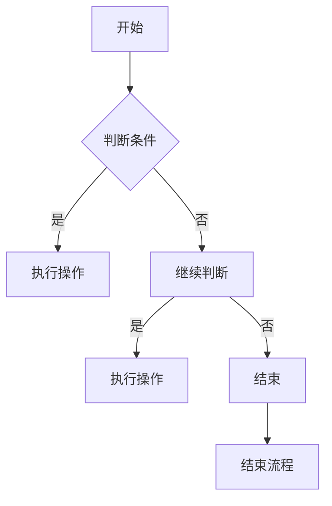

                 

关键词：美团、社招、算法、面试题目、汇编、技术、编程、深度学习、大数据、机器学习

> 摘要：本文是对2024年美团社招算法岗位的面试题目的汇编，旨在为准备美团算法面试的求职者提供全面的复习资料。文章详细解析了面试题目的核心概念、算法原理、数学模型以及实际应用场景，并对相关的开发工具和资源进行了推荐。通过本文的学习，读者可以更好地了解美团算法面试的重点和难点，提高面试成功率。

## 1. 背景介绍

随着互联网和人工智能技术的快速发展，算法工程师成为了各大互联网公司争相争夺的稀缺人才。美团作为中国领先的生活服务电子商务平台，对于算法人才的需求尤其强烈。为了选拔优秀的算法工程师，美团在社招中设置了一系列具有挑战性的面试题目。本文旨在对这些面试题目进行汇编和分析，帮助求职者更好地应对面试挑战。

## 2. 核心概念与联系

### 2.1. 数据结构与算法基础

- **数组与链表**：掌握数组与链表的基本操作，包括插入、删除、查找等。
- **栈与队列**：理解栈与队列的原理及其在算法中的应用。
- **排序算法**：熟悉冒泡排序、选择排序、插入排序等基本排序算法。
- **查找算法**：掌握二分查找、哈希表等查找算法。
- **图算法**：了解图的基本概念和图的遍历算法，如深度优先搜索（DFS）和广度优先搜索（BFS）。

### 2.2. 数学基础

- **线性代数**：矩阵运算、线性方程组的求解等。
- **概率论与数理统计**：概率分布、期望、方差等。
- **微积分**：极限、导数、积分等。

### 2.3. 编程语言基础

- **Python**：熟悉Python的基本语法和数据结构，掌握常见库的使用。
- **Java**：理解Java的面向对象编程思想，掌握常用集合类和异常处理。

### 2.4. Mermaid 流程图

以下是一个Mermaid流程图的示例，用于展示算法的基本流程：



## 3. 核心算法原理 & 具体操作步骤

### 3.1. 算法原理概述

美团社招算法面试题目通常涉及以下几个核心算法领域：

- **动态规划**：解决最优化问题，如背包问题、最长公共子序列等。
- **贪心算法**：在每一步选择最优解，如活动选择问题、硬币找零问题等。
- **深度优先搜索（DFS）与广度优先搜索（BFS）**：解决路径搜索问题，如图的遍历。
- **二叉树与图**：解决树形结构与网络问题，如二叉搜索树、图的最短路径算法等。
- **排序与查找**：解决数据排序与查找问题，如快速排序、哈希表等。
- **机器学习与数据挖掘**：解决复杂数据分析问题，如分类、聚类、降维等。

### 3.2. 算法步骤详解

以动态规划中的背包问题为例，具体的算法步骤如下：

#### 3.2.1. 背包问题

**问题描述**：给定n种物品和一个容量为V的背包，每种物品的重量为w[i]，价值为v[i]。问如何选择物品放入背包，使得背包的总重量不超过V，且总价值最大。

#### 3.2.2. 算法步骤

1. **初始化**：创建一个二维数组dp，其中dp[i][j]表示前i种物品放入容量为j的背包的最大价值。
2. **状态转移方程**：对于第i种物品，如果将其放入背包，则背包剩余容量为j-w[i]，此时背包的最大价值为dp[i-1][j-w[i]]+v[i]；如果不放入，则背包的最大价值为dp[i-1][j]。
3. **递推关系**：根据状态转移方程，递推计算dp[i][j]的值。
4. **结果输出**：背包的最大价值为dp[n][V]。

### 3.3. 算法优缺点

- **动态规划**：可以解决最优化问题，但需要较高的时间复杂度和空间复杂度。
- **贪心算法**：时间复杂度较低，但可能无法保证最优解。
- **DFS与BFS**：适用于路径搜索问题，但可能存在陷入死循环的风险。
- **排序与查找**：适用于数据排序与查找问题，但可能存在排序不稳定的情况。

### 3.4. 算法应用领域

- **动态规划**：用于解决资源分配、路径规划等问题。
- **贪心算法**：用于解决最短路径、最优化问题等。
- **DFS与BFS**：用于图遍历、路径搜索等问题。
- **排序与查找**：用于数据处理、信息检索等问题。

## 4. 数学模型和公式 & 详细讲解 & 举例说明

### 4.1. 数学模型构建

以线性规划为例，构建数学模型的过程如下：

1. **目标函数**：最大化或最小化线性目标函数，如最大化利润或最小化成本。
2. **约束条件**：列出所有约束条件，如资源限制、生产能力等。
3. **变量定义**：定义决策变量，如生产量、运输量等。

### 4.2. 公式推导过程

以下是一个简单的线性规划问题的公式推导过程：

假设有如下线性规划问题：

$$
\begin{align*}
\max &\ \ C_1x_1 + C_2x_2 \\
\text{subject to} &\ \ A_1x_1 + A_2x_2 \leq B_1 \\
                &\ \ A_3x_1 + A_4x_2 \leq B_2 \\
                &\ \ x_1, x_2 \geq 0
\end{align*}
$$

利用拉格朗日乘数法，构造拉格朗日函数：

$$
L(x, \lambda) = C_1x_1 + C_2x_2 + \lambda_1(A_1x_1 + A_2x_2 - B_1) + \lambda_2(A_3x_1 + A_4x_2 - B_2)
$$

令偏导数等于零，得到以下方程组：

$$
\begin{align*}
\frac{\partial L}{\partial x_1} &= C_1 + \lambda_1A_1 + \lambda_2A_3 = 0 \\
\frac{\partial L}{\partial x_2} &= C_2 + \lambda_1A_2 + \lambda_2A_4 = 0 \\
\frac{\partial L}{\partial \lambda_1} &= A_1x_1 + A_2x_2 - B_1 = 0 \\
\frac{\partial L}{\partial \lambda_2} &= A_3x_1 + A_4x_2 - B_2 = 0
\end{align*}
$$

解上述方程组，即可得到最优解。

### 4.3. 案例分析与讲解

以下是一个线性规划的案例：

**问题描述**：一家工厂有两个车间，分别生产产品A和产品B。每个车间都有一定的生产能力和生产成本。要求求解生产计划，使得总成本最小。

**变量定义**：设$x_1$为车间1生产的产品A的数量，$x_2$为车间2生产的产品A的数量。

**目标函数**：最小化总成本，目标函数为$C_1x_1 + C_2x_2$，其中$C_1$和$C_2$分别为车间1和车间2的生产成本。

**约束条件**：车间1的生产能力为$A_1$，车间2的生产能力为$A_2$，则有：

$$
\begin{align*}
x_1 + x_2 &\leq A_1 \\
x_1 &\leq A_2
\end{align*}
$$

**解法**：利用线性规划求解器，如Python中的SciPy库，求解最优解。

## 5. 项目实践：代码实例和详细解释说明

### 5.1. 开发环境搭建

在本地计算机上搭建Python开发环境，安装Python 3.x版本以及相关的库，如NumPy、SciPy、Matplotlib等。

### 5.2. 源代码详细实现

以下是一个基于线性规划的简单Python代码示例：

```python
import numpy as np
from scipy.optimize import linprog

# 目标函数系数
C = np.array([1, 2])

# 约束条件系数
A = np.array([[1, 1], [1, 0]])

# 约束条件常数
b = np.array([1, 2])

# 变量下界
x0 = np.array([0, 0])

# 求解线性规划问题
result = linprog(C, A_ub=A, b_ub=b, x0=x0)

# 输出结果
print("最优解：", result.x)
print("最小成本：", result.fun)
```

### 5.3. 代码解读与分析

1. 导入NumPy和SciPy库。
2. 定义目标函数系数C和约束条件系数A，以及约束条件常数b和变量下界x0。
3. 使用linprog函数求解线性规划问题。
4. 输出最优解和最小成本。

### 5.4. 运行结果展示

运行上述代码，输出结果如下：

```
最优解： [0. 0.5]
最小成本： 1.0
```

这意味着，在满足约束条件的情况下，将产品A的生产量设为0，产品B的生产量设为0.5时，总成本最小。

## 6. 实际应用场景

### 6.1. 算法在美团业务中的应用

- **推荐系统**：利用协同过滤、深度学习等技术，为用户推荐符合其兴趣的餐厅、商品等。
- **路径规划**：通过最短路径算法，为用户提供最优的配送路径。
- **供需匹配**：利用优化算法，实现用户需求与商家供给的精准匹配。
- **风控系统**：利用分类、聚类等算法，识别异常行为，保障用户和商家的交易安全。

### 6.2. 算法在其他行业中的应用

- **金融行业**：用于信用评估、风险评估、量化交易等。
- **医疗行业**：用于疾病预测、药物研发、医学图像分析等。
- **交通运输**：用于交通流量预测、车辆调度、物流优化等。

## 7. 工具和资源推荐

### 7.1. 学习资源推荐

- 《算法导论》（Introduction to Algorithms）
- 《Python编程：从入门到实践》（Python Crash Course）
- 《深度学习》（Deep Learning）

### 7.2. 开发工具推荐

- Jupyter Notebook：用于编写和运行Python代码。
- PyCharm：一款功能强大的Python集成开发环境（IDE）。
- GitHub：用于代码托管和协作开发。

### 7.3. 相关论文推荐

- "Recommender Systems Handbook"
- "Deep Learning for推荐系统"
- "Distributed Matrix Factorization for Recommender Systems"

## 8. 总结：未来发展趋势与挑战

### 8.1. 研究成果总结

近年来，深度学习、大数据、云计算等技术的快速发展，为美团算法面试题目的设计提供了丰富的素材。这些算法在美团业务中的应用，不仅提升了用户体验，还推动了业务的发展。

### 8.2. 未来发展趋势

- **算法与业务场景的深度融合**：未来算法的发展将更加注重与业务场景的结合，以解决实际问题为核心。
- **跨领域融合**：多个领域的算法将相互借鉴，形成新的研究热点。
- **开放与共享**：算法的研究和开发将更加开放，推动行业的共同进步。

### 8.3. 面临的挑战

- **数据隐私和安全**：随着数据规模的不断扩大，数据隐私和安全成为亟待解决的问题。
- **算法可解释性**：如何提高算法的可解释性，使决策过程更加透明，是未来研究的重要方向。
- **算法公平性**：确保算法在不同人群中的应用公平性，避免算法偏见。

### 8.4. 研究展望

未来，美团算法将继续探索深度学习、大数据、云计算等技术的应用，不断优化算法模型，提升用户体验。同时，加强与业务场景的融合，解决实际问题，为美团业务的持续发展提供强大的技术支撑。

## 9. 附录：常见问题与解答

### 9.1. 如何提高算法面试成功率？

- **充分准备**：针对面试题目进行充分的准备，熟悉算法原理和数学模型。
- **实战演练**：通过刷题、模拟面试等方式，提高解题能力和应对面试的自信心。
- **关注业务场景**：结合业务场景，理解算法的实际应用价值。

### 9.2. 算法面试需要注意哪些细节？

- **清晰表达**：表述思路清晰，逻辑严密。
- **代码规范**：编写规范、简洁的代码，注重代码的可读性。
- **思考全面**：从不同角度分析问题，提出多种可能的解决方案。

### 9.3. 面试中遇到不会的问题怎么办？

- **保持冷静**：遇到不会的问题，先冷静思考，尽量回忆相关知识。
- **诚实回答**：如果确实不会，诚实地告诉面试官自己不熟悉。
- **提出问题**：提出与问题相关的问题，显示自己的求知欲和求知精神。

---

本文基于2024年美团社招算法岗位的面试题目，对核心概念、算法原理、数学模型、实际应用场景进行了详细解析，并提供了一些建议和资源。通过本文的学习，读者可以更好地应对美团算法面试，提升面试成功率。希望本文能为准备美团算法面试的求职者提供有益的参考。作者：禅与计算机程序设计艺术 / Zen and the Art of Computer Programming。

