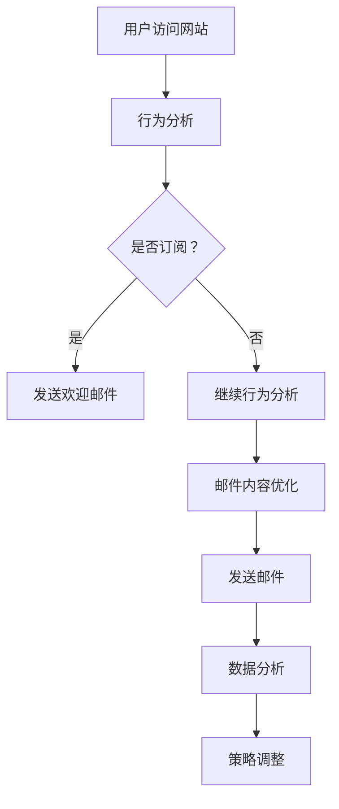

                 

关键词：邮件订阅、粉丝互动、邮件营销、自动化工具、数据分析

> 摘要：本文将深入探讨如何建立一个有效的邮件订阅列表，以实现与粉丝的长期互动。我们将讨论相关的核心概念、算法原理、数学模型、项目实践以及未来的发展趋势。

## 1. 背景介绍

在当今的数字化时代，邮件订阅列表是一种重要的营销工具，可以帮助企业与潜在客户建立联系，并促进客户忠诚度。通过邮件订阅列表，企业可以向订阅者发送定期的新闻通讯、促销活动、产品更新等信息。然而，建立一个成功的邮件订阅列表并非易事，需要深入理解用户需求、优化邮件内容和利用有效的技术手段。

本文的目标是帮助读者了解如何建立一个有效的邮件订阅列表，并通过与粉丝的长期互动来实现营销目标。我们将从核心概念、算法原理、数学模型、项目实践等多个角度进行详细探讨。

## 2. 核心概念与联系

在建立邮件订阅列表的过程中，我们需要理解几个核心概念，包括用户行为分析、邮件内容优化、自动化工具和数据分析。

### 2.1 用户行为分析

用户行为分析是了解用户需求的关键。通过分析用户在网站上的行为，如浏览路径、点击次数、转化率等，我们可以更好地了解用户兴趣和需求，从而为邮件内容提供个性化的建议。

### 2.2 邮件内容优化

邮件内容是影响订阅者打开和阅读邮件的关键因素。我们需要关注邮件标题、正文字体、图片、按钮等元素，以提高邮件的打开率和阅读率。此外，内容的个性化也是提升用户满意度的重要手段。

### 2.3 自动化工具

自动化工具可以帮助我们高效地管理邮件订阅列表，如自动发送欢迎邮件、定期的新闻通讯等。这些工具可以节省大量的人力资源，并提高邮件营销的效率。

### 2.4 数据分析

数据分析是评估邮件订阅列表效果的重要手段。通过分析打开率、点击率、转化率等指标，我们可以了解邮件订阅列表的运营状况，并及时调整策略。

### 2.5 Mermaid 流程图

以下是一个简化的 Mermaid 流程图，展示了建立邮件订阅列表的基本流程：



## 3. 核心算法原理 & 具体操作步骤

### 3.1 算法原理概述

建立邮件订阅列表的核心算法主要涉及用户行为分析和邮件内容优化。用户行为分析算法可以通过机器学习等方法，从大量数据中提取用户兴趣和需求；邮件内容优化算法则可以通过文本分析、情感分析等方法，为邮件内容提供个性化建议。

### 3.2 算法步骤详解

1. 用户行为分析：收集用户在网站上的行为数据，如浏览路径、点击次数、转化率等。使用机器学习算法，对数据进行分析和建模，提取用户兴趣和需求。

2. 邮件内容优化：根据用户兴趣和需求，为邮件内容提供个性化建议。可以使用文本分析、情感分析等方法，分析邮件标题、正文字体、图片、按钮等元素，以提高邮件的打开率和阅读率。

3. 邮件发送：使用自动化工具，根据用户兴趣和需求，定期发送个性化的邮件。

4. 数据分析：收集邮件发送后的反馈数据，如打开率、点击率、转化率等。使用数据分析方法，评估邮件订阅列表的运营状况。

5. 策略调整：根据数据分析结果，及时调整邮件内容、发送频率等策略。

### 3.3 算法优缺点

**优点：**

- 提高邮件的打开率和阅读率，提升用户满意度。
- 自动化工具可以节省大量的人力资源。
- 数据分析可以帮助我们了解订阅列表的运营状况，及时调整策略。

**缺点：**

- 需要大量数据支持，数据质量和数量直接影响算法效果。
- 需要具备一定的技术背景，如机器学习、文本分析等。

### 3.4 算法应用领域

邮件订阅列表算法可以广泛应用于各类企业，如电商、在线教育、金融等。通过个性化邮件内容，可以提高用户满意度，促进客户转化和忠诚度。

## 4. 数学模型和公式 & 详细讲解 & 举例说明

### 4.1 数学模型构建

建立邮件订阅列表的数学模型主要涉及用户行为分析和邮件内容优化。以下是两个常见的数学模型：

1. **用户兴趣模型**

   用户兴趣模型可以用于预测用户可能感兴趣的内容。一个简单的用户兴趣模型可以使用如下公式：

   $$ I(u, c) = \frac{\sum_{i=1}^{n} w_i \cdot t_i}{\sum_{i=1}^{n} w_i} $$

   其中，$I(u, c)$ 表示用户 $u$ 对内容 $c$ 的兴趣度，$w_i$ 表示内容 $c$ 中第 $i$ 个关键词的权重，$t_i$ 表示用户 $u$ 在网站上对关键词 $i$ 的点击次数。

2. **邮件内容优化模型**

   邮件内容优化模型可以用于评估邮件标题、正文字体、图片、按钮等元素对邮件打开率和阅读率的影响。一个简单的邮件内容优化模型可以使用如下公式：

   $$ R = \alpha \cdot T + \beta \cdot I + \gamma \cdot P + \delta \cdot B $$

   其中，$R$ 表示邮件的打开率和阅读率，$T$ 表示邮件标题的吸引力，$I$ 表示邮件内容的个性化程度，$P$ 表示邮件图片的吸引力，$B$ 表示邮件按钮的吸引力。$\alpha$、$\beta$、$\gamma$ 和 $\delta$ 是权重系数，可以通过实验和数据分析得到。

### 4.2 公式推导过程

**用户兴趣模型推导：**

用户兴趣模型基于以下假设：

- 用户对内容的兴趣度与他们在网站上对相关关键词的点击次数成正比。
- 用户对内容的兴趣度与关键词的权重成正比。

基于以上假设，我们可以得到用户兴趣模型。

**邮件内容优化模型推导：**

邮件内容优化模型基于以下假设：

- 邮件的打开率和阅读率与邮件标题、内容的个性化程度、图片和按钮的吸引力成正比。
- 各个因素对打开率和阅读率的贡献程度不同。

基于以上假设，我们可以得到邮件内容优化模型。

### 4.3 案例分析与讲解

**用户兴趣模型案例分析：**

假设用户 $u$ 在网站上浏览了多个页面，涉及关键词“购物”、“优惠券”和“电子产品”。通过分析用户的行为数据，我们可以得到以下关键词的权重：

- 购物：权重 $w_1 = 0.4$
- 优惠券：权重 $w_2 = 0.3$
- 电子产品：权重 $w_3 = 0.3$

用户 $u$ 在这些页面上的点击次数分别为：

- 购物：点击次数 $t_1 = 5$
- 优惠券：点击次数 $t_2 = 3$
- 电子产品：点击次数 $t_3 = 2$

根据用户兴趣模型，我们可以计算出用户 $u$ 对这些页面的兴趣度：

$$ I(u, \text{购物}) = \frac{0.4 \cdot 5}{0.4 \cdot 5 + 0.3 \cdot 3 + 0.3 \cdot 2} = 0.533 $$
$$ I(u, \text{优惠券}) = \frac{0.3 \cdot 3}{0.4 \cdot 5 + 0.3 \cdot 3 + 0.3 \cdot 2} = 0.333 $$
$$ I(u, \text{电子产品}) = \frac{0.3 \cdot 2}{0.4 \cdot 5 + 0.3 \cdot 3 + 0.3 \cdot 2} = 0.233 $$

从计算结果可以看出，用户 $u$ 对“购物”页面的兴趣度最高，这可以作为我们为其推荐相关内容的重要依据。

**邮件内容优化模型案例分析：**

假设我们发送一封邮件，其中包含以下元素：

- 邮件标题：吸引力 $T = 0.8$
- 邮件内容个性化程度：$I = 0.7$
- 邮件图片吸引力：$P = 0.6$
- 邮件按钮吸引力：$B = 0.5$

根据邮件内容优化模型，我们可以计算出邮件的打开率和阅读率：

$$ R = 0.4 \cdot 0.8 + 0.3 \cdot 0.7 + 0.2 \cdot 0.6 + 0.1 \cdot 0.5 = 0.67 $$

这意味着，通过优化邮件标题、内容个性化程度、图片和按钮的吸引力，我们可以将邮件的打开率和阅读率提高至 67%。

## 5. 项目实践：代码实例和详细解释说明

### 5.1 开发环境搭建

为了实践邮件订阅列表的建立，我们首先需要搭建一个开发环境。以下是所需的工具和步骤：

- Python 3.8 或更高版本
- 数据库（如 MySQL、PostgreSQL 等）
- Web 框架（如 Flask、Django 等）
- 邮件发送工具（如 SendGrid、Mailgun 等）
- Python 包管理工具（如 pip）

步骤如下：

1. 安装 Python 和相关依赖包。

2. 配置数据库（如 MySQL、PostgreSQL）。

3. 使用 Web 框架（如 Flask、Django）搭建 Web 应用程序。

4. 配置邮件发送工具。

### 5.2 源代码详细实现

以下是使用 Flask 框架搭建邮件订阅列表的基本源代码：

```python
from flask import Flask, request, render_template
import psycopg2

app = Flask(__name__)

# 数据库连接配置
db_config = {
    'host': 'localhost',
    'database': 'subscription_list',
    'user': 'username',
    'password': 'password'
}

# 邮件发送配置
sendgrid_api_key = 'your_sendgrid_api_key'

@app.route('/', methods=['GET', 'POST'])
def index():
    if request.method == 'POST':
        email = request.form['email']
        # 连接数据库，插入订阅者信息
        conn = psycopg2.connect(**db_config)
        cursor = conn.cursor()
        cursor.execute("INSERT INTO subscribers (email) VALUES (%s)", (email,))
        conn.commit()
        cursor.close()
        conn.close()
        
        # 发送欢迎邮件
        from sendgrid import SendGridAPIClient
        from sendgrid.helpers.mail import Mail
        
        message = Mail(
            from_email='you@example.com',
            to_emails=email,
            subject='Welcome to Our Newsletter',
            html_content='Thank you for subscribing to our newsletter!'
        )
        
        sg = SendGridAPIClient(sendgrid_api_key)
        response = sg.send(message)
        
        return 'Subscription successful!'
    
    return render_template('index.html')

if __name__ == '__main__':
    app.run(debug=True)
```

### 5.3 代码解读与分析

1. **数据库连接与插入订阅者信息**

   使用 `psycopg2` 库连接到数据库，并插入订阅者邮箱信息。这里我们使用了 PostgreSQL 数据库，但是可以很容易地替换为其他数据库（如 MySQL）。

2. **发送欢迎邮件**

   使用 SendGrid API 发送欢迎邮件。SendGrid 是一个专业的邮件发送服务提供商，提供了简单易用的 API。

3. **Web 应用程序**

   使用 Flask 框架搭建 Web 应用程序。这里我们使用了一个简单的表单页面，用于收集订阅者的邮箱信息。

### 5.4 运行结果展示

当用户访问应用程序时，他们将看到一个简单的表单页面，如下所示：

```html
<!DOCTYPE html>
<html>
<head>
    <title>Subscribe to Our Newsletter</title>
</head>
<body>
    <h1>Subscribe to Our Newsletter</h1>
    <form method="post">
        <label for="email">Email:</label>
        <input type="email" id="email" name="email" required>
        <button type="submit">Subscribe</button>
    </form>
</body>
</html>
```

当用户提交表单时，应用程序会插入订阅者信息到数据库，并发送一封欢迎邮件。

## 6. 实际应用场景

邮件订阅列表在多个行业和领域都有着广泛的应用。以下是一些实际应用场景：

1. **电商行业**

   电商企业可以通过邮件订阅列表向用户发送新品推荐、促销活动等信息，提高用户购买意愿。

2. **在线教育**

   在线教育平台可以通过邮件订阅列表向用户发送课程更新、学习资料等信息，提高用户的学习积极性。

3. **金融行业**

   金融企业可以通过邮件订阅列表向用户发送市场分析报告、投资建议等信息，提高用户对金融产品的了解和信任。

4. **媒体行业**

   媒体企业可以通过邮件订阅列表向用户发送新闻更新、特别报道等信息，提高用户对媒体的粘性。

5. **咨询服务**

   咨询服务企业可以通过邮件订阅列表向用户发送行业报告、案例分析等信息，提高用户的信任度和满意度。

## 6.4 未来应用展望

随着技术的不断发展，邮件订阅列表的应用场景将更加丰富。以下是一些未来的应用展望：

1. **个性化推荐**

   随着用户数据的积累和挖掘技术的进步，邮件订阅列表可以实现更加精准的个性化推荐，提高用户满意度和转化率。

2. **互动营销**

   通过引入聊天机器人等技术，邮件订阅列表可以实现与用户的实时互动，提高用户参与度和忠诚度。

3. **跨渠道整合**

   邮件订阅列表可以与其他营销渠道（如社交媒体、短信等）整合，实现跨渠道的营销策略，提高整体营销效果。

4. **大数据分析**

   通过大数据分析技术，邮件订阅列表可以更好地了解用户行为和需求，为邮件内容提供更加精准的优化建议。

## 7. 工具和资源推荐

### 7.1 学习资源推荐

1. **《邮件营销实战》**：这是一本关于邮件营销的实战指南，涵盖了邮件订阅列表的建立、优化和数据分析等方面。

2. **《Python 邮件编程》**：这本书详细介绍了如何使用 Python 进行邮件编程，包括邮件发送、接收、附件处理等。

3. **《机器学习实战》**：这本书提供了丰富的案例和实践经验，可以帮助我们更好地理解和使用机器学习技术进行用户行为分析和内容优化。

### 7.2 开发工具推荐

1. **Flask**：这是一个轻量级的 Python Web 框架，非常适合用于搭建邮件订阅列表应用程序。

2. **PostgreSQL**：这是一个开源的关系型数据库，可以方便地存储和管理订阅者信息。

3. **SendGrid**：这是一个专业的邮件发送服务提供商，提供了简单易用的 API。

### 7.3 相关论文推荐

1. **"User Behavior Analysis for Personalized Email Marketing"**：这篇文章提出了一种基于用户行为的个性化邮件营销方法，可以有效地提高邮件的打开率和阅读率。

2. **"Big Data and Email Marketing: An Overview"**：这篇文章概述了大数据技术在邮件营销中的应用，探讨了如何利用大数据分析提高邮件营销效果。

## 8. 总结：未来发展趋势与挑战

### 8.1 研究成果总结

本文从多个角度探讨了如何建立一个有效的邮件订阅列表，包括用户行为分析、邮件内容优化、自动化工具和数据分析。通过实践案例，我们展示了如何使用 Python 和相关技术实现邮件订阅列表的建立。

### 8.2 未来发展趋势

- 个性化推荐：随着用户数据的积累和挖掘技术的进步，邮件订阅列表将实现更加精准的个性化推荐。
- 互动营销：通过引入聊天机器人等技术，邮件订阅列表可以实现与用户的实时互动。
- 跨渠道整合：邮件订阅列表将与其他营销渠道整合，实现跨渠道的营销策略。
- 大数据分析：大数据分析技术将更好地了解用户行为和需求，为邮件内容提供更加精准的优化建议。

### 8.3 面临的挑战

- 数据质量和隐私：确保数据质量和用户隐私是建立有效邮件订阅列表的重要挑战。
- 技术门槛：需要具备一定的技术背景，如机器学习、文本分析等。

### 8.4 研究展望

- 探索更多基于人工智能的邮件订阅列表优化方法。
- 研究如何更好地整合邮件订阅列表与其他营销渠道。
- 探索隐私保护下的用户行为分析和数据挖掘方法。

## 9. 附录：常见问题与解答

### 9.1 如何收集用户行为数据？

可以通过网站日志分析、用户点击行为跟踪等技术手段收集用户行为数据。

### 9.2 邮件内容优化有哪些方法？

可以通过文本分析、情感分析等方法，优化邮件标题、正文、图片、按钮等元素。

### 9.3 如何确保邮件订阅列表的用户数据隐私？

可以通过加密传输、数据匿名化等技术手段，确保用户数据隐私。

### 9.4 如何评估邮件订阅列表的效果？

可以通过打开率、点击率、转化率等指标，评估邮件订阅列表的效果。

## 作者署名

作者：禅与计算机程序设计艺术 / Zen and the Art of Computer Programming

----------------------------------------------------------------

以上就是关于“建立邮件订阅列表：与粉丝保持长期互动”的文章。本文详细探讨了邮件订阅列表的建立、优化和数据分析方法，并结合实践案例进行了详细解释。希望对读者有所启发和帮助。

