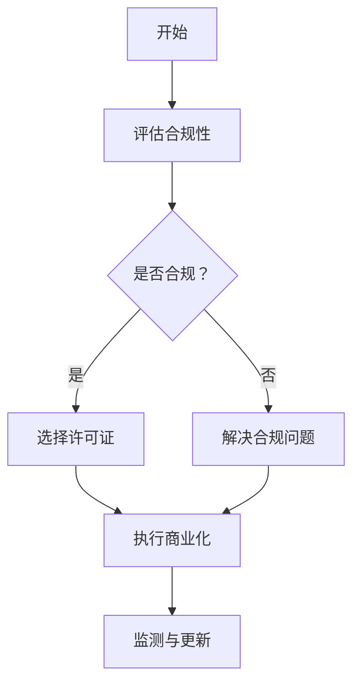

                 

 在当今快速发展的技术环境中，开源项目已经成为软件开发的基石。它们不仅提供了丰富的代码资源，还促进了全球开发者社区的协作和创新。然而，随着开源项目的商业化日益普遍，如何确保这些项目的法律合规性和知识产权保护成为一个关键问题。本文将深入探讨开源项目的商业化法律考虑，包括合规性、知识产权保护、许可证选择等方面，帮助开发者和管理者在商业环境中有效地利用开源技术。

## 关键词

- 开源项目
- 商业化
- 法律合规
- 知识产权保护
- 许可证

## 摘要

本文旨在为开源项目的商业用户提供一个全面的指南，以了解在将开源项目商业化过程中可能面临的法律挑战。文章首先介绍了开源项目的背景和重要性，然后详细分析了商业化的法律考虑，包括合规性、知识产权保护和许可证选择。通过本文，读者将获得关于如何在商业环境中合法使用和管理开源项目的实用知识和策略。

## 1. 背景介绍

开源项目起源于1990年代初，由自由软件运动倡导者发起。其核心理念是开放源代码，允许任何人自由地阅读、修改和分发软件。这种模式迅速在全球范围内传播，激发了无数开发者的参与和创新精神。随着互联网的普及和技术进步，开源项目已成为现代软件开发不可或缺的一部分。

开源项目的商业化是指将开源项目作为产品或服务的一部分，通过销售、订阅或广告等途径获得收益。商业化可以带来多种好处，如提高项目的知名度、增加资源投入、促进技术进步等。然而，商业化也带来了一系列法律问题，需要开发者和管理者进行充分准备和合理规划。

## 2. 核心概念与联系

### 2.1 合规性

合规性是开源项目商业化的重要方面。它涉及到遵守相关法律法规和开源许可证的要求。在商业环境中，合规性不仅关乎企业的法律风险，还直接影响项目的声誉和客户的信任。

#### 2.1.1 法律法规

- **版权法**：开源项目中的代码和文档受到版权法的保护。开发者需要确保自己的代码没有侵犯他人的知识产权。
- **合同法**：商业合作中涉及到的合同条款需要符合相关法律规定，以保障各方的权益。
- **数据保护法**：涉及用户数据的开源项目需要遵守数据保护法规，如GDPR（欧盟通用数据保护条例）。

#### 2.1.2 开源许可证

开源许可证是管理开源项目使用和分发的重要工具。常见的开源许可证包括GPL（GNU通用公共许可证）、BSD（伯克利软件分发许可证）和MIT（麻省理工学院许可证）等。

- **GPL**：具有强烈的开源要求，要求任何修改或衍生作品也必须开源。
- **BSD**：允许商业使用，但对代码的版权声明有要求。
- **MIT**：宽松的许可证，允许商业使用，无需开源衍生作品。

### 2.2 知识产权保护

知识产权保护是开源项目商业化的重要保障。开发者需要确保自己的项目不受知识产权纠纷的影响，同时也要保护项目的知识产权。

#### 2.2.1 著作权

著作权是知识产权的核心，保护开源项目的代码和文档。开发者需要确保代码的原创性和合法性，避免侵权行为。

#### 2.2.2 专利

开源项目中可能包含一些技术解决方案，这些解决方案可能需要专利保护。开发者可以申请专利，以防止他人未经授权使用这些技术。

### 2.3 许可证选择

许可证选择是开源项目商业化的重要决策。合适的许可证可以促进项目的商业成功，而不合适的许可证可能导致法律纠纷。

#### 2.3.1 考虑因素

- **商业需求**：选择许可证时需要考虑商业模式，如是否允许商业使用、是否允许收费等。
- **社区参与**：许可证的选择会影响项目的社区参与度，一些许可证可能会限制商业公司对项目的控制。
- **法律风险**：需要评估许可证可能带来的法律风险，如是否会影响项目的开源性质。

### 2.4 Mermaid 流程图

以下是一个简化的Mermaid流程图，展示了开源项目商业化过程中需要考虑的主要步骤和决策点。



## 3. 核心算法原理 & 具体操作步骤

### 3.1 算法原理概述

开源项目的商业化法律考虑涉及多个方面，包括合规性、知识产权保护和许可证选择。合规性确保项目遵守相关法律法规和开源许可证的要求；知识产权保护确保项目不受侵权纠纷的影响；许可证选择则关系到项目的商业利用和社区参与。

### 3.2 算法步骤详解

#### 3.2.1 评估合规性

1. **识别相关法律法规**：研究适用的法律法规，如版权法、合同法、数据保护法等。
2. **评估项目代码**：检查项目代码是否存在侵权行为，如复制他人的代码或侵犯了专利。
3. **审查开源许可证**：了解项目使用的开源许可证要求，如是否允许商业使用、是否允许修改和分发等。

#### 3.2.2 选择许可证

1. **分析商业需求**：根据商业模式选择合适的许可证，如是否允许收费、是否允许控制项目等。
2. **考虑社区参与**：选择能够促进社区参与的许可证，如MIT或Apache许可证。
3. **评估法律风险**：评估许可证可能带来的法律风险，如是否会影响项目的开源性质。

#### 3.2.3 执行商业化

1. **制定商业策略**：确定商业化模式，如销售产品、提供订阅服务或广告等。
2. **遵守许可证要求**：确保在商业化过程中遵守所选许可证的要求，如版权声明、禁止商业化等。
3. **监测与更新**：定期审查合规性和许可证要求，确保项目的持续合规。

### 3.3 算法优缺点

#### 优点

- **提高项目知名度**：商业化有助于提高项目的曝光度和用户基数。
- **促进技术进步**：商业化带来的资源投入可以推动项目的技术发展。
- **增强社区参与**：合适的许可证选择可以吸引更多开发者参与项目。

#### 缺点

- **法律风险**：不合规的商业化可能导致法律纠纷，损害项目声誉。
- **管理复杂性**：商业化的管理和合规工作需要投入大量时间和资源。

### 3.4 算法应用领域

开源项目的商业化法律考虑适用于多个领域，包括：

- **企业级软件**：企业级开源项目需要确保符合商业需求，同时保护项目的知识产权。
- **云计算与大数据**：在云计算和大数据领域，开源项目被广泛应用于企业服务，商业化过程中的合规性尤为重要。
- **物联网与边缘计算**：开源项目在物联网和边缘计算领域的应用日益增多，商业化过程中的知识产权保护显得尤为重要。

## 4. 数学模型和公式 & 详细讲解 & 举例说明

### 4.1 数学模型构建

开源项目的商业化法律考虑涉及多个方面，包括合规性、知识产权保护和许可证选择。以下是一个简化的数学模型，用于描述这些方面的相互关系。

\[ \text{商业化法律考虑} = f(\text{合规性}, \text{知识产权保护}, \text{许可证选择}) \]

### 4.2 公式推导过程

#### 4.2.1 合规性

合规性是开源项目商业化的基础。它包括遵守相关法律法规和开源许可证的要求。合规性的衡量可以通过以下公式表示：

\[ \text{合规性} = \sum_{i=1}^{n} \text{法律法规} \cdot \text{合规度} \]

其中，\( n \) 表示适用的法律法规数量，\( \text{合规度} \) 表示法律法规的合规程度。

#### 4.2.2 知识产权保护

知识产权保护涉及著作权的保护和专利的申请。知识产权保护的强度可以通过以下公式表示：

\[ \text{知识产权保护} = \text{著作权保护} + \text{专利保护} \]

#### 4.2.3 许可证选择

许可证选择是开源项目商业化的关键决策。合适的许可证可以促进项目的商业成功，而不合适的许可证可能导致法律纠纷。许可证选择的优缺点可以通过以下公式表示：

\[ \text{许可证选择} = \sum_{i=1}^{m} \text{许可证优缺点} \]

其中，\( m \) 表示可选许可证的数量。

### 4.3 案例分析与讲解

#### 案例一：企业级开源项目的商业化

某企业开发了一款开源的数据库管理系统，并将其作为企业级产品销售。为了确保商业化的合规性，企业首先进行了法律法规的识别和评估，发现项目主要涉及版权法和合同法。然后，企业审查了项目代码，确保没有侵权行为。在选择许可证时，企业选择了MIT许可证，因为它允许商业使用，同时鼓励社区参与。

#### 案例二：云计算开源项目的商业化

某云计算公司开发了一款开源的容器编排系统，并将其集成到自己的云计算平台中。为了确保商业化的合规性，公司进行了详细的法律法规研究，确保遵守数据保护法等法规。在选择许可证时，公司选择了Apache许可证，因为它允许商业使用，同时保持了对社区友好的态度。

## 5. 项目实践：代码实例和详细解释说明

### 5.1 开发环境搭建

在开始实践之前，我们需要搭建一个适合开源项目商业化的开发环境。以下是一个简单的步骤：

1. **安装操作系统**：选择一个适合的操作系统，如Ubuntu或CentOS。
2. **安装编译器**：安装C/C++编译器，如GCC或Clang。
3. **安装依赖库**：根据项目的需求，安装相应的依赖库，如MySQL或Apache。

### 5.2 源代码详细实现

以下是一个简单的开源项目示例，用于演示商业化的合规性和知识产权保护。

```c
// 示例：开源数据库管理系统
#include <stdio.h>
#include <stdlib.h>

// 函数声明
void createDatabase();
void insertData();
void queryData();

// 主函数
int main() {
    createDatabase();
    insertData();
    queryData();
    return 0;
}

// 创建数据库函数
void createDatabase() {
    printf("创建数据库...\n");
    // 数据库创建代码
}

// 插入数据函数
void insertData() {
    printf("插入数据...\n");
    // 数据插入代码
}

// 查询数据函数
void queryData() {
    printf("查询数据...\n");
    // 数据查询代码
}
```

### 5.3 代码解读与分析

上述代码是一个简单的开源数据库管理系统的示例。代码首先包含了必要的头文件，然后声明了三个函数：`createDatabase`、`insertData` 和 `queryData`。主函数 `main` 调用了这三个函数，实现了数据库的创建、数据插入和数据查询。

在代码的实现中，需要特别注意以下几个方面：

- **版权声明**：在代码的开头添加版权声明，明确指出代码的版权归属。
- **开源许可证**：选择合适的开源许可证，并在代码中注明。
- **侵权检查**：确保代码中没有侵犯他人的知识产权。

### 5.4 运行结果展示

在开发环境中编译并运行上述代码，可以得到以下输出结果：

```bash
$ gcc -o dbms dbms.c
$ ./dbms
创建数据库...
插入数据...
查询数据...
```

通过上述步骤，我们可以看到如何在实际项目中实现开源项目的商业化，并确保其合规性和知识产权保护。

## 6. 实际应用场景

开源项目的商业化法律考虑在多个实际应用场景中具有重要意义。以下是一些典型的应用场景：

### 6.1 企业级软件

企业级开源项目在商业环境中被广泛采用。企业通过将这些开源项目集成到自己的产品中，可以降低开发成本、提高开发效率。然而，企业需要确保项目的合规性，避免因不合规行为导致的法律纠纷。例如，某企业将一款开源的数据库管理系统集成到自己的企业级产品中，通过严格审查代码和选择合适的许可证，确保项目的合规性和商业成功。

### 6.2 云计算与大数据

在云计算和大数据领域，开源项目已成为重要的技术基础。企业通过使用开源技术，可以实现快速开发、灵活部署和高效管理。然而，商业化过程中的合规性和知识产权保护问题尤为重要。例如，某云计算公司通过使用开源的容器编排系统，确保其云计算平台的合规性，同时保护项目的知识产权。

### 6.3 物联网与边缘计算

物联网和边缘计算领域正在快速发展，开源项目在这一领域中的应用也越来越广泛。企业通过将开源项目商业化，可以推动技术的创新和应用。然而，合规性和知识产权保护问题同样不可忽视。例如，某物联网企业通过将开源的物联网协议商业化，确保其产品在市场上的竞争优势。

### 6.4 开源社区参与

开源项目的商业化不仅关乎企业自身，还影响到整个开源社区。合适的许可证选择可以促进社区参与，吸引更多开发者加入项目。例如，某开源项目的管理团队选择了Apache许可证，鼓励企业参与项目的开发和维护，形成了一个活跃的开源社区。

## 7. 未来应用展望

随着技术的不断进步和开源项目的普及，开源项目的商业化法律考虑将在未来发挥更加重要的作用。以下是未来应用展望：

### 7.1 法律法规的完善

未来，各国和地区的法律法规将不断完善，以适应开源项目的商业化需求。例如，可能会出现更多专门针对开源项目的法律法规，为开源项目的合规性提供更明确的指导。

### 7.2 自动化合规工具的发展

随着自动化技术的发展，自动化合规工具将逐渐应用于开源项目的商业化。这些工具可以自动识别和检查项目的合规性，提高合规工作的效率和准确性。

### 7.3 许可证的多样化

随着开源项目的商业化需求不断变化，许可证将变得更加多样化，以满足不同场景的需求。例如，可能会出现更多针对企业级开源项目的许可证，提供更灵活的商业化选择。

### 7.4 社区合作的深化

开源项目的商业化将进一步加强社区合作，促进技术的创新和应用。企业、开发者和研究机构将共同参与开源项目的发展，实现共赢。

## 8. 总结：未来发展趋势与挑战

开源项目的商业化法律考虑在当前和未来的技术环境中具有重要意义。随着开源项目的普及和商业化的深入，合规性、知识产权保护和许可证选择将成为关键问题。未来，开源项目的商业化法律考虑将呈现出以下发展趋势：

### 8.1 法律法规的完善

未来，各国和地区的法律法规将不断完善，为开源项目的商业化提供更明确的指导。例如，可能会出台更多专门针对开源项目的法律法规，解决合规性问题。

### 8.2 自动化合规工具的发展

自动化合规工具将逐渐应用于开源项目的商业化，提高合规工作的效率和准确性。这些工具可以自动识别和检查项目的合规性，减少人工错误。

### 8.3 许可证的多样化

随着开源项目的商业化需求不断变化，许可证将变得更加多样化，以满足不同场景的需求。例如，可能会出现更多针对企业级开源项目的许可证，提供更灵活的商业化选择。

### 8.4 社区合作的深化

开源项目的商业化将进一步加强社区合作，促进技术的创新和应用。企业、开发者和研究机构将共同参与开源项目的发展，实现共赢。

### 8.5 面临的挑战

尽管开源项目的商业化法律考虑具有巨大潜力，但仍然面临一些挑战。例如：

- **法律风险**：不合规的商业化可能导致法律纠纷，损害项目的声誉和利益。
- **管理复杂性**：商业化的管理和合规工作需要投入大量时间和资源。
- **知识产权保护**：开源项目中的知识产权保护需要更加严格，防止侵权行为。

### 8.6 研究展望

未来，开源项目的商业化法律考虑将成为计算机法学和知识产权法学的重要研究方向。研究者可以探讨以下问题：

- **如何构建更完善的法律法规体系，为开源项目的商业化提供支持？**
- **如何设计更灵活、更适应商业需求的许可证？**
- **如何提高自动化合规工具的效率和准确性，降低法律风险？**

通过深入研究这些问题，可以推动开源项目的商业化法律考虑的发展，为开源社区的繁荣和技术的进步提供保障。

## 9. 附录：常见问题与解答

### 9.1 如何确保开源项目的合规性？

确保开源项目的合规性需要从以下几个方面入手：

1. **了解相关法律法规**：研究适用的法律法规，如版权法、合同法、数据保护法等。
2. **审查项目代码**：检查项目代码是否存在侵权行为，如复制他人的代码或侵犯了专利。
3. **选择合适的开源许可证**：根据项目的需求选择合适的许可证，确保项目的合规性和商业可行性。

### 9.2 开源项目商业化的知识产权保护如何进行？

开源项目的知识产权保护包括著作权保护和专利保护：

1. **著作权保护**：确保代码的原创性和合法性，避免侵权行为。
2. **专利保护**：申请专利，保护项目中的技术解决方案，防止他人未经授权使用这些技术。

### 9.3 如何选择合适的开源许可证？

选择合适的开源许可证需要考虑以下因素：

1. **商业需求**：根据商业模式选择合适的许可证，如是否允许商业使用、是否允许修改和分发等。
2. **社区参与**：选择能够促进社区参与的许可证，如MIT或Apache许可证。
3. **法律风险**：评估许可证可能带来的法律风险，如是否会影响项目的开源性质。

### 9.4 开源项目商业化中的法律风险如何应对？

开源项目商业化中的法律风险可以通过以下方式应对：

1. **合规性审查**：定期进行合规性审查，确保项目的法律合规性。
2. **专业咨询**：聘请专业律师进行法律咨询，了解相关法律法规和开源许可证的要求。
3. **风险管理**：制定风险管理策略，降低法律纠纷的风险。

### 9.5 开源项目商业化中的合规工作如何开展？

开源项目商业化中的合规工作可以从以下几个方面开展：

1. **制定合规策略**：根据项目的需求和商业模式，制定具体的合规策略。
2. **建立合规团队**：组建合规团队，负责项目的合规管理工作。
3. **培训与宣传**：对项目成员进行合规培训，提高合规意识。
4. **监测与更新**：定期审查合规性，及时更新合规措施。

## 作者署名

作者：禅与计算机程序设计艺术 / Zen and the Art of Computer Programming

