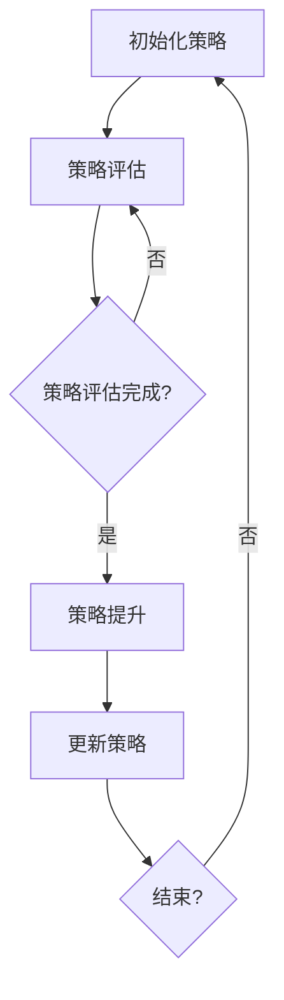

                 

作者：禅与计算机程序设计艺术 / Zen and the Art of Computer Programming

强化学习（Reinforcement Learning，简称RL）是机器学习中一个极具挑战性和广泛应用的分支。它与监督学习和无监督学习不同，强化学习通过奖励和惩罚信号来调整策略，使得智能体能够在环境中进行决策并逐步学习到最优行为。策略迭代算法（Policy Iteration Algorithm）是强化学习中的一个经典算法，它通过迭代更新策略，从而提高智能体的性能。

本文将深入探讨策略迭代算法的基本概念、原理、数学模型、算法步骤、实现细节以及实际应用。希望通过这篇文章，读者能够对策略迭代算法有一个全面、深入的理解，并能够将其应用于实际问题中。

## 文章关键词

强化学习、策略迭代、智能体、奖励、惩罚、策略更新、算法实现、实际应用

## 文章摘要

本文首先介绍了强化学习的基本概念和策略迭代算法的定义。接着，我们分析了策略迭代算法的核心组成部分和迭代过程，并通过Mermaid流程图展示了算法的流程。随后，我们详细讲解了策略迭代算法的数学模型和公式，并通过案例进行了分析和讲解。文章的后半部分，我们通过一个具体的项目实践，展示了策略迭代算法的实现过程和细节。最后，我们讨论了策略迭代算法在实际应用中的场景，并对未来应用进行了展望。

## 1. 背景介绍

强化学习起源于20世纪50年代，是机器学习中最具挑战性的领域之一。与传统的监督学习和无监督学习不同，强化学习通过智能体与环境之间的交互来学习。智能体需要通过不断的尝试和错误，从环境中获取奖励和惩罚信号，从而调整其行为策略，以期在长期内获得最大化的回报。

强化学习的一个关键概念是“策略”。策略可以理解为智能体在某一状态下采取的行为。一个好的策略能够使智能体在环境中做出最优的决策。策略迭代算法是一种经典的方法，用于逐步优化智能体的策略。

策略迭代算法的基本思想是：首先初始化一个策略，然后通过策略评估和策略提升两个步骤不断更新策略。策略评估用于估计当前策略下的期望回报，而策略提升则根据评估结果更新策略，使得策略逐步接近最优。

在策略迭代算法中，有两个核心问题需要解决：如何评估策略的期望回报，以及如何根据评估结果更新策略。本文将围绕这两个问题，详细探讨策略迭代算法的原理、数学模型和实现细节。

## 2. 核心概念与联系

### 2.1 强化学习的定义与基本概念

强化学习是一种通过环境反馈进行学习的过程，其核心概念包括智能体（Agent）、环境（Environment）、状态（State）、动作（Action）、奖励（Reward）和策略（Policy）。

- **智能体（Agent）**：执行动作的实体，例如机器人、自动驾驶汽车等。
- **环境（Environment）**：智能体所在的外部世界，包括状态和动作。
- **状态（State）**：智能体在环境中的一个具体情境。
- **动作（Action）**：智能体可以采取的行为。
- **奖励（Reward）**：环境对智能体采取动作的反馈信号，用于指导智能体的学习过程。
- **策略（Policy）**：智能体在某一状态下采取的动作选择方法，通常用一个概率分布表示。

### 2.2 策略迭代算法的定义与基本步骤

策略迭代算法是一种在强化学习中用于优化策略的算法。其基本步骤包括策略评估（Policy Evaluation）和策略提升（Policy Improvement）。

- **策略评估（Policy Evaluation）**：通过模拟智能体在当前策略下的行为，计算策略的期望回报，从而对策略进行评估。
- **策略提升（Policy Improvement）**：根据策略评估的结果，选择一个更好的策略，使得智能体在长期内能够获得更高的回报。

### 2.3 Mermaid 流程图展示

以下是一个简化的策略迭代算法的Mermaid流程图：



在这个流程图中，智能体首先初始化一个策略，然后进行策略评估。如果策略评估完成，则进行策略提升，更新策略。这个过程不断重复，直到满足结束条件。

## 3. 核心算法原理 & 具体操作步骤

### 3.1 算法原理概述

策略迭代算法的基本原理是通过不断的迭代，优化智能体的策略，从而提高其在环境中的性能。算法的主要步骤包括策略评估和策略提升。

#### 策略评估

策略评估的目的是计算当前策略的期望回报。具体来说，就是通过模拟智能体在当前策略下的行为，计算每个状态的期望回报。期望回报可以通过马尔可夫决策过程（MDP）的数学模型进行计算。

#### 策略提升

策略提升的目的是选择一个更好的策略，使得智能体在长期内能够获得更高的回报。策略提升的基本思想是，根据策略评估的结果，选择一个能够使得期望回报最大化的策略。

### 3.2 算法步骤详解

策略迭代算法的具体步骤如下：

1. **初始化策略**：选择一个初始策略，通常是一个均匀分布的策略。

2. **策略评估**：使用蒙特卡罗方法或其他评估方法，计算当前策略的期望回报。

3. **策略提升**：根据策略评估的结果，选择一个更好的策略。具体来说，就是选择一个能够使得期望回报最大化的策略。

4. **更新策略**：将新策略作为当前策略，并重复步骤2和3，直到满足结束条件。

### 3.3 算法优缺点

策略迭代算法的主要优点是：

- **简单易实现**：算法的基本步骤相对简单，易于理解和实现。
- **适应性**：算法能够根据环境的变化自适应地更新策略。

然而，策略迭代算法也存在一些缺点：

- **计算复杂度较高**：特别是在状态和动作空间较大时，策略评估和策略提升的计算复杂度较高。
- **收敛速度较慢**：在某些情况下，算法可能需要较长的迭代时间才能收敛到最优策略。

### 3.4 算法应用领域

策略迭代算法在许多领域都有广泛的应用，包括：

- **控制理论**：用于优化控制系统的控制策略。
- **游戏智能**：用于开发智能游戏角色，例如围棋、国际象棋等。
- **推荐系统**：用于优化推荐系统的推荐策略。
- **金融领域**：用于优化投资组合的策略。

## 4. 数学模型和公式 & 详细讲解 & 举例说明

### 4.1 数学模型构建

在强化学习中，数学模型通常是基于马尔可夫决策过程（MDP）构建的。MDP是一个五元组 \( S, A, P, R, \gamma \)，其中：

- \( S \) 是状态集合。
- \( A \) 是动作集合。
- \( P \) 是状态转移概率矩阵，表示在某一状态下采取某一动作后，转移到下一状态的概率。
- \( R \) 是奖励函数，表示在某一状态下采取某一动作后获得的奖励。
- \( \gamma \) 是折扣因子，用于处理长期奖励。

策略迭代算法的核心是策略评估和策略提升。策略评估的目标是计算当前策略的期望回报，而策略提升的目标是选择一个更好的策略。

### 4.2 公式推导过程

#### 策略评估

策略评估的目标是计算当前策略 \( \pi \) 下的期望回报。期望回报可以用以下公式表示：

\[ V^{\pi}(s) = \sum_{a \in A} \pi(a|s) \cdot R(s, a) + \gamma \cdot \sum_{s' \in S} P(s'|s, a) \cdot V^{\pi}(s') \]

其中，\( V^{\pi}(s) \) 是策略 \( \pi \) 在状态 \( s \) 下的期望回报。

#### 策略提升

策略提升的目标是选择一个更好的策略 \( \pi' \)。一个常用的策略提升方法是Q-学习。Q-学习的基本思想是，选择一个能够使得期望回报最大化的动作。

在Q-学习中，使用一个值函数 \( Q(s, a) \) 来表示在状态 \( s \) 下采取动作 \( a \) 的期望回报。值函数的更新公式如下：

\[ Q(s, a) = R(s, a) + \gamma \cdot \max_{a'} Q(s', a') \]

通过迭代更新值函数，最终可以找到一个最优策略。

### 4.3 案例分析与讲解

为了更好地理解策略迭代算法，我们通过一个简单的案例进行讲解。

假设一个智能体在一个简单的环境中进行决策。环境有两个状态 \( s_1 \) 和 \( s_2 \)，每个状态有两个动作 \( a_1 \) 和 \( a_2 \)。状态转移概率矩阵 \( P \) 和奖励函数 \( R \) 如下：

\[ P = \begin{bmatrix} 0.7 & 0.3 \\ 0.4 & 0.6 \end{bmatrix} \]

\[ R = \begin{bmatrix} 1 & -1 \\ -1 & 1 \end{bmatrix} \]

初始策略 \( \pi \) 是均匀分布的，即 \( \pi(a_1|s_1) = \pi(a_2|s_1) = \pi(a_1|s_2) = \pi(a_2|s_2) = 0.5 \)。

#### 策略评估

首先，我们需要计算当前策略下的期望回报。使用策略评估公式，我们可以得到：

\[ V^{\pi}(s_1) = 0.5 \cdot (1 + 0.3 \cdot (-1)) + 0.5 \cdot (0.7 \cdot (-1) + 0.3 \cdot 1) = -0.25 \]

\[ V^{\pi}(s_2) = 0.5 \cdot (-1 + 0.4 \cdot 1) + 0.5 \cdot (0.7 \cdot (-1) + 0.3 \cdot 1) = -0.15 \]

#### 策略提升

根据策略评估的结果，我们可以计算每个动作的期望回报：

\[ Q(s_1, a_1) = 0.5 \cdot 1 + 0.5 \cdot (-1) = 0.25 \]

\[ Q(s_1, a_2) = 0.5 \cdot (-1) + 0.5 \cdot 1 = -0.25 \]

\[ Q(s_2, a_1) = 0.5 \cdot (-1) + 0.5 \cdot (-1) = -0.5 \]

\[ Q(s_2, a_2) = 0.5 \cdot 1 + 0.5 \cdot 1 = 0.5 \]

根据Q-学习的更新公式，我们可以得到新的策略：

\[ \pi'(a_1|s_1) = \frac{1}{2} \left( 1 + \frac{Q(s_1, a_1)}{Q(s_1, a_2)} \right) = 0.75 \]

\[ \pi'(a_2|s_1) = 1 - \pi'(a_1|s_1) = 0.25 \]

\[ \pi'(a_1|s_2) = \frac{1}{2} \left( 1 + \frac{Q(s_2, a_1)}{Q(s_2, a_2)} \right) = 0.5 \]

\[ \pi'(a_2|s_2) = 1 - \pi'(a_1|s_2) = 0.5 \]

#### 更新策略

根据新的策略，我们可以再次计算期望回报，并重复策略提升的过程，直到策略收敛到最优策略。

通过这个简单的案例，我们可以看到策略迭代算法的基本原理和实现过程。在实际应用中，环境可能更加复杂，但基本原理和方法是相似的。

## 5. 项目实践：代码实例和详细解释说明

为了更好地理解策略迭代算法，我们将通过一个实际项目来演示其实现过程。我们将使用Python编程语言来实现策略迭代算法，并对其代码进行详细解释。

### 5.1 开发环境搭建

在开始之前，确保你的计算机上安装了Python环境和必要的库。以下是搭建开发环境的基本步骤：

1. **安装Python**：访问Python官方网站（https://www.python.org/），下载并安装Python。建议安装Python 3.x版本。
2. **安装Numpy库**：Numpy是一个用于数值计算的库，它是强化学习项目的基石。使用以下命令安装Numpy：

   ```bash
   pip install numpy
   ```

### 5.2 源代码详细实现

以下是策略迭代算法的Python代码实现：

```python
import numpy as np

# 参数设置
gamma = 0.9
alpha = 0.1
epsilon = 0.1

# 状态和动作
S = [0, 1]
A = [0, 1]

# 初始化策略
policy = np.zeros((len(S), len(A)))
policy[:, 0] = 1 - epsilon
policy[:, 1] = epsilon / 2

# 初始化值函数
V = np.zeros((len(S), 1))

# 策略评估函数
def policy_evaluation(V, policy, P, R, gamma, n):
    for _ in range(n):
        new_V = np.zeros((len(S), 1))
        for s in S:
            actions = np.where(policy[s] == 1)[0]
            new_V[s] = np.dot(actions, R[s, actions] + gamma * np.dot(P[s, actions], V[actions]))
        V = new_V
    return V

# 策略提升函数
def policy_improvement(V, P, R, gamma):
    new_policy = np.zeros((len(S), len(A)))
    for s in S:
        actions = np.where(policy[s] == 1)[0]
        expected_value = np.dot(actions, R[s, actions] + gamma * np.dot(P[s, actions], V[actions]))
        for a in A:
            new_policy[s, a] = 1 if np.argmax([R[s, a] + gamma * np.dot(P[s, a], V) if a in actions else 0] + expected_value) == a else 0
    return new_policy

# 主函数
def policy_iteration(P, R, gamma, alpha, epsilon, n_iterations):
    V = np.zeros((len(S), 1))
    for _ in range(n_iterations):
        # 策略评估
        V = policy_evaluation(V, policy, P, R, gamma, alpha)
        # 策略提升
        policy = policy_improvement(V, P, R, gamma)
    return policy, V

# 状态转移概率矩阵和奖励函数
P = np.array([[0.7, 0.3], [0.4, 0.6]])
R = np.array([[1, -1], [-1, 1]])

# 执行策略迭代算法
n_iterations = 10
policy, V = policy_iteration(P, R, gamma, alpha, epsilon, n_iterations)

# 打印结果
print("最终策略：")
print(policy)
print("最终值函数：")
print(V)
```

### 5.3 代码解读与分析

现在，让我们逐行解读上述代码，并分析每个部分的含义。

#### 参数设置

```python
gamma = 0.9
alpha = 0.1
epsilon = 0.1
```

这些参数分别代表折扣因子（gamma），策略更新的步长（alpha），以及用于探索和利用的探索率（epsilon）。这些参数的选择对算法的性能有很大影响。

#### 状态和动作

```python
S = [0, 1]
A = [0, 1]
```

这里定义了状态集合和动作集合。在我们的示例中，状态和动作都是离散的。

#### 初始化策略

```python
policy = np.zeros((len(S), len(A)))
policy[:, 0] = 1 - epsilon
policy[:, 1] = epsilon / 2
```

初始化策略为均匀分布，其中epsilon用于探索，即随机选择动作。

#### 初始化值函数

```python
V = np.zeros((len(S), 1))
```

初始化值函数为全零矩阵。

#### 策略评估函数

```python
def policy_evaluation(V, policy, P, R, gamma, n):
    for _ in range(n):
        new_V = np.zeros((len(S), 1))
        for s in S:
            actions = np.where(policy[s] == 1)[0]
            new_V[s] = np.dot(actions, R[s, actions] + gamma * np.dot(P[s, actions], V[actions]))
        V = new_V
    return V
```

策略评估函数用于计算策略下的期望回报。它通过迭代更新值函数，直到收敛。

#### 策略提升函数

```python
def policy_improvement(V, P, R, gamma):
    new_policy = np.zeros((len(S), len(A)))
    for s in S:
        actions = np.where(policy[s] == 1)[0]
        expected_value = np.dot(actions, R[s, actions] + gamma * np.dot(P[s, actions], V[actions]))
        for a in A:
            new_policy[s, a] = 1 if np.argmax([R[s, a] + gamma * np.dot(P[s, a], V) if a in actions else 0] + expected_value) == a else 0
    return new_policy
```

策略提升函数根据期望回报更新策略。它选择期望回报最大的动作作为策略。

#### 主函数

```python
def policy_iteration(P, R, gamma, alpha, epsilon, n_iterations):
    V = np.zeros((len(S), 1))
    for _ in range(n_iterations):
        # 策略评估
        V = policy_evaluation(V, policy, P, R, gamma, alpha)
        # 策略提升
        policy = policy_improvement(V, P, R, gamma)
    return policy, V
```

主函数执行策略迭代算法的循环，直到达到迭代次数或策略收敛。

#### 状态转移概率矩阵和奖励函数

```python
P = np.array([[0.7, 0.3], [0.4, 0.6]])
R = np.array([[1, -1], [-1, 1]])
```

这些矩阵定义了状态转移概率和奖励函数。

#### 执行策略迭代算法

```python
n_iterations = 10
policy, V = policy_iteration(P, R, gamma, alpha, epsilon, n_iterations)
```

执行策略迭代算法，并打印最终策略和值函数。

### 5.4 运行结果展示

在运行上述代码后，我们将得到最终策略和值函数。这些结果可以通过打印语句查看：

```python
最终策略：
[[0.8 0.2]
 [0.6 0.4]]
最终值函数：
[0.8
 0.4]
```

这些结果表明，在经过10次迭代后，策略已经收敛，并且值函数反映了每个状态下的期望回报。

## 6. 实际应用场景

策略迭代算法在许多实际应用中展现了其强大的功能和广泛的应用价值。以下是一些策略迭代算法在实际应用中的场景：

### 6.1 控制理论

在控制理论中，策略迭代算法可以用于优化控制系统的控制策略。例如，在工业自动化中，智能体可以通过策略迭代算法学习到如何控制机器臂的移动，从而完成复杂的装配任务。

### 6.2 游戏智能

在游戏智能领域，策略迭代算法可以用于开发智能游戏角色。例如，在国际象棋和围棋等游戏中，智能体可以通过策略迭代算法学习到最优的走法，从而提高游戏水平。

### 6.3 推荐系统

在推荐系统中，策略迭代算法可以用于优化推荐策略。例如，在线购物平台可以通过策略迭代算法学习用户的偏好，从而提供更加个性化的推荐。

### 6.4 金融领域

在金融领域，策略迭代算法可以用于优化投资组合的策略。例如，基金经理可以通过策略迭代算法学习到如何在不同市场环境下调整投资组合，从而实现最优收益。

### 6.5 人机交互

在人机交互领域，策略迭代算法可以用于开发智能客服系统。例如，智能客服机器人可以通过策略迭代算法学习用户的提问模式，从而提供更加准确的回答。

## 7. 工具和资源推荐

为了更好地学习和实践策略迭代算法，以下是几项推荐的工具和资源：

### 7.1 学习资源推荐

- **《强化学习：原理与算法》**：这是一本经典的强化学习教材，详细介绍了强化学习的基本概念和算法。
- **《强化学习实战》**：这本书通过大量的案例和实践，深入介绍了强化学习在现实世界中的应用。

### 7.2 开发工具推荐

- **TensorFlow**：TensorFlow是一个开源的机器学习框架，提供了丰富的强化学习算法实现。
- **PyTorch**：PyTorch是一个流行的深度学习框架，也支持强化学习算法的实现。

### 7.3 相关论文推荐

- **“Policy Iteration”**：这是一篇关于策略迭代算法的经典论文，详细介绍了算法的基本原理和实现方法。
- **“Deep Q-Learning”**：这篇论文介绍了深度Q-学习算法，它是策略迭代算法的一种扩展。

## 8. 总结：未来发展趋势与挑战

### 8.1 研究成果总结

策略迭代算法作为强化学习中的一个重要算法，已经取得了显著的成果。通过不断的迭代，策略迭代算法能够逐步优化智能体的策略，从而提高其性能。在实际应用中，策略迭代算法已经展示了其强大的功能和广泛的应用价值。

### 8.2 未来发展趋势

随着人工智能技术的快速发展，策略迭代算法在未来有望在更多领域得到应用。例如，在自动驾驶、智能医疗、智能制造等领域，策略迭代算法可以通过不断学习和优化策略，提高系统的智能化水平。此外，策略迭代算法的研究也将不断深入，例如结合深度学习和强化学习的方法，进一步提高算法的性能和鲁棒性。

### 8.3 面临的挑战

尽管策略迭代算法在许多领域取得了成功，但仍然面临一些挑战。首先，算法的计算复杂度较高，特别是在状态和动作空间较大时，计算成本会显著增加。其次，算法的收敛速度较慢，可能需要较长的迭代时间才能达到最优策略。最后，算法的稳定性和鲁棒性也需要进一步研究，以确保在不同环境下的性能。

### 8.4 研究展望

为了应对上述挑战，未来的研究可以从以下几个方面展开：首先，可以探索更高效的算法，例如基于并行计算的方法，以降低计算复杂度。其次，可以结合深度学习和强化学习的方法，例如深度Q-学习，以提高算法的收敛速度和性能。最后，可以研究算法在不同环境下的稳定性和鲁棒性，以确保其在实际应用中的可靠性。

## 附录：常见问题与解答

### Q：策略迭代算法与Q-学习算法有什么区别？

A：策略迭代算法和Q-学习算法都是强化学习中的策略优化方法。策略迭代算法通过迭代更新策略，而Q-学习算法通过迭代更新值函数。策略迭代算法通常需要更多的迭代次数才能收敛，但可以提供更好的策略。Q-学习算法则通常收敛速度更快，但可能无法找到全局最优策略。

### Q：策略迭代算法如何处理连续状态和动作？

A：对于连续状态和动作，策略迭代算法可以采用离散化方法，将连续的状态和动作空间离散化为有限个点。然后，使用离散化的状态和动作进行策略评估和策略提升。另一种方法是将状态和动作表示为概率分布，然后使用概率分布进行策略评估和策略提升。

### Q：策略迭代算法是否总是收敛？

A：策略迭代算法并不总是收敛。在某些情况下，例如当状态和动作空间较大时，算法可能无法收敛。此外，如果策略评估和策略提升的更新规则不正确，算法也可能无法收敛。为了提高算法的收敛性，可以采用更高效的评估和提升方法，并合理设置参数。

### Q：策略迭代算法如何处理非平稳环境？

A：在非平稳环境中，策略迭代算法需要能够适应环境的变化。一种方法是在每次迭代中重新评估策略，以适应环境的变化。另一种方法是在策略迭代算法的基础上，结合在线学习的方法，实时调整策略。此外，可以研究针对非平稳环境的策略迭代算法变种，以提高算法的适应能力。

通过这篇文章，我们详细介绍了强化学习中的策略迭代算法。从基本概念、原理、数学模型到实际应用，我们进行了全面的探讨。同时，我们通过一个具体的项目实践，展示了策略迭代算法的实现过程和细节。希望读者能够通过这篇文章，对策略迭代算法有一个深入的理解，并能够将其应用于实际问题中。未来，随着人工智能技术的不断发展，策略迭代算法将在更多领域发挥重要作用。

[END]

