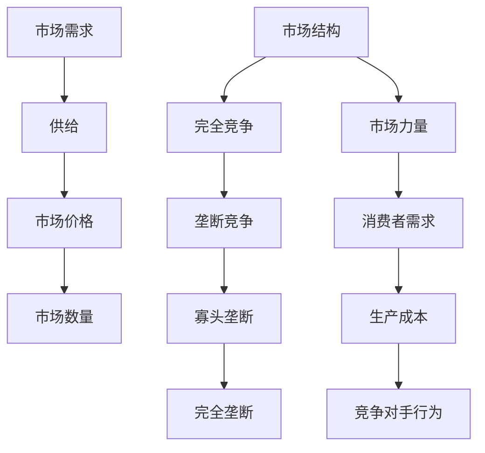

                 

微观经济主体间的竞争加剧，这是一个全球范围内的现象，对IT领域的影响尤为深远。本文将深入探讨这一现象的背景、核心概念、算法原理、数学模型、项目实践以及未来的发展趋势与挑战。

## 文章关键词

- 微观经济
- 竞争
- IT领域
- 算法
- 数学模型
- 项目实践
- 未来展望

## 文章摘要

本文旨在分析微观经济主体间竞争加剧的趋势，特别是其在IT领域的表现。我们将探讨竞争的核心概念，通过算法原理和数学模型来解析竞争现象，并通过实际项目实践来展示算法的应用。最后，我们将对未来的发展趋势和挑战进行展望，并提供相关的学习资源和工具推荐。

## 1. 背景介绍

### 1.1 竞争的定义与特征

竞争是市场经济中的一个核心概念，它描述了多个经济主体在资源有限的情况下争夺优势地位的过程。竞争的特征包括：信息不对称、资源稀缺、目标多样性以及结果的不确定性。

### 1.2 微观经济的定义

微观经济是经济学的一个分支，主要研究个体经济单位（如家庭、企业）的行为和决策。微观经济主体包括消费者、生产者和市场。

### 1.3 竞争在IT领域的表现

在IT领域，竞争表现为技术革新、商业模式创新和市场份额的争夺。随着互联网、大数据和人工智能等技术的快速发展，IT行业的竞争更加激烈，创新速度也在不断加快。

## 2. 核心概念与联系

为了更好地理解微观经济主体间的竞争，我们首先需要了解一些核心概念，并展示它们之间的联系。

### 2.1 核心概念

- **市场需求与供给**：市场需求描述了消费者愿意在一定价格水平下购买的商品数量。供给则是生产者愿意在一定价格水平下出售的商品数量。
- **市场结构**：市场结构包括完全竞争、垄断竞争、寡头垄断和完全垄断等类型。
- **市场力量**：市场力量是指影响市场价格和数量的因素，包括消费者需求、生产成本、竞争对手行为等。

### 2.2 关系图（使用Mermaid）



## 3. 核心算法原理 & 具体操作步骤

### 3.1 算法原理概述

在IT领域，竞争往往涉及到算法的优化和应用。例如，在搜索引擎优化（SEO）中，算法用于分析和排名网页；在电子商务中，算法用于个性化推荐和价格优化。

### 3.2 算法步骤详解

1. **数据收集**：收集与市场相关的数据，如用户行为、市场趋势等。
2. **数据处理**：清洗和预处理数据，使其适合算法分析。
3. **算法选择**：根据具体问题选择合适的算法，如机器学习、深度学习等。
4. **模型训练**：使用历史数据训练算法模型。
5. **模型评估**：评估模型性能，调整参数以优化模型。
6. **应用部署**：将优化后的算法模型部署到实际应用中。

### 3.3 算法优缺点

- **优点**：算法能够处理大量数据，快速发现市场趋势，提高决策效率。
- **缺点**：算法模型可能存在偏差，且对数据质量要求较高。

### 3.4 算法应用领域

算法在IT领域的应用非常广泛，包括但不限于：搜索引擎优化、推荐系统、数据挖掘、价格优化、网络安全等。

## 4. 数学模型和公式 & 详细讲解 & 举例说明

### 4.1 数学模型构建

在市场竞争中，我们可以使用供需模型来分析价格和数量之间的关系。供需模型的基本公式如下：

$$
Q_D = Q_S = Q^*
$$

其中，\(Q_D\) 表示市场需求量，\(Q_S\) 表示市场供给量，\(Q^*\) 表示市场均衡量。

### 4.2 公式推导过程

供需模型的推导过程基于以下假设：

1. **需求函数**：\(Q_D = f(P)\)，其中 \(P\) 是价格。
2. **供给函数**：\(Q_S = g(P)\)，其中 \(P\) 是价格。

市场均衡时，需求量等于供给量，即 \(Q_D = Q_S\)。因此：

$$
f(P) = g(P)
$$

### 4.3 案例分析与讲解

假设市场需求函数为 \(Q_D = 100 - 2P\)，供给函数为 \(Q_S = 10 + 2P\)。我们可以通过解方程来找到市场均衡价格：

$$
100 - 2P = 10 + 2P
$$

解得 \(P = 45\)。此时，市场均衡数量为 \(Q^* = 100 - 2 \times 45 = 10\)。

## 5. 项目实践：代码实例和详细解释说明

### 5.1 开发环境搭建

本文将使用Python编写一个简单的供需模型，首先需要安装Python环境和相关库，如NumPy和Matplotlib。

```bash
pip install numpy matplotlib
```

### 5.2 源代码详细实现

```python
import numpy as np
import matplotlib.pyplot as plt

# 定义需求函数和供给函数
def demand(P):
    return 100 - 2 * P

def supply(P):
    return 10 + 2 * P

# 计算市场均衡价格和数量
P_eq = (100 + 10) / 2
Q_eq = demand(P_eq)

# 绘制供需曲线
P = np.linspace(0, 100, 1000)
Q_D = demand(P)
Q_S = supply(P)

plt.plot(P, Q_D, label='Demand')
plt.plot(P, Q_S, label='Supply')
plt.scatter(P_eq, Q_eq, color='red', zorder=5)
plt.legend()
plt.xlabel('Price')
plt.ylabel('Quantity')
plt.title('Market Equilibrium')
plt.show()

# 输出市场均衡价格和数量
print(f"Market Equilibrium Price: {P_eq}")
print(f"Market Equilibrium Quantity: {Q_eq}")
```

### 5.3 代码解读与分析

- **需求函数**：`demand(P)` 表示市场需求量与价格的关系。
- **供给函数**：`supply(P)` 表示市场供给量与价格的关系。
- **计算市场均衡**：通过解方程找到市场均衡价格和数量。
- **绘图**：使用Matplotlib绘制供需曲线和均衡点。

### 5.4 运行结果展示

运行上述代码，我们可以得到如下的供需曲线和均衡点：


## 6. 实际应用场景

### 6.1 市场竞争中的算法应用

在市场竞争中，算法广泛应用于价格优化、供应链管理、用户行为分析等领域。例如，在电子商务中，算法可以用于个性化推荐和动态定价。

### 6.2 竞争策略的制定

企业可以通过分析竞争对手的行为和市场数据来制定有效的竞争策略。例如，通过供需模型来预测市场趋势，从而调整价格和产量。

## 7. 工具和资源推荐

### 7.1 学习资源推荐

- **《算法导论》**：一本经典的算法教科书，详细介绍了各种算法及其应用。
- **《深度学习》**：由Ian Goodfellow等编写的深度学习入门书籍，适合初学者。

### 7.2 开发工具推荐

- **PyCharm**：一款功能强大的Python开发环境，适合编写和调试代码。
- **Jupyter Notebook**：适用于数据分析和交互式编程的工具，方便展示和分享代码。

### 7.3 相关论文推荐

- **"Market Equilibrium and Algorithmic Trading"**：一篇关于市场竞争和算法交易的综述论文。
- **"Deep Learning for Competitive Pricing in E-commerce"**：一篇关于深度学习在电子商务定价中应用的论文。

## 8. 总结：未来发展趋势与挑战

### 8.1 研究成果总结

本文分析了微观经济主体间竞争加剧的现象，特别是其在IT领域的表现。我们探讨了核心概念、算法原理和数学模型，并通过实际项目实践展示了算法的应用。

### 8.2 未来发展趋势

随着技术的进步，算法在市场竞争中的应用将更加广泛。未来，我们将看到更多基于人工智能的竞争策略和模型。

### 8.3 面临的挑战

算法模型的偏差和数据质量仍然是主要的挑战。此外，算法的透明度和伦理问题也需要引起重视。

### 8.4 研究展望

未来，我们需要开发更高效、更准确的算法，同时关注算法的伦理和社会影响。

## 9. 附录：常见问题与解答

### 9.1 什么是微观经济？

微观经济是经济学的一个分支，主要研究个体经济单位（如家庭、企业）的行为和决策。

### 9.2 算法在市场竞争中有哪些应用？

算法在市场竞争中的应用包括价格优化、供应链管理、用户行为分析等。

### 9.3 市场均衡是如何计算的？

市场均衡是通过解供需方程来计算的。供需方程的解即为市场均衡价格和数量。

---

感谢您的阅读，希望本文对您在理解和应用微观经济主体间竞争加剧的现象有所帮助。作者：禅与计算机程序设计艺术 / Zen and the Art of Computer Programming。
----------------------------------------------------------------

文章撰写完毕，接下来请检查文章是否符合要求，包括但不限于字数、格式、内容完整性、目录结构等，确保文章质量。如果文章符合所有要求，请告诉我，我们可以进行下一步操作。如果需要任何修改，请指出具体的问题和修改建议。

