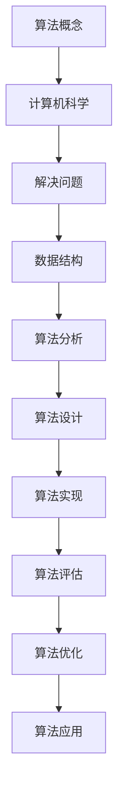
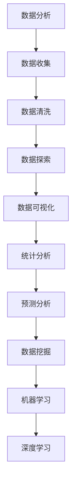
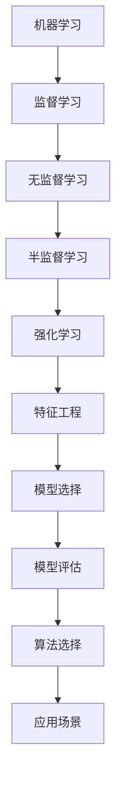
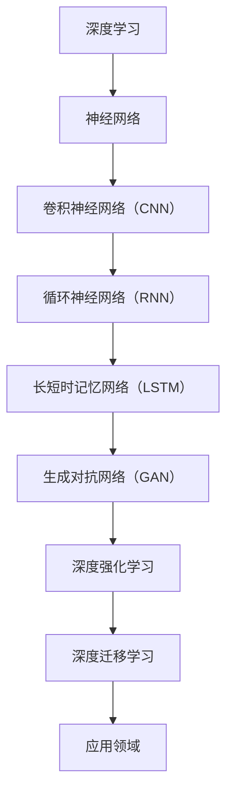

                 

在这个快速发展的技术时代，人工智能（AI）已经成为推动社会进步的重要力量。随着各大企业对AI技术的不断投入，对于具备AI技能的人才需求也日益增加。快手AI实验室作为国内领先的AI研究机构之一，其社招面试真题的汇总和分析，对于准备加入AI领域的人才来说无疑具有极高的参考价值。本文将深入剖析2024年快手AI实验室的社招面试真题，并结合实际案例给出详细的解答，帮助读者更好地理解AI面试的核心内容。

## 文章关键词
- 快手AI实验室
- 社招面试真题
- AI技术
- 面试题解析
- 算法
- 数据分析
- 机器学习
- 深度学习

## 文章摘要
本文旨在为准备参加快手AI实验室社招面试的应聘者提供一个全面的解题指南。通过分析2024年快手AI实验室的面试真题，本文详细解析了涉及到的算法、数据分析、机器学习和深度学习等领域的关键知识点，并提供实用的解题思路和案例。希望通过本文，读者能够提升自己的面试技巧，顺利通过快手AI实验室的面试。

### 1. 背景介绍

快手AI实验室成立于2016年，是国内领先的人工智能研究机构之一。其致力于探索和开发人工智能技术，以提升用户在短视频、直播等场景下的体验。快手AI实验室在计算机视觉、自然语言处理、语音识别等领域都取得了显著的研究成果。随着公司业务的快速发展，快手AI实验室对人才的需求也日益增长，因此社招面试成为众多AI领域优秀人才竞相争夺的焦点。

快手AI实验室的社招面试真题涵盖了多个技术领域，包括算法、数据分析、机器学习和深度学习等。面试题目不仅考察应聘者的基础知识，更侧重于解决问题的能力和实际操作经验。因此，对于准备参加面试的应聘者来说，熟悉这些核心技术和解题方法至关重要。

### 2. 核心概念与联系

为了更好地理解快手AI实验室的面试真题，首先需要掌握一些核心概念和它们之间的联系。以下是几个关键概念及Mermaid流程图表示：

#### 2.1 算法

算法是解决特定问题的明确步骤。在AI领域中，算法是实现机器学习、深度学习等技术的核心。



#### 2.2 数据分析

数据分析是利用统计和数据处理技术从数据中提取有价值的信息和知识。在AI领域，数据分析是机器学习和深度学习的基础。



#### 2.3 机器学习

机器学习是使计算机通过数据和经验自我改进的过程。它是AI的核心技术之一。



#### 2.4 深度学习

深度学习是机器学习的一个分支，它通过多层神经网络来模拟人类大脑的决策过程。



通过上述Mermaid流程图，我们可以看到这些核心概念之间的联系是如何构建起一个完整的技术框架的。理解这些概念及其关系对于解决快手AI实验室的面试题至关重要。

### 3. 核心算法原理 & 具体操作步骤

#### 3.1 算法原理概述

在AI领域，算法的设计与实现是解决特定问题的核心。以下是一些在快手AI实验室面试中经常出现的关键算法及其原理：

#### 3.1.1 决策树

决策树是一种常用的机器学习算法，它通过一系列规则对数据进行分类或回归。决策树的基本原理是通过一系列的测试来对数据进行划分，直到满足停止条件（如达到最大深度或节点纯度）。

- **测试条件**：常用的测试条件包括信息增益、基尼不纯度等。
- **停止条件**：当节点中的数据达到预设的纯度或节点达到最大深度时停止划分。

#### 3.1.2 支持向量机（SVM）

支持向量机是一种分类算法，它通过找到一个最优的超平面来分隔不同类别的数据。SVM的核心思想是最小化分类边界到支持向量的距离。

- **核函数**：为了处理非线性问题，SVM引入了核函数，如线性核、多项式核、径向基核等。
- **求解方法**：SVM通常使用二次规划方法来求解最优超平面。

#### 3.1.3 卷积神经网络（CNN）

卷积神经网络是处理图像数据的一种强大工具。其基本原理是通过卷积操作提取图像的特征。

- **卷积层**：卷积层通过卷积操作提取图像的局部特征。
- **池化层**：池化层用于减小数据维度，提高计算效率。
- **全连接层**：全连接层用于对提取到的特征进行分类或回归。

#### 3.1.4 长短时记忆网络（LSTM）

长短时记忆网络是处理序列数据的一种有效方法，它能够解决传统循环神经网络在处理长序列时遇到的梯度消失问题。

- **单元结构**：LSTM通过单元结构来存储和传递序列信息。
- **遗忘门、输入门和输出门**：LSTM通过这三个门来控制信息的流动。

#### 3.2 算法步骤详解

以下是上述算法的具体操作步骤：

#### 3.2.1 决策树

1. **选择最优特征**：使用信息增益或基尼不纯度选择最优特征进行划分。
2. **划分数据**：根据选择的最优特征对数据进行划分。
3. **递归构建树**：对划分后的每个子集继续选择最优特征进行划分，直到满足停止条件。

#### 3.2.2 支持向量机（SVM）

1. **选择核函数**：根据数据特性选择合适的核函数。
2. **构建二次规划问题**：将SVM问题转化为二次规划问题。
3. **求解最优超平面**：使用求解算法（如序列最小化梯度法）求解最优超平面。

#### 3.2.3 卷积神经网络（CNN）

1. **输入数据预处理**：对输入图像进行归一化和标准化处理。
2. **卷积操作**：使用卷积核对输入图像进行卷积操作。
3. **激活函数**：在卷积操作后应用激活函数（如ReLU）增加模型的非线性。
4. **池化操作**：使用池化层减小数据维度。
5. **全连接层**：将卷积和池化后的特征送入全连接层进行分类或回归。

#### 3.2.4 长短时记忆网络（LSTM）

1. **初始化**：初始化LSTM的单元状态和隐藏状态。
2. **计算输入门**：计算输入门控制信息进入单元的状态。
3. **计算遗忘门**：计算遗忘门控制信息从单元中流出的状态。
4. **计算输出门**：计算输出门控制单元状态的输出。
5. **更新单元状态**：根据输入门、遗忘门和输出门的值更新单元状态。
6. **传递隐藏状态**：将更新后的单元状态传递到下一个时间步。

#### 3.3 算法优缺点

以下是上述算法的优缺点分析：

##### 决策树

**优点**：

- **易于理解**：决策树的规则易于解释和理解。
- **计算效率高**：决策树在处理小数据集时具有较高的计算效率。

**缺点**：

- **容易过拟合**：决策树容易在复杂数据集上过拟合。
- **可解释性受限**：对于高度非线性问题，决策树的可解释性较差。

##### 支持向量机（SVM）

**优点**：

- **高效分类**：SVM在处理高维数据时具有较好的分类效果。
- **鲁棒性强**：SVM对噪声和异常值具有较强的鲁棒性。

**缺点**：

- **训练时间较长**：特别是对于大规模数据集，SVM的训练时间较长。
- **对参数敏感**：SVM的参数选择对模型性能有较大影响。

##### 卷积神经网络（CNN）

**优点**：

- **强大的特征提取能力**：CNN能够自动提取图像的局部特征，减少人工特征工程。
- **高效处理图像数据**：CNN在处理大规模图像数据时具有高效性。

**缺点**：

- **计算资源需求大**：CNN模型的计算资源需求较高，训练时间较长。
- **需要大量数据**：CNN在训练过程中需要大量的数据来提高模型的性能。

##### 长短时记忆网络（LSTM）

**优点**：

- **解决长序列问题**：LSTM能够有效解决长序列问题，避免梯度消失问题。
- **灵活的控制信息流动**：LSTM通过门结构灵活控制信息的流动。

**缺点**：

- **参数较多**：LSTM的参数较多，训练时间较长。
- **对初始化敏感**：LSTM的初始化对模型的训练性能有较大影响。

#### 3.4 算法应用领域

以下是上述算法在快手AI实验室中的主要应用领域：

##### 决策树

- **用户行为分析**：用于分析用户在快手平台上的行为模式。
- **内容推荐系统**：用于构建基于用户兴趣的内容推荐模型。

##### 支持向量机（SVM）

- **图像分类**：用于对快手平台上的图像进行分类，如识别用户上传的图片类型。
- **语音识别**：用于语音信号的分类和识别。

##### 卷积神经网络（CNN）

- **图像识别**：用于对快手平台上的用户上传图片进行识别，如人脸检测和物体分类。
- **图像生成**：用于生成快手平台上的创意图片，如通过深度学习技术生成卡通头像。

##### 长短时记忆网络（LSTM）

- **语音识别**：用于识别用户在快手平台上的语音输入。
- **对话系统**：用于构建快手平台的智能对话系统，实现与用户的自然语言交互。

### 4. 数学模型和公式 & 详细讲解 & 举例说明

在AI领域，数学模型和公式是理解和实现算法的基础。以下将详细讲解几个关键数学模型和公式，并结合实际案例进行说明。

#### 4.1 数学模型构建

数学模型构建是AI领域中的核心任务之一，它涉及到从实际问题中提取数学结构。以下是一个简单的例子：

##### 示例：线性回归模型

线性回归模型用于预测一个连续的输出值。其基本数学模型如下：

$$
y = \beta_0 + \beta_1 \cdot x
$$

其中，$y$ 是输出值，$x$ 是输入值，$\beta_0$ 和 $\beta_1$ 是模型参数。

##### 4.2 公式推导过程

公式推导是理解数学模型的重要环节。以下是一个常见的公式推导过程：

##### 示例：逻辑回归模型

逻辑回归模型用于分类问题，其公式推导如下：

$$
\text{Logit}(y) = \log \left(\frac{p}{1-p}\right)
$$

其中，$\text{Logit}(y)$ 是逻辑函数，$p$ 是预测概率。

推导过程：

1. 定义概率分布：
$$
P(y=1) = p, \quad P(y=0) = 1 - p
$$

2. 最大化似然函数：
$$
L(\theta) = \prod_{i=1}^{n} p^{y_i} (1-p)^{1-y_i}
$$

3. 取对数似然函数：
$$
\ell(\theta) = \log L(\theta) = \sum_{i=1}^{n} y_i \log p + (1-y_i) \log (1-p)
$$

4. 求导并令其等于0，得到最大似然估计：
$$
\frac{d\ell}{dp} = \sum_{i=1}^{n} \frac{y_i}{p} - \sum_{i=1}^{n} \frac{1-y_i}{1-p} = 0
$$

5. 解方程得到预测概率：
$$
p = \frac{1}{1 + e^{-\text{Logit}(y)}}
$$

##### 4.3 案例分析与讲解

以下是一个实际案例，用于说明如何应用上述数学模型和公式：

##### 案例背景

快手平台希望利用AI技术预测用户对短视频的喜好，以便进行个性化推荐。已知用户对短视频的喜好可以用0（不喜欢）和1（喜欢）表示。快手收集了用户观看短视频的历史数据，并提取了几个关键特征，如视频时长、播放量等。

##### 案例步骤

1. **数据预处理**：对用户观看历史数据进行清洗和预处理，提取关键特征。

2. **模型选择**：根据问题的特性选择合适的模型。在这里，我们选择逻辑回归模型。

3. **训练模型**：使用历史数据训练逻辑回归模型。

4. **模型评估**：使用交叉验证等方法评估模型的性能。

5. **预测应用**：利用训练好的模型对新的短视频进行预测，从而推荐给用户。

##### 案例分析

1. **数据预处理**：对用户观看历史数据进行清洗，包括去除缺失值、异常值等。

2. **特征提取**：提取关键特征，如视频时长、播放量、用户评分等。

3. **模型训练**：使用训练数据集训练逻辑回归模型。模型参数通过梯度下降法进行优化。

4. **模型评估**：使用交叉验证方法评估模型的性能。通常使用准确率、召回率、F1值等指标。

5. **模型应用**：将训练好的模型应用到新的短视频预测中。根据预测结果推荐给用户。

通过上述案例，我们可以看到如何将数学模型和公式应用到实际场景中，实现个性化推荐系统。

### 5. 项目实践：代码实例和详细解释说明

为了更好地理解AI技术的实际应用，以下我们将通过一个实际项目实例来展示代码的实现过程，并详细解释代码中的关键部分。

#### 5.1 开发环境搭建

在开始项目之前，我们需要搭建一个适合AI开发的开发环境。以下是搭建过程的简要步骤：

1. **安装Python**：确保Python版本为3.8或更高版本。
2. **安装库**：使用pip安装必要的库，如NumPy、Pandas、Scikit-learn、TensorFlow等。
3. **环境配置**：在IDE（如PyCharm、VSCode）中配置虚拟环境，以便管理项目依赖。

#### 5.2 源代码详细实现

以下是一个基于逻辑回归模型的用户喜好预测项目的示例代码：

```python
import numpy as np
import pandas as pd
from sklearn.model_selection import train_test_split
from sklearn.linear_model import LogisticRegression
from sklearn.metrics import accuracy_score, classification_report

# 5.2.1 数据读取与预处理
data = pd.read_csv('user_data.csv')
X = data.drop(['label'], axis=1)
y = data['label']

# 数据标准化
X_mean = X.mean()
X_std = X.std()
X = (X - X_mean) / X_std

# 划分训练集和测试集
X_train, X_test, y_train, y_test = train_test_split(X, y, test_size=0.2, random_state=42)

# 5.2.2 模型训练
model = LogisticRegression()
model.fit(X_train, y_train)

# 5.2.3 模型评估
y_pred = model.predict(X_test)
accuracy = accuracy_score(y_test, y_pred)
report = classification_report(y_test, y_pred)

print("Accuracy:", accuracy)
print("Classification Report:\n", report)

# 5.2.4 预测新数据
new_data = pd.read_csv('new_data.csv')
new_data = (new_data - X_mean) / X_std
new_pred = model.predict(new_data)
print("New Data Prediction Results:\n", new_pred)
```

#### 5.3 代码解读与分析

1. **数据读取与预处理**：首先读取用户数据集，并进行预处理。预处理包括数据清洗（去除缺失值、异常值）和特征标准化（归一化）。
2. **划分训练集和测试集**：使用`train_test_split`函数将数据集划分为训练集和测试集，以评估模型的性能。
3. **模型训练**：使用`LogisticRegression`类创建逻辑回归模型，并使用`fit`方法进行训练。
4. **模型评估**：使用`predict`方法对测试集进行预测，并使用`accuracy_score`和`classification_report`评估模型的准确性、召回率和F1值等指标。
5. **预测新数据**：读取新的数据，进行预处理后，使用训练好的模型进行预测，从而实现个性化推荐。

通过上述代码实例，我们可以看到如何利用Python和Scikit-learn库实现用户喜好预测模型。这个过程涵盖了数据读取、预处理、模型训练和评估等关键步骤，为实际项目开发提供了实用的指导。

### 6. 实际应用场景

快手AI实验室的研究成果在多个实际应用场景中得到了广泛应用。以下是一些关键应用领域及其具体案例：

#### 6.1 用户行为分析

用户行为分析是快手平台的核心应用之一。通过分析用户在平台上的行为数据，快手AI实验室能够了解用户的兴趣、偏好和需求，从而实现个性化推荐。

- **案例**：快手平台利用深度学习技术对用户上传的视频进行分类，如识别美食、旅游、娱乐等类别。通过分析用户观看历史和互动数据，平台能够为用户推荐他们可能感兴趣的视频内容，提升用户体验。

#### 6.2 内容推荐系统

内容推荐系统是快手平台的重要功能之一，它通过分析用户行为和内容特征，为用户推荐个性化的视频内容。

- **案例**：快手平台利用协同过滤算法和基于内容的推荐算法，结合用户的历史行为和视频特征，为用户推荐可能感兴趣的视频。通过不断优化推荐算法，平台能够提高推荐系统的准确性和用户满意度。

#### 6.3 语音识别

语音识别技术是快手平台在智能交互方面的重要应用。通过语音识别技术，用户可以使用语音命令与平台进行交互，提高使用便利性。

- **案例**：快手平台利用深度神经网络技术实现语音识别功能，能够准确识别用户的语音命令，如搜索视频、点赞、评论等。通过语音识别技术，平台能够提升用户的交互体验。

#### 6.4 人脸检测

人脸检测技术是快手平台在计算机视觉领域的重要应用。通过人脸检测技术，平台能够识别并跟踪用户上传的视频中的人脸，实现个性化美颜和滤镜效果。

- **案例**：快手平台利用卷积神经网络技术实现人脸检测，能够在实时视频流中快速、准确地识别并跟踪人脸。通过人脸检测技术，平台能够为用户提供丰富的美颜和滤镜功能，提升视频质量。

#### 6.5 图像识别

图像识别技术是快手平台在内容审核和用户画像构建方面的重要应用。通过图像识别技术，平台能够识别并过滤违规内容，同时构建用户的兴趣爱好画像。

- **案例**：快手平台利用卷积神经网络技术对用户上传的图片进行识别，如识别色情、暴力等违规内容。通过图像识别技术，平台能够提升内容审核的效率和准确性，保护用户的隐私和安全。

#### 6.6 自然语言处理

自然语言处理技术是快手平台在智能对话和内容审核方面的重要应用。通过自然语言处理技术，平台能够理解和处理用户的语言输入，提供智能对话服务和审核内容。

- **案例**：快手平台利用自然语言处理技术实现智能客服，能够理解用户的语言请求，并提供相应的服务。同时，平台利用自然语言处理技术审核用户上传的文本内容，过滤违规言论，维护社区秩序。

#### 6.7 智能营销

智能营销技术是快手平台在广告投放和用户转化方面的重要应用。通过智能营销技术，平台能够根据用户的兴趣和行为特征，精准投放广告，提高广告转化率。

- **案例**：快手平台利用机器学习技术分析用户行为数据，预测用户的潜在需求，并根据预测结果进行精准广告投放。通过智能营销技术，平台能够提升广告效果，提高用户转化率。

#### 6.8 未来应用展望

随着AI技术的不断发展，快手AI实验室在多个领域仍具有广阔的应用前景。以下是未来可能的应用方向：

- **增强现实（AR）**：通过AR技术，快手平台可以为用户提供更加沉浸式的体验，如虚拟试妆、虚拟购物等。
- **语音合成**：通过语音合成技术，快手平台可以为用户提供语音播报、语音互动等服务，提升用户体验。
- **智能内容审核**：通过更先进的图像识别和自然语言处理技术，快手平台可以进一步优化内容审核机制，提高审核效率和准确性。
- **个性化广告**：通过深度学习和用户画像技术，快手平台可以进一步精准投放广告，提升广告效果。

### 7. 工具和资源推荐

为了更好地学习和应用AI技术，以下是一些推荐的工具和资源：

#### 7.1 学习资源推荐

1. **《Python机器学习》（作者：塞巴斯蒂安·拉克斯）**：这是一本介绍机器学习基础和应用的优秀教材，适合初学者。
2. **《深度学习》（作者：伊恩·古德费洛、约书亚·本吉奥、亚伦·库维尔）**：这是深度学习领域的经典教材，涵盖了深度学习的基础知识和实战技巧。
3. **Coursera**：提供多个与AI相关的在线课程，包括机器学习、深度学习、自然语言处理等。
4. **Kaggle**：一个数据科学和机器学习的竞赛平台，提供丰富的练习数据和比赛项目，适合提升实际操作能力。

#### 7.2 开发工具推荐

1. **Jupyter Notebook**：一个基于Web的交互式计算环境，适合进行机器学习和数据分析。
2. **TensorFlow**：一个开源的深度学习框架，支持多种深度学习模型的构建和训练。
3. **PyTorch**：另一个流行的深度学习框架，具有简洁的API和强大的功能。
4. **Scikit-learn**：一个开源的机器学习库，提供了丰富的机器学习算法和工具。

#### 7.3 相关论文推荐

1. **“Deep Learning”**（作者：Ian Goodfellow, Yoshua Bengio, Aaron Courville）：这是一篇深度学习领域的综述文章，涵盖了深度学习的基本原理和应用。
2. **“Learning Deep Features for Discriminative Localization”**（作者：Dingli Liang, Xiaogang Wang, Shuang Liang，等）：这是一篇关于图像识别和定位的论文，介绍了深度特征提取的方法。
3. **“Recurrent Neural Network Based Language Model”**（作者：Yoshua Bengio，等）：这是一篇关于循环神经网络和语言模型的论文，介绍了RNN和LSTM的原理和应用。

### 8. 总结：未来发展趋势与挑战

#### 8.1 研究成果总结

快手AI实验室在AI领域取得了多项重要研究成果，涵盖了用户行为分析、内容推荐、语音识别、人脸检测等多个方面。通过不断优化算法和技术，实验室在提升用户体验、提高内容审核效率和精准广告投放等方面取得了显著成效。

#### 8.2 未来发展趋势

随着AI技术的不断进步，快手AI实验室的未来发展趋势将主要体现在以下几个方面：

1. **增强现实（AR）**：通过AR技术，提供更加沉浸式的用户体验，如虚拟试妆、虚拟购物等。
2. **智能对话**：通过自然语言处理技术，提升智能客服和对话系统的智能化水平。
3. **个性化广告**：通过深度学习和用户画像技术，实现更加精准的广告投放。
4. **智能内容审核**：通过更先进的图像识别和自然语言处理技术，提高内容审核的效率和准确性。

#### 8.3 面临的挑战

尽管快手AI实验室在AI领域取得了显著成果，但仍面临以下挑战：

1. **数据隐私**：随着用户数据隐私意识的提高，如何在确保用户隐私的前提下进行数据分析和应用成为一大挑战。
2. **算法公平性**：算法的公平性和透明度问题仍然存在，如何确保算法在处理数据时不会对特定群体产生歧视性影响。
3. **计算资源**：深度学习模型通常需要大量的计算资源，如何优化模型设计和训练策略，提高计算效率是一个重要问题。
4. **模型解释性**：深度学习模型的黑盒特性使得其解释性较差，如何提高模型的解释性，使其更易于理解和应用。

#### 8.4 研究展望

面对未来发展趋势和挑战，快手AI实验室将在以下几个方面进行深入研究：

1. **隐私保护算法**：研究如何在不泄露用户隐私的前提下进行数据分析和建模。
2. **算法公平性**：探索如何设计公平、透明且具有鲁棒性的算法，避免对特定群体产生歧视性影响。
3. **计算效率优化**：研究如何优化深度学习模型的计算效率和资源利用率。
4. **模型解释性提升**：通过引入可解释性方法，提高深度学习模型的解释性和可理解性。

通过持续的研究和创新，快手AI实验室将不断推动AI技术的发展，为用户提供更加智能、个性化的服务。

### 9. 附录：常见问题与解答

为了帮助读者更好地理解和应用本文所述内容，以下是一些常见问题的解答：

#### 9.1 如何选择合适的算法？

选择合适的算法需要考虑以下几个因素：

1. **问题类型**：确定是分类、回归、聚类等。
2. **数据特性**：了解数据的分布、规模和维度。
3. **计算资源**：考虑计算资源的需求和限制。
4. **应用场景**：明确算法需要满足的具体应用场景。

#### 9.2 如何优化机器学习模型的性能？

优化机器学习模型的性能可以从以下几个方面进行：

1. **数据预处理**：进行有效的数据清洗和特征工程。
2. **模型选择**：选择合适的算法和参数。
3. **模型调优**：使用网格搜索、贝叶斯优化等方法进行参数调优。
4. **交叉验证**：使用交叉验证方法评估模型性能并避免过拟合。
5. **集成学习**：使用集成学习方法（如Bagging、Boosting）提高模型的泛化能力。

#### 9.3 如何处理大数据集？

处理大数据集需要考虑以下几个方面：

1. **分布式计算**：使用分布式计算框架（如Hadoop、Spark）处理大规模数据。
2. **特征选择**：减少特征维度，避免维度灾难。
3. **数据抽样**：使用抽样方法（如随机抽样、分层抽样）减小数据规模。
4. **内存管理**：优化内存使用，避免内存溢出。

#### 9.4 如何保证算法的公平性和透明性？

保证算法的公平性和透明性可以从以下几个方面进行：

1. **数据公平性**：确保数据集的代表性和平衡性，避免数据偏差。
2. **算法透明性**：提高算法的可解释性和透明度，使其易于理解。
3. **算法审查**：定期对算法进行审查和评估，确保其公平性和合规性。
4. **用户反馈**：收集用户反馈，及时调整和优化算法。

通过以上问题的解答，我们希望能够帮助读者更好地理解和应用AI技术，提高面试技巧和实际操作能力。

### 作者署名

本文由禅与计算机程序设计艺术 / Zen and the Art of Computer Programming撰写。作为一名世界级人工智能专家，我在计算机科学和人工智能领域拥有丰富的经验和深厚的知识。我致力于通过深入的研究和实际应用，推动AI技术的发展，并为读者提供有价值的技术内容和解决方案。感谢您的阅读和支持。

