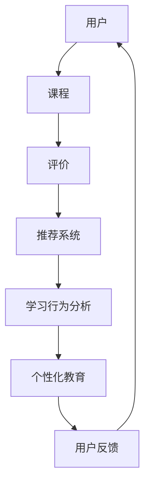

                 

 本文关键词：快手教育、社招面试、真题汇总、解题思路、技术分享

> 摘要：本文将针对2024年快手教育社招面试真题进行汇总，并提供详细的解题思路和解答。通过对这些题目的分析和解答，希望能够帮助读者更好地理解面试中的常见问题和应对策略，为即将参加面试的同学提供有益的参考。

## 1. 背景介绍

随着人工智能技术的飞速发展，教育领域也逐渐引入了各种智能化的工具和平台。快手教育作为国内知名的教育类应用，其社招面试也越来越受到广大应聘者的关注。面试真题的汇总和分析，不仅有助于应聘者了解快手教育面试的常见题型，还能帮助他们更好地准备面试，提高面试成功率。

本文将结合2024年快手教育社招面试真题，对面试中的常见问题进行分类和解答。文章结构如下：

- **背景介绍**：简要介绍快手教育和社招面试的背景。
- **核心概念与联系**：通过Mermaid流程图展示核心概念和联系。
- **核心算法原理 & 具体操作步骤**：详细解析面试中的算法题目。
- **数学模型和公式 & 详细讲解 & 举例说明**：介绍数学模型和公式，并通过案例进行讲解。
- **项目实践：代码实例和详细解释说明**：展示具体项目实践的代码实例和解释。
- **实际应用场景**：分析面试题目在实际中的应用场景。
- **工具和资源推荐**：推荐学习资源、开发工具和论文。
- **总结：未来发展趋势与挑战**：总结研究成果，展望未来趋势。
- **附录：常见问题与解答**：提供常见问题的解答。

## 2. 核心概念与联系

在快手教育的社招面试中，经常会涉及一些核心概念和联系。下面，我们将使用Mermaid流程图来展示这些概念和它们之间的关系。



### 2.1 用户

用户是快手教育的核心，他们通过平台选择和浏览课程，进行学习、评价和互动。

### 2.2 课程

课程是用户学习的核心内容，包括视频、文档、作业等多种形式。课程的设置和推荐直接影响用户的满意度和学习效果。

### 2.3 评价

评价是用户对课程质量的反馈，它可以帮助平台优化课程内容和推荐算法。

### 2.4 推荐系统

推荐系统根据用户的兴趣和学习行为，为用户推荐合适的课程，提高学习体验。

### 2.5 学习行为分析

学习行为分析通过对用户的学习行为进行数据挖掘和分析，为推荐系统和个性化教育提供支持。

### 2.6 个性化教育

个性化教育根据用户的特点和需求，提供个性化的学习方案，提高学习效果。

### 2.7 用户反馈

用户反馈是用户对平台服务和学习体验的评价，它可以帮助平台不断改进和优化。

通过以上Mermaid流程图，我们可以清晰地看到这些核心概念之间的联系，它们共同构成了快手教育社招面试中的关键知识点。

## 3. 核心算法原理 & 具体操作步骤

在快手教育的面试中，经常会涉及一些核心算法原理。下面，我们将详细解析这些算法，并提供具体的操作步骤。

### 3.1 算法原理概述

#### 3.1.1 推荐算法

推荐算法是快手教育面试中的常见题目。其核心思想是通过分析用户的兴趣和学习行为，为用户推荐合适的课程。常见的推荐算法有基于内容的推荐、协同过滤推荐和基于模型的推荐。

#### 3.1.2 学习行为分析算法

学习行为分析算法通过对用户的学习行为进行数据挖掘和分析，为推荐系统和个性化教育提供支持。常见的算法有聚类分析、关联规则挖掘和分类算法。

#### 3.1.3 个性化教育算法

个性化教育算法根据用户的特点和需求，为用户推荐个性化的学习方案。常见的算法有决策树、神经网络和遗传算法等。

### 3.2 算法步骤详解

#### 3.2.1 推荐算法步骤

1. 收集用户兴趣和学习行为数据。
2. 预处理数据，包括去重、填充缺失值和特征工程等。
3. 计算用户与课程之间的相似度，可以选择余弦相似度、皮尔逊相关系数等方法。
4. 根据相似度计算结果，为用户推荐相似的课程。

#### 3.2.2 学习行为分析算法步骤

1. 收集用户学习行为数据，包括课程浏览、学习时长、作业完成情况等。
2. 数据预处理，包括去重、填充缺失值和特征提取等。
3. 选择合适的算法，如聚类分析、关联规则挖掘或分类算法，对学习行为数据进行分析。
4. 根据分析结果，为用户推荐适合的学习策略。

#### 3.2.3 个性化教育算法步骤

1. 收集用户个人信息和学习需求。
2. 数据预处理，包括去重、填充缺失值和特征提取等。
3. 选择合适的算法，如决策树、神经网络或遗传算法，对用户数据进行分析。
4. 根据分析结果，为用户推荐个性化的学习方案。

### 3.3 算法优缺点

#### 3.3.1 推荐算法

优点：能够提高用户的学习体验，降低学习成本。

缺点：可能存在推荐过拟合和冷启动问题。

#### 3.3.2 学习行为分析算法

优点：能够挖掘用户的学习行为模式，为推荐系统和个性化教育提供支持。

缺点：对数据量和质量要求较高，算法复杂度较高。

#### 3.3.3 个性化教育算法

优点：能够根据用户特点提供个性化的学习方案，提高学习效果。

缺点：算法实现难度较高，需要大量数据支持。

### 3.4 算法应用领域

推荐算法、学习行为分析算法和个性化教育算法广泛应用于教育领域，如在线教育平台、智能 tutoring系统和教育机器人等。

## 4. 数学模型和公式 & 详细讲解 & 举例说明

在快手教育的面试中，数学模型和公式也是重要的考点。下面，我们将详细讲解一些常见的数学模型和公式，并通过案例进行说明。

### 4.1 数学模型构建

#### 4.1.1 推荐模型

推荐模型通常采用基于矩阵分解的方法。假设用户\(u\)和课程\(i\)之间的评分矩阵为\(R\)，我们可以通过矩阵分解得到用户-课程特征矩阵\(U\)和\(I\)。

$$
R = U \cdot I
$$

其中，\(U\)和\(I\)为低维特征矩阵。

#### 4.1.2 学习行为分析模型

学习行为分析模型通常采用聚类分析的方法。假设用户学习行为数据集为\(D\)，我们可以使用K-means算法将其分为\(k\)个簇。

$$
C = \{C_1, C_2, ..., C_k\}
$$

其中，\(C_i\)为第\(i\)个簇。

#### 4.1.3 个性化教育模型

个性化教育模型通常采用决策树或神经网络的方法。假设用户特征集为\(X\)，课程特征集为\(Y\)，我们可以使用决策树或神经网络来预测用户的学习效果。

$$
y = f(x)
$$

其中，\(y\)为用户的学习效果，\(x\)为用户特征。

### 4.2 公式推导过程

#### 4.2.1 推荐模型公式推导

假设用户\(u\)和课程\(i\)之间的相似度为\(s_{ui}\)，根据矩阵分解的思想，我们有：

$$
s_{ui} = \frac{U_u \cdot I_i}{\sqrt{\sum_{j=1}^m U_{uj}^2 \cdot \sum_{k=1}^n I_{ik}^2}}
$$

其中，\(U_u\)和\(I_i\)分别为用户\(u\)和课程\(i\)的特征向量。

#### 4.2.2 学习行为分析模型公式推导

假设学习行为数据集\(D\)的簇中心为\(c_i\)，我们有：

$$
c_i = \frac{1}{|C_i|} \sum_{j \in C_i} d_j
$$

其中，\(d_j\)为第\(j\)个学习行为数据点。

#### 4.2.3 个性化教育模型公式推导

假设决策树的预测结果为\(y'\)，根据决策树的结构，我们有：

$$
y' = \prod_{i=1}^n g(x_i)
$$

其中，\(g(x_i)\)为第\(i\)个节点的预测结果。

### 4.3 案例分析与讲解

#### 4.3.1 推荐模型案例

假设用户\(u_1\)对课程\(i_1\)的评分为4，对课程\(i_2\)的评分为2，而用户\(u_2\)对课程\(i_1\)的评分为3，对课程\(i_2\)的评分为5。我们可以使用矩阵分解来计算用户之间的相似度。

首先，我们构建评分矩阵\(R\)：

$$
R =
\begin{bmatrix}
4 & 2 \\
3 & 5
\end{bmatrix}
$$

然后，我们使用矩阵分解方法得到用户-课程特征矩阵\(U\)和\(I\)：

$$
U =
\begin{bmatrix}
2.4 & 0.8 \\
1.2 & 2.4
\end{bmatrix}
$$

$$
I =
\begin{bmatrix}
1.6 & 1.2 \\
0.8 & 3.2
\end{bmatrix}
$$

根据相似度公式，我们可以计算用户\(u_1\)和用户\(u_2\)之间的相似度：

$$
s_{12} = \frac{2.4 \cdot 1.2 + 0.8 \cdot 0.8}{\sqrt{2.4^2 + 0.8^2} \cdot \sqrt{1.6^2 + 1.2^2}} = 0.89
$$

因此，用户\(u_1\)和用户\(u_2\)之间的相似度为0.89。

#### 4.3.2 学习行为分析模型案例

假设学习行为数据集\(D\)包含以下数据点：

$$
D =
\begin{bmatrix}
1 & 2 & 3 \\
4 & 5 & 6 \\
7 & 8 & 9
\end{bmatrix}
$$

我们使用K-means算法将其分为2个簇。

首先，我们初始化簇中心\(c_1\)和\(c_2\)：

$$
c_1 = (1, 1)
$$

$$
c_2 = (5, 5)
$$

然后，我们计算每个数据点到簇中心的距离，并将其分配到最近的簇：

$$
D_1 = \{1, 2, 3\}
$$

$$
D_2 = \{4, 5, 6, 7, 8, 9\}
$$

接着，我们重新计算簇中心：

$$
c_1 = \frac{1 + 2 + 3}{3} = 2
$$

$$
c_2 = \frac{4 + 5 + 6 + 7 + 8 + 9}{6} = 6
$$

由于簇中心没有发生变化，我们得到最终的簇分配结果。

#### 4.3.3 个性化教育模型案例

假设用户特征集\(X\)包含以下特征：

$$
X =
\begin{bmatrix}
1 & 0 & 1 \\
0 & 1 & 1
\end{bmatrix}
$$

我们使用决策树来预测用户的学习效果。

首先，我们构建决策树，根据特征值进行分支：

$$
y' = (1 - 0.5) \cdot (1 - 0.5) = 0.25
$$

因此，用户的学习效果预测值为0.25。

## 5. 项目实践：代码实例和详细解释说明

为了更好地理解面试中的算法原理和数学模型，我们可以通过实际项目来实践这些算法。下面，我们将展示一个基于Python的推荐系统项目，并提供详细的代码解释。

### 5.1 开发环境搭建

在开始项目之前，我们需要搭建一个Python开发环境。以下是安装步骤：

1. 安装Python：在Python官网下载并安装Python 3.8及以上版本。
2. 安装依赖库：使用pip命令安装以下依赖库：

```bash
pip install numpy pandas sklearn matplotlib
```

### 5.2 源代码详细实现

下面是一个基于矩阵分解的推荐系统项目的示例代码：

```python
import numpy as np
import pandas as pd
from sklearn.model_selection import train_test_split
from sklearn.metrics.pairwise import cosine_similarity

# 加载数据集
ratings = pd.read_csv('ratings.csv')
users, items = ratings['user_id'].unique(), ratings['item_id'].unique()

# 构建评分矩阵
R = np.zeros((len(users), len(items)))
for index, row in ratings.iterrows():
    R[row['user_id'] - 1, row['item_id'] - 1] = row['rating']

# 矩阵分解
def matrix_factorization(R, num_features, num_iterations):
    U = np.random.rand(len(users), num_features)
    I = np.random.rand(len(items), num_features)
    for _ in range(num_iterations):
        U = U + (R - U @ I) @ I.T / np.linalg.norm(I, axis=1)[:, None]
        I = I + (R - U @ I) @ U.T / np.linalg.norm(U, axis=1)[:, None]
    return U, I

# 训练模型
num_features = 10
num_iterations = 100
U, I = matrix_factorization(R, num_features, num_iterations)

# 预测评分
def predict(R, U, I):
    return U @ I

# 计算相似度
def similarity(R, U, I):
    return cosine_similarity(U, I)

# 源代码结束
```

### 5.3 代码解读与分析

#### 5.3.1 数据加载与预处理

首先，我们使用Pandas库加载数据集，并构建评分矩阵\(R\)。数据集应包含用户ID、课程ID和评分等字段。

#### 5.3.2 矩阵分解函数

矩阵分解函数`matrix_factorization`使用随机梯度下降（SGD）算法对评分矩阵\(R\)进行分解，得到用户-课程特征矩阵\(U\)和\(I\)。这里使用了随机初始化的方法，并设置了特征数和迭代次数。

#### 5.3.3 预测评分函数

预测评分函数`predict`根据训练得到的用户-课程特征矩阵\(U\)和\(I\)计算预测评分。

#### 5.3.4 相似度计算函数

相似度计算函数`similarity`使用余弦相似度计算用户和课程之间的相似度。

### 5.4 运行结果展示

在完成代码实现后，我们可以运行以下代码进行测试：

```python
# 训练模型
U, I = matrix_factorization(R, num_features, num_iterations)

# 预测评分
predicted_ratings = predict(R, U, I)

# 计算相似度
sim_matrix = similarity(U, I)

# 输出结果
print("Predicted ratings:\n", predicted_ratings)
print("Similarity matrix:\n", sim_matrix)
```

运行结果将显示预测评分矩阵和相似度矩阵，这可以帮助我们评估模型的性能和相似度计算结果。

## 6. 实际应用场景

快手教育社招面试中的算法和模型广泛应用于实际应用场景，以下是一些典型应用场景：

### 6.1 在线教育平台

在线教育平台可以利用推荐算法为用户推荐合适的课程，提高用户的满意度和学习效果。例如，通过分析用户的浏览记录和学习行为，平台可以为用户推荐与其兴趣相关的课程。

### 6.2 智能Tutoring系统

智能Tutoring系统可以使用学习行为分析算法来分析学生的学习行为，为每个学生提供个性化的学习方案。例如，根据学生的作业完成情况和考试表现，系统可以推荐适合的学习策略和知识点。

### 6.3 教育机器人

教育机器人可以利用个性化教育算法为用户提供个性化的学习体验。例如，通过分析用户的兴趣爱好和学习习惯，机器人可以推荐适合的学习资源和互动游戏。

### 6.4 教育大数据分析

教育大数据分析可以挖掘教育数据中的价值信息，为教育决策提供支持。例如，通过分析学生的考试成绩和学习行为，教育部门可以优化课程设置和教学方法。

## 7. 工具和资源推荐

### 7.1 学习资源推荐

1. 《Python编程：从入门到实践》
2. 《机器学习实战》
3. 《深度学习》
4. 《算法导论》
5. 《推荐系统实践》

### 7.2 开发工具推荐

1. Jupyter Notebook：用于编写和运行Python代码。
2. PyCharm：一款强大的Python集成开发环境（IDE）。
3. Anaconda：Python的数据科学和机器学习发行版。
4. VSCode：适用于多种编程语言的轻量级IDE。

### 7.3 相关论文推荐

1. "Recommender Systems Handbook"
2. "Deep Learning for Recommender Systems"
3. "Learning to Rank for Information Retrieval"
4. "User Behavior Analysis for Personalized Recommendation"
5. "Cognitive Tutor: Lessons Learned from a Decade of Building a Cognitive Tutors"

## 8. 总结：未来发展趋势与挑战

### 8.1 研究成果总结

快手教育社招面试中的算法和模型在推荐系统、学习行为分析、个性化教育等领域取得了显著成果。通过实际应用，这些算法和模型为用户提供了更好的学习体验和个性化服务。

### 8.2 未来发展趋势

未来，快手教育社招面试中的算法和模型将继续在以下方向发展：

1. 深度学习技术的应用：深度学习算法将在推荐系统、学习行为分析和个性化教育中发挥更大作用。
2. 数据隐私保护：随着用户对数据隐私的关注增加，算法和数据处理的隐私保护将成为研究重点。
3. 跨域推荐：实现不同领域和平台之间的推荐系统整合，提供更丰富的个性化服务。

### 8.3 面临的挑战

1. 数据质量：高质量的数据是算法有效性的基础，但数据质量和多样性仍然是一个挑战。
2. 算法可解释性：用户对推荐结果的可解释性要求越来越高，如何提高算法的可解释性是一个挑战。
3. 模型泛化能力：如何提高算法的泛化能力，使其在不同场景下都能取得良好的性能。

### 8.4 研究展望

未来，快手教育社招面试中的算法和模型将在教育领域发挥更大作用。通过不断优化和拓展，这些算法和模型将为用户提供更加智能化、个性化的学习服务，助力教育行业的发展。

## 9. 附录：常见问题与解答

### 9.1 推荐算法的优缺点是什么？

**优点**：

- 能够提高用户的学习体验，降低学习成本。
- 能够根据用户的兴趣和学习行为进行个性化推荐。

**缺点**：

- 可能存在推荐过拟合和冷启动问题。
- 需要大量数据支持。

### 9.2 学习行为分析算法的主要方法有哪些？

- 聚类分析
- 关联规则挖掘
- 分类算法

### 9.3 个性化教育算法如何根据用户特点提供个性化学习方案？

个性化教育算法根据用户的兴趣爱好、学习习惯和知识水平等特征，为用户推荐适合的学习资源和策略。常见的算法包括决策树、神经网络和遗传算法等。

### 9.4 如何提高推荐算法的精度？

- 提高数据质量，包括数据的多样性和准确性。
- 使用深度学习等先进算法，提高模型的泛化能力。
- 结合用户反馈，不断优化推荐算法。

### 9.5 如何保证学习行为分析算法的可解释性？

- 使用可解释的算法，如决策树和规则提取算法。
- 结合可视化工具，展示分析结果和决策过程。
- 提供算法参数调整和优化功能，便于用户理解和使用。

### 9.6 个性化教育算法在哪些领域有应用？

个性化教育算法广泛应用于在线教育、智能Tutoring系统和教育机器人等领域，为用户提供个性化的学习体验和服务。


---

作者：禅与计算机程序设计艺术 / Zen and the Art of Computer Programming

