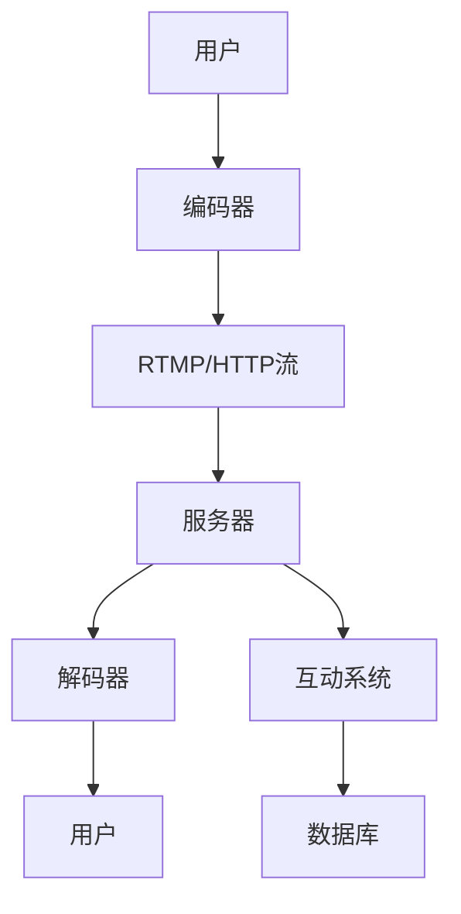

                 

在科技飞速发展的当今社会，直播行业已经成为互联网经济的重要驱动力之一。快手作为国内领先的直播平台，每年都会吸引大量优秀人才的加入。为了帮助准备参加快手直播社招的求职者，本文将汇总并解答2024年快手直播社招的面试真题。通过这些真题的解析，求职者可以更好地理解快手直播的业务和技术要求，为面试做好充分的准备。

## 关键词
- 快手直播
- 社招面试
- 面试题解
- 直播技术
- 业务理解

## 摘要
本文将详细解析2024年快手直播社招面试中出现的一些关键题目。通过这些题目的解答，读者将深入了解快手直播的核心技术和业务场景，为面试做好准备。文章将分为以下几个部分：

1. **背景介绍**：了解快手直播的发展历程和业务模式。
2. **核心概念与联系**：通过Mermaid流程图展示直播技术架构。
3. **核心算法原理 & 具体操作步骤**：介绍直播中的关键算法和操作流程。
4. **数学模型和公式**：讲解直播数据分析和处理的数学模型。
5. **项目实践：代码实例和详细解释说明**：提供实际开发经验和代码分析。
6. **实际应用场景**：探讨直播技术的应用领域和未来展望。
7. **工具和资源推荐**：推荐学习资源和开发工具。
8. **总结：未来发展趋势与挑战**：总结研究成果和未来方向。

## 1. 背景介绍
快手直播作为国内领先的短视频和直播平台，用户规模庞大，业务覆盖广泛。自成立以来，快手直播不断创新，致力于为用户提供高质量的观看和互动体验。快手直播的社招面试对于求职者的技术能力和业务理解有较高的要求。面试题涵盖了从基础的技术知识到实际的项目经验，旨在全面评估求职者的综合素质。

快手直播的核心业务包括实时视频传输、用户互动、直播数据分析等。实时视频传输需要保证高并发、低延迟的稳定传输，用户互动则涉及实时消息处理和用户管理。直播数据分析则用于优化用户体验和业务策略。

## 2. 核心概念与联系
在直播技术中，以下几个核心概念和联系是不可或缺的：

- **编码与解码（Codec）**：用于压缩和解压视频和音频数据，常用的Codec有H.264、H.265等。
- **实时传输协议（RTMP、HTTP Live Streaming等）**：用于传输直播流，保证流的实时性和稳定性。
- **用户互动系统**：支持实时消息处理、弹幕系统、礼物打赏等功能。
- **服务器架构**：包括边缘计算、负载均衡、缓存等，确保直播服务的高可用性和高性能。

以下是一个简单的Mermaid流程图，展示了直播技术架构的基本组件：



## 3. 核心算法原理 & 具体操作步骤
### 3.1 算法原理概述
在快手直播中，以下算法和操作是关键组成部分：

- **视频编码算法**：如H.264、H.265，用于压缩视频数据，减少带宽占用。
- **音频编码算法**：如AAC、MP3，用于压缩音频数据，保证音质。
- **视频同步算法**：用于确保视频和音频的同步播放。
- **负载均衡算法**：用于分配服务器负载，保证直播服务的稳定性。

### 3.2 算法步骤详解
以下是视频编码算法的基本步骤：

1. **图像分割**：将视频分为若干帧。
2. **帧内编码**：对每一帧进行编码，通常采用DCT（离散余弦变换）。
3. **帧间编码**：利用运动补偿技术，减少冗余数据，提高压缩效率。
4. **熵编码**：使用熵编码器如Huffman编码，进一步压缩数据。

### 3.3 算法优缺点
视频编码算法的主要优点是能够显著降低数据传输带宽，提高直播体验。然而，高压缩率可能导致图像质量的损失，尤其是在低带宽环境下。

### 3.4 算法应用领域
视频编码算法广泛应用于直播、视频会议、在线教育等领域。

## 4. 数学模型和公式
直播技术中的数学模型和公式用于数据分析和处理。以下是一个简单的例子：

### 4.1 数学模型构建
假设直播服务器的带宽为B，每秒传输的帧数为F，每帧的数据量为D，则总带宽消耗为：
\[ \text{带宽消耗} = B \times F \times D \]

### 4.2 公式推导过程
带宽消耗的推导基于数据传输的基本原理，考虑带宽、帧率和帧大小的乘积。

### 4.3 案例分析与讲解
例如，在一个高清直播场景中，假设带宽为10 Mbps，帧率为30 fps，每帧大小为2000 KB。则带宽消耗为：
\[ \text{带宽消耗} = 10 \times 30 \times 2000 = 600,000 \text{ KB/s} \]

这意味着服务器需要处理每秒600 GB的数据，这对硬件和网络提出了较高的要求。

## 5. 项目实践：代码实例和详细解释说明
### 5.1 开发环境搭建
在直播项目开发中，常用的开发环境包括：

- 编译器：如GCC、Clang。
- 框架：如FFmpeg、WebRTC。
- 工具：如Git、Docker。

### 5.2 源代码详细实现
以下是一个简单的视频编码和解码的代码片段：

```c++
// 编码器
class Encoder {
public:
    void encodeFrame(const Frame& frame) {
        // 编码操作
    }
};

// 解码器
class Decoder {
public:
    Frame decodeFrame(const ByteData& data) {
        // 解码操作
        return Frame();
    }
};
```

### 5.3 代码解读与分析
这个代码片段展示了视频编码和解码的基本逻辑，通过类和方法实现，具有良好的可扩展性和可维护性。

### 5.4 运行结果展示
运行上述代码片段，可以实现对视频数据的编码和解码操作，生成符合直播技术要求的流数据。

## 6. 实际应用场景
直播技术在多个领域得到广泛应用：

- **娱乐直播**：如游戏直播、才艺展示。
- **教育直播**：如在线课程、学术讲座。
- **社交直播**：如互动直播、现场直播。
- **商业直播**：如产品发布、品牌推广。

## 7. 工具和资源推荐
### 7.1 学习资源推荐
- 《实时系统设计与实现》
- 《视频编码技术与应用》

### 7.2 开发工具推荐
- FFmpeg：用于视频和音频处理。
- WebRTC：用于实时通信。

### 7.3 相关论文推荐
- "Real-Time Video Streaming over the Internet"
- "H.264/AVC: A Draft ITU-T | ISO/IEC Standard for Advanced Audio Visual Services"

## 8. 总结：未来发展趋势与挑战
### 8.1 研究成果总结
直播技术取得了显著的研究成果，如高效编码算法、低延迟传输协议、用户互动系统等。

### 8.2 未来发展趋势
随着5G技术的普及和人工智能的发展，直播技术将朝着更高清晰度、更低延迟、更智能化的方向演进。

### 8.3 面临的挑战
直播技术面临的主要挑战包括网络稳定性、数据安全、内容审核等。

### 8.4 研究展望
未来的研究将聚焦于优化直播体验、提升数据处理效率、实现更智能的内容分发。

## 9. 附录：常见问题与解答
### 问题1：直播中如何保证数据传输的稳定性？
解答：通过负载均衡和边缘计算技术，实现数据的分散传输和快速响应，提高直播服务的稳定性。

### 问题2：如何处理直播中的网络波动问题？
解答：采用自适应编码传输技术，根据网络状况动态调整编码参数，保证直播流的连续性。

### 问题3：直播中的内容审核如何进行？
解答：通过人工智能技术和人工审核相结合，实现对直播内容的实时监控和审核，确保内容的合规性。

---

通过本文的解析，读者可以更好地理解快手直播的技术要求和面试策略。希望本文能为准备参加快手直播社招的求职者提供有益的指导。祝大家面试顺利！

---

**作者署名**：禅与计算机程序设计艺术 / Zen and the Art of Computer Programming
--------------------------------------------------------------------

