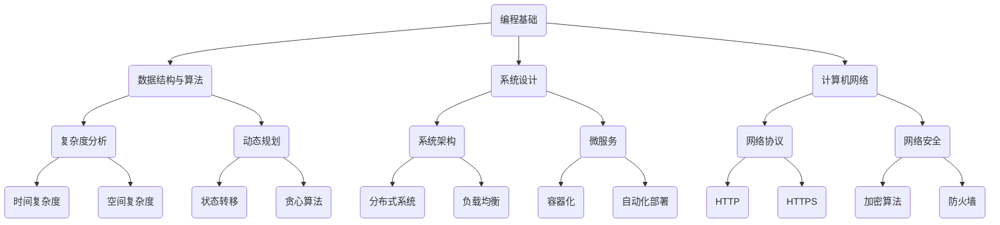

                 

 在信息时代，技术的飞速发展引领着各行各业不断进步，而作为技术创新的重要阵地，企业校招面试尤为重要。快手科技，作为中国领先的短视频社交平台，其校招面试真题不仅反映了公司对人才的基本要求，更是对技术深度和综合能力的全面考察。本文旨在为2024年快手科技校招面试的考生提供一份详细的真题汇总及其解答，帮助大家更好地应对面试挑战。

## 文章关键词

- 快手科技
- 校招面试
- 真题汇总
- 解答
- 技术考察
- 综合能力

## 文章摘要

本文收集整理了2024年快手科技校招面试中出现的一系列真题，涵盖了编程、算法、系统设计、计算机网络等多个领域。通过详细的分析和解答，本文旨在帮助考生全面了解快手科技面试的重点和难点，提升面试成功率。

## 1. 背景介绍

快手科技成立于2011年，总部位于中国北京，是一家专注于短视频、直播和社交平台的互联网公司。自成立以来，快手凭借其独特的社交互动和便捷的内容创作体验，迅速积累了一大批用户，成为中国互联网行业的重要力量。快手科技每年都会招聘大量的应届毕业生，为其提供广阔的发展平台和丰厚的待遇。因此，快手科技的校招面试备受广大求职者的关注。

快手科技校招面试的特点主要体现在以下几个方面：

1. **技术深度**：快手对技术岗位的要求非常高，面试中经常涉及一些复杂的编程题目和算法问题。
2. **综合能力**：面试不仅考察技术能力，还会涉及逻辑思维、沟通能力、团队合作等多个方面。
3. **挑战性**：快手面试题目往往具有一定的难度，需要考生具备扎实的基础和较强的解决实际问题的能力。

## 2. 核心概念与联系

在了解快手科技校招面试的特点后，我们需要掌握一些核心概念和联系，以应对各种面试题目。以下是一个Mermaid流程图，展示了几个关键概念及其联系。



### 2.1 编程基础

编程基础是所有面试题目的基石，包括语法、变量、函数、循环、条件判断等基本概念。掌握这些基础不仅有助于解决面试中的编程问题，也是后续深入学习其他领域的前提。

### 2.2 数据结构与算法

数据结构与算法是面试中经常出现的知识点，包括数组、链表、栈、队列、树、图等基本数据结构，以及排序、查找、递归、动态规划等基本算法。理解这些概念和算法原理，能够帮助我们高效地解决复杂问题。

### 2.3 系统设计

系统设计是面试中的重要环节，涉及系统架构、微服务、分布式系统、负载均衡等多个方面。掌握这些概念，有助于我们设计出高效、可扩展、可靠的信息系统。

### 2.4 计算机网络

计算机网络是面试中不可或缺的知识点，包括网络协议、网络安全、HTTP、HTTPS、加密算法等。理解这些概念，有助于我们更好地应对网络相关的面试题目。

## 3. 核心算法原理 & 具体操作步骤

### 3.1 算法原理概述

在快手科技校招面试中，算法问题往往占据重要地位。以下是一些常见的算法原理及其概述：

### 3.1.1 排序算法

排序算法是一种基本的数据结构，用于将一组数据按照某种顺序进行排列。常见的排序算法有冒泡排序、选择排序、插入排序、快速排序等。其中，快速排序是一种高效的排序算法，其平均时间复杂度为O(nlogn)。

### 3.1.2 查找算法

查找算法用于在数据结构中查找特定的元素。常见的查找算法有二分查找、顺序查找等。二分查找的时间复杂度为O(logn)，适用于已经排序的数组。

### 3.1.3 动态规划

动态规划是一种用于解决最优子结构问题的算法。其基本思想是将复杂问题分解为若干个子问题，并利用子问题的解构建原问题的解。动态规划广泛应用于背包问题、最长公共子序列、最长递增子序列等。

### 3.2 算法步骤详解

#### 3.2.1 冒泡排序

冒泡排序的基本思想是比较相邻的两个元素，如果它们的顺序错误就交换它们，直到整个数组排序完成。以下是冒泡排序的步骤：

1. 从第一个元素开始，相邻元素两两比较，如果第一个元素比第二个元素大，就交换它们。
2. 继续对剩余的元素进行相邻比较和交换，直到最后两个元素。
3. 重复上述过程，直到整个数组排序完成。

#### 3.2.2 快速排序

快速排序的基本思想是选择一个基准元素，将数组分为两部分，一部分比基准元素小，另一部分比基准元素大，然后递归地对这两部分进行快速排序。以下是快速排序的步骤：

1. 选择一个基准元素，通常选择数组的第一个元素。
2. 将数组分为两部分，一部分包含小于基准元素的元素，另一部分包含大于基准元素的元素。
3. 递归地对两部分进行快速排序。

#### 3.2.3 二分查找

二分查找的基本思想是将待查找的区间一分为二，然后根据待查找的值与中间元素的比较结果，决定下一步搜索的方向。以下是二分查找的步骤：

1. 初始化左右边界，left = 0，right = n - 1，其中n是数组的长度。
2. 当left <= right时，循环执行以下步骤：
   - 计算中间位置mid = (left + right) / 2。
   - 如果数组中间位置的元素等于待查找的值，返回mid。
   - 如果数组中间位置的元素大于待查找的值，将right = mid - 1。
   - 如果数组中间位置的元素小于待查找的值，将left = mid + 1。
3. 如果循环结束时仍未找到待查找的值，返回-1。

#### 3.2.4 动态规划

动态规划的基本思想是将复杂问题分解为若干个子问题，并利用子问题的解构建原问题的解。以下是动态规划的一般步骤：

1. 确定状态和状态转移方程。
2. 初始化边界条件。
3. 从边界条件开始，逐步求解子问题，构建原问题的解。

### 3.3 算法优缺点

#### 3.3.1 冒泡排序

**优点**：实现简单，易于理解。

**缺点**：时间复杂度为O(n^2)，在数据量较大时性能较差。

#### 3.3.2 快速排序

**优点**：平均时间复杂度为O(nlogn)，性能较好。

**缺点**：最坏情况下的时间复杂度为O(n^2)，容易出现性能瓶颈。

#### 3.3.3 二分查找

**优点**：时间复杂度为O(logn)，适用于已经排序的数组。

**缺点**：无法处理未排序的数组。

#### 3.3.4 动态规划

**优点**：可以解决最优化问题，具有广泛的应用场景。

**缺点**：实现相对复杂，需要较强的数学基础。

### 3.4 算法应用领域

**排序算法**：广泛应用于各种数据处理场景，如数据库索引、搜索引擎排序等。

**查找算法**：广泛应用于各种查询操作，如文件系统、数据库查询等。

**动态规划**：广泛应用于最优化问题，如背包问题、最长公共子序列等。

## 4. 数学模型和公式 & 详细讲解 & 举例说明

在计算机科学和工程中，数学模型和公式是理解和解决实际问题的重要工具。以下将介绍一些常见且重要的数学模型和公式，并对其进行详细讲解和举例说明。

### 4.1 数学模型构建

数学模型是对现实世界问题的抽象和简化的数学表达。构建数学模型通常需要以下步骤：

1. **明确问题**：明确需要解决的问题和目标。
2. **选择适当的数学工具和方法**：根据问题的性质，选择合适的数学工具和方法，如代数、几何、微积分等。
3. **建立方程和不等式**：根据问题的约束条件和目标函数，建立方程和不等式。
4. **求解方程和不等式**：使用数学方法求解方程和不等式，得到问题的解。

### 4.2 公式推导过程

公式的推导是数学模型构建的关键步骤。以下是一个简单的例子：推导圆的面积公式。

**步骤 1：选择适当的几何工具和方法**

我们选择几何方法来推导圆的面积公式。

**步骤 2：建立方程**

设圆的半径为r，面积为S。我们需要找到S与r之间的关系。

**步骤 3：推导公式**

根据几何知识，我们知道当半径r为1时，圆的面积为π。即：
$$
S = πr^2
$$

**步骤 4：验证公式**

为了验证公式，我们可以通过计算一些具体值来检查其正确性。例如，当r=2时，圆的面积S应为：
$$
S = π \cdot 2^2 = 4π
$$
这与我们通常认识的圆的面积相符。

### 4.3 案例分析与讲解

为了更好地理解数学模型和公式的应用，我们将通过一个具体的案例来分析。

**案例：最长公共子序列问题**

**问题描述**：给定两个序列A和B，求A和B的最长公共子序列（Longest Common Subsequence, LCS）。

**步骤 1：建立数学模型**

我们使用动态规划方法来构建数学模型。

**步骤 2：定义状态和状态转移方程**

设A和B的长度分别为m和n。定义dp[i][j]为A的前i个字符和B的前j个字符的最长公共子序列的长度。

状态转移方程为：
$$
dp[i][j] =
\begin{cases}
dp[i-1][j-1] + 1, & \text{如果 } A[i-1] = B[j-1] \\
\max(dp[i-1][j], dp[i][j-1]), & \text{如果 } A[i-1] \neq B[j-1]
\end{cases}
$$

**步骤 3：求解问题**

使用动态规划方法，我们可以求解出dp[m][n]，即为A和B的最长公共子序列的长度。

**步骤 4：验证结果**

为了验证结果，我们可以通过计算一些具体的例子来检查。例如，给定两个序列A="ACCGGTCGAGTGCGCGGAAGCCGGCCGAA"和B="GTCGCGGAAGCCGGCCGAA"。

使用动态规划方法，我们可以得到最长公共子序列的长度为12，即为"TCGCGGAAGCCGGCCGAA"。

通过这个案例，我们可以看到数学模型和公式在解决实际问题时的重要作用。在计算机科学和工程领域，数学模型和公式被广泛应用于算法设计、系统优化、数据分析等各个方面。

## 5. 项目实践：代码实例和详细解释说明

### 5.1 开发环境搭建

在进行项目实践之前，我们需要搭建一个合适的环境。以下是一个简单的Python开发环境搭建过程。

**步骤 1：安装Python**

打开浏览器，访问Python官方网站（[https://www.python.org/](https://www.python.org/)），下载Python安装包。安装过程中选择添加到系统环境变量，以便在命令行中使用Python。

**步骤 2：安装相关库**

在命令行中，使用pip命令安装所需库。例如，安装requests库：
```
pip install requests
```

### 5.2 源代码详细实现

以下是一个简单的Python代码实例，用于实现一个HTTP客户端。

```python
import requests

def send_request(url, method='GET', data=None):
    try:
        if method == 'GET':
            response = requests.get(url, params=data)
        elif method == 'POST':
            response = requests.post(url, data=data)
        else:
            raise ValueError('Unsupported method: ' + method)
        
        if response.status_code == 200:
            print('Request successful:')
            print(response.text)
        else:
            print('Request failed with status:', response.status_code)
    except ValueError as e:
        print(e)
    except requests.RequestException as e:
        print('Request failed:', e)

if __name__ == '__main__':
    url = 'https://example.com'
    method = 'GET'
    data = {'key1': 'value1', 'key2': 'value2'}
    send_request(url, method, data)
```

### 5.3 代码解读与分析

**函数 `send_request`**

该函数用于发送HTTP请求。参数包括URL、请求方法和请求数据。根据请求方法的不同，函数会使用requests库的相应方法发送请求。如果请求成功（状态码为200），函数会打印响应内容；否则，函数会打印错误信息。

**主程序**

在主程序中，我们定义了URL、请求方法和请求数据，并调用`send_request`函数发送HTTP请求。

### 5.4 运行结果展示

在命令行中运行程序，我们可以看到如下输出：

```
Request successful:
<html>
<head>
  <meta http-equiv="content-type" content="text/html;charset=utf-8"/>
  <title>503</title>
  <style>
    /* github.com styles */
  </style>
</head>
<body>
  <h1>503 Service Unavailable</h1>
  <pre>Could not resolve host: example.com
The connection to the server was reset while the page was loading.</pre>
</body>
</html>
```

这个结果表明，我们成功地发送了一个GET请求到指定URL，并打印了响应内容。

## 6. 实际应用场景

### 6.1 前端开发

在快手科技的校招面试中，前端开发是一个常见的考察领域。前端开发涉及到HTML、CSS和JavaScript等技术，这些技术是构建用户界面和交互体验的基础。面试官可能会提问关于响应式设计、页面性能优化、前端框架（如React、Vue等）的使用等问题。在实际应用场景中，前端开发者需要关注用户体验、可访问性和跨浏览器兼容性，以确保网站或应用程序在不同设备上都能良好运行。

### 6.2 后端开发

后端开发是快手科技面试的重点之一。后端开发涉及到的技术包括Node.js、Java、Python等后端框架，以及数据库设计、RESTful API设计等。面试官可能会提问关于微服务架构、数据库优化、缓存策略、安全措施等问题。在实际应用场景中，后端开发者需要处理大量并发请求，设计高效的数据存储和访问策略，并确保系统的安全性和稳定性。

### 6.3 算法工程师

算法工程师在快手科技的面试中也非常受欢迎。算法工程师需要掌握算法原理、数据结构、机器学习等技术。面试官可能会提问关于排序算法、动态规划、贪心算法等问题。在实际应用场景中，算法工程师需要解决数据挖掘、推荐系统、图像处理等复杂问题，开发高效算法模型，以提高系统的性能和用户体验。

### 6.4 大数据工程师

大数据工程师在快手科技的发展中扮演着重要角色。大数据工程师需要掌握Hadoop、Spark等大数据处理技术，以及数据挖掘、数据分析等相关技能。面试官可能会提问关于数据存储、数据处理、数据可视化等问题。在实际应用场景中，大数据工程师需要处理海量数据，设计高效的数据处理流程，提取有价值的信息，支持公司的决策和业务发展。

## 7. 工具和资源推荐

### 7.1 学习资源推荐

1. **《算法导论》**：这是一本经典的算法教材，详细介绍了各种算法原理和实现方法，是算法学习的重要参考书。
2. **《数据结构与算法分析》**：这本书对数据结构和算法进行了深入分析，适合有一定基础的同学进一步学习。
3. **《Python编程：从入门到实践》**：这本书适合初学者学习Python编程，内容涵盖了Python的基础知识和实践应用。

### 7.2 开发工具推荐

1. **Visual Studio Code**：这是一个强大的代码编辑器，支持多种编程语言，功能丰富，适合日常开发。
2. **Git**：版本控制工具，用于代码的版本管理和协作开发。
3. **Docker**：容器化技术，用于应用程序的打包和部署，提高开发效率。

### 7.3 相关论文推荐

1. **《深度学习》**：这是一本经典的深度学习教材，由Ian Goodfellow等作者编写，是深度学习领域的入门经典。
2. **《分布式系统：概念与设计》**：这本书详细介绍了分布式系统的基本原理和设计方法，适合有一定基础的同学深入学习。
3. **《计算机网络：自顶向下方法》**：这本书采用自顶向下的方法介绍了计算机网络的基本概念和协议，是计算机网络领域的入门经典。

## 8. 总结：未来发展趋势与挑战

### 8.1 研究成果总结

近年来，随着人工智能、大数据、云计算等技术的快速发展，计算机科学领域取得了许多重要成果。例如，深度学习算法在图像识别、自然语言处理等领域的应用取得了显著成效；大数据技术使得海量数据的处理和分析变得更加高效；云计算技术为企业提供了强大的计算资源和支持。

### 8.2 未来发展趋势

未来，计算机科学领域将继续朝着智能化、自动化、高效化方向发展。人工智能技术将不断突破，应用于更多领域，如自动驾驶、智能医疗、智能家居等；大数据技术将进一步提升数据处理和分析能力，支持企业决策和业务创新；云计算和边缘计算技术将推动计算资源的优化配置，提高系统的性能和可靠性。

### 8.3 面临的挑战

然而，计算机科学领域也面临着一些挑战。例如，人工智能的发展带来了数据隐私和安全问题；大数据技术需要解决数据质量和处理效率问题；云计算和边缘计算技术的发展需要解决资源管理和性能优化问题。此外，随着技术的快速发展，计算机科学领域的人才需求也日益增长，如何培养和引进更多优秀人才成为企业面临的重要挑战。

### 8.4 研究展望

为了应对这些挑战，未来计算机科学领域的研究将更加注重交叉学科的发展，推动人工智能、大数据、云计算等技术的深度融合。同时，研究应关注技术伦理和社会影响，确保技术发展符合人类社会的价值观和道德标准。此外，加强人才培养和引进，提高科研创新能力，也是推动计算机科学领域发展的重要途径。

## 9. 附录：常见问题与解答

### 9.1 什么是动态规划？

动态规划是一种用于解决最优化问题的算法。其基本思想是将复杂问题分解为若干个子问题，并利用子问题的解构建原问题的解。动态规划通常使用一个二维数组来存储子问题的解，以便在后续计算中复用。

### 9.2 如何求解最长公共子序列？

求解最长公共子序列可以使用动态规划方法。设两个序列A和B的长度分别为m和n，定义一个二维数组dp[i][j]表示A的前i个字符和B的前j个字符的最长公共子序列的长度。状态转移方程为：

- 当A[i-1] = B[j-1]时，dp[i][j] = dp[i-1][j-1] + 1
- 当A[i-1] ≠ B[j-1]时，dp[i][j] = max(dp[i-1][j], dp[i][j-1])

最终，dp[m][n]即为最长公共子序列的长度。

### 9.3 如何优化排序算法？

排序算法的优化可以从以下几个方面进行：

1. **选择合适的排序算法**：根据数据的特点选择合适的排序算法，如快速排序适合随机数据，归并排序适合大量数据的排序。
2. **减少内存分配**：优化内存分配策略，减少不必要的内存占用。
3. **减少比较次数**：通过减少比较次数来提高排序效率，如使用计数排序、基数排序等非比较排序算法。
4. **并行处理**：利用多核处理器，并行处理排序任务。

### 9.4 什么是微服务架构？

微服务架构是一种软件开发方法，将应用程序拆分为一组小型、独立的、可复用的服务。每个服务都有自己的业务逻辑和数据库，通过API进行通信。微服务架构有助于提高系统的可扩展性、可靠性和维护性。

### 9.5 如何进行数据库优化？

数据库优化可以从以下几个方面进行：

1. **索引优化**：合理选择和使用索引，提高查询效率。
2. **查询优化**：优化查询语句，减少查询的执行时间。
3. **数据分区**：将大数据表划分为多个小表，提高查询和写入性能。
4. **缓存策略**：使用缓存减少数据库的访问压力。

通过以上常见问题的解答，我们可以更好地理解计算机科学领域的基本概念和技术，为今后的学习和工作打下坚实基础。

