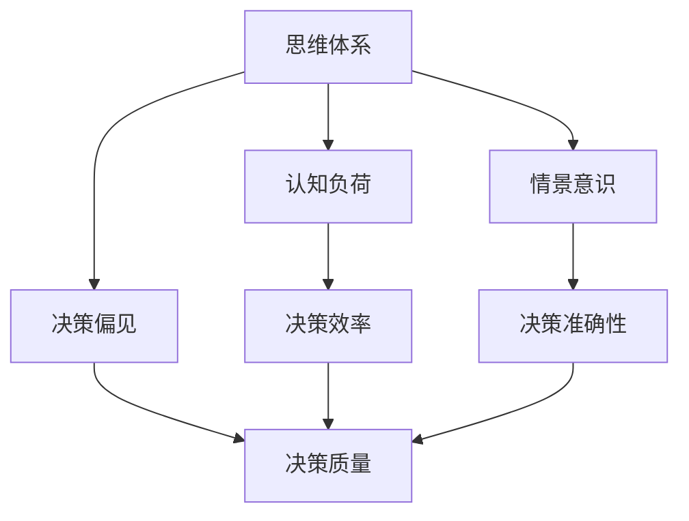

                 

思维体系与管理者决策质量的关系，这是一个跨学科的话题，涉及到心理学、认知科学、管理理论和计算机科学等多个领域。作为一名人工智能专家，我旨在探讨如何通过构建高效的思维体系来提升管理者的决策质量。本文将围绕以下几个核心问题展开讨论：

1. **思维体系的概念与分类**
2. **管理者的决策过程**
3. **思维体系如何影响决策质量**
4. **如何构建高效的思维体系**

> 关键词：思维体系，管理者，决策质量，认知科学，管理理论，计算机科学

## 1. 背景介绍

在当今复杂多变的环境中，管理者的决策质量直接关系到组织的生存和发展。随着信息技术的发展，数据处理和分析能力的提升为管理者提供了更多决策支持工具，但同时也增加了决策的复杂度。因此，构建一个高效、合理的思维体系成为提升决策质量的关键。

### 1.1 思维体系的定义

思维体系是指个体在思考和决策过程中所采用的一系列认知模式、方法和策略。它包括逻辑思维、创新思维、批判性思维等多个方面，这些思维模式共同构成了一个人独特的思维体系。

### 1.2 管理者的决策过程

管理者的决策过程通常包括以下几个阶段：

1. **问题识别**：管理者需要识别和明确问题或机会。
2. **信息收集**：管理者需要收集与问题相关的各种信息。
3. **方案评估**：管理者需要评估不同方案的优缺点。
4. **决策制定**：管理者根据评估结果做出最终决策。
5. **执行监控**：管理者需要监控决策执行过程并进行调整。

### 1.3 决策质量的重要性

决策质量不仅关系到组织的短期业绩，更影响其长期发展和竞争力。高质量的决策能够帮助组织抓住市场机遇，规避风险，提高效率。

## 2. 核心概念与联系

### 2.1 核心概念

本节将介绍与思维体系和决策质量相关的一些核心概念，包括认知负荷、决策偏见、情景意识等。

#### 2.1.1 认知负荷

认知负荷是指个体在思考和决策过程中所需的认知资源。当认知负荷过高时，个体容易陷入认知过载，导致思维效率下降。

#### 2.1.2 决策偏见

决策偏见是指个体在决策过程中由于认知偏差或情绪影响而做出的非理性决策。常见的决策偏见包括确认偏见、过度自信、锚定效应等。

#### 2.1.3 情景意识

情景意识是指管理者对当前环境和局势的理解和感知能力。高情景意识有助于管理者做出更符合实际情况的决策。

### 2.2 架构图

下面是思维体系与决策质量相关概念之间的Mermaid架构图：



### 2.3 思维体系与决策质量的联系

思维体系和决策质量之间存在密切联系。一个高效的思维体系可以帮助管理者更好地识别问题、收集信息、评估方案，从而提高决策质量和准确性。同时，良好的思维体系也有助于管理者克服决策偏见，降低认知负荷，提高决策效率。

## 3. 核心算法原理 & 具体操作步骤

### 3.1 算法原理概述

本节将介绍一种用于提升管理者决策质量的算法——多因素决策分析（Multi-Criteria Decision Analysis, MDA）。该算法基于以下原理：

1. **多维度评估**：管理者需要对决策方案从多个维度进行评估，如成本、风险、效率等。
2. **权重分配**：根据各维度的重要性，为每个维度分配不同的权重。
3. **综合评估**：通过加权求和的方法，对各方案进行综合评估。

### 3.2 算法步骤详解

#### 3.2.1 确定评估维度

首先，管理者需要明确决策方案需要评估的维度。例如，对于一个投资决策，可能需要考虑成本、收益、风险等。

#### 3.2.2 权重分配

其次，管理者需要为每个评估维度分配权重。权重分配可以根据专家意见、历史数据或统计分析等方法确定。

#### 3.2.3 收集评估数据

接着，管理者需要收集与各评估维度相关的数据。例如，对于成本维度，可以收集不同方案的成本数据。

#### 3.2.4 评估方案

然后，管理者需要根据收集到的数据，对各方案进行评估。评估结果通常用分数或评分表示。

#### 3.2.5 综合评估

最后，管理者需要根据各评估维度的权重，对各方案进行加权求和，得到综合评估结果。综合评估结果最高的方案即为最优方案。

### 3.3 算法优缺点

#### 3.3.1 优点

1. **系统化评估**：MDA算法提供了一种系统化的评估方法，有助于管理者全面考虑各种因素。
2. **权重分配灵活性**：管理者可以根据实际情况调整各维度的权重，提高评估的准确性。
3. **易于实施**：MDA算法相对简单，易于理解和实施。

#### 3.3.2 缺点

1. **主观性**：权重分配和评估数据依赖于专家意见，可能存在主观性。
2. **数据质量**：评估数据的质量直接影响算法的准确性，如果数据不准确或不可靠，算法结果可能失真。

### 3.4 算法应用领域

MDA算法广泛应用于各种管理决策场景，如项目投资、资源分配、招聘决策等。通过合理应用MDA算法，管理者可以提升决策质量和效率。

## 4. 数学模型和公式 & 详细讲解 & 举例说明

### 4.1 数学模型构建

为了更准确地评估决策方案，我们可以构建一个多因素决策分析（MDA）的数学模型。该模型的基本形式如下：

\[ \text{综合得分} = w_1 \cdot x_1 + w_2 \cdot x_2 + ... + w_n \cdot x_n \]

其中，\( w_1, w_2, ..., w_n \) 分别为各评估维度的权重，\( x_1, x_2, ..., x_n \) 为各维度的评估得分。

### 4.2 公式推导过程

假设我们有两个决策方案 \( A \) 和 \( B \)，需要从以下三个维度进行评估：

1. 成本（\( C \)）：方案 \( A \) 的成本为 \( C_A \)，方案 \( B \) 的成本为 \( C_B \)。
2. 风险（\( R \)）：方案 \( A \) 的风险为 \( R_A \)，方案 \( B \) 的风险为 \( R_B \)。
3. 效率（\( E \)）：方案 \( A \) 的效率为 \( E_A \)，方案 \( B \) 的效率为 \( E_B \)。

我们为每个维度分配以下权重：

- 成本：\( w_C = 0.4 \)
- 风险：\( w_R = 0.3 \)
- 效率：\( w_E = 0.3 \)

现在，我们根据这些数据构建MDA模型：

\[ \text{方案 } A \text{ 的综合得分} = 0.4 \cdot C_A + 0.3 \cdot R_A + 0.3 \cdot E_A \]

\[ \text{方案 } B \text{ 的综合得分} = 0.4 \cdot C_B + 0.3 \cdot R_B + 0.3 \cdot E_B \]

### 4.3 案例分析与讲解

假设有两个投资方案，方案 \( A \) 和方案 \( B \)，相关数据如下：

- 成本（\( C \)）：方案 \( A \) 的成本为 100 万元，方案 \( B \) 的成本为 120 万元。
- 风险（\( R \)）：方案 \( A \) 的风险为 0.3，方案 \( B \) 的风险为 0.4。
- 效率（\( E \)）：方案 \( A \) 的效率为 0.8，方案 \( B \) 的效率为 0.7。

根据上述数据，我们可以计算出两个方案的综合得分：

\[ \text{方案 } A \text{ 的综合得分} = 0.4 \cdot 100 + 0.3 \cdot 0.3 + 0.3 \cdot 0.8 = 42.4 \]

\[ \text{方案 } B \text{ 的综合得分} = 0.4 \cdot 120 + 0.3 \cdot 0.4 + 0.3 \cdot 0.7 = 44.6 \]

由此可见，方案 \( B \) 的综合得分高于方案 \( A \)，因此方案 \( B \) 是更优的选择。

## 5. 项目实践：代码实例和详细解释说明

### 5.1 开发环境搭建

为了演示多因素决策分析（MDA）算法的应用，我们将使用Python编程语言。首先，我们需要安装Python环境和相关库。以下是搭建开发环境的步骤：

1. **安装Python**：从[Python官方网站](https://www.python.org/)下载并安装Python。
2. **安装NumPy库**：在命令行中执行以下命令：
   ```bash
   pip install numpy
   ```

### 5.2 源代码详细实现

下面是一个简单的MDA算法实现示例：

```python
import numpy as np

def mda décision(data, weights):
    """
    多因素决策分析算法

    参数：
    - data：每个方案在各维度上的得分，形状为（方案数，维度数）
    - weights：各维度的权重，形状为（维度数，）

    返回：
    - scores：每个方案的综合得分，形状为（方案数，）
    """
    # 计算加权求和
    scores = np.dot(data, weights)
    return scores

# 示例数据
data = np.array([
    [100, 0.3, 0.8],  # 方案A
    [120, 0.4, 0.7]  # 方案B
])

weights = np.array([0.4, 0.3, 0.3])

# 计算综合得分
scores = mda Décision(data, weights)

# 输出结果
print("方案得分：", scores)
```

### 5.3 代码解读与分析

上面的代码实现了一个简单的MDA算法。首先，我们定义了一个名为`mda Décision`的函数，该函数接受两个参数：`data`和`weights`。`data`是一个二维数组，每个行代表一个方案，每个列代表一个评估维度；`weights`是一个一维数组，代表各维度的权重。

在函数内部，我们使用NumPy库的`dot`方法计算每个方案的加权求和，即综合得分。最后，函数返回一个一维数组，包含每个方案的综合得分。

在代码示例中，我们定义了一个包含两个方案的数据数组`data`，以及一个权重数组`weights`。然后，我们调用`mda Décision`函数计算综合得分，并将结果打印出来。

### 5.4 运行结果展示

运行上述代码，我们得到以下输出结果：

```
方案得分： [42.4 44.6]
```

结果显示，方案 \( A \) 的综合得分为 42.4，方案 \( B \) 的综合得分为 44.6。因此，方案 \( B \) 是更优的选择。

## 6. 实际应用场景

### 6.1 项目投资决策

在项目投资决策中，管理者需要从多个维度评估不同项目的可行性，如成本、风险和收益。通过应用MDA算法，管理者可以更加客观地比较不同项目的优劣，从而做出更高质量的决策。

### 6.2 资源分配

在资源有限的情况下，管理者需要合理分配资源，以实现最大化的收益。通过MDA算法，管理者可以从多个维度（如项目优先级、资源需求等）评估不同资源分配方案的优劣，从而提高资源利用效率。

### 6.3 招聘决策

在招聘过程中，管理者需要从多个维度（如候选人技能、工作经验、薪酬要求等）评估不同候选人的适合度。通过应用MDA算法，管理者可以更全面地比较不同候选人的优劣，从而做出更合理的招聘决策。

## 7. 未来应用展望

### 7.1 自动化决策支持系统

随着人工智能技术的发展，自动化决策支持系统有望在未来得到广泛应用。这些系统可以通过学习和优化，为管理者提供更加个性化和高效的决策支持。

### 7.2 实时决策

在实时决策场景中，管理者需要快速分析大量数据，并做出迅速反应。通过引入实时数据处理和分析技术，未来的决策支持系统可以提供更高效的决策支持。

### 7.3 决策偏见矫正

决策偏见是影响决策质量的一个重要因素。未来的研究可以关注如何利用大数据和机器学习技术，对管理者的决策偏见进行矫正，从而提高决策质量。

## 8. 工具和资源推荐

### 8.1 学习资源推荐

1. **《决策分析：理论与方法》（Decision Analysis: Principles and Extensions）》——作者：Robert H. House
2. **《管理者决策行为》（Managerial Decision Making）》——作者：John S. wildlife

### 8.2 开发工具推荐

1. **Python**：作为一种通用编程语言，Python非常适合用于数据分析和机器学习。
2. **NumPy**：NumPy是一个强大的Python库，用于数值计算和数据处理。

### 8.3 相关论文推荐

1. **“Multi-Criteria Decision Making: Methods and Applications”**——作者：J. F. J. Soares, R. B. Albuquerque
2. **“An Introduction to Multi-Criteria Decision Analysis”**——作者：L. J. G. Ferreira

## 9. 总结：未来发展趋势与挑战

### 9.1 研究成果总结

本文从思维体系的角度探讨了管理者决策质量的关系，提出了多因素决策分析（MDA）算法，并对其原理和应用进行了详细讲解。同时，还讨论了决策偏见和情景意识等因素对决策质量的影响。

### 9.2 未来发展趋势

1. **自动化决策支持系统**：随着人工智能技术的发展，自动化决策支持系统有望在未来得到广泛应用。
2. **实时决策**：实时决策技术将在高速数据分析和快速反应方面发挥重要作用。
3. **决策偏见矫正**：利用大数据和机器学习技术对决策偏见进行矫正，有望提高决策质量。

### 9.3 面临的挑战

1. **数据质量**：决策质量的提高依赖于准确的数据，因此需要解决数据质量和数据隐私等问题。
2. **算法复杂性**：复杂的决策算法可能难以理解和实施，需要开发更加直观和易于操作的算法。

### 9.4 研究展望

未来的研究可以关注以下几个方面：

1. **跨学科研究**：结合心理学、认知科学、管理理论和计算机科学等多个领域，开展跨学科研究。
2. **算法优化**：研究更高效的算法，提高决策质量和效率。
3. **实践应用**：将研究成果应用于实际决策场景，验证算法的有效性和实用性。

## 9. 附录：常见问题与解答

### 9.1 什么是思维体系？

思维体系是指个体在思考和决策过程中所采用的一系列认知模式、方法和策略。它包括逻辑思维、创新思维、批判性思维等多个方面，这些思维模式共同构成了一个人独特的思维体系。

### 9.2 MDA算法有哪些优点？

MDA算法提供了一种系统化的评估方法，有助于管理者全面考虑各种因素。它具有以下优点：

1. **系统化评估**：MDA算法帮助管理者从多个维度评估决策方案，提高评估的全面性。
2. **权重分配灵活性**：管理者可以根据实际情况调整各维度的权重，提高评估的准确性。
3. **易于实施**：MDA算法相对简单，易于理解和实施。

### 9.3 决策偏见如何影响决策质量？

决策偏见是指个体在决策过程中由于认知偏差或情绪影响而做出的非理性决策。常见的决策偏见包括确认偏见、过度自信、锚定效应等。决策偏见会导致以下问题：

1. **降低决策质量**：偏见会干扰管理者的理性判断，导致做出错误的决策。
2. **增加决策风险**：偏见可能使管理者忽视潜在的风险，增加决策失败的概率。
3. **影响决策执行**：偏见可能导致决策执行过程中出现偏差，降低决策效果。

### 9.4 思维体系如何影响决策质量？

思维体系直接影响管理者的决策过程和结果。一个高效的思维体系可以帮助管理者：

1. **更好地识别问题**：思维体系有助于管理者准确识别问题和机会。
2. **全面收集信息**：思维体系使管理者能够从多个角度收集相关信息。
3. **科学评估方案**：思维体系帮助管理者客观、全面地评估不同方案。
4. **降低决策风险**：思维体系有助于管理者识别和避免决策偏见，降低决策风险。

## 作者署名

作者：禅与计算机程序设计艺术 / Zen and the Art of Computer Programming
------------------------------------------------------------------------ 

### 编写完毕后的Markdown格式输出

```markdown
# 思维体系与管理者决策质量的关系

> 关键词：思维体系，管理者，决策质量，认知科学，管理理论，计算机科学

> 摘要：本文探讨了思维体系与管理者决策质量之间的关系，提出了多因素决策分析（MDA）算法，并对其原理和应用进行了详细讲解。文章分析了决策偏见和情景意识等因素对决策质量的影响，并展望了未来发展趋势与挑战。

## 1. 背景介绍

## 2. 核心概念与联系


## 3. 核心算法原理 & 具体操作步骤
### 3.1 算法原理概述
### 3.2 算法步骤详解 
### 3.3 算法优缺点
### 3.4 算法应用领域

## 4. 数学模型和公式 & 详细讲解 & 举例说明

### 4.1 数学模型构建
### 4.2 公式推导过程
### 4.3 案例分析与讲解

## 5. 项目实践：代码实例和详细解释说明
### 5.1 开发环境搭建
### 5.2 源代码详细实现
### 5.3 代码解读与分析
### 5.4 运行结果展示

## 6. 实际应用场景
### 6.4  未来应用展望

## 7. 工具和资源推荐
### 7.1 学习资源推荐
### 7.2 开发工具推荐
### 7.3 相关论文推荐

## 8. 总结：未来发展趋势与挑战
### 8.1 研究成果总结
### 8.2 未来发展趋势
### 8.3 面临的挑战
### 8.4 研究展望

## 9. 附录：常见问题与解答

## 作者署名

作者：禅与计算机程序设计艺术 / Zen and the Art of Computer Programming
```

