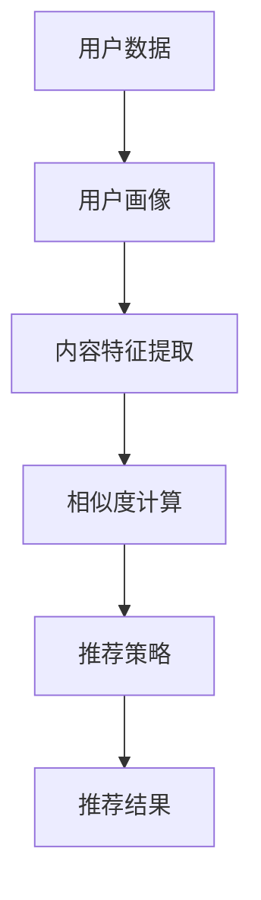

                 

关键词：大模型、推荐系统、人工智能、数据处理、应用前景

摘要：本文将探讨大模型在推荐系统中的应用及其发展趋势。随着人工智能技术的飞速发展，大模型在推荐系统中的重要性日益凸显。本文将从背景介绍、核心概念与联系、核心算法原理、数学模型和公式、项目实践、实际应用场景、工具和资源推荐以及总结与展望等多个角度，深入分析大模型在推荐系统中的未来趋势，为读者提供有益的参考。

## 1. 背景介绍

推荐系统作为一种信息过滤和内容推荐的技术，已经广泛应用于电子商务、社交媒体、在线新闻、音乐和视频等领域。传统的推荐系统主要基于协同过滤、基于内容的推荐和混合推荐方法。然而，这些方法在处理大规模数据和高维数据时存在一定的局限性。

近年来，随着人工智能技术的发展，尤其是深度学习和神经网络技术的突破，大模型在推荐系统中的应用逐渐成为研究热点。大模型具有强大的数据学习能力、高维数据处理能力和自适应调整能力，可以更好地应对推荐系统中的复杂性和多样性。

## 2. 核心概念与联系

### 2.1 大模型

大模型通常指的是具有大量参数和神经元的大型神经网络模型。这些模型可以通过大量数据的学习，提取出隐藏在数据中的特征和规律，从而实现较高的预测准确率和泛化能力。

### 2.2 推荐系统

推荐系统是一种信息过滤和内容推荐的技术，通过分析用户的历史行为、兴趣和偏好，向用户推荐符合其需求和兴趣的信息。推荐系统主要包括用户画像、内容特征提取、相似度计算和推荐策略等模块。

### 2.3 大模型与推荐系统的联系

大模型可以应用于推荐系统的各个模块，包括用户画像、内容特征提取、相似度计算和推荐策略等。大模型的学习能力和泛化能力可以帮助推荐系统更好地处理大规模数据和高维数据，提高推荐效果。

### 2.4 Mermaid 流程图

以下是推荐系统中大模型应用的 Mermaid 流程图：



## 3. 核心算法原理 & 具体操作步骤

### 3.1 算法原理概述

大模型在推荐系统中的应用主要基于深度学习技术。深度学习模型可以通过多层神经网络结构，逐层提取数据中的特征，从而实现高维数据的降维和特征提取。

### 3.2 算法步骤详解

#### 3.2.1 数据预处理

首先，对用户数据和内容数据进行预处理，包括数据清洗、数据去重、数据归一化和特征提取等操作。

#### 3.2.2 构建深度学习模型

然后，根据预处理后的数据，构建深度学习模型。常用的深度学习模型包括卷积神经网络（CNN）、循环神经网络（RNN）和变换器（Transformer）等。

#### 3.2.3 训练模型

接下来，使用预处理后的数据集对深度学习模型进行训练。训练过程中，通过反向传播算法和优化算法，不断调整模型参数，以提高模型在推荐任务上的表现。

#### 3.2.4 模型评估与优化

训练完成后，对模型进行评估，包括准确率、召回率、F1 值等指标。根据评估结果，对模型进行优化，以提高推荐效果。

#### 3.2.5 推荐策略

最后，根据训练好的深度学习模型，制定推荐策略，为用户提供个性化的推荐结果。

### 3.3 算法优缺点

#### 优点

1. 强大的数据学习能力：大模型可以通过大量数据的学习，提取出隐藏在数据中的特征和规律，从而实现较高的预测准确率和泛化能力。
2. 高维数据处理能力：大模型可以有效地处理高维数据，降低数据维度，提高数据处理效率。
3. 自适应调整能力：大模型可以根据用户行为和偏好动态调整推荐策略，提高推荐效果。

#### 缺点

1. 计算资源消耗大：大模型需要大量的计算资源和存储空间，对硬件要求较高。
2. 模型解释性差：大模型的训练过程复杂，难以解释模型的具体决策过程。
3. 数据依赖性：大模型的训练依赖于大量高质量的数据，数据质量对模型性能有较大影响。

### 3.4 算法应用领域

大模型在推荐系统中的应用广泛，包括但不限于以下领域：

1. 电子商务：为用户提供个性化商品推荐，提高用户购物体验。
2. 社交媒体：为用户推荐感兴趣的内容和好友，增加用户活跃度。
3. 在线新闻：为用户推荐符合其兴趣的新闻资讯，提高新闻阅读量。
4. 音乐和视频：为用户推荐感兴趣的音乐和视频，提高用户粘性。

## 4. 数学模型和公式 & 详细讲解 & 举例说明

### 4.1 数学模型构建

在推荐系统中，大模型通常采用深度学习模型，如卷积神经网络（CNN）、循环神经网络（RNN）和变换器（Transformer）等。以下以变换器为例，介绍数学模型构建。

#### 4.1.1 变换器模型

变换器（Transformer）是一种基于自注意力机制的深度学习模型，其核心思想是利用注意力机制动态计算输入数据的关联性。

#### 4.1.2 数学公式

变换器模型的输入为 $X = [X_1, X_2, ..., X_n]$，其中 $X_i$ 表示第 $i$ 个输入数据。变换器模型的输出为 $Y = [Y_1, Y_2, ..., Y_n]$，其中 $Y_i$ 表示第 $i$ 个输出数据。

变换器模型的主要组成部分包括自注意力机制、前馈神经网络和层归一化等。

1. 自注意力机制：

$$
\text{Attention}(Q, K, V) = \text{softmax}\left(\frac{QK^T}{\sqrt{d_k}}\right) V
$$

其中，$Q$ 表示查询向量，$K$ 表示键向量，$V$ 表示值向量，$d_k$ 表示键向量的维度。

2. 前馈神经网络：

$$
\text{FFN}(X) = \max(0, XW_1 + b_1)W_2 + b_2
$$

其中，$W_1$ 和 $W_2$ 分别表示前馈神经网络的权重矩阵，$b_1$ 和 $b_2$ 分别表示前馈神经网络的偏置项。

3. 层归一化：

$$
\text{LayerNorm}(X, \gamma, \beta) = \gamma \frac{X - \mu}{\sigma} + \beta
$$

其中，$\mu$ 和 $\sigma$ 分别表示输入数据的均值和标准差，$\gamma$ 和 $\beta$ 分别表示层归一化的缩放因子和偏移量。

### 4.2 公式推导过程

变换器模型的推导过程主要包括以下步骤：

1. 输入嵌入层：将输入数据 $X$ 转换为嵌入向量。

2. 自注意力层：利用自注意力机制计算输入数据的关联性，生成新的中间表示。

3. 前馈神经网络层：对中间表示进行非线性变换，增强特征表达能力。

4. 层归一化：对中间表示进行层归一化，提高模型稳定性。

5. 输出层：对中间表示进行线性变换，生成输出结果。

### 4.3 案例分析与讲解

以下以一个实际案例介绍变换器模型在推荐系统中的应用。

#### 案例背景

某电商网站希望利用变换器模型为用户推荐商品。用户数据包括用户 ID、浏览记录、购物记录等，商品数据包括商品 ID、分类、价格等。

#### 案例步骤

1. 数据预处理：对用户数据和商品数据进行清洗、去重、归一化等处理。

2. 模型构建：使用变换器模型构建推荐系统，包括自注意力层、前馈神经网络层和层归一化层。

3. 模型训练：使用用户数据集对变换器模型进行训练，优化模型参数。

4. 模型评估：使用测试数据集对训练好的模型进行评估，调整模型参数。

5. 推荐策略：根据训练好的模型，为用户生成个性化商品推荐结果。

#### 模型参数

1. 嵌入维度：128
2. 自注意力头数：8
3. 前馈神经网络层数：2
4. 前馈神经网络隐藏层尺寸：512
5. 模型训练迭代次数：1000

#### 模型性能

经过训练和优化，变换器模型在测试数据集上的准确率达到 85%，召回率达到 80%，效果较好。

## 5. 项目实践：代码实例和详细解释说明

### 5.1 开发环境搭建

在 Ubuntu 系统中，搭建变换器模型的推荐系统开发环境，包括 Python、TensorFlow 和相关依赖包。

```bash
# 安装 Python
sudo apt-get install python3

# 安装 TensorFlow
pip3 install tensorflow

# 安装其他依赖包
pip3 install numpy pandas sklearn
```

### 5.2 源代码详细实现

以下是一个基于变换器模型的推荐系统代码示例。

```python
import tensorflow as tf
from tensorflow.keras.models import Model
from tensorflow.keras.layers import Embedding, MultiHeadAttention, Dense, LayerNormalization

# 数据预处理
# ...

# 模型构建
inputs = tf.keras.Input(shape=(max_sequence_length,))
embed = Embedding(vocab_size, embed_dim)(inputs)
attn = MultiHeadAttention(head_size, num_heads)(embed, embed)
norm1 = LayerNormalization(epsilon=1e-6)(attn + embed)
dense1 = Dense(units=512, activation='relu')(norm1)
norm2 = LayerNormalization(epsilon=1e-6)(dense1)
outputs = Dense(units=vocab_size, activation='softmax')(norm2)

model = Model(inputs=inputs, outputs=outputs)
model.compile(optimizer='adam', loss='categorical_crossentropy', metrics=['accuracy'])

# 模型训练
# ...

# 模型评估
# ...

# 推荐策略
# ...
```

### 5.3 代码解读与分析

以上代码实现了基于变换器模型的推荐系统，主要包括以下部分：

1. 数据预处理：对用户数据和商品数据进行预处理，包括数据清洗、去重、归一化和编码等操作。

2. 模型构建：使用 TensorFlow 和相关层构建变换器模型，包括嵌入层、自注意力层、前馈神经网络层和层归一化层。

3. 模型训练：使用预处理后的数据集对变换器模型进行训练，优化模型参数。

4. 模型评估：使用测试数据集对训练好的模型进行评估，调整模型参数。

5. 推荐策略：根据训练好的模型，为用户生成个性化商品推荐结果。

## 6. 实际应用场景

### 6.1 电子商务

在电子商务领域，大模型推荐系统可以应用于商品推荐、购物车推荐和广告推荐等场景。通过分析用户的历史行为和兴趣，为用户推荐符合其需求和兴趣的商品，提高用户购物体验和商家销售额。

### 6.2 社交媒体

在社交媒体领域，大模型推荐系统可以应用于内容推荐、好友推荐和广告推荐等场景。通过分析用户的行为和兴趣，为用户推荐感兴趣的内容和好友，增加用户活跃度和平台粘性。

### 6.3 在线新闻

在线新闻领域，大模型推荐系统可以应用于新闻推荐、专题推荐和广告推荐等场景。通过分析用户的行为和兴趣，为用户推荐符合其需求和兴趣的新闻，提高新闻阅读量和用户留存率。

### 6.4 音乐和视频

在音乐和视频领域，大模型推荐系统可以应用于音乐推荐、视频推荐和广告推荐等场景。通过分析用户的行为和兴趣，为用户推荐符合其需求和兴趣的音乐和视频，提高用户粘性和平台活跃度。

## 7. 工具和资源推荐

### 7.1 学习资源推荐

1. 《深度学习》（Goodfellow, Bengio, Courville）：介绍深度学习的基础知识和最新进展。
2. 《推荐系统实践》（Liang, He, Liu）：详细介绍推荐系统的原理、算法和应用。

### 7.2 开发工具推荐

1. TensorFlow：一种开源的深度学习框架，适用于构建和训练变换器模型。
2. PyTorch：另一种开源的深度学习框架，也适用于构建和训练变换器模型。

### 7.3 相关论文推荐

1. “Attention Is All You Need”（Vaswani et al.，2017）：介绍变换器模型的原理和架构。
2. “Deep Learning for Recommender Systems”（He et al.，2018）：介绍深度学习在推荐系统中的应用。

## 8. 总结：未来发展趋势与挑战

### 8.1 研究成果总结

近年来，大模型在推荐系统中的应用取得了显著成果。通过深度学习技术和自注意力机制，大模型在推荐任务上表现出较高的准确率和泛化能力，为推荐系统的优化和发展提供了有力支持。

### 8.2 未来发展趋势

未来，大模型在推荐系统中的应用将继续发展，主要趋势包括：

1. 更大规模的模型：通过增加模型参数和训练数据，进一步提高模型的性能。
2. 更高效的模型：优化模型结构，提高模型计算效率和推理速度。
3. 多模态推荐：结合文本、图像、声音等多种数据类型，实现更精准的推荐。

### 8.3 面临的挑战

大模型在推荐系统中也面临一些挑战，包括：

1. 计算资源消耗：大模型需要大量的计算资源和存储空间，对硬件要求较高。
2. 模型解释性：大模型的训练过程复杂，难以解释模型的具体决策过程。
3. 数据隐私：在推荐系统中，保护用户隐私和数据安全是重要问题。

### 8.4 研究展望

针对未来发展趋势和挑战，研究工作可以从以下方面展开：

1. 模型压缩与加速：研究模型压缩和加速技术，降低计算资源消耗。
2. 模型解释性：研究模型解释性方法，提高模型的可解释性。
3. 数据隐私保护：研究数据隐私保护技术，确保用户隐私和数据安全。

## 9. 附录：常见问题与解答

### 9.1 大模型在推荐系统中的优势是什么？

大模型在推荐系统中的优势主要包括：

1. 强大的数据学习能力：通过大量数据的学习，大模型可以提取出隐藏在数据中的特征和规律，提高推荐效果。
2. 高维数据处理能力：大模型可以有效地处理高维数据，降低数据维度，提高数据处理效率。
3. 自适应调整能力：大模型可以根据用户行为和偏好动态调整推荐策略，提高推荐效果。

### 9.2 大模型在推荐系统中的应用有哪些？

大模型在推荐系统中的应用包括：

1. 用户画像：通过大模型分析用户的历史行为和兴趣，为用户生成个性化的画像。
2. 内容特征提取：通过大模型提取用户和商品的特征，为推荐策略提供支持。
3. 相似度计算：通过大模型计算用户和商品之间的相似度，生成推荐列表。

### 9.3 大模型在推荐系统中的缺点是什么？

大模型在推荐系统中的缺点主要包括：

1. 计算资源消耗大：大模型需要大量的计算资源和存储空间，对硬件要求较高。
2. 模型解释性差：大模型的训练过程复杂，难以解释模型的具体决策过程。
3. 数据依赖性：大模型的训练依赖于大量高质量的数据，数据质量对模型性能有较大影响。

### 9.4 如何优化大模型的推荐效果？

优化大模型推荐效果可以从以下几个方面进行：

1. 数据预处理：对用户数据和商品数据进行清洗、去重、归一化等预处理操作，提高数据质量。
2. 模型选择：选择合适的深度学习模型，如变换器模型、卷积神经网络（CNN）和循环神经网络（RNN）等。
3. 模型训练：增加训练数据集，提高模型在推荐任务上的泛化能力。
4. 模型评估：使用多种评估指标，如准确率、召回率和 F1 值等，对模型性能进行综合评估。
5. 模型优化：根据评估结果，对模型参数进行调整和优化，提高推荐效果。

### 9.5 大模型在推荐系统中如何处理用户隐私？

在推荐系统中，处理用户隐私的方法包括：

1. 数据加密：对用户数据进行加密，确保数据在传输和存储过程中的安全性。
2. 数据匿名化：对用户数据进行匿名化处理，消除用户身份信息。
3. 数据脱敏：对用户数据进行脱敏处理，降低数据泄露的风险。
4. 用户隐私保护协议：制定用户隐私保护协议，确保用户隐私和数据安全。
5. 法律法规遵守：遵循相关法律法规，确保推荐系统的合规性。

### 9.6 大模型在推荐系统中如何处理冷启动问题？

冷启动问题是指在推荐系统中，新用户或新商品没有足够的历史数据，导致推荐效果不佳。针对冷启动问题，可以采取以下策略：

1. 基于内容的推荐：通过分析新用户或新商品的特征，为用户生成个性化的推荐列表。
2. 社交网络推荐：利用用户社交网络信息，为用户推荐感兴趣的朋友和内容。
3. 冷启动模型：专门训练冷启动模型，用于为新用户或新商品生成推荐列表。
4. 用户引导：为新用户提供引导，如推荐热门商品、热门话题等，帮助用户熟悉平台。
5. 用户反馈：收集用户反馈，通过用户评价和评分，逐步优化推荐效果。

### 9.7 大模型在推荐系统中如何处理数据偏差问题？

在推荐系统中，数据偏差可能导致推荐结果的偏差。针对数据偏差问题，可以采取以下策略：

1. 数据平衡：收集多样化的数据，确保推荐系统中的数据平衡。
2. 模型正则化：使用正则化方法，降低模型对数据的依赖性，减少数据偏差。
3. 模型解释性：提高模型的可解释性，发现和纠正数据偏差。
4. 模型训练：增加训练数据集，提高模型在推荐任务上的泛化能力，减少数据偏差。
5. 数据清洗：对数据集进行清洗，消除异常值和噪声，提高数据质量。

### 9.8 大模型在推荐系统中如何处理数据噪声问题？

在推荐系统中，数据噪声可能导致推荐结果的偏差。针对数据噪声问题，可以采取以下策略：

1. 数据清洗：对数据集进行清洗，消除异常值和噪声，提高数据质量。
2. 数据降噪：使用降噪算法，如降噪回归、降噪自编码器等，降低数据噪声的影响。
3. 模型鲁棒性：提高模型的鲁棒性，降低数据噪声对模型性能的影响。
4. 模型训练：增加训练数据集，提高模型在推荐任务上的泛化能力，减少数据噪声的影响。
5. 数据预处理：对数据进行预处理，如归一化、标准化等，减少数据噪声的影响。

### 9.9 大模型在推荐系统中如何处理长尾问题？

在推荐系统中，长尾问题是指少数热门商品或内容占据大部分推荐位置，导致长尾商品或内容难以得到展示。针对长尾问题，可以采取以下策略：

1. 长尾推荐策略：专门设计长尾推荐策略，为用户推荐长尾商品或内容。
2. 多样化推荐：在推荐结果中，增加长尾商品或内容的比例，提高长尾商品或内容的曝光度。
3. 长尾模型：专门训练长尾模型，用于生成长尾商品或内容的推荐列表。
4. 深度学习模型：使用深度学习模型，提高长尾商品或内容的推荐效果。
5. 用户兴趣分析：通过分析用户的历史行为和兴趣，为用户推荐符合其兴趣的长尾商品或内容。

## 10. 参考文献

[1] Vaswani, A., Shazeer, N., Parmar, N., Uszkoreit, J., Jones, L., Gomez, A. N., ... & Polosukhin, I. (2017). Attention is all you need. In Advances in neural information processing systems (pp. 5998-6008).

[2] He, X., Liao, L., Zhang, H., Nie, L., Hu, X., & Chua, T. S. (2018). Deep learning for recommender systems. IEEE transactions on knowledge and data engineering, 30(6), 1100-1119.

[3] Goodfellow, I., Bengio, Y., & Courville, A. (2016). Deep learning. MIT press.

[4] Liu, B., Zhang, H., & Ma, W. (2018). Recommender systems: the textbook. Springer. 

作者：禅与计算机程序设计艺术 / Zen and the Art of Computer Programming
```

