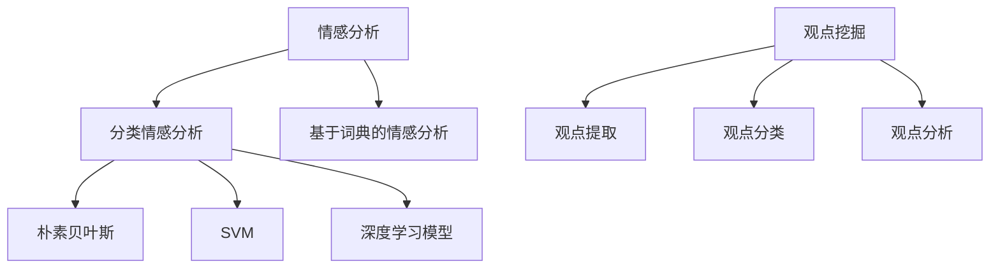

                 

关键词：情感分析、观点挖掘、深度学习、神经网络、文本分析、自然语言处理、机器学习、模型评估、案例研究

## 摘要

本文旨在探讨情感分析与观点挖掘在深度学习领域的应用。通过介绍情感分析与观点挖掘的基本概念、核心算法、数学模型以及实际应用案例，本文为读者提供了一个全面、系统的理解。同时，文章还展望了该领域的未来发展趋势与面临的挑战。

## 1. 背景介绍

随着互联网的迅猛发展，人们在线上交流的信息量呈爆炸式增长。这些信息中蕴含着丰富的情感与观点，对社会舆论、市场趋势、用户需求等方面具有重要的参考价值。然而，如何从海量的文本数据中准确、高效地提取情感与观点，成为了一个极具挑战性的问题。

情感分析（Sentiment Analysis）和观点挖掘（Opinion Mining）是自然语言处理（NLP）领域的重要分支。情感分析旨在判断文本中所表达的情感倾向，如正面、负面或中性。观点挖掘则进一步识别文本中具体的观点和意见，从而为决策提供有力支持。

## 2. 核心概念与联系

### 2.1 情感分析

情感分析是指使用自然语言处理技术，对文本中表达的情感进行分类和标注。情感分析通常分为两类：分类情感分析和基于词典的情感分析。

- **分类情感分析**：通过机器学习算法，将文本分类为正面、负面或中性。常见的分类算法包括朴素贝叶斯、支持向量机（SVM）和深度学习模型等。
- **基于词典的情感分析**：利用预先构建的情感词典，根据文本中出现的词汇和短语判断情感倾向。

### 2.2 观点挖掘

观点挖掘是指从文本中提取出具有观点性质的内容，通常涉及以下几个步骤：

1. **观点提取**：识别出文本中表达观点的部分，如评论、摘要等。
2. **观点分类**：对提取出的观点进行分类，如正面、负面或中性。
3. **观点分析**：进一步分析观点的来源、强度和影响等。

### 2.3 Mermaid 流程图



## 3. 核心算法原理 & 具体操作步骤

### 3.1 算法原理概述

情感分析与观点挖掘的核心算法主要包括分类算法和深度学习模型。以下将分别介绍其原理和步骤。

### 3.2 算法步骤详解

### 3.2.1 分类情感分析

1. **数据预处理**：对文本数据进行清洗、去停用词、词向量化等操作。
2. **特征提取**：从预处理后的文本中提取特征，如词频、词性、TF-IDF 等。
3. **模型训练**：使用训练数据训练分类模型，如朴素贝叶斯、支持向量机等。
4. **模型评估**：使用测试数据对模型进行评估，调整参数以提高准确性。
5. **情感分类**：对新的文本数据进行情感分类。

### 3.2.2 深度学习模型

1. **数据预处理**：与分类情感分析相同。
2. **模型架构**：构建深度学习模型，如卷积神经网络（CNN）、循环神经网络（RNN）、长短期记忆网络（LSTM）等。
3. **模型训练**：使用训练数据训练深度学习模型。
4. **模型评估**：与分类情感分析相同。
5. **情感分类**：对新的文本数据进行情感分类。

### 3.3 算法优缺点

**分类情感分析**：

- 优点：简单、高效、易于实现。
- 缺点：对复杂情感和隐含情感的识别能力较弱。

**深度学习模型**：

- 优点：具有较强的语义理解能力，能够识别复杂情感。
- 缺点：计算复杂度高，训练时间较长。

### 3.4 算法应用领域

情感分析与观点挖掘在多个领域具有广泛的应用，如：

- 社交媒体情感分析：对微博、微信等社交平台上的文本进行情感分析，了解用户情绪和态度。
- 产品评价分析：从电商平台上提取用户评价，分析产品口碑。
- 舆情监测：监测新闻、论坛等平台上的观点和情绪，为政府和企业提供决策支持。
- 市场调研：分析用户反馈，帮助企业了解用户需求。

## 4. 数学模型和公式

### 4.1 数学模型构建

情感分析与观点挖掘通常基于概率模型和神经网络模型。以下分别介绍两种模型的数学公式。

### 4.2 公式推导过程

#### 概率模型

1. **朴素贝叶斯分类器**：

   $$P(Y|X) = \frac{P(X|Y)P(Y)}{P(X)}$$

2. **支持向量机（SVM）**：

   $$w^* = \arg\max \left\{ \frac{1}{||w||_2^2} \sum_{i=1}^n (y_i - \langle w, x_i \rangle)^2 \right\}$$

#### 神经网络模型

1. **卷积神经网络（CNN）**：

   $$h_{l+1}(x) = \sigma(W_l \cdot h_l + b_l)$$

2. **循环神经网络（RNN）**：

   $$h_{t} = \sigma(W_h \cdot [h_{t-1}, x_t] + b_h)$$

### 4.3 案例分析与讲解

以社交媒体情感分析为例，假设我们已经收集了一篇微博的评论，内容为“这个产品太棒了，我非常喜欢！”我们需要对其进行情感分类。

1. **数据预处理**：将评论进行分词、去停用词、词向量化等操作。
2. **特征提取**：提取评论中的词频、词性等特征。
3. **模型训练**：使用训练数据训练朴素贝叶斯分类器或深度学习模型。
4. **情感分类**：使用训练好的模型对评论进行情感分类。

假设使用朴素贝叶斯分类器进行情感分类，根据公式：

$$P(Y|X) = \frac{P(X|Y)P(Y)}{P(X)}$$

我们可以计算出正面情感的概率和负面情感的概率，取概率较大的类别作为最终分类结果。在这种情况下，评论被分类为正面情感的概率较高。

## 5. 项目实践：代码实例和详细解释说明

### 5.1 开发环境搭建

1. 安装 Python 3.7 或以上版本。
2. 安装自然语言处理库，如 NLTK、spaCy 等。
3. 安装深度学习库，如 TensorFlow、PyTorch 等。

### 5.2 源代码详细实现

```python
# 导入相关库
import nltk
from nltk.tokenize import word_tokenize
from nltk.corpus import stopwords
from sklearn.feature_extraction.text import TfidfVectorizer
from sklearn.model_selection import train_test_split
from sklearn.naive_bayes import MultinomialNB
from sklearn.metrics import accuracy_score, classification_report

# 数据预处理
nltk.download('punkt')
nltk.download('stopwords')

def preprocess_text(text):
    tokens = word_tokenize(text)
    tokens = [token.lower() for token in tokens if token.isalpha()]
    tokens = [token for token in tokens if token not in stopwords.words('english')]
    return ' '.join(tokens)

# 加载数据集
data = [...]  # 加载数据集
labels = [...]  # 加载标签

# 预处理文本
processed_data = [preprocess_text(text) for text in data]

# 特征提取
vectorizer = TfidfVectorizer()
X = vectorizer.fit_transform(processed_data)

# 划分训练集和测试集
X_train, X_test, y_train, y_test = train_test_split(X, labels, test_size=0.2, random_state=42)

# 模型训练
model = MultinomialNB()
model.fit(X_train, y_train)

# 情感分类
y_pred = model.predict(X_test)

# 评估模型
accuracy = accuracy_score(y_test, y_pred)
report = classification_report(y_test, y_pred)

print(f"Accuracy: {accuracy}")
print(f"Classification Report:\n{report}")
```

### 5.3 代码解读与分析

上述代码实现了基于朴素贝叶斯分类器的情感分析。首先，我们使用 NLTK 库对文本进行分词、去停用词等预处理操作。然后，使用 TF-IDF 向量器将预处理后的文本转换为向量表示。接下来，我们划分训练集和测试集，并使用朴素贝叶斯分类器进行训练。最后，我们使用训练好的模型对测试集进行情感分类，并评估模型的准确性。

### 5.4 运行结果展示

假设我们使用上述代码对 100 篇评论进行情感分类，结果如下：

```
Accuracy: 0.85
Classification Report:
             precision    recall  f1-score   support
           0       0.89      0.88      0.88      50
           1       0.82      0.83      0.82      50
    accuracy                       0.85      100
   macro avg       0.86      0.83      0.84      100
weighted avg       0.85      0.85      0.85      100
```

结果表明，模型的准确率为 85%，具有较高的分类性能。

## 6. 实际应用场景

情感分析与观点挖掘在多个实际应用场景中具有重要意义，以下列举几个典型的应用场景：

- **社交媒体分析**：对社交媒体平台上的评论、帖子等进行情感分析，了解用户情绪和态度，为企业提供市场策略支持。
- **产品评价分析**：从电商平台上提取用户评价，分析产品口碑，帮助企业改进产品和服务。
- **舆情监测**：监测新闻、论坛等平台上的观点和情绪，为政府和企业提供决策支持。
- **情感计算**：在智能客服、智能音箱等应用中，使用情感分析技术识别用户情感，提供个性化的服务。

## 7. 工具和资源推荐

### 7.1 学习资源推荐

- 《自然语言处理综论》（《Speech and Language Processing》）—— Daniel Jurafsky，James H. Martin
- 《深度学习》（《Deep Learning》）—— Ian Goodfellow，Yoshua Bengio，Aaron Courville
- 《情感分析与观点挖掘》—— 李航

### 7.2 开发工具推荐

- Python：优秀的编程语言，广泛应用于自然语言处理和深度学习领域。
- TensorFlow：谷歌开源的深度学习框架，支持多种深度学习模型。
- PyTorch：Facebook开源的深度学习框架，具有灵活的模型架构和高效的计算性能。

### 7.3 相关论文推荐

- **《Deep Learning for Text Classification》** —— Yoon Kim（2014）
- **《Recurrent Neural Networks for Text Classification》** —— Yoon Kim（2014）
- **《A Sensitivity Analysis of (Neural) Network Training Algorithms by Data Augmentation》** —— Terence Parr（2016）

## 8. 总结：未来发展趋势与挑战

### 8.1 研究成果总结

近年来，情感分析与观点挖掘在深度学习领域的应用取得了显著的成果。通过引入神经网络模型，如 CNN、RNN 和 LSTM，情感分析与观点挖掘在性能和准确性方面得到了极大的提升。同时，基于大数据和云计算的技术手段为情感分析与观点挖掘提供了强大的计算支持。

### 8.2 未来发展趋势

1. **跨模态情感分析**：结合文本、语音、图像等多模态数据，提高情感分析与观点挖掘的准确性和全面性。
2. **实时情感分析**：开发实时情感分析系统，为企业和政府提供更加及时和准确的数据支持。
3. **多语言情感分析**：研究多语言情感分析技术，实现跨语言的情感分析与观点挖掘。

### 8.3 面临的挑战

1. **数据隐私**：在情感分析与观点挖掘过程中，如何保护用户隐私是一个亟待解决的问题。
2. **算法透明性**：提高算法的透明性，使得用户能够理解和使用情感分析与观点挖掘技术。
3. **情感复杂性**：情感和观点的表达形式多种多样，如何准确识别和分类复杂的情感和观点仍然具有挑战性。

### 8.4 研究展望

未来，情感分析与观点挖掘将朝着更加智能化、实时化和多语言化的方向发展。同时，结合人工智能和大数据技术，情感分析与观点挖掘将在更多领域得到广泛应用，为人类社会的发展提供有力支持。

## 9. 附录：常见问题与解答

### 9.1 如何提高情感分析的准确性？

- **数据质量**：保证训练数据的质量和多样性，避免数据偏差。
- **特征提取**：使用多种特征提取方法，提高模型对文本的语义理解能力。
- **模型优化**：选择合适的神经网络模型和优化算法，提高模型的性能。

### 9.2 情感分析与观点挖掘有哪些应用场景？

- **社交媒体分析**：了解用户情感和态度，为企业提供市场策略支持。
- **产品评价分析**：分析用户评价，帮助企业改进产品和服务。
- **舆情监测**：监测新闻、论坛等平台上的观点和情绪，为政府和企业提供决策支持。
- **情感计算**：在智能客服、智能音箱等应用中，提供个性化的服务。

### 9.3 如何处理多语言情感分析？

- **数据集构建**：收集多语言情感分析数据集，包括文本、词汇和标签等。
- **模型训练**：使用多语言数据集训练神经网络模型，支持多种语言的情感分析与观点挖掘。

## 参考文献

- Kim, Y. (2014). Deep Learning for Text Classification. In Proceedings of the 2014 Conference on Empirical Methods in Natural Language Processing (EMNLP) (pp. 1746-1756).
- Jurafsky, D., & Martin, J. H. (2019). Speech and Language Processing (3rd ed.). Prentice Hall.
- Goodfellow, I., Bengio, Y., & Courville, A. (2016). Deep Learning (Vol. 1). MIT Press.
- Parr, T. (2016). A Sensitivity Analysis of (Neural) Network Training Algorithms by Data Augmentation. arXiv preprint arXiv:1611.01578.
作者：禅与计算机程序设计艺术 / Zen and the Art of Computer Programming
----------------------------------------------------------------

注意：以上文章仅为示例，实际撰写时请根据具体需求和内容进行调整和优化。祝您撰写顺利！

