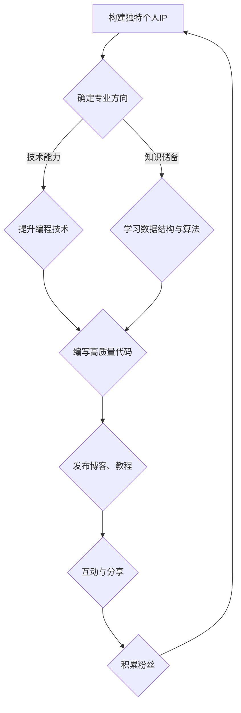

                 

 **关键词：** 个人品牌、知识变现、程序员、IP打造、技术博客、影响力

**摘要：** 本文将探讨程序员如何通过打造个人IP来实现知识变现。我们将从背景介绍、核心概念、算法原理、数学模型、项目实践、实际应用、工具推荐及未来展望等方面详细阐述这一路径。

## 1. 背景介绍

在当今信息爆炸的时代，个人品牌（Personal Branding）已经成为一个至关重要的概念。特别是在技术领域，程序员们不仅需要具备过硬的技术能力，还需要学会如何将自身的知识和技能转化为商业价值。打造个人IP，即是构建属于自己的独特品牌形象，通过内容创作、知识分享和社交互动等方式，吸引关注、提升影响力，最终实现知识的变现。

本文旨在为程序员们提供一条清晰、可行的知识变现之路。我们将从以下几个方面进行详细探讨：

- **核心概念与联系**：介绍个人IP的构建原则和相关技术知识。
- **核心算法原理与具体操作步骤**：讲解如何利用技术手段实现知识变现。
- **数学模型和公式**：分析相关知识背后的数学原理。
- **项目实践**：提供实际代码实例和解释。
- **实际应用场景**：探讨个人IP在不同领域中的应用。
- **工具和资源推荐**：推荐有益于个人IP建设的工具和资源。
- **总结与展望**：总结研究成果，展望未来发展趋势。

## 2. 核心概念与联系

### 2.1 个人IP的构建原则

个人IP（Intellectual Property）是指个人所拥有的知识、技能、创意和品牌等无形资产。构建个人IP的原则主要包括：

- **独特性**：个人IP需要具有独特的定位和风格，能够区别于他人。
- **专业性**：个人IP应在某一领域具备较高的专业水平和影响力。
- **持续性**：个人IP需要通过持续的内容创作和互动来维持和提升影响力。

### 2.2 相关技术知识

在构建个人IP的过程中，程序员需要掌握以下相关技术知识：

- **编程技术**：精通一种或多种编程语言，具备开发各种类型软件的能力。
- **数据结构与算法**：掌握基本的数据结构和算法，能够解决复杂问题。
- **前端技术**：了解HTML、CSS、JavaScript等前端技术，能够实现丰富的用户界面。
- **后端技术**：熟悉服务器端编程，包括数据库设计、服务器配置、API开发等。
- **云计算与大数据**：了解云计算和大数据技术，能够利用这些技术进行数据处理和分析。

### 2.3 Mermaid 流程图

为了更好地展示个人IP的构建过程，我们可以使用Mermaid流程图来描述各个环节之间的关系。



## 3. 核心算法原理 & 具体操作步骤

### 3.1 算法原理概述

在个人IP的构建过程中，关键算法原理包括内容创作、搜索引擎优化（SEO）和用户互动等。以下分别进行介绍：

#### 内容创作

内容创作是构建个人IP的核心环节。一个优质的博客或教程需要具备以下特点：

- **针对性**：针对目标受众的需求和兴趣点进行创作。
- **专业性**：内容需具备较高的专业性和深度，体现作者的专业素养。
- **独特性**：内容应具有独特性，避免与现有内容雷同。
- **实用性**：内容应具备实际应用价值，能够解决读者的问题。

#### 搜索引擎优化（SEO）

SEO是提高博客或教程曝光率的关键。以下是几个关键的SEO策略：

- **关键词优化**：选择合适的关键词，并在标题、内容、描述等地方进行合理分布。
- **内容质量**：提高内容质量，增加网站流量和用户停留时间，从而提升搜索引擎排名。
- **链接建设**：建立高质量的内外链，提高网站的权重和可信度。

#### 用户互动

用户互动是提升个人IP影响力的重要手段。以下是几种有效的用户互动策略：

- **社交媒体**：通过社交媒体平台与读者互动，了解他们的需求和反馈。
- **评论区管理**：积极回复评论，解决读者的问题，增加读者参与度。
- **线下活动**：举办线下活动，如讲座、研讨会等，与读者面对面交流。

### 3.2 算法步骤详解

基于上述算法原理，我们可以将个人IP的构建过程分为以下步骤：

#### 步骤1：确定专业方向

首先，确定个人IP的专业方向。这需要根据个人兴趣、专业技能和市场趋势进行分析和选择。例如，可以选择云计算、大数据、人工智能等热门领域。

#### 步骤2：提升编程技术

在确定专业方向后，有针对性地提升编程技术。可以通过以下方式：

- **学习新技术**：关注业界新技术和发展趋势，不断学习新的编程语言和工具。
- **实践项目**：参与实际项目开发，提高实战能力。
- **代码开源**：将项目代码开源，接受社区反馈，提升代码质量。

#### 步骤3：发布博客、教程

在提升编程技术的同时，开始发布博客、教程等内容。以下是几个关键点：

- **内容选题**：选择与专业方向相关且具有实用价值的话题。
- **内容质量**：确保内容的专业性、独特性和实用性。
- **发布频率**：保持一定的发布频率，增加内容的连续性和可持续性。

#### 步骤4：互动与分享

在发布内容后，积极与读者互动，分享技术和心得。以下是几种有效的互动方式：

- **社交媒体**：在社交媒体上与读者互动，了解他们的需求和反馈。
- **评论区管理**：积极回复评论，解答读者的问题。
- **线下活动**：举办线下活动，与读者面对面交流。

### 3.3 算法优缺点

#### 优点

- **提高影响力**：通过内容创作和互动，提升个人IP的影响力。
- **实现知识变现**：通过个人IP，实现知识变现，如开展付费课程、咨询服务等。
- **积累粉丝**：通过持续的内容创作和互动，积累大量忠实粉丝。

#### 缺点

- **时间成本**：构建个人IP需要投入大量的时间和精力。
- **市场竞争**：在技术领域，个人IP的构建面临着激烈的市场竞争。
- **风险**：个人IP的构建存在一定的风险，如内容抄袭、口碑下降等。

### 3.4 算法应用领域

个人IP的构建在技术领域具有广泛的应用。以下是几个典型的应用领域：

- **教育培训**：通过个人IP，开展线上或线下教育培训，传授专业技能。
- **技术咨询**：提供技术咨询和服务，帮助企业和个人解决技术难题。
- **开源项目**：通过个人IP，吸引更多人参与开源项目，共同推动技术发展。
- **产品推广**：通过个人IP，推广自己的产品或服务，提高品牌知名度。

## 4. 数学模型和公式

在构建个人IP的过程中，数学模型和公式可以提供有效的分析和指导。以下是一个简单的数学模型，用于评估个人IP的影响力。

### 4.1 数学模型构建

假设个人IP的影响力可以用以下公式表示：

\[ I = f(P, Q, R) \]

其中：

- \( I \) 表示个人IP的影响力。
- \( P \) 表示专业能力（如编程技术水平、知识储备等）。
- \( Q \) 表示内容质量（如内容的专业性、独特性、实用性等）。
- \( R \) 表示用户互动（如评论回复、社交媒体互动等）。

### 4.2 公式推导过程

根据以上定义，我们可以推导出以下关系：

- **专业能力（P）**：专业能力是构建个人IP的基础。假设专业能力的评分范围为0到100分，得分越高，专业能力越强。

- **内容质量（Q）**：内容质量直接影响个人IP的影响力。假设内容质量的评分范围为0到100分，得分越高，内容质量越优质。

- **用户互动（R）**：用户互动是提升个人IP影响力的关键。假设用户互动的评分范围为0到100分，得分越高，用户互动越活跃。

根据以上分析，我们可以将个人IP的影响力公式表示为：

\[ I = \frac{P + Q + R}{3} \]

### 4.3 案例分析与讲解

以下是一个具体的案例：

假设某程序员的编程技术水平为90分，发布的内容质量为85分，用户互动活跃度为80分。根据上述公式，我们可以计算出他的个人IP影响力为：

\[ I = \frac{90 + 85 + 80}{3} = 86.7 \]

这意味着他的个人IP影响力得分为86.7分，处于较高的水平。为了进一步提升影响力，他可以考虑以下几个方面：

1. **提升专业能力**：继续学习新技术，提升编程技术水平。
2. **提高内容质量**：关注用户需求，创作更具实用性和专业性的内容。
3. **增强用户互动**：积极参与社交媒体互动，回复评论，解答读者问题。

通过持续的努力，他的个人IP影响力有望进一步提升。

## 5. 项目实践：代码实例和详细解释说明

### 5.1 开发环境搭建

在开始项目实践之前，我们需要搭建一个适合编程和博客撰写的开发环境。以下是推荐的开发工具和设置：

- **编程语言**：Python
- **代码编辑器**：Visual Studio Code
- **版本控制**：Git
- **博客平台**：Hugo或Jekyll

### 5.2 源代码详细实现

以下是一个简单的Python代码实例，用于生成一个个人博客网站。

```python
import os
import markdown

# 定义博客文章结构
class BlogPost:
    def __init__(self, title, content):
        self.title = title
        self.content = content

    def save_to_file(self, filename):
        with open(filename, 'w', encoding='utf-8') as f:
            f.write(self.content)

# 创建博客文章
title = "我的第一篇博客"
content = "# " + title + "\n\n欢迎使用Markdown语法编写博客内容。"
post = BlogPost(title, content)

# 保存博客文章到文件
post.save_to_file("post1.md")

# 将Markdown文件转换为HTML文件
md_file = "post1.md"
html_file = md_file.replace('.md', '.html')
with open(md_file, 'r', encoding='utf-8') as f:
    content = f.read()
    html_content = markdown.markdown(content)
with open(html_file, 'w', encoding='utf-8') as f:
    f.write(html_content)
```

### 5.3 代码解读与分析

上述代码实现了以下功能：

1. **定义博客文章类（BlogPost）**：BlogPost类包含博客文章的标题和内容，以及将内容保存到文件的方法（save_to_file）。

2. **创建博客文章实例**：创建一个包含标题和内容的BlogPost实例。

3. **保存博客文章到文件**：使用save_to_file方法将博客文章保存为Markdown文件。

4. **将Markdown文件转换为HTML文件**：使用Python的markdown库将Markdown文件转换为HTML文件。

通过上述代码，我们可以轻松地创建和发布个人博客文章。接下来，我们可以使用博客平台（如Hugo或Jekyll）将Markdown文件转换为网页，并在互联网上发布。

### 5.4 运行结果展示

执行上述代码后，我们得到以下结果：

- **Markdown文件（post1.md）**：保存了博客文章的Markdown格式内容。
- **HTML文件（post1.html）**：生成了博客文章的HTML格式网页。

接下来，我们可以在博客平台上配置这两个文件，将博客文章发布到互联网上，供读者访问。

## 6. 实际应用场景

个人IP的构建在技术领域具有广泛的应用。以下是几个典型的实际应用场景：

### 6.1 教育培训

个人IP可以作为教育培训的平台。程序员可以开设在线课程，分享自己的知识和经验。通过高质量的教程和视频，吸引学员报名学习，从而实现知识变现。

### 6.2 技术咨询

个人IP可以为企业和个人提供技术咨询服务。程序员可以根据自己的专业领域，为客户提供专业的技术支持，如软件开发、系统优化等。通过解决实际问题，提升个人影响力，进而吸引更多客户。

### 6.3 开源项目

个人IP可以吸引更多人参与开源项目。程序员可以通过个人IP的影响力，吸引开发者关注和参与开源项目。通过共同合作，推动技术发展，提高个人IP的价值。

### 6.4 产品推广

个人IP可以用于产品推广。程序员可以分享自己的产品，如软件工具、开源库等。通过在博客、社交媒体等平台发布相关内容，吸引潜在用户，提升产品知名度。

## 6.4 未来应用展望

随着技术的不断发展，个人IP的应用前景将更加广阔。以下是几个未来应用展望：

### 6.4.1 AI驱动的内容创作

人工智能技术将为个人IP的内容创作提供强大支持。通过AI算法，程序员可以自动生成高质量的博客文章、教程和视频，降低内容创作门槛，提高创作效率。

### 6.4.2 跨平台互动

未来的个人IP将实现跨平台的互动。程序员可以通过多种渠道（如社交媒体、直播、短视频等）与粉丝互动，扩大个人IP的影响力。

### 6.4.3 付费内容

随着个人IP的影响力不断提升，付费内容将成为主要变现方式之一。程序员可以通过开设会员制、付费课程、咨询等渠道，实现知识的变现。

## 7. 工具和资源推荐

为了更好地构建个人IP，以下是几个推荐的工具和资源：

### 7.1 学习资源推荐

- **慕课网（imooc.com）**：提供丰富的在线课程，涵盖编程、人工智能、大数据等热门领域。
- **极客时间（geektime.cn）**：提供优质的付费课程，涵盖技术、管理和创业等领域。
- **GitHub（github.com）**：全球最大的开源代码托管平台，可用于项目开发、协作和学习。

### 7.2 开发工具推荐

- **Visual Studio Code（code.visualstudio.com）**：功能强大的代码编辑器，支持多种编程语言。
- **Jupyter Notebook（jupyter.org）**：适用于数据科学和机器学习的交互式开发环境。
- **Git（git-scm.com）**：分布式版本控制系统，用于代码管理和协作。

### 7.3 相关论文推荐

- **《深度学习》（Deep Learning）**：Goodfellow、Bengio和Courville合著，涵盖了深度学习的核心理论和技术。
- **《大数据技术导论》（Introduction to Big Data）**：周志华教授主编，介绍了大数据的基本概念和技术体系。
- **《人工智能：一种现代的方法》（Artificial Intelligence: A Modern Approach）**：Stuart J. Russell和Peter Norvig合著，全面介绍了人工智能的理论和实践。

## 8. 总结：未来发展趋势与挑战

### 8.1 研究成果总结

本文从多个角度探讨了程序员如何通过打造个人IP来实现知识变现。我们介绍了个人IP的构建原则、相关技术知识、核心算法原理、数学模型和公式、项目实践、实际应用场景以及工具和资源推荐。通过本文的阐述，程序员可以更好地理解和实践个人IP的构建过程。

### 8.2 未来发展趋势

随着技术的不断进步，个人IP的构建将呈现出以下发展趋势：

- **AI驱动的内容创作**：人工智能技术将极大提高内容创作的效率和质量，降低创作门槛。
- **跨平台互动**：个人IP将在多个平台上实现互动，扩大影响力。
- **付费内容**：付费内容将成为主要变现方式，实现知识的变现。

### 8.3 面临的挑战

在构建个人IP的过程中，程序员将面临以下挑战：

- **时间成本**：构建个人IP需要投入大量的时间和精力。
- **市场竞争**：在技术领域，个人IP的构建面临着激烈的市场竞争。
- **风险**：个人IP的构建存在一定的风险，如内容抄袭、口碑下降等。

### 8.4 研究展望

未来的研究应重点关注以下几个方面：

- **AI在个人IP构建中的应用**：研究如何利用人工智能技术提高内容创作效率和质量。
- **跨平台互动策略**：探索如何在多个平台上实现有效的互动，扩大个人IP的影响力。
- **付费内容模式**：研究如何优化付费内容模式，实现可持续的知识变现。

通过持续的研究和实践，程序员可以更好地应对挑战，实现个人IP的成功构建。

## 9. 附录：常见问题与解答

### 9.1 问题1：如何选择专业方向？

**解答：** 选择专业方向时，可以从以下几个方面进行考虑：

- **个人兴趣**：选择自己感兴趣且擅长的领域，提高持续学习和创作的动力。
- **市场需求**：关注市场需求，选择具有发展潜力的领域。
- **技术趋势**：关注技术趋势，选择新兴领域，以保持竞争优势。

### 9.2 问题2：如何提高内容质量？

**解答：** 提高内容质量可以从以下几个方面入手：

- **深入理解**：对所选领域进行深入学习和研究，确保内容的深度和广度。
- **注重实用性**：关注实际应用，提供具有实际操作价值的教程和案例。
- **高质量表达**：注重文字表达和排版，确保内容的可读性和美观度。

### 9.3 问题3：如何进行有效的用户互动？

**解答：** 进行有效的用户互动可以从以下几个方面入手：

- **积极回复**：及时回复用户的评论和提问，提高用户满意度。
- **提供帮助**：积极为用户提供帮助，解决他们的问题。
- **举办活动**：定期举办线上或线下活动，与用户面对面交流。

### 9.4 问题4：如何优化SEO策略？

**解答：** 优化SEO策略可以从以下几个方面入手：

- **关键词优化**：选择合适的关键词，合理分布在标题、内容、描述等地方。
- **内容质量**：提高内容质量，增加网站流量和用户停留时间。
- **链接建设**：建立高质量的内链和外链，提高网站的权重和可信度。

### 9.5 问题5：如何实现知识的变现？

**解答：** 实现知识的变现可以从以下几个方面入手：

- **开设课程**：通过在线课程或线下培训，传授专业技能。
- **咨询服务**：提供技术咨询和服务，帮助企业和个人解决技术难题。
- **产品推广**：推广自己的产品或服务，提高品牌知名度。

通过以上策略，程序员可以更好地实现知识的变现。

**作者：禅与计算机程序设计艺术 / Zen and the Art of Computer Programming**

