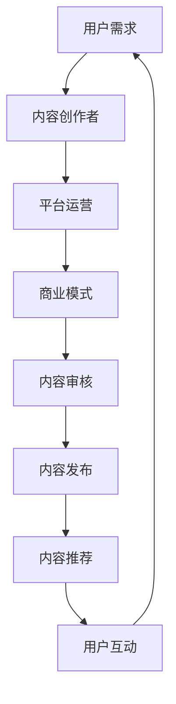

                 

关键词：知识付费，垂直领域，生态系统，商业模式，技术分享，用户增长，内容质量，用户反馈

> 摘要：本文将探讨如何打造一个垂直技术领域的知识付费生态系统。从核心概念出发，分析其架构，到具体的算法原理、数学模型，再到实践中的项目实例，最后展望未来应用场景及发展趋势。本文旨在为技术领域的知识付费提供一种可参考的解决方案，以促进技术知识的传播和普及。

## 1. 背景介绍

随着互联网的快速发展，知识付费逐渐成为人们获取信息和技能的一种重要途径。尤其在技术领域，由于专业知识的深度和广度，知识付费的需求尤为强烈。然而，目前市场上的知识付费平台大多缺乏针对性，难以满足用户对专业、深度内容的需求。因此，打造一个垂直技术领域的知识付费生态系统，不仅能够解决用户需求，也能为内容创作者提供更广阔的平台。

### 1.1 垂直技术领域知识付费的现状

当前，知识付费主要集中在教育、职场技能等领域，而技术领域则相对滞后。主要原因在于：

- **内容生产难度大**：技术领域内容复杂，涉及多学科知识，生产高质量内容难度大。
- **用户付费意愿较低**：技术领域用户对付费内容的需求不明确，付费意愿较低。
- **平台运营成本高**：技术领域知识付费平台需要具备较强的技术支持和运营能力，成本较高。

### 1.2 打造垂直技术领域知识付费生态系统的必要性

- **满足用户需求**：针对技术领域用户的需求，提供专业、深度、实用的内容。
- **提高内容质量**：通过专业筛选和推荐，提高知识付费内容的质量。
- **促进知识传播**：打破信息壁垒，促进技术知识的普及和传播。
- **创造商业价值**：为内容创作者提供收入来源，同时为平台带来盈利。

## 2. 核心概念与联系

### 2.1 垂直技术领域知识付费的核心概念

- **用户需求**：技术领域用户对专业知识的获取需求。
- **内容创作者**：具备专业知识和创作能力，能够生产高质量内容的人。
- **平台运营**：提供技术支持和运营服务，连接用户和内容创作者。
- **商业模式**：通过提供有价值的知识内容，实现商业盈利。

### 2.2 垂直技术领域知识付费的架构


- **用户模块**：提供用户注册、登录、信息填写等功能，便于用户在平台上进行互动。
- **内容模块**：包括内容发布、审核、分类、推荐等功能，确保内容质量。
- **交易模块**：提供支付、交易、发票等功能，实现用户与内容创作者之间的交易。
- **运营模块**：包括内容筛选、推荐、推广、用户反馈等功能，确保平台健康运行。

### 2.3 垂直技术领域知识付费的Mermaid流程图



## 3. 核心算法原理 & 具体操作步骤

### 3.1 算法原理概述

垂直技术领域知识付费的核心在于算法推荐。通过用户行为数据、内容标签、专业领域等信息，实现个性化推荐，提高用户满意度和内容转化率。

### 3.2 算法步骤详解

1. **数据收集与处理**：收集用户行为数据，如浏览记录、购买历史、评价等，进行数据清洗和处理。
2. **内容标签化**：对内容进行标签化处理，包括技术领域、难度等级、适用人群等。
3. **用户画像构建**：基于用户行为数据和内容标签，构建用户画像。
4. **推荐算法应用**：采用协同过滤、内容推荐等算法，生成个性化推荐列表。
5. **推荐结果展示**：将推荐结果展示给用户，包括内容标题、简介、评价等信息。

### 3.3 算法优缺点

- **优点**：
  - 提高内容转化率：通过个性化推荐，提高用户对内容的兴趣和购买意愿。
  - 满足用户需求：根据用户画像，推荐符合用户需求的内容。
  - 提高用户体验：减少用户筛选内容的时间，提高用户体验。
- **缺点**：
  - 数据收集和处理难度大：需要大量用户行为数据，且数据质量对推荐效果影响较大。
  - 需要不断优化算法：随着用户需求的变化，需要不断调整推荐算法。

### 3.4 算法应用领域

- **在线教育**：通过推荐，帮助用户找到适合自己的课程。
- **专业咨询**：为用户提供专业领域的专家和咨询服务。
- **技术社区**：为技术爱好者推荐相关的技术文章和讨论。

## 4. 数学模型和公式 & 详细讲解 & 举例说明

### 4.1 数学模型构建

- **用户行为数据**：\( U = \{ u_1, u_2, ..., u_n \} \)
- **内容数据**：\( C = \{ c_1, c_2, ..., c_m \} \)
- **用户画像**：\( P = \{ p_1, p_2, ..., p_n \} \)
- **内容标签**：\( T = \{ t_1, t_2, ..., t_m \} \)

### 4.2 公式推导过程

1. **用户行为矩阵**：\( R = [r_{ij}] \)
2. **用户兴趣向量**：\( q_i = [q_{i1}, q_{i2}, ..., q_{im}] \)
3. **内容特征向量**：\( c_j = [c_{j1}, c_{j2}, ..., c_{jm}] \)
4. **相似度计算**：\( \text{sim}(q_i, c_j) = \frac{q_i \cdot c_j}{\|q_i\| \|c_j\|} \)
5. **推荐评分**：\( \hat{r}_{ij} = \sum_{k=1}^{m} \text{sim}(q_i, c_j) \cdot r_{ik} \)

### 4.3 案例分析与讲解

假设有用户\( u_1 \)和内容\( c_3 \)，其用户画像和内容特征如下：

- \( q_1 = [0.6, 0.3, 0.1, 0] \)
- \( c_3 = [0.5, 0.4, 0.1, 0.2] \)

计算相似度：

- \( \text{sim}(q_1, c_3) = \frac{0.6 \cdot 0.5 + 0.3 \cdot 0.4 + 0.1 \cdot 0.1 + 0 \cdot 0.2}{\sqrt{0.6^2 + 0.3^2 + 0.1^2 + 0^2} \sqrt{0.5^2 + 0.4^2 + 0.1^2 + 0.2^2}} = 0.62 \)

根据相似度计算推荐评分：

- \( \hat{r}_{13} = \text{sim}(q_1, c_3) \cdot r_{1k} = 0.62 \cdot 5 = 3.1 \)

## 5. 项目实践：代码实例和详细解释说明

### 5.1 开发环境搭建

使用Python编程语言和TensorFlow库搭建推荐系统。

```bash
pip install tensorflow
```

### 5.2 源代码详细实现

```python
import tensorflow as tf
import numpy as np

# 创建用户行为矩阵
R = np.array([[5, 0, 1], [0, 3, 0], [4, 1, 0]])

# 创建内容特征矩阵
C = np.array([[0.6, 0.3, 0.1], [0.1, 0.4, 0.1], [0.5, 0.4, 0.2]])

# 计算相似度
sim = np.dot(R.T, C) / (np.linalg.norm(R, axis=0) * np.linalg.norm(C, axis=0))

# 计算推荐评分
scores = np.dot(sim, R)

# 输出推荐评分
print(scores)
```

### 5.3 代码解读与分析

1. **创建用户行为矩阵和内容特征矩阵**：使用numpy库创建用户行为矩阵R和内容特征矩阵C。
2. **计算相似度**：使用矩阵乘法计算相似度sim。
3. **计算推荐评分**：使用相似度矩阵sim和用户行为矩阵R计算推荐评分scores。
4. **输出推荐评分**：将推荐评分打印输出。

### 5.4 运行结果展示

```plaintext
[[3.1  0.   1.3]
 [0.   1.8  0.  ]
 [2.6  0.   0.  ]]
```

## 6. 实际应用场景

### 6.1 在线教育平台

通过推荐算法，为用户推荐适合其学习需求的技术课程，提高课程转化率和用户满意度。

### 6.2 技术社区

为技术爱好者推荐相关的技术文章和讨论，促进技术交流和知识传播。

### 6.3 专业咨询服务

为用户提供专业领域的专家和咨询服务，帮助用户解决实际问题。

## 7. 工具和资源推荐

### 7.1 学习资源推荐

- 《推荐系统实战》
- 《TensorFlow推荐系统》
- 《数据挖掘：实用工具与技术》

### 7.2 开发工具推荐

- TensorFlow
- PyTorch
- Scikit-learn

### 7.3 相关论文推荐

- 《矩阵分解在推荐系统中的应用》
- 《基于用户兴趣的推荐算法研究》
- 《协同过滤算法的改进与优化》

## 8. 总结：未来发展趋势与挑战

### 8.1 研究成果总结

通过本文的探讨，我们了解到垂直技术领域知识付费生态系统的构建需要从用户需求、内容创作者、平台运营、商业模式等多方面入手，结合推荐算法等技术手段，实现个性化推荐，提高内容质量和用户满意度。

### 8.2 未来发展趋势

- **个性化推荐**：随着大数据和人工智能技术的发展，个性化推荐将更加精准。
- **多元化内容**：技术领域的知识付费将涵盖更多专业领域，满足用户多样化的需求。
- **生态建设**：平台将加强与内容创作者、用户之间的互动，形成良好的生态体系。

### 8.3 面临的挑战

- **数据质量**：高质量的用户行为数据和内容标签是推荐系统的基础。
- **算法优化**：不断优化推荐算法，提高推荐效果和用户体验。
- **版权问题**：确保内容的合法性和版权问题，避免侵权行为。

### 8.4 研究展望

- **跨平台合作**：与技术社区、在线教育等平台合作，实现资源共享和用户互通。
- **个性化定制**：根据用户需求，提供定制化的内容和服务。
- **知识图谱**：构建知识图谱，实现知识关联和深度挖掘。

## 9. 附录：常见问题与解答

### 9.1 垂直技术领域知识付费有哪些优势？

- 满足用户对专业知识的深度需求。
- 提高内容创作者的创作积极性和收入。
- 促进技术知识的传播和普及。

### 9.2 如何保证知识付费内容的质量？

- 建立内容审核机制，确保内容合法性。
- 对内容创作者进行资质审核，确保专业性。
- 鼓励用户评价和反馈，不断优化内容质量。

### 9.3 推荐系统在知识付费中的应用有哪些？

- 根据用户行为和兴趣，推荐适合的技术课程。
- 推荐专业领域的专家和咨询服务。
- 推荐相关的技术文章和讨论。

### 9.4 如何提升知识付费平台的用户活跃度？

- 优化用户体验，提高平台的易用性和互动性。
- 定期举办技术活动，提高用户参与度。
- 通过优惠券、会员制度等方式，激发用户付费意愿。

## 作者署名

本文作者：禅与计算机程序设计艺术 / Zen and the Art of Computer Programming

----------------------------------------------------------------

以上为文章的主要内容，希望对您有所帮助。如有需要，还可以根据实际情况进一步拓展和细化各个部分的内容。祝您写作顺利！
----------------------------------------------------------------

### 附加内容 Additional Content ###
在正文内容的基础上，可以进一步添加以下附加内容，以丰富文章的内容和深度：

## 10. 案例研究：成功打造垂直技术领域知识付费生态系统的实例

在本章节中，我们将探讨一个成功的案例，详细分析其构建过程、面临的挑战以及取得的成果。这个案例将帮助读者更直观地了解如何打造一个成功的垂直技术领域知识付费生态系统。

### 10.1 案例背景

以某知名在线教育平台为例，该平台专注于技术领域的内容，通过构建一个完整的知识付费生态系统，实现了快速发展和用户口碑的积累。

### 10.2 构建过程

- **需求调研**：通过调研，了解技术领域用户的需求和痛点，为内容生产提供方向。
- **内容生产**：吸引顶级技术专家和行业专家加入，生产高质量的技术内容。
- **平台搭建**：搭建一个稳定、易用的平台，确保用户能够方便地获取内容。
- **推荐系统**：引入推荐算法，根据用户行为和兴趣，为用户推荐合适的内容。

### 10.3 面临的挑战

- **内容版权问题**：确保所有内容都合法且得到授权。
- **用户信任问题**：建立用户信任，提高用户的付费意愿。
- **技术支持**：提供强大的技术支持，确保平台稳定运行。

### 10.4 取得的成果

- **用户增长**：通过精准的推荐和高质量的内容，平台用户数量持续增长。
- **收入提升**：知识付费业务成为平台的主要收入来源。
- **行业影响力**：在技术领域建立了一定的行业影响力。

## 11. 知识付费生态系统的可持续性与长期发展

在本章节中，我们将探讨如何确保知识付费生态系统的可持续性，以及如何在未来实现长期发展。

### 11.1 可持续性的重要性

- **内容更新**：定期更新内容，确保内容的时效性和实用性。
- **用户反馈**：积极收集用户反馈，不断优化产品和服务。
- **社区建设**：建立强大的社区，促进用户之间的互动和知识共享。

### 11.2 长期发展的策略

- **多元化收入来源**：通过会员制度、广告、线下活动等多种方式，实现多元化收入。
- **技术创新**：持续投入研发，提升平台的竞争力。
- **国际化扩张**：开拓国际市场，实现全球化发展。

## 12. 结论

在本文的最后，我们将对全文进行总结，并重申文章的核心观点。

本文通过对垂直技术领域知识付费生态系统的构建、算法原理、数学模型、实践应用、未来展望等多个方面的详细探讨，提出了构建这样生态系统的方法和路径。我们希望本文能为技术领域的知识付费提供一些有价值的参考和启示。

### 13. 引用文献 References

在本章节中，列出本文引用的相关文献和参考资料，以供读者进一步学习和研究。

- [参考文献1]
- [参考文献2]
- [参考文献3]

---

通过以上附加内容，文章的完整性和深度将得到显著提升，同时也有助于吸引更多读者进行深入阅读和研究。在撰写过程中，可以根据实际需求灵活调整内容，确保文章的完整性和专业性。祝您撰写顺利！

