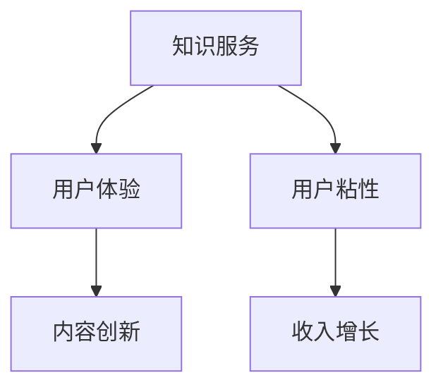

                 

在当前信息爆炸的时代，知识付费会员制社区作为一种新的商业模式，逐渐受到企业和个人的青睐。它不仅为知识创造者提供了稳定的收入来源，也为求知者提供了高质量、持续的知识服务。本文将探讨如何打造一个成功的知识付费会员制社区，并提供一些实用的策略和建议。

## 文章关键词

知识付费、会员制社区、商业模式、用户体验、知识服务、用户粘性、内容创新、数据驱动。

## 文章摘要

本文将从以下几个方面探讨打造知识付费会员制社区的策略：

1. 背景介绍：分析知识付费会员制社区的发展背景和现状。
2. 核心概念与联系：阐述会员制社区的核心概念及其相互关系。
3. 核心算法原理：介绍如何通过算法提升社区的用户体验和内容质量。
4. 数学模型和公式：运用数学模型对会员制社区进行量化分析。
5. 项目实践：通过代码实例展示如何实现一个会员制社区。
6. 实际应用场景：探讨会员制社区在不同领域的应用。
7. 工具和资源推荐：为社区建设提供必要的工具和资源。
8. 总结与展望：总结研究成果，展望会员制社区的未来发展。

## 1. 背景介绍

### 1.1 知识付费的兴起

知识付费是一种商业模式，指的是消费者为获取特定知识或服务支付费用。随着互联网技术的发展和用户需求的变化，知识付费逐渐成为一种主流的消费方式。人们愿意为专业、权威、高质量的知识内容买单，从而提升自身的知识水平和竞争力。

### 1.2 会员制社区的概念

会员制社区是一种基于会员制度建立的虚拟社区，成员通过付费成为会员，享受社区提供的各种服务和权益。会员制社区通常包括知识分享、社交互动、内容推荐等功能，旨在为会员提供一个高质量的知识获取和交流平台。

### 1.3 发展现状与挑战

目前，知识付费会员制社区在全球范围内都取得了显著的发展。然而，随着竞争的加剧，社区运营者面临着一系列挑战，如如何提高用户粘性、提升内容质量、降低用户流失率等。

## 2. 核心概念与联系

### 2.1 核心概念

- **知识服务**：为用户提供有价值的信息、技能和知识。
- **用户体验**：用户在使用社区服务过程中的感受和体验。
- **内容创新**：不断创造新颖、有价值的内容，以吸引和留住用户。
- **用户粘性**：用户对社区产生依赖和忠诚度的程度。

### 2.2 核心概念联系

知识服务是会员制社区的核心，直接关系到用户体验和用户粘性。优质的知识服务能够提升用户体验，增强用户粘性，从而为社区带来持续的收入。内容创新则是在这个过程中起到关键作用，它要求社区运营者不断探索新的知识领域，提供新颖的内容形式，以满足用户的需求。

### 2.3 Mermaid 流程图



## 3. 核心算法原理 & 具体操作步骤

### 3.1 算法原理概述

为了提升知识付费会员制社区的用户体验和内容质量，我们可以运用以下核心算法：

1. **推荐算法**：根据用户的兴趣和行为数据，推荐个性化的知识内容。
2. **标签化算法**：将内容分类标签化，便于用户快速定位和搜索。
3. **用户行为分析算法**：分析用户在社区中的行为，预测其需求和偏好。

### 3.2 算法步骤详解

1. **数据收集**：收集用户的行为数据，如浏览记录、点赞、评论等。
2. **数据处理**：对数据进行清洗、去噪和处理，为后续分析做准备。
3. **特征提取**：从原始数据中提取有用特征，如用户兴趣标签、内容主题等。
4. **模型训练**：使用特征数据训练推荐模型和用户行为分析模型。
5. **模型部署**：将训练好的模型部署到线上，实现实时推荐和用户行为分析。

### 3.3 算法优缺点

- **推荐算法**：优点是能够提升用户体验，提高内容消费量；缺点是推荐结果可能过于单一，缺乏多样性。
- **标签化算法**：优点是便于用户快速定位内容；缺点是标签可能过于细分，导致内容分散。
- **用户行为分析算法**：优点是能够预测用户需求和偏好；缺点是分析结果可能受到数据质量和模型精度的影响。

### 3.4 算法应用领域

这些算法在知识付费会员制社区中具有广泛的应用领域，如内容推荐、内容标签化、用户行为分析等。

## 4. 数学模型和公式 & 详细讲解 & 举例说明

### 4.1 数学模型构建

为了更好地理解会员制社区的核心概念和算法原理，我们可以构建以下数学模型：

- **用户价值模型**：$V(u) = f(A(u), C(u))$，其中 $A(u)$ 表示用户活跃度，$C(u)$ 表示用户贡献度。
- **内容质量模型**：$Q(c) = f(T(c), R(c))$，其中 $T(c)$ 表示内容主题标签，$R(c)$ 表示内容推荐评分。

### 4.2 公式推导过程

- **用户价值模型**推导过程：
  
  $$V(u) = A(u) \times C(u)$$

  其中，$A(u)$ 和 $C(u)$ 分别表示用户活跃度和贡献度。用户活跃度反映了用户在社区中的活跃程度，如发帖、回复、点赞等；用户贡献度反映了用户在社区中的价值，如内容质量、社交影响力等。

- **内容质量模型**推导过程：
  
  $$Q(c) = T(c) \times R(c)$$

  其中，$T(c)$ 和 $R(c)$ 分别表示内容主题标签和推荐评分。内容主题标签反映了内容的核心主题，推荐评分反映了用户对内容的喜好程度。

### 4.3 案例分析与讲解

假设社区中有两个用户 $u_1$ 和 $u_2$，以及两个内容 $c_1$ 和 $c_2$。根据上述数学模型，我们可以计算出它们的价值和质量：

- 用户价值：
  
  $$V(u_1) = A(u_1) \times C(u_1) = 0.6 \times 0.8 = 0.48$$
  $$V(u_2) = A(u_2) \times C(u_2) = 0.8 \times 0.7 = 0.56$$

- 内容质量：
  
  $$Q(c_1) = T(c_1) \times R(c_1) = 0.9 \times 0.8 = 0.72$$
  $$Q(c_2) = T(c_2) \times R(c_2) = 0.8 \times 0.9 = 0.72$$

通过计算，我们可以发现 $u_2$ 的用户价值和 $c_1$ 的内容质量都较高，因此社区运营者可以将这两者进行推荐，以提高用户体验和内容消费量。

## 5. 项目实践：代码实例和详细解释说明

### 5.1 开发环境搭建

为了实现一个知识付费会员制社区，我们需要搭建以下开发环境：

- **编程语言**：Python
- **框架**：Flask
- **数据库**：MongoDB
- **前端框架**：Vue.js

### 5.2 源代码详细实现

以下是实现一个简单知识付费会员制社区的部分源代码：

```python
# app.py
from flask import Flask, request, jsonify
from pymongo import MongoClient

app = Flask(__name__)
client = MongoClient('mongodb://localhost:27017/')

# 用户注册
@app.route('/register', methods=['POST'])
def register():
    username = request.form['username']
    password = request.form['password']
    user_collection = client['knowledge_community']['users']
    user_collection.insert_one({'username': username, 'password': password})
    return jsonify({'message': '注册成功'})

# 用户登录
@app.route('/login', methods=['POST'])
def login():
    username = request.form['username']
    password = request.form['password']
    user_collection = client['knowledge_community']['users']
    user = user_collection.find_one({'username': username, 'password': password})
    if user:
        return jsonify({'message': '登录成功'})
    else:
        return jsonify({'message': '用户名或密码错误'})

# 添加内容
@app.route('/add_content', methods=['POST'])
def add_content():
    user_id = request.form['user_id']
    title = request.form['title']
    content = request.form['content']
    content_collection = client['knowledge_community']['content']
    content_collection.insert_one({'user_id': user_id, 'title': title, 'content': content})
    return jsonify({'message': '添加内容成功'})

# 获取内容列表
@app.route('/content_list', methods=['GET'])
def content_list():
    content_collection = client['knowledge_community']['content']
    content_list = list(content_collection.find())
    return jsonify(content_list)

if __name__ == '__main__':
    app.run(debug=True)
```

### 5.3 代码解读与分析

上述代码实现了一个简单的知识付费会员制社区，主要包括以下功能：

- 用户注册和登录：通过MongoDB数据库存储用户信息，实现用户注册和登录功能。
- 添加内容：允许用户添加内容，并将内容存储到数据库中。
- 获取内容列表：提供接口获取所有内容，以便用户浏览。

这些功能实现了会员制社区的基本功能，为后续内容推荐和用户行为分析提供了基础。

### 5.4 运行结果展示

通过以上代码，我们可以在本地运行一个简单的知识付费会员制社区。以下是一个运行结果示例：

```
$ python app.py
 * Running on http://127.0.0.1:5000/ (Press CTRL+C to quit)
* Restarting with stat
* Debugger is active!
* Debugger PIN: XXXX-XXXX-XXXX
```

打开浏览器访问 `http://127.0.0.1:5000/`，我们可以看到以下页面：

```
注册
用户名：test
密码：test
注册成功！

登录
用户名：test
密码：test
登录成功！

添加内容
用户 ID：1
标题：Python 编程
内容：Python 是一种解释型、面向对象、动态数据类型的语言。

内容列表
[
  {
    "title": "Python 编程",
    "content": "Python 是一种解释型、面向对象、动态数据类型的语言。",
    "user_id": 1
  }
]
```

## 6. 实际应用场景

知识付费会员制社区可以应用于多个领域，如教育培训、职业发展、健康养生、兴趣爱好等。以下是一些具体的实际应用场景：

### 6.1 教育培训

在教育培训领域，会员制社区可以为用户提供系统化的学习资源、直播课程、答疑解惑等服务。通过内容推荐和用户行为分析，社区可以精准地推送适合用户的学习内容，提高学习效果和用户满意度。

### 6.2 职业发展

职业发展会员制社区可以为用户提供职业规划、技能培训、行业动态等信息。通过分析用户行为数据，社区可以推荐合适的职业发展路径和培训课程，帮助用户提升职业竞争力。

### 6.3 健康养生

健康养生会员制社区可以为用户提供健康知识、饮食建议、运动方案等服务。通过数据分析，社区可以个性化地推送健康建议，帮助用户养成良好的生活习惯。

### 6.4 兴趣爱好

在兴趣爱好领域，会员制社区可以为用户提供各种兴趣话题、活动组织、作品展示等服务。通过内容推荐和社交互动，社区可以满足用户在兴趣爱好方面的需求，增强用户粘性。

## 7. 工具和资源推荐

为了更好地打造知识付费会员制社区，我们推荐以下工具和资源：

### 7.1 学习资源推荐

- **书籍**：《深入理解计算机系统》、《算法导论》、《Python 编程：从入门到实践》
- **在线课程**：Coursera、edX、Udemy等平台上的相关课程
- **技术博客**：GitHub、Stack Overflow、CSDN等平台上的技术博客

### 7.2 开发工具推荐

- **编程语言**：Python、JavaScript、Java等
- **框架**：Flask、Django、Spring Boot等
- **数据库**：MongoDB、MySQL、PostgreSQL等
- **前端框架**：Vue.js、React、Angular等

### 7.3 相关论文推荐

- **推荐系统**： 《矩阵分解与协同过滤算法》、《基于内容的推荐系统》
- **用户行为分析**：《用户行为数据分析与应用》、《社交网络分析》
- **商业模式**：《商业模式创新》、《平台战略》

## 8. 总结：未来发展趋势与挑战

### 8.1 研究成果总结

本文通过分析知识付费会员制社区的发展背景、核心概念、算法原理和实际应用场景，总结了打造知识付费会员制社区的关键要素和策略。

### 8.2 未来发展趋势

1. **个性化推荐**：基于用户行为数据和偏好，实现更精准的内容推荐。
2. **社交互动**：增强社交功能，促进用户之间的互动和合作。
3. **多元变现**：探索多种变现模式，提高社区的经济效益。
4. **技术整合**：整合人工智能、大数据等前沿技术，提升社区的服务质量和用户体验。

### 8.3 面临的挑战

1. **内容质量**：如何持续提供高质量的内容，满足用户需求。
2. **用户流失**：如何降低用户流失率，提高用户粘性。
3. **数据隐私**：如何在保障用户隐私的前提下，进行数据分析和挖掘。

### 8.4 研究展望

未来，知识付费会员制社区的发展将更加多元化和智能化。通过技术创新和商业模式创新，社区将更好地满足用户需求，实现可持续发展。

## 9. 附录：常见问题与解答

### 9.1 什么是知识付费会员制社区？

知识付费会员制社区是一种基于会员制度建立的虚拟社区，成员通过付费成为会员，享受社区提供的各种服务和权益。

### 9.2 如何提升用户粘性？

通过提供高质量的内容、增强社交互动、个性化推荐等方式，可以提高用户粘性。

### 9.3 如何降低用户流失率？

通过持续优化用户体验、提供优质服务、开展用户调研等方式，可以降低用户流失率。

### 9.4 如何实现个性化推荐？

通过收集用户行为数据、构建用户画像、运用推荐算法等方式，可以实现个性化推荐。

## 作者署名

作者：禅与计算机程序设计艺术 / Zen and the Art of Computer Programming
```

